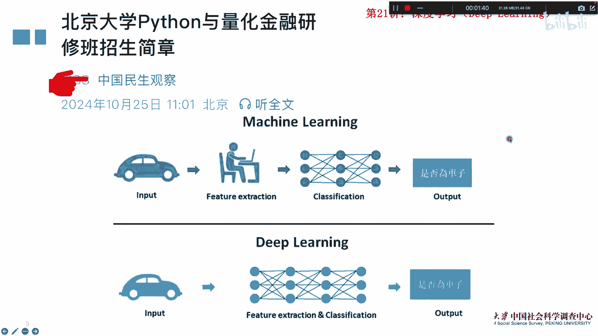
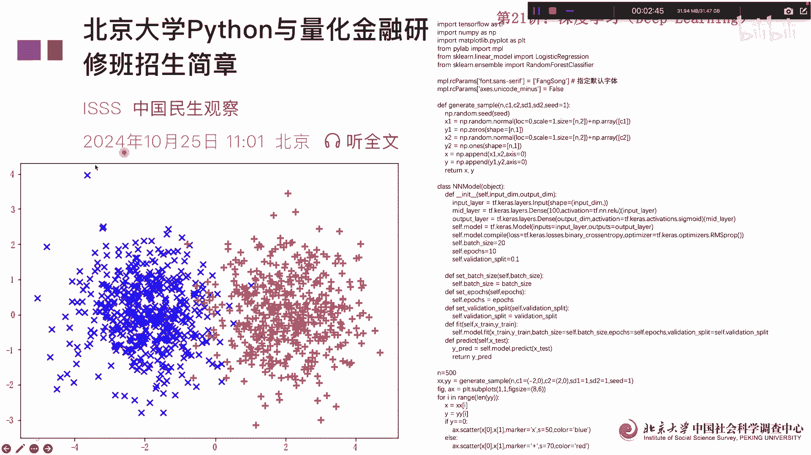
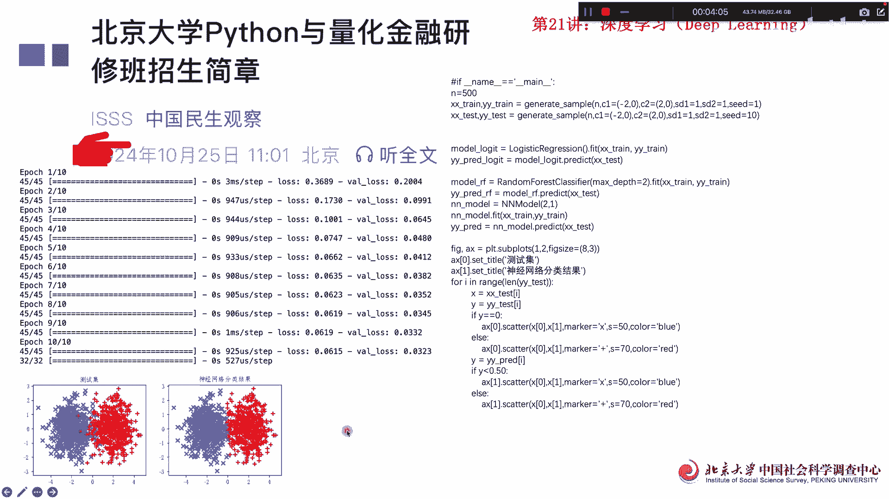
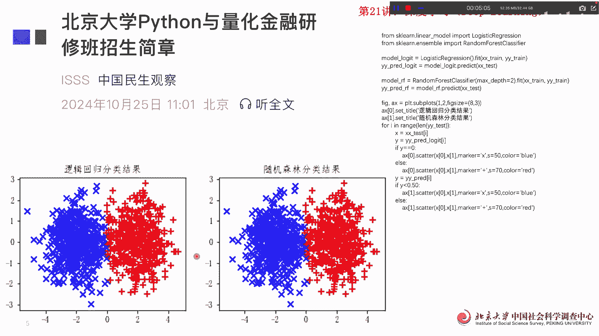

# 北京大学Python量化金融21讲：深度学习 - P1 - PKU顾佳峰 - BV1VEzUYYEPG

亲爱的同学们，大家好，我是北京大学顾佳峰老师，今天我们继续来讲，北京大学Python量化金融第21讲，在今天讲这一讲之前，我们首先要提醒大家，我们在本月13至15号。

在北京大学举办这个Python与量化金融研修班，第二期，那这个报名大家关于这个报名信息，可以看这个微信公众号，然后呢大家一定要记住，报名截止日期是12月7号，也就是本周日啊，这个一日期一定要记住。

那当然要报名的话就尽快抓紧了啊。

错过了这个就只能到明年了啊，然后我们今天来讲讲，这个是深度学习，Deep learning，深度学习在量化金融里面啊，应用很很，现在越来越多，现在比如说RAI金量化金融，就说人工智能量化金融。

其实很多下面的基本原理是深度学习，那深度学习的这个基本原理，大家可以看这张图，其实也很简单，比如说一个汽车，如果你是一般的学习的话，你还得人工的手段，把这个汽车的特征给抽取出来，然后再进行分类。

最后呢通过机器识别它是不是一辆车子，如果是深度学习的话，deep learning学习的话，那汽车它自这个计算电脑啊，自动的通过这个特征抓取，很锋利，变成了识别出一个结果啊，所以这里面就不需要人工的。

再去这个提取特征了，这就是深度学习跟机器学习的差别，那我们在量化金融里面呢。

就是我们要来进行分类啊，分类，那这边呢用一个语句写了，我们就是构造了成为构造了这个两种类型，这个我们可以看到基本上有两组，第一组呢这个左边的左边的是中心点，是二跟零，这个中心点产生了一个随机数啊。

围绕二跟零，右边的中心点围绕二跟零啊，这边产生一个随机数，所以呢基本上我们左边右边，但是呢在这个X轴为零的这个地方呢，它们是有重合的啊，你看红的有些在这边，这个这个颜色有些在这边。

所以我们的话做分类的话，嗯直观的看应该说X等于零轴是一个分类的线，所以就可以把基本总体上，把两个类型给区分开来，那这个呢，实际上就是我们深度学习的一个基本的应用啊。

以基本原理我们以这个例子，数据构造好以后呢，我们做什么呢，我们就来进行深度学习，深度学习其实分两个部分，一个是测试集，就是你用测试数据先来跑，然后呢再用这个神经网络分类嗯，这个这深度学习来跑。

我们语句这些卡跑完以后呢，我们可以看到他基本上呃，每每一次的这个跑的时间啊，损失啊，然后呢这些损失都可以计算出来啊，就是那我们同时呢它还会出现这样一个图，那两张图左边这边呢是测试集。

通过测试数据跑出来的结果，我们可以看基本上左右分分界线也是X等于零，这一组可以把右边呢通过神经网络分类结果，用神经网络分类结果来看，这个X也是等于零这一块，但是神经网络分离结果的结果。

肯定显然比这个测试剂要好，因为测试剂有些你看在里面，就是在X为零这方向里面，边界里面互相侵入，对方的边界的数还是有不少的，但是这边呢我们可以看基本上还是X等于零，这个边界里面这比较清楚的一个分界线。

分类线啊，那我们我们随后呢。

我们用这个呃逻辑回归分类结果，跟随机森林分类结构两个方法来做啊，两一个模型大家可以看一个是logic回归，一个是reading f这个这个分类啊，那基本上我们可以看罗杰斯回归的是图出来。

图是这个随机森林分类结果出来，指的是这个图我们可以看，基本上这两根的效果差不多，都是在X等于零轴进行分类，X等于零轴进行分类，效果差不多啊，也当然我们还有其他更细的一些指标，去看哪个模型更优。

但是在我们这个例子里面呢，基本上效果差不多，所以呢我们如果说用呃深度学习，deep learning来做股票数据的分类与预测，其实原理跟这个原理一样，就是用一种手段。

把不同的类型给他尽可能的区分开来，好我们今天啊这门课讲到这里，欢迎同学们啊来报名参加，我们上下周举办的python1量化研修班，第二期就北京大学举办的，还可以获得这个北京大学的相关的证书呃。

报大家一定要记住报名的截止日期是本周日，就是7号，所以大家报名的赶紧抓抓紧报名了，好我们今天这门课讲到这里，谢谢谢谢大家。

