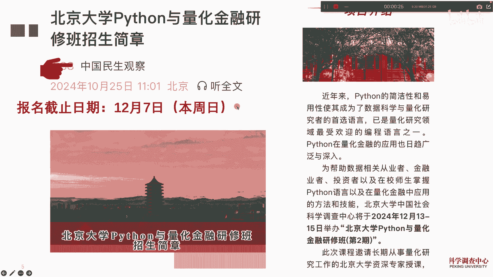
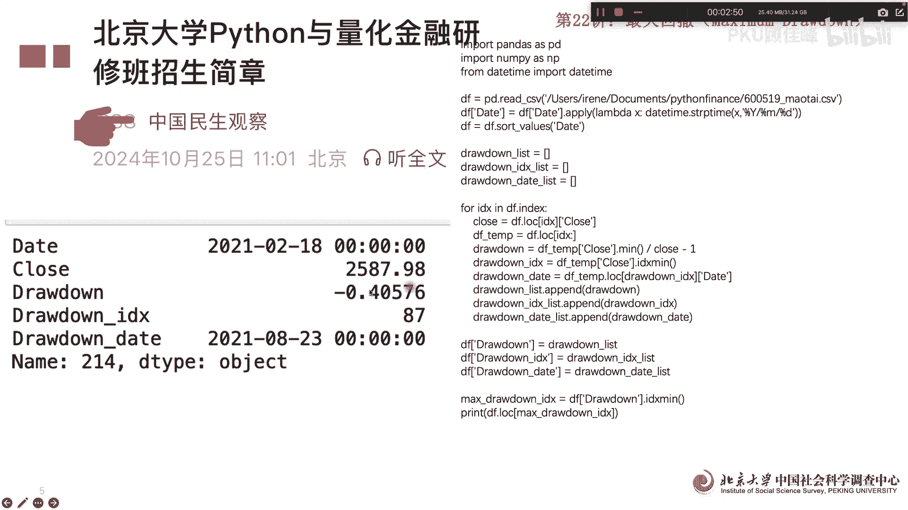
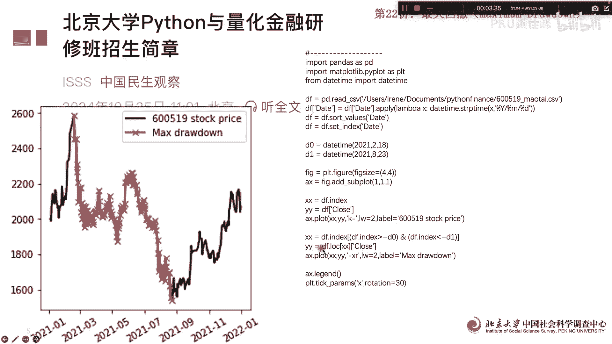

# 北京大学Python量化金融22讲：最大回撤 - P1 - PKU顾佳峰 - BV1ami9YTEtG

同学们大家好，我是北京大学顾佳峰老师，我们今天继续来讲，北京大学Python量化金融第22讲，我们这堂课呢就是这个月的十三十五号，在北京大学举办泰森一代化金融研修班第二期，那报名截止日期那就是7号。

本周日，所以大家要报名的就赶紧抓紧了啊，这个这个机不可失。

时不再来，我们今天要讲的是第12讲，最大回回撤，所以回撤呢大家都知道说你那个持仓以后呢，但是呢股票不断的价格往下走的时候，这个时候呢你就要撤出来资金，因为否则的话这个会损失更大。

那像这个往下走就是一个回撤区间，那最大回撤那就是您能忍受的他到什么点啊，你必须要测出来，否则的话你忍受不了呃，更大损失，所以呢我们金融术语叫最大回撤，就这个从最高点到最低点，这个点叫最大回撤点。

所以我们就要计算出最大回撤点是多少啊，什么时候应该回撤，那这方面呢我们用了一个呃数据，用茅台的数据，我们呢可以跑出来茅台数据日期还有收盘价啊，这个是每天的，我们可以看到这个波动率差不多是呃，0。

389嗯，波动率就是这样，就风险嘛，那如果我们以5年五五天为一个周期的话，也可以算啊，算出算出来以后那是40%一波动率啊，就是这这个我们就可以说出来，就是用茅台的这个历史数据来做演示。

那接下来我们就要看最大的回撤空间啊，最大的回撤空间的话，我们叫呃DRAWDOWN啊，maximum jddown就是最大回撤，我们呢就是以日期作为指引，我们可以看一下这个最大回撤的代码，其实也很简单啊。

我们主要是把这个呃给他算出来就好了，我们跑了这个语句以后呢，我们可以算出来这个日期，这是2月啊，2月18号开始进入回撤区间啊，然后那时候收盘价是这个收盘价，然后呢后面呢在这个时候呢。

你要最大回撤点呢是在8月23号啊，就这个区区间就是回撤点区间啊，嗯嗯回撤的那个幅度呢呃41%啊，就是你股价损失到41%的时候，你必须回撤，这个就是一个最大回撤点，那我们可以看一下日期也确定啊。

但我们可以把它图示，因为这样看出来大家可能还不太清楚。

那我们可以把它画图画出来啊，画图画出来，我们可以就很明显的看出来，这个是整体的股股价趋势，然后红色的就是额回撤区间，那你最大的回撤区区，最大回撤呢就是从这一点最高点往下算啊，这些都是回撤区间。

到了这到了这一点，我们可以看这是个最大的回撤回撤嗯，最大回撤当然你在中间都可以回撤，不是说一定要等到这个点进行回撤对吧，我们最大回撤区间算出来以后呢，比如说你你在这个点可能就回撤啊。

或者这或者这个点进行回车啊，这些都可以，或者那我们就就就这堂课。

我们就讲到这里，这个大家要报名就要抓紧，我们这个报本期课程报名截止日期是7号，也就是本周日啊，这个呃欢迎同学们来参加我们本期课程好。

