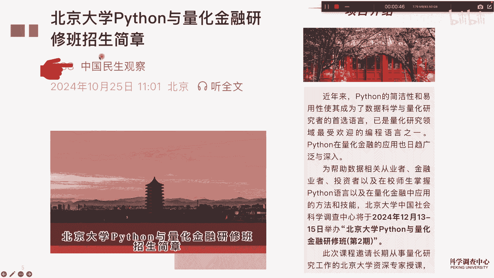
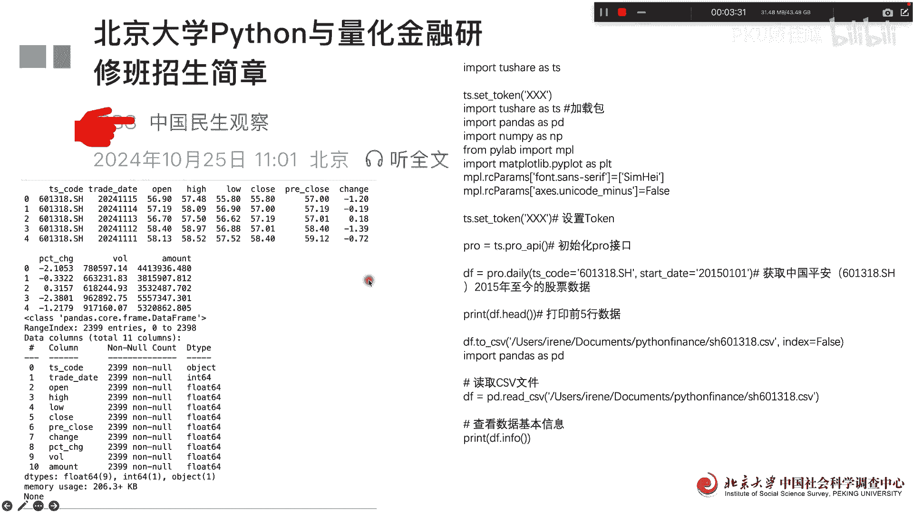
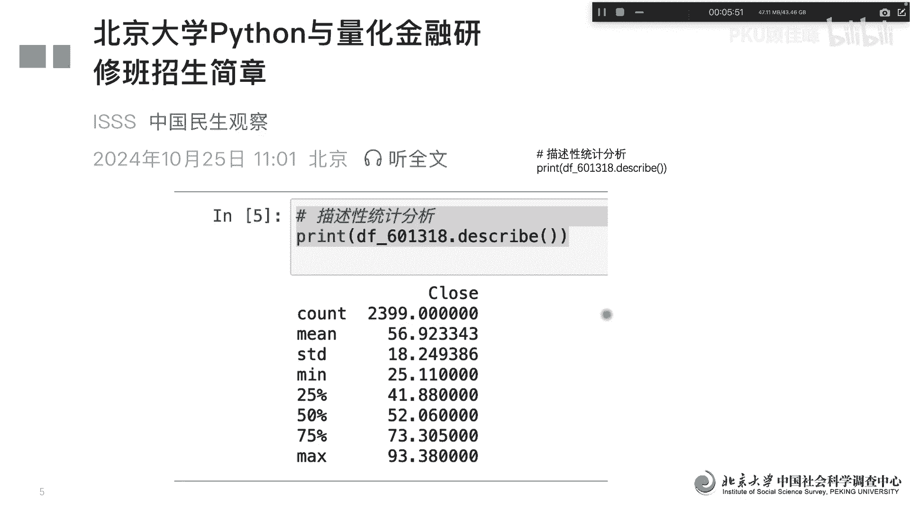

# 北京大学Python量化金融第20课 - P1 - PKU顾佳峰 - BV1UYUkYcEb5

亲爱的同学们，大家好，我是北京大学郭嘉峰老师，今天我们继续来欣赏北京大学Python量化金融课，今天是第十二十讲，那我们为什么今天要讲这门课呢，是因为我们北京大学啊，在下个月12月13至15号。

在北京大学举办潘森一家华金融研修班第二期，因为第一期开个开过之后，同学们很多想继续学问，什么时候继续开来询问，所以我们在年底就要下个月举办，这第二期的课程，也希望同学们能来关注跟报名，这怎么报名呢。

大家可以看这个微信公众号上面的。

有具体的关于个人这门课程的报名的信息，那我们这第20课呢，我们来学点什么呢，我们实际上来学学点呢，就是一个呢还是怎么来下载数据，我们很多同学啊，这个首先他要获得股票的数据，那股票上的数字是的话。

我们主要用的是特效这样一个，然后呢你要在通讯注册一下，有一获得这个下载的一个码，才肯你把这个码输入进去，然后调出特效，然后调出paddles那派，然后做日起来，巴拉巴拉这些都可以调出来，调出来以后呢。

这个你就可以直接输入某个股票代码，比如说我这个例子，输入的是中国平安的股票代码，然后呢就把它输入进去，然后我要获取15年1月1号到现在的数据，然后打印出前五行，我们看一下，然后呢输出数据以后呢。

就把它存在本地电脑上面，存在这个文件上面，这样他就保存到本地电脑了，所以以后要调用的话，就是直接读取以后读取，从本地电脑上读取这个CSV文件，就可以调用出来，调用出来我们就要看print。

看一下这个数据的信息，我们看一下前面，因为我们已经说要打印前五行的数据，我们实际上数据看到的是这样啊，因为我们是2015年1月1号到现在，那最近的一个交易日期呢是11月15号，就是上周五。

所以我们可以看到上周五的开盘价，最高价最低价闭盘价，然后呢这这这这这些信息我们都可以看到啊，然后呢14号13号，十十二号，11号，实际上一直到后面，一直其实到2015年1月1号。

当然我们这边是打印了前五个就出现这个记录，那然后呢我们再看一下这个数据的信息啊，这这这数据的信息，我们可以看到这个他有这些变量啊，总共有11列列的都是有这些变量啊，总共是观察值2399个啊。

然后呢这个类型的基本上就是这些类型啊，除了这个code是object之外，其他其实都是这个是这是额，这是整数型，这是有小数点的数值型，然后这些变量的情况我们就可以看到啊，在看到之后呢。

实际上我们最常用的是做什么的，因为刚才讲了有11列数据，其实有些数据类我们不需要，我们不需要的就可以把它删掉啊，然后对里面的数据的名称进行重新命名，比如说我们重新命名了这个这些名称啊。

然后呢把时间具体时间转化为这个时日期，时间格式啊，转化为这种格式，这个时间转化为YMD格式叫年月日啊，然后呢还要改一下，设置一下索引啊，以时间为索引呃，改变呃，变一下这个时间日期啊，1月5号开始。

把改变以后再把它保存到这个文件里面啊，我们可以看到print，它基本上就看出来是这样一个日期，然后呢具体的股价啊，所以这样就看到了呃数据，那那我们很常用的就是它的那个呃折线图，价格的折线图。

我们这边用的收盘价格的折线图，我们可以看2015年1月1号，到到到到现在对吧，到上周五整个价格走势是这样一个价值，并盘价走势是这样，这段时间的，就应该是那个国庆节期间的这一波这一波啊。

所以整个我们可以看到出来，但是这个价格走势呢大家可以用PON之，它这个都是中英文啊，英文所以我们就可以把它改成中文，中文怎么来改呢，中文我们就设定一些中文的字符，然后我们把这些设定出来以后。

就可以用中文的，比如说中文改成这个图的名称，中国平安收盘价格，你这改成中文，然后这个收盘价啊，这个改成日期，我们这样就改好，再这样的话看起来就更顺啊，然后呢我们要对数据的整个进行描述一下。

我他会告诉你总共有2399个观察值，然后均值是56，然后标准差18点，巴拉巴拉，最小值最大值啊，分位数它就都可以告诉你，这样我们对中国平安的15年1月1号，到现在的股市价格有个基本的描述呃。

我们参加这门课的话，可以获得我们北京大学的证书，那这个证书还挺管用的，因为很多同学获得证书以后给我们反馈，说他的保研申请出国啊，甚至找工作，他就作为一个重要的说明材料，对他们都很有帮助啊。

所以大家也可以来继续来学习，那最后呢还是欢迎大家来参加这门课，报名这门课啊。