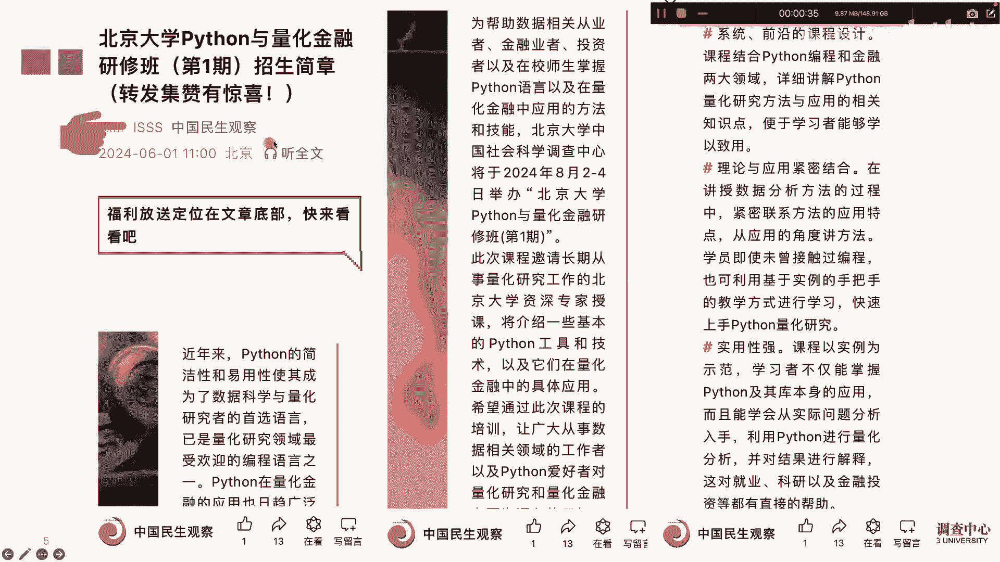
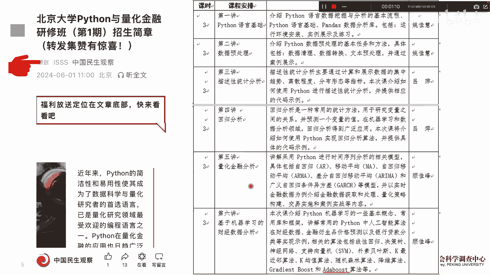
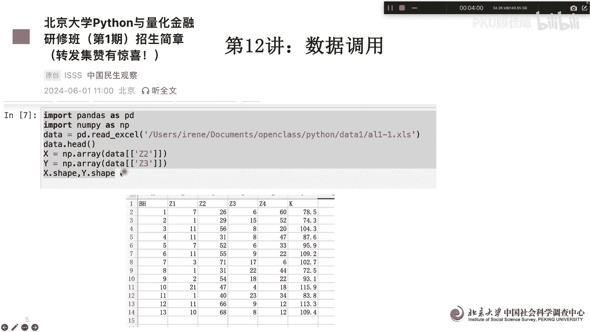
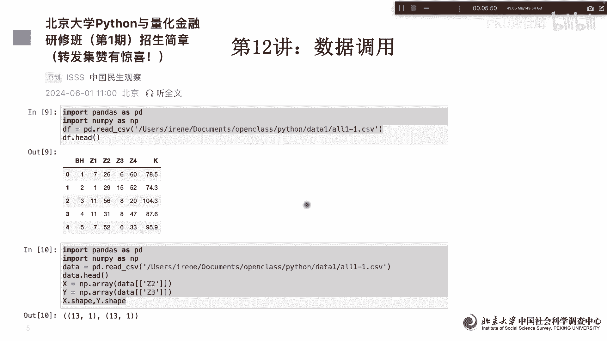

# 北京大学Python量化金融课12讲 - P1 - PKU顾佳峰 - BV17Z421g7dZ

亲爱的同学们，大家好，今天是端午节，首先祝大家端午节快乐，我是北京大学顾佳峰老师，今天我们继续来讲北京大学Python量化金融公开课，那今天我们来讲第12讲，那为什么今天要我们继续来讲呢。

是因为北京大学这边呢，在8月2号至4号举办Python与量化金融研修班，这是第一期啊，同学们有兴趣可以来报这个班啊，怎么了解呢，大家就看这个关注。

这个里面有关于课程的详细信息，那这个课程呢前面呢讲Python的一些准备啊，那后面呢两部分我来讲讲量化金融的一些应用，以及量化金融模型和财经数据分析，那总共课程，因为只有三天的时间呢。

主要是想给同学们啊，对Python量化金融分析，有一个大致的入门级的这个引导，这样呢有这些基础呢，以后可以往更高级的课程啊来发财。

那其实第12讲我们还要回归到最基本的，比如说用Python怎么调用数据，实际上量量化金融呢，只不过是我们量化金融的数据呢，一般用比如说股票数据，期货数据啊，期权期货交易数据，利这个额汇率数据等等。

它实际上结构成的数据呢，就是这些数特定的数据，那特定数据一般转化为excel表或者CSV版表，那所以我们就要了解Python调用excel表或CSV，文本的时候怎么来用啊。

那比如说我们例子中的它excel表呢，主要有这些变量，12346个变量，然后呢13个观察值，观测值组成，那我们用Python读呢，Import pandas as pd，我们把pandas简写成PD啊。

important npis np啊，把它南派简写成mp，然后呢读取数据呢，DF等于pd点red下杠excel，这说明Python要读取excel数据了，那读取excel数据呢。

前面因为我是Mac就苹果的电脑，所以前面的这个路径，你得告诉他这个数据放在哪里，这些都是路径，然后呢后面就是excel表的数据名啊，这个格式以后呢，然后呢DF就定义好了，定义好以后，你就DF点head。

这样就开始读取这个数据，我们可以看到它读取的是前五行的数据，在这个例子中我们可以看到对吧，然后呢这些变量12345嗯，我这个前五行的数据就读出来了啊，他其实多了一个呃，Python自带的一个ID变量。

零从零开始，01234啊，我们可以看到，那这样的话excel表就读出来了，那另外如果你要想看一下，这个里面到底有多少个观测值呢，那你就前面都一样啊，前面都一样，data只不过data读。

我们把这个excel读到data里面，Data head，然后我们定义两个变量啊，一个是MP叫MP，他的array就是那个，然后从data里面读出C2这个变量，C2啊，赋值为XY呢。

cc ca3这个变量读出来，然后我们要看一下它这个形状啊，X点shy点shift。

然后看一下形状嗯，形状出来的实验是13。110311031，也就是说它是一个变变量，有13个观测值，X变量有13个观测值，Y变量有13个观测值，这个都一样，那我们接下来读呢CSV格式。

CSV格式也是那个量化兼容常用的数据格式啊，可能其他都一样，只不过后面的下斜杠CSV变成了下斜杠CSV，然后括号巴拉巴拉巴拉啊，前面路径后面的叫CSV的前面的这个名称啊，然后后面出来就行了啊。

这这这这这些这些这些这些这些都出来了啊，然后下面呢下面呢嗯同样的我们要了解一下，同样是555个五行嗯，我们同样要了解一下XYX点shop，Y点shop，然后呢投出来十三十三就13个观测值，X变量。

一个变量，13个观测X变量，所以我们可以看到说既用Python做量化金融的话，其实实际上你是把那个财经数据啊，存在excel或CSD格式的文件中，然后呢用Python调用这个隔界这样的数据。

然后呢在Python中进行了一些分析模拟或策略分析，那最基本的一步就是你的调用出这个呃，相关的财经数据，所以我们今天呢就把回到基础跟同学们讲，因为很多学Python量化金融的。

他这个Python基本的他也不熟啊。

所以我们前两堂课都是在讲Python啊，好今天我们这个课就讲到这里，谢谢拜拜，希望同学们来参加，我们8月份在北京大学举办的这个，Python与量化金融课呃，研修班啊。

