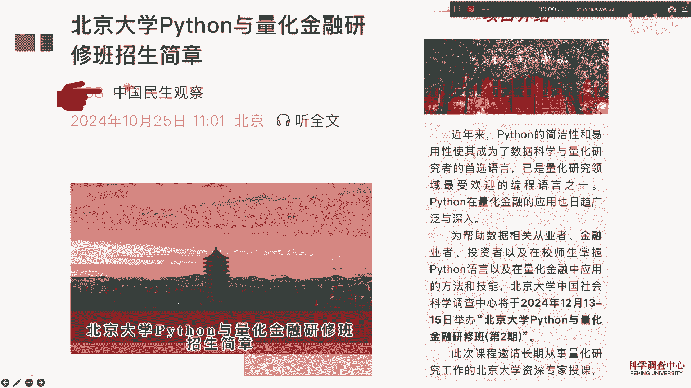
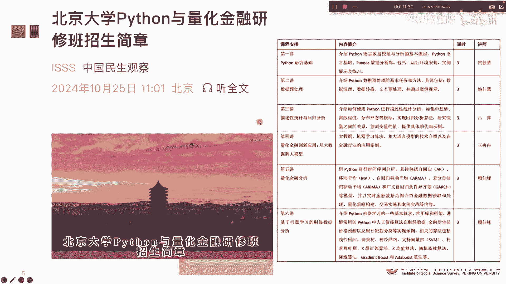
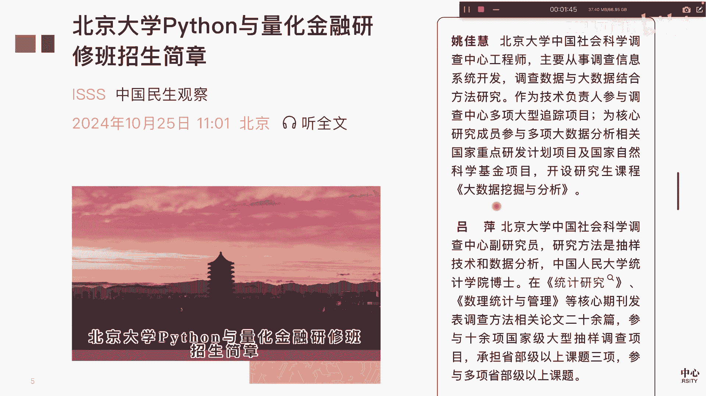
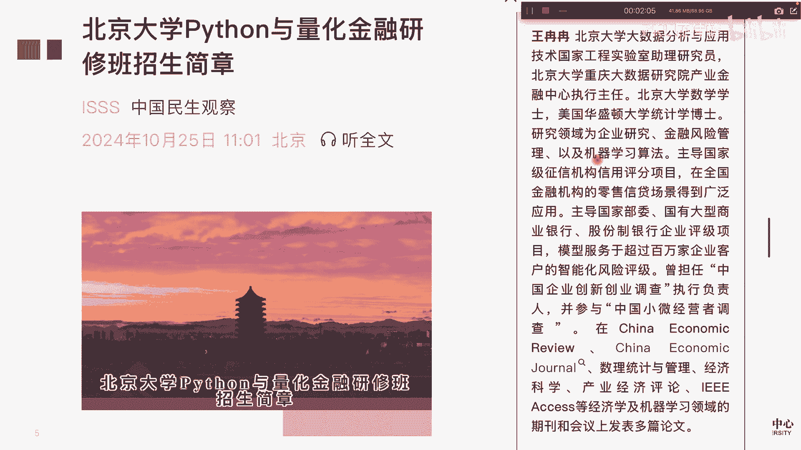
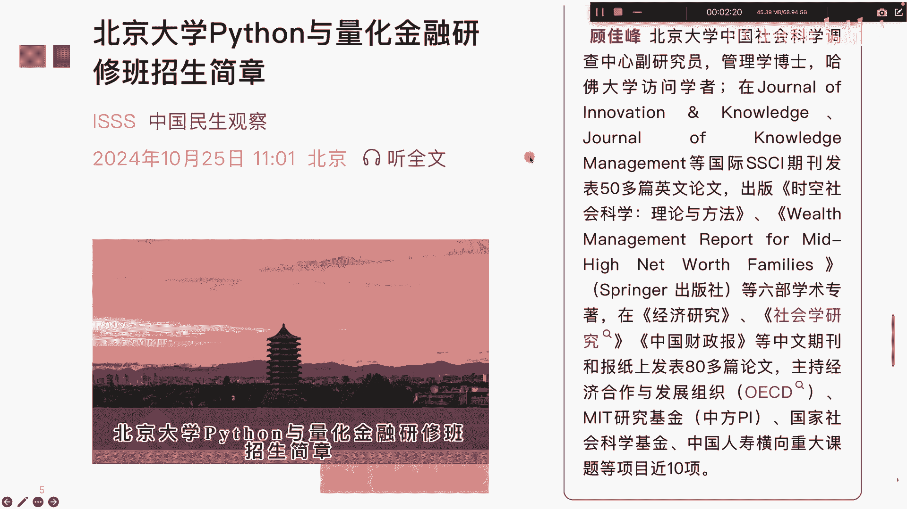

# 北京大学Python量化金融课招生了 - P1 - PKU顾佳峰 - BV14W14Y3ENh

亲爱的同学们，大家好，我是北京大学顾佳峰老师，今天我们来介绍一下，北京大学Python量化金融班第二期，现在已经隆重开始招生了，所以同学们如果对Python量化金融感兴趣的，都可以抓紧报名了。

那这个呢我们可以看一下这个招生简章，已经发布了，时间呢是在2004年12月13号到15号，在北京大学举办Python量化研金融研修班第二期，那因为第一期这个大家非常踊跃。

那很多尤其国庆节这波行情也非常的大，那很多的同学提出来希望来报名参加，那我们的呃在是今年年底开了最后一期啊，这这期所以大家有兴趣赶紧报名，怎么报名呢，大家看这个微信公众号。

如果大家关注这个上面关于招生简章，具体信息，报名信息都在上这上面的。

那大家可以看一下，然后呢课程内容其实三天六讲，前面三讲呢实际上主要是讲PAPENT，一些这个介绍，那后面三讲呢主要是量化金融，从大数据到大模型，就是量化金融，大数据大模型的一些呃具体应用的案例。

那后面两讲呢由我来讲叫用Python做量化金融分析，还有那个机器学习做量化金融分析啊，所以我们三天六讲课程也非常的紧凑啊。

他这个大家可以来关注这个去了解报名信息，那姚佳慧老师跟吕萍老师呢，都是北京大学中国社会科学调查中心呃，这书记Python挖掘方面非常有经验的老师，统计方面也非常的强。

这个王冉冉冉老师呢，也是我们北京大学大数据分析英语技术，国家工程实验室的老师啊，也是咱们北京大学重庆大数据研究院，产业金融研究中心的执行主任啊，他呢在量化金融的大数据大模型。

大语言模型里面呢有非常好的经验啊。

那我们也把他邀请过来讲，那我呢也是会讲Python量化金融的最后两一天，一天的课程两讲，那这方面的也会给大家来进行交流和探讨啊。

那这个学习完以后，大家还可以获得北京大学的职业证书，这个职业证书也是挺有用的，很多这个保研啊，保博啊，甚至出国申请找工作，他都把这些证书啊作为那个补充材料啊，据学员反馈说很有帮助。

那关于这个课的报名信息，大家就看这个微微信公众号，这个招生的具体信息都在上面啊，欢迎大家留意这个微信公众号去查询，那也欢迎大家呢来报名，抓紧报名来，因为怕人数太多啊，因为有人数限制。

那好今天我们就讲到这里。