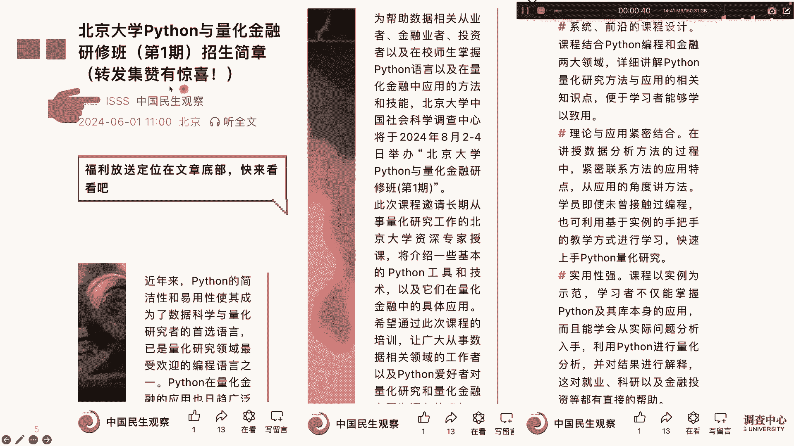
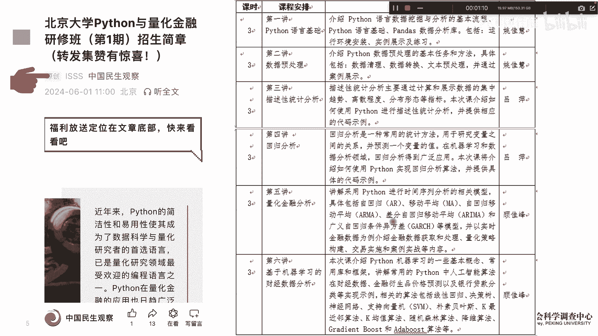
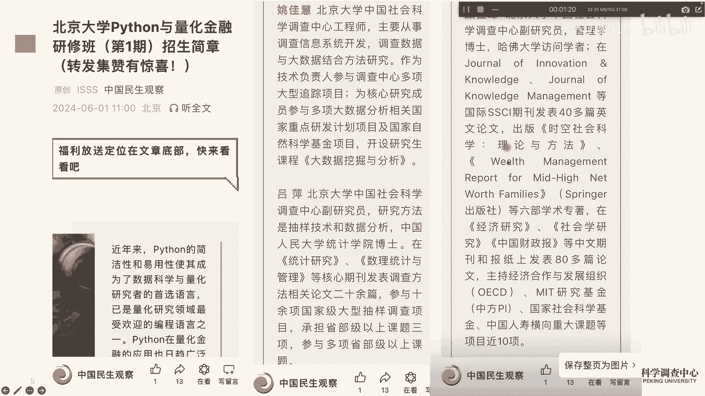
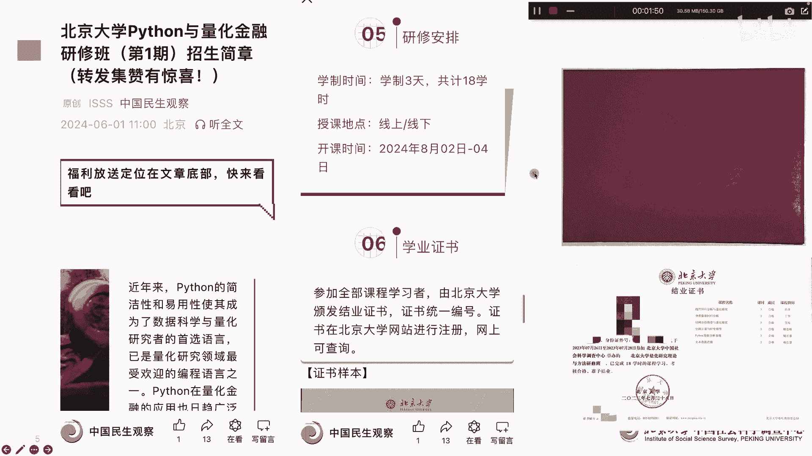
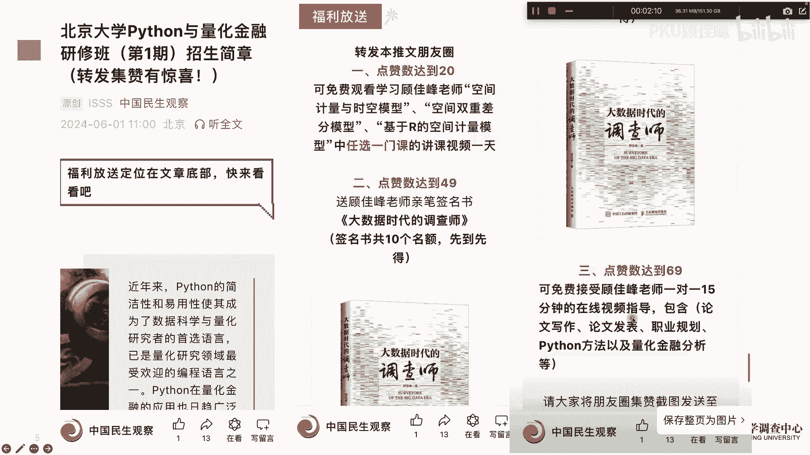

# 北京大学Python量化金融课招生啦 - P1 - PKU顾佳峰 - BV1xm42157hB

亲爱的同学们，大家好，我是北京大学顾佳峰老师，今天我们来给大家介绍，北京大学Python量化金融课招生了，这是一个非常好的消息，因为很多人啊都希望到北京大学来学Python，以及量化金融。

那这门课呢主要是在8月2号至4号，在北京大学举办啊，这这个这门课啊有很大的特点啊，我们可以看理论结合，实用性很强，前沿设计，所以呢这个有助于同学们更好的学习Python。

以及如何用Python来做量化金融，那相关的信息大家可以关注这个，然后里面呢可以看到这门课的课。

程的详细的信息，那另外呢这门课的内容呢，我们一因为是一方面是学Python，一方面要用Python来做量化金融，所以呢前面几堂课是Python的基础，然后后面呢关于Python的一些嗯，嗯统计模型。

那最后呢一天的课程，我们可以看到，量化金融一致在财经数据上的应用，所以呢基本上能适合，比如说基本Python基础比较差的同学。

以及能直接应用到量化金融方面来，那老师呢一个是姚佳慧老师，一个吕平老师，一个就是本人啊。

我我亲自来讲嗯，然后这门课呢上课时间8月2号至4号，总共三天啊，分线上跟线下啊，线下呢你就到北京大学来上课，那有些同学来不了，北京大学可以选择上课，线上上课嗯，同步直播内容一样的，那学完以后呢有证书。

那这个证书呢对同学们很有用，因为有些生深研保研啊，考博出国甚至找工作啊，他都会做一个补充材料啊。

非常，我们的信息在这上面公布，那这里面呢大家转发也会有一些优福利啊，包括书我签名的证书，还有呢因为很多同学想咨询郭老师相关的情况，所以呢也可以提供顾老师。

对同学们的一对一的这个视频指导好，最后呢欢迎大家来北京大学上这门课，我们在8月2号至4号在北京大学，不聚不不见不散，好今天讲到这。

