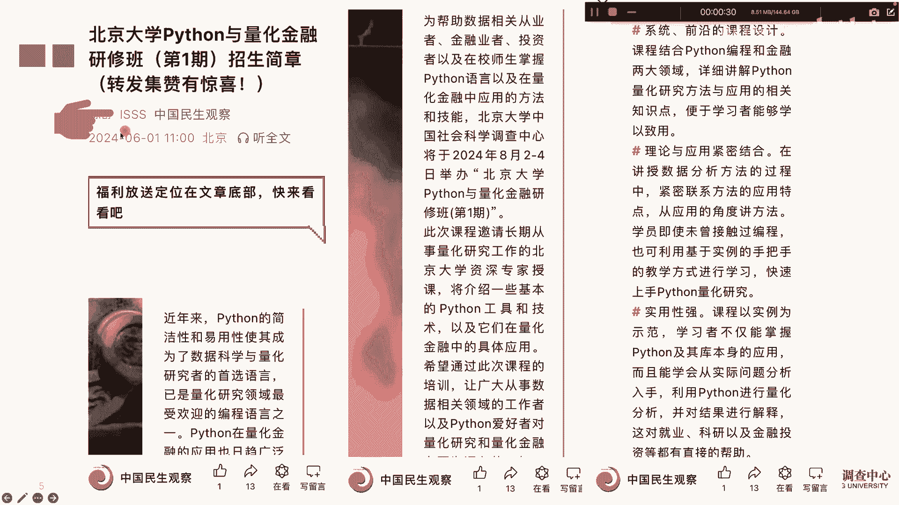
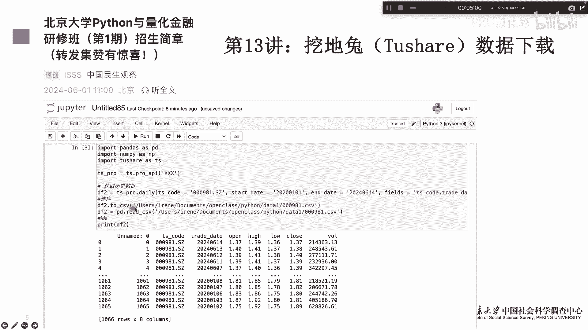
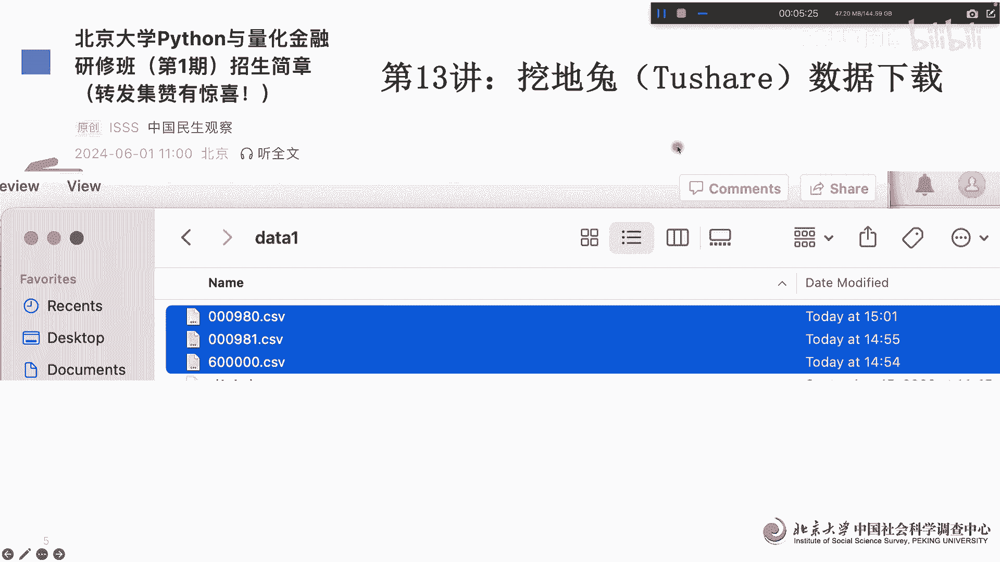

# 北京大学Python量化金融课第13讲 - P1 - PKU顾佳峰 - BV1yJ4m1M7sX

亲爱的同学们，大家好，我是北京大学顾佳峰老师，我们今天继续来讲北京大学Python量化金融公开课，我们讲这个课呢，主要也是帮助大家来学习Python一样化金融，那北京大学这边呢在8月24二号至4号。

同学们有兴趣可以去报名参加，那具体报名信息大家可以关注这个啊，上面有详细的关于这个课程报名信息啊。

那我们今天来讲第三讲，第第13讲，量化金融公开的，第13讲就是讲我们怎么去获得实时的呃，金融信信息，其中呢很在Python里面很重要的一个工具就是挖地，two叫特效这个这个数据啊，这数据里面非常全。

那我们呢首先要把它的相关的数据下载下来，下次下来以后我们才能做各种的曲线分析，技术分析，还有趋势分析，还有策略，策略模拟给预测，那我们呢用九比特呢把它下载下来以后呢，大家可以看，其实语句很简单。

一个呢import pandas，而pandas呢这个import一下，同时呢import np，其实第三个很重要，叫input to show is ts，如果大家没有装呃，脱秀这个数据库的呃。

这个的大家可以pip install脱秀，然后呢把它装装在装进来，装进来以后你就可以用import，然后呢我们要获取数据呢，首先你要在这个特效这个网站上，注册一个有一个码数据的码。

这个具体因为我我注册过，我就用xx来代替他，每个人都唯一的，你注册一下免费的，他在网站里面就有一个很长，很长的这个位数的码，你把它下载下来作为接口的码，把它用这个语句放在里面。

这样呢他就知道要通过这个接口来获取数据，然后具体怎么获取数据呢，也很简单，DF一下TS像杠pro啊，daily就每天的，然后后面的tess code是就说你选择哪个股票，比如说我用上证指数的六千千呃。

60000这个股票，然后呢start date从哪一天开始，我从2020年1月1号开始，end date从哪一天结束，我们我从二零2224年66月14号，然后具体的这个后面的呃有哪些需要哪些指标。

其实用的是tess code，Transdate，Open high low clothes，不交易量啊这些指标，然后呢我们逆序一下啊，把它这个逆序一下，然后呢把它保存到保存到这个这个本地电脑。

这个都可以保存啊，嗯用index等于，那就说我们不需要索引，但是呢你要用这个呢就是里面有索引啊，然后呢我们DF一下DF就read，用Python把它读出来，就pd read c b AC s v呃。

这个文件就出来了，print一下我们就可以看到，你看他是这个从2020年卡1月2号开始，到到2020年6月14号，就昨天啊，然后开盘价这些最高价这些啊，最低价这些币，官盘币盘价这些。

然后交易量啊这些这都都有啊，所以我们可以看你有历史数据，已经保证在你的本地牌上了啊，那同样的我们也是同样的方法，比如说我们要调取000980，深圳深交所的数据啊，我们就用同样的方法。

然后可以做一下这个这个这个做法，然后这里面呢实际上就是用逆序啊存到这上面，我们可以同样可以看到啊，这个不同的年份的数据，预计到2024年6月14号，那因为他前天这些可能是是那个修盘。

所以前面没一些没数据，后面的都有啊，那那另一只另一个呢，我们也可以随机交上000981啊，这个股票也是一样啊，同样的我们可以看到这个，这个数据啊数据的情况啊，我们都可以这样。

我们基本上可以把呃每一只股票的，从你想要的时间段的，它的历史数据都可以抓取下来，抓取下来以后呢，你就可以进行模拟预测分析，策略策略分析，策略回补等等，这些也就是所有我们现在关于量化金融。

Python的一些分析，其实都是建立在历史数据基础上的，那第一步，你也就是说你就需要把这个历史数据啊，先给他抓取下来，存到你的本地盘，那这里面的时候主要是采用的是CCD格式。

你也可以把它存到excel格式。

那也是也是可以存的，那最后呢我们可以看到，在我们本地盘上就多了这个三个CSV格式，CSCV格式数据文件，那这些文件就是我们刚才通过上述Python的程序，从那个挖掘two里面找出来的啊。

挖掘two是这个特效，特效是一个非常常用的一个数据库，也是免费的。

嗯那好，那欢迎大家来报名，我们北京大学在8月12号至4号呃，举办的Python量化金融课，我们教授在美丽的北京大学见啊，今天我们课讲到这里。

