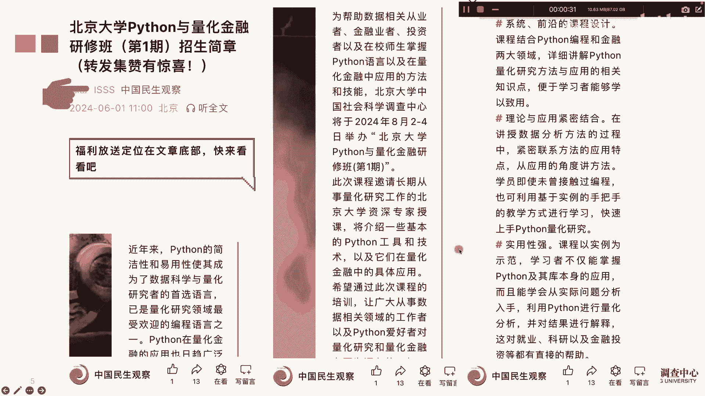
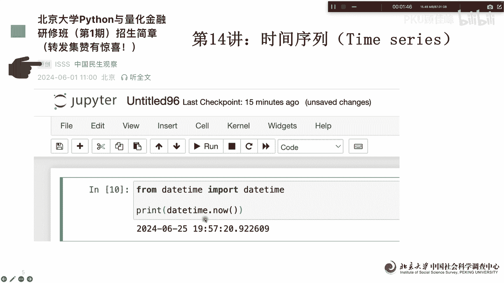
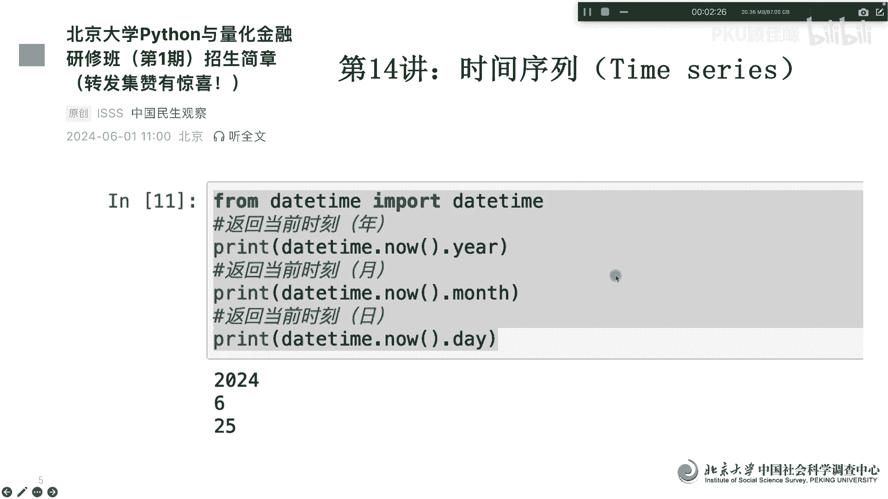
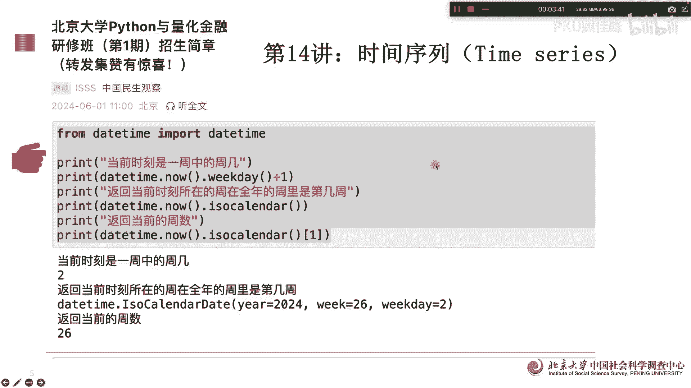
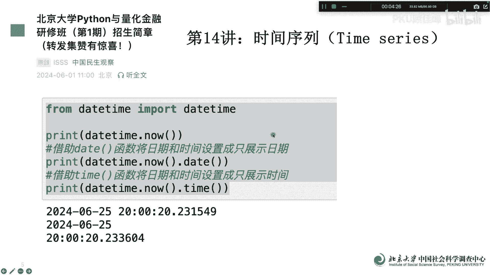
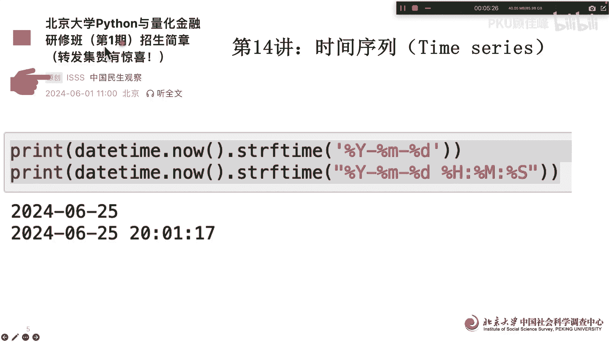

# 北京大学Python量化金融课第14讲 - P1 - PKU顾佳峰 - BV1AS411A787

亲爱的同学们，大家好，我是北京大学郭佳峰老师，今天我们继续来讲北京大学Python量化金融公开课，那我们呢在下个8月2早7号，我们在北京大学举办一辆泰森一，量化金融研修班啊，这个课主要是有很多的特点。

那是因为了这门课呢，大家如果感兴趣可以关注这个，然后呢了解课课程详细信息，那我们在上课之前呢，先对于Python。

你然后进入一些课做一些简单的介绍啊，作为帮助大家做一些补充，那我们今天呢来讲讲时间序列，实际上啊用Python做量化金融分析，实际上量化金融数据就是时间序列数据，比如说我们的股票价格，期权价格呃。

汇率价格都是根据时间波动的，那我们要用Python来建模型或进行策略分析，那实际上就是对于这些股票价格，期权价格，期货价格，还有利率汇率进行的一些时间序列的分析，那首先我们就要来做Python的。

时间序列的这个这个这一些基本的格式，首先呢时间序列跟时间有关，那我们在Python里面呢大家主要用那个date time，Import data time，这个呢我们就可以得出时间的格式。

比如说这两句我们呃出来以后呢，我们问现在是什么时间，那他就告诉出来，结果二现在是2024年6月25号呃，七晚上07：57分20点，这非常精确啊，这个是是郭老师刚才做PPT的时间点，所以你任何的时间点。

你都可以用用这个这个函数额来做，那另外呢还你而且可以对于每个时间更加清，具体的来来返回，比如说呃from daytime，Import day daytime，然后呢你返回什么，今年是第几年。

这是第一个print daytime now，嗯年份月份天数，按照这个格式它就可以输出出来，我们这三四个四个语句，咔一回车，就是现今天是2024年6月25号，这样呢他这个当现在的时年月日就出来了。

那我们还可以问问，比如说当前时刻是一周中的周几，就礼礼拜几，那另外呢当前时刻在所在的这一周，在是全年的第几周，因为11年有50多周嘛对吧，然后这也可以问，还有可以问返回当前的周数啊。

这这实际上是全年的周数，我们可以看到他你这么一一回车的话，他就告诉你今天今天是一周中的周二，礼拜二，就是今天就是礼拜二，我们就知道了，然后呢就这一周我这一周在全年的周数里面呢。

他就告诉你全年是2024年，这一周是20第26周啊，从1月1号开始，那一周开始是现在已经，今年已经过去了26，第26周了，然后呢，第是第26周的多少天，周二，那你看就根据这个语句。

把今天的在全年中的时间算出来，返回当前周数26周啊，我们我们用这个语句简单的就确定了时间。

那另外我们可以对输出的格式进行调整，进行进行调整啊，明确，那比如说呃呃首先我们呃print daytime now，它就输出以后，输出以后呢，我们现在呢只要date，只要就哪一天啊，不要时间。

你就用这个，然后呢后面呢我只要时间不要贴，那你用这个就后面实际上就是点data括号，或者点TT括号，咔一会再出来这个呢年月日时间，然后这个呢第二个只出了年月日，第三个呢只出来时时间啊。

所以这个呃实际的格式。

我们都可以来进行确定啊，那最后呢我们还可以用字符串的方式来确定，年月日年月日时间啊，到苗啊，我们后面苗后面呢就没了啊，所以呢用这个啊这个this time语句呢，这么就可以做，做出来呢就是这样一个格式。

好我们今天呢实际上就讲了嗯，时间序列，时间序列量化进入里面的，时间序列里面最核心的一个就时间怎么标注啊，那时间标准很重要，因为我们在后面量化金融课里面呢，会以以时间索引时间。

所以时间格式是非常基本的一个内容，那我们今天呢用很简单的语句，用date time这个这个来给大家演示，具体的时间输出的格式跟内容啊，好我们今天这堂课先讲到这里啊，欢迎大家关注，欢迎大家关注这个啊。

