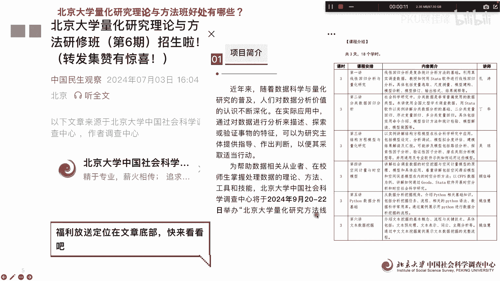
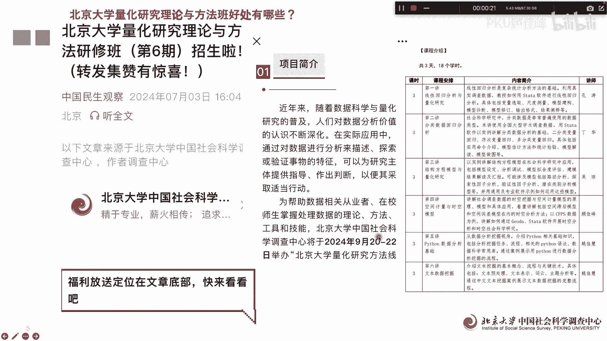
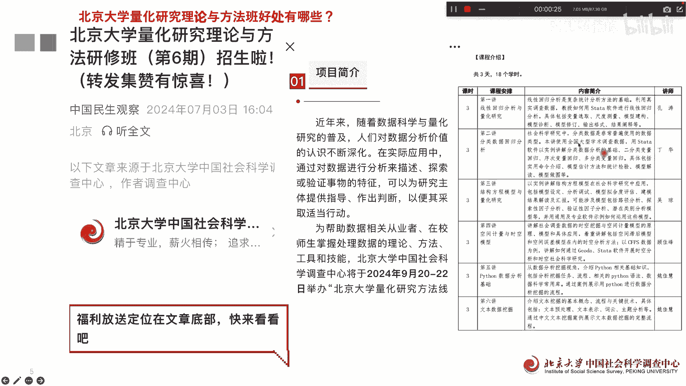
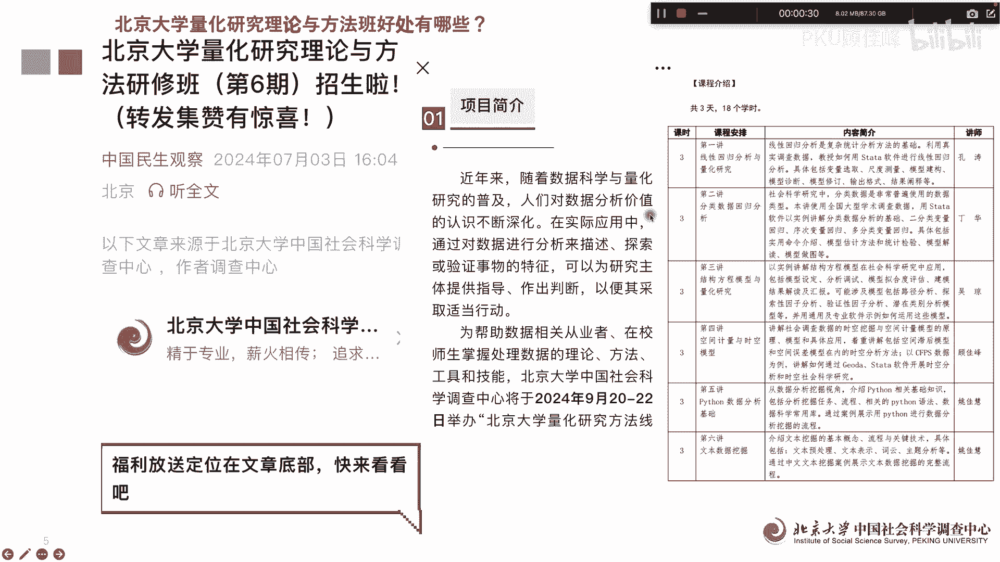
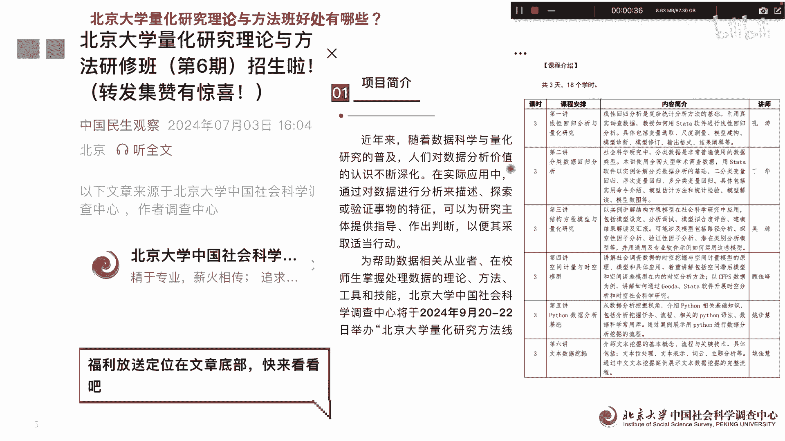
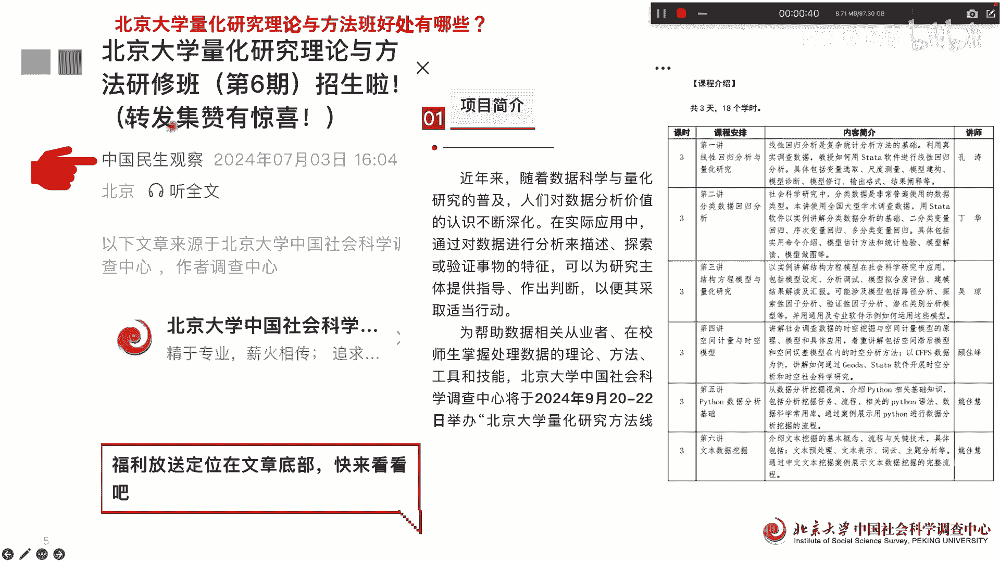

# 北京大学量化公开课第12讲：为什么要学量化 - P1 - PKU顾佳峰 - BV1g4421S7R7

亲爱的同学们，大家好，我是北京大学顾佳峰老师，今天来跟大家谈一谈北京大学量化方法课。

北京大学呢在九，今年的9月20号至22号举办。

北京大学量化研究方法办好，也就下个月的20~22号。

主要内容呢就是这三天这些模块啊。

那但这个大家参加这个班有什么好处呢。

今天我们就来谈一谈有具体有哪些好处，具体其实就是四个点的好处。

大家要了解这个课就是关注这个公众号。

上面有具体的课程信息，大家可以报名信息，看这个课的第一个好处是什么呢，就是能学习到前沿的知识，那因为参加授课的这些老师啊，都是在相关领域啊，知识非常丰富，做的研究也非常的前沿，因此呢通过这三天的学习呢。

同学们能系统性的学习一些前沿的量化研究，方法与理论，这对于提升同学们的学研究能力，论文写作与发表能力大有帮帮助，因为很多同学现在要发论文，写论文，那能量在国际上或者国内C刊发表的话，论文的水平要很高。

那我们这个课呢有助于大家掌握前沿的方法，那这些方法呢有助于写出高质量的论文，有助于提高论文的投稿成功率，这是第一个好处，那第二个好处是什么呢，有助于出国申请保研保博的申请，为什么呢。

因为学习完这门课以后呢，可以获得这个证书，北京大学证书，北京大学证书这个含金量还是挺高的，结业证书，那据不少学员反馈，北京大学这个结业证书啊，在出国申请或保研保博时，作为学术背景材料之一提供。

能有效提供提高申请的成功率啊，这个是我们参加过我们课的，不少的学员都给我们的反馈，那所以呢有时候他们还要的特别急，希望呢呃这个参加还没参加完课，就要要这个证书哦，因为他们觉得对申请保研保博。

还有出国申请，甚至找工作啊都非常有用，是一个很强有力的说明材料啊，这个是通过我们这个课就能获得到，那第三个好处是什么呢，可以获得顾佳峰老师，就是我本人的推荐信的资格，因为呢现在很多学员啊通过这门课。

然后呢了解了解了顾老师的情况，那他们在保研保博出国申请的时候呢，甚至找工作啊，都希望有一份郭老师的推荐信，那我呢通过这门课呢也了解了同学们的情况，所以一般同学们呢提出来说，要找顾老师也推荐信。

我呢了解了这个学院情况，总体还是不错的，所以一般情况下呢我都会替学员啊写推荐信，但实际上现在也已经有不少学员获得了，我的推荐信，要申请成功的，大家可以看到，比如说他拿到了澳大利亚国立商学院。

全额奖学金啊，然后呢发表了SASCE7热门啊，然后呢拿到了美国大学的全额PHRR，付全额奖学金的p h r d r four，然后呢，却有些人呢拿到了香港中文大学的这个，pp h d的offer。

呃这些，那这是一一少部分，还有更因为他们的获得成功以后，都会第一时间啊来感谢我，其实呢我就是写了推荐信，主要是他们自己也很优秀对吧，但是从另一方面也可以看出来，实际上呃郭老师我的推荐性还是挺有分量的哈。

那通过这个课呢，至少您能了解郭老师，郭老师也了解你，这样为下一步你出个申请啊，保研保护申请应该提供了强有力的支撑，那第四个是什么呢，可以结交很多志同道合的朋友啊，建立人脉，因为我们来我们上学课的学员。

他来自不同的学校，那这些学同学呢在几天课程下来以后，互相都认识了，认识以后呢，回到各自学校都保持着联络联系，因为我们每一期差不多线上，线下班就差不多100来人啊，这个都是线下班的合影。

因为我们还同时有线上班同步直播的，所以呢这些同学之间他互相认识，形成了一个人脉，一个圈子，在为未来共同研究，共同进步，甚至走向社会都提供了很好的平台，所以呢这四点好处呢，是参加我们北京大学量化这种课的。

能带给大家的现实的好处，那关于这门课呢具体情况目前正在招生啊，大家有兴趣可以关注这个公众号，然后里面的具体信息都有，开课时间就是下个月的20~22号好，今天就分享到这里。

