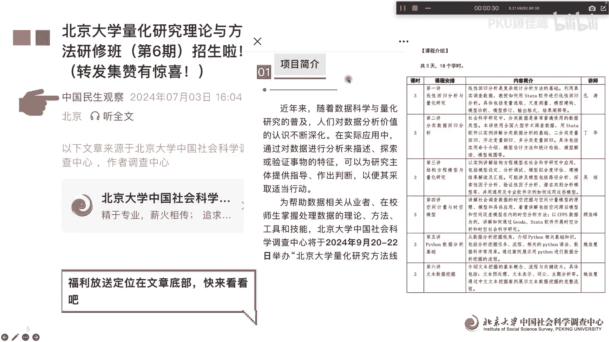
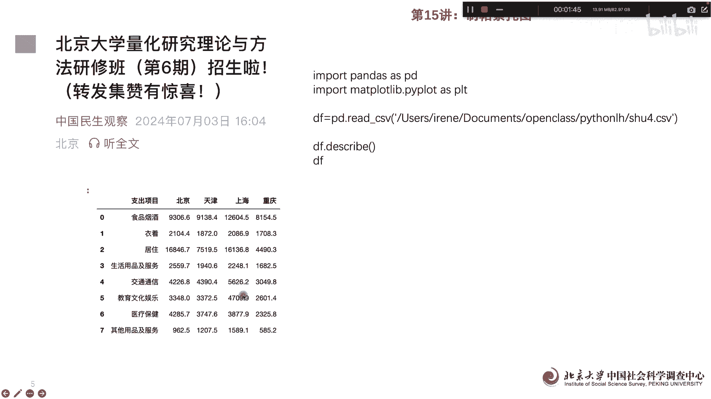
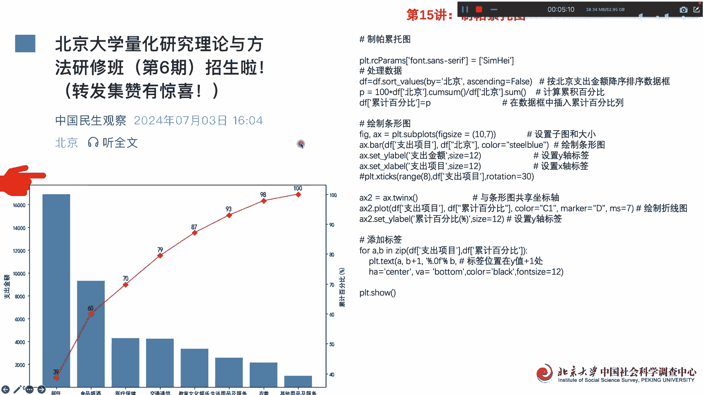

# 北京大学量化公开课第15讲：Python帕累托图 - P1 - PKU顾佳峰 - BV1RKWpe6EX3

亲爱的同学们，大家好，我是北京大学顾佳峰老师，我们今天继续来讲北京大学量化方法课，今天我们来讲第15讲，在讲课之前呢，我们首先推荐我们北京大学，在9月20至22号就要举办的，量化研究方法课。

总共是三天六讲，所以大家有兴趣可以报名参加，那具体的就关注这个微信公众号，里面有关于这个课程的详细信息。

那今天呢我们来讲第五讲，帕怎么用Python画帕累托图，帕雷托呢，这实际上是个经济学家啊，那我们在经济学里面呢有一个专门的术语，叫帕雷托给改进或者帕雷托优化，那他就是有个渐进的过程。

在福利经济学里面呢很有影响力，那我们呢今天呢来用数据，用Python来怎么画这个帕累托图，那我们首先呢还是用pandas跟method problem lab，这两个把它调入进去以后，我们读取数据。

那我这个在CVS里面已经做出来数据，读取数据以后，我们看一下，看一下数据呢，其实就是这个有八行五列啊，八行就是八个支出项目嗯，五列的第一列是支出项目，就这一列，第二列呢实际上是地地区的支出情况。

北京天津上海重庆，然后呢具体的数据是这样，也就是说我们现在呀，呃基础的数据就是这个样子，我们根据这个样子呢来画出它的帕雷托图。

我们应该怎么画，那我们就进入到西到下一步啊，这个呢就是用刚才那个数据来画帕雷托图，首先呢我们用中文啊，把他中文的这个设定一下，第二个呢处理数据，我们就是按照北京支出金额排序建立数据框，这个是by北京。

就是对北京排序，然后呢建立数据框以后呢，计税累进百分比，累累进百，百分比呢就是嗯每一部分除以会加总额，累进的除以除以汇总的，所以呢这个就可以求出来百分乘以100%，然后我们可以就是在数据框里面。

把这个累计百分比啊插入到这个数据框里面去，所以呢目前算出来以后，这个数据框就会多出一列啊，下面我们画条形图，条形图其实我们上节课啊已经讲过了啊，那我们这边呢其实他就是一个bar，就是那个。

然后呢y label，x label都给它设定好这个支出金额，这说项目啊，然后呢这个，这些都给他设定好啊，rotation这种项目旋转30，然后呢接线下来呢与条形框共享坐标轴啊。

第二个坐标轴其实就是就是前面讲的啊，这个坐标轴，然后后面的就是这个折线图，折线图，就是这个折线图就是累计百分比的折线图啊，就是我们可以看出他这个DF支出项目啊，支出项目，然后呢DF累计百分比。

这个时候累计百分比在这边，然后呢颜色用这个C1mark用D这，然后它大小，然后后面的y level累计百分比就是这个level啊，累计百分比前面讲的是共用一个X轴啊，共有X轴，那最后呢要添加标签啊。

添加标签一个呢就是累计百分比支出项目，累计百分比有标签啊，另外呢具体的标签贴完以后呢，放在中间啊，中间settle BO嗯，Color black，这然后呢标签位置在Y字加一处啊，稍微比他高一点点。

加移除，这些呢都定义好，定义好以后呢，看一下图图，这个这个图了，这个图就出来这个图就是帕累托图，其实也也是累计百分比图，帕，我们可以看到，实际上帕雷托图他有一个累计的，不断的不断的接近100%的过程。

所以这个跟帕雷托优化或者帕雷托给改进，这个意思是基本上是和一致的，所以我们通过这个图，这些Python语言呢就可以画出这个帕雷托图，这个也是很简单的啊。

那最后呢欢迎大家呃来报名这个班，我们是下个月20到20号，2号在北京大学举办啊，大家呢可以关注这个微信公众号，可以具体了解课课程信息，好今天讲到这里。

