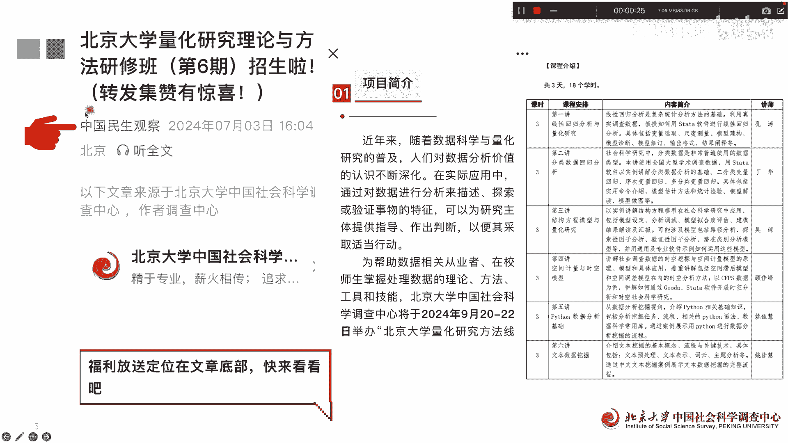
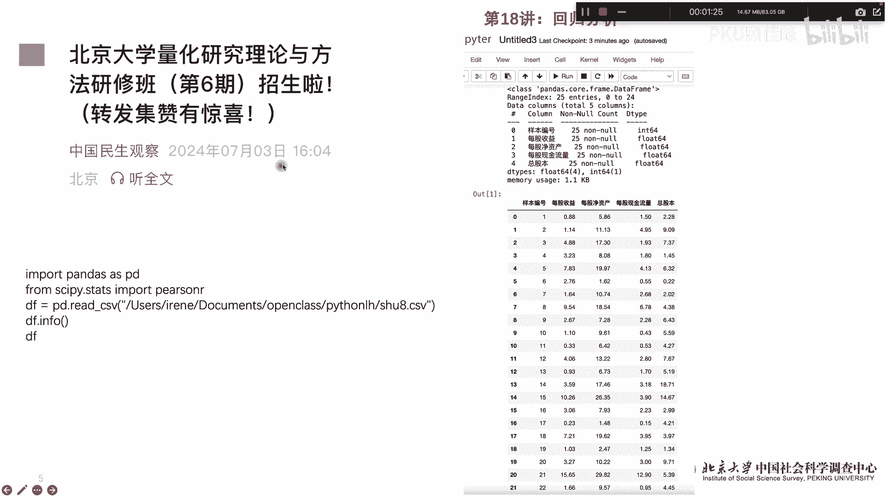
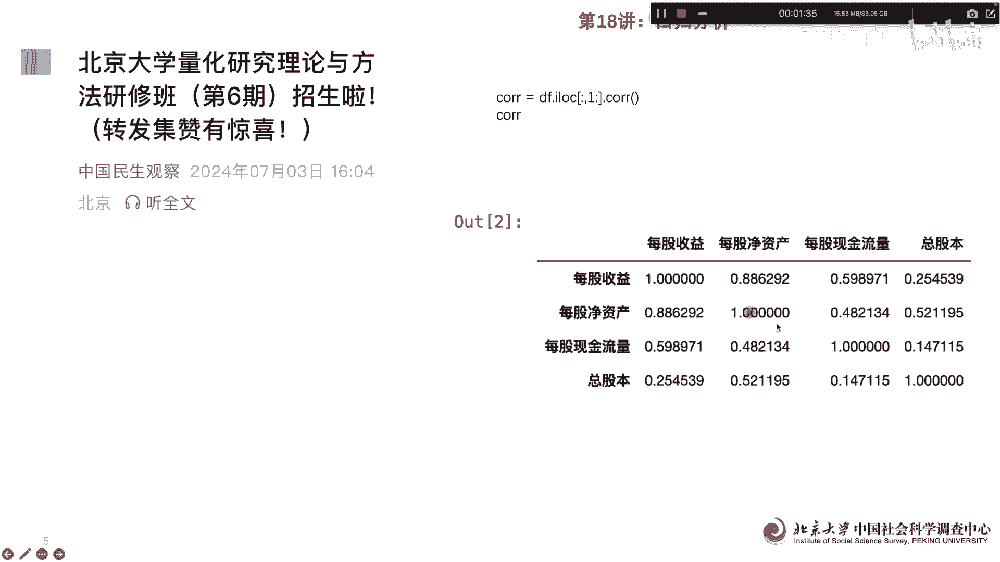
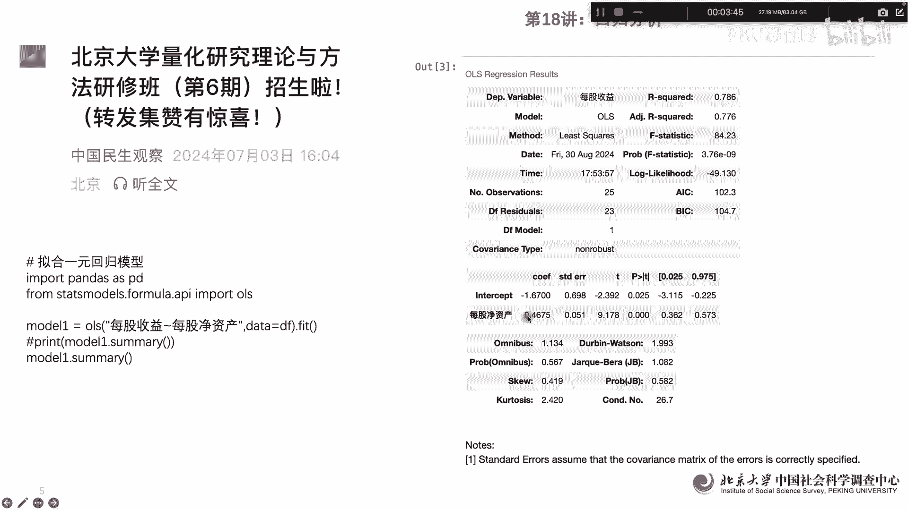
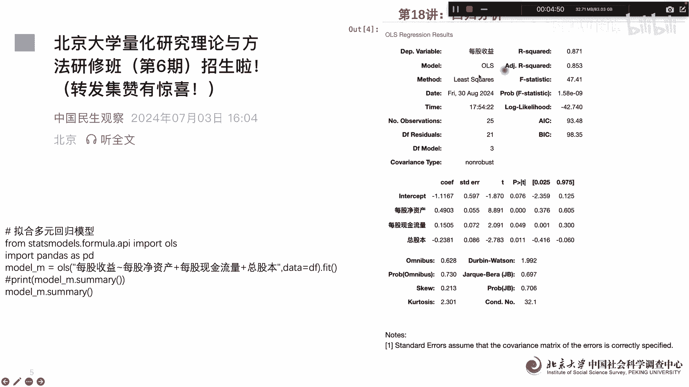
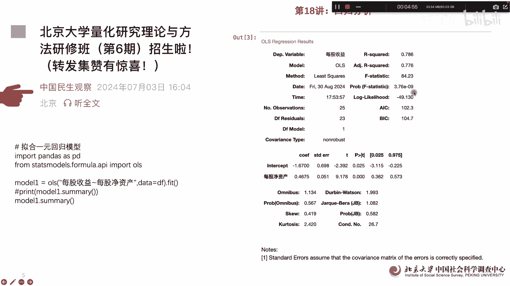
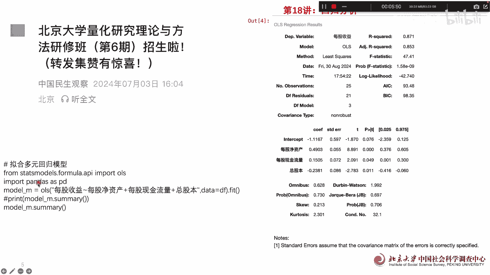

# 北京大学量化公开课第18讲：回归分析 - P1 - PKU顾佳峰 - BV1gbHjeyEHe

亲爱的同学们，大家好，我是北京大学顾佳峰老师，今天我们继续来讲量化方法课，今天我们来讲第18讲，在讲之前啊，首先向同学们推荐，我们北京大学在9月20号至22号，举办的量化方法课，这个呢总共有三天的时间。

课程的内容啊，这个就是比较丰富，关于这门课的报名情况呢，大家可以点击这个微信公众号。

从里面的获得相关的课程的详细的信息，那今天我们来讲回归分析，这也是呃同学们在量化研究中，用的最常用的一种方法啊，那我们如果用Python怎么来做呢，我们主要还是通过那个pages这个。

然后呢后面我因为我们要做相关统计，相关性系系数计算，所以用嗯sky pi这个，然后呢我们这些读取了我们的数据文件，然后看看这个数据文件里面有什么呢，我们可以看出来这个数据文件总共有呃，五个五列。

每一列呢，比如说这些每列列都有25个观测值，然后呢每个值它有那个数字字符性质是什么，他们都有，我们看到的，最后是这些总共切了25页，然后要不编号变量变量变量变量啊。

那我们首先看一下他们的相关系数，相关系数呢用这个做出来的其实很简单，大家可以看一下相关系数表啊出来。

那接下来我们就可以做一元回归，一元回归其实是最简单的回归模型，也就是说Y对于X的回归，那Y呢因变量X是自变量，X只有一个变量，那我们的用的pandas来做，然后呢。

在stus model这个里面的APM里面，导入了OEOLSOLOS，就是我们最常用的经典回归方法，那在这里面呢，我们每股收益对每股净资产的回归啊，也就是说因变量是每股收益，自变量是每股净资产。

然后呢数据呢来自于DF，就前面我们已经设定过了，后面的模fit一下，然后这个是我们建立的一个模型，那后面呢我们看一下模型一的相关情况，大家可以看一下，这个就是跑出来模型，我们可以看到因变量没过收益。

R平方0。786啊，然后模型用的OLLS模型，调整R平方是0。776，然后呢这这些比如F统计值，这些都有是呃呃最大logo自然系数AAIBIC，这些都是关于模型的一个基本的情情况，然后。

总共观测值多少啊，残差值多少，这些都可以用，那我们主要是看这个看这个呢，一个是这个呢是截距项，其实截距项并不重要啊，我们从这里看截距项它也是显著的显著为负啊，然后这个是我们的自变量，每股净收益。

每股净收益大家可以看它是显著为正，会有显著为正，意味着说美美股每股净资产，每股净资产越高，那每股收益就越高，所以他们之间呢是正向的关系，那后面呢就是其他一些关于模型的，一些其他的参数检验。

所以我们可以看这个关键的，就是看这个系数显不显著，那从里面这个模型中看是显著的。

那那我们呢其实有时候这个一个变量还不够，自变量要多个自变量，因为它是多元关系，多元关系的话，我们从Python语句上来讲，前面的也都是一样啊，主要是这个O后面发生了变化，就说这个因变量没变。

自变量呢每股净资产一个自变量，第二个字供应量是每股现金流量流量，第三个自变量是总股本，所以现在呢是有三个自变量了，一般的我们认为，自变量大于等于大于一个的时候，或者大于等于2G的时候，都是多元回归。

所以我们看这它有三个自变量，说明肯定是多元回归，然后跑出了以后，我们再summary一下这个模型，结果就是这个样子的，因变量还是每股收益啊，然后我们可以看20平方明显增加了，前面是差不多0。77。

现在变成0。87了，增加增加了不少啊。

然后呢这个呃AICBIC我们可以看出来。

原来AACBC都超过100的，现在AI is c b i c就是S次次次磁系数，所以这个呢都减少了，所以说也就模型变得更好了啊，那我们再来看呢这个截距项嗯，是这还是负，然后每股净资产还是正。

每股现金流量啊，这个也是显著的为正，总部本是为负啊，也是显著，也就是说每股净资产越高呃，每股现金流量越大，每股收益越高，但是呢总股本越大的情况下，每股收益越小，因为为什么总股本就是分母嘛。

你分母越大的话，肯定是相同收益向情况下每股收益就越小啊，所以呢这个就是多元回归的结构，我们可以看从用Python做多元回归跟音乐回归，它其实语句也很简单的啊。

也并不复杂，那我们大家要记住这个开班时间是9月22，9月20到20号，所以呢大家有兴趣呢要抓紧报名了，因为截止时间很报名截止时间很天很快就到，这个呢就是具体报名方式，大家可以看那个中国民生观察。

这个微信公众号上去，具体去了解大家，好今天讲到这里。