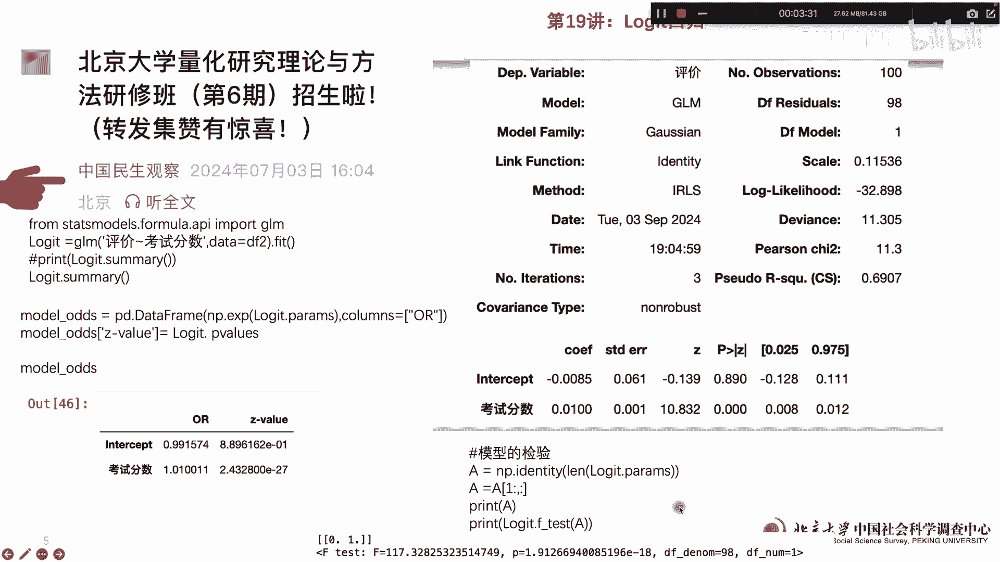
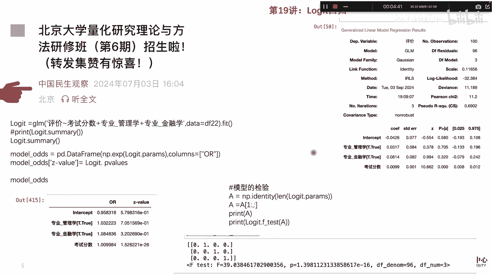

# 北京大学量化方法课第19讲：Logit回归 - P1 - PKU顾佳峰 - BV1yvHWeXEsX

亲爱的同学们，大家好，我是北京大学郭佳峰老师，今天我们继续来讲北京大学量化方法课的，今天讲第19讲，那在讲之前，首先给同学们推荐我们在北京大学，9月20至22号举办的量化研究方法课，那总共是三天啊。

六讲的内容，欢迎同学们来望参加，来北京大学那关于这个具体的课程信息，大家可以看这个微信公众号啊，里面有关于这门课的具体的信息。

那今天呢我们来讲什么呢，来讲这个reject回归，用怎么用Python做reject回归，reject回归就是因变量是零跟一构成的分类变量，那这个我们在日常生活中也经常可以看到，比如说上学不上学。

接受高等教育，不接受高等教育，诸如此类的，有没有驾照啊，那这个呢我们怎么做，我们首先呢用这个输入这个文本，文本呢基本上是这样一个形情况，姓名性别专业满意度，考试成绩一啊，这些这些都都可以在上面。

那那下面呢我们的叫呃，生成一个生成一个变量啊，生成一个变量处理，实际上把那个评价做成一个由零和一构成的，一个评价，评价指标。

评价是由零和一组成的，比如说成绩好坏，然后呢零跟一呢，我们首先以这个评价对考试分数来做回归，那评价是以零跟一构成的一个变量因变量，那自变量呢考试分数，那我们做了这个LOJECT回归，就是这个样子。

语句很简单，就LOGICT等于JLM，我用我们用的是JOM的估计，然后括号，然后评价是因变量，考试评分数是自变量，数据用的是这个数据from，然后用fit啊拟合拟合以后呢。

logic summary一下就出来了这些东西，这些信息呢告诉我们什么呢，一个因变量评价是因变量，然后呢，观察室总共100个用的模型的JLM模型，广义线性回归模型，然后呢这个财差数98个啊。

乘他的这个自由度，然后模型的类型是高斯啊，这个然后呢总共的这个这些方法，最最大释然什么什么什么什么的啊，然而这个R平方0。69，就最后我们看这个一个呢截距项，截距项这类这类不显著。

但是考试成绩呢是显著为正啊，也就是考试分数越高，评价越好，越有可能得高一是吧，评价好啊，那对这个软件回归呢，有些我们也要用OR值，就不是这个回归系OR值OR值的话，你用这个这个来做啊。

就回归以后呢用model o o r用这个来做，做出来以后得出来的就是这个ORZOR值，我们可以看到这个呃，考试分数OR值是1。01啊，大于一说明实习为正啊，如果ORS小于一说明为负的啊。

然后呢我们看这个模型好不好呢，还要检验一下，检验一下，我们做一个IF值F值检验是显著为正呃，呃显著为正，说明呢呃这个模型还是可以的，拟合程度啊。

那另外我们可以做多元罗杰斯回归啊，多有罗杰斯回归呢，比如说我们因变量还是评价，然后呢自变量包括考试成绩，专业管理学，专业金融学，然后数据用的data two啊，Fit。

然后LOGIST出来的结果就是这样，其他什么都差不多，在后面呢，我们可以看到这个专业问专业兔，其实都不显著啊，然后呢只有考试成绩显著为正，这个我们跟前面的做出来差不多啊。

然后我们要做他的OI估算它的OR值呢，用这个语句出来以后呢，出来就是OR值，OR值其实也差不多，就考试分值大于一，说明显著为正，其他这些都不显著啊，那我们对这个模型计算一下F值检验呢。

我们可以看F值检验显著为正啊，所以这个模型拟合程度也还可以，所以我们用这个很简单的例子来讲，用嗯Python做logic回归，也就分类变量又做回归，那还这个做出来的结果，其实也相当比较容易操作。

那最后呢我们还提醒大家，同学们来报名参加咱们北京大学这个班的，大家注意时间是9月22号至20号，20号至22号，报名的截止日期呢其实是9月13号啊，所以9月134号就不报名，现在已经有很多同学报名了。

所以大家要来北京大学习呢，就要抓紧报名了啊，先今天我们就讲到这里。