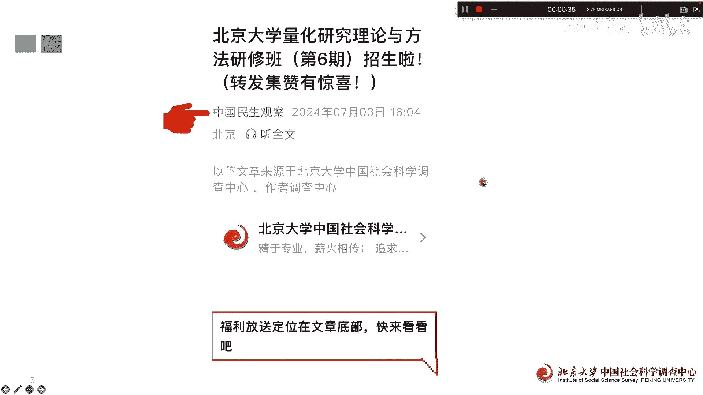
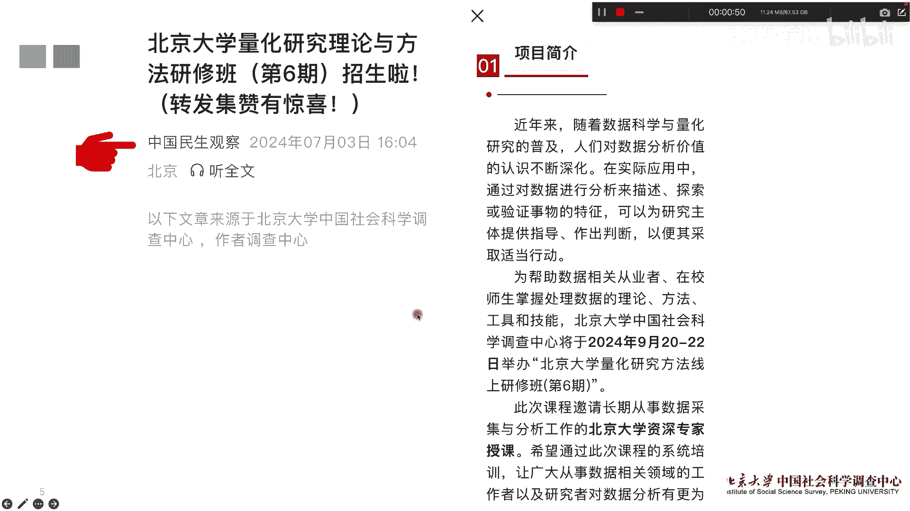
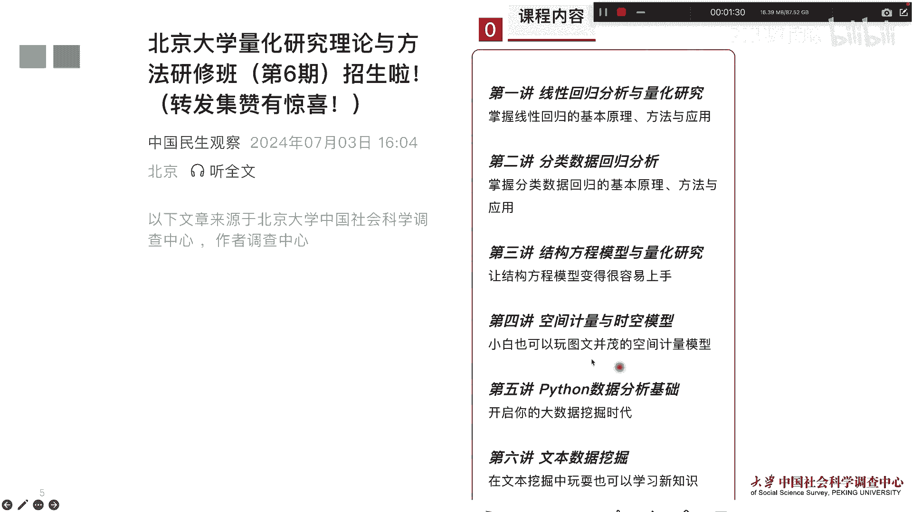
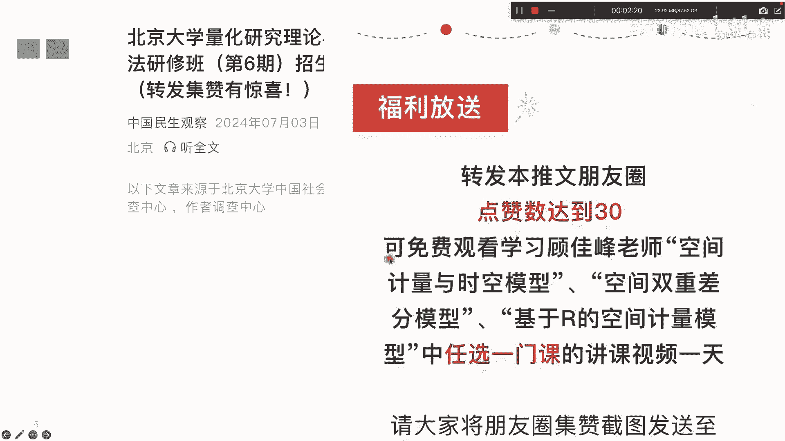

# 北京大学量化研究研修班（第6期）招生啦 - P1 - PKU顾佳峰 - BV1fy411i7Yp

亲爱的同学们，大家好，我是北京大学顾佳峰老师，今天给大家来推荐，北京大学量化研究研修班第六期，目前正在隆重招生中，那北京大学量化研究这个研修班呢非常火爆啊，从去年开始到今年，你看这已经招了，开了五期。

那还有很多同学也想继续来学，那我们呢在今年的9月份看第六期，大家关注这个去具体了解整个课程的信息。

那这个课程呢，我们时间会在今年的9月20号至23，22号呃，来举办，在北京大学来举办这门课啊，这个第六期的课程。

然后这个三天的课程呢主要是有这个六块内容，一个线性回归，一个是分类数据模型，回归结构方程模型，这个大家也非常用时空模型，空间模型，这个也是现在非常前沿的，下面两个呢第五第六讲呢。

用Python做数据分析跟文本挖掘，所以这里面呢我们可以看到前面的这些内容，基本上我们可以用state来做量化研究与分析，那第五第六讲的用的是Python，其实这也是我们现在最主流的两门。

两个语言语言啊。

那，学这门课呢还会有结业证书，这个结业证书还是也挺有用的，北京大学结业证书，我们往期的学员啊，他无论在出国申请呃，申请研究生保送推免啊，找甚至找工作，他就都把这些证书啊作为补补充材料一起发送，一起寄送。

所以呢对他们保研申请出国找工作都很有帮助，同学这也是一些学员啊给我们的一些反馈，那这个推推文呢如果大家能转发的话，还有福利啊，转发30次以上，超过30次，达到30次，可以免费听我讲的一些课啊。

然后最后呢欢迎大家来北京大学，来参加这个量化六期的课程，好今天分享到这里。