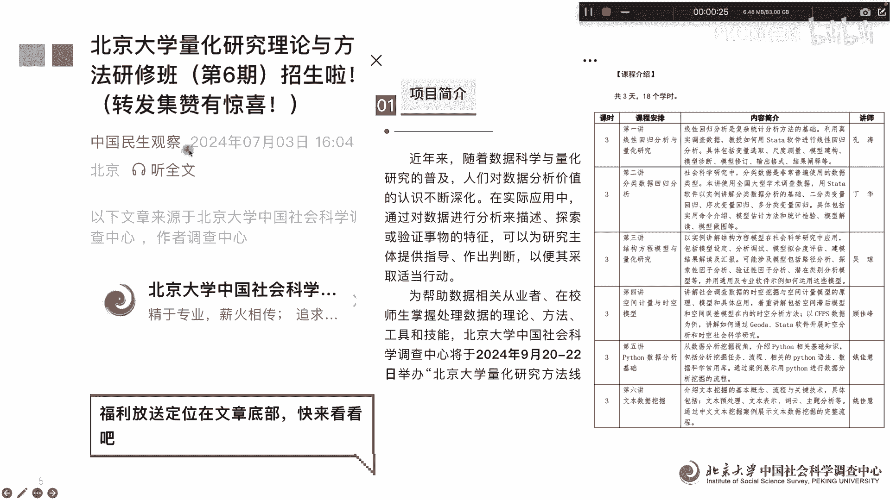
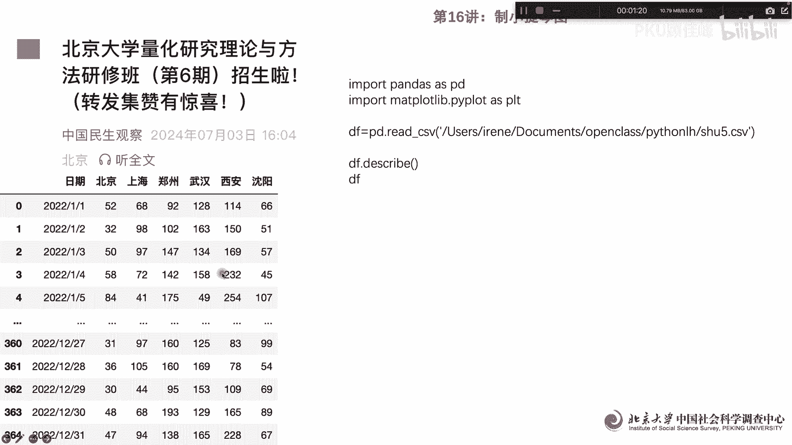
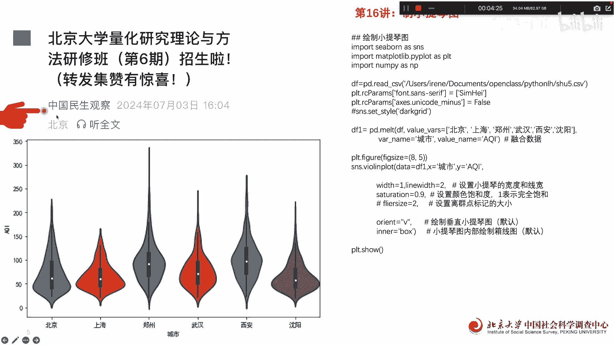

# 北京大学量化研究第16课：Python做小提琴图 - P1 - PKU顾佳峰 - BV1tmW5e6EWP

亲爱的同学们，大家好，我是北京大学顾佳峰老师，我们今天继续来讲，北京大学量化方法课的第16讲，那在讲课之前，我们继续推荐我们北京大学，在9月20到22号举办的量化研究方法课，这个是三天的课程的内容。

那大家要了解这个课程的具体信息，可以去看这个公中国民生观察这个公众号啊。

大家可以去去了解，那今天呢我们要做什么呢，做用Python来画小提琴图，我们这样看到很多的研究啊，这个小提琴图呃做的非常的漂亮，那一些同学呢说也像来画这个Python做小提琴图。

所以我们的就用今天这个例子来来来，实际演示Python，怎么来帮助大家画出非常漂亮的，五颜六色的小提琴图，那我们首先呢读取数据据，我们读取这个数据，这个数据我们把它这grab一下。

我们可以看到它实际上是有364个观，365个观察值不同的年份，然后呢六个城市，北京上海郑州武汉西安沈阳好，关于这些的这样一个数据，那根据这个数据，我们怎么来做小提琴图呢。

我们可以看下一页啊，下一页小提琴图的这个里面，我们要很重要，一个除了这这几个常规的import之外，我们还要in pc BO，这个是做图的一个非常好的一个一个方式，那我们呢后面呢就是常规的。

比如说阅读数据啊，这个数据把它读进来，然后呢这个用中文hand hi，然后呢用这些呃把它设定好，下面呢我们用SMS这个来做，那首先我们要读取数据的呢，读取这个城市的数据。

我们这个用这1234566个城市的数据啊，把它城市名称，然后呢IQI嗯，读IQI这个变量，那如数据融合，然后呢我们做图图的大小8。8杠五，然后呢我们用SMS点valolin plot。

这个就是专门做小提琴图的啊，小提琴图的我们data等于DF1data，就是这个数据框这个数据，然后X轴呢我们用乘式123，45666个城市啊，Y轴呢是用这个指标AQI指指标，AKAIKY的指标。

然后呢设定小提琴的宽度跟限度，宽度呢我们有一线度，有二线宽，宽度和线宽，那么我们把它设设定好，然后呢设置饱和颜色一表示完全饱和啊，设置饱和颜色0。9啊，这个还没有到完全饱和。

然后呢filter size就是设置离群值标记的大小，我们可以把它设定二呃，这个然后呢画垂直小提琴图，这个是垂直的，我们可以看到他这个小提琴都是垂直的，当然你也可以在别的。

然后内部呢内部是小提琴内部和线图，这个和线图呢用box就是这个把它做出来，box嗯和线图，然后我们plus share一下，就出来这个小提琴图，我们可以看到这个小提琴图一个颜色不一样。

另外呢长度不一样对吧，然后宽度也不一样啊，这个表明这个数据的分布不一样啊，就是IKI这个数据在不同的城市啊，它分布是不一样的，像这个程度就很长对吧，像像这个长度就很很很不很窄，但是呢宽宽度明显。

这个比这个要宽多了啊，宽度要大啊，所以我们这样的话一个非常漂亮的嗯，呃这个小提琴图画好了，那我们现在很多的论文呢，都要通过画小提琴图来展现，直观的呈现数据的情况，这个呢对我们的论文写作发表的。

是有正加分的作用，好我们今天呢就讲到这里，大家关于这门课的兴义，进一步信息可以观察这个公众号啊。

里面有关于课的信息，所以大家记住课程时间，我们是9月20号到22号，欢迎大家来北京大学上这门课，好今天我们课讲到这里。

