# 吹爆！这可能是B站最完整的（Python＋机器学习＋量化交易）实战教程了，花3小时就能从入门到精通，看完不信你还学不到东西！ - P22：第22节-判别分析 - 凡人修AI - BV1Yx4y1E7LG

那接下来让我们来继续介绍一下linear，Discriminanalysis，线性判别分析，那么它跟我们上面提到的logistic regression，很像啊，也是一个线性的分类器。

那么在我们介绍LDA之前呢，我们先介绍什么叫做discrement function，也就是判别函数，那么当我们在提到分类器的时候呢，我们会提到这个判别式函数的这个概念，那么嗯我们知道对于一个分类器。

那么分类器会为每一个类别啊，分配一个判别函数这样的东西，那么判别函数呢适用于来判定这个新的样本，是否属于这个类别，那比如说我们有大K的类，那么我们就有大K格判别函数，那我们对于一个新的样本点。

它是否属于第比如说第I类呢，那就是把这个点带到这K个判别函数中，如果德尔塔K而DOTAI，然后呢这个X点是最大的，那就说明了这个新的点是属于第I类的，那么这是判别函数的效用。

那么判别式函数是如何工作的呢，对于普通的分类器来说，判别函数delta跟他的跟对应的后验概率，是一个嗯线性的一个递增关系，所以说如果判别函数最大，就说明这个类的后验概率是最高的。

那也就说明这个点我们有这个最大的confidence，它会属于这个类，那当这个判别式函数两个类的判别式函数，比如德尔塔K跟德尔塔L相等的，这个这个一整个点的集合呢，它会形成一个分类面。

那我们就称其为决策面，所以在决策面上呢是两个类的判别函数，刚刚好相等的情况下，那么在这个决策面上呢就是属于DK类，那决策面下呢就属于第二类，当然也可以换一下顺序，那我们看一个最简单的这个线性判别。

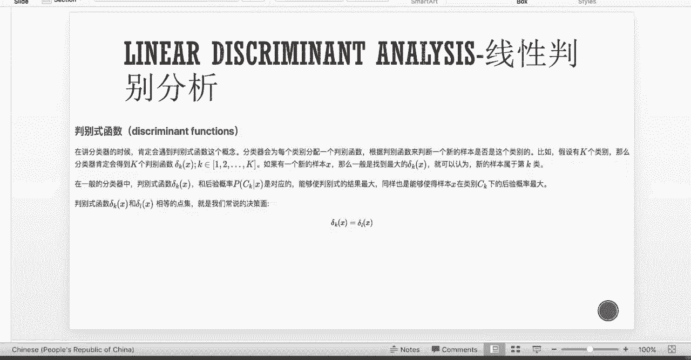

是啊三分类这样的一个例子，那么对于线性回归来说，这个回归是没有办法完成分类问题的，所以对这三个点来说，如果你采用线性回归，那就会得到这样把这个蓝色的类一分为二的，这样的一个情况。

是不满足我们的分类结果要求的，那如果我们使用LDA也就是线性判别分析，那我们就会得到如右图这样的形式，那我们可以看到这两条黑线呢分别第一个位置，也就是DOTA1等于DOTA2的情况。

那么第二个呢就是delta，二等于德尔塔三这样的啊一个情况，所以这个是线性判别分析三分类的一个例子。

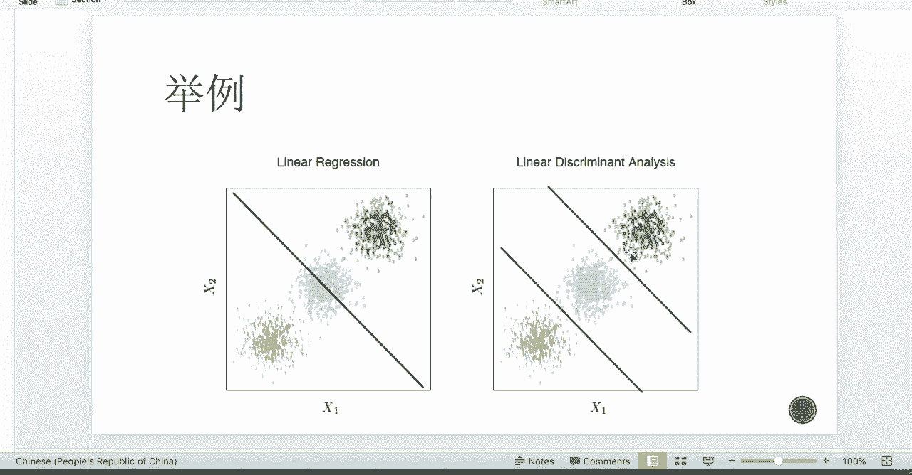

那我们接下来看一下这个线性判别分析，跟这个后验概率到决策面之间的关系，那首先呢我们之前提过，这个判别函数和这个后验概率之间，都是满足一个单调函数，就是说判别式函数越大呢。

它这个后验概率就对应的这DK类也就越大，那么呃我们在这个ODA上呢，我们是认为这个单调函数的这个变换后嗯，X是一个线性函数，所以得到的决策面呢也是线性的，所以这是一个线性分类器。

那我们先以之前提到过的这个logic，regression为例，那假设呢是一个二分类问题，也就是binary只有零类和第一类的情况下，那么我们还记得我们的这个第一类和第二类的。

这个后页分别都是HX跟一减去HX，H是这个hypothesis function，那logistic regression使用的呢是SIGMOID，所以就是这个分母加是一加上指数。

exponential里面是这个X的线性组合，那这个时候呢我们对两者的比率，采用一个log函数，也就是P除以一减P，我们就得到了一个这个log function，那么上下对除呢。

刚刚好是这个W转置X是线性的，那么我们可以发现，如果这个X是属于第一类的，那么PCE呢除以PC2就会比一大，那也就是一整个log是比零大的，那反之如果属于第二类呢，也是比零小。

所以logistic regression的决策面，就是上面的这个loge function是否等于零，为刚刚好为一个分界线，那比零大呢就属于上面那一类，比零小呢也就属于下面这一类。

所以它的决策面也就等价于这个W的转置，乘以X等于零。

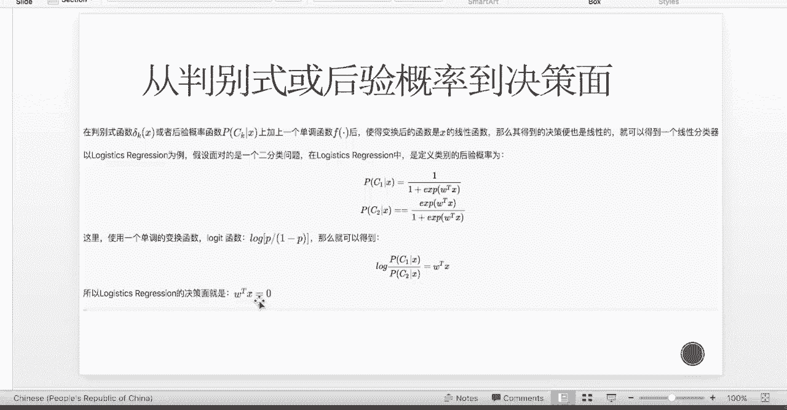

所以是我们上面看到的这样的一根线性的函数，那么在二维空间就刚好是一个直线，那如果是三维呢，就是一个平面。

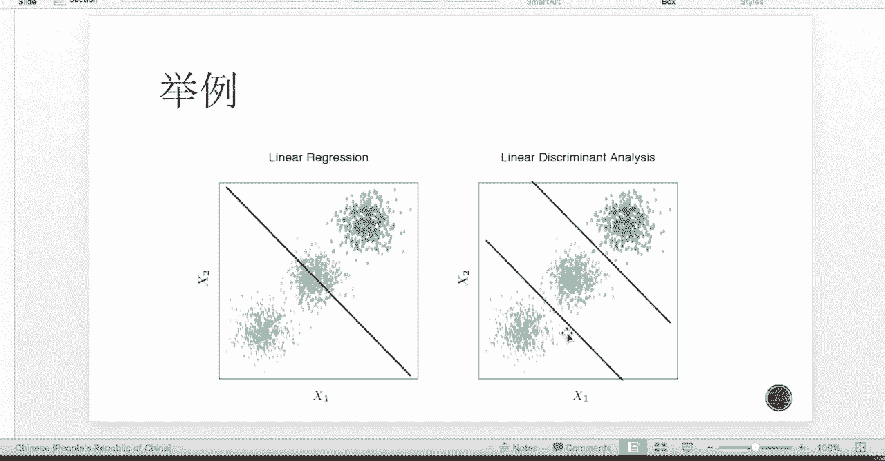

那三维以上呢就称为一个超平面，叫hyper plan，接下来我们来看一下线性判别分析，LDA跟上面的logistic regression的这个判别面，有什么关系，那么呃对于LDA来说呢。

它跟logist regression最大的区别是，他的这个后验分布是由贝叶斯啊。

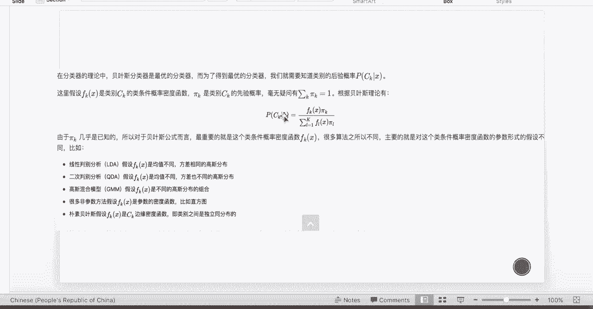

这个分类器来计算的，因为我们可以看到对于logistic regression，这个是我们自己假设的，我们假设它的后验是满足这个sigmoid function。

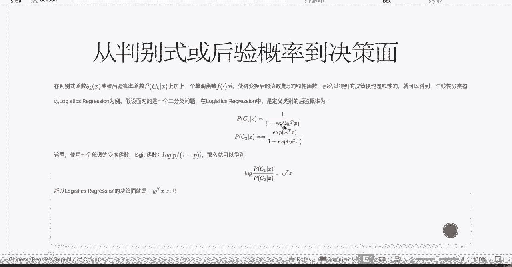

但是对于这个LDA来说，我们P这个c depend on x，这个后验呢是由我们贝叶斯公式计算得来的，那么我们写出贝叶斯公式，那pk呢就是这个probability，这个点属于DK类的先验概率。

那FKX呢是这个X这个feature本身自己的分布，那我们假设呃我们在这个LDA里，我们是假设这个FKX是一个高斯分布，也就是正态分布，所以说我们对于logic regression跟LDA。

最大的区别是，我们的这个LDA假设了X的分布是个正态，但是logistic并没有对它进行任何的假设，那么呃写出这个函数之后呢，我们来区别信息判别分析跟二次判别分析，对于线性判别分析来说。

我们假设的是FKS的均值可以不同，但是它们的方差，也就是X他们的协方差正必须是相同的，高斯分布，就当K不同的情况下，就是对于不同的类别来说，那么对于二次判别分析来说呢，那唯一的跟线性不同的是。

我们我们的这个属属于不同类型的来说，这个X的方差也就是写方差正是不一样的，那为什么我们假设方差相同的时候就是线性，方差不同的时候就是二次判别呢，我们下面会介绍呃原因。

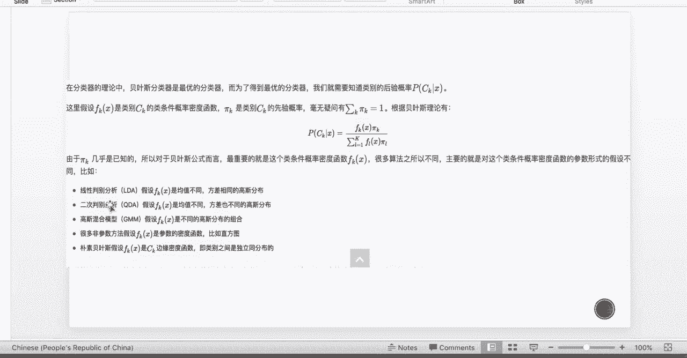

那么我们会进行这个数学推导，首先我们写出这个FKX的这个，正态分布的这个表达式，那么由于我们是推导LDA也就是线性判别分析，所以我们就依照我们的假设，它的这个方差协方差正是相同的。

所以这个下角标K就省去了，那么我们利用跟这个logistic regression，一样的理论，我们想要判断它是否是属于哪一类，那我们就想比较他们这个PC1除以PC2的比值，跟一的关系。

那比一大呢就是上面那一类，比一小呢就是下面这一类，那我们依旧构造这个log function，因为对于正态分布来说，我们也希望取一个log，把这个指数项给消掉，就变成它上面的那个顶的这个函数。

那也就是线性或是二次，那更方便我们计算，所以我们把上下都用高斯分布代入呃，上下同除，然后再取一个log之后呢，我们我们通过化简可以得到下面的表达式，我们可以看到两个高斯分布本来有X的二次项。

也就是X的转置乘以西格玛的逆乘以X，但是由于我们假设属于不同类别的时候呢，我们的这个协方差阵是一样的，所以他们两下两个上下同除的时候呃，换成log也就是对简，那这个时候呢X的二次项就X的转置乘以。

西格玛逆乘以X就被消去了，所以这个时候我们只留下了X的一次项，和边上的这个常数项，也就是跟X没有任何关系的这一项，那我们称这一整个log function呢就为这个DOTAKX。

也就是discriminate function，也叫判别函数，那么这个时候大家可以看到这个判别函数，关于X是一个线性的函数，所以这就是线性判别分析名字的由来，那我们有了这个判别函数呢还不够。

因为这个时候我们要把X带入，看它是否属于这这DK类，也就是呢这个K从一一直取到大K的时候，把X带到所有的这K个判别函数中，哪一类的判别函数最大，就说明X是属于哪一类的，那这个时候我们需要估计几个东西。

一个是MK，一个是这个斜方差正，还有一个是这个pk，也就是DK类的先验概率呃，我们有了这些数值之后，我们才可以计算判别函数，所以呢这边呢是这三个啊，未知参量的估计方法，那么非常的好理解。

那么pk呢也就是DK类的先验概率，那么就用这个样本概率来表示，也就是比如说我有100个样本，那我有20个是属于第一类的，那么拍一呢就是一就是20÷100，也就是五分一，那么对于MUK呢。

是每一类这个X的正态分布的均值，那么我们依旧使用样本样本均值，比如说啊一样的第一类呢有20个点啊，是属于第一类，那总共有100个参数，那这20个点中对应的，他们的这些X的均值是多少呢。

比如说X的均值是五，这个时候五，但这个MK的值呢就取了五，那这个sigma就是斜方差证，跟这个均值是一样的方法来估计的，也就是用这个样本内部X本身的先发三证，来表示这这一类嗯。

我们这个正态分布要使用的这个写方差证的。

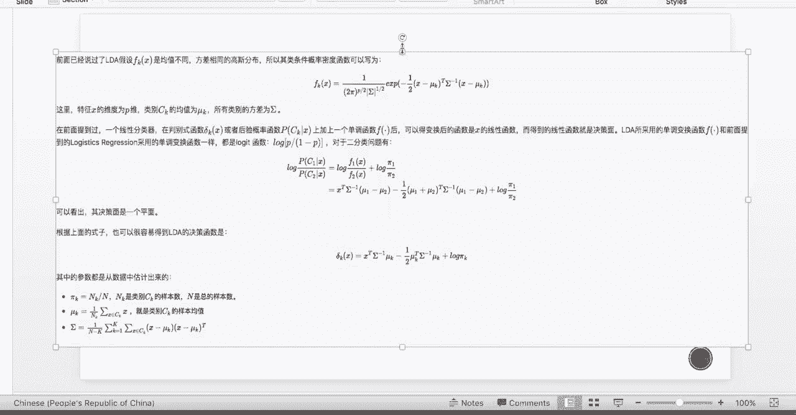

这个估计数值，那对于这个二次判别分析，也就是QUADROIT跟linear的唯一区别在哪呢，也就是我们对FKX的假设呢变得更为松弛了，我们不需要假设它们的方差是一样的。

我们可以容许它们是方差不同的高斯分布，所以呢跟LDA相比，这个西格玛K不同，所以当我们在做这个判别式函数的时候。

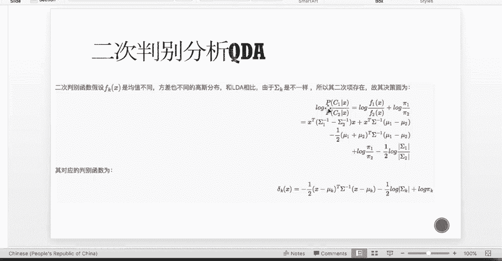

我们上面提到过的这个X转置乘以西格玛逆X，就不法就无法消除了，因为这个时候西格玛带了一个下角标，也就是西格玛K。

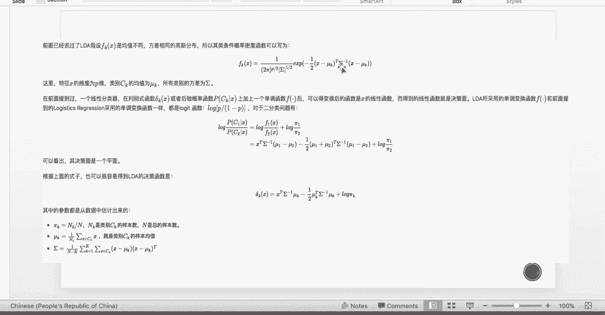

所以在二次化学分析中，我们这个式子推导里多了一项这个二次项，大家可以发现这个德尔塔K关于这个X，现在不再是一个线性函数了，而是一个二次函数。

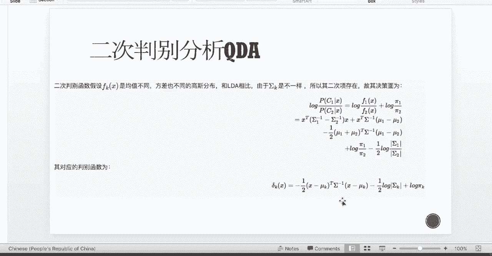

所以这是二次判别分析的理论由来，那这个时候我们介绍一下，这个逻辑回归跟判别分析，也就是discriminate analysis的区别，那么在我们之前的这个推导过程中，相信大家已经有所感受。

它们之间的区别在哪了，第一点呢判别分析，我们是利用贝叶斯定理得到后验概率。

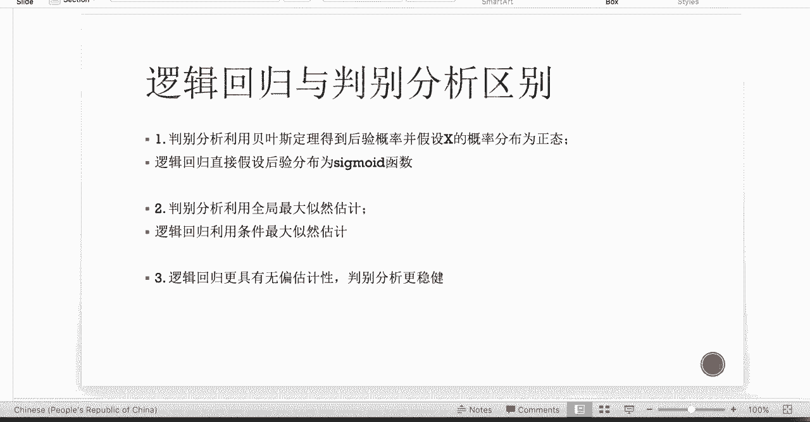

并且假设了X本身的概率分布是正态分布，大家可以通过这个来看到，也就是这个后验pk就是DK类的概率，Depends on，我们这个样本点X是由贝叶斯公式计算得来的。

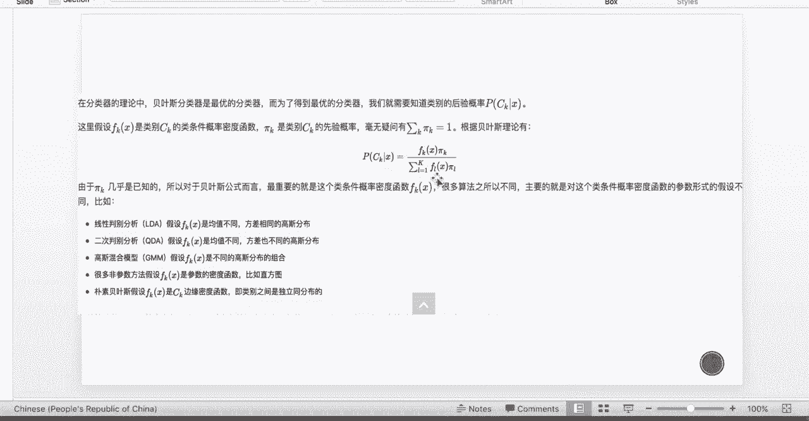

但是呢对于逻辑回归来说，我们是直接假设了后验分布为SIGMOID的函数。

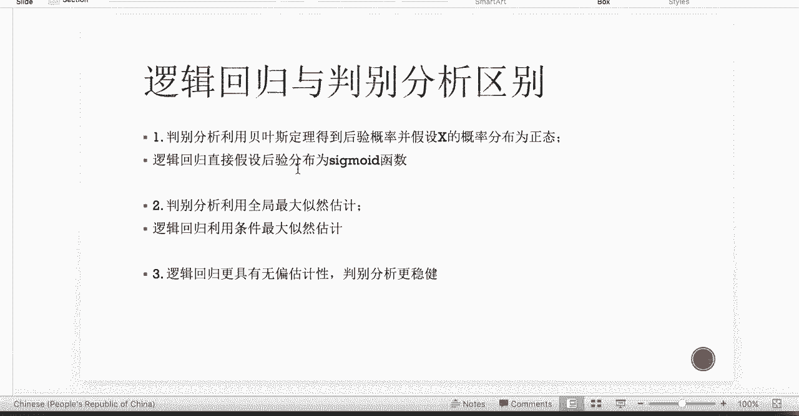

就如这边所示。

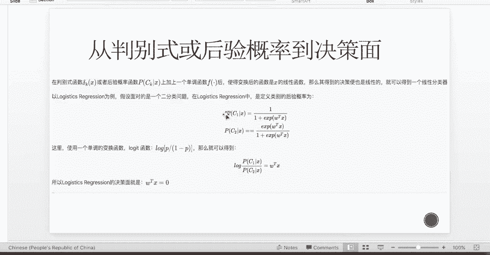

是不是由任何公式推导而来的，而是我们自己本身的一个假设，那么判别分析利用的呢是全局的最大自然古迹。

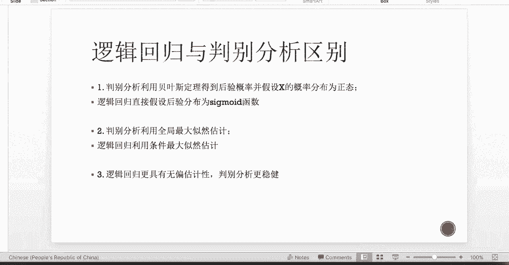

因为呢在这个这个位置的情况下，这些的自然自然古迹呢是由join distribution得到的。

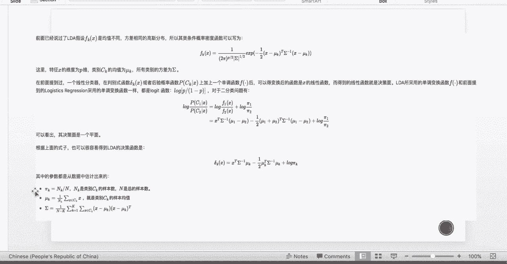

但是对于逻辑回归来说，用的是条件最大自然，那为什么呢。

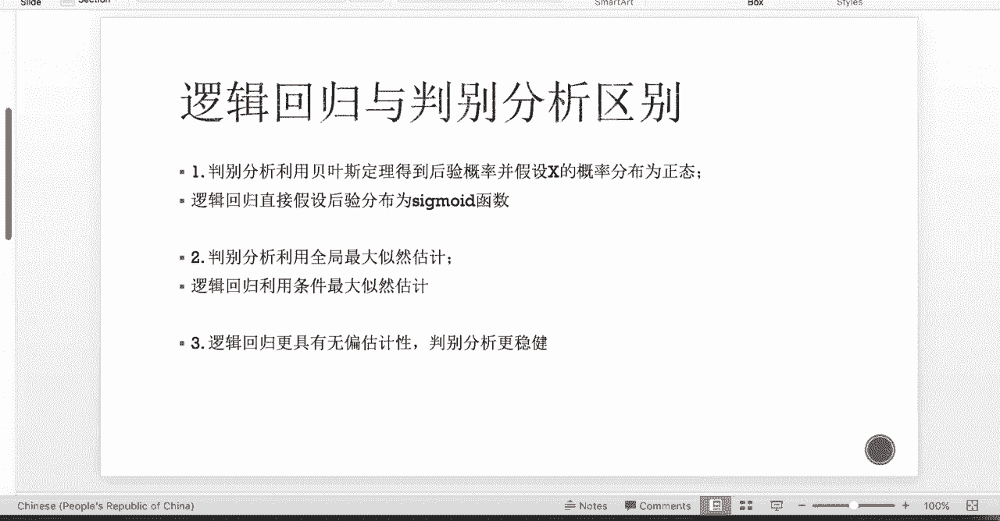

大家可以看我们上面的这个对logistic，regression的推导，大家可以看到这个大LD，也就是嗯最大自然古迹，最早的这一步就是写出自然函数。

那自然函数嗯是这个py depends on x跟theta，而不是一个联合概率分布，因为中间有个这个数号，所以这个时候的这个，我们把这个直大自然称为是条件极大自然嗯。

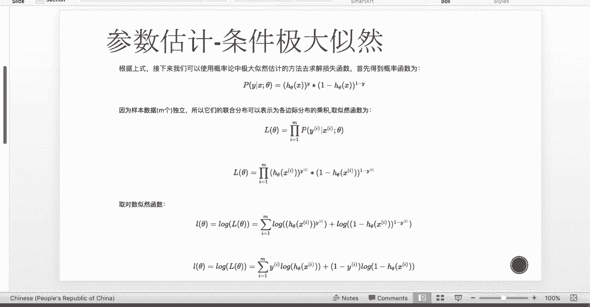

那么第三点呢就是逻辑回归更具有无偏性啊，原因呢其实很简单，因为判别分析我们比逻辑回归更多了一个假设，也就是假设的X本身的分布是正态的，那么你多了一重假设之后呢，我们对我们的样本。

样本能够决定的这个仓量就有一定的稀释，所以这个时候判别分析的偏度，一定比逻辑回归来得高，但是呢，由于我们之前对X有了一个先入为主的概念，所以当如果你的样本本身的质量不大好。

或者是样本本身的噪音特别多的情况下，那这个时候逻辑回归是one hundred percent，会受到你的样本影响的，但是呃判别分析由于它是相当于是一个，我们可以理解为一个啊wait sun。

也就是它不但考虑了这个样本，这个时候引入的值，还基于我们之前对X的这个概率分布的假设，所以这个时候不会百分百的受到样本的影响，所以判别分析呢就更为稳健，所以我们拿到一组data。

是否使用逻辑回归跟判别分析，我们需要对这个data本身的质量进行一个评估，如果这个时候data本身的质量不大好，而且大家可以发现它噪音非常大，那么使用判别分析就更为稳健。

那如果这个时候我需要得到的是更strong的，这个分类效果，希望是更具有无偏性的，那么我们就使用逻辑回归。

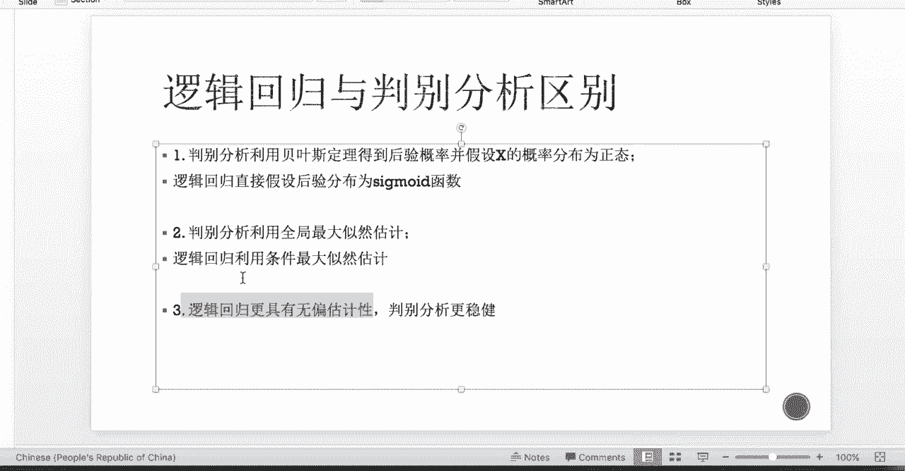

那我们接下来介绍一个机器学习里面，最重要的一项内容，也就是support vector machine。

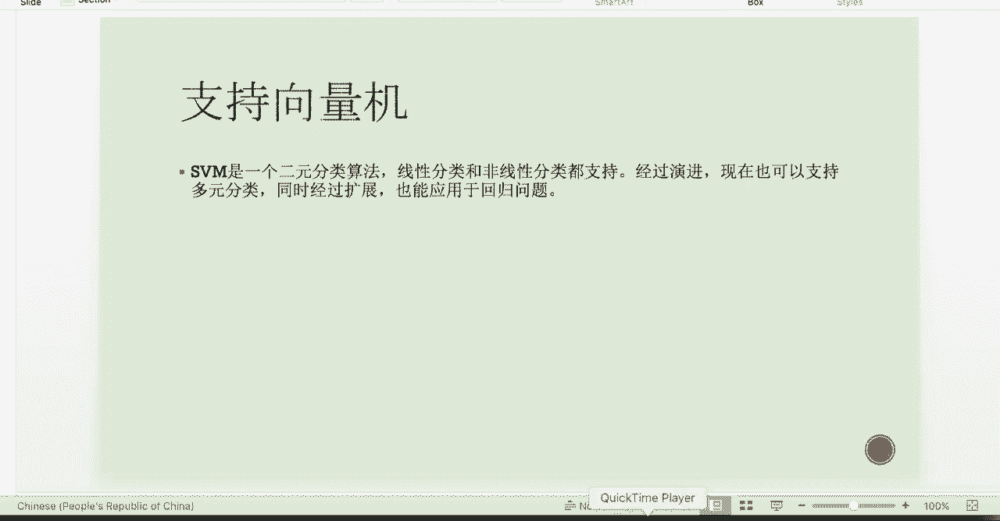