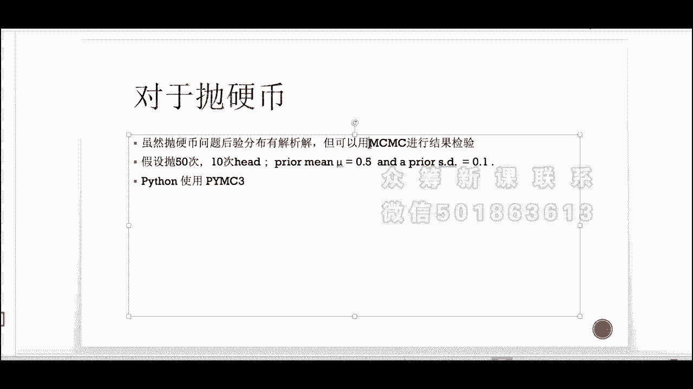

# 吹爆！这可能是B站最完整的（Python＋机器学习＋量化交易）实战教程了，花3小时就能从入门到精通，看完不信你还学不到东西！ - P8：第08节-贝叶斯估计 - 凡人修AI - BV1Yx4y1E7LG

大家好，今天我们第六节课的主要内容，是介绍贝叶斯统计和贝叶斯的呃线性回归，波动率模型等估计方法，那么首先呢，我们会对高级算法交易进行一个概述，那么第二呢我们会简要的介绍，什么是贝叶斯统计。

那么我们在引入贝叶斯统计之前，先对最大自然古迹，也就是MLE做一个回顾，那么我们会将MLE和贝叶斯统计方法，的基本原理进行比较，那第三点是我们会介绍贝叶斯的推理的方法，和共轭先验分布的推导。

那么第四块呢，我们介绍啊，MCMC也就是MOCOCHAMONTECARLO的原理，那么我们在普通做贝叶斯方法的时候呢，都是最理想化的情况下，那么有时候难以计算。

所以我们需要引入Mark chamonte color，对嗯比较难的贝叶斯统计啊，进行进行真正的推导，那么第五块呢是基于贝叶斯的线性回归模型，那第六块呢是对于很多金融序列和波动序列的。

贝叶斯随机波动模型，那首先呢嗯什么是贝叶斯统计呢，在我们一般的统计估计下，我们利用的都是最大似然估计最大，自然古迹的想法是，我们有一组引入了一组观测值啊，比如说是嗯X1到X50。

那么我们拥有了我们的observation，我们应该如何来估计我们这个观测值的分布的，一些参数呢，那我们就得对，首先我们有了观测值之后，我们得对观测值的分布有一个大致的想法。

比如说我们认为它是符合啊伯努利分布，那么伯努利的我们里面的呃NP，那么N的话我们是知道的，总共是50次实验，那么P呢是我们的实验成功的概率，那我们需要估计这个概率，那这个时候呢。

我们写出每一个观测值的伯努利分布的表达式，那么我们将它们乘在一起，得到的是一个联合分布，那么最大自然的想法就是，我们基于我们的框测值，我们最大化我们的联合概率分布，那么最大化的时候，我们的这个P值。

我们的实验成功值取多少呢，这个就是我们的ml e对P的古迹，那么我们接下来看一下MOE的啊，理论推导，那么浙大自然古迹呢，是提供的一种给定观测数据，然后我们来评估模型参数的方法。

那么我们对模型得有一个分布的假设，也就是模型已定，但是参数未知这样的一个估计，那我们举个例子，比如说我们要估计全国人口的身高，那么呢我们假设我们认为身高，大概率是服从正态分布的，但是呢。

我们需要估计我们这个分布的均值和方差，那么我们不可能对全国的每一个人的身高，进行测量，所以我们通过我们的取样，比如说从全国34个主城市，我们取1万个呃身高的样本，那么我们通过最大市场估计呢来估计啊。

上述假设中的正态分布的均值和方差，那么下面的流程呢就是我们呢先得有一个假设，就是我们的样本得独立同分布，因为如果不独立同分布，我们没有办法通过连城来得到，我们的联合概率分布，那么呢我们估计我们的我们。

我们假设我们的模型呢是F，也就是我们的PDF概率分布，能满足某一种分布形式，那么我们参数theta为模型产生的这个采样呢，就可以表述为以下的这个连乘，也就是在独立的情况下，我们的联合概率分布。

是每一个样本点的概率的乘积，那么我们得到了这个联合概率分布之后呢，我们想对它进行一个最优化，那么我们往往最优化的时候呢，是在它们前面取一个对数，因为比如说连城，那如果是伯努利的话。

那上面一个是P乘以xi，那么如果取了log之后，就可以把xi从指数部分放到下面的线性部分，那么对于正态分布也是一样的，就exponential上面的X减mu方除以西格玛方，那么取了一个正态之后呢。

就直接有指数换成下面的这个累加形式，那么更有利于我们做最优化，所以我们等式两边同时取log，那就是每一个FXI的和，那么我们对上面的这个log likelihood，进行一个maximize。

那是基于什么呢，是基于我们的sea，我们的估计量做一个最优化，那么我们得到这个theta，以hat就称为最大自然古迹的参数的估计值，那跟浙大自然古迹嗯，corresponding的呢是一个叫贝叶斯古迹。

那么通过前面最大自然古迹的表达式，我们有一个idea，就是最大自然古迹的totally的古迹，我们需要两个假设，第一个假设呢，就是我们得对参数的分布类型有个概念，也就是FXI的分布形式。

我们得有一个假设，第二呢我们是有一群独立的样本，那么有了独立的样本之后，我们才可以构造联合概率分布，那贝叶斯估计我们需要的是另呃两条假设，第一条假设呢跟我们的背呃MLE是一样的，最大三项估计是一样的。

就是我们得我们得对参数本身的分布呢，有一个假设，但是呢贝叶斯古记另外一个不同的出发点是，它不但不但不再把参数呢，看成是一个未知的确定变量，而是看成一个未知的随机变量，也就是我们本身参数也会有一个分布。

那么我们把这个分布呃称为先验分布，为什么叫先验分布呢，因为在我们没有获取任何observation，观测值的时候，我们对PC它已经有一个分布的假设了，这个是totally来自我们人为的假设。

比如说我认为它是二项分布，我认为它是一个先验分布，是基于我们之前前人的经验，所以把它称为先验信息，那么跟最大自然古迹一样的，我们会有一个样本信息输入我们的模型，那么我们通过贝叶斯公式。

我们p theta乘以p d depends on theta，那是正比于我们的这个后验分布，也就是基于观测值的theta的分布，那我们得到了p theta的偏中D之后呢，我们对它取一个期望。

因为呢这是我们得到theta的最大的概中间的值，也就是最大概率的集中点，所以说我们的我们得到PC塔底片中，D的这个概率之后呢，我们取7万得到了C塔的古迹，那是基于贝叶斯模型的古迹。

那么贝叶斯参数估计的步骤呢就如下所示，我们得到数据之前，我们呢嗯就已知数据的分布，那么把这个数据带到我们的这个分布中，得到呢数据的联合概率分布，那么这一步呢和MLE最大市场估计是一样的。

那么第二步我们得定义这个C塔的损失函数，那么第三部呢是贝叶斯的一个特有的，就是我们根据C塔的这个前人的知识，或者称为我们个人的经验，先验知识，我们得到先验分布。

也就是拍theta其实是probability的theta，那么我们常用的习惯是把它写为P，那么第四步呢是根据贝叶斯公式，或者我们叫贝叶斯定理，我们求出呢theta基于我们观测值的后验分布。

那么呢表达式呢就是由贝叶斯公式得到，那么我们得到了C塔的后验分布之后，我们跟损失函数进行积分，那么我们通过最小化我们的损失函数，我们可以通过最小呃，基于theta的最小化，我们求得对C塔的贝叶斯的估计。

这是一整个贝叶斯参数估计的大概大致的步骤，那么我们后面会介绍，当求求到后验分布得到最后第五步的时候，可能会在积分上遇到一些高维的问题，那么这个时候我们就需要求助于嗯。

MCMC也是链式马嗯马克夫过程来进行求解，那我们先通过一个最简单的翻译并的问题来啊，对这个贝叶斯分布，贝叶斯定理做一个简单的啊举例，首先呢我们想通过利用这个贝叶斯推断，来更新我们对应病公平性的一个概念。

那是因为我们有越来越多的数据input进来，那么我们对我们对SA的估计就越有信心，那一开始呢，我们对硬币的公平性没有任何的先入的见解，也就是说，我们认为任何任何的公平水平都有可能的。

那么我们将通过越来越多的这个抛硬币的实验，伯努利实验，来猜测我们的theta到底应该等于多少，那么我们如何更新呢，我们使用的是贝叶斯的更新程序，通过我们以前的信念慢慢地走向后院来，来基于我们的观测值。

对我们翻转硬币的这个概念进行一个update，那么抛硬币有什么，这个模型有什么好处呢，因为是在二项就是这个二次模型下，二项分布的这个模型之下，如果我们把PC塔也就是我们的鲜艳。

对我们对C塔的这个先入为主的一个意见，如果呢把它作为一个贝塔分布，那这个时候我们通过上面我们上一章讲的，这个贝叶斯公式，我们求出来的这个后验分布，也就是theta depends on x。

那X是一个抛硬币的伯努利分布，那我们求得的这个后验分布呢，它刚刚好也是一个贝塔分布，那这是一个非常有用的数学结果，因为当我们求出来的后验分布也是满足一个，我们非常常见的分布，比如说贝塔，比如说干嘛。

比如说伯努利分布，那这样的分布，我们对C塔的值就更有信心，而且得到的这个后验分布是贝塔分布的话，那么在我们做后面最小化损失函数，进一步的做损失函数的积分的时候呢，也更好记一些。

因为它毕竟是满足一个有这个理论式子的，一个表达式，那这个是计算机的模拟，首先呢，当我们看到我们没有做任何实验的情况下，我们的这个C塔分布是一个均匀的分布，也就是一个贝塔分布的一个特殊情况，是均匀分布。

就阿尔法跟贝塔有一的时候，那这个时候呢当我做两次的实验，这个时候呢好巧不巧，我得到的是两次的head，那么这个时候我们我们的这个贝塔古迹，一定是向右偏的，因为得到了更多的head。

所以我们这个对hits probability of hat，那这个时候我增加我的trails，就是增加我的抛硬币的次数是十次，那这个时候呢得到了八次的head。

那这个时候我们的硬币公平性依旧是往右偏的，而且我们在不做这个计算机拟合之前，我们都有一个感觉，就是我们的这个后验分布的峰值，应该是在0。8左右，也就是均值附近，那么确实如我们所想。

那这个时候如果进行更多次实验了20次，那这个时候有11次是head，那就更接近于我们的公平性0。5，那这个时候我们可以看到，我们的这个峰值已经非常靠近0。5的地方了，当我们进行越来越多次的实验。

我们会发现，我们的分值几乎是停留在0。5的位置，而且我们的方差会逐步的缩小，当我们得到越来越多次的实验的时候呢，这个分布就趋近于一个零一分布，也就是exactly在这个我们模型的均值的位置。

那么这个是贝叶斯古迹一整个演变的过程，那我们提到呢，前面的如果是一个伯努利抛硬币的过程，那当我们假设这个先验分布是贝塔分布的时候，我们的后验分布呢也是贝塔分布，称为呢共轭先验。

那我们对这个抛硬币进行一个简单的共轭，先验的推导，让同学们有一个更直观的印象，那么根据贝叶斯公式，后验分布呢是正比于上面的这个join distribution，也就是啊先验分布乘以一个自然就like。

以后就是我们的实验结果，depends on我们的参数，那么我们把我们的先验分布，也是贝塔分布代入上式，那么p d depend on theta呢是一个二项分布，所以我们把它进行乘积，那么乘积强。

因为我们发现都是C塔的，一个是阿尔法减一个西塔K次方，那么一减C塔这边上面的系数也可以合并，那么它就正比于一个theta，那么上角标是阿尔法加黑减一，那么一减theta的角标呢是啊贝塔加K。

那么我们看这个式子，这个式子其实是一个贝塔分布，关于theta的一个表达式，那么参数是什么呢，第一个位置参数呢就是阿尔法加K，那第二个呢就是N减去贝塔呃，EN减去Z加上贝塔，那么我们把真实的数字代入。

我们的这个后验贝塔分布，如果抛50次，十次是head的话，那么我们假设先验分布的阿尔法跟贝塔，都是12，那么我们后验分布呢就是基于一个贝塔分布，那阿尔法呢是22，那么贝塔呢就是52。

那通过这样的一个式子，我们得到了我们后验分布的一个理论表达式，也就是说如果是共和先验分布，我们根本不需要引入啊，MCMC也就是马可夫链的梦提color，我们可以直接得到我们后院分布的理论表达式。

可以非常完美的画出我们theta的后验分布，那么我们有了这个分布，第一可以预测它的theta的均值，那么一般情况下，均值就是我们对C塔的最优的BS估计，那如果我们有损失函数，就是关于C塔损失函数。

我们也非常好的对损失函数进行积分，来求我们最小化损失函数的时候，theta是一个什么样的值，但是呢如果我们并不是共轭先验，是一些很复杂的嗯，先验分布跟likelihood嗯，联合分布的话，那怎么办呢。

我们就要使用啊，Mark of chain monte caro，那Mark of chain monte caro的一个想法是，如果我们有了共轭性验，我们当然不需要使用它，那如果没有的话。

我们就得使用积分，那么数值积分呢，当因为我们之前，我们上面这边是只有一个theta的，那如果我们的参数比较多的时候，那么积分数值积分往往维度就非常高，但是呢我们又需要有很多的sample点。

因为当在高维的情况下，我们比如说我们十个点在一条线，在一个零一线上，我们分布比较密，那如果在二维呢分布就比较稀疏，那么在三维空间里，如果只有十个点，那就更为稀疏，那么更高维的时候。

因为我们没有办法获得更为密集的数据了，所以我们的积分内部变得十分稀疏，而导致没有办法做一个很完美的数字积分，但是我们还是想要获得一个显著的统计量，但是呢空间内的数据，我们必须为了达到一样的精度。

我们的维，我们得根据维度是一个指数增长的情况，那么这个是计算机不可达的，那么我们就得寻求另外的一种方法，那么另外一种方法呢，就是马可夫链蒙蒂卡罗的方法，那么他的一个想法呢。

并且呢嗯通过一个随机跳跃的一个update，来进行高维贝叶斯模型的积分，那么所以呢马克CHAMONTECARLO的一个中心思想，是利用智能跳跃执行一个无记忆的搜索，那么呢它的最终结果是近似于高维积分。

那么Mark chamonte carlo的为什么能够取极限的时候，是趋近于高维积分的，那么这一块的理论呢比较复杂，我们这里不做介绍，我们主要是把这个marco train montickle。

应用到这个贝叶斯积分的情况下，那么Mark chamond caro的一个算法的简单的算法，我们在这里先介绍一下，那么首先我们在参数空间的当前位置，作为我们的initial point，也就是X0。

那么我们根据我们这个MARKECHA模拟套的，这个模型，它会对我们参数空间的跳转，会有一个recommendation，也就是一个概率probability，当这普罗分裂体越趋近于一的时候。

我们就越趋近于跳跃，那么越趋近于零的时候，我们就趋向于我们的点不往前move，那么第三点我们就得我们得通过simulation，通过Mark chain的模拟来得到我们是否接受。

或者是拒绝我们的这个跳跃，那么如果跳跃被接受了，那我们就会移动到一个新的位置，我们update我们X0的位置，update到X1，那如果这个跳跃被拒绝了，那我们就始终留在X0的位置，那我们X1就取X0。

那第六步就是发生一定数量的这个跳跃之后，当我比如说我们跳跃打1000次，那是我们的regulation，或者有人认为是2000次，那我们达到这个数量的跳跃之后呢，我们就返回我们的所有的接受位置。

accept的这些跳跃，把这些accept跳跃呢带入我们的这个map，也就是一个最大后验分布的这个嗯，最优化器里面把它带入之后，我们通过maximize，我们的后验分布来求得我们的这个参数估计。

那么不同的这个马马克jam on deco的算法呢，也就是跳转的方式不一样，也就是跳转的这个probability，probability的定义是不同的，那么Python里面的M嗯。

p y m c three呢利用的是这个metro polish algorithm，是一个年代比较早的，但是是一个传统的MCMC的一个算法，那么我们为了跟我们的解析解进行估计。

那我们使用Mark of chain monte carlo，对我们上面提出的那个抛50次硬币，有十只是head这样的一个实验呢进行simulation，那么我们假设我们的prior min呢是0。5。

那prior the standard deviation呢是0。1，那我们利用呢Python的这个mc py m c three，这个包进行进行，Mark chain monte carlo。

