# 吹爆！Python金融分析与量化交易实战课程全详解，迪哥手把手教你基于Python实现金融量化+股票交易，究极通俗易懂！ - P39：39.4-获取给定区间全部数据 - 迪哥带你学CV - BV1KT421Y73G

咱来写一写啊，是不是说现在哎你的一个日期，它是一个序列，然后你会查其中一天，那你会查其中一天，那每一天，那说白了咱写个for循环呗，For i in range，一下乱指什么，咱们当前就看一看。

一共我是有多少天数就行了好了。

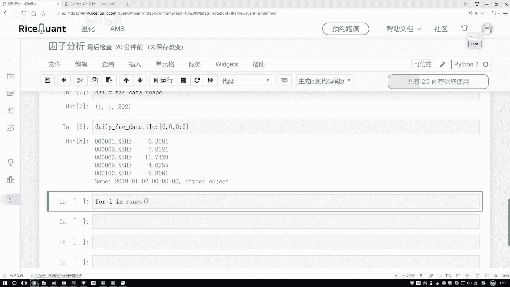

你这个序列你不是有增多天吗，看你这个而日期呢日期在上边看。

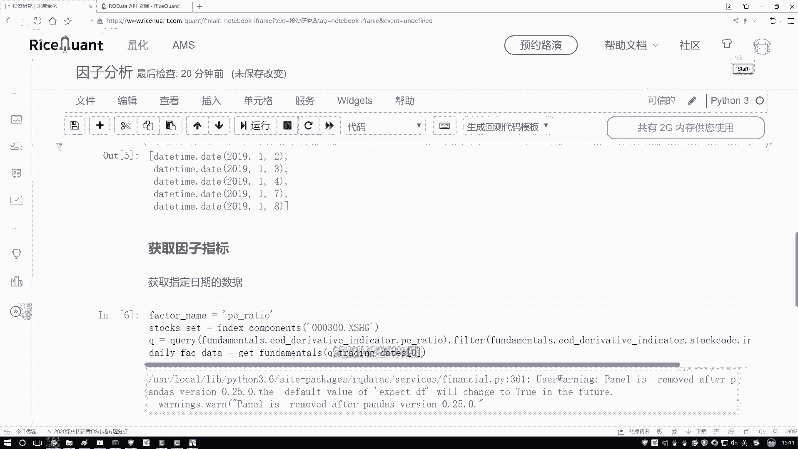

咱日期一共多长，那相当于是有多少天吧，遍历其中的我的每一天数据，然后呢对我每天数据我都要我都要干什么，都要去获取一下当前它的一个值吧。

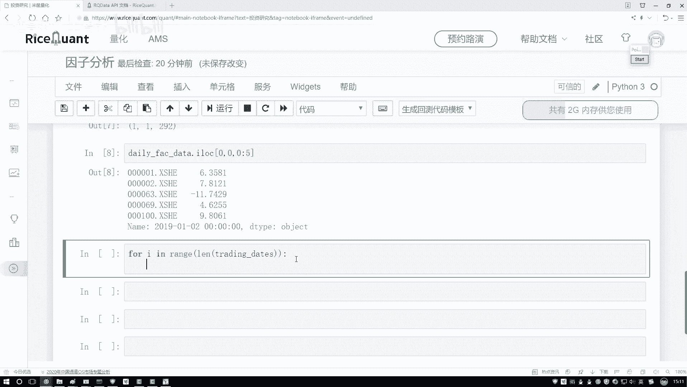

好了，我这块直接复制就行，对于每一天数据我都要获取它的一个值呃。

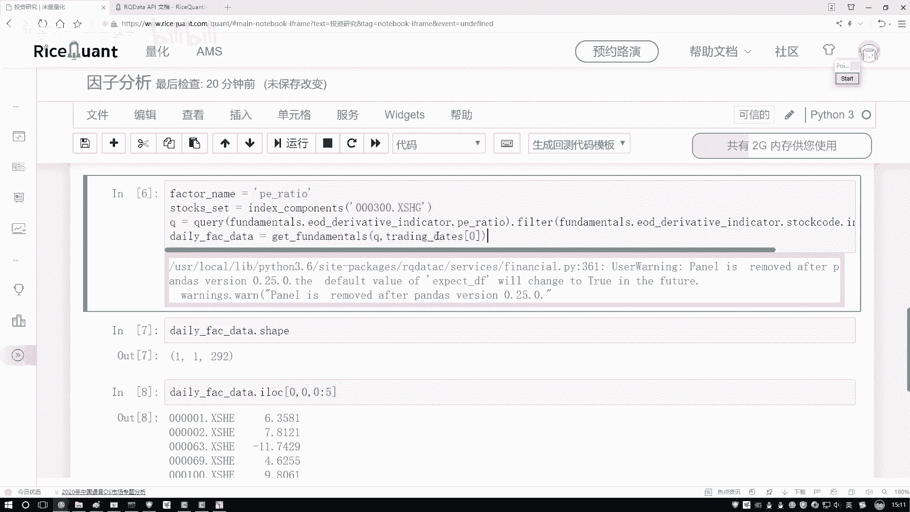

只不过这回这回这里边它就是不是传一个零了，而是传什么应哎不是哎，应该是传一个I是吧，获取它第I天实际的一个值，然后他对值来说它返回的是一个三维的，我不需要还是LC一下LC当中啊，第一个指标就是一个零二。

然后第二个也是零二，然后第三个指标取全部啊，因为有用的全在第三个指标当中吧，刚才这个shift值属于大家打印来看了，这样我就能取到当前诶，它的就是每一天它的一个数据了，那行吧，那取完每一天的数据之后。

那我最后啊你不能只把每一天都告诉我，你是不是要做一个汇总啊，我希望可能这样，我做一个数据啊，我是这样啊，第一个维度啊，它是一个日期啊，代表它是哪一天，比2019年3月8号，然后第二指标。

第二指标可能是它的一个股票的一个名字是吧，然后第三个指标可能是它的一个实际指标值，一个value到底是等于多少吧，那我是不是说我得构建一个新的大点data frame，然后呢我这里读完每一天数据之后。

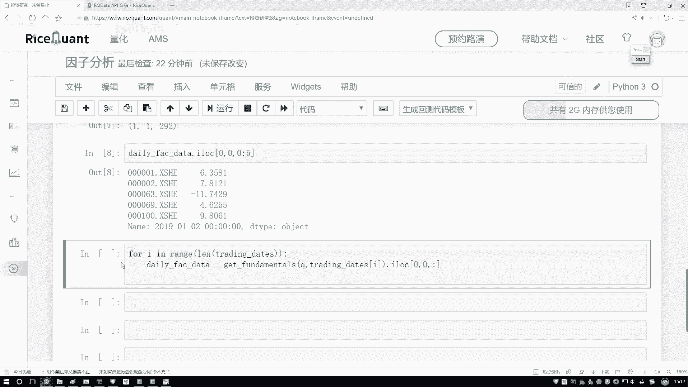

把每一天数据，把每一天数据拼接到哪啊，拼接到我当前组成的一个整体的一个，data frame当中吧，Fetters，然后呃fetters的一个data吧，等于下呃新建一个data frame。

一会儿呢咱拿这个data frame往里去传数据啊，我说先构建一个这个就是总的啊，就是一个总表吧，好然后这个就是一个每天的啊，每天的数据好了，那现在我们已经有了一个每天数据。

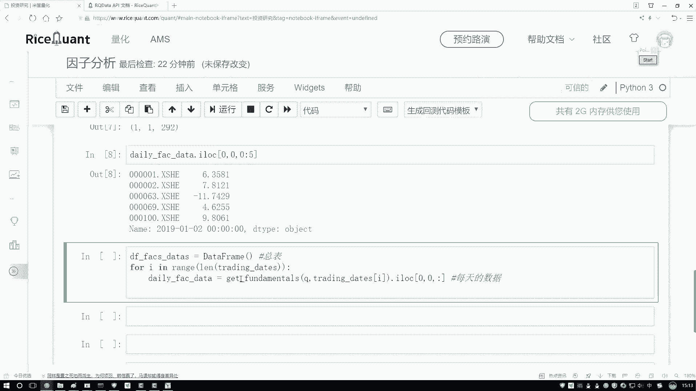

然后呢在这里哎我们先给它指定一个列名吧，在这里，我说我现在也是重新的去创建一个data frame嘛，然后一会儿对data frame进行一个拼接的操作好了，说当前我的一个data啊。

等于一个新建一个data frame，新建一个data frame，然后在我当前的data frame当中啊。

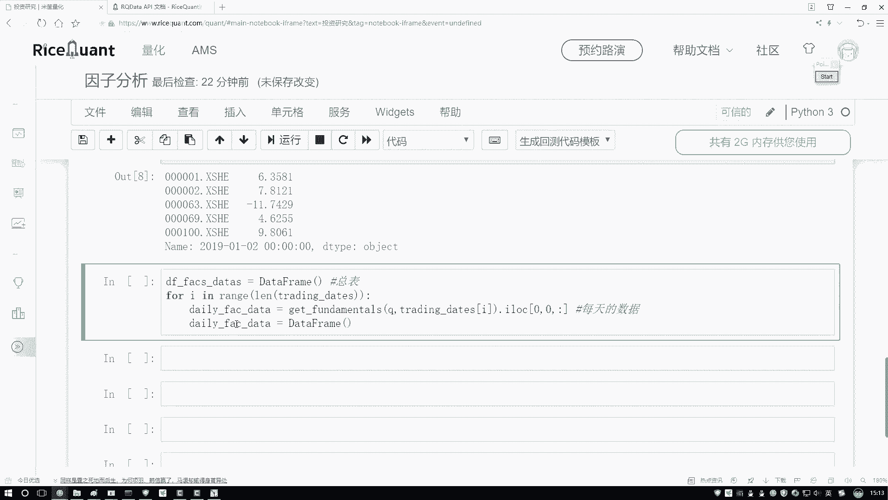

我看一看当前pandas当中哦，panda当中我直接把data frame导进来了吧。

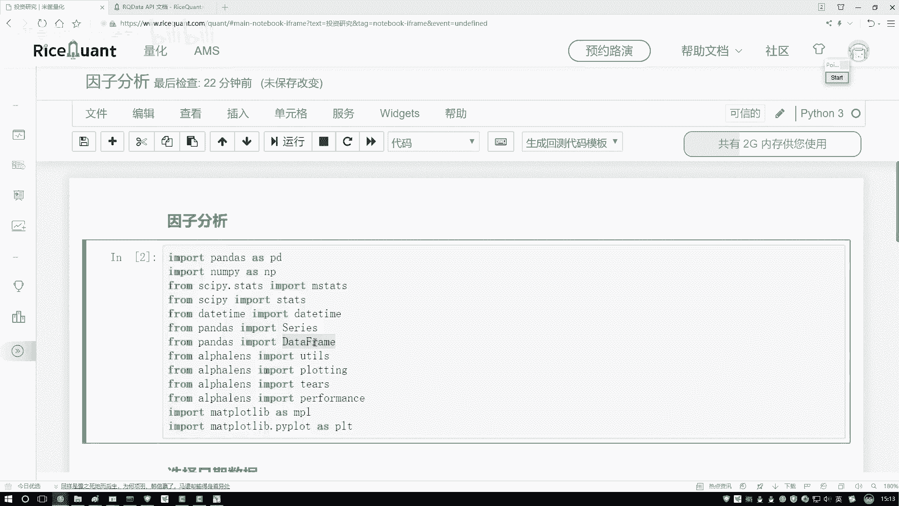

所以说在这里可以直接去用哦，再创建一个新的data frame，然后呢，我就把实际它的一个值哎给它传进去就行了，然后这个给它起个名字吧，它就是一个这个frame了，不是这么一列数了啊行了。

咱们现在有了一列值了。

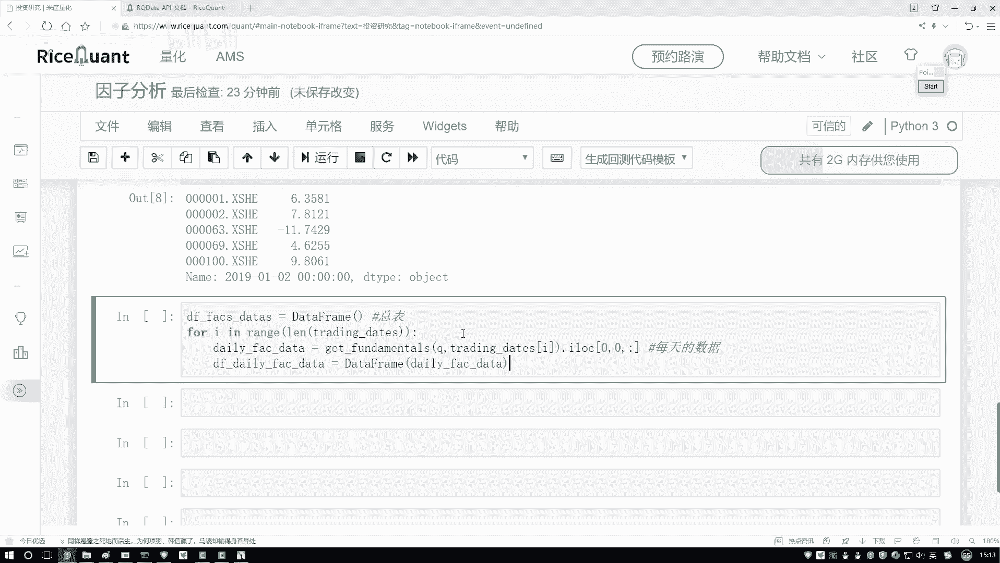

有一列值还没完，还有什么咱得给它起个名字，这个列啊你得告诉我它叫什么名字是吧，咱们自己来起一个啊，呃起什么名都行，我们来起一个等于啊它的一个名字传进去，它就是哎这个factor。

它的一个实际指标值等于多少吧，好了，这样我们现在创建一个data frame当中，只有一列数据，哎我们还给它起了一列名字，那我们刚才说啊，就是在这个data frame当中啊，哎呀你不光定个值。

你是不是还有得有一些日期的一些信息啊，好了我说这样你再新加一列吧，新加一列，我说指定名字就是一个日期，日期等于什么，在这里哎你说我们现在有没有它是哪一天啊，是不是当前遍历到第I天了。

我把第I天数据加进去数不就行了，这样我现在构建了一个哎。

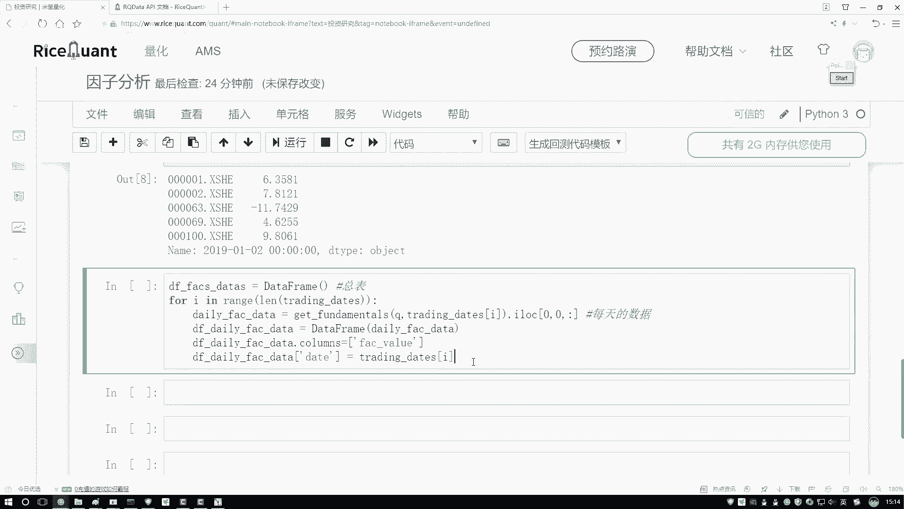

就是每一次循环当中，我都会构建一个data frame，data data frame有两列，一列呢就是我的一个日期，一列就是它的一个value值啊，咱们现在有了吧，好了。

那我说我现在啊哎呀有了所有的操作了，那我那我是不是应该怎么样，把这些个数据做一个拼接操作啊。

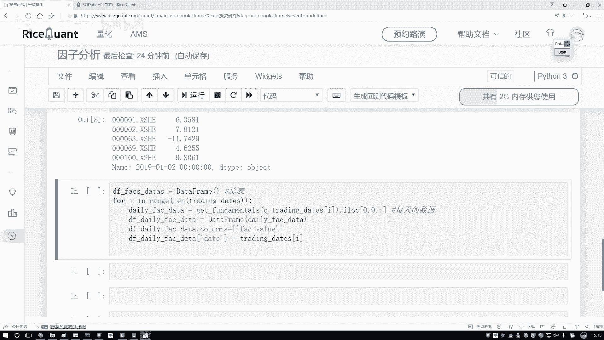

什么拼接，你for循环每一次都得到一个新的data frame。

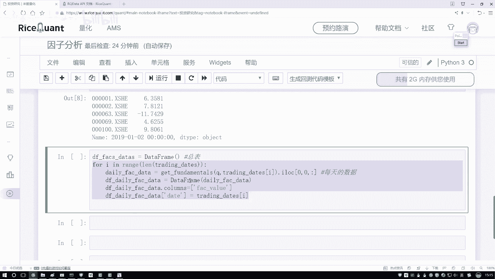

你是不是把每个data frame放到这个总表当中啊，最后我要的是什么，就是这样一个总表吧，好了再来执行拼接操作，pandas点contact一下呃，拼接拼接当中啊，你需要传递参数，谁跟谁拼呢，好啦。

先把咱们呃最开始我说我构建的一个DAS啊，拼到我这个总表当中，把谁拼上去呢，咱刚才是不是自己哎，我构建了一个data frame啊，把咱们当下这个data framework给勾进去，我说拼接成啊。

拼接到总表中吧，行了，这就是执行一个拼接操作呃，我们先执行一下，看有没有什么问题啊，这一块的速度啊肯定会比较慢哦。

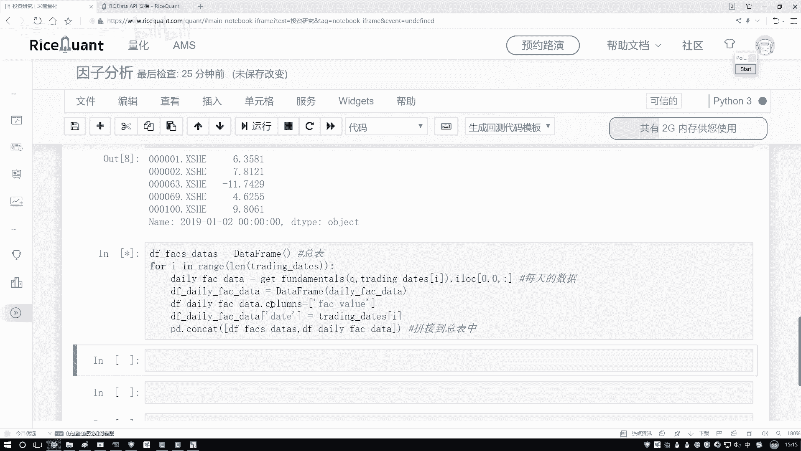

因为这里它是咱们现在指定什么，我们是指定了一个呃，时间间隔是有这么一年吧，19年1月1号到这个20年1月1号。

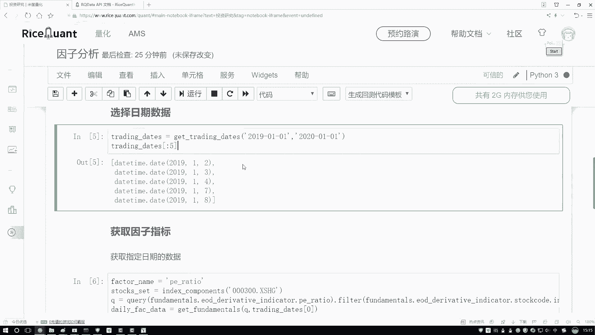

时间间隔会比较久，所以说它的速度相对来说会比较慢啊，到时候大家自己玩的时候啊，要不就没没有，说完就行了，没有后话了，大家自己玩的时候也不用了，也不用再改小了，一年这个时间也挺快的，很快就出来了好了。

刷完之后咱打印一下当前head的，看看跟我想要的是不是一样的啊，哎呦这个data frame当中总表来说还有点问题，咱来检查一下这一块拼接完哎，拼接完之后咱疏忽了一点什么，这个表实验是不是啥也没有。

我这个拼接完就是光拼了，怎么样，没赋值吧，咱们是不是得重新赋值啊，要不然相当于这个表始终没东西吧，这不行，咱再来再重新执行一下啊，这回重新执行完之后，咱再点还得看一看当前啊我们的一个表当中。

是不是按照我的一个想要的，有我的一个日期，然后有它实际指标的一个值，然后还你还得还得有什么，还有这差得有当前这个股票它是什么吧。

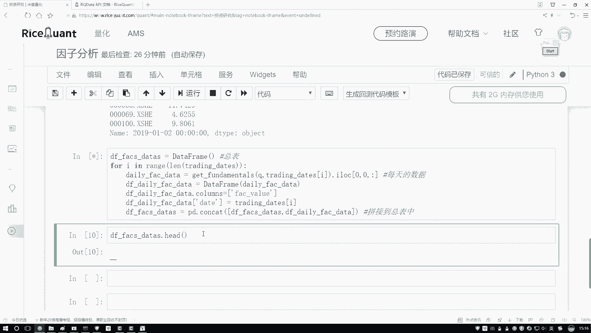

我们需要这几个指标来看一看呃，稍微再等几秒啊。

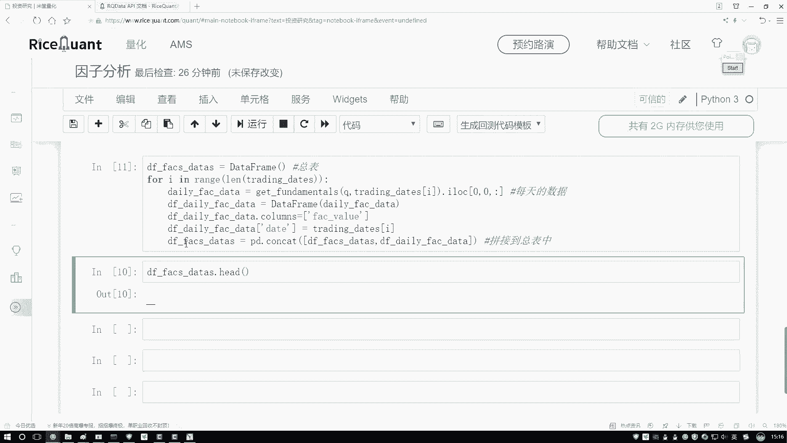

咱们就哎来执行一下好啦，你看一下这些是不是我们想要的股票啊，它具具体是什么。

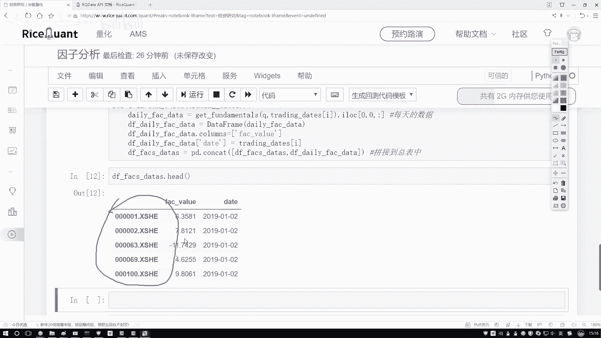

不管了，它的一个值是不是也有了，它的一个日期，是不是也有了，这样是咱们现在完成第一步哎。

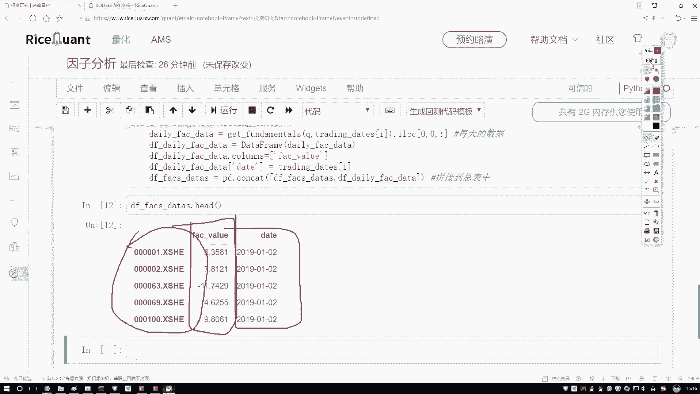

把我们这个数据啊全部给它取出来了，取的过程当中啊，其实挺麻烦的，但是也没什么好办法，你不能就是有憨豆bar自动一天一天给你执行。

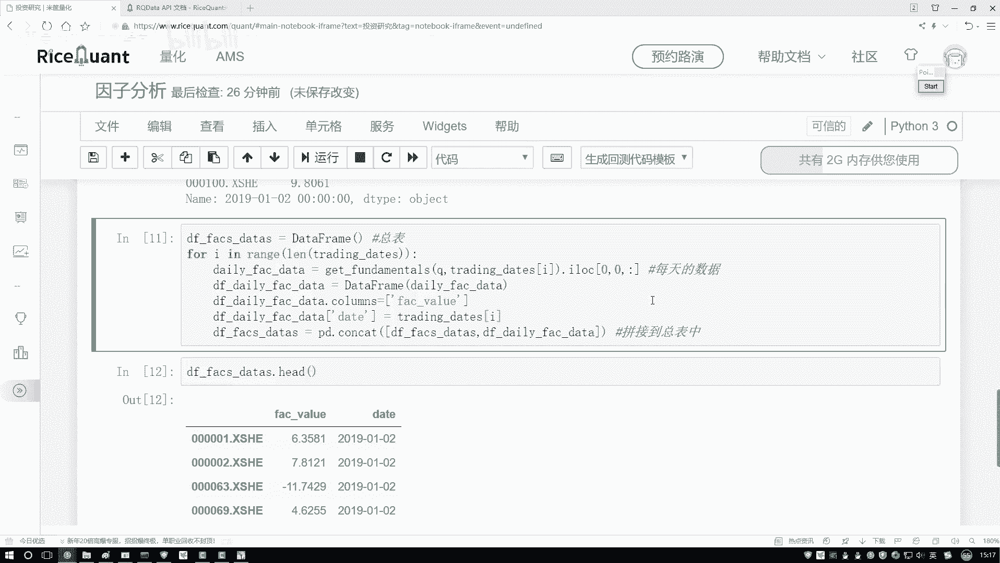

所以说咱必须得自己完成这样一个操作。

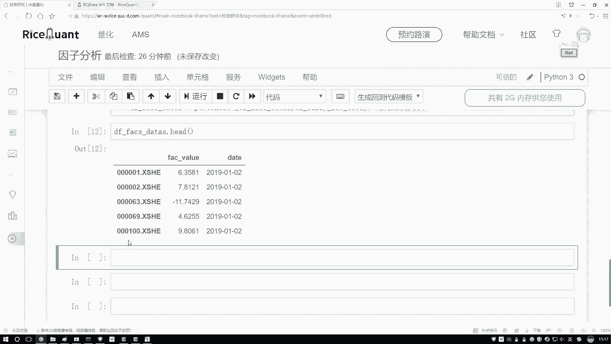