# 吹爆！Python金融分析与量化交易实战课程全详解，迪哥手把手教你基于Python实现金融量化+股票交易，究极通俗易懂！ - P65：3-Pandas滑动窗口 - 迪哥带你学CV - BV1KT421Y73G

这节课呀来给大家讲一下，在我们的时间序列当中啊，另一个比较重要的概念叫做滑动窗口嗯。

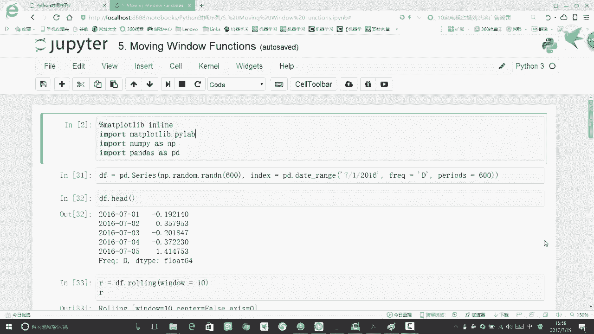

首先啊先给大家解释一下，什么叫做一个滑动窗口呢，比如说啊我现在有一份数据，这份数据啊它是从这个2016年开始，一直到2017年结束，中间啊有365个点，包含了咱们一个365天，那在这365天数据当中啊。

比如说我现在拿出一个时间点，就是一个2月5号吧，拿出来一个时间点，2月5号我想看一下在2月5号他的一个情况，那这个时候啊，如果说我们单拿出来这个点，用这个点的个数据来描绘当前情况是可以的吧。

但是呢有没有更好的一种方案，哎好像来说单独拿出一个点有点太绝对了，它会不会有一些或多或少的误差呀，但是呢假如说啊，我想看一下在2月5号大致的一个情况，那我是不是可以取它的一个范围啊。

比如说我现在我把一个2月1号，2月2号，2月3号，然后一直2月4，这样一直到2月10号，我把这十天数据拿过来，这时间数据啊，我取一个平均值啊，我说当前的一个平均值啊。

描述的就是大概是2月5号这天的一个情况，这种时候啊是不是更科学一些啊，尤其是当我们要进行一个预测的时候，我们在预测的时候呢，单独拿一天数据啊，好像来说太绝对了，所以说我们可以基于这样一个窗口。

基于一个窗口做这样一个平均，可以使得我们的一个值是更平稳一些的，那滑动窗口什么意思呢，比如说现在呢我指定一个窗口啊，长度是十，那现在假如说在我的数据当中，这是第一个窗口，第一个窗口啊。

我会统计十天的一个指标，然后啊对它求一个平均的值，那求完了这样一个窗口之后啊，我的一个窗口会干什么，它会滑动，也就是说，比如说第一天是从这个2016年的，1月1号开始的，然后呢这个窗口的长度是等于十标。

含着1月1号到1月10号啊，这样的一个区间上，这是我的第一个窗口，一号到这样一个10号，然后呢我的窗口后往右移，往右移是什么呀，不是说，接下来我是到从这个1月10号到1月20号。

而是说呀我往右移动一个单元格，我们来看这个窗口大小还是十，只不过说第二次的一个窗口呢，我就是2016年的一个1月2号，到我的一个2016年的一个1月11号，相当于啊是我往右进行了一个滑动吧。

每次我统计的都是这样一个窗口，然后呢我的一个窗口啊，要一次一次的往后去移，哎如果说啊大家听过我的那个卷积神经网络啊，应该知道这个东西跟我们一个卷积计算方式，挺像的吧，我们有个stride有个不长。

就相当于是嗯，我们这个就是我们的窗口是不断往右去移的，一次呢移动单元啊，一次啊，移动单位个长度，然后我们要统计它，始终是十个单元格的一个长度，那这个就是我们的一个滑动窗口。

这个滑动窗口呢是会不断的往下去移，最终呢移到最右边，最多啊，移到我们的最右边，使用这种滑动窗口的形式啊，会使得我们统计数据会更规范一些，不能说更规范吧，就是说更平稳一些，这样咱们看的数据啊。

它浮动范围就会比较小，而且呢是比较有代表性的吧，单独拿出来一个可能或多或少有一些离群呐，有一些差异或者是错误，会影响我们这个结果，但是呢用时间窗口啊，它统计的数据是更啊规范一些的。

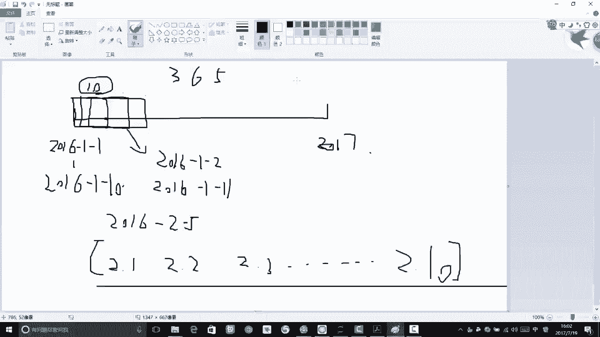

然后下面我们就来看一下嗯。

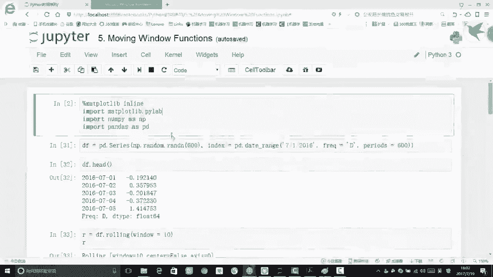

当我们想用pandas啊去做这样一个滑动窗口，怎么去做呢，很简单啊，pandas as直接给了我们这样一个函数，我们用这个函数可以很轻松的把它做出来，首先啊我们还是指定一个serious。

serious里边呢我们就是造一个数据啊，造数据啊，还是像之前也是一样啊，我们指定一个index，index值里边就是存了一些随机的数，然后用安排生成一些随机数呃，我们指定啊。

咱们要生成的数是有600个，这就是我当前的一个结果，600个相当于一共是有600天吧，让我们看这块frequency，我指定一个D相当于是做了600天的一个数据。

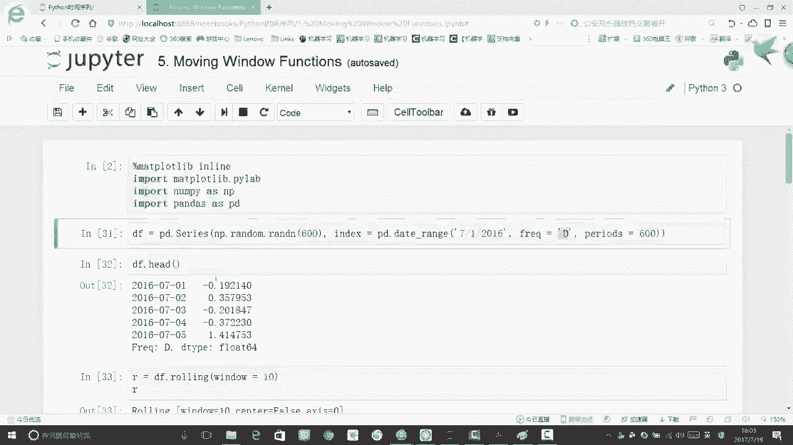

然后呢我要做这样一个滑动窗口啊，很简单啊，我们把当前的一个嗯就是一个结果拿过来，比如说我当前的这个serious。

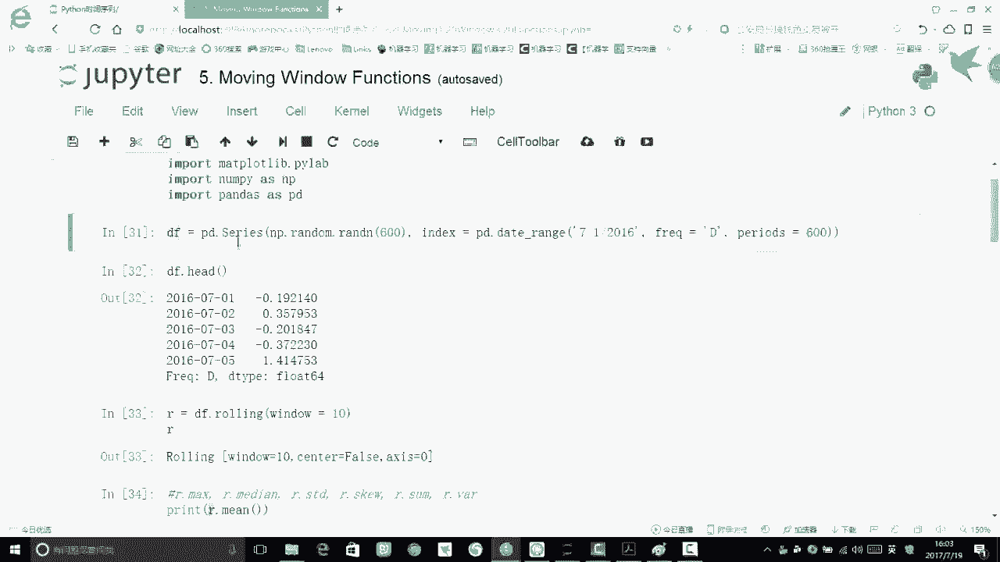

我指定一个嗯变量叫做一个DF，用我的DF点rowing一下，rowing什么，相当于去滑动一下，滑动里边啊，你需要指定一个参数，就是你的一个滑动窗口的大小，你也可以指定啊，就是你的滑动窗口是居中的。

还是从左边开始的，这些啊都是可以自己去指定的，用默认开始啊，它就相当于从九从左开始一步一步往右去滑。

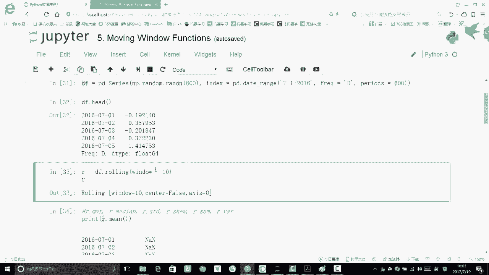

在这里呢我指定完这个ruin之后啊，我们再打印一下当前结果，当前呢就告诉你了啊，当前的一个window是等于十啊。

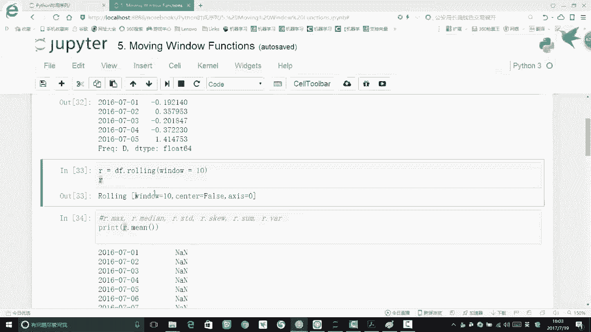

它不是去居中的，它就是从左往右一点点去滑，然后呢我打印一个结果，你要打印结果的时候，就是说嗯当前这个窗口啊，你拿出来了，那你想统计这窗口当中的什么东西啊，你需要自己给他指定一下。

比如说你想可以看一下窗口的一个最大值，窗口的中位数，窗口的标准差，还有这样倾斜度啊，总和啊，这样一个标准差都是可以的，这些啊，就是说嗯你可以指定一些指标，当成我这个窗口计算的一个量。

比如说现在呢我想算一个均值，算均值的时候，我就把这样一个mean值传进去，我们看我刚才指定了一个rowing，我让这个ROIN只等于一个变量，是等于R的。

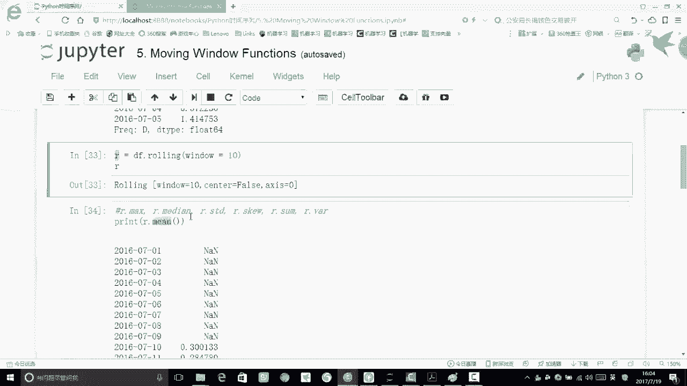

然后呢我就算了一个R点M2点命的意思啊，就是说在当前长度为十的这个窗口上，我计算它的一个均值，看一下它是等于多少的，那这个时候怎么算啊，是不是，我们首先啊就是它得是先把这个窗口拿过来。

那对于你7月1号来说，有窗口吗，没有吧，为什么，因为窗口长度是十啊，从左往右开始，你得有这个窗口才能帮我去计算吧，那小于这个窗口长度啊，它就不会帮我们去计算。

所以说呢它帮我们返回的就是一个not a number，返回这样一个NN，然后从第十天开始，第十天开始啊，终于这个窗口它长度够时了吧，所以说呢在第十天上它的一个长度啊，我们算出来了，它就是等于一个值。

这是它的一个均值，相当于是前十个值算了一个均值。

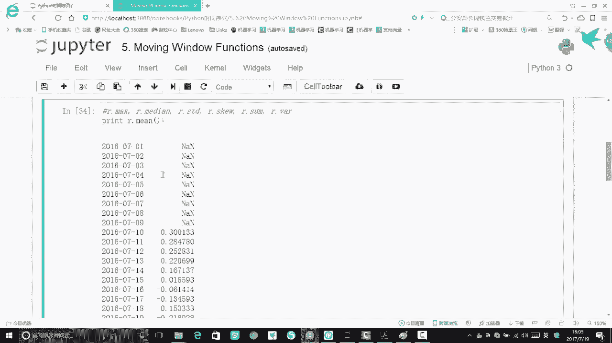

然后呢第二窗口又来了吧，这就是第二个窗口，然后我们第三个窗口，相当于啊每次往右边去移动这样一个单元格，每一中一个单元格。

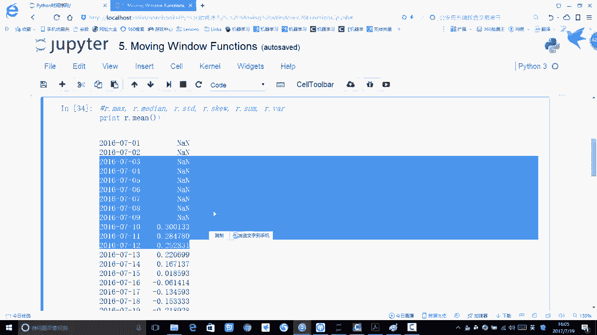

我们就可以先算一下，当前的一个结果是等于什么了，这里呢就是啊，咱们的一个滑动窗口该怎么样进行一个计算，在我们的一个时间序列上，是滑动窗口用的还是蛮多的，因为呢我们希望拿出来指标是呃更靠谱一些的。

单独拿出来一个值啊，可能有一些差异，拿出个窗口呢，它这个指标会更接近于一个真实的情况。

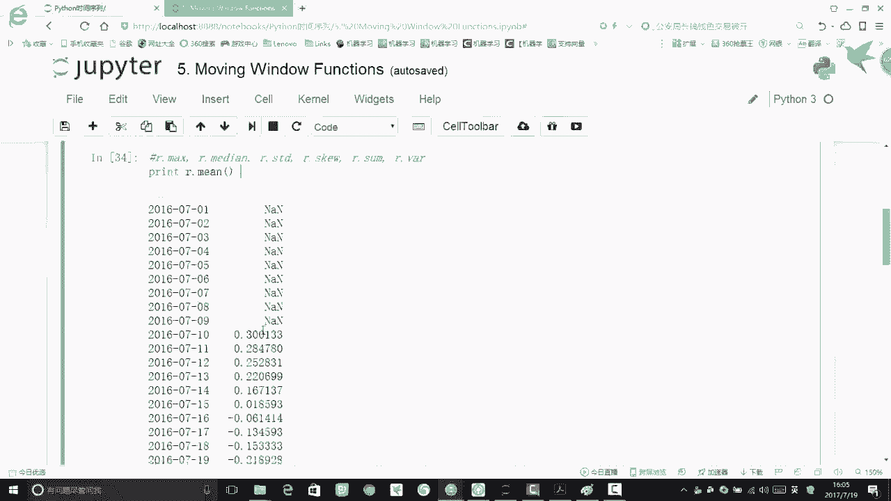

然后下面我们就可以来画一个图啊。

就是用这个MAD plot，首先指定一个feature size，咱们画图域的一个大小。

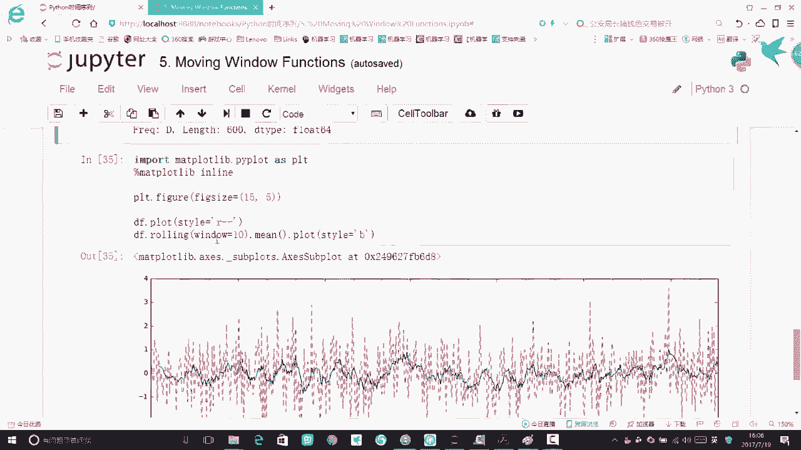

然后呢我直接啊就是可以用我的一个数据，就是我的创建好的那份数据吗，直接可以点float一下，float里边，我们可以指定它的一个颜色和它的一个线条，比如说我让正常的一个数据啊，它是一个红色。

并且它是一个虚线去画，然后呢我又给rowing一下吧，rowing完啊，我求了一个均值，再PLOAT一下。

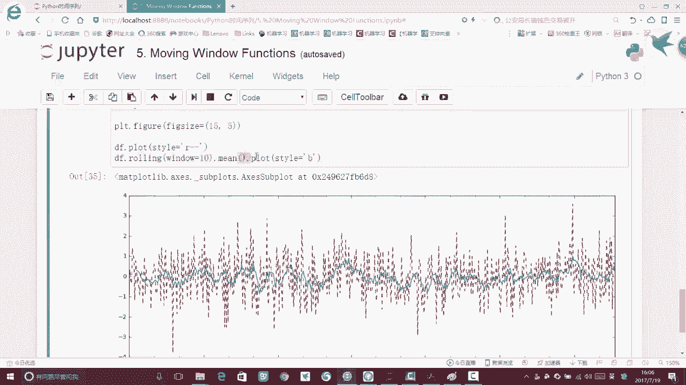

里边呢我用一个蓝色去画，现在啊我就得到了一个红色的点，还有一个蓝色的点。

这个红色点和蓝色点画出来，结果就是长图上这个样子。

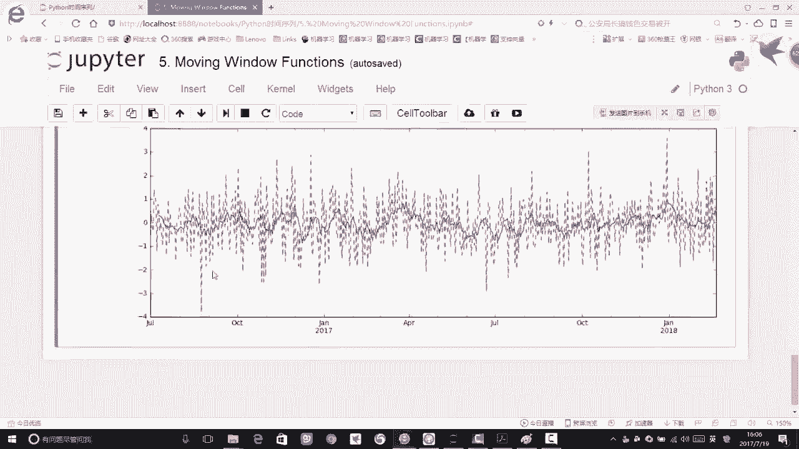

我们可以看到的，就是说嗯，当前啊这样一个红色点浮动差异比较大吧，因为啊它也是一个随机的数据，但是呢我这蓝色点它的浮动范围更小一些吧，因为啊我是在一个单单位的一个窗口上，求了这样一个均值。

所以说啊它看起来就是更具代表性一些，因为呢他求的是当前一个窗口的一个平均值。

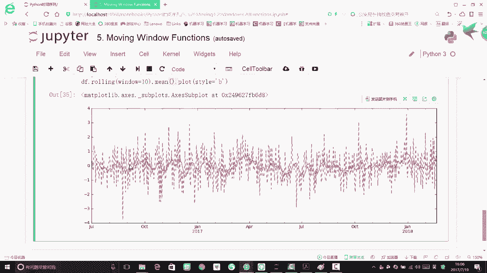

这个就给大家演示了一下嗯，怎么样用pandas做咱们的一个时间窗滑动窗口。

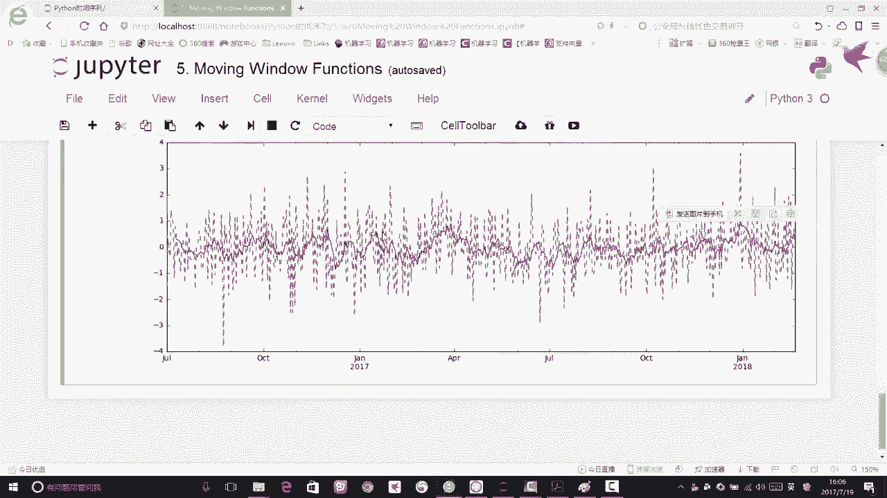

然后呢基于这个滑动窗口啊。

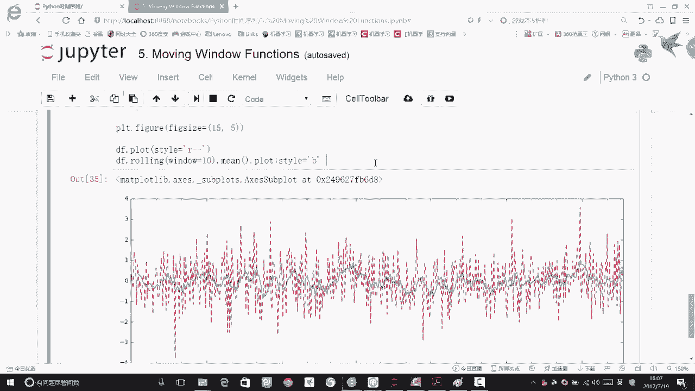