# 吹爆！这可能是B站最完整的（Python＋机器学习＋量化交易）实战教程了，花3小时就能从入门到精通，看完不信你还学不到东西！ - P12：第12节-金融时间序列-II-Hidden Markov Models - 凡人修AI - BV1Yx4y1E7LG

最后一块内容来主要介绍一下影视马可夫模型，也就是我们在前面common filter里面也遇到过的，Hidden mark of model，那么hit the marko model。

我们在前面做卡尔曼滤波的介绍的时候，已经简要的介绍过了，就是说他呢其实是一个嗯，to state的一个transformation。

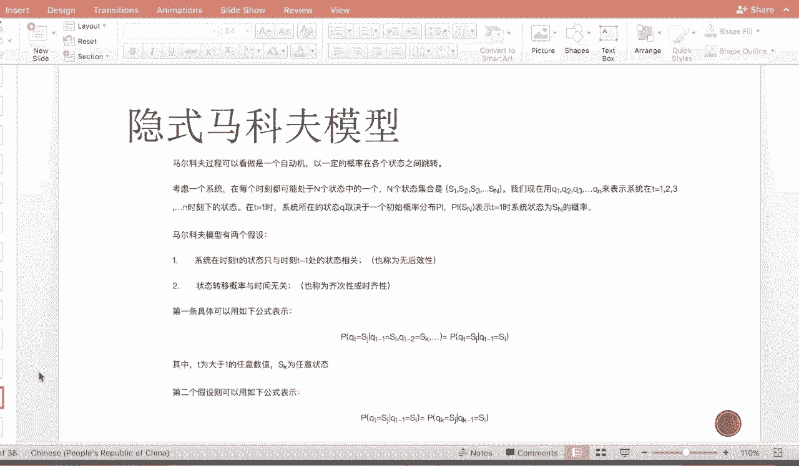

也就是我有我真正想要得到的东西，是这个hidden state，那么它hidden state呢在这个内部的一个黑箱里，进行着一个这个默默的跳转，那么每一步跳转呢都有一个概率。

那么比如说这个时候已经跳转到DXI部了，那d xi部的state呢是完全由d xi减一步，和pi到DI加一这一步的这个update的这个probability，所决定的。

跟dpi以及之前的所有的state都没有任何的关系，那么这个是Mark of model的一个假设，那么到了每一步之后呢，它对外都有一个observation的显示，那我们人呢就站在黑箱外部。

我们能看到的都是外面的这个observation表示，那么我们用hidden market model或者是come on future，我们都想要得知的是。

这个内部黑箱的这个xi state是怎么样转换的，比如说在我们之前提到的PEETRADING的model里面，那么黑箱我们真正需要我们真正感兴趣的是。

这个hedge ratio贝塔跟我们的access return阿尔法，那么我们把它做做做做成了一个dynamic update state。

那外面的这个observation呢就是我们的regression，就是两个两个那个equity的price，是我们的observation等等。

那呃我们的这个hidden Mark of model呢。

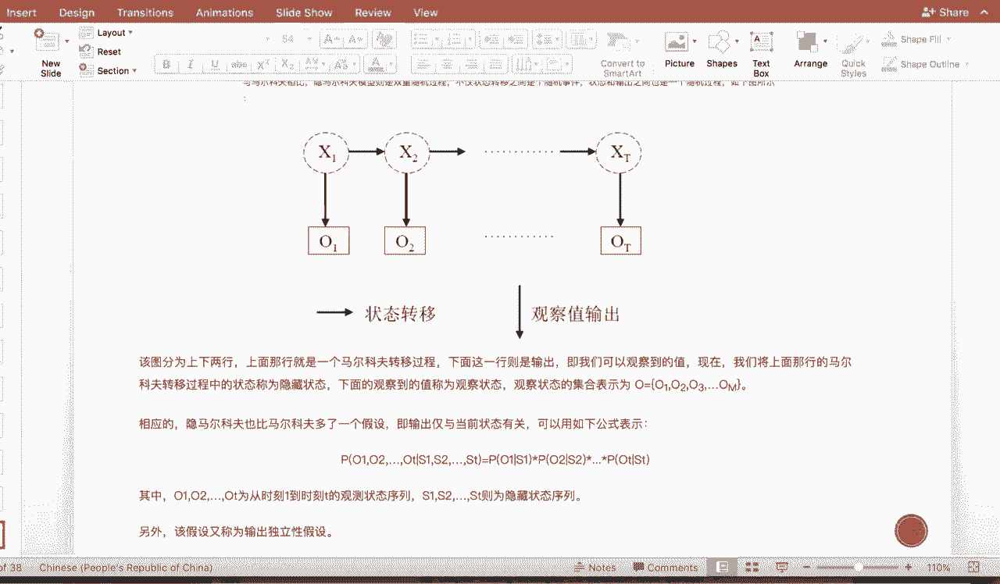

有两个重要的假设，第一个呢是系统在T1转时刻，T的状态呢只与T减一处的状态相关，也称为没有后效性或者叫无记忆性，那么这个的这个的呃例子呢，我们在刚才已经介绍过了，那么第二个假设呢是这个状态转移的概率。

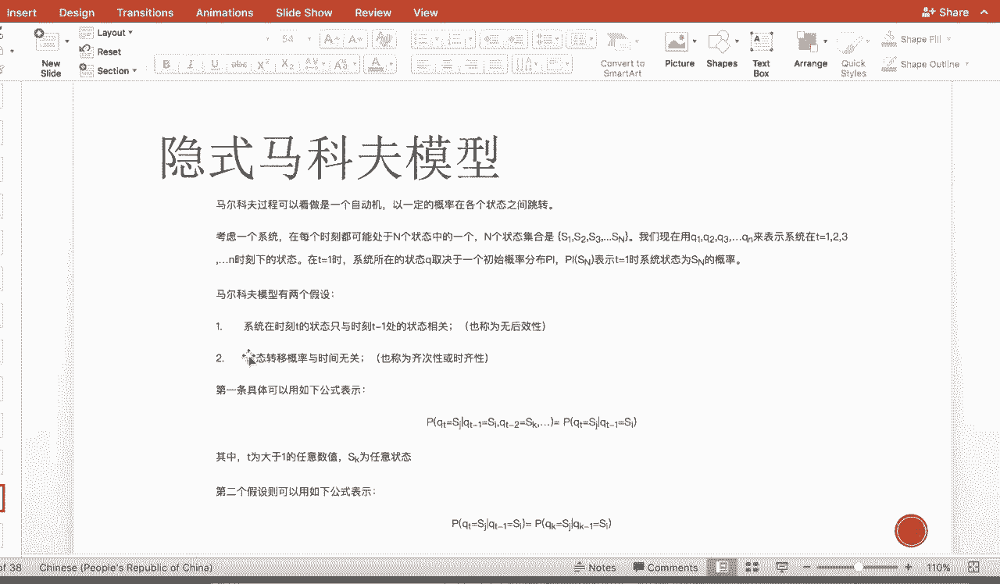

与时间无关，也就是说在第xi转移到D呃，DX1转移到DX2，这个P12呢与pi和pi加一都是一样的，那么这个有助于就是我们模型的一个简单性，不需要去估计每一个状态之间的转移概率。

那么具体的这个hidden Mark model的内部，是怎么样做预测的，它的理论比较复杂，那么我们来看一个在金融上应用的例子，那么我们这边呢因为之前卡曼滤波用Python做过了。

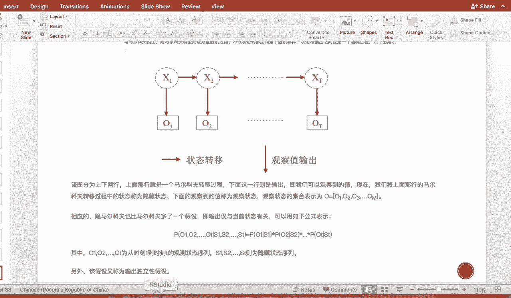

所以我们这边介绍一下用R如何做hidden Mark of model，那么它的一个应用呢就是嗯非常的有趣，可以这么说，就是说我不我有时候感兴趣的东西，是我预测下一步的，Ok fine。

我下一步的price是多少，但是有时候呢大家比较在乎的是，我这个时候到底是处于一个熊市，还是牛市的划分，也就是learning之前的这个stock path，我如果能detect现在的regime。

现在的monkey regime是不还是这个bear，那么对我们的trading的一整个宏观，有一个非常好的长期的指导，那么那么对于一整对于一条time series，Market。

time series来说呢，它是一个向上或者向下，震荡抖动的一个这样的图形，那么我如何用机器而不是人的肉眼detect，现在大概是处于牛市还是熊市呢，那么hidden Mark of model呢。

就帮我们做了这样的一个事情，也就是hidden Mark of里面的状态，其实是我们的牛或与熊，那么外面的observation呢，就是我们表现出来的price或者是return。

那么我们想要做到的是detect，每一个阶段呃，就是一整条时间下来，每一个时间点，这个时候是处于能被划分成熊还是划分成牛，那么它的划分的概率又是多少，那么我们一般认为嗯，单划分成熊的概率高于0。5。

或者我们比较我们比较那个风险厌恶的话，可能我们认为在0。7以上我们才分为是牛，那么在0。7以下呢，我们就分为是熊，那我们先看一个嗯机器simulation的一个例子。

那我们这边需要install两个package，一个是这个S4，还有一个是这个COMMO，那commode是主要是为了get data的，那上面的这个主要是做hidden Mark of的。

那这个时候我们把这个市场划分成熊跟牛，那么熊市的话呢就是他的mean，return的mean呢是啊这个FO的比较多，然后呢variance呢相对震动也比较大，那么如果是呃布偶呢是熊啊，是这个牛市的话呢。

那就是return均值是一个正的，那么方差呢也relatively来的小一些，那这个时候我们把这个市场先。

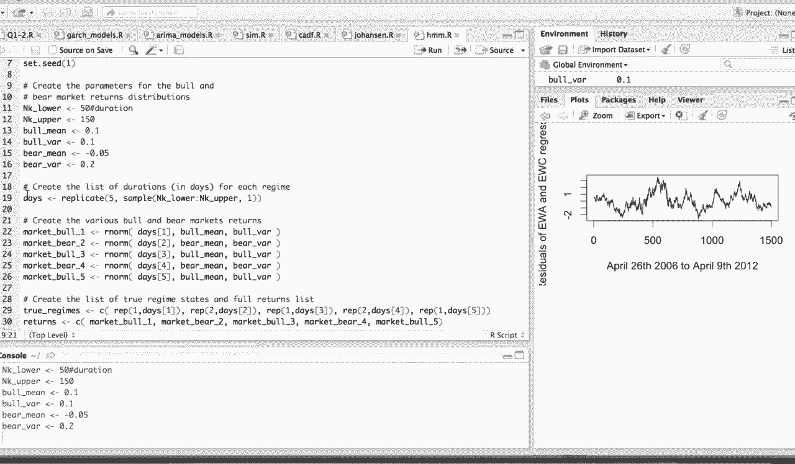

我们用这个机器simulate分成五段。

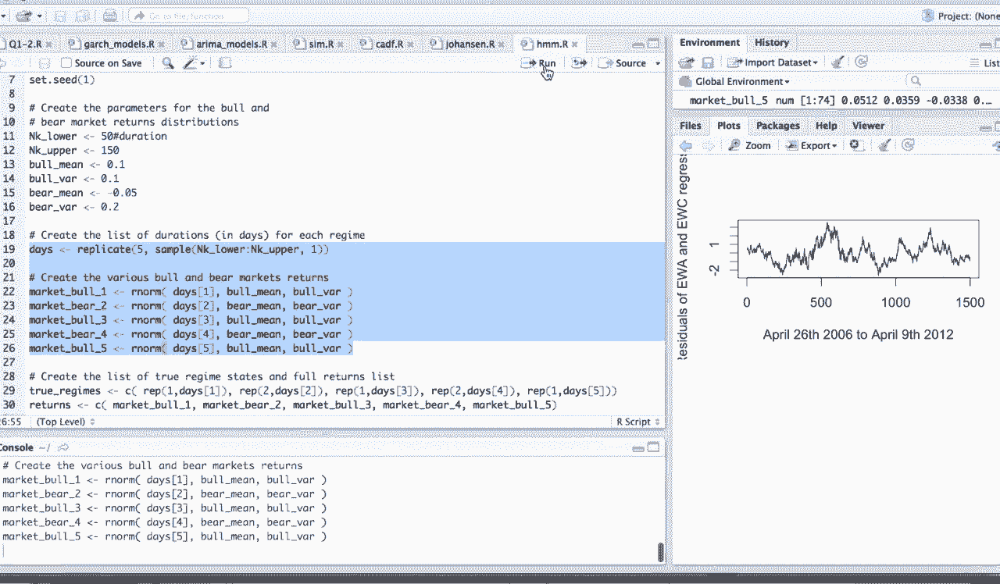

那么是这个熊跟牛之间交替的，那这个时候我们用这个，那这个我们就把上面simulate的时间序列，AGGREATE在一起，那这边这HHHMM呢跟这个fit呢。

主要就是做的是hidden Mark of model，在这个dep mix里面的那个啊包的调用。

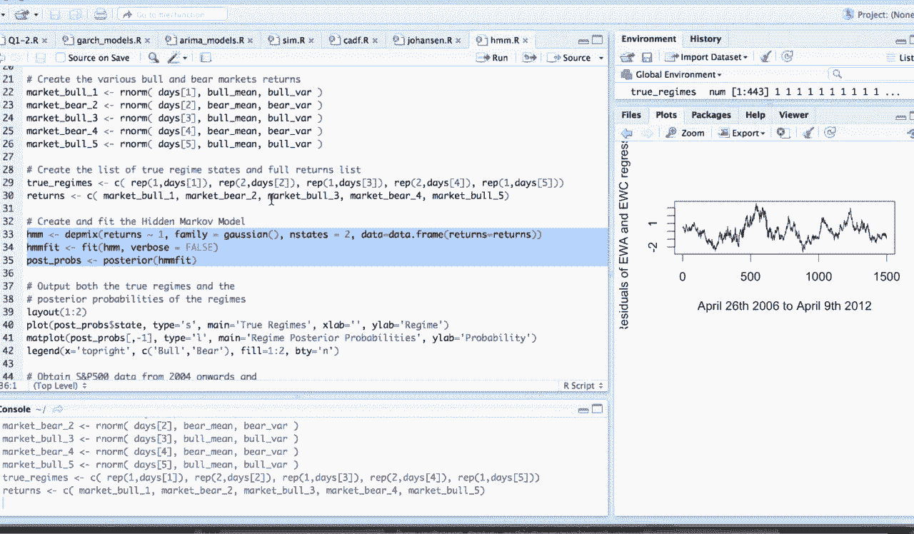

那么调用之后呢。

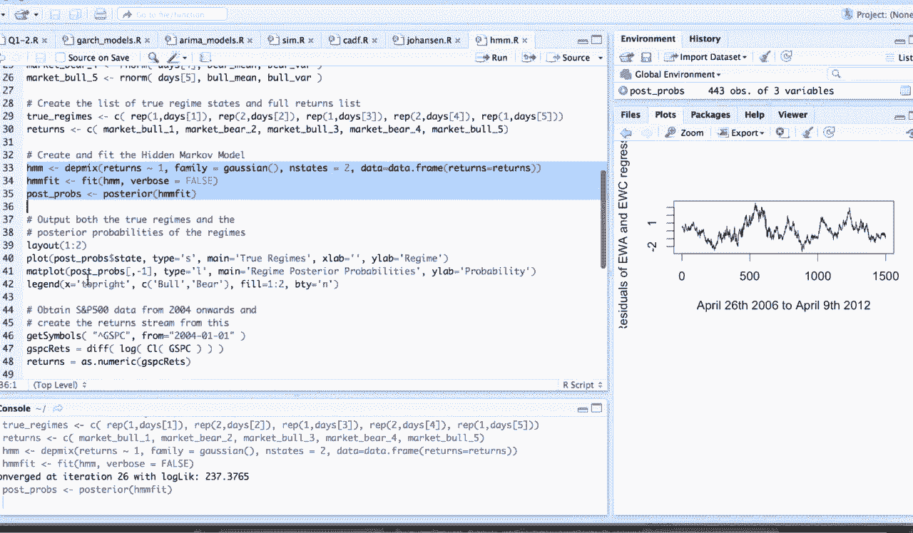

我们可以把我们detect到的regime嗯，put out出来一下，让大家看一下它的output的结果是什么样的，那大家可以看到我们真实的这个初语dream，就如我上面所说。

我们人为地把它弄成这样几段，熊的跟牛的之间相互交替，那么因为我们是在simply的过程中。

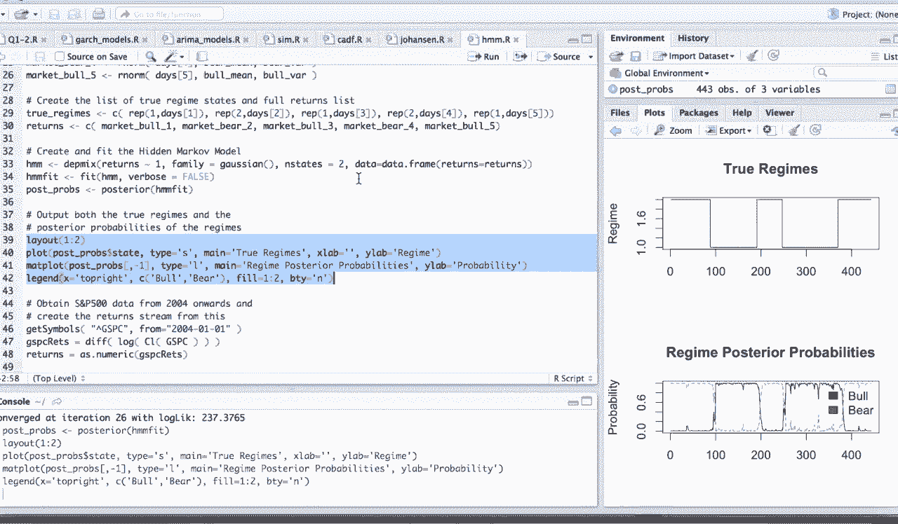

其实是加入了噪声，就是它不是一个这样子一个这么完美的梯形的，它是一个整蛋上升，然后又整蛋下降这样的一个过程。

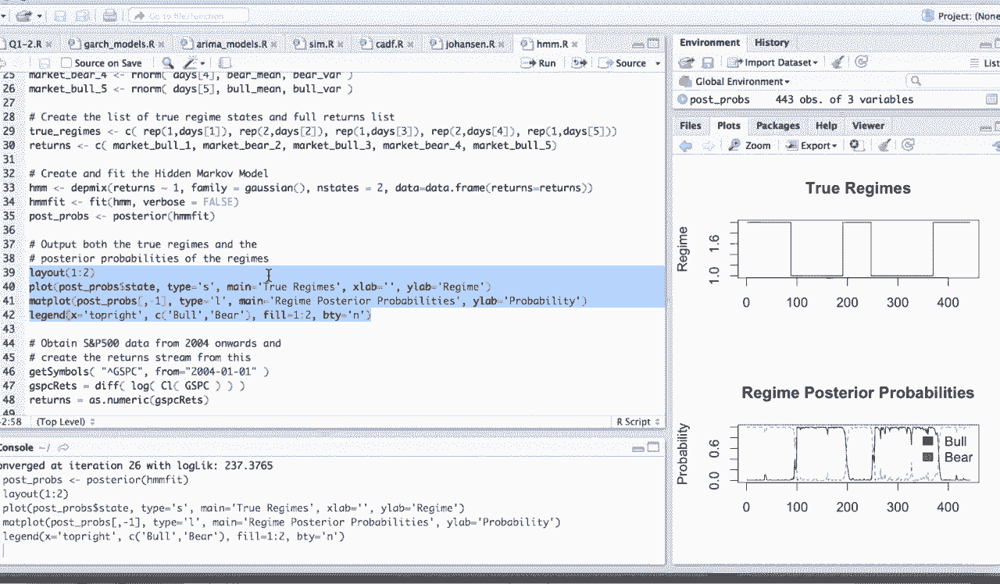

那么大家是，然后呃这边的话我们可以看一下。

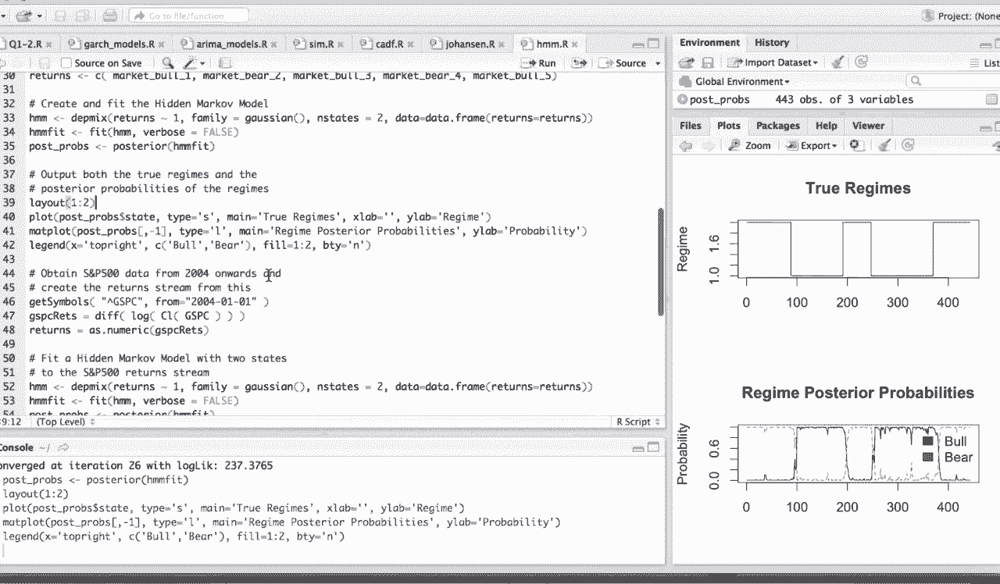

我们detect出来的这个regime，就是啊红的地方，就是我们呃我们detect它，它应该是这个bar的probability大概有多高，那么下面呢也就是这个probability的低的地方。

那么大家可以看到，就这个estimation的效果呢是很好的，那么我们再来看一下用hen mo model对SMP。

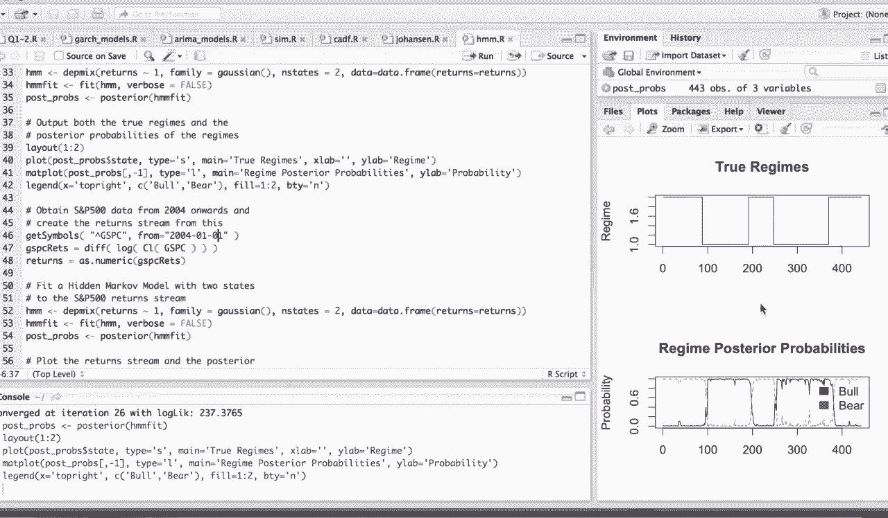

也就是真实数据的一个一个拟合，那么我们看一下在进行一个这个state调用，首先我们get这个symbol，然后呢我们得到的是一个这个log的difference，是为了让数据更平稳一些。

然后我们调用跟上面这个呃，我们simply出来一样的，然后我们跟上面的simulate的步骤一样，我们prod出我们detect到的REGIN，因为这个时候就没有一个真实的值了。

我们只能看这个return的效果，那我们可以看到我们detect的第一个regime呢，在VLO特体特别高的特别大的时候呢，这时候他的probability比红线矮的大，所以我们可以我们可以认为呢。

我们这个黑色的regime是这个啊熊市，也就是bear market，那这个红线呢那就是bull market，然后这就是我们对于这个市场的detect，那么这个红线跟这个黑线。

如果是就是两极化到零跟一两极化的越高，那说明我们这个分类器的效果越好，那么这个是hidden Mark of model，对于这个市场的划分的一个应用。

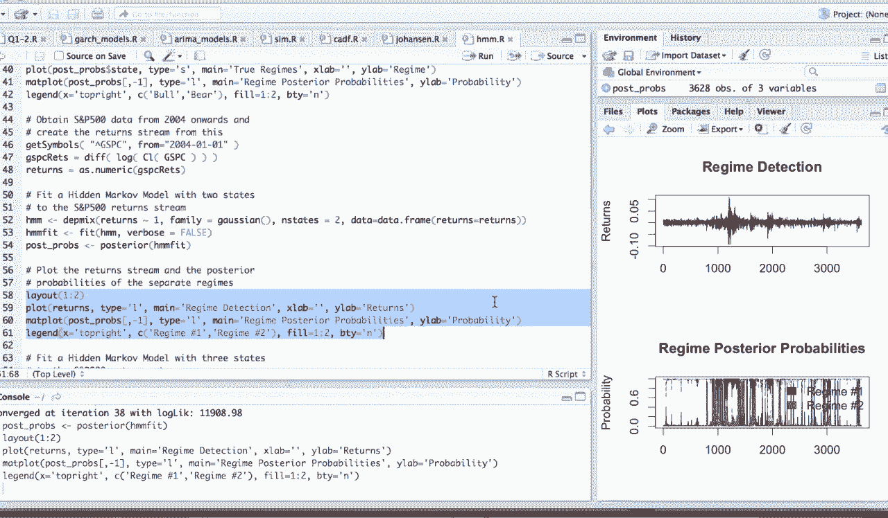