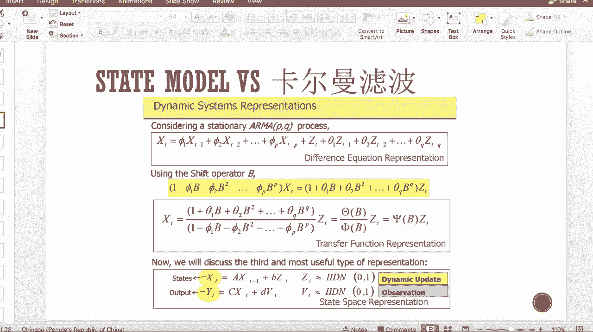
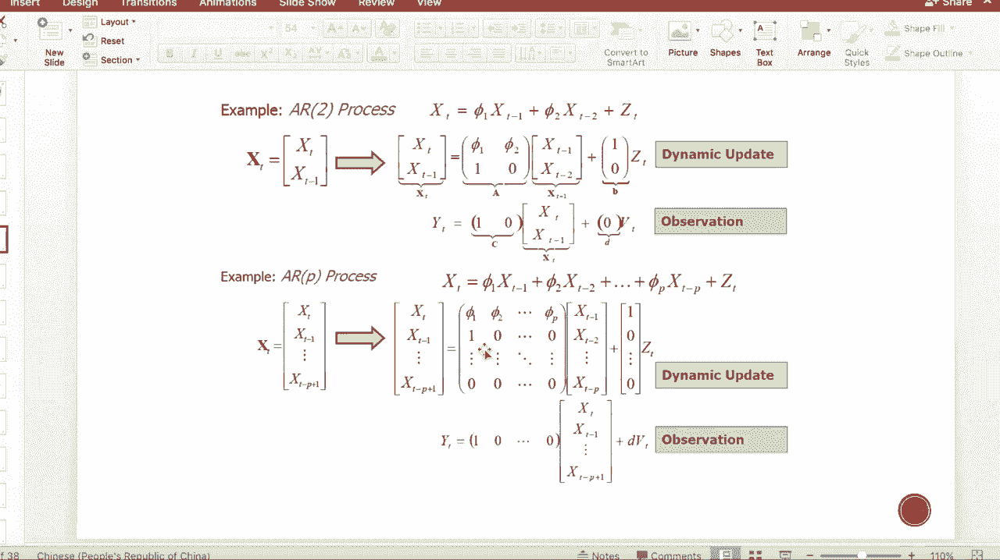
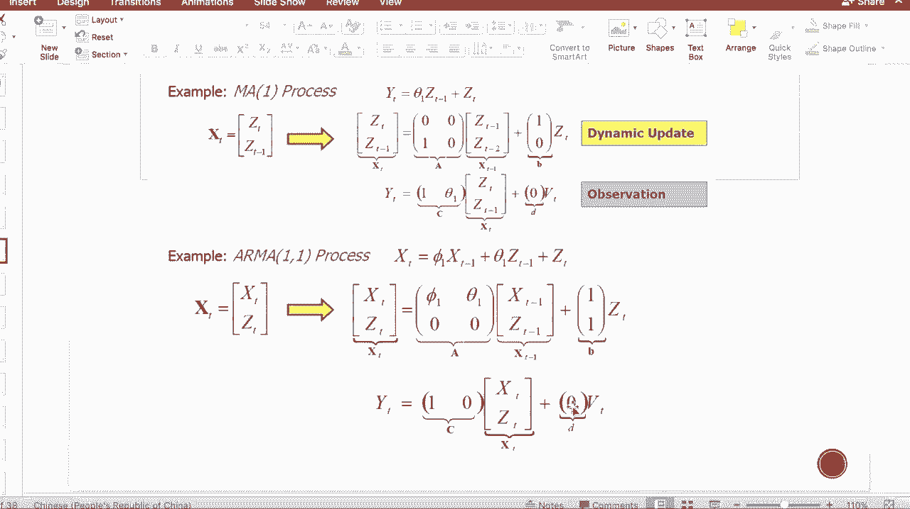
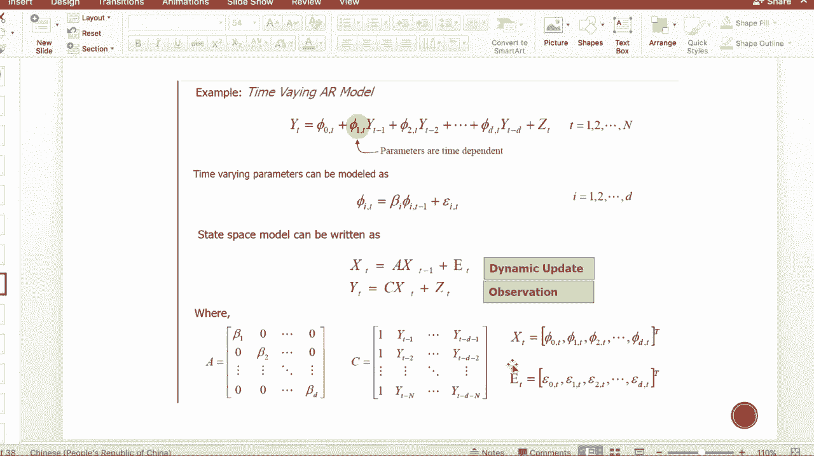
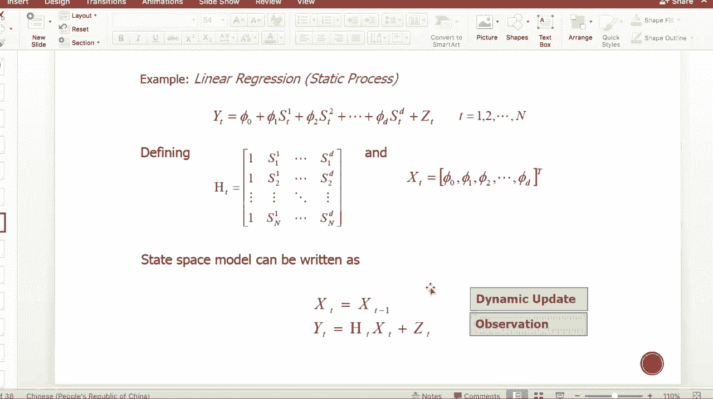
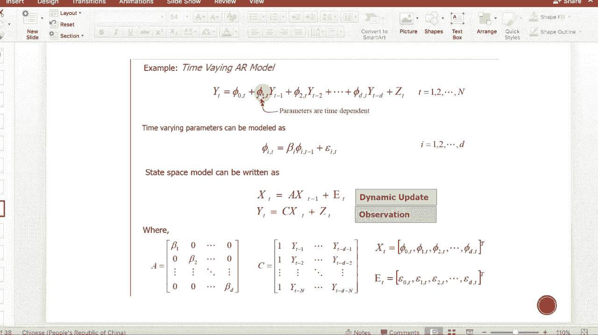
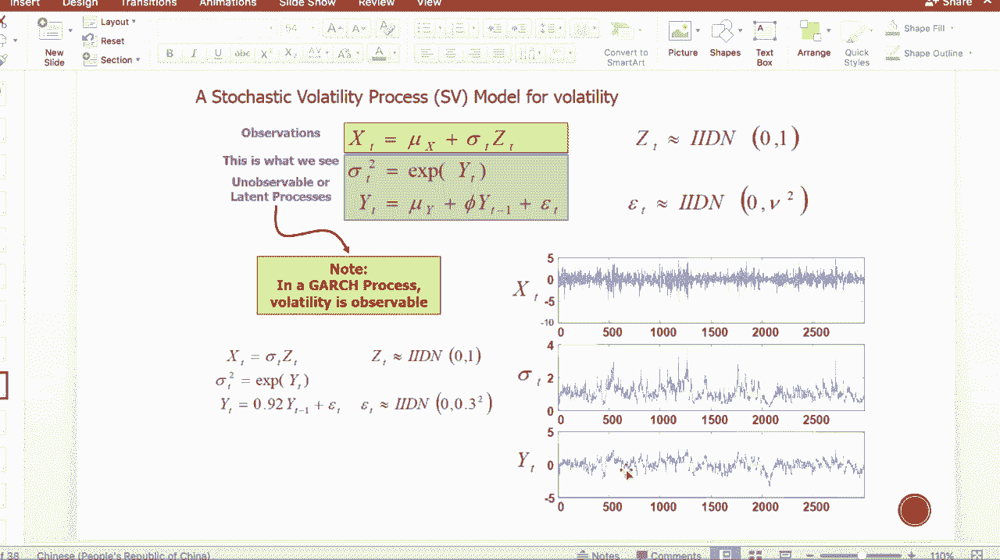
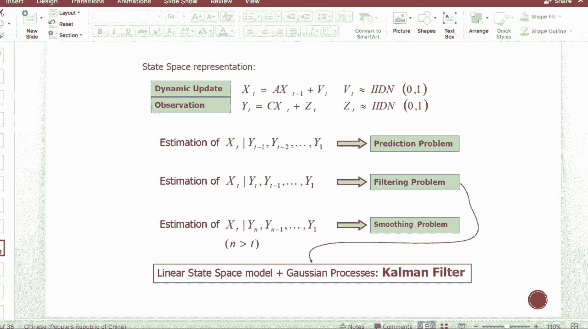
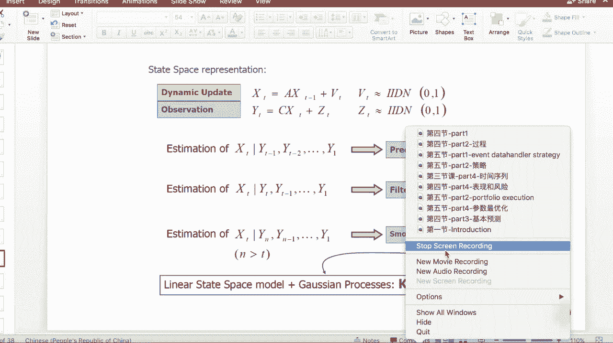

# 吹爆！这可能是B站最完整的（Python＋机器学习＋量化交易）实战教程了，花3小时就能从入门到精通，看完不信你还学不到东西！ - P13：第13节-金融时间序列-II-state model - 凡人修AI - BV1Yx4y1E7LG

接下来呢让我们来介绍一下state model和卡尔曼滤波，那么首先让我们来回顾一下，上一节课上过的内容，也就是最常见的平稳时间序列啊，阿玛PQ的模型，那么这个时候在我们阿阿玛PQ模型里面。

我们需要注意的是两个点，第一个点是我们在这个process里面可以观测到的值，就刚刚好是我的这个T，也就是阿玛的process的这个这一条时间序列，那么对于它的噪声在T呢是不可观测的。

那么第二点呢它平稳的呃，他之所以平稳的一个很重要的原因是，我们假设了所有的coefficient，从fine1到FP呃，theta1到theta q本身都是不随时间变化的。

那么这两条呢使得我们这个arma process呢，是个平稳的时间序列，那么再往往我们一些模型的update，包括我们做啊dynamic hedging，包括呢我们做很多的信号的处理的时候。

我们的linear model或者是我们的这种dynamic的，time series的model的，我们很希望他的这个COEFFICI能随时间变化。

那这样的话我的model就能够跟啊current的signal呢，更呃能够更好的匹配，那这个时候我们需要引入一个叫做state model的东西。

那么state model呢有两个主要的update的process，第一个称为XT啊，是states，也就是我真正关我们，我们真正关心的他的状态，那么第二个呢是output y t。

那么呢它是一个可观测的，也就是露在外面的一个表象，那我们需要知道的是他的这个内核，我们更为关心它的内核，那么这个时候对于一个线性的stay model。

我们的这个update的表达式呢是这样的一个方程组，第一条呢也是我们需我们关心的process state，XT的一个update的过程，使XT呢等于一个A矩阵乘以呢。

XT减一就是上一时刻的嗯CONSTATUS，然后加上一个因子乘以ZT，那对于output来说呢，它一定整个我的内核就是driven states，XT呢得有一个关系，那么是满足一个线性关系。

那再加一个扰动项，其中呢这个states自己本身，update和这个output和state之间的关系，的这两个扰动下呢，都满足independent的零一高选正态分布，也就是他们两个呢都是白噪声。

那么这个就是我们dynamic update，带observation的一个state space model，那这里面呢我们的state space啊都是线性的。

那我们这个时候来举一个例子，也就是说state space model呢，是比我们的前面介绍过的均值回复啊，包括一方差时间序列啊等等等等，时间序列模型的一个general一个普遍表达式。

因为所有的我们前面提到过的这些process，都可以写成我们的state space model，那首先让我们来看一下AR过程，那么假设是一个AR two的一个process。

那么它满足的是XT加上F1XT减一，加上file x t减二，那么再加一个这个白噪声相，那这个时候呢我们令向量这个粗体的XT呢，是等于XT1跟XT减一，这样的一个1×2的一个向量表达式。

那这个时候我们写第一个就是status的update，update过程呢，就是这个粗体的XT等于A，那A呢是我上面的这个a r two process的一个呃，coefficient的一个排列式。

那么第一条XT呢，得满足上面的一个a r two的process，所以是第一行是翻一翻二，那么第二行呢是XT减一，那么XT减一就满足一个自身关系就好了，就XT减一等于XT即可，所以这边是一零。

那么在T的话，也就前面的这个B向量只有第一个位置，有系数，也就是第一条，这个要满足a r to process的这个关系式，把它表示在这边，那么第二条对于observation来说。

因为a r to process本身就是一个stationary，不存在说一个内力driven跟一个外力observation，所以这个时候呢，我其实YT你就可以直接设为XT即可，所以C呢就是一零。

那就是EX乘以XT，那就没有一个外力的这个劳动项，因为YT本身我们就令它等于XT，所以observation项呢，我们就嗯很dummy的写一个这样的表达式，在这里即可，那么对于AARP来说呢。

我们就可以推广成如下的这样的一个表达式，我们可以按照上面AR to来一样，画葫芦写成这样这样子如下的一个表达式，那我们要记住YT呢，我们始终让它等于XT。

那上面的这个dynamic x本身update的这个process呢，只有第一行是真正有效的，就是反映我这个啊time series process一个表达式，那么后面的后面每一行呢。

其实都是一个自身等于自身的一个关系，所以是一个嗯对角都是一的这样的一个次矩阵。

那我们同理，这个ma呢跟arma process也可以写成我们的state space model，写成一个dynamic update和observation的形式，那么我们先举一个MA1的例子。

首先呢，我们这个时候，大家可以看到这个回复项和系数呢，是存是在这个噪声区域里的，所以这个时候我们的XT呢，就得令为是ZT跟ZT减一，就不再是这个YT，也就是上面我们提到的AR项的XT了。

这个时候是噪声项本身得存在一个update，那在T呢就在T呢其实是一个dummy的表达式，也就是ZT本身呢就等于ZT即可，那么ZT减一得等于什么呢，也就是在啊在T减一，所以这一六呢是一个一的位置。

所以这个是本身这个噪声的序列项，那么YT呢这个时候的observation，我们就刚刚好令为这个YT，让YT这边的observation的表达式，来表示我们的这个m a e process。

所以呢就是YT你把它写成等于theta1，ZT减一加上ZT，所以第一个位置呢就是这个行乘以这一列，就表示了我上面这样的process，那这个VT这个扰动项呢也是一个dummy的位置。

所以让令零零乘以VT即可，同理我们推广成这个M呃ara process，那这个时候呢又有本身的自回归项，又有一个这个扰动向的滑啊，滑动平均，那我们应该怎么办呢，这个时候的X大XT就得包含着本身嗯。

XT自己和这个扰动项，所以是XT跟ZT，那如果说是MAPQ的话，那这边就是T1直到T减P加一，那Z的话呢就是到T减Q加一即可，那么呃这个表达式呢，也就上面这个dynamic update表达式。

就刚刚好是体现我们这个阿玛process的一整个式子，那下面的这个YT呢，因为同理也是不存在observation的，就只有我这个内力去基本就够了，所以这个时候外面的这个表达式是一个，dummy的形式。

那只要令YT等于XT，所以C只有第一个位置为一，那别的位置全部都是零，那VT前面的系数呢也是零即可，所以这是一个嗯stay model，跟啊stationary这几个process之间的关系。

就都可以corresponding转换成state model。

所以state model呢本身更generic1些。

那这个时候让我们来看一些，别的方面的应用的表达式，比如说linear regression，linear regression本身也能写成stay model的update。

那这个时候我们想要update是谁呢，是我们后面会提到就是common filter，在linear regression，dynamic regression上的应用非常的广泛。

也就是我们可以dynamic update我们的coefficient，因为之前我们的linear regression，我们的coefficient都是不变的，那这个时候它可以动态的变化起来。

所以我们的我们的hidden driven，也就是我们的dynamic的the states呢，我们就令为是这个从finding，一直到FID的这个coefficient，那这个时候我们已知项呢。

也就是我们的design metrics，也是我们的这几个第一个低维的REGRESSOR，那么加上第一位就是常数项，那当然了，我们对我们这个five本身的update，是不不具有任何的市场的一个偏偏见。

所以这个时候啊，对于他不随时间变化的linear regression，我们这个时候第一个只能写XT等于XT减一，那么第二列的observation呢，因为我们真正能观测到的只是我们的。

INDEPEN呃，这个dependent variable也是YT，所以这个位置写的是YT乘以这个design metrics，XT这样在T那么大家要注意的是，在正常的RAREGRESSION下。

我们的XT都是我们的这个input variables，也就是我们说的这design matrix，但这个位置的XT是我们dynamic，update的这个status。

所以这边的XT呢刚刚好是coefficient，跟我们linear regression里面是反过来的，那么对于dynamic linear regression来说。

这边呢有可能前面乘的是一个update的，一个叫做learning rate，就是一个系数，那后面呢还是要加一个扰动项的。

那我们在后面的例子里呢，大家会看到，那嗯还有一种呃常用的地方呢是这个AR model，那AR model呢也就是如我们上面所说，有时候啊这个coefficient，我们希望它跟随着时间变化。

那么这样呢更能够follow我这个时间序列的trap，那这个时候呢，我们就有理由对他这个five本身呢做一个update，那这个时候我们的XT跟上面的linear，regression一样。

我们就写为我们的这个coefficient，那就是那我们假设认定为是北海，那么第一列的表达式呢，就是我们这些five是如何update的，那这个A呢是我们这个learning rate。

那么对角圆就是上面提到的这个贝塔，那下面Y的这个表达式呢，也就是得体现我们这个AR model，那就是y it等于cc是我们的这个design metric，那design metric的主要元素呢。

都是我们本身observation的滞后项，那乘以啊这个AR model的coefficient，那然后再加上后面的这一项，这个啊高轩y noise的这个噪声像。

所以后面这一项的observation呢，是体现我们air model的状态，那上面这一项呢是体现我们的这个coefficient，自己本身的一个update的一个过程。

那还有一个一方面的应用呢，是我们的这个stochastic process，也就是我们的garch model，那么在gtch model里面呢，我们的可观测项其实是我们的volatility，呃。

其实这个说法有一点点不是很很专业，其实真正的observation是我们的收益率平方，那是在这个嗯我们的这个garch model里面，因为我们本身对我们的这个Y已经去去，过去均值了。

那么这个时候其实收益率的平方呢，就等于我们的这个volatility的平方，那么这个表达式呢是我们gtch model，GTCH1嗯模型的一个state model的表达形式，那么下面呢是啊。

用卡卡尔曼滤波进行update的一个一个process的。

随时间变化的一个形式，那我们接下来要介绍的是，这个卡尔曼滤波的理论，那么卡尔曼滤波的推导呢嗯比较复杂，当然我在自己嗯学卡尔曼滤波的时候，我对推导非常的感兴趣，那么对于数学基础比较好的同学。

不妨可以听一听，因为对于卡尔曼滤波来说，如果你对它里面的原理，包括推导都非常清楚的话，其实对以后自己写代码，包括卡尔曼滤波的应用嗯都很有帮助，因为有时候你需要写一些变体等等。

那么这个时候如果你会推导的话，有可能你能够直接求得它的解析式。

