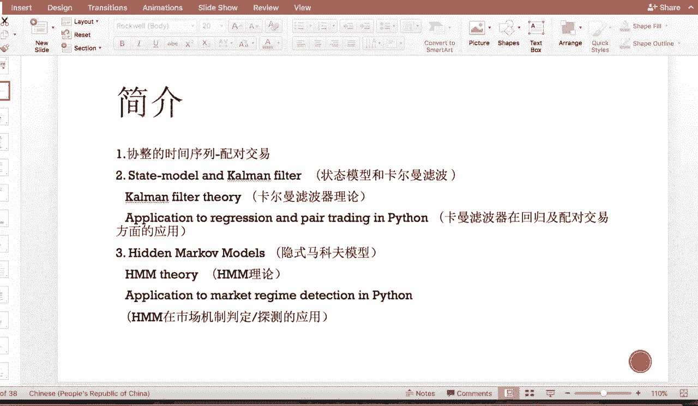
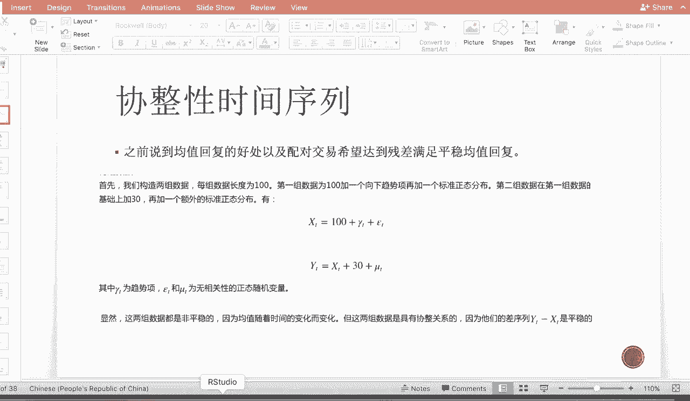
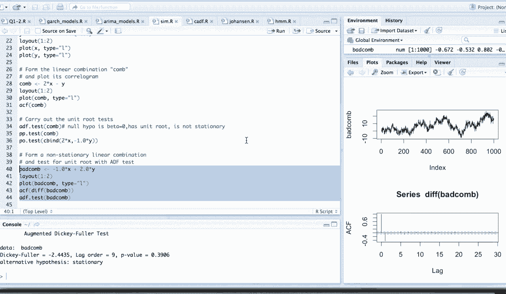
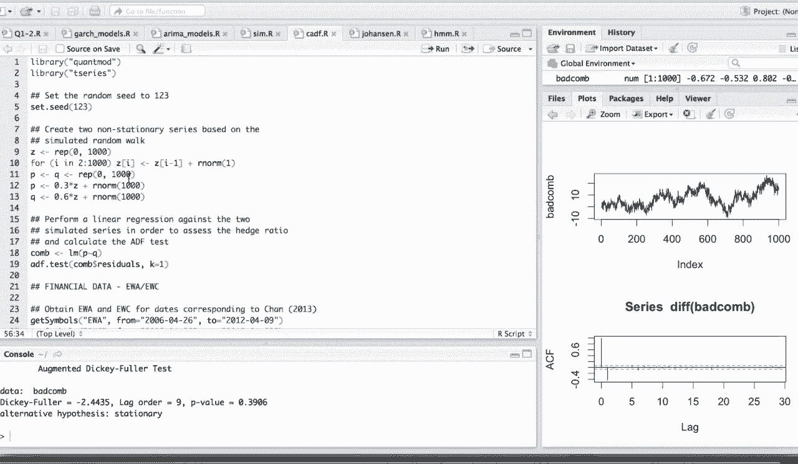
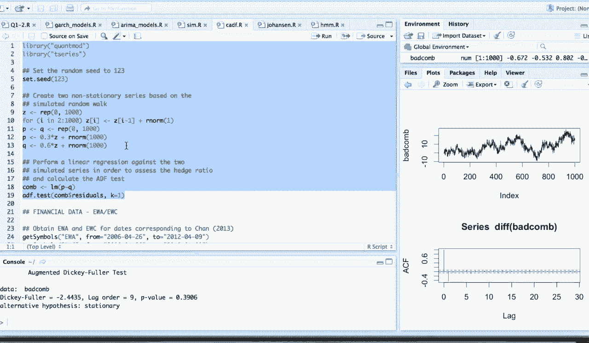
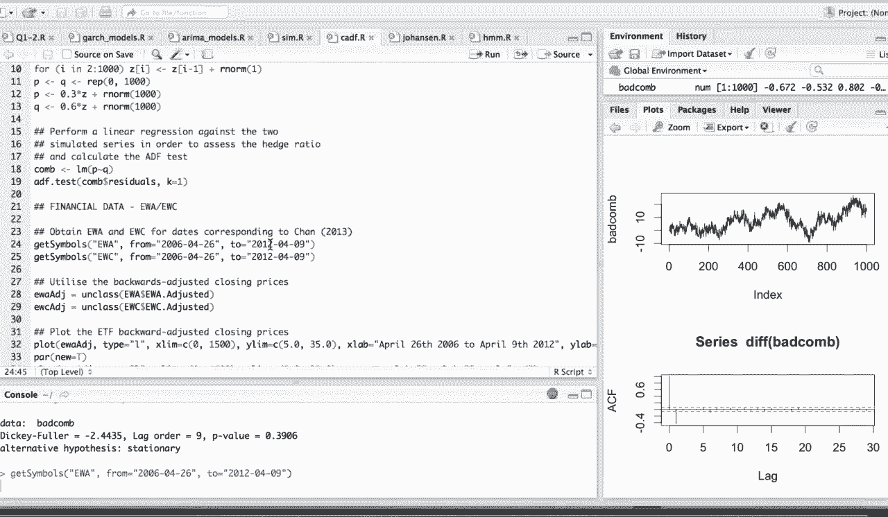
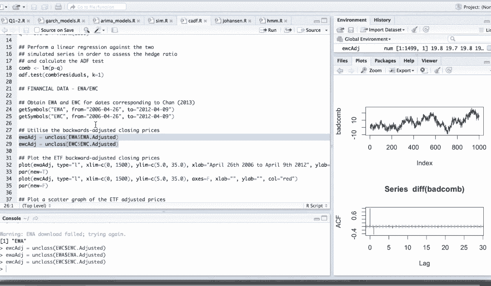
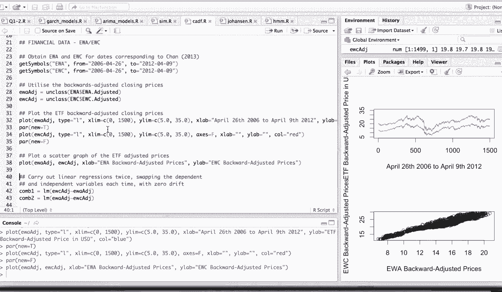
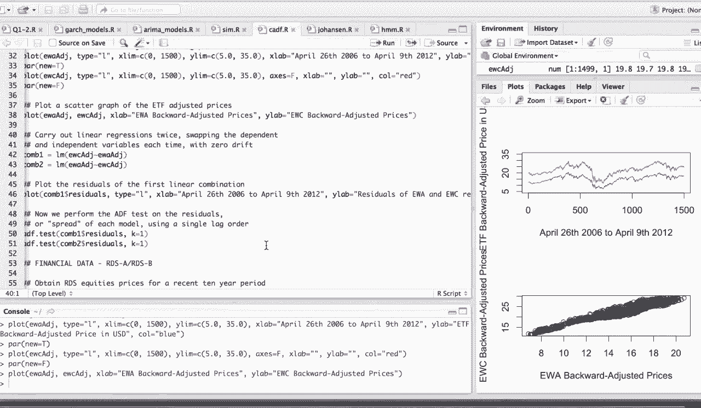
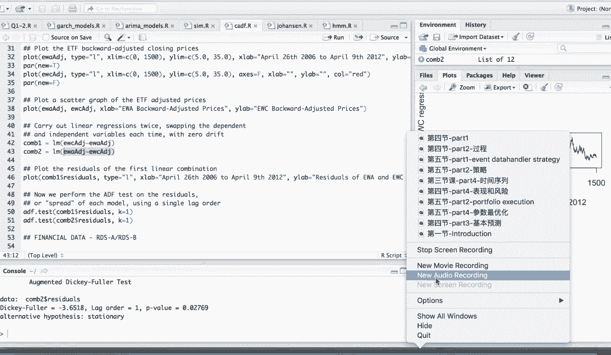

# 吹爆！这可能是B站最完整的（Python＋机器学习＋量化交易）实战教程了，花3小时就能从入门到精通，看完不信你还学不到东西！ - P15：第15节-金融时间序列-II-协整性 - 凡人修AI - BV1Yx4y1E7LG

大家好，今天是金融量Python量化交易的第八节课，我们今天延续第七节课的内容，继续介绍金融时间序列的应用。

那下面呢是这节课的简介，首先呢我们再回顾以下写整的时间序列，那在配对交易方面的应用，包括写诊的检验等等，第二块我们来介绍state model和卡尔曼滤波，那么我们会先介绍一下state mol的写法。

然后介绍卡尔曼滤波器的理论，以及呢后面卡尔曼滤波，在regression跟pair training上的应用，那么主要呢是动态的得出啊，dynamic hedging的coefficient。

也就是所谓的hedge的贝塔，也称为hedging ratio，那么这是在配对交易嗯，中间我们最关心的一个变量，那么第三块呢，我们会简要介绍一下影视马可夫模型。

那么我们会引入hidden Mark of model的理论呃，并简单介绍一下hidden Mark of model在市场的机制判定，就是regime detection的应用。

那我们会议detect这个市场的啊，flat ball and bored这个啊market3种形式，那么对我们的trading有一个宏观的指导，那么首先让我们来看一下写诊的时间序列。

那么我们说到这儿，我们之前的课已经提过很多次，关于谐振时间序列的应用，包括一些例子等等，那么我们之前提到过的均值回复序列的，好处呢是什么呢，那么大家还记得，也就是如果他是mean reverting的。

那么当我们已经能估计到这根均值的level的时候，那么比均值level高，那这个时候我们就要有一个shot的信号，提醒我们说，这个时候的值已经太高了，那么它很有可能会回落到均值的。

均值的这个level上，那相反的，如果这个时候它的price比较低呢，那我们就有理由我们进入市场，那么等待它回涨到这个长期的均值上，那这就是均值回复，可以对我们的交易带来的好处。

那么往往呢我们的金融时间序列并不满足，均值回复的特性，那这个时候我们希望通过配对交易，来达成一个呃常差，那这个时候常差本身满足均值回复，那么也可以应用到我们前面提到的，均值回复的好处。

那么首先呢我们举一个谐整性的例子，就是我们构造两组数据，那么数据的长度呢当然得是一样的，那么这个时候呢，每一组数据都是由一个呃一个常数因子，比如说X等于100加上，那后面的项呢也就是一个润嗯，白噪生下。

那是一个不同的系数的百兆神像的一个组合，那么这个时候我们构造了X跟Y，那这个时候我们很显然能够看到，X和Y这两组数据呢都是非平稳的，因为呢他们的均值随着时间变化，但是呢这两组数据具有协整关系。

也就是说当YT减去XT的时候，我们把这个嗯趋势项消除了，那么得到的这个白章真相呢，它显然呢是平稳的，那么真正的均值回复的定义，其实是一个线性组合，也就是两组非平稳的时间序列。

如果他们的linear combination是啊，均值回复的就是平稳，均值回复的，那么这个时候我们就称这两个时间序列呢，存在着谐振性，那么让我们来看一下谐振性的一个小例子。

那么这边呢因为之前我们的例子是用Python实现的，那么现在可以让大家看一下R呢是如何实现的。

那首先呢我们依旧使用这个time series的这个library，那么这个library里面呢有时间序列的构造，包括各种各样的检验，比如说均值回复的，比如说写诊信。

那么这边呢让我们set一个random seat，首先呢我们create一个random work的啊，序列称为Z，那么pro出它如下，它这很明显具有一个趋势性，并非呢是均值回复的。

那这个时候为了检验我们的想法是可靠的，这时候我们画出它的ex嗯，那么如果我们上一节课提到过render more，它的嗯，时间序列的app呢是一直存在着高峰的，那么一阶的difference。

那就是一个白噪声，所以它的X呢就满足所有的滞后项，都是啊显著等于零的，那这个时候我们如上面提到的所说，我们构造x on y这两个非谐等的时间序列，那么呢它都是不同的系数乘以。

我们上面构造random walk，然后再加一个这个normal distribution，也就是白噪声，那这个时候我们把X和Y这个时间序列，put out出来看一看，那么可以如下图所示。

他们俩呢几乎是满足一样的趋势，只是X呢具有更高的噪音，就更多的劳动下，那么XNY本身呢都有一个向上的一个趋势，就并不是一个啊平稳的均值回复的时间序列，那这个时候如果我们对X中Y进行线性组合。

首先呢X是0。3乘以Z，Y是0。6乘以Z，那么按照我们的这个理论知识，我们知道如果两倍的X减去Y呢，那么它剩它就能把这个趋势项给消除，那么剩下的呢就是白噪声相。

也就是这样的一个linear combination的，那么它应该是一个平稳的，那么让我们来检验一下，那好我们画出了这个combination本身的plot，和这个ex的检验，那么非常的明显。

我们的这个combination本身呢是一个均值回复的，平稳的时间序列，而且是一个白噪声，那嗯这个是由肉眼所得，那我们这边使用两种检验，一种是这个ADF我们在之前的课上介介绍过。

那么还有这个pp呢跟PO检测也都是一样的，关于这个谐振性的检验，那我们可以看到我们所有检验的这个p value，都是比0。5，0。05，也就是我们一般常用的95%的。

confidence level来的小，那是什么意思呢，就这些的检验，它的零假设呢都是我们的单位根，前面的系数贝塔等于零，那么如果说我接受原假设了，那就说明我含有单位根，那么如果含有单位根了。

就说明我这个时间序列是不stationary的，所以对于平稳性检验来说，我们要求它的平稳性检测，我们的P值都得比我们的显著，就是confidence level来的小，那么小呢说明拒绝原假设。

拒绝原假设就说明没有单位根，那就说明我们的这个残差序列或者是检验序列，是啊stationary的，是平稳的，那这个时候呢这个时候让我们来看一下，如果我们做了一个错误的combination。

比如说是助词类的，那么按照我们上面的理论知识，他的这combination呢一定不是啊平稳的均值回复的，那这个时候让我们来run一下我们这个模型，我们可以看到这个back combination本身呢。

是具有一定的趋势性，也就是趋势没有被完全消除，那么可以看到X在一阶之后的时候，有一个负的的这个高分，那就说明我的这个back combination本身呢，是不满足均值回复的。

那这个时候让我们来做一个financial data的一个啊，一个例子，就是上面的话是我们create得到的一个。

就是一个虚拟的啊时间序列。

那这个时候让我们来看一下，用真实的时间序列是如何做pair trading，跟这个谐振性的detect，那首先呢我们从yahoo finance上得到这一组pair，那这一组pair的equity呢。

本身他们的performance比较类似，所以比较有利于拿来做均值回复的构造，那这个运行时间会比较久，因为这个pull的时间序列呢会比较长。

这个时候让我们先把他们的时间序列，给plot一下，那么我们可以看到，他们虽然本身两个就EWA跟EWE，本身是非平稳的，但是呢我们有理由认为，他们做一个合理的regression之后。

因为他们的趋势非常的相似，所以他们做完regression之后的残差，非常有可能是均值回复的。

那么这个呢是两个adjust，adjusted price的一个啊linear的plot，那我们可以看到它们之间的线性相关性非常强。

那这个时候让我们做一个啊，两者之间的一个相互的回归，那我们可以通过它们回归之间，我们挑一个更优的一个回归的combination，来做pair trading。

那个这时候我们把第一个的RESIDUPLOT出来，那么我们的RECEDUO已经不具有刚才的，很明显的原时间序列的趋势性了，那这个时候我们对第一个和第二个RECEDU呢，都做这个AD f test。

那我们可以看到呢，第二个时间学的p value呢是0。027，那么第一个呢是0。028，那说明第一个呢是跟呃，第二个的这个RECEDUO的，我们检测出来这个AF的test的p value是更小的。

那么越小说明呢我们又越有信心，可以把原假设拒绝，那就说明我们接受我们的啊，备则假设alternative，也就是我们本身我们这个长叉是stationary的。

所以这个时候我们做peer training的时候呢，我们也第二个呢作为y input arrival，那么第一个就EWC呢作为regression，那么我们做出来的残差，时间序列能满足均值回复。

