# 吹爆！这可能是B站最完整的（Python＋机器学习＋量化交易）实战教程了，花3小时就能从入门到精通，看完不信你还学不到东西！ - P17：第17节-shrinkage regression - 凡人修AI - BV1Yx4y1E7LG

呃接下来让我们来引入一个很线性回归，很重要的概念，也就是多重共线性，我们在上一节提到的呃，我们在做线性回归的时候，我们需要不但需要关注的是，我们可以FASHI的mean，也就是均值。

我们还需要关注它的翻唱VARI，因为当它的方差越大的情况下，那我们这个线性模型就越不robust，那么我们这个线性回归的结果，就越不具有可靠性，那么是什么原因会导致我们线性回归的口语。

非选的variance也就方差很大呢，那就是由于多重共线性导致的那么多弦，共振性的概念是指，当有很多变量的线性回归叫MULTIMULTIVARIANCE，regression的时候。

变量之间呢由于存在比较高的相关系数，而使回归古迹不准确的，这样的性质称为呢多重共线性，那么公多重攻击性的危害呢，就是我们得到的模型的方差比较大，那么呢它的古迹不robust。

那我们有如下两种比较常见的检验方法，一种叫v i if，也就是方差膨胀系数by uvariance inflation factor，那条件系数呢是condition number。

那条件系数是基于uh egon value decomposition啊，也就是特征值分解的，那么对于VIF来说呢，它的方法更为难if1些，那么它使用的是一个tolerance的导。

那么tolerance是一减RJ平方。

那么RJ呢跟我们上面提到的啊，这个RJ是一样的，也就是DJ的variable，对其他的variable做做回归，那么得到的这个啊ASSQUARE就是拟合优度呢。

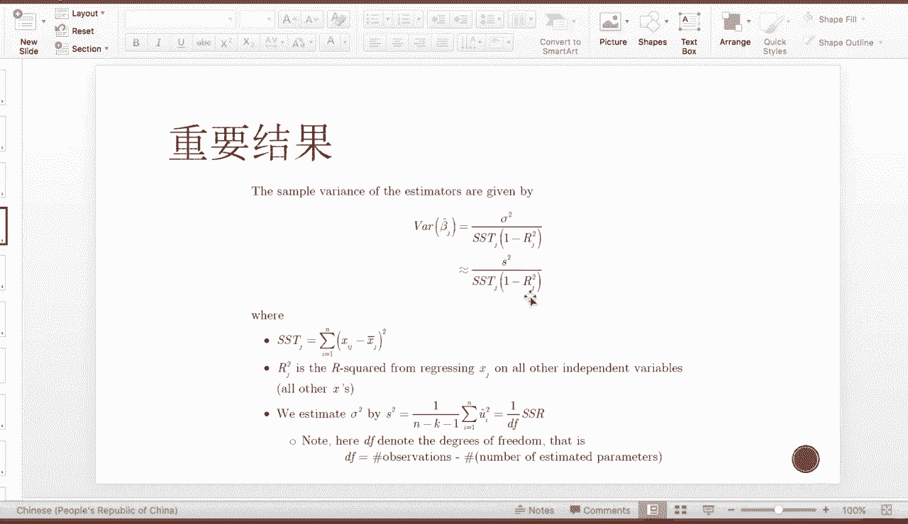

就成为我的RJ方，那这个VIIF的数学性质是非常好解释的，也就是当这个维度的变量，DJ维度的变量能被别的维度越能解释呢，那么它的方差膨胀系数越高，那就说明贡献性越强，那么纺织呢就说明贡献性越弱。

那这个是我们检验多重共线性，最常用的一个指标。

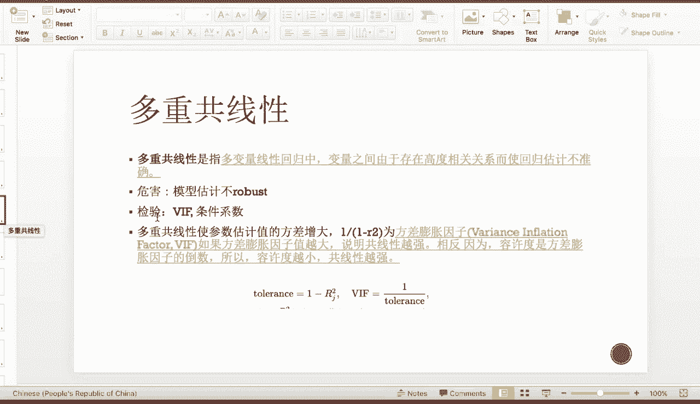

称为vi if，那多重共线性的理论推导是怎么来的呢，首先我们记得我们前面有一个MULTIVARIANCE，regression的一个结果，也就是我们的coefficient贝塔。

以hat是这个设计矩阵X转置乘以X逆，然后再乘以X转置Y，那么X转置乘以X呢，就称为我们的design matrix，当X每一个feature均值为零的情况下，X转置乘以X其实就也就说是它们的协方差。

正那这个时候如果存在比较强的贡献性，那么也就等价于弦发差正越不可逆，那越不可逆呢，也就是它的行列式越趋近为零，那么这个时候它的need的对角线上的值就很大，那就导致这个贝塔与hat的这个值非常的大。

那么很高的情况下呢，当有一点点的变动，那这个贝塔遗害的就会引起一个很大的扰动，所以呢会导致参数估计值，贝塔ahead的变化非常的大，那么这个时候参数股这样的方差也增大了。

那这个时候我们的解决方法是什么呢，我们会考虑可以删除一些相关性比较强的变量，比如说当我们要预测黄金的时候，预测go，那这个时候我们的regression可能会放SMP，Five pag。

有的时候会放道琼斯指数大33p five por，跟到城市指数之间的相关系数很高，所以说这个时候我们可以选择去掉其中一个，那么来减少我们的这个多重共线性的问题，那这个时候呢又有另外一个问题。

coming up了，也就是我们这个时候到底是选择删除SNP，还是删除道琼斯比较好的，如果随意的保留一个删除另一个，那么这样的行为过于草率了，那有没有一种可以通过machine learning的方法。

替我们由机器来automated的选择因子呢，那么答案是肯定的。

那这个时候呢我们引入两种shrinkage，regression啊，一种是领回归，一种是拉索回归，那么他们的idea呢都是通过我们的这个automatic learning，把一些系数shrink到呃。

零，shrink到zero，那说明呢这些就是系数为零的，variable就可以去掉了，那shinkage regression跟OLS，也就是线性回归的最大的区别，就是线性回归本身呢是无偏的。

也就是unbiased的，那么shrinkage regression呢是有偏的，那这个时候大家要问了，为什么我们要选择一个有偏古迹，而不选择一个非常优秀的无篇古籍呢。

那么这个回答在上一页的这个slice中。

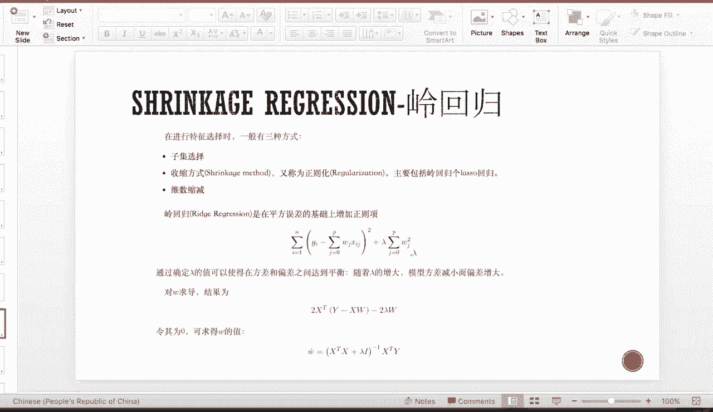

我们有一个很有名的trade off，叫bias and variance trade off，那么他说的是我一整个的这个total的MC，也就是我的均方误差，那么通过我们的这个期望值展开呢。

可以展开成我们本身bias的平方加上variance，加上这个是一个不可变的一个模型的，扰动模型的方差的平方，那在最后一项不可变的情况下，当我们要最小化前面的这一项均方物，那我们不但要最小化啊。

这个bias方也要最小哈，这个VARI，那么我们在实践中，往往当bias越高的时候，这个BANCE会relatively的小，那么反之呢，当没有BIOS的时候，variance会引入很大的值。

那这个时候我们我们有时候呢会需要考虑，我们引入一点点的bias，如果我们通过引入一些bias，能够很大的减少我们的这个variance的话，那么我们就会减少一整个模型的均方物。

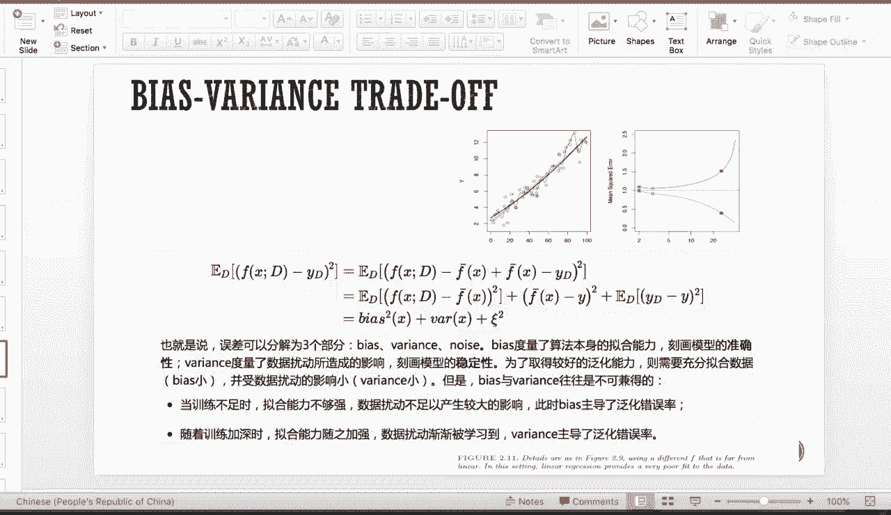

所以这就是为什么我们要使用，带着有偏古迹的这个stringgage regression，因为它虽然引入了一点点的偏差，但是呢它可以大大的减少我们的模型的virus，使得我们的模型更为robust。

那呃一般呢进行feature selection的时候，有三种方式，一种是子集选择，叫subset selection，那么子集选择呢也会称为feature selection。

那么他的idea是我直接drop掉我的一些feature feature，把这些feature呢不要放入我们模型的考虑中，那么这称为success election。

还有一种是shrinkage model，也就是我们说的shrinkage regression，那么又称为正则化，那么主要是包括领回归呢和拉索回归，那么他们的主要的想法是把一整个full set呃。

的feature呢都放到我们的回归中，但是由机器学习来强制的out掉，我们的一些features，那维维度缩减的话呢称为dimension reduction，那这个呢我们在后面的PCA。

也就是主成分分析中会提到，那么为数缩减呢，它是对我们之前的所有feature做一个linear combination，就是线性组合，那么得到的新的N个的线性组合，我们保留前M个。

那把后面的N减M个给drop掉，那么这成为一个这种为数缩减，那我们现在回归正题来介绍呃，第一个sackage regression，也就是领回归，那领回归呢，他的想法呢是我们对于正常的线性回归来说。

我们只有前面的这一项，也就是最小化我们的均方误差，那对于领回归来说，我在后面加一个惩罚项，Panel detern，那是这个惩罚的因子呢，乘以我所有的这些回归系数的平方，那这个意思也就是说。

当在我最小化经方物的时候，我也需要考虑，我是否呢每一个这个回归系数都特别大了，如果回归系数很大，那么就会受到很大的惩罚，使得我这一整个function，没有办法达到一个比较小的值。

所以在我做回归估计的时候，我不但需要考虑我最小化均方物，还需要考虑呢，我尽量的使得这个回归前面的系数来的小，那么通过一系列的数学推导，我们可以得到做领回归的时候。

我们的这个COEFFICI最后的估计呢是the design matrix，加上一个拉姆达，是一个这个惩罚系数呃，乘以的呢是一个单位正，那么取逆，然后再乘以X转置Y。

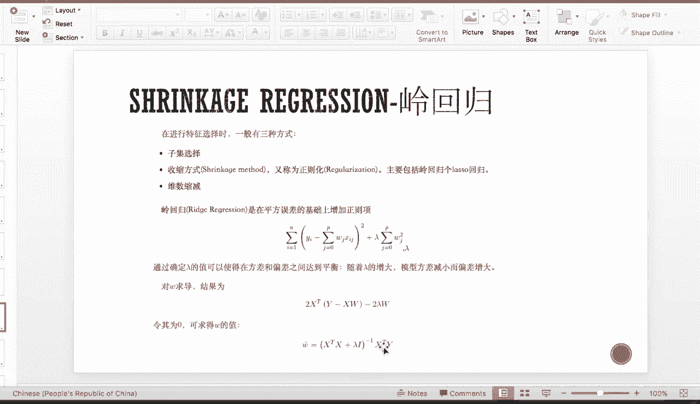

那么这个我们回顾一下我们上面的这个呃，最正常的最小二乘这个贝塔以hat，那我们可以发现它呢只跟我们的最小二层。

差了一个这个对角圆，那么大乘以I，那这是为什么呢，我们可以这么直观的想象，当这个最小二层出现多重共线性的时候，其实他的意思是，我们这个design matrix的主对角元不存在着一个啊。

不存在的一个比较优势，也就是我们的对角圆呢会比较小，所以当穷逆的时候，我们几乎无法求逆，也就是他的呃行列式几乎趋于零了，那这个时候我们在对角圆上加了一个正的系数，拉姆达。

那这个时候使得我这个design match是没有那么的病态，那么就比较好求逆，所以呢这是一个呃，ridge regression的一个intuition的一个想法。

那我们来看一下做real regression的时候，因为我们这个lambda是不确定的。

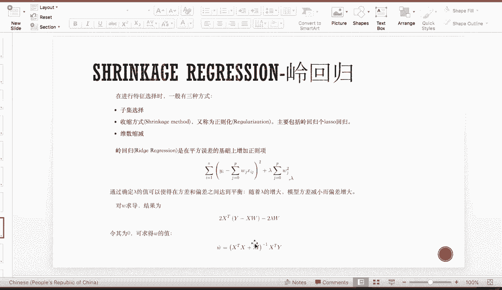

那么在做拉姆达的网格搜索的时候呢，我们可以把他的这个零基图画出来，那我们可以看到当这个拉姆达，因为这个0~1其实是拉姆达的镍，就是这两个的比，那么当拉姆达取很大，取很小的时候呢，就是几乎没有任何的惩罚。

那么大家呢都是significantly不等于零的，那么当我拉姆大越学越大，那惩罚对他们的这个平方和的惩罚就越大，那么他们呢就越有很多的这个线呢会趋近于零，趋近于零，趋近于零。

那直到呢顺应到最极端的时候，也就是C啊，拉姆达等于无穷大的时候，那所有的口语FESSION呢都会shrink到zero嗯，那我们介绍另外一个比较重要的回归，甚至是比reg regression。

更为常用的一个regression方法叫拉索回归，那么拉索回归呢跟ridge，regression的penalty几乎一样，都是一个我们OLS的均方物，加上一个惩罚项，然后呢是乘以呢某一些累和。

那么对于啊reid regression来说。

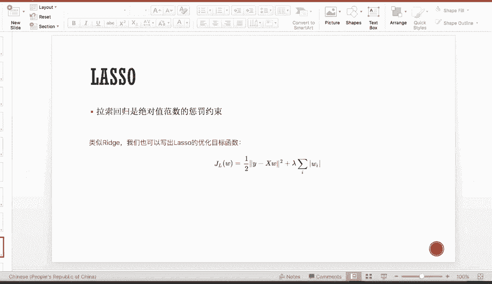

它的累和是这个二次方二次方of coeffici。

然后再累和，那对于拉索来说呢是一个绝对值的和的内核，所以他们俩的唯一区别就是这个惩罚范数，那么对于拉索雷个嗯回归来说呢，它的范数是一范数。

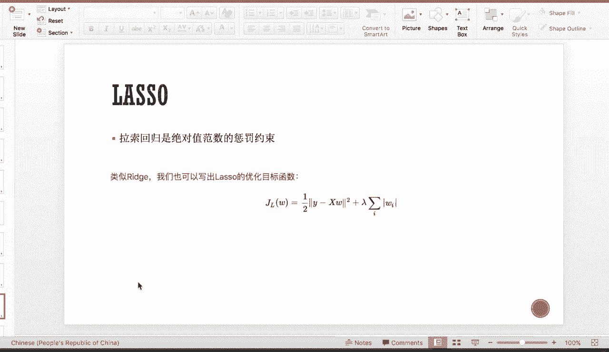

那么对于ridge regression来说呢，它的范数是二范数。

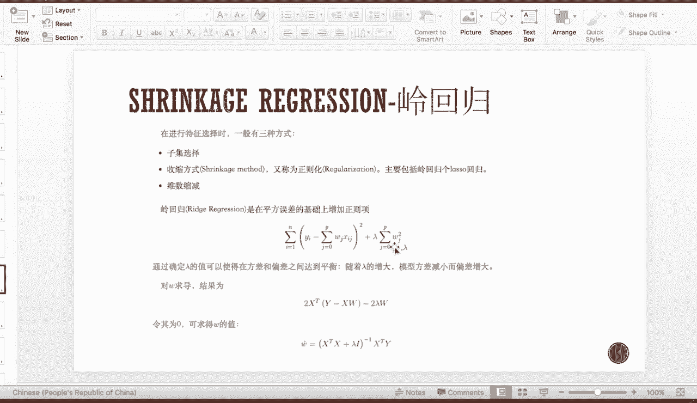

或者我们称为是平方范数，那么啊对于拉索回归来说，他们也它也能plot，得出这个拉索回归拉姆达的收缩图，那么如下图所示，跟领回归一样的是，当拉姆达取非常小的时候，是几乎没有说错效果的。

那么当拉姆达趋于无穷，也就是比值趋于零的时候，这个时候会发现越来越多的口语，fission呢就exactly等于零了，那么大家可以通过刚才的观察发现，这个拉锁回归的这个图。

跟这个read regression的图的区别，就是当ridge regression的时候，它shrink到他shrink到零的这个速度呢，其实是没有拉索regression来得快的。

因为拉锁regression很快呢就会shrink到，只保留了几个显著不等于零的因子，那么别的因子呢是完全贴着这根零的线的，也就是exactly zero，但是对于领回归来说，大家可以看到嗯。

在领回归的这个图这边其实有很多因子，虽然离非离零非常近，但是它还是有值的，不是exactly等于zero，所以这个是拉索回归，比领回归做因子选择的时候的好处，因为领回归很多值，比如说是0。01。

那这个时候我不能one hundred，Percent confidence，告诉我自己，我就可以把这个feature给drop down掉，那为什么拉索回归能够比领回归更能够，SHINSHRINK到。

把很多coefficient shrink到exactly zero呢。

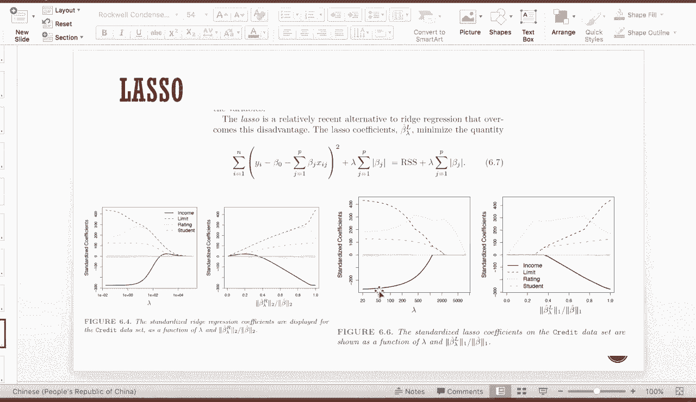

那么我们先通过一个直弯的图形进行解释，嗯我们这个左边呢是拉索回归，右边呢是reach回归，是领回归。

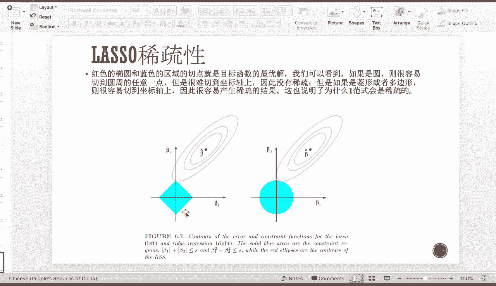

作为拉索回归来说，因为他的这个惩罚项是一个绝对值的。

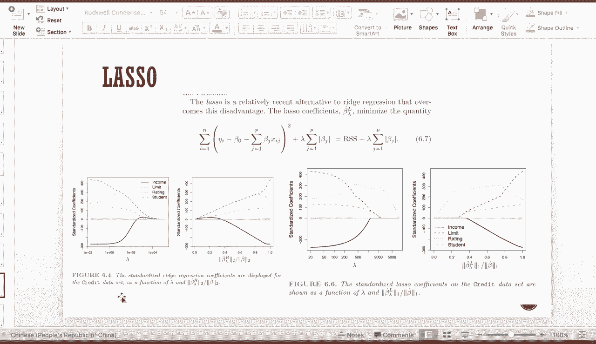

也就是说我的可行域，贝塔的可行域其实是一个这样的一个啊，对角线在X轴Y轴上的一个正方形，那么嗯顶回归的话，因为是平方，所以呢它其实是一个圆，那对于一个真实值贝塔以hat。

那这个时候呢我要往这个可行域进行画椭圆，直到hit可行域，那么对于拉索回归来说，他更有机会hit到这个尖峰点，也就是有coefficient，有有别的coefficient。

exactly等于zero的点，但是对于rich回归来说，它是因为是一个圆，那么它当与这个圆相切的时候，几乎是不可能想象到这个这个零点的，那么相切到这个零点的唯一机会呢，就是刚刚好在这个切点上。

但是这个位置呢能以这个点做一个任何的一个，这样子上下的转动都可以hit到这个点，也就是在理论上来说，那嗯这个领回归hit到EXECUO，zero的这个概率的测度是零，但是拉索回归并不是，那么在理论。

这是一个图形上的解释，那么理论上的解释就是，一范数的这个范式呢是稀疏的，那么也就说明呢，稀疏的范式呢，更有可能达到很多边值为零的机会，但是二范数并不是啊，所以这个是拉索回归。

为什么能够hit到exactly zero的一个解释。

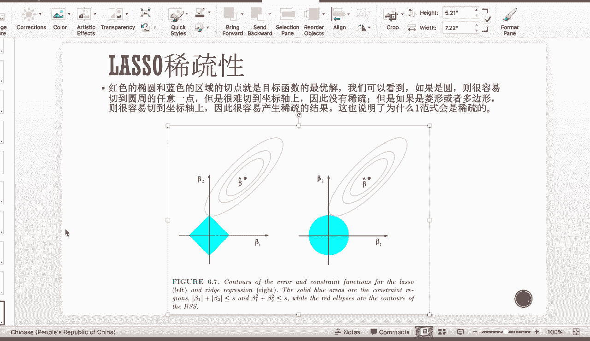

那我们通过前面的解释呢，我们已经说到了，也就是拉索回归跟这个领回归之间的区别，那么在因子选股过程中呢，拉索回归更为适用，但是由于他把很多变量，前面的QUEFFICI都shrink到零了。

也就说明这些变量已经被他们，完全排除在我的模型之外了，所以会引入更大的bias，那么有有的时候大家不希望获得很大的bias，但是又希望通过拉索选股，那这个时候就有一个elastic neck。

这样的一个方法，那么它的方法呢是把二者结合在一起一起使用，那么它的表达式呢就是一个军方物，加上呢一个weighted average of，拉索回归的penalty和领回归的penalty。

那通过一个阿尔法来来调整这两个之间的比率，比重关系。

那么这个我们就介绍完了，我们的两种最常见的shrinkage regression。

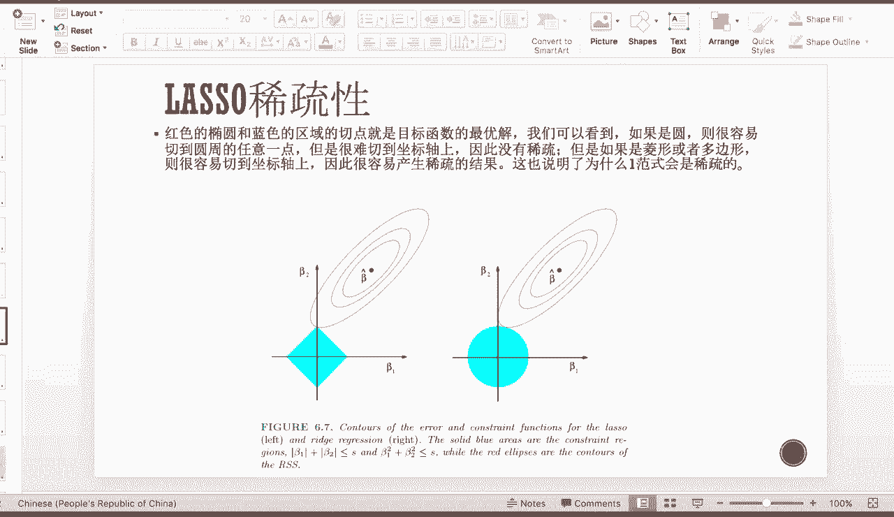

包括它们两个之间结合的elastic net。

这样的一种情况，那我们接下来要具体的介绍一下。

