# 吹爆！这可能是B站最完整的（Python＋机器学习＋量化交易）实战教程了，花3小时就能从入门到精通，看完不信你还学不到东西！ - P21：第21节-逻辑回归 - 凡人修AI - BV1Yx4y1E7LG

大家好，欢迎收听Python量化金融和机器学习的第十节课，那么我们第十节课呢，将介绍Python机器学习的第二块内容，那通过上一节课的学习，想必呢大家已经对机器学习有一定程度的了解。

那么我们今天呢主要介绍的是如下三块。

进行学习的内容，第一块呢是我询问你，你非常重要的这个线性线性决策面，也就是线性分类器，那么我们第一个分类器介绍是logistic regression，逻辑回归。

那么我们第二块呢介绍的是linear discriminate，Analysis，线性判别分析，那么由线性判别分析，可以引申到二次的判别分析，所以我们硬币呢在第一块内容介绍了，那么我们第二块是介绍啊。

Support vector machine，支持向量机，那么如果对啊机器学习之前有一定基础的同学，想必会知道机器啊，这个支持向量机呢是机器学习中，不管是回归还是分类都扮演着举足轻重的作用。

因为它本身的模型比较robust，而且对数据量就数据点的量的要求不是很高，那么所以当我们的样本比较少的时候，支持向量机依然能够获得一个比较优秀的模型。

那首先呢我们引入maximum margin class fire，就是最大边缘分类器，那么由最大边缘分类器产生的一些隐患呢，我们引入了带soft margin的线性支持向量机。

也就是linear s v m，那线性支持向量机，对于比如说啊二次甚至是更高维度的点，没有办法进行分类，这个时候我们引入核函数，那么我们利用kernel function呢。

可以把线性支持向量级map到更高维的空间，甚至是无穷维度的空间，那么就解决了我们一整个full set的learning过程，那么第三块呢是介绍一下cross validation，也就是交叉验证。

那我们在前面的课中呢，或多或少的都提到过这个很重要的cross validation，对于模型选择的重要性，那么我们在这里呢会对cos balization，做一个最系统的总结和这个理论剖析。

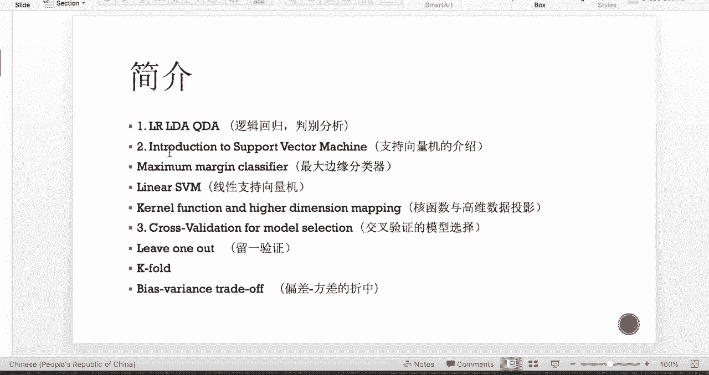

那首先呢让我们来看一下何谓线性分类器，因为我们所有的分类器都是基于线性分类器啊，把它map到更高的维度的，所以线性分类器呢是我们这个分类理论中，最核心的或者说最基础的知识点，那么所谓分类分类器是呢。

将这个输入空间X，根据我们这个用户的需要划分的类别呢，将这一整个空间划分成不相交的区域，比如说我们看这个最简单的这个二分类，那么上面红色的这些我红色箭头指的这些点呢，就假设是为第一类就是红色类。

那么下面蓝色指的这些点呢就属于蓝色类，那也就是第二类，那这个时候我们在这个呃三维空间，构造了一个这样的线性的平面，那么它就可以把上面的红点跟下面蓝箭头，这些蓝点separate成啊两个不相交的空间额。

所以这个呢就称为是啊分类，那这些区域的边界呢就叫做决策面，Decision boundary，那么我们如下图所示呢，我们这一个网状的这个平面，就是我们这个二分类器的决策面，那根据预测函数的不同形式呢。

我们的决策面有可能是光滑的，有可能是粗糙的，有可能是如下图所示的这样一个平面，也就是嗯线性的，或者也有可能是比如说二次的，那就是一个抛物线形状的，甚至更高维的空间，比如说球形，比如说等等等等。

那么嗯其中呢有一类最重要的判别器呢，也就是判别面的参数是线性的，就叫做线性决策面。

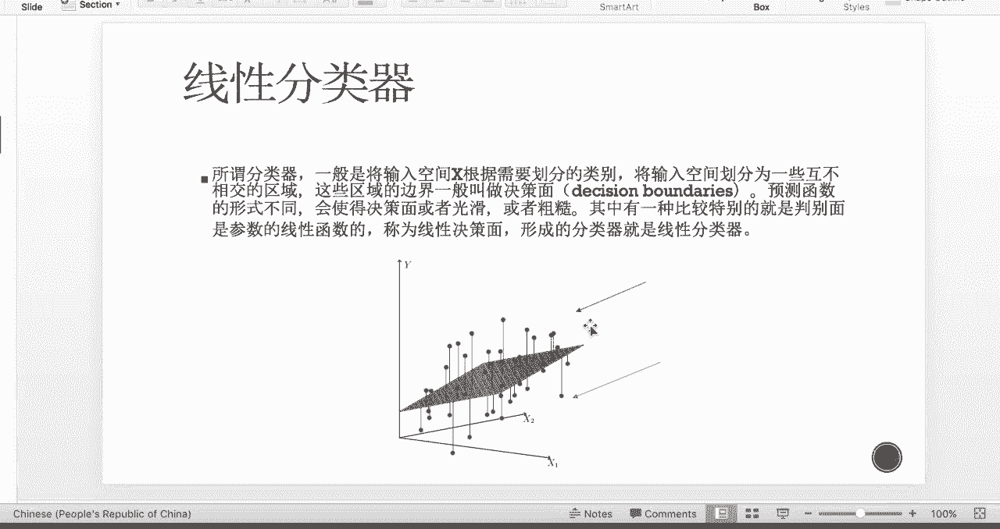

那我们把这样的分类器呢就叫做线性分类器，那我们来看一下嗯逻辑回归嗯，需要特别注意的一点是，逻辑回归的名字虽然带着回归，但是呢它其实是一个分类方法，那么我们先研究二分类问题。

那么它还可以引申到多分类的这个啊，分类问题中，那么呃logistic regression的原理呢，其实跟linear regression的原理非常相似，也就是一整个的回归步骤。

那么可以描述成如下这三块过程，那么第一块呢，是我们得寻找一个合适的预测函数，我们称为hypothesis，那我们一般呢会用这个小H来表示，我们的这个预测函数，那么这个预测函数呢。

是我们需要找的一个分类function，那它真正的含义呢是这个后验概率，也就是基于我这些x feature，那么我这个G既是我这个点的类别，我这个点的类别呢到底是属于第几类呢，那属于DK类。

那就称为H下角标K，那我们一般在这个回归就是分类分类中，这个hypothesis function我们具有不同的形式，那logistic aggression呢选择了是SIGMOID函数。

那SIGMOID函数的形式呢，我们会在下一张slice给大家看到，那么SIGMOID函数有一个好处，就是呢，当我对这个不同的类别的H进行求这个ratio，并且取log之后呢。

它刚刚好我们取完的结果是一个线性的，所以在logistic regression中，它为什么是线性分类器，就由是因为它的这个logic ratio是线性的，那我们后面会看到它的一整个推导过程。

那么第二块呢我们得构造一个cost函数，或者我们叫做损失函数，那么这个损失函数呢，内部呢就是是一些这些H的一些组合表达式，那它体现的呢是我这个预测输出和训练数据的，这个真实数据之间的偏差。

那在这个线性回归就是最小二乘回归中，我们这个损失函数呢是均方误差，那么在logistic regression里面，我们这个损失函数选用的是啊联合四然，就联合四然乘积的负数。

因为我们求呃likelihood的话，那对于一个分类器，我们一定是选maximum likelihood，也就是最大自然，那这个时候损失函数如果取的是啊，最大自然的负数的话。

那也就是我们最小化损失函数即可，那么第三步过程呢也就是最优化，那最优化我们就focus on我们的这个j theta，也就是我们的损失函数，那我们的损失函数值越小呢，表示我们预测越准确。

那在这个logistic regression中，我们对这个j c ta函数呢，使用的是梯度下降法呃，对这个C塔呢进行迭代，直到这个C塔的迭代满足，比如说跟上一步迭代的差值。

小于我们那个tolerance的时候，我们停止我们的迭代过程，那接下来让我们具体看一下，这三个流程的理论背景知识和如何实现的。

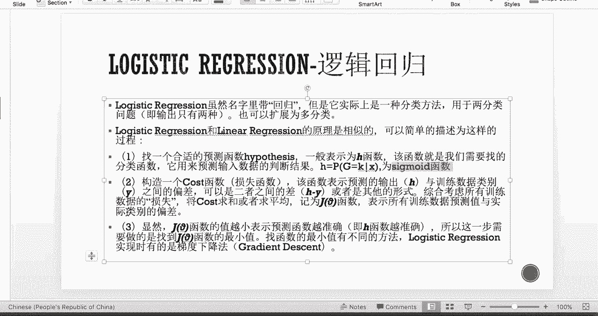

那首先呢我们先回顾一下线性回归的公式，那我们假设这个它们的线性表达式呢是Z，那这个时候Z呢就等于这个C塔零，加C塔一乘以X1，然后一直加到CAN乘以XN，说明我们有N个feature。

也就是input x呢有N个维度，那我们用向量简便的表示就是theta转置乘以X，那这个时候要注意X的第一列全部都是一，因为把这个结局项也啊包括其中了。

那么对于logistic regression来说呢，那么我们的想法是，得把我们最后的这个cost function变成一个线性的，那么我们选择的hypothesis function呢。

像我们上面所述，我们选择的是这个sigmoid function，那还选择这个sigmoid function呢，还有一个原因是，因为这个HX其实表示的是这个后验概率。

那我们概率得满足它们在零一之间分布的，那么对于这个sigmoid function来说，它的图像是如下图所示的，所以呢跟我们就是概率中的cumulative啊，probability呃。

distribution的形式是非常类似的，所以这也是为什么我们在logistic regression里面，我们这个预测函数，选择了这个SIGMOID函数的原因，那这个时候呢它关于这个指数是线性的。

所以我们下一步的想法是，我们想如何把这个E给消掉，那么直接把theta转置X提出来，那就会得到我们的这个线性分类器。

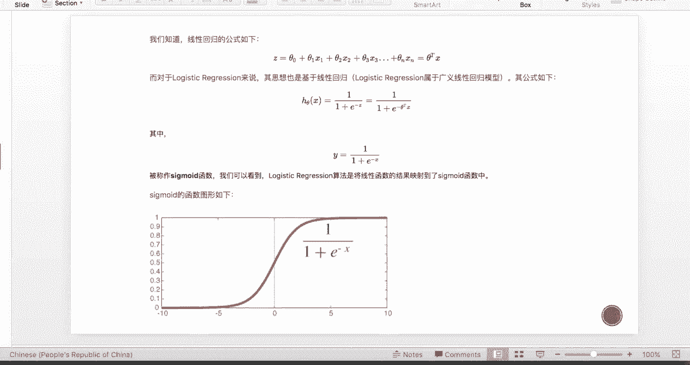

那我们再进一步的讨论一下，这个sigmoid function的一些性质，那么我们可以看到这个SIGMOID函数呢是输出，是介于这个0~1之间的，那中间值呢刚刚好就是0。5。

所以这个HX的含义非常的好理解，也就是说因为它的输出属于零一之间，而且中间值是0。5，所以它可以表示我们这个新的亚门点。

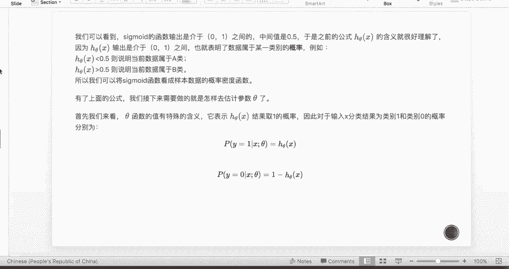

到底是属于哪一类型的这个后验概率。

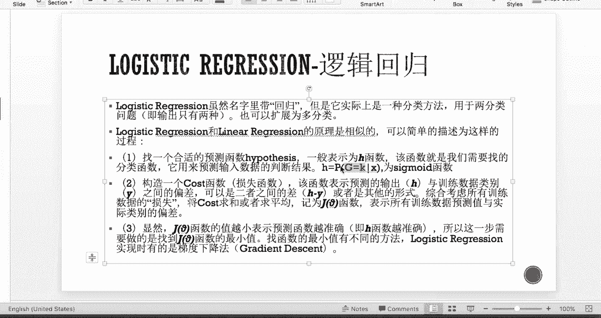

那这个时候呢当我们做预测啊，得到了某一个数据的类别概率之后呢，如果HX是小于0。5的，那么就说明它属于当前的类别，那如果HX大于0。5呢，就是说明它属于另外的一个类别。

所以我们可以将这个SIGMOID函数，看成是我们某一个样本点的概率密度函数，也就是cdf cumulative probability distribution，那么有了我们上面对HX这个公式的解释呢。

我们接下来要考虑我们如何估计参数theta，那也就是如何通用这个HX来构造，我们的损失函数，那么首先我们先写出我们下面的这两个表达式，也就是假设是二分布的情况下，那么后验属于类别一的这个概率呢是HX。

那属于另外一个类别呢，概率呢就就顾名思义了，也就是一减去HX，因为只有两个类别，那这两个类别的和得是一，所以另外一个也就是顺其自然的是一减去HX。

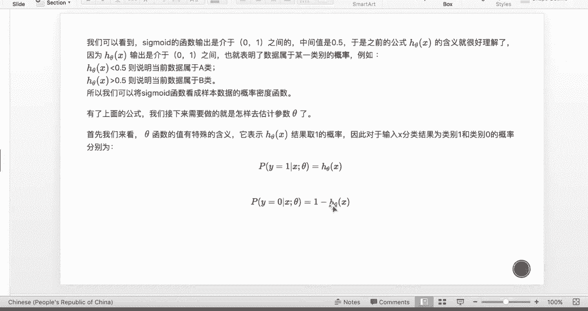

那接下来我们会对它进行一个参数估计。

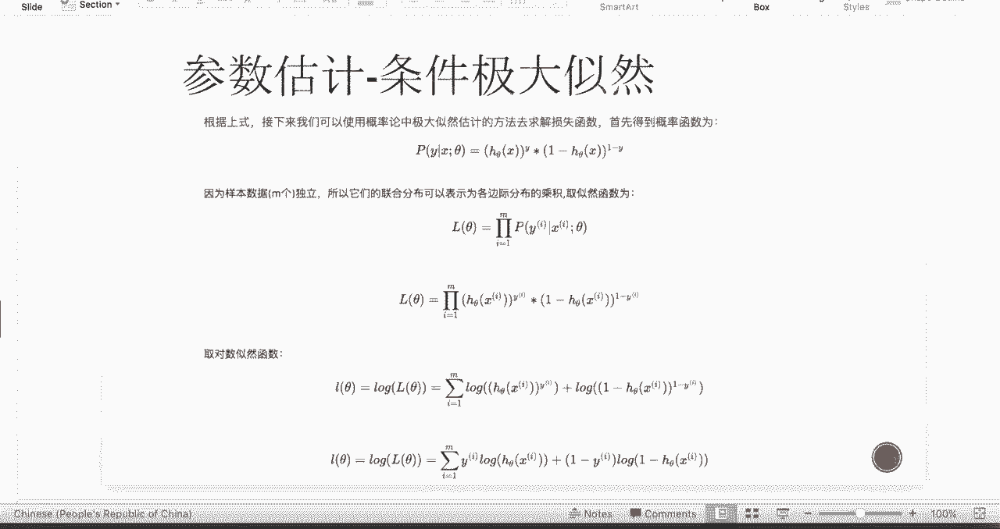

那我们有了我们上面得到的这个后验概率，我们应该如何利用它来构造我们的损失函数呢。

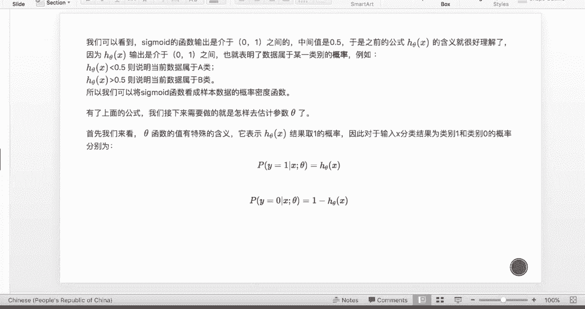

首先我们的想法是可以使用最大似然估计，那最大似然估计的写法呢我们之前提到过，也就是啊这个联合概率分布嗯的这个取一个log，那联合概率分布呢，也就是我们把所有的PY，这个后验分布连乘起来。

因为我们假设他们数据，我们每个样本数据之间都是独立的，那我们因为这个是一个binary dispution，也就是二次分布，那么二次分布的这个条件，自然呢可以写成如下的这样的表达式。

那我们对它取对数之后，得到这个小LC塔，也就是如下这样的一个表达式，那我们通过整理呢，我们得到最后的这个公式，那么我们可以发现取log的HC塔xi之后，我们会把这个指数给消掉。

那么就得到的其实是一个线性的一个。

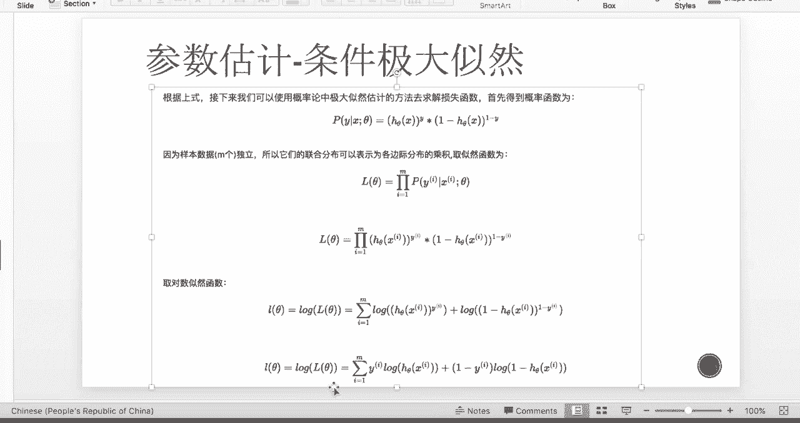

分类平面了，那接下来呢呃我们要构造我们的损失函数了，那在这里呢我们把损失函数定为这个负的嗯，这个就是我们上面的吉大自然的除以一个M，也就是取了一个均值，那我们接下来就是focus on。

如何最小化这个j theta的这个过程，那么这个我们利用的是梯度下降，也就是我们首先呢先求出我们这个theta，这个JC塔呢，关于每一个方向的梯度大概是多少，那么这边呢是具体的数学推导。

那我们最后得到的表达式呢是这个呃，HC塔XI减去YI诶，这个第一项其实是个错分率，那么错分率呢被这个XJ进行waited了，waited之后呢，再取平均，那这个是我j theta z方向的一个梯度。

那得到这个梯度之后呢，我们用梯度下降的迭代史，也就是新一步迭代的JC塔了，呃，theta j呢等于上一步的CAZ，减去一个这个学习的学习率，我们称为阿尔法，那后面这一项呢也就是我们的梯度方向。

也就是上面的这个导数方向，那这个阿尔法呢相当于是一个学习因子，我们称为learning ratio，那learning ratio一般呢我们取在0~1之间，那如果大家比较保守，那就取个0。5左右的值。

那这个阿尔法具体取多少呢，其实是利用cross validation进行最优化的选择的，那如果大家觉得cos validation因为比较耗时的话，我们可以就是通过经验，比如说取个0。70。5左右。

那么根据我的经验来说，其实阿尔法如果取，如果取0。5，其实效果都还是不错的，因为对于不同的模型来说，这个0。5是一个折中的the ratio的选择方式。

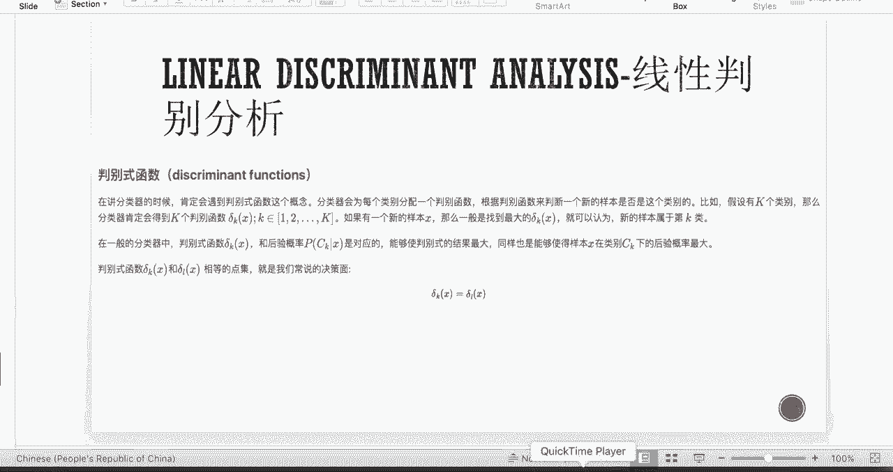