# 吹爆！2024B站公认最系统的Python金融分析与量化交易实战教程，3小时入门AI量化交易，看完还学不会你来打我！人工智能｜机器学习｜时间序列｜股票预测 - P10：第10课_机器学习与量化交易项目班.mp4 - momo助手 - BV1oYaoebEEz

最后一课啊，大家一路啊坚持过来很不容易啊，大清早的起来专门嗯非常不容易，那么我们今天来回顾一下，我们这啊十次课学了些什么东西，然后带着大家再做一下，再再做两到三个这个case review。

然后再跟大家说一下呃，接下来应该学一些什么东西，还有一些关于，如果你要找这个关于量化方面的这个工作，求职的啊，准备啊，就是大概是讲这么几件事情嗯，Ok ok，那么那么那么我们回顾一下。

我们这十次课都学了些什么呃，大家现在可以啊，闭上眼睛想一下，我们从第一节课啊，一路走到现在，我们大概讲了哪些内容，我们第一个我们学了这个怎么样的，这个爬取数据对吧，学会了爬取数据之后，我们学的是什么。

是关于啊数据，关于数据的，清洗，然后我们就直接跳到了这个关于机器学，习的这个方法，和传统的这个传统的这个技术，技术指标的量化，标，的量化方法就包括了均线啊，momentum啊，还有这个。

然后在机器学习跟技术指标的量化之前，我们做了一点这个，一些关于金融的最简单的知识，看看model，然后第四个呢就是我们把这些东西都结合起来，其实他都能够给到，抱歉，我这手机有点杂音。

就是然后我们把这些东西都给它归结成了，一个统一的一个framework，一个统一的一个框架，一个，就是你会发现如果你从这个统计学习，statistical learning这个角度来看，这些适应。

他们其实是，其实都可以用这个统计学的方法来表示，不管你是啊金融金融的模型，还是这个呃机器学习的模型，还是基于传统的技术指标的这个量化的方法，你都能给它归结成为你要么是呃呃呃做分类，要要么是做回归。

只不过你基于的这个啊，决策原则就是这个decision入是不一样的，同时呢我们这个机器学习这块，所以我在机器学习上给大家嗯多讲了不少，包括了这个机器学习的这个特征提取。

特征提取是我们有了这个数据之后的第一步啊，有了数据之后，不管你从哪拿的数据，有了数据之后要干的第一步是特特征提取，然后呢就是建立模型，建立一个model啊，建立这个model之后。

我们要做这个model evaluation，就是，和这个selection，就是模型的评估与选择，到底这个模型好还是不好，如果就是说这个怎么样的选择这些模模，模型的参数啊。

超呃超参数这个建立模型是学习出来，模型的参数，就是比如说你啊他那些W，就是比如说SVM里头的这些W，而超参数呢是是啊这个C值啊，就就是一些啊模型学不出来的，需要你提前设定的这些参数。

然后最后呢我们有了这个嗯，从数据到特征到模型啊，很多人就停在这了，但是不啊我们还要回测啊，然后基于回测呢，我们还要做这个啊这个风控，这个就是嗯嗯我们这个初级班嗯，最重要的整个的pipeline。

然后我们又把所有的这个东西放到了一套的，这个小的一个啊一个小的system里头去，嗯差不多用了，一共用了嗯，九还是九，我讲了18个小时，然后大概大家成了3~5倍左右，所以大概是100个小时的时间啊。

掌握了这个整个的pipeline的每一个流程，但是啊很明显里头有很多的事情，是需要做细化的，也就是希望就这个结课之后，我今天会推荐一些阅读的列表，嗯大家嗯基于这个流程，对于每一个环节你都可以。

要不不仅是可以都应该做的更近呃，更深一点，尤其是啊，嗯嗯就是说我们在建立机器学习模型的时候，最好要跟金融学的一些呃领域知识做结合，这样的话呢，能够让你建立的模型更加的精准有效。

就是说嗯懂金融的人做的机器学习模型，明显的比只会机器学习的人，做的这个量化的模型要好啊，这个是不这个是必必然的，但是呢懂金融的人做的机器学习的模型，容易有硬伤，就是说明显不适合用这个RBF。

他用个RBF，然后他也不知道调超参数，或者说他也没有处理类别不平衡的问题，他也不知道正则化该怎么做，但是他前面的那些东西做的不错，所以说这个是一个非常啊，需要领域知识融合的一个一个事情。

希望大家在这个方面要要多下一点，这个这个功夫有问题没有，OK那么就是说接下来其实呃我没有讲什么，我没有讲期权啊，期权的定价和怎么样基于期权来呃做的呃，所有跟期权有关的交易。

因为这个是一个比较相对独立的一个问题，嗯嗯就是说呃这个没有讲啊，啊还没有讲的，就是一些基于嗯嗯就是嗯这个目前的，比如说这个强强化学习，在这个自动交易领域的这个应用，这个是没有讲的。

然后还有一个是这个期权option，嗯其实因为如果要讲option，我嗯嗯给大家就是说嗯说一下吧，如果嗯如果这个嗯以后我们不能再见的话，如果这个你们要做期权的话，一定要把这个啊优化理论学好。

因为其实期权的定价嗯能够完全的就是，因为因为我我先说一下，我为什么不讲期权吧，因为如果要讲讲这个期权定价的话，目前嗯大家都在用的方法呃，其实就是用的就是机器学习中的优化理论，来算的。

但是嗯如果对于作为一个初级班的话，大家没有啊看太多的嗯，这个关于优化方面的先先修知识的话呢，嗯会比较麻烦，所以说嗯如果大家想，但是嗯有这么一件，就就是其实如只要你的优化的方式是对的。

这个通过期权盈利是是必然的一个事情，这个是一个，然后强化学习，最近1月2号购弄得很火，很多私募都在试，但是很多市的都都是在混嗯，就是说都是在属于一种嗯尝试阶段，就是试的不是大，对他们做的嗯。

就是说还就是现在的嗯量化领域需要，集学这边再过去点人，因为我感觉他们现在呃搞金融的，做的这个强化学习，实在是有点嗯嗯嗯不大对劲，大概是嗯嗯嗯这个是一个，然后嗯就是嗯对差不多嗯差不多吧，该总结的呃。

都总结完了，然后需要做的就是大家要对，这一定要走通每一个流程，如果比如说啊你的编程功底不是特别好的话呢，那么从这节课结课之后，你就可以去选择用这个嗯，各种的网上的在线的一些平台，然后因为那些平台。

它是能够能够把整个的这个系统，就是呃呃后台的这些部分都帮你做好，包括了数据，包括了这个回测，那么你要做的就是从数据，你要做的就是中间这个最最值钱的这一部分，这个是你要做的，那么这节课之后呢，嗯你可以嗯。

比如说你没有很多的时间去搭建自己的平台，但是你又很想说嗯手上有两个闲钱玩玩吧，那么嗯你可以通过这个网上的这些，这些个平台啊，来做一些做一些实验，但是一定要嗯待会我会说到这个个别的平台。

他们发的一些帖子的问题啊，第一啊你不要写出那种质量的帖子，第二呢关于那种帖子呢，嗯不要太当真啊，但是可以看看当做娱乐吧，嗯嗯这个嗯那么我们先看一些呃，再看几个，再看几个论文啊，先看先看看这个论文啊。

就是相当于一个case study啊，OK这篇论文其实做的也很简单，他是用了一个叫嗯嗯呃这个呃，2013。

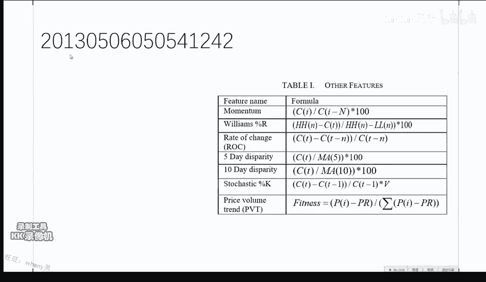

大家把那个zip文件都下载了吧。

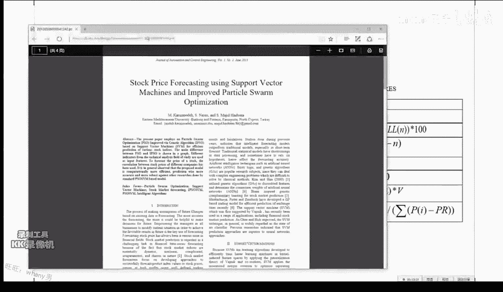

他这个用了就是用了一个这个叫嗯好吧。

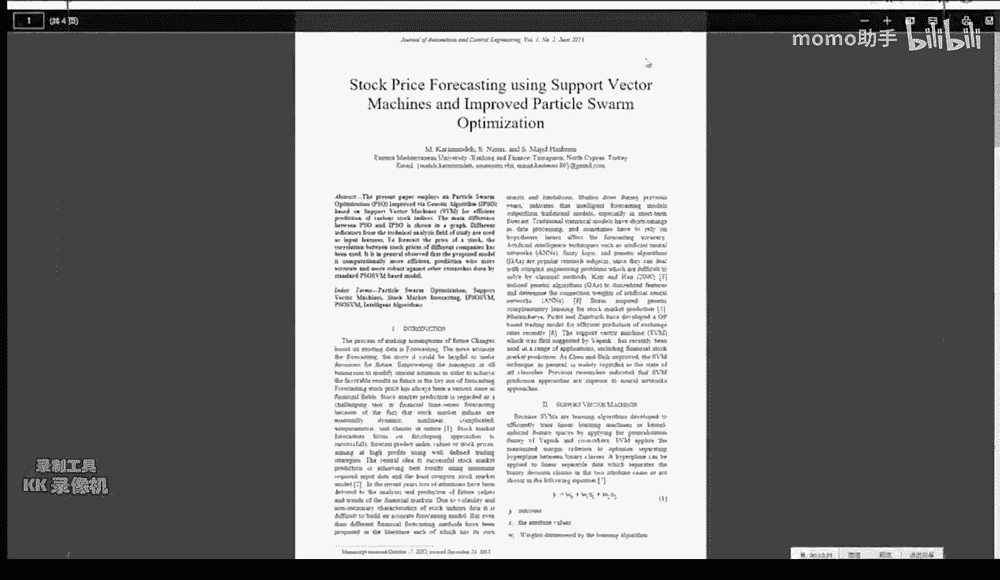

用了一个SVM加这个粒子滤波啊，这个是非常常见的铝啊，这个是非常常见的一种基于分算法的这个啊，滤波方式啊，它对于时间序列尤其有用，他对于时序数据，在很多情况下是比这个卡曼滤波要好的，当然这篇文章的呃。

这个弱点就是还是他们后面的这些回测，跟这个策略的评估做得一塌糊涂啊，但是他前面这个建模你是可以就是说啊，因为在市面上这种论文呃是成千上万的，你啊你要干的事情就是啊看看他的闪光点，然后觉得不行的地方。

你就跳过去就就行了，那么这个你就可以知道啊，我用SSVM加粒子滤波啊，大致大概是一个什么级别的事情，前提你还得假设这个论文没有造假，不过一般来说啊，在cs领域到倒还好，倒还你不用太。

反正你就大致心里清楚，有人大概这么做了啊，他的这个方法做的还可以，比这个比这个benchmark大致能高个啊，7~8个点，高了7%到8%的点，咳咳那么呃他的这个features啊，你你就可以看到啊。

其实很多东西啊，尤其是这种在网上公开出来的一些东西，你比较重要的是一个是看看它的模型，另外一个比较重要的就是，看看他都选了哪些features，看看自己你自己的这个啊，特征提取库里头有没有实现。

如果没有实现的话，你研究一下值不值得去实现啊，不过大部分来说，对于这些公开的啊公开的数据来说，他们的这些feature都没有什么起因，技巧，都是啊比较中规中矩的，也就是说你应该啊嗯嗯，至少你应该很快的。

基于你的那些特征提取的方法，实现一个新的出来，比如说做一些组合之类的，这个是这篇文章，差不多如果你们自己回去看的话，这个大概用个啊15分钟左右，顶多了，就是你在一篇嗯普通的文章上花费的时间。

顶多不要超过，不要超过这个时间，你要看的再细，就说明啊你的方法出了问题，除非你是打算真的觉得这这个论文，你要打算重现，或者说要研究他的很多细节，对于这种啊截止的这种的论文，就不用看的那么细了，顶多的嗯。

顶多的看一下这个他用了一些什么模型啊，解决了一个什么问题啊，你看因为这种就是说基于时序的，传统的这个历史数据，纯粹根据价格信息来做的这个事情呢，就他再怎么地也跳不出这个圈啊，就是嗯如果他没有再用一些。

其他外部的一些信息的话啊，什么样的论文值得多看一看，当他的这个特征是，比如说他的这个特征选的比较齐全的时候，就是它有基本面的，有这个技术指标的啊，什么都有的，哎那那这个论文你值得多看一下。

因为啊它里头一定一定会有一些其他的细节啊，是需要考虑的，那么如果是就这种啊特征题的大路货，他往上面再加，你你你你你有一个叫啊NO free lunch serum，就是说你不会嗯他在同样的特征下。

你不会明显的比别人强特别多，所以基本上大差不差都是那么一个死德行啊，到最后其实归根结底还是第一啊，你的代码有没有bug，第二呢，这个模型跑的是是否能吃进去比较大的树，就是说比如说你用了SAM了。

你撑死也就那几万个点，那么你其实你还不如啊，你用个几百万个点，你用一个线性模型啊，就是说啊其实到最后拼的还是这些个玩意，或者说你用GPU走走了一个深度学习，并不是说深度学习有多牛。

而是因为深度学习它吃进去的数据量比较大，当数据量比较大的时候，各种奇奇怪怪的一些现象它都能被detect到，所以说不管是你SVM加了个粒子滤波呀，还是个随机森林加了一个卡曼滤波呀。

还是直接上了一个X7boss的呀，还是什么，其实这些东西嗯一点新意都没有，你只你就是就只不过是一个非常嗯，白开水一样的实验啊，这个没有什么，没有没有什么值得值得你去再耗费精力的。

因为这课大家已经听到现在了嗯，嗯对这些东西不会感到很神奇，当然如果有一些文章写的是啊，根据十几年的这个经验啊，当他这样的时候啊，再根据一些什么五行八卦呀，什么周易啊，什么这个你们就啊尽量的不要去看了。

就啊这个这个毕竟是咱们是要有一点，这个有一点底线啊，就是毕毕竟是搞量化的，尤其是要搞这个大数据时代下的这个量化，再再再再搞这些个嗯，那什么就是周易啊什么的，这个这个就不好了，大家不要开倒车啊。

不仅不具有重复性，它跟现代的科学思想是完全背道而驰的，它嗯没有嗯，嗯他没有任何嗯，就是他他从方法论上讲是完全站不住脚的，你你没有任何理由去相信他，就是嗯嗯对，因为量化的本质是什么。

量化的本质就是请你给我一个能，可推理可推理演绎的一个策略，就是说到底是买，你能告诉我基于什么样的假设，在多大的信心内我能买，就是说你做决策时，要求你的决策行为是被呃，假设跟公式和定理所约束的。

而在这种情况下，人们认为如果这样做的话，从长远的角度来看，他是比较理性跟合理的，如果你相信这一点的话呢，别人告诉你今天扔了个鞋，鞋冲上就是买鞋，冲下就是卖啊，我扔了十，扔了10年都挣啊。

那么你如果仅仅基于这个，就要相信一个别人的话的话，那么这个事情就跟这个量化的核心假设是背道，而驰的，所以嗯也是正是因为基于这一点，我个人不是，我个人不是很嗯，推崇一些太过奇因技巧的技术分析嗯。

就是说啊也许你啊挣了，但是是这是因为你的一个运气的问题，或者说因为市场的问题，就是在这个市场下，你怎么拧怎么地你也挣，或者说你没有有效的一个把握自己风控，就是有有效的一个这个风控的策略。

让你赔的时候不会赔那么惨啊，那么这些事就是说啊，大家一定要建立一个良好的一个呃，呃呃有一个科学思维的一个方法吧，这样说会好一点好我们再看再看一个啊，这个这个博客写的蛮好啊，就是说他是介绍自己。

就是这个是主要是给这个不在机构啊，想自己干的一个嗯，同学们的这个呃一个例子，就是他是他介绍了一下自己啊，在这个他就是相当于做做这个嗯嗯嗯，就是零售交易员，Radio trainer，就是说嗯。

嗯高级散户啊，他自己做的这个一个呃，这个呃期货的自动交易系统，这挣得还不错，那么主要的他的总结的这个原因就是嗯，自自己的系统要有一定的鲁棒性，然后在这个自己的系统上，尝试各种各样的模型啊。

是稳赚不赔的一个事情啊，嗯这个文章我建议大家可以看一下啊，再看啊，好OK来咱们看看啊，看看有不好的例子啊，OK啊我我就现在咱们就上去看一下，上去看一下他这个，对这个例子就是某啊这名给人摘了吧，不太好。

好好就是说呃这个现在的网上，它有非常多的这种啊做量化的一些呃，交易的一些帖子，不知道是因为个人的嗯，对于策略的保保密因素的这个考虑呢，还是因为呃自身的这个啊水平有限。

发了很多帖子呢给网上的这个量化这个社区咳，当然是对对呃，呃他好的方面是促进了交流，大家一块来聊一聊这个事情，但是嗯就是我今天早上啊给大家截的几个屏啊，我就是上来看了看，逛逛了一圈。

发现大量充斥的是啊这种样子的东西，那么我是希望咱们的嗯，学员呢不要受他们的这个影响，就不要看了之后啊，就是你现在的水平肯定是要比啊，发帖的这些人的平均水平要高很多的，那么嗯可以跟他们嗯积极的交流。

然后啊对批评指正吧，啊那么当然啊别人好的地方呢也可以啊学习，比如说没事看看他们的这些策略的代码，分析一下他们的这个编程的这个这个风格啊，等等的，这些是啊蛮好的事情，但是从他们的这个建模方法来看呢。

啊很明显会啊有一些错误啊，你们现在应该已经有能力啊发现了，然后如果你们自己要写的话呢，啊一定啊，我相信水平会比呃我举的这几个啊，例子要高的啊，那么比如说这个吧，他是这个同学呢，他用的是这个SVR。

就是SVM的这个回归版本啊，它其实是一个SVM预测这个股票开盘价啊，然后他就说了一下啊，他就是嗯OK说了一下这个嗯嗯用前天的数据啊，预测啊，当天的他只是往前看一天，刚开始啊，这明显不对啊。

然后他就往前看这个N减二天啊，然后来预测这个股市的这个开盘价啊，然后但是啊他用的这个，他用的这个feature呢就这么简单的这么几个，也没有做什么规划，然后就跑了跑跑了跑之后好像在哪儿，说到了一个嗯。

我看看啊，它这个性能表现，比这个比一个大盘能稍微好一点，大盘能稍微好一点，但是有很多的问题，就首先他做这个嗯，其实问题挺多的啊，大家先说说几个吧，你们你们现在发现这个问题在哪。

一个feature非常需要归一化，归一化的原原因就是在于你都给他压压，缩到了一个，就是说嗯对于一个feature的归一化的原因是，当他看到一个比较异类的一个数据的时候。

比如说你一直看到的是啊98到一一百一，然后突然看到个300的时候，这个模型的性能就不会很好了，但是你如果归一化到一个比较小的区间的时候，他这个scale他的这个波动会比较小，所以他一他比如说在0。

2到0。6，他表现不错，突然来个0。7啊，他表现也还也会还可以，就是说规划是任何时间，任何维度都应该干的一个事情，放大点啊，在这个链接你们看哦，操你们，你们现在没有PPT哎对好。

首先就是说他的这个数据啊，数据量比较小啊，这是第一个啊，第二个呢就是说他用了SVR，他没有仔细的这个调参啊，当然这些都是小事，最大的问题就是啊如果要用SVR的话，最好要用这个德尔塔Y。

就是说你的这个啊price的difference，而不要直接预测这个这个这个呃，开盘的这个价格，同时呢你的这个呃只看往前前面一天的这个啊，这这个数据没有加入一些嗯，相关的技术指标的话。

那么这个是一个肯定不会很好的一个模型，然后当你看到这的时候，它底下不管这个性能有多好，你都不用看了，基本上都是假阳性啊，如果好的话，就都是假阳性了，然后这个训练的回归模型，他直接用了一个默认的参数啊。

什么都没变啊，也就也就也也就出去了，那么这种事情就是这种事情，你只能在测试你的程序能跑通的，这么一一个任务上，就是你你你写完了所有东西，因为你要做cross validation的时候是蛮耗时的啊。

你就先把默认模型呃，默认参数先撂进去，看你程序啊，别别别别就是出出bug啊，嗯好，那么这个是一个你们一定不能嗯，写出这种质量的文章的一个例子啊，当然你也可以大概你放点烟雾弹啊，想想害害别人。

不过我个人强烈反对这种，如果是憋着劲儿想使坏的，而且我相信肯定这个同学，他不是出于这个目的啊，再看一个啊，这个会稍微好一点的一个例子稍微好一点，待会我还有我还会给你再好一点的啊，我不认为是这样啊。

当然你自己就是咱们的学生，在写的时候，你肯定啊你要考虑的要多一点啊，什么说什么不说啊，这个你自己想好啊，啊待会我会说到怎么样建立你个人的品牌，其实有的时候你说其实没关系啊，这个是关系不大的一个事情啊。

啊这个是呃也是一个基于SVM的，这个嗯评论稍微多一点啊，地址地址我发给大家，看这个啊，给大家呃3分钟的时间先看一下吧，看完之后嗯，你们你们提提呃，你你你对你们提提意见啊，3分钟足够了，他这个没有什么。

就几句话啊，啊完全不是说这个平台不好啊，这个平台蛮好，这这些个平台我感觉都挺好，都挺好啊，就是你们嗯就是啊，只不过这个我们是在说他这个写写的这个，这个东西啊，就这么做，是哪里做的不对了啊。

就是关于这个量化的这个方式啊，有的有的狂偷篇啊，这个是他们的祖宗啊，而狂偷片里头的这个例子，其实质量要稍微高一点，而且狂偷片的这个架构也合理一点，同时狂偷片的这个教程写的要好一点。

嗯嗯就相当于嗯啊FACEBOOK跟人人网的区别吧，目前这个目前的这些量化的这个平台的质量，嗯对啊，在这这个网站我再发一下，对啊，交叉验证是一个大家再提啊，再提一个啊啊狂投片没有A股的数据啊，唉唉等等。

我想想狂投片好像狂刀片是雅虎金融的都有啊，这个你得查一下，对再提一个，所以他这个策略就很啊，再提一个，大家说的很对，不能随机打乱啊，还有这个买入股票的资金，是剩余cash的15啊，这个事情啊。

如果嗯嗯昨天的课大家听明白了的话，一个有效的资产配置的方案，能够让你的收益嗯，有的时候会提升3~5倍都不止啊，然后嗯，还有一个事情是，只是这个事情提了46个指标啊，这件事情蛮好啊，嗯不容易啊。

那么如果三十三十天后上涨15%，或者以上则为一，那么在这种情况下，大家的直觉会会知道会有一个什么样的问题呢，你的训练集对嗯，嗯我知道大家想说的嗯，我已经明白大家想说的事情了，是这样，如果是这样的话。

你的这个分类的类别会极端的不平衡，嗯那么如果在这种情况下，你要用SVM的话，你要干的第一件事就是，比如说冯老师已经不不在了，然后嗯你自己在做，那么你要干的第一件事是，你就需要查一下。

怎么样的利用SVM处理类别不平衡的问题，因为这个是需要调整了，就是要有额外的一个处理，对数据重新加权再做的对啊，而他的这个他的这个代码的话，早上看了一下，应该是就是直接，就就就直就直接用了。

那么这样做是肯定肯定不合理的啊，但是也还大致做的嗯，先不说这个代码的可读性啊，大致做的还可以知道数据的一些清洗的，一些常见的步骤啊，如果有难的话，怎么办啊，等等一些事情啊。

他用了一个这个SSVM这个线性核，然后C是1。0，就是那么这个情况他很不适合处理啊，类别不平衡的一个数据，同时他又把数据进行了一个打散，那么在这这几种情况下呢，跑出来的这个结果啊。

不具备这个所谓的这个这个credit，就是他的这个就是这个的这个credit就会就会打折，所以说如果大家自己要做的话，嗯这个这个问题其实是可以做的很好的嗯，还有问题没有啊。

数据库银行有非常多的处理的方法，我在课上说过一些啊，一个其实就是对数据加权啊，啊这是往上提，另外一个是可以把你就你不平衡，你给他造成平衡，就比如说你百分之你砍掉一些嗯，比如说001分类的话，零类特别多。

你砍掉一些零类啊，那么这个是一个很不好的一个方法，但是是一个非常直接的一个方法，另外一个呢就是调整阈值，比如说比如说对于，一个logistic回归，我们当时预测的时候大于0。5，我预测为一类，小于0。

5，我预测为零类，对不对，那么如果数据不平衡，我把这个阈值调高，我大于0。7的时候，我才预测为一类，这样的话一下子就把这个数据就这个是最啊。

所谓的quick and dirty way of doing it，就是说非常的，非常的有效跟简单的一种处理方法，就是说我提升一些决决策边界的阈值啊，如果一类特别少的话。

我要求就特别大的时候再干都可以，都可以，有专门的大家你嗯稍微你嗯你编一下，或者百度一下，或者谷歌一下，你你查这个机器学习类别不平衡，有专门的一章啊，就来解决这个问题。

因为这个问题是一个非常重要的一个问题啊，反复往模型为重复数据，是这样，你反复为重复数据其实还不如加权，同时为了重复数据，它不会嗯，就是说你们回去看，我给你们讲这个阿达布斯的那一节怎么样加权。

其实就是说啊反复为数据就是想加全蛋，但是你还不如把你的loss函数啊改一下，都应该都应该啊，如果呃那么这个就是模型的超参数了，你需要啊需要调，就是怎么选这个0。8还是0。7。

这个是一个你的一个超参数的一个问题，还有一个啊就是说嗯如果要假阴性，假阳性的话，一定要画的一个东西，这个是大家一定要熟练掌握的呃，一个技巧，一个分析模型性能的一个一个方式，对他用1/5的剩余资金的。

问题，就在于他没有利用到金融学的领域知识，来做这个啊投资组合的这个这个管理啊，嗯比较简单的一个方式，当然作为一个帖子，他他没有义务把所有东西都写了，我只不过是在分析，就是如果你要真正干这件事情的时候啊。

肯定是啊不要干的这么糙啊，我并不是说这么写不好，但是你要干的时候呢，一定别照着这样干法来干啊，再看这个就很好啊，链接先发给大家，啊有就是主动投资组合管理那本小红书啊，传说中的红宝书叫做嗯。

它有一个中文版叫做主动投资组合管理，然后那么我们看看这个很好的一个例子，他们是怎么保持这个事情啊，这个我也建议大家一定要好好啊，就是我也非常希望大家能写出来这样的东西啊。

他首先他自己自己有一个这个项目的g up，他用spark把整个的项目啊，能够以非常高的这个性能啊，啊就是相当于它给开源出来了啊，这是第一啊是用spark写的五脏俱全的一个小系统。

第二呢嗯他有一篇专门的一个博客，来详细介绍一下他的一些关键思想，但是啊他也提到了，因为spark的spark ml里头嗯有随机森林，所以他的实现其实是啊偏重呃，呃实现了这个啊，他开开源出来的。

是实现了这个随机森林的这个版本啊，啊因为SVM你在这个分布式它的这个性能，它这个它也很难做到实时啊，啊不不不，就是说他的这个你的这个训练集的这个大小，也会受到严重的一个瓶颈啊，他干的一个什么事呢。

他干的是这个事。

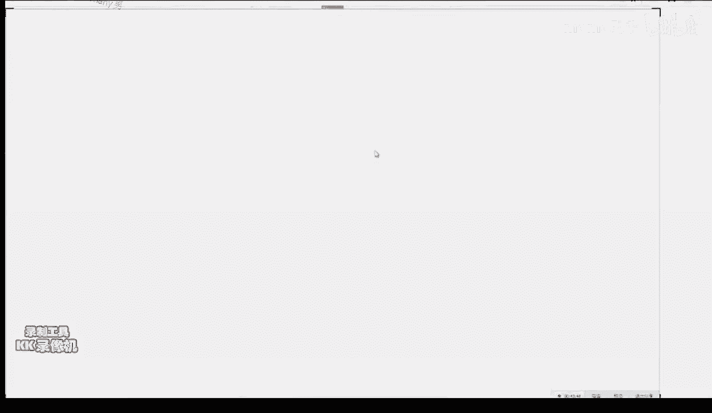

大家看一下啊，出身也还行啊，这个嗯正正经学校的非野鸡论文啊，只能这么说，那么嗯就是说他前面的介绍了这篇论文，我是希望大家细细看一遍的，就是他前面他这个主要是嗯，基于嗯比较高频的数据。

就是说相当于他用的是市场，深度的这个数据就有他把这个买一卖一买二，卖二买三买三的这个数据啊给放进去了啊，当然呃这个是非常有用的，你仅仅通过这个撮合架来判断这个是呃，接下来这个价格的走动肯定不如这个啊。

把市场深度的信息放进去来的要准，因为啊这个是显而易见的一个事情，那么他前面的因为这个是给一些金融学的人看，他前面还要介绍一下SVM啊，他用了这么多的篇幅介绍这个，其实就是嗯对于如果你会SM人的。

你这块你就什么都不用看，全跳过去，然后主要看一下，你看他用了一个这个order book跟这个message book，这两个啊深度的这个信息，然后嗯提取了一些啊，这个是整个的他他的这个流流程啊。

能够进行这个自动交易，同时他的这个策略也选的嗯，并不外行，嗯啊他的这个他这个他这个特征啊，特征在这嗯他的他这个tag是多少。

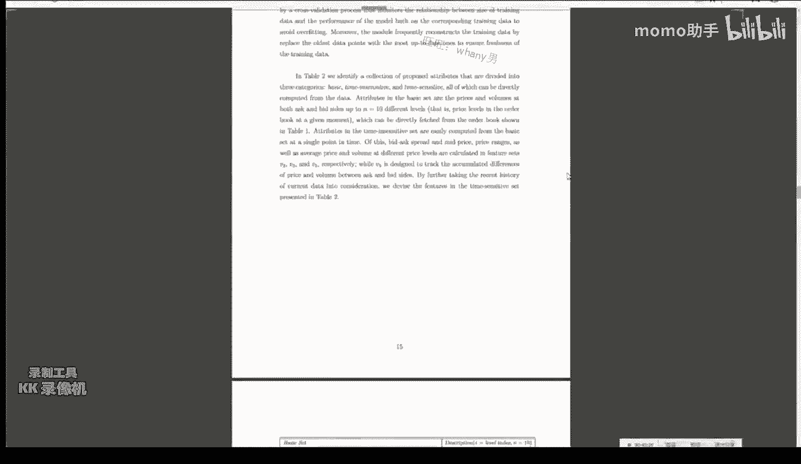

我都忘了，这是他选出来的所有的这个特征，同时还有原因，一个是啊跟时间对于时间不是很敏感的一组，还有一组是对时间比较敏感的一组，以及最基本的这个深度信息啊，嗯蛮好嗯，这个应该作为一个大家啊。

值得去学习参考的一个流程，那么这篇文章里头啊基本没有嗯，就是说嗯藏着掖着点什么，就是他做的事情，他都以以一个比较清晰的方式介绍出来了，那么这个是值得你去看看的论文之一吧，就是嗯就是大概的吧。

而我们这堂呃这个学期学完的课啊，他的这里头的每一个环节你都可以明白啊，对所以这个这篇文章啊值得啊，就相当于一个比较好的一个案例啊。

比那个就是他的这篇博客呢，比那个那个一些比较随意的一些帖子，要嗯更有营养，但是其实你看完这个之后，你也立马就知道，其实啊基于时间的也大差不差，基本上都是都是这德行了啊。

然后顶多你要再加的就是嗯再加进去的话，那就是加1+1点不不同的模型做短三洞，然后再把你的这个风控跟这个策略写进去，基本上就就齐活儿了，嗯啊这个是希望大家回去看一看一个东西，有问题没有。

不不会导致模模型复杂嗯加进去，只要你的模型能够处理这个信息多一点，没没有什么关系，交易价格，这个因为这个权重是用机器学习学出来的，权重就是说啊并不是你人为定的啊，好的好的论文第一啊从顶会上找。

就是首先会议的质量越高，他的论文的质量就会越高，去年在机器学习顶会里头，跟金融有关的大概有四篇文章左右吧，我回头都会发给大家，我个人比较相信这个应该不会赔吧，嗯狂涛片不会。

这帖子一般来说就是说是你休闲用的，就是嗯相当于啊捡漏，就是你去嗯文玩市场看一看，今天基本上满眼放去，基本上都是智商不高的，但是偶尔会让你觉得诶这点我之前还没想过，这个是你要存款投币学到的唯一的一个知识。

OK哪些模型可以吃大量数据，吃重量吃大量数据的模型，第一啊，第一类是简单的模型，就是线性模型，比如说logistic regression，因为它只需要一个点乘，在做E的这个N次方就行。

这个计算量其实很小，而它能吃进去嗯，非常大的数据，它在海量规模下的数据集上，它的性能已经非常好了，是因为它它并不是靠模型干上去的，它是靠大量的数据干干上去的，这是第一类的吃数据的方法。

第二类持数据的方法是，你的模型的复杂度可以高，但是呢你一定要非常有效的并行的训练，而神经网络是一个非常合适的，一个天然的一个能够并行的，一个一个训练的方法，这是深度学习目前一统天下的原因是，我数据又大。

我又想要又想要模型复杂度高，目前你能干的就是神经网络，还能干的是一个事儿，是什么呢，是这个随机森林，你随机森林也是一个天然的可并行的一个东西，当你可并行的时候，你就能吃进去比较大大规模的一个一个数据了。

那么吃中量的数据的话，那就是普通的传统的这些能够拿来用的模型，以SVM为代表，当然还有一些其他的这个基于嗯，基于贝叶斯方法和概率图模型的一些方法，他们吃进去的数据也很难大量。

那么他其实他的这个数据体量也在也在中度，规模就是万把个点吧，算法进展哪里可以了解，OK算法进展是第一，是跟踪一些顶会，那么这个对大家来说是有点难有点难，那么我建议大家看这个有这么一个地方，叫做新浪微博。

爱生活，这个是北邮的一个老师啊，他是一个数据搜集狂，然后如果你有twitter的话，一个这个machine learning啊，boot就是一个转发机器人啊，那么如果在国内我你们就看这个这个就行。

就是爱课外生活，他每天会会分，会转发大量的跟机器学习有关的方方面面，这个这个老师的内容每天都看过啊，这个老师的啊我会断句了，这个老师的内容每天都看不过来，其实你是能看过来的。

他的他的东西我基本上每天全看了呃，而且大概花耗时在十几分钟左右吧，就是你每天起来之后呢，你就要把他的东西都浏览一遍，因为他已经非常人性化，对是新浪微博，他已经非常人性化的。

就是说啊他把一篇论文的abstract跟这个模型，还有这个跑的这个实验，结果以截图的方式出来了，那么当你有了自己的体系结构之后呢，你要看的其实最重要的就是看他这个abstract，看他这个摘要。

看摘要看什么，要看他提他解决了一个什么问题，提出问题比解决问题要重要得多重要，他解决了一个什么样的问题啊，那么比如说这篇文章是提出一种更有效的，这个是神经网络的训练方法，那么然后他怎么解决的呢。

他他就说啊通过啊啊固定一层的这个权重啊，来训练这一层，然后迭代的来啊，然后呢同时这是解决的方法，记住细节就是具体怎么固定的，然后以及一些证明，为什么这个有效和一些实验，结果就是我跑出来之后我这么搞。

确实loss一直在减小，那么我们要看的其实一一第一看问题，记住有这么一个问题就行啊，以后你就知道啊，如果遇到这个问题，前任有人干过，你再回过头来找，就相当于给你自己建立一个这个索引库。

一个你一定要给自己建立一个，非常大的一个索引，知识索引库，就是你自己脑子里的，这样的话，你在日常使用中，你遇到这个问题，你就想啊，我之前在哪看过人，你就能找，那么这样的话呢就会让你非常有效。

而不需要把它所转发的所有玩意儿全看了，但是他有时候也转发一些比较好的一些，经验之谈的一些博客啊的文章啊，这个我也是希望大家啊至至少有所关注，这个是目前我能认为最适合大家的。

同时还有一个叫做啊好东西传传传送门，这这是一个网站，你能每天收到一个邮件，他来给你推送一些他从啊微博上摘出来的，每日推荐大概有十条左右就好东西传送门，啊记不住，你至少最好要记住有一个什么样。

解决了一个什么样的问题，因为当如果你的这个啊机器学习的这个嗯，这个知识比较齐全之后，解决了一个什么问题，这个东西你很难忘，但是怎么解决的，你很容易就忘了，这个微博是啊非常值得大家推荐的，每日嗯。

更新你自己的知识的这么一个一个东西啊，有什么问题吗，好那么我们现在休呃，休息3分钟，然后我们接接就是开始这个下半场啊，有没有好的索引，啊好的资资料索引思路啊，首先啊好记性不如烂笔头自己。

比如说你用这个ever note，这个嗯叫什么什么ever note，它中文叫什么印象笔记，对你用这个印象笔记，做一些这个分门别类的一些一些记录，这个是第一，第二的话，我觉得还是建立一个合适的。

这个学习的这个方法，然后就是我最希望大家就是，至少他的60%的文章，就是这个老师他拿出来的这个这个东西啊，你要做到看懂这个问题是个什么，就明白他他他的问题是什么，就他解决了一个什么样的。

一个一个一个一个一个这个问题，这个problem啊，就是啊在没有学习机器学习这个之前，他提了个问题，你也许都看不明白他这问题是什么，那么怎么解决的，是完全完全不要求大家去掌握的，那么也不是说完全不要求。

就是说啊不强求大家掌握，那么怎么样掌握呃，怎么样解决的，因为它这个是包含了机器学习的方方面面，你肯定不会啊，尤其是作为一个你不是啊，专门要要要要做机器学习的，你肯定不需要完全不需要知道他是怎么解决的。

你只需要记住什么人能够解决什么样的问题啊，哦这类人这这这帮搞计算机的，他们能把这事干了，记住这一点，当你积累到一定量的时候，你就知道在解决什么样的问题，至少找谁问或者从哪看，那么这个知识。

就是说其实知识的这个搜集，跟这个能力是比你解决，尤其是在这个目前团队合作的这个嗯大背景下，这个能力是最重要的，就是你知道从哪去，从哪去寻求帮助，这一点是比怎么解决这个问题更重要。

因为嗯你怎么地都能把这问题解决了，但是你要知道的是，从找对的人问对的问题，这个这个能力是比解决一个问题要更加重要啊，的一个事情，对那个一天能写几篇的，是我跟大家分享的前面的那些，而这个嗯。

他嗯非常适合初学者来学习这种结构啊，就是嗯我前面说的，你看这种玩意儿，你这个玩意儿你闭着眼睛一天就能写很多啊，这个东西呢你你你你用左手，你一天也能写很多啊，但是呢这个就是说这个就相当于我的意思。

就是说这个就相当于他贵的，并不是说我是说这个东西有多棒，而这个是相当于就是这一类文章中啊，做的最详尽的一个啊，比其他的跟其他的方法比，他的这个啊缺点是啊可以说是最少的，而且也是比较呃非常适呃。

非常适合一个啊，基于价格信息跟市场深度的策略，研究的一个样板文章，啊有我回头会给大家呃几个PDF啊，而他呃而这篇文章又嗯嗯蛮不错的，公布了他的一些源码，所以说一天写几篇，我觉得比较难，这个嗯嗯比较难。

大概至少你得我觉得得得一周吧，当然如果你要自己要做嗯，一些量化的实实践工作的话啊，他这个框架是这个框架是正确的，你可以基于这这个框架来做一些，你自己想做的一些实验，就是说你你你你的你的这些特征。

可以把一些非啊，价格跟市场深度的一些指标加进去，这个是我一再强调的，就是嗯有些情绪指标跟一些嗯就是嗯对，就是一些嗯市场情绪的指标跟嗯，主要是NLP那边的啊，一些东西和一。

再加上一些这个啊基本面的这个数据啊，这两个指标加进去的话，嗯性能会更好，然后另外一条路就是你可以嗯，另外一条路就是你可以跟这个嗯，嗯就是说你，你可以跟这个金融的嗯，你可以再再把这个这个任务做得更偏呃。

金融口，然后把这个贝叶斯优化的方法加进去，会提高你风控的，这个就是说会会让你的风控更加容易，因为任何贝叶斯方法，他可以给你加上一个每一个点的这个后验概率，整个一个distribution会给你。

这样的话，你在做你这个风控计算的时候呢，会更加方便，当然这个就是啊如果你知道嗯，听到了就就明白了，如果听不懂没没关系，不要着急啊，你可以先把嗯一些啊非结构化的一些数据啊，考虑进去，对模型肯定是有帮助的。

舆情分析跟事件推荐值得看的东西，我觉得就是啊一些比较好的，自然语言处理的课程都可以，嗯啊大家还有问题没有没问题，那么接下来说几个嗯，对于嗯嗯就是嗯大家嗯反应嗯，就是有些基础知识需要补的，因为嗯。

嗯这个主要是对于一些需要补基础知识的同学，我给大家推荐几门课啊，诶稍等一下哎，这门课是嗯我能呃在网上给大家找到的，一个非常好的一个它的官网，官网在这就是耶鲁做的一个公开课官网。

在这这个里头有它相关的PPT跟建议的这个reading list，如果你要是觉得嗯，就是想要点这个中文的翻译的话，直接上网易公开课这个链接里头，他只但是他只是把视频给你做了一下，这个课嗯如果你听完的话。

你会就是如果你没听过，就是你没有接受过这方面的啊教育的话，这门课对你的影响会是啊极其深远的，当然如果你已经嗯学过了相关知识的话呢，呃你从他的这个呃，就是说你就相当于从嗯一个比较正确的一个词。

嗯思正确的一个思考方式来看待问题啊，就是你受受益会会有，但不会特别大，但是不管是学过还是没学过，如果你没看过这个课的话，我依然强烈推荐啊，无论如何要看一下啊，讲的是很好的，嗯我不是很确定啊。

有可能是有的，但是呃因为他这相当于这个，相当于一个镇校名课了，那么每个学校会有一些镇校名课，我恰巧还都嗯对，就是我待会跟大家慢慢说吧，呃这个是你能够最快速的嗯获得。

因为呃考虽然我不知道是不是他这个现在是，如果他没有没，就是说他没有开放的时候，你是没法看的，就是说他课程是比如说9月到11月开放，在非开放期间你不能看，那么我今天没有选考试院上的课。

就是怕大家比如今天晚上回去要看，然后回来找我说冯老师这课没开，所以我今天找的都是你随时能看的课，而且另外就是考C2上的课，它有一个问题就在于它是极端缩水的，而这个课呢就是说。

尤其是比如说安卓in的机器学习啊，他这个课堂实录版，就是他在斯坦福大学教授里的那个啊，不是教室里的那个实录版，跟这个考试卷上放出来的，这两个，基本上就是嗯，你可以看成两门完全不一样的课了。

所以嗯尽量的看这个底下坐着人，自己学校学生的这个课，他东西会多一点啊，好这个是一个大家要看啊，啊这个是概率啊，这个这个我强烈推荐啊，就这个啊，如因为嗯因为我过一会儿会说到面试啊。

这个课是嗯IMD非常著名的啊，呃呃一个数学家啊，什么T什么嗯，应该是嗯应该是一个苏联的一个人，但是他的呃应该是法国的一个人，他讲的特别好，嗯网易公开课上应该也有，就是嗯就是叫什么概率嗯。

就是概概概怎么写概率，就是嗯嗯嗯有可能有有有有可能，但是大家一定要啊找这个人讲的，因为同样的这种基础知识，不同的人能给你讲出完全不一样的东西，并不是说这个背后的知识有多重要，而是尤其是数学课。

他会教给你一个怎么样思考问题的方式，嗯因为嗯数学是嗯这么说吧，呃真正的教育是我非常赞同这句话，他的意思就是说，真正的教育是你从学校学完之后忘掉的之后，剩下的那些东西，而一个好的数学教育呢。

就说你你把这个数学具体的推导跟公式，全忘了之后，你留下来的数学修养，这个是最重要的啊，一个东西，就是说比如说我已经忘了这个泰勒展开了，但是呢就是我比如说已经把这个微积分中的。

很多的什么泰勒展开什么都忘了，但是你仍然能留下一种处理啊，建模的时候你知道啊，要要通过求导的方式啊来干一些事情，就是说这些基本的这个这个数学直觉，跟数跟数学修养，这个是啊最重要的。

因为具体的这个公式你求一个矩阵的行列式啊，你忘了没关系，有网络你查一查就知道，但是你知道啊，这个问题我要用求行列式的方法来干，而这个是这个修养是最重要的嗯，而一个数学的好的教授。

他会教给你的全是这种东西，就是而一个烂的教授，他就说啊，今天我们来学这个求行列式啊，这么求这么久，这么求啊，再做上十道，你是只会在考试中用到的这么难的这些个习题，这个是烂的，教授就是他告诉你怎么做。

而好的教授会告诉你为什么要这么做，和什么情况下你要这么做，我再强调一遍，好的数学的课程是会教给你在什么情况下，用什么方法就建模的能力，而坏的教数学教授呢只会告诉你，有了这个问题我怎么解决。

有了这个问题我怎么解决，这个是不好的啊，因为这个问题你这么解决，你学会了，你这问题变一下你你你你用哪个工具来解决，而这个是很多教授没有教给你的一个东西，所以说大家一定要啊。

不管是你用EDX还是这个网易公开课，还是呢你要找这个老老头讲的数学啊，额的概率啊，不要听其他人的好，然后哦哎这个好，这个是多变量微积分啊，这个大家一请请当美剧看啊，因为我相信大家这个多变量。

微微积分都都学的差不多了，嗯这个是一个法法国人啊，讲得非常好啊，就是说嗯不紧不慢的，就是慢条斯理的，就是把，你需要掌握的跟微积分有关的数学知识，基本上在这儿就够了啊，这个是在这个链接。

是啊哦我给你们找的是这个带中文字幕的，我今天啊，我今天给你们说的所有课程都有中文字幕，因为，要考虑到有些同学的这个呃这个因素啊，所以说我推荐的课都不是为了装逼，我都是非常诚恳的给大家推荐的一些课程啊。

多变量微积分，而且要这个链接的好，啊这个也是，因为呃这个这个是这个是MIT的前任数学教授，讲的特别好，讲的是微分方程，虽然也许你这辈子用不到微分方程，因为呃其实你会用到，因为在金融中。

偏微分方程是一个极其常见的一个事情，但是呢最重要的还是我强调过了你的数学修养，而微分方程是一个嗯你学完微积分之后，能够立竿见影，知道微积分到底有什么样的应用的，一个一个地方就培养了你的数学建模的能力。

也许你永远用不到这个东西，嗯不不不，微积分啊，微分方程式肯定会用到，就是说呃你培养的更多的是一个，遇到一个新问题怎么解决的一个方式，也许你在另外的问题中，他没有用到微分方程，但是你用到的VN方程中啊。

思考问题的方式，而这种能力是最值钱的，而这种能力呢也是别人任何人都拿不走的，就是说你哪怕你忘了所有细节，但是你人具备了啊，数学建模的整个的这个，这个这个框架的基本素养啊。

你在解决非数学问题的时候都会很有帮助，会让你变得更聪明，所以说啊也推荐大家啊看一下，一点也不难，他不学他，我今天推荐的所有课程的先修知识，差不多就是嗯高中数学就能看吧，我觉得是好，我们再看啊。

这个是嗯这个是给这个，给这个编程还不是特别好的，就是编程有困难的，因为这个是最最基本的一门课，就是，6。001啊，他以前就是他以前是用这个用lisp讲的，又讲了很多年啊，然后后来就改为了用Python。

就是相当于他们大学新生的第一门编程课啊，但是讲得还蛮不错的，嗯这个也是我当年的入门学习的一个课程，N年前了，但是他这个课课序号一直没变，嗯如果你觉得你的编程还是有问题的话，当然我非常不希望到第十课了啊。

大家还需要学这门课程嗯，但是也不排除有的同学实在跟不上了，哎呀不行不行，实在是不行的话，你用这个他是讲用Python来讲，来讲这个跟变阵纯码农的。

就应该是介绍给你怎么样的一个computational thinking，就是说你怎么样的，用计算机科学的方式来看待问题，因为如果你没有学过编程的话，你你你大概这个比如说动态规划呀。

这个这个递归啊和数据结构的重要性，你大概是很难理解到的，你就说这玩意不就存进去就行了吗，但是一个嗯合理的数据结构，会让你的时间复杂度和空间复杂度等等的，这些概念是很多没有学过计算机的人，很难建立的。

比如说你跟啊如果只只做纯数学的这帮人，跟他们聊的时候，他们对这个时间复杂度，空间复杂度这个事情非常的不敏感，就他们遇到一个问题，他妈的你这个不就做了吗，但是他们想不出来这个问题，他是指数级别复杂度的。

你你你这搞数学的，你们就是很不实际啊，啊当然做金融的也有一样的问题，就是他对数据不敏感，就是随时不会问自己啊，这个东西它的复杂度是多少，这个事情啊是需要培养的，而而这门课啊比较好的培养他怎么样想。

就是所有的这这些东西都是怎么样的，就是thinking什么什么，就是说你永远要就是说思维的方式，永远比知识本身重要，你已经有了谷歌这么美妙的一个搜索引擎，任何的知识你都是能查到的啊。

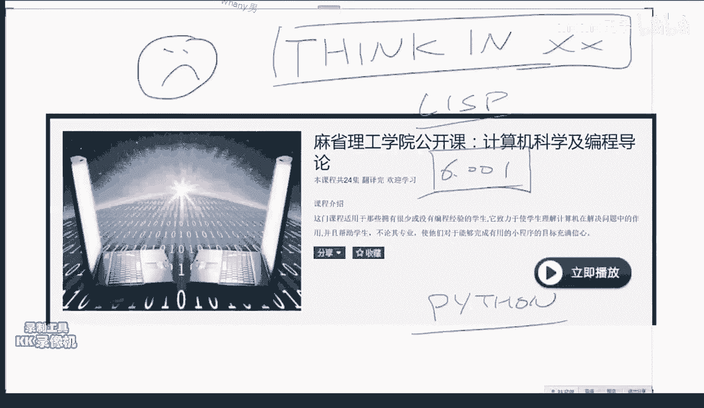

好我知道啊，这个是对于入门更差一点的学生。

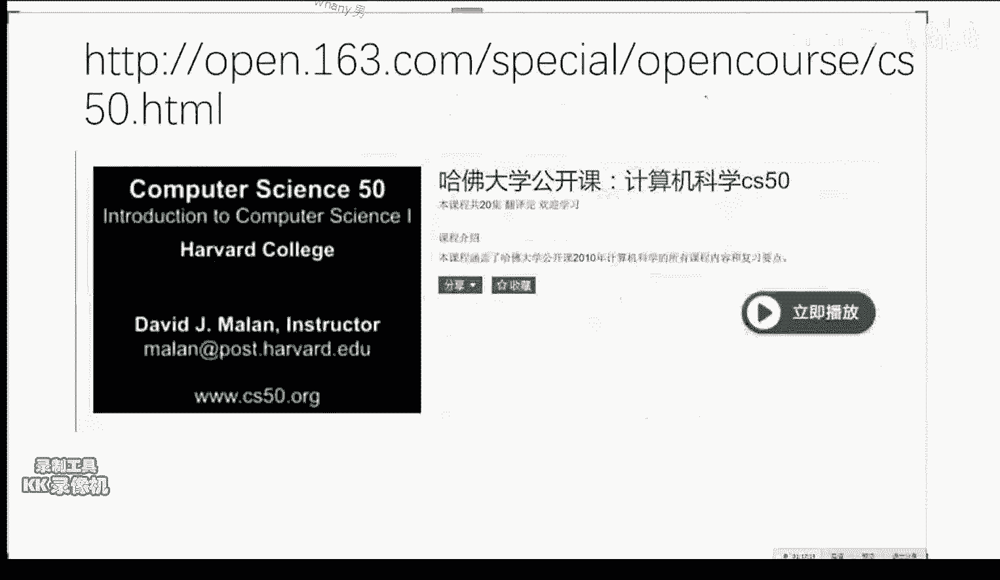

就是如果你嗯这门歌看着还有问题啊。

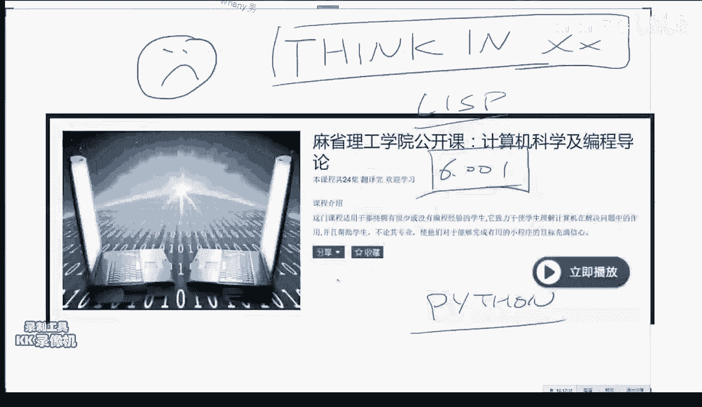

你看这个哈佛的cs50啊，也是一个镇校神课啊，就是计算机的最基本的一个。

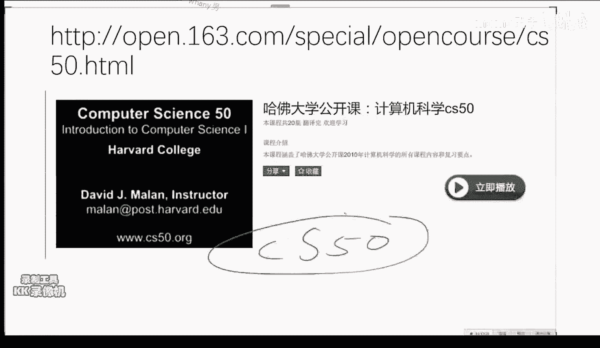

一个东西啊好那么啊这个是对于一个比较，你如果编程已经编的比较溜之后，你们我强烈推荐这门课，他是就是说教给你了，编程中怎么样的写比较高效的这个程序啊，他讲了一些费，讲了一些Python。

还讲了一些这个一些这个啊，呃functional programming的一些基本的一些东西，就是你能写出来比较高效的跟合理的这个代码，那么你也许会说你说嗯我我我我一写Python的，我学C有毛用的。

你学碎是为了写更好的Python啊，这个我相信大家嗯都能理解，就是学一个语言，你并不是要用这个语言，但是你会帮助你在其他语言的使用中，嗯等一些嗯思考问题的一些方式，这个是斯坦福的一门研究生课程。

是三大啊，计算机系的三大三大课程之一啊，好当然这个是大家所有人都知道的，非常重要的线性代数，这个是一定要看啊，常看常新啊，那么啊这门课啊，这门课是一定极其重要的，跟咱们金融有关的一个课程。

我把链接发出来，对哎对，就是这个是呃非常好的一门课程，呃，他讲了嗯，我这门课里没有讲的一些东西，但是我也讲了一些他没讲的东西，就是说呃它最好的地方是啊被墙了，不会吧，这个我早上我还试了一下。

是可以上去的，这课极极端好啊，非常非常重要啊，啊，那么那么一定要大家一定要做的是，他留的这些个作业啊，非常棒的啊，各种的程序的编程的一些一些东西，他他有这个他有每一每一次作业的，详细的这个要求啊。

嗯就是他这个呃设计思路也蛮合理的，然后他每一年都不一样，有从啊14年一三年，12年，11年，10年好像到11年吧，我忘了，就是说呃有前几年的每一次作业都不大一样，然后同时他还呃。

呃他们他们自己还开发了一套啊，非常好的一个啊，量化交易的一个平台的这么一套系统，就是你直接在他那个上面用也行，我没有用用用咱们这门课没有用它的原因，就因为他们的他这个文档已经写的非常棒了啊。

你们自学就行，我没有必要花上课的时间用他他的这个东西啊，就是我发的这个我刚才发的这个这个链接啊，对那么这门课是希望大家自己再再再走一遍，它里头，因为他这个呃上课这个时间的，他这个时间是嗯课时比较多。

所以他把一些东西讲的就又能往深入的，又多讲了一点，嗯尤其是大家要关注的，他对对对，就是嗯他对这个一些嗯嗯嗯就是啊看盘model，这个就是一些比较偏金融的一些东西，它啊讲的比我讲的要多一些。

同时他对这个pandas as的这个嗯使用啊，等等的一些就是Python的一些基础的使用的，这些应该是在homework k1还是这个project1里头，我都忘了，就是说啊也是一个蛮好的。

一个自成体系的一套啊，打怪升级的方法，这个大家是回去可以看的，对还有一些书啊。

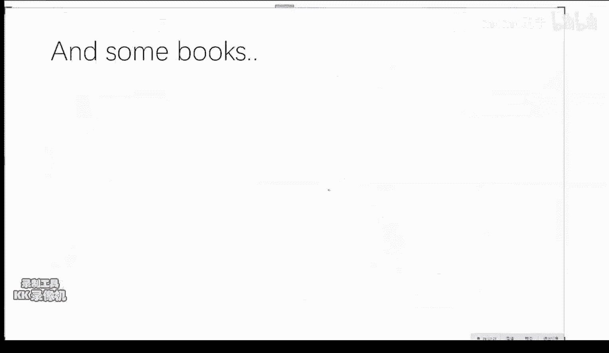

就是嗯，这句话送给大家哈，如果你跟一个咱群里有女性学员吗，啊我不知道哈啊如果你回家啊，跟一个人回家了啊，如果他们家没有书的话啊，不要啊，不要这个啊。

不要跟他们发生什么关系啊，书好，书的话就是嗯这个是真的。

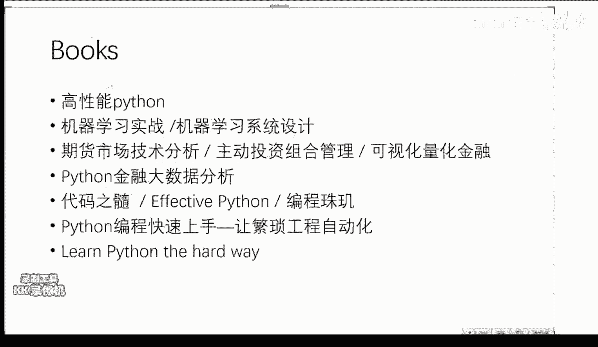

这个我我我个人是很同意这个话的，如果你到一个人家里，他一本书都没有的话，嗯don t don t ask them，有人还专门把它做做成了T恤啊。

非常棒的一个至理名言啊，好那么书的话是这样，高性能Python，这个是啊，非常适合你们，想把代码写得比香港例子还快的一个一本书，很不幸好像没有人翻译过它，但是很好的一本书啊，我说这些书我都有。

而且我都翻过，在京东上你应该都能买到，同时呢跟机器学习有关的，我强烈推荐这一本，这本更好一点，这一本呢是相当于是把每一个机器学习算法，它给你手撸了一遍，他比较强调某一个算法的具体实现。

而机器学系统设计呢，它它基本上用的都是第三方的库，所以说它的代码比较简洁嗯，但是他要给你讲更多的一些遇到问题，怎么样解决的一些一些一些一些事情，个人来来看这本书会比这本书稍微好一些啊。

当然都是这些都是这个entry level，就是说level来报零的，但是啊一一本入入入门书籍吧，啊那么然后跟金融有关的，这这三本书啊都还可以啊，呃这本书是很好，这本书也是嗯就是大神跳大神派的圣经啊。

这个是啊量化的圣经，这本书是主要是嗯就是把一些金融学的知识，当你上完耶鲁那门课之后，这本书你可以翻一翻，看看他们是怎么样的，用这个数据的报表的形式来给你报的一些图，出图出来。

而这个Python金融大数据分析呢，这个我跟大家推荐过，就是说前面的这些事情，你就是前面的这些事情你怎么样呢，用一个用一个Python这个语言来来进行实现啊，底下这三本书啊。

是我刚才说到的所谓的没用的书，就是你要学能力的一个书，它并不高，他并不会告诉你你自己所面临的问题怎么解决，而是会相当于修炼内功的，这三本书写的都很好啊，代码之随啊，强烈推荐啊。

然后当然这个是就相当于一个Python，的一些非机器学习，就是一些脏活累活，一些所谓的脏活累活，怎么样用程序来做啊，干脏活的书，然后如果你这个也，看的很很困难的话，那就只好退回到这个level-1。

那么就是嗯嗯最最基础的这个，我给很多同学推荐过的这个啊，笨办法学Python，这个应该是有中中文版的，这个应该叫笨办法学Python啊，京东上应该是有卖的，这些数京东上都应该有卖的。

啊然后如果你想深入做一点这个机器学习的话，这两本书比较适合你，学完这本书之后，就是这两本书属于level one的书，这个名字叫图解机器学习，但是他一他名字很谦虚哈，这个是啊日本的山山酱苏吉亚米。

就是日本的机器学习界的老大，类似于国内啊周志华老师的一个地位啊，啊写写的不错啊啊他是用MATLAB作为语言，但是讲的还不错，但是啊我要警告你的地方就是啊还是蛮深的，写得还是蛮不错的。

tag的难度跟这个introduction to statistical learning，这个是斯坦福大学那几个吗，就是他们发明了R语言啊，同时他们还啊是马so的发明人啊，啊就是非常重要的。

就是统计学一派的嗯绝对的权威人士，企业的一个啊初级的书，他们的一个这个书的升级版，叫做elements of statistical learning，这个难啊，这个是嗯每一个PHD需要读的入门的书啊。

这个就是然后二到level3的一个级别，所以说如果你们啊会来sk learn之后呢，最好在这两本书中挑一本，然后然后再再看这个啊，对这个书要稍微深一点，这个大家啊台大的济学基石蛮不错啊，可以看看啊。

就是他说话有有有点容易催人入入入眠，但是啊我翻过他写的这个PPT啊，内容很干货很多，一个是机器学习基石，那个其实啊还好，然后还有一个叫机器学习技法，他比较多的强调一些嗯，一些一些模型的具体使用都挺好。

都挺好，啊没看下去没，那就再看一遍吧，因为这个东西它本身就嗯，唉这个东西本身就就挺啊，我建议大家什么，手上有一两个实战的项目来再看，或者说当一个索引，这样吧，你别你也别从头看，当一个索引吧。

比如说你今天突然想看一下，关于这个迁移学习的知识，你就把这个图解机器学习拿出来，看一下那一章啊，这样好一点好，那么现在说OK现在啊关于书的问题啊，大家有没有问题，因为接下来啊大概会稍微拖一会场。

跟大家说一下关于求职怎么办的一些事情，这个事情是我非常想说的啊，风控的书有一个啊，有专门的一个嗯risk呃呃呃呃呃，Investment and risk management，但是哈不着急。

你们先把那个红宝书看了，OK系统的扩展就你就你就扩就嗯嗯，这样关于系统的扩展嗯，大家可以嗯，嗯就首，首先呃需要把这个系统跟你自己的系统，进行一个集成啊，这是第一啊，第二的话呢。

你基于这个你再找到一个比较合适的，你自己的一个啊，你要做的这个方向，然后这个是一个非常kiss by kiss的一个事情，回测框架怎么用啊，这个问题嗯嗯就是说你得先呃，你得先把框架读明白。

先先先跑起来吧啊好，那么我们现在看一下这个这个这个这个简历，简历，现在，招过一些人，简历的话是这样两个东西啊，一个东西是你的嗯，你要准备一个叫做所谓的master resume，就是说你的这个主简历。

主简历是什么意思呢，就是相当于你个人的一个小型数据库，有很多列啊，我给大家已经提到了这个啊，在附件中有这个主简历，需要需要你记录的一个点，就是这个主简历并不是给给别人看的。

是你自己的关于你个人的一个用户画像啊，你对自己的一个画像，而针对于不同的岗位的时候，你随时能根据你的主简历来造出来，一个具有针对意义性的这个这个这个rise me。

比如说你你要今天你要申一个这个量化开发岗，明天要申一个这个量化啊，这个这个研究岗，那么这个不同的岗位之间的这个resume啊，一定要不一样，这样的话才会比较有针对性，那么平时呢一定啊，每隔几个月。

就要对自己的这个主简历进行一次更新，就是这个是一个很重要的一个一个事情，比如说我今天随时别人跟你说，你把你简历发给我，你大概能在半个小时之内啊，嗯就能给发给发给别人，同时这个质量能呃是是。

其实是积累了你之前的很多个小时的心血，的一个一个东西，那么这个是一个非常重要的一个啊，不管你是求职期间还是在职期间，都需要更新你的，如果你不打算开公司的话啊，都都都需要更新的一个一个东西，这是第一啊。

第二的话呢，第二的话呢就是说简历的这个outlook，这个也是嗯大家如果就是你也可以把，就是你们如果觉得嗯有问题的话，可以私信私信我，我我跟你说简历中的一些问题啊，就是说111些简历。

他这个视觉感是非常重要的，一定要在一夜之内啊，同时呢呃基本上嗯长得就长得就是大差不差，基本上都是这个样子，你们不用看具体的内容，主要要看这个他这个outlook啊。

一般来说这样的简历是啊比较合适跟正常的嗯，啊这个简历的这个outlook我下一页具体的说，那么还有就是每个人需要有自己的一个g tab，这个其实是只要跟编程有关的东西。

目前啊比较靠谱的招人都会先看这个东西，看这个东西，你你的这个GITHUB账号呢有这么几点需要注意，第一照片最好是你本人啊，同时呢呃要呃好看一点啊，然后呢，你的这个名字最好。

你就你就你就正儿八经起你自自己的名字就行，不要起一个呃比较呃奇怪的艺名，同时呢你要在这个里头留下你的联联系方式，跟你的微博，跟你的这个呃如果有个人网站呃也好，就是说你所有的能够看你其他的。

你的这些东西的一个一个地址，然后同时呢呃诶hr现在看人第一步先看这个，看你这个活跃程度啊，嗯每一个格代表你今天是否活跃了啊，绿色的颜色越深，代表你这个activity越多啊，你的这个东西。

所以说嗯最好要这个玩意儿，是要至少大概要提前个一年，你就要开始维护你的，比如说你要明年9月份开始找比较严肃的，量化交易的这个这个岗位的话，从今天就需要开始准备起来了，就比如说你对。

差不多你差不多提前个大半年，就要需要开始准备你自己的所有的一个一个，一个一个一个outlook了嗯，那么同时呢你要嗯保证自己有一些比较popular的，一些这个这个这个东西。

同时最好是对一些比较重要的开源项目，你有所贡献，哪怕我就不说一些不好的方，就是说你哪怕就是你，你一定要参与进去，这点是很重要的，然后这个是一个很不好的一个简历，涨涨的样子，大概我总结了这么几点啊。

间距用的不好啊，太拥挤，不要居中，一定要这个左对齐啊，然后这个字号也有些问题，同时这个你一定要用有效的用这个bullet point，Bullet point，比如说我实现了一套系统。

一定如如果用这个所谓的这个这个银弹，就是这个bullet，point的话呢，简历中什么我实现了一套系统，就是实现了一套系统啊就行了，不要有主语，直接就是动词跟呃呃呃，直接就是谓语跟宾语就行，越简短越好。

同时呢你的所有的关于你项目的陈述，最好要有一定的数字，就是说啊一定要量化你的一些111些东西，就是嗯性能提升了百分之多少，你就要把就是性能有所提升，性能有较大提升，这些都不好。

最好要量化到一个具体的一个数啊，包括了就是嗯项目名称标题啊，如果有这个嗯一个GITHUB的地址的话，或者说能够公开的一个地地地地址的话啊，要提供啊一些要点描述，和你用到的技术和技能和啊要比较的简明扼要。

这个是啊很多人的项目看上去写了，但是看完之后嗯很难得出一些呃什么结论出来，这个是不好的，111件事情啊，那么啊在面在面111，一般来说矿的矿的岗招一般是，首先啊这个这个网申啊。

网申问的一些问题都是一些很有点，这个跟这个呃非专业领域的一些问题，然后是店面啊，店面一般来说会有两轮，一轮是hr问你，一一轮是这个技术员工问你，然后就是这个啊。

真正的这个on set interview，一般hr问你的一些问题和一些呃，和最后的一些老板问你的一些问问问题，有一些问题是属于非技术的问题，就是说关于技术的面试，嗯这个我待会说我。

我我先说一下一些非技术的一些面试，就非常没屁眼的一些问题啊，但是又很重要，就是说作为因为作为一个招聘的人来说，他他就是想了解你，就他想了解你，他也没他也，他也没有什么一个嗯合适的一个话题。

他就会问你一个，问你一些听上去很没屁眼的一些问题，让你回答，通过你的回答的方式来判断你这个人怎么样啊，就是说你要嗯，所以说你要准备你的面试问题的时候，一定要换位思考，一定要想，如果我是对方的话。

我希望听到对方是怎么样回答这个问题的，那么一般来说最常见的，啊我不认为有什么年龄的限制，那么一般来说嗯嗯常见的，这就是这四种肯定会问到的，就是请举一个例子说明你的领导能力。

或者请举一个例子说明你的团队合作能力啊，听上去很没屁眼的问，还有一个情，请举一个例子说明你在工作中的主动性，跟你你工作的一些动机，还有请举一个例子告诉我，你解决了一个什么样的问题。

还有一次就是还请解决一个呃，请举一个例子告诉告诉你啊，你怎么样的，这个嗯呃遭遇了一次困难或者失败啊，这种问题呢，大家一定啊一定要有这个一定要讲一个开头，中间跟结尾一定要很清楚。

同时按照一个这个star方法，就是你要介绍你的situation，你的task，你的action跟result同时呢同时一定要嗯，一般来说店面或者说这个on set interview。

他这个这个问题前一问是请介绍你自己3分钟，那么我强烈建议的是，你一定要有意无意的就是你介绍你自己，你一定要非常有意无意地提到自己，引着别人，就相当于你你要给对方下套，你要提到呃，就是留一些地方。

有意识就等着对方问，比如说你你认为自己的一些强项，你有意无意地在介绍自己的这个过程中，这3分钟环节先提到，这样的话呢，就面面试官就非常的想诶，他居然提到这个事儿，那我就多问几句。

而且你在做自我介绍中的每一句话都要做好，对方会详细问的这个准备，这个是非常重要的，而如果你有这种思维的话呢，你在做介绍你自己的时候，你就会有意识的给对方，现设置一些他有可能问的这些点，这样的话呢。

你在啊回答的时候就会非常的从容不迫，并且是有组织有纪律的来干这件事情，这是前面的自我介绍，你自我介绍的过程中呢，其实就应该埋下一些暗线来回答这种很啊很啊，必问的这些问题。

就比如说嗯呃你在前面自我介绍的过程中，你就会提到你曾经完成过的某一个项目，然后这样的话呢在举这个例子的时候，你就说我刚才说到了嗯，我曾经做过这个项目，你就会接着这个项目再往下说，同时比一个比较难的。

我觉得这个问题大概很难回答，就是说请举一个例子说明你遭遇的一次失败啊，怎么回答要有技巧，你不要就就就直接说啊，我干了一个事给了啊，就完了，那么作为面试官来说，我听我得不到任何的营养。

我只会听到你说一次你有多的这件事情，这个是不好的，你一定要回答的是啊，一个比比较经典的一个套路，就是你遭遇了一个啊这个这个问题啊，不不不一次一次困难或者失败，一般来说。

比如说你在一次工作中或者一个某一个项目中，都可以，你这个困难最好是一个啊，正常人都很难预测到的一个，随机性的一个因素啊，比如说你干的这个事情，他体量突然一下增大了啊，比如说你做了一个这个app。

本来你是按照日均3万个访问流量呢，突然一下突然干到了10万个一下，让你的程序啊，就他的这个鲁邦性遭遇了重大的危机啊，嗯你作为这个负责人啊，你是有有有责任的啊，同时你一定要提到的是。

其实你的60%的时间要提，你遇到这个困难之后啊，一定要提到你第一时间做了哪些的补救措施啊，你向谁求助了，你怎么样的进行了止损，最后你怎么样的把这个困难遏制住，和怎么样解题的啊，这样说的话。

那别人就会说啊，因为毕竟困难每个人都会遇到，你怎么样面对这个困难，那怎么样解决这个困难的啊，这个是最重要的，而很多人作为面试官来说，他其实问的是他不问你，他不问你怎么解决，他直接他只问啊。

你遭遇的最大一次失败是什么，但你一定要把遭遇的失败跟你怎么解决的，这个失败啊都都要答进去啊，这这个是一个比较常见的一个一个技巧，然后对于技术性的interview。

对于一个技术性的一个interview来说，这个嗯就比较简单了，我跟大家在这个书里头啊，当然第一是关于成呃编程的这个嗯interview，那么这个有大量的这个网上，有大量的各种各样的资料。

包括这个JULI在这个课程，他也提供了这个程序员面试的相关的课程，好这个我就不多说了，你们非常多的资料，你能学到，那么关于这个框TE的，关于框的重要的这个东西。

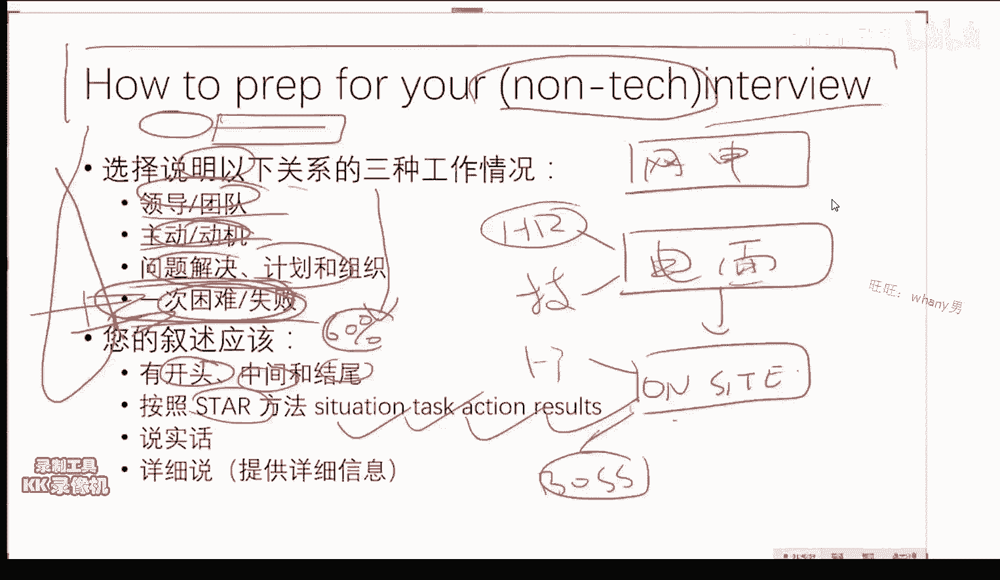

我有这么几本书，这个是神书啊。

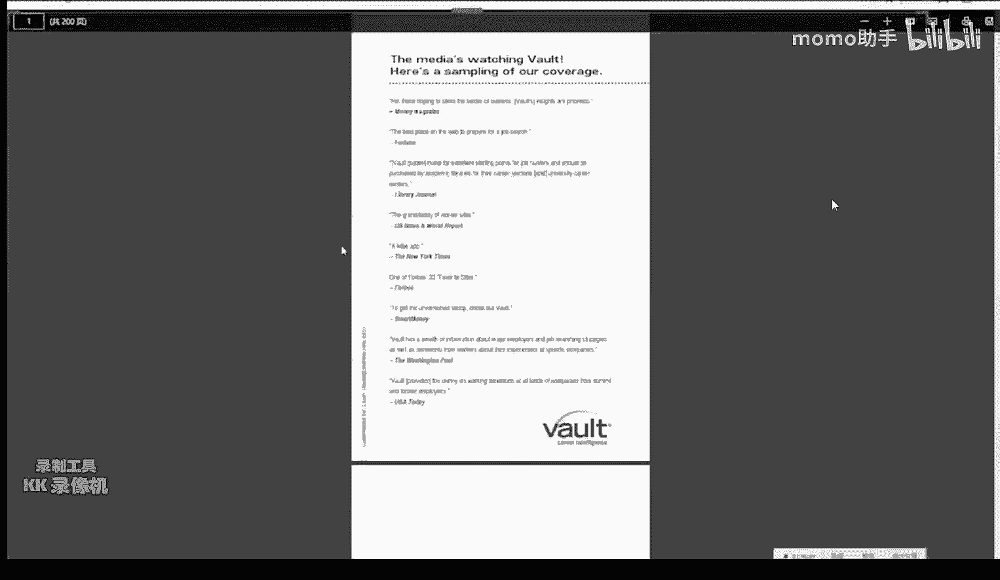

这个一般人我是肯定不会说的啊，VT这个相当于国外的，极其重要的一个职业发展规划的一个一个公司，它每年会对各种的岗位的这个interview，提出一个相当于一个呃作弊的小册子，的这么样一一个东西。

那么我今天在这个嗯附件里头，给大家的是关于这个金融学的interview，这个是纯粹就是这个是所有的金融学知识，因为啊你在做框架的interview的时候，针对于部分岗位。

他会要求你掌握一些比较基本的这个，金融学的知识，而这个里头呢，他就会把所有你有可能遇到的问题来进行，怎么样回答，同时解释一些原理，比如说什么是啊，看看model啊，它就会以最简简简短的方式告诉你。

这个模型的本身的意义，和怎么样回答这些各种奇奇怪怪的问题，这个是目前啊市面上最棒的，就是质量最高的一个面试的小黑资料啊，这个嗯国内很少有人知道嗯，这个给大家这个是一个啊。

这个说实话嗯大部分的跟金融领域有关的，这个外企的hr他们是有的，你没有好啊，然后。

这个这个是一个比较老的一个框架的一个面试。

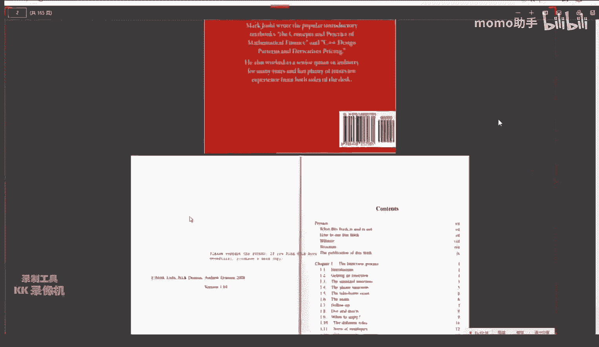

这个是在机器学习嗯，前机器学习新时代啊，而且是他是各种各样岗位的，从前台的框架到这个research框架，各种各样岗位到这个it support，就跟框架有关的，所有岗的所有面试的一个习题集。

而不是一个面试的问题集，所以它包括了一些极其详细的一些呃，一些编程的问题，还有一些呃金融期权定价的一些问题和一些嗯，就是说它方方面面的都会有，这个是一个典型的外，典型的这个外企的这个面试的这个宝典。

就相当于他把呃外企会问到的，所有的问题都给你收进去了，大家挑着看，尤其是最好这个书是结合那个跟大家推荐的，这个耶鲁公开课的这个课，看完之后再看，效果会比较好啊。

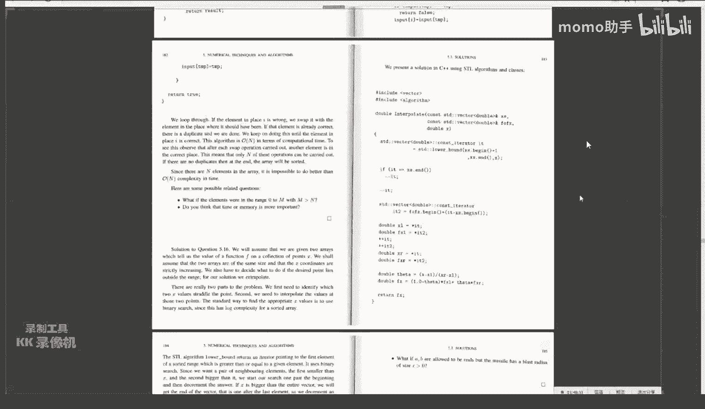

同时比如说现在已经被人诟病了很多年的。

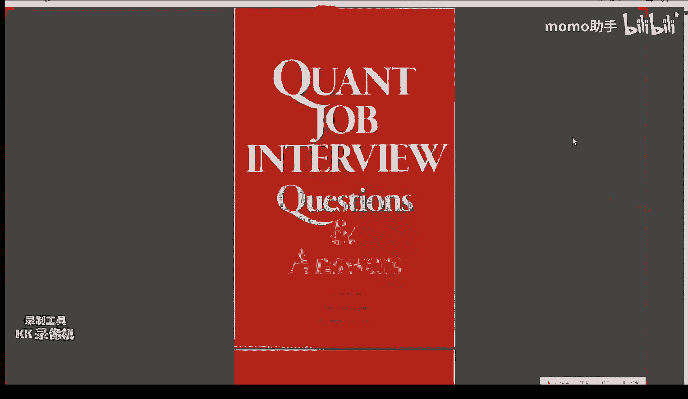

这个所谓的这个brain teaser问题，就是说他就会呃考，就是他就会问你各种各样的，比如说嗯把波音747里头都放成乒乓球，你要塞满，需要放几个乒乓球，这种没P眼的问题，他就看你怎么样的快速建模分析。

其实你最终的答案是不重要的，他是重要的是我刚才强调过的那个数学修养，你是怎么样来想这个问题的，而不是拍着脑袋说啊，大概几万个吧，你这几万个是怎么来的，你不能拍拍脑袋说呀。

就是说各种各样的这种啊这种的问题啊，在一度在90年代的时候，在华尔街的极其流行，但是后来大家都厌倦了这种觉得，这但是仍然在目前中国国内呢，还会还会有人问啊，所以说呃你也要准备到啊，啊包括这个概率啊。

和一些这个期权定价和这个利率啊，还有一些这个数学的一些问题啊，这本书搜集的比较全，一个是这本书，一个是我刚才说的那本书，这两本书结合起来，再加上嗯这个跟机器学系有关的面试的问题啊，这三个加起来啊。

基本上就全了啊，跟机器学习面试有关的问题，目前来说呃，目前来说的话，我会因为我之前是好，就是说我会问的话，我肯定会问的，我百分之百会问的是这么一个问题啊，机器学习中你怎么解决过拟合这个现象。

这个问题我希望大家要印在你的脑子里，你学任何的机器学习问题，只要跟这个相关的，一定要看一看啊，一定要就是你回答这个问题的水平，就是你回答这个问题的长短，能够直接看出来你的机器学习的素，修养跟水平啊。

大家一定要把这个问题牢牢的掌握好，并且准一定要准备好嗯，而且呢你回答尤尤其是技术性面试哈，你回答的每一步一定要做好，别人会follow up问你的这个准备，如果你没有没有百分之百的把握，能够呃解答出来。

别人的follow up，你甚至提都不要提，比如说你说你只用过SVM的这个嗯，调过SVM的函数的话，你就你就你就尽量的就你就不要太提SVM，因为他们就肯定会接着往下问的，尤其是比较常见的模型。

他们会会问到极其变态的这个这个地步，所以说当你没有做好充分准备之前，你不要瞎吹啊，所以对于这个呃技术型面试，那么呃技术型面试的一个非常好的一个起点，就是啊请你谈谈你对过拟合的看法，那么你不管谈。

你肯定是有的谈，你谈的每一个事儿呢都会接着往下问，所以说这个事情，这个问题是一个我最爱问的一个一个事情啊，同时呢呃他的一个等价的一个命题，就是请谈谈你对正正则化的一个理解，和它的意义是什么。

因为这个是机器学习的，另外一个呃角度来看这个问题，你对正则化的理解，那么怎怎么回答这些问题呢，首先要从呃，要要把这个名词本身进行一个比较专业的解释，同时呢要以一些呃具体的模型跟具体的呃。

数据为例来介绍说啊，来来介绍啊，这个嗯这这个现象和怎么样的避免这个现象，嗯我希望大家一定要啊好好准备这个问题，嗯嗯对过拟合跟正则化，这个是非常常见，因为比如说嗯嗯有人是搞深度学习的。

所以说我就不好问SVM了，有的人是对吧，但是这两个问题是任何呃，相当于一个非常common的一个一个地方，你不管做什么都都需要问，然后那么再再follow up婆一点，就是根据你个人的特色。

比如说看你理论懂一点的么，或者说搞得搞不了深度学习，那么我肯定会问的，就是这个这个随机梯度下降的一些原理啊，你有没有写过，这个是百分之百能看出来一个人是真的懂了，还是不大懂啊。

或者说你这个老GENIC回归你怎么训练的，就是这个也是我最爱问的，就是logistic回归，他这个权重是怎么学出来的啊，你需要首先数学公式推导，其次要具体的实现，因为这个是一个非常简单的模型。

但是同时是一个五五脏俱全的模型嗯，我敢打保票，你在跟机器学习有关的岗位的话，这几个问题都会有，那么再传统一点的就是谈谈你对SVM的理解啊，这个support vector是什么啊。

这个max magi呃，它是怎么样跟优化相结合的，那么这个就比较老的一些问题了，嗯这么几个是你你你百分之百会遇到的，嗯也希望大家需要额有所这个准备好。

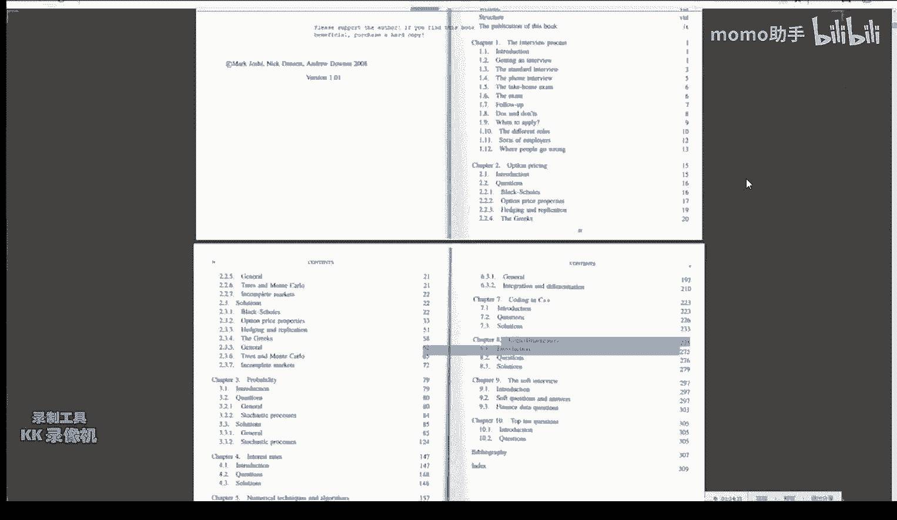

再往下看，我们再看，嗯啊对啊，那么差不多嗯说到的就是这些呃，时间有限啊，能力有限，用了十次课的时间嗯，给大家尽我最大的能力，让大家从零起悟，像承诺的那样从零起步啊，一路走到现在，那么这个课结束了。

但是你要干的事情是远远没有结束的，嗯我希望大家用差不多用六个月左右的时间啊，抱歉我希望大家用六个月左右的时间嗯，把我说到的这些东西嗯，在进行进一步的这个巩固，同时一定要建立自己的一个profile。

就是一定要建立自己的自己的一个个人形象啊，形象问题就是说你要有一个你的这自己的g top，要有一个粉丝在两，2000以上的一个新浪微博账号，要有一个比较日均访问量比较大的一个，一个个人网站。

这三个都要有啊啊并不是全职六个月，这个这个事情是所有事情都是都是兼职的，都是你part time要做的，而你维护你的GITAB，维护你的微博，维护你的个人博客，这个事情是一个终身的一个事情。

嗯就是你就要建从现在开始，就要需要建立你个人的这个品牌的，这个影响力的这个事情，并不是这个是每个人都需要做的，并不是嗯你说是要出去出头露露面嗯，才需要干的一个事情，每一个hr都需要看你如果开公司。

每一个潜在的合伙人，都需要看你的潜在的投资人都需要看哪个东西，这个是一个终身性的一个行为，不管你是从事什么样的职位，这个东西都是需要做的，嗯要写一些比较高质量的，别人愿意分享的一些东西。

比如说你写了一篇博客之后，你可以艾特一下艾可可爱爱生活，让他转发，那么这样的话那就会提高啊你的影响力，然后尽量的少转发别人的，尽量的发自己一些原创性的东西，同时要维护一个看上去比较体面的。

g top的这么一个账号，以及最好是有着自己的一个个人网站，写一些分享性的东西啊，坚持写啊，同时看看别人写的好，就是说当你一旦开始写的时候，你就会下意识的去关注写的好的人是什么样的。

我能不能写的跟他一样好啊，那么这样的话呢，也就会反而逼着你去嗯不断的学习跟进步啊，这个事情这个事情是非常重要的，这个事情是极端重要的，对于你想找一个比较好的岗位，跟找一个比较好的。

就当你找一个比较好的一个合作的伙伴的时候，这个是你的个人形象，别人一个不了解的人，了解你的唯一途径，就是先看看你的社交账户，看看你的这个剧top，看看你的个人博客。

以及所谓的这个领英网的你的这个职业信息，这些是需要用，一定要花大力气去打理的一个事情，而不是觉得啊就是要走过程，因为我要是申请一个岗位，我赶紧弄一弄，不是这个是这个跟你个人。

你每天你穿衣服洗脸是一样重要的一个东西啊，大家一定要就只要你有这个重视度的话，你肯定会做好的，这个我是相信的，而我今天要做的事情就是给大家强调一下，这三件事情嗯，在尤其是在金融这么一个。

这么一个非常强调这个这个这个presentation的，这么一个领域的地方，他们非常重视你的啊这些的事情，啊所以大家回去从今天开始，要维护一个比较好的一个微博，维护一个比较好的g top。

和尽量的建立一个自己的，因为你其实你GIUB它有一个g tab page啊，pages他会给你一个免费的一个GITHUB的这个域名的，这么一个有呃空间，你就能在g tab上建立自己的个人网站啊。

非非常简单，叫g tab这up呃pages大家可以学一下，这你不用花钱就能搞的一个事情啊，全是免费的啊，嗯有了这些之后呢，你就会呃再用这个嗯，嗯再用大概啊再用大概六个月左右的时间，把前面的知识巩固一下。

建立自己的知识体系，然后争取在明年9月份的时候，你就会以一个非常跟现在不一样的角色来嗯，进行一个职业的申请也好，创业的这个阶段也好，同时你用这六个月的时间，自己要做一些实盘交易。

或者一些呃比较成功的回测，并且把你的这个经验分享出去啊，一定别担心说啊，我是不是把一个，你成为百万富翁的机会给放弃了，并不是你在初期的时候，这是你要交的投名状，这是别人要相信你的一个基础。

是你分享过一些比较高质量的量化的东西，和你对量化的见解，这个是赢取别人信任的一个事情，啊这个薪资水平，这个我们还是不要在这个这个，咱们在微信群里头说啊，写博客建议的平凡，我觉得一般来说。

现在大家写的都是一些静态的分享，你最简单的WORDPRESS稍微好一点的，就是这个这个pages，但是它会稍微复杂一些，我我我非常喜欢呃，纯静态的，干净整洁的，甚至互动都不要有很多的。

而且你还要注意是手机登录比较好看的，因为现在有很多WORDPRESS，它手机登录上去很很复杂，很字很小，因为现在大部分人看都是通过手机看，你还要考虑到用手机能看的主要就是什么呢，啊对markdown啊。

对，主要就是说你静态的，能够嗯把你的一些知识分享出去，这个是你个人的技术博客，最重要的地方就是你你分享出去了一个知识点，而这个知识点别人以前分享的不够好，这是你要做的事情啊，微博是这样。

微博分享的知识一般是碎片化的，或者说是呃几句话就行的，我建议大家自己的微博要时不时的，比如说你写了一篇博客，你说我今天写了一篇关于什么，什么什么什么的文章，文章地址在，然后你再艾特一个比较有影响力的人。

让别人转，就是说你微博是一个公布消息的一个地方，但你真正的一些大干货，要放在一个啊静态页面里头去，因为肯定一个博客是写不完的，一个一个110，144字的东西是分享不完的。

但你在微博里头要比较积极的评论一些，最好是原创评论，一些事情上，就是一定要让你的微博让别人看上去有营养，而不是你天天转一些哈哈哈哈，或者666之类的东西，别人没有任何动机去当你的粉丝啊。

这个是本质的不同啊，就是你微博是写给谁看的这么一个事情，是写给自己看的，还是写给别人看的，如果写给别人看的话，你尽量的啊少转发这个哈哈哈，这种东西你自己哈哈哈就行了啊，或者你自己弄一个小号，偷偷哈哈哈。

再建立一个具有影响力的一个一个东西，这个大家每个人都需要做相关的尝试嗯，同时呢比如说有一些比较好的国外的一些，你今天看了一个国外的，在狂投片上面看了一个比较好的技术分享。

你可以给他translate翻译回这个国内版，在国内的数据上跑一跑，然后这也是一个蛮蛮有意义的一个事情啊，就是各种各样的，你觉得啊别人没做的，或者别人做了做的不够好的，一定要精心的打理啊。

他的这个质量其实是质量跟数量都很有关，就是一个你要发的勤，另外一个你发的质量最好要好一些，这样的话你的影响力起来之后，你审不出来了，尤其是在网络时代，个人的影响力跟话话语权。

是占据了非常大的一个权重的一个事情，另外就是说最好在知乎上，当一个比较积极的问题回答者，比如说这个王博二啊，我的好哥们儿啊，他是做高频那个嗯，在知乎上面，就就是说你当别人都关注你的时候。

你做事情就顺多了，你想求职你也方便多了，嗯这个是并不是少数人的特权，只要你努力，只要你有这个意识，每个人都可以都可以的啊，你你你你你认识他是吗，那下次争取嗯，下次聚会的时候把他拉上嘛。

他其实是个做高频的字，他在知乎上天天扯淡好，那么我们这个课程就到这里，我非常的感激大家时四刻不离不弃的嗯，忍受我给大家出的各种各样奇奇怪怪的作业和，坚持下来了，这个很不容易给大家鼓鼓掌。

然后呢嗯希望大家在这个课之后呢，不要放弃学习啊，不要放弃啊，养成一个学习习惯的这个这个这个这个事情啊，量化是一个非常美妙的一个事情，它是你只要数学足够好，你就能就地变现，而且你的变现成本比较低。

不像你要做一些其他的AI的创业的话，你需要有一个极其强大的销售团队，而量化的话，你闷声发大财就行，他是一个非常棒的一个，能够把知识变现的一个方式啊，同时也是一个非常棒的一个培养你啊。

各种素养的一个一个领域，希望大家在这门课结课之后呃，按照嗯自己规划的这个打怪升级的路线，继续的这个啊这个学习，然后啊，争取再用六个月的时间，让自己变成一个更好的自己。

嗯这个就是嗯其实这个课我是非常有感情的，不像有的其他的我是偶尔去客串，我讲完我就走了，具体每个学生是谁，我也不认识，这个课大家十次下来也交了非常多的朋友，嗯非常的啊，感谢大家对我的信任，我非常的感感。

感谢大家对我的信任啊，那我们今天就到这里，然后线下聚会会有啊，微信群不会散啊，我一直在啊，我们保持联系，那么这这堂课呢就先到这里啊，谢谢大家啊。

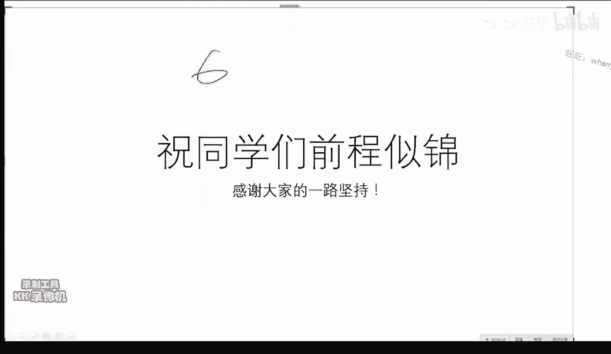