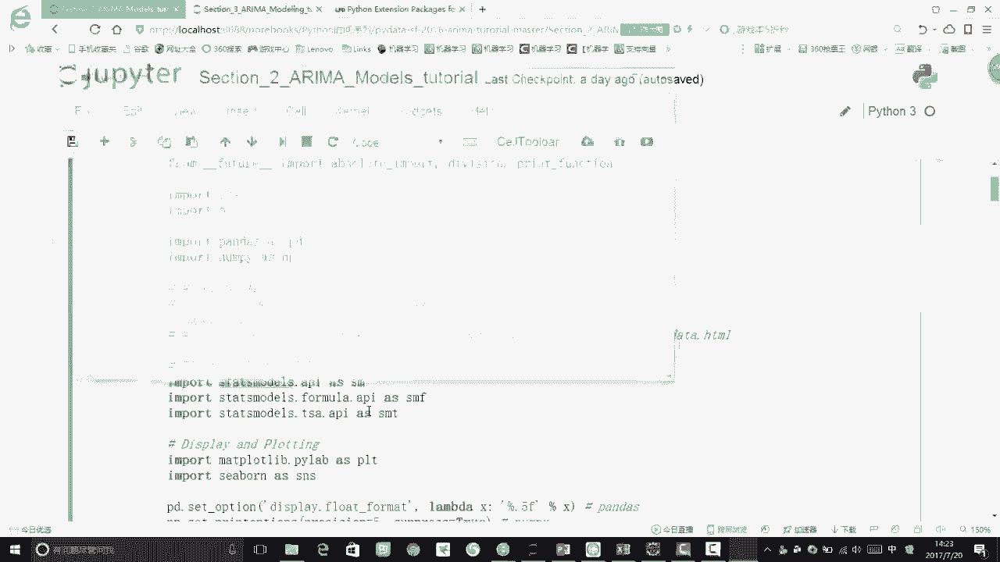
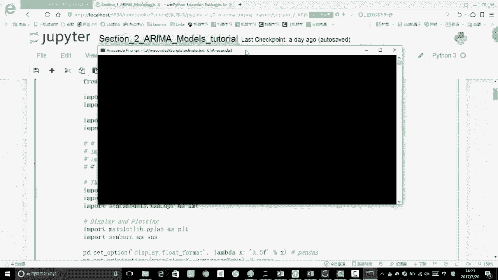
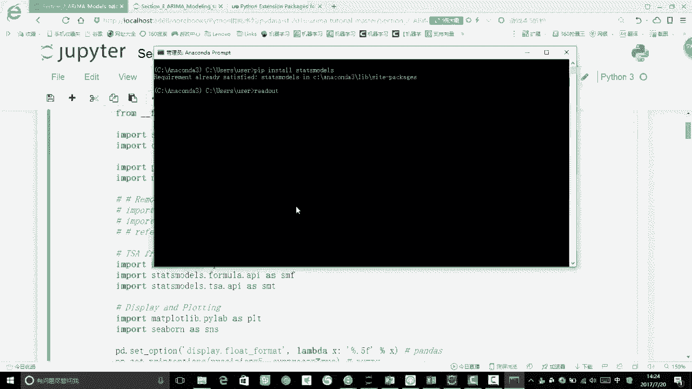
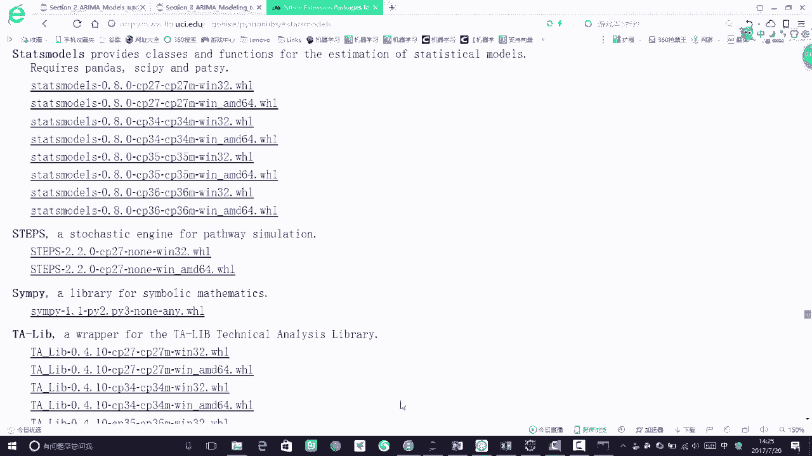
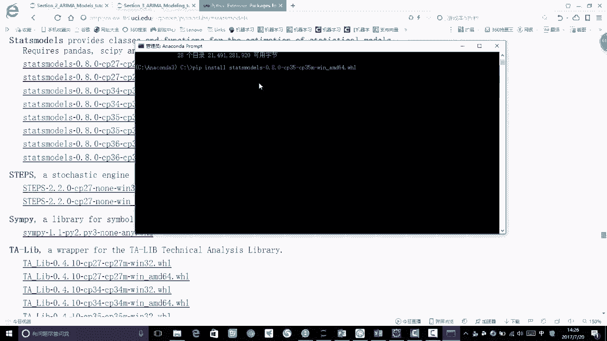

# 吹爆！Python金融分析与量化交易实战课程全详解，迪哥手把手教你基于Python实现金融量化+股票交易，究极通俗易懂！ - P68：6-相关函数评估方法 - 迪哥带你学CV - BV1KT421Y73G

然后关于这个模型有了之后啊，我们要说两个东西啊，这两个东西是来帮助我们去选择什么样的P值，还有Q值是比较合适的，咱们要说的第一个东西啊，是一个自相关系数字，相关系数啊是什么意思啊，嗯相关系数大家知道吧。

相关系数是什么意思，就是说比如说两个变量，我们可以在这里画两个变量，如果说这两个变量就是变化程度啊是一样的，那我说它是相关系数正一吧，然后呢如果说它俩变化程度是这个样子，你大你大我小你小我大。

那它就是一个负极吧，这块可能画的不太好，我来看一下这块应该是这个样子啊，这它就是我重新画一个，这我们来看就是一样的，这是正义相关系数，它俩的一个变化范围，比如说Y和X那他俩的相关系数正一吧。

因为呃Y进行增大，YX也进行增大，Y减小，X也进行增小，所以说他俩相关系数是正一的，那这回呢如果说这个Y它是这个样子，X呢它是这个样子，正好相反吧，正好相反，什么它是一吧，就是说它是一个负相关的。

那你相关系数等于零是什么意思呢，它俩之间就没有相关性了吧，所以说啊，我们现在有个相关性的一个取值，是从-1~1的，一呢表示着一个负相关，正一呢表示一个正相关，零二表示着他俩之间没有什么关系啊。

咱们可以用这样一个指标来进行衡量，那一个自相关函数是什么意思啊，ACF啊，就是我们翻译过来就是一个自相关函数，自相关函数，意思就是说，现在啊我们描述的是随机变量，跟它自身的一个比较了，刚才我描述什么。

刚才我描述的是一个Y和一个X吧，Y和X相当于哎你好像有两个变量，你能描述的这个东西，那你一个变量你怎么描述啊，当我们在用一个变量进行描述的时候啊，我们就去看一下它的一个就是阶数嘛。

比如说你现在啊我的一个YT，我是一个时间序列，那我的一个YT减一不也是这样一个序列吗，我就可以算一下YT和YT减一塔之间关系，还有YT和YT减二之间的一个关系，这些是我们都可以去算的吧。

所以说呢就是说这个自相关函数啊，反映了就是说我的同一个时间序列啊，就是同一批数据啊，这个这个时间序列上的一个数据，在不同的一个时序上的一个相关性，什么叫做一个时序性呢，我们来看看这个横轴啊，横轴取什么。

这样0~20分别什么意思呢，0~20啊，我们就可以想象成是20阶，这个是一个呃呃这是一个一阶，这是一个二阶，这是一个三阶，这是一个四阶，表示着我们滞后多少个点吧。

那这里呢我们就可以通过这样一个自相函数啊，根据我的一个阶数来判断一下我同一个序列啊，在不同的阶数的时候，它的一个相关性是长什么样子的公式呢，直接给大家了，就是我们这个相关系数啊。

跟自己跟自身啊做这样一个差异性的一个对比，那我们的一个自相关系数ACF，它的一个取值范围，是从一到正一的一个区间上，我们来看啊，就是说啊在这里就是我们有所有的值，它的取值范围都是从一到正一的。

然后这块我还画了一个虚线嗯，虚线是什么意思啊，虚线表示着我的一个置信区间嗯，咱们通常情况下就是知音区间啊，都取95%吧，大家应该就是上高数的时候学过这个东西吧，就是有个执行区间。

然后看的最多就是五九十五%之间，区间什么意思呢，这东西给大家直白点说吧，比如说你现在数据当中啊，有100个点，那其中95个点都是符合当前的这个逻辑的，或者说都符合当前这种趋势。

那我就说当前啊这个执行区间区，它们是落在了九十九十五%的一个，置信区间上啊，就是大致是这个意思，叠起来比较容易，然后这里呢我们来这个虚线，就是我们画的这样一个置信区间，然后横轴呢是我的一个阶数。

纵轴呢是我的一个ACF值，通过我这个ACF值啊，我们就可以算出来了啊，当前的一个就是时间序列啊，跟我不同的阶数，它的一个自相关性是长什么样子的，那这个ACL图啊怎么画呢，一会儿我们会用个工具啊。

等大家一会给大家说工具时候，再给大家详细说一下那个库啊该怎么去用，大家现在只需要知道我们有一个自相关函数，是用来描述我们在不同的时间序列，我们来看这是阶数吧，在不同时间序列上。

它的一个跟当前值的一个就是相关性是什么样，我们看取的是YT吧，YT和什么YT和YT减K吧，就是你取不同的K值就可以得到不同的结果吧，K就是取一个阶数嘛，然后看一下当前值和就是不同时序的时候。

它的一个相关性是长什么样子的，取值范围呢，是在这样一个一到正一的一个区间上的，然后说完了这个自相关函数之后啊，还有个东西叫做一个偏自相关函数，就是有个P哎呀，这个东西反正说起来挺麻烦。

然后我这里呢就给大家比较通俗的去说一下，什么叫做一个偏自相关函数吧，一会儿呢我们是直接用那个库啊，可以帮助我们直接求出来这个PACF，之前咱们看的那个叫ACF，现在呢我们看的东西啊叫做PCF。

相当于啊就是做了这样一个啊，就是做了这样一个偏，那什么叫做一个偏呢，嗯咱们来想啊，就是说之前对于一个平稳的一个AR模型，然后选了一个P接，我算出来了以后，之后的一个K的一个相关系数啊，pk的一个值。

那我算的是什么和什么之间的关系啊，我算的大家可能理想认为，就是我当前值和T减K值之间的一个关系吧，那其实啊并不是这样，我们想就是当前的这个当前这个值，跟你这个前K阶的一个值来说，他俩肯定有关系。

那你这个K值当中啊，比如说提取这个十，然后K取五，那这个当中啊是不是还有其他阶啊，那你跟其他的接的时候有没有关系呢，比如说我现在来看其他的XT减一，XT减二，一直到XT减K加一。

它对我当前的一个值有没有影响呢，都是有影响的吧，所以说啊就是我当前的一个XTXT的一个值，我还会受到中间很多个随机变量的影响吧，那这些随机变量呢，就都和我当前的一个XT减K具有一个关系。

所以说啊我现在求的这个pk啊，就是嗯它里边掺杂了我其他的一个变量，对于我这两个值之间的一个影响，也就是说当咱们在用ACF算的时候，我们得到的并不是一个XT到XT减K，它俩之间的一个单纯的相关关系。

还有把其他的变量给它拷贝进来了，这是我的一个cf，那我的一个PACF什么意思啊，它偏在哪里了，它就偏在这点了，就是说它剔除了啊这个ST减1XT减二，一直到XT减K加一的一个干扰后，又直接的算了一下。

XT减K对我当前的一个XK的一个影响，的相关程度，那其实啊简嗯，简单点说，就是说ACF它是包含了其他变量的影响，而我的一个PN的就是一个PACF，它包含的就是只有这两个变量之间的，一个相关性了。

相当于啊就是PCF啊，他做的更绝一些啊，把我中间的都剔除掉了，只是计算啊，你要算哪个阶数就给你去算哪个阶数，而我的ACF呢会把中间所有的值啊，都考虑进来，那这个就是我们现在给大家说的啊，两个东西。

一个叫做ACF，一个叫做一个PACF，那咱们就来给大家看一下吧，咱们该怎么样去画这两个图呢，啊，嗯首先啊，就是当我们想去做这个URA模型的时候啊，呃我们需要额外的再装一个库给大家来看一下。

叫做一个state models，就是这个东西这个东西啊在装的时候也不麻烦，我们先打开我们的一个安康达，把我的PROMIT打开。

在这个普通it里边啊，我这个有点慢啊，开的东西有点多，现在然后呢一会儿我们直接啊打这样一个命令。

就是一个pip install，我们来打一下，就是pii pin store，然后我把它的一个啊s sta at嗯，SMODLS啊，直接把它打进来，然后打这样一个回车就可以了。

正常情况下它会帮咱们先进行一个下载，下载完之后呢，就去进行这样一个安装，安装完之后他又告诉我了啊，当前的requirement啊已经是满足了，那这种情况就是可能会遇到一些问题啊，遇到一些问题的时候。

大家怎么办呢，就是这点啊，就是我总说啊，咱们可以用一个，就是我记得我最最常见的错误什么result吧，比如说你之前啊下什么库，大家不知道见没见过一个result，就是说这些库啊。

你在下的时候要下着下着就网络中断了，这个东西很烦人，经常下到个七八十%啊。

下这个库的时候，然后它就中断了，那怎么办呢，你也可以啊，自己的去下一个这样的一个库，就是我们先看一下这有个界面啊，这个界面里边它其实是包含了很多啊，在咱们windows下能装的一些Python库。

如果说你直接用pip啊装就是不限于啊，咱们今天讲的这个state models，就是之前装任何库，只要你出现一些问题，我们都可以进行这样一种安装方式，在我们这里啊，这个东西这个我就直接给大家嗯。

还是复制过来吧，就是复制到我的一个在这里吧，复制上啊，就是我们的一个链接，然后在这个链接上我们就可以自定义的，就不是自定义，就是自己的去下这些库，我们来搜一下，就是CTRLF，然后搜到这个东西。

搜到这个东西之后啊，现在哎我来看一下啊，state models在这呢在这里搜到之后，我们去哦，我们到当前的一个这个目录下，然后这里呢，我们首先啊看到他的一个当前版本是0。80，然后后面有CP35。

还有CP27，Cp34，Cp36，它表示的就是啊你当前的一个Python是什么版本，不同的一个Python版本啊，它下的这个库也是不一样的，所以说你根据你是2。7，你就下2。7的，3。5下3。5的，3。

6下3。6的，然后点击下直接下载就行了，然后32下32的，64+64的这点我们下完之后，然后他是一个点w hr文件，点w hr文件我们可以给他来CD看一下嘶。

哦放在在在这了，就是我们来看这里就是有一个点WH啊，就这个东西我之前也是自己这么下的，这就是一个点WHL文件吧，然后呢你进到啊，就是当前的一个你的点WHR文件，你下哪了，你就是进到那个目录下。

进到那个目录下之后呢，我就打这样一个pip，也是install a，只不过说你现在要install的就是这个点WHR文件，直接啊打这样一个命令，它就会把我们下载好那个库啊，又给他装起来。

我是觉着啊就是这样的一种方式是比较简单的，尤其是在下库的时候，可能有些同学啊，就是在装或者是配置咱们环境的时候，经常出现一些问题，出现问题啊。

就是很头疼又头疼又耽误时间，咱们也可以使用这种方法去进行一个安装的，然后这样呢就是把我们这个state models啊装起来了，一会我们就要用这个库当中的一些函数，pandas和安排都是比较常见的。

还有super咱们画图的MAD plot，这也不说了，然后下面就是设置我的一些。

