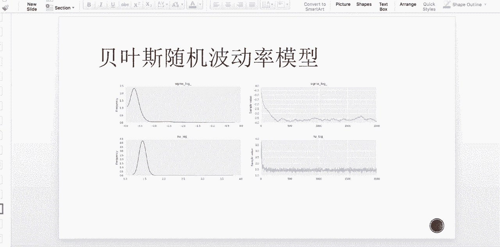
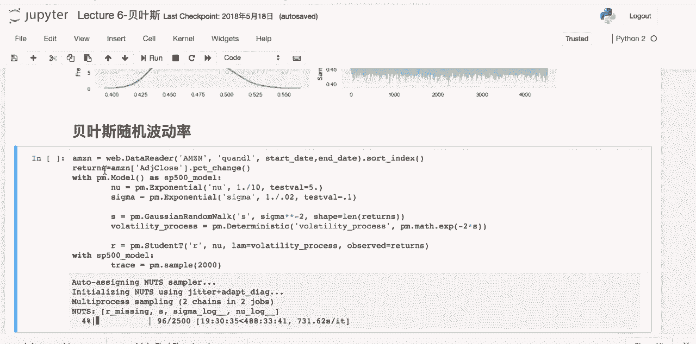
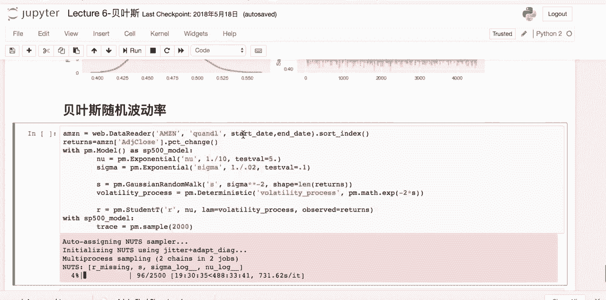
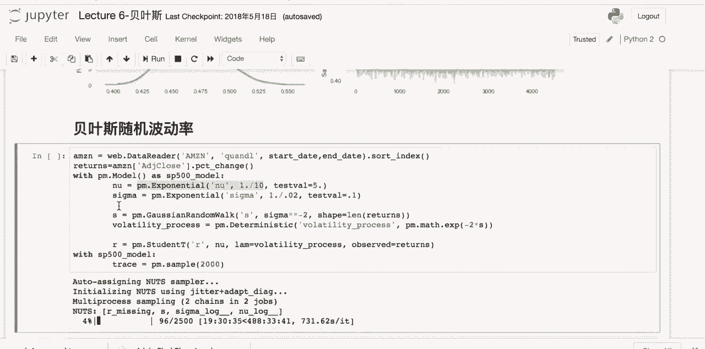
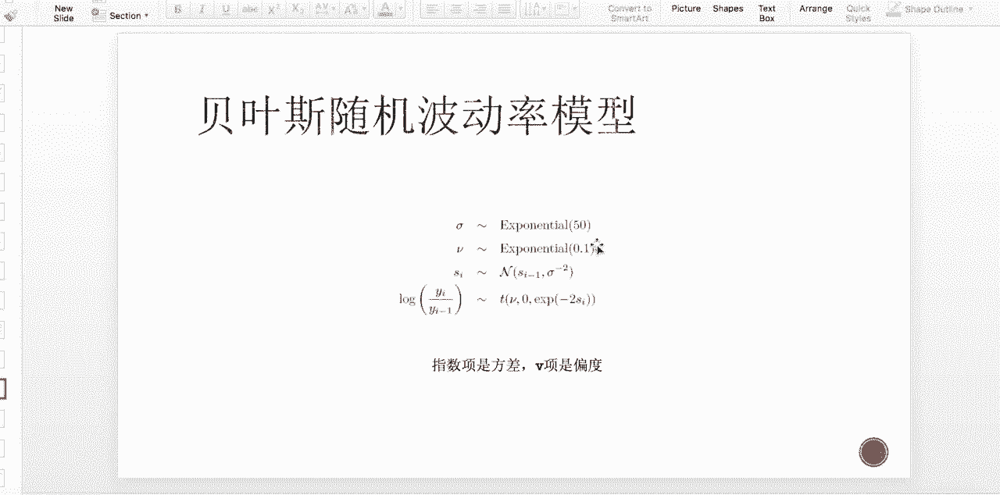
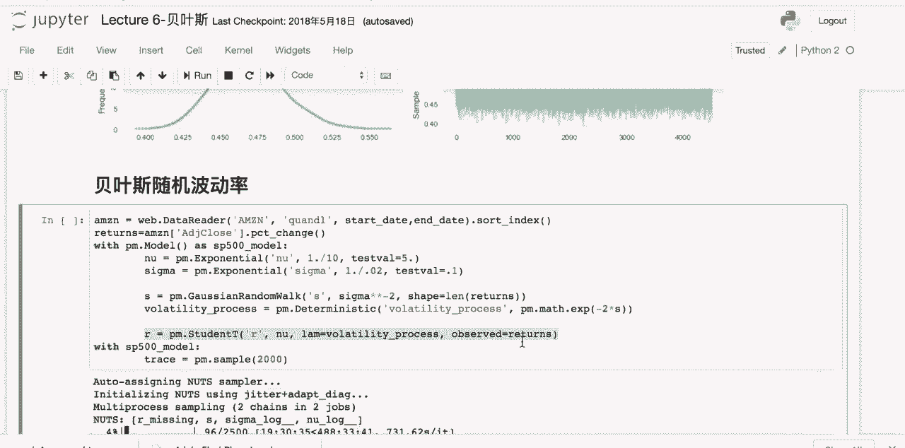
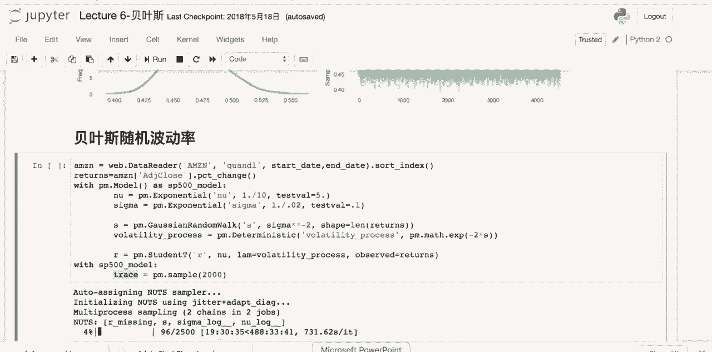
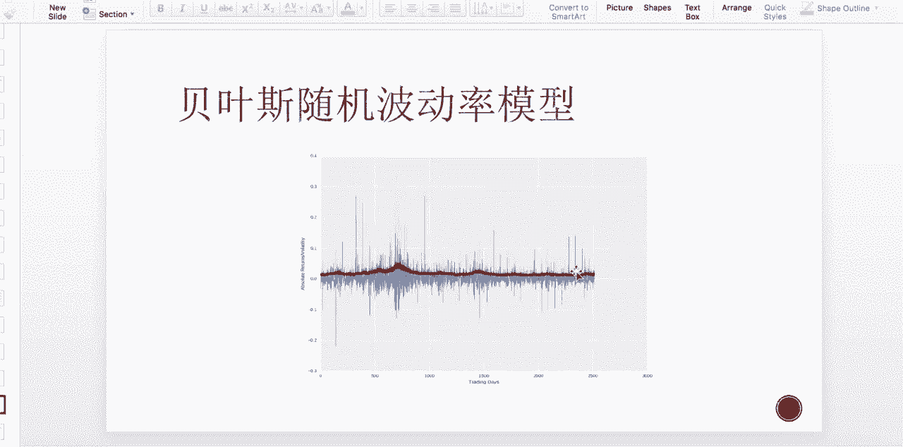
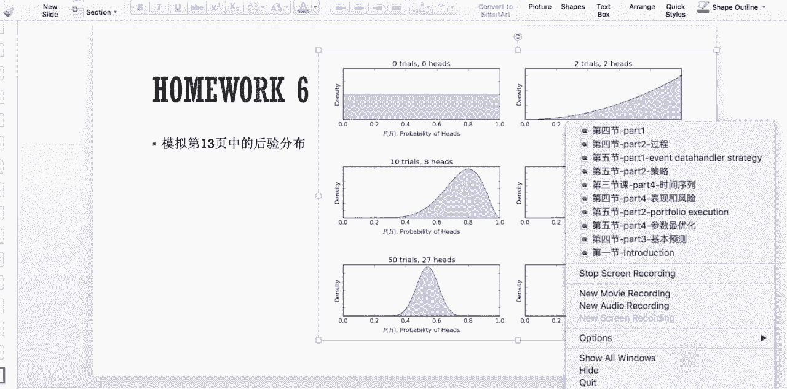

# 吹爆！这可能是B站最完整的（Python＋机器学习＋量化交易）实战教程了，花3小时就能从入门到精通，看完不信你还学不到东西！ - P10：第10节-贝叶斯随机波动率 - 凡人修AI - BV1Yx4y1E7LG

我们今天最后一块内容了，那我们来介绍BS随机波动率模型，那首先我们要提出问题是，为什么我们要使用随机波动率，为什么波动率不可以是一个常数，那么我们之前提过，我们basic idea。

是觉得我们的时间序列最好要满足一个平稳，并且均值回复，那么平稳and均值回复的好处呢是平稳，我们估计的均值和方差，对于长期以来都是有效的，所以我对我们的风险，包括我们的收益率，那是有一个长期的idea。

那么对于对于均值回复呢，是当我们的均值，偏离我们啊期望的这根线的时候呢，我们就有理由认为它会向上，向向上或者是向下进行回复，那我们可以通过short或者是loan呢来获取利润。

但是往往的我们的啊时间序列，并不是一个均值回复并且平稳的序列，那么第一提出的呢是，它会满足一个几何布朗运动，那么几何几何布朗运动的表达式呢，就如第一行所述。

那么我们的安underlying asset的这个微分呢，它的漂移项也就是我们的这个均值，向上或者向下的移动向呢，是一个new乘以我们现在current的这个价格，price要乘以这个时间的微分。

那它还存在着一定的不确定因素，那么不确定因素呢就是我们的波动率小，那么波动率下呢，是一个维纳维纳过程的一个微分，那么乘以的是什么呢，乘以的是一个sigma，曾有的s st也是我的漂移项和我的不确定项呢。

都跟现在我的当前股价有关，我现在股价越高，说明我越有趋势向上漂移，并且我们的波动率也就是不确定因素越大，那么这个符合我们对市场的basic idea，那么这个嗯几何布朗运动呢。

它存在着一个什么样的弊端呢，就是当我们对我们时间序列，进行一个观测的时候，在long term，长期以来，我们会发现，我们的波动率往往并不一定是跟我的这个s st，就是s st是成这个正比关系的。

所以以上的这个模型，关于波动率的刻画还是过于的粗糙了，那么这个时候呢，我引入了一个下下面的一个二元的HESTON模型，那么HASTM模型对于这个current underlying price的啊。

这个波动的这个微分序列呢跟上面非常类似，只是呢这个位置改成的是一个VT，也是我是VOLTE的平方那个开根号，所以这个时候的这个根号，VT跟西格玛应该是等量的，那么我下面呢是对VT，也就是为了特定的平方。

进行一个啊stochastic的刻画，随机刻画，那么它的微分等于什么呢，是等于一个均值回复过程，那么为什么是均值回复，因为这个地方的C塔其实是一个长期的，VT的一个level值，那么减去VT。

所以这个时候当VT比C塔高的时候，那么我的漂移项就是负的，那就有趋势往下拉，那么VT如果比C塔小，就说明在长期的均值以下，那么漂移项就是正的，那就是往上往上往这根长期的均值爆往上拉。

那么拉的速度有多快呢，是跟这个K成正比的，那这个是一个均值回复的drift on，那他回复均值不但有上上跟下下的速率，还有一个这个volatility，就是扰动项，那么扰动项呢是满足自己本身的开根号。

再乘以一个COC这个系数，那么这个呢跟正常的这个水晶模型比较类似，就是向上还是向下这个扰动啊，当我这个值越高的时候，那么我的波动率越大，那么这个也很符合market intuition。

所以下面的这两个式子combine在一起，就是我们的HASTM模型，那这个模型呢是没有解析解的，只能通过monte color simulation，对我们的这一整个式子就进行一个simulate。

但是对于这边的参变量mu嗯，回复速度K还有一个长期均值C塔，还有一个是波动率的一个scale值，肯C都是很难以估计的，我们不能说随意的插一个值进去，那么这个时候应该如何估计呢，也就引入我们的这个贝叶斯。

就是贝贝叶斯随机波动率模型，那么他的idea呢是，首先我们有得到我们的最后一行，也就是我们的price的这个比值的log，也就是嗯俗称的log return。

那log return呢会正比于一个student t distribution嗯，那么它的均值呢是零，那这个是很符合我们的mocking in to1选，也是long time的这个回报率。

我们认为呢是零，那它的方差呢也就是这个负的二，SI的这个指数项，那它的偏度呢是这个V，也就是我们的student t的这个分布的，跟正态分布相比的这个偏移程度，可TOS。

那这个时候SI应该满足一个什么样的过程呢，那SI我们称为是一个the ten arrival，那他会满足均值是我上一课的这个SI减一，那方差呢是这个西格玛的这个二，应该是西格玛平方的导，那么就说明了。

我这个劳动向是以我上一个时刻作为基准，上下扰动的，那这个也比较符合market sense，那这个偏度呢跟我这个sigma这两个常数呢，又符合一个，这是我们的先验，也就是上面的这个分布是一个指数分布。

那么一个均值就explanation，50的话是拉姆达的位置，那么均值是拉姆达的导数，就是西格玛满足的是均值为0。2的指数分布，那么那个V呢是满足这个均值为十的指数分布。

那么接下来让我们来看一下这个上面这个模型，用Python依旧是m p p y m c three three的一个调用。

那么在贝叶斯随机波动力模型下呢。

我们使用的是这个amazon这支股票，那么首先呢我们把它改成这个percentage change。

也就是我们的return，那么我们的new也就是VV呢，是满足我们之前说过的exponential，那么均值呢是一取十。

那西格玛呢是我们的嗯，就是，这一项也就是我们的the ten variable的方差的导。

那是满足啊，exponential10。02这样的一个分布。

那么S呢是满足这个高斯render Mark，那他的那他的这个方均值是零，那么方差呢是西格玛平方的导，那volatility process呢是满足这个DEDETERMINISTIC。

也是这个student t的distribution，那它的方差呢是我们上面提到的，exponential式的这个表达式，那么最后把这个volatility带到我们的这个。

student t的distribute选项，那么observation呢就设为我们的这个return。

那通过上面这个表达式，我们进行trace也是我们的拟合，那么这个的运行速度比较高，所以呢用那个云端的那个主，我是用云端的主机跑的。

那么跑完之后的结果呢是如下图所示，我们可以看到一整个这个sigma跟这个new的这个，演变的过程，包括一整个pd出来的后验分布的这个表嗯，一个可视的一个distribution，那这个有什么用处呢。

我们得到了西格玛跟new的这个distribution，我们再带到我们上面的这个表达式中，我们就可以得到我们的log return的distribution，那通过loreturn sample。

我们可以得到我们的波动率，波动率的一个随着不同的时间的一个这个变化，那我们在这个market中不但是要预测我们的这个return，或者是预测我们的ass class的这个close price。

那还有一部分很重要的是要预测我们的波动率，那在后面的gtch model，那它的目的呢也是预测波动率，那么拥有波动率之后，我们可以做两件事。

第一件事情是在做stop price的simulation的时候，我们一般假设的是波动率是一个均值，当然这个不大符合market sense，那我们有我们的这个波动率的time series。

就可以跟我们的monte caro simulation结合在一起，进行一个price estimate呃，Stop price，甚至是option price的estimation。

还有一点是我们之前提到过的war value at risk，这是一个很重要的monket risk的measure，那么这个measure中呢，第一种方法叫做variance covariance。

那么里面很重要的一个因子就是sigma，就是VR的historical war，是跟这个没有关，但是用model2的话，它是均值加上sigma就是volatility，乘以一个阿尔法的框太哦。

那这个时候的西格玛呢，如果你可以结合上这个随机波动率模型，或者是GARCH的波动率模型的话，那么VR的计算呢就更为准确，并且是一个dynamic的calculation。

那这个是贝叶斯随机波动率模型的结果，包括后面有可能我们会啊运用到的地方。

那么这个第六节课的作业呢，就是我们模拟这个slice，第13页的这个会员分布，也就是我们这个抛硬币过程的这个图，那么如果大家可以replicate出来，说明就是贝叶斯这节课的内容。

