# 吹爆！这可能是B站最完整的（Python＋机器学习＋量化交易）实战教程了，花3小时就能从入门到精通，看完不信你还学不到东西！ - P16：第16节-boosting&bagging - 凡人修AI - BV1Yx4y1E7LG

我们基于前面提到的decision处理的问题，我们来提出以下几种优化方案，那么第一种最简单的叫prompting，就是修剪树枝，那么由于决策树的OVERFITTING，那就是过度拟合呢。

导致我们的决策树过于茂盛，也就是level和节点过多了，那么这个时候呢就需要剪裁枝叶，那么剪裁之类的策略呢，往往对决策的正决策树的正确率影响比较大，那么呢我们先讲两种最主要的剪裁策略，第一种是向前。

第二种是向后，那么向前的方法就是啊，在构建决策树的过程的时候呢，我们提前停止，就是我们calculate到到某一步的时候啊，满足我们某一个条件，比如说虽然后是呃每一层的每一个节点的分类。

分到这一类的个数呢，小于等于五个，我们就停止，或者说我们的maximum deep到达嗯深度为十的时候，我们就停止，但是由于这种剪裁过于的随意和草率，那么就导致我们的决策树比较短小。

那么呢嗯桌败就是决策树没有办法达到最优，那第二种呢就是后置剪裁叫BACKCOURT，那么background的想法是我们先build的一个full set of啊，决策树。

就当我们一整个完整的决策都建好了之后，我们从下往上剪裁，主要使用两种方法，第一种是用单一的节点来代替一整个指数，那这个时候呢节点的分类呢，采用指数中最主要的分类叫majority vote。

那第二种就是嗯，如果一个人，一整个指数完全代替了另外一颗指数的话，那么这个时候啊，我们就把另外的一颗指数copy paste到这个位置上，来替代我们这棵树表达的形式，那么向前向后剪裁。

在这个distance区里面有一个啊argument，可以设置forward还是back off，那么我们主要用的是这个呃，第二种方法就是后置剪裁，当一整个书建好了之后呢，我们从下往上考虑。

是否要将这个点啊合并，周良将两个子页呢合并成一个啊，上面的叫parent notes嗯，然后就删除掉后面的两个子页，那第二种方法呢是cross validation，首先呢我们先计算出一整个的决策数。

那啊计算好了之后呢，我们对于每一个叶节点数I，我们都使用k for quest balization，那么在统计学上，一般是使用5fold或者是ten fo，效果比较好，那我们我们剪裁到第I个点。

我们计算错误率，那最后呢我们求出平均错误率，那么我们我们通过这个最小的错误率的，对应的I呢来决定最后的这个决策树的大小，那得到最优决策树，但是这个cross validation呃，有一个问题。

也就是因为对于每一个节点，我们都要算一个这个k for cross validate，那当这个角色数本身比较复杂的时候，如果我们采用这个cross value day的话，那么这个算法的效率就会比较低。

我们会经过太多次的cos very day的计算，那么速度呢就会比较慢。

那我们主要用的是我们接下来要提到的，ensemble方法，那么ensemble呢顾名思义就是集合合成的意思，那么集成学习呢有两个主要的流派，那么第一个叫做boosting派系，那BOSTING派系和呃。

它的主要特点呢是我们由这个decision tree，得到很多个的弱decision tree的学习器，那么把这些弱学习器combine在一起，那么得到呢嗯强学习器，那boosting的话。

这些弱学习器之间是有依赖关系的，存在着一个update，也就是DT个的弱学习器呢，是基于DT减一个update得到的，那么另外一种是begging啊，他跟BOSTON相似的地方是。

他也是将这些弱学习器combine在一起，得到一个强学习器，但是它的主要区别是，这些弱学习器之间是没有依赖关系的，他们互相之间呢是独立的，那将这些独立的学，弱学习器就可以进行并行拟合。

就是同时我们拟合N个弱学机器，把它们combine在一起得到一个结果，所以对于begging来说，那么它的计算效率，或者说叫做计算速度比boosting来得高，因为它可以进行并行运算。

但是boosting的话，由于每一个弱学习系之间存在依赖关系，所以滴滴第T次的update呢是基于DT减一次的information，所以没有办法进行并和并行计算，所以它的这个计算效率就会慢一些。

那呃我们还会讨论到这个随机森林，也就是random forest那啊，random fore是集成学习器，begging中的一种特殊算法，那么因为嗯begging的时候。

我们需要用到一个data set，那对这个data set进行learning，那random forest的话，这个data set这个learning的data set是一个随机生成的。

并不是像别的BEGGIN一样，是用full set，那啊random forest是一个跟这个梯度提升，就是gradient boosting啊，是一个可以可以存在compete关系的。

一种很优的学习器，那么同时呢还有兼具这个BBEGGING流派的这个，并行拟合，或者叫做并行训练的这种优势，所以呢他在这个大数据时代呢很有诱惑力，那么因为begging的话。

这些弱学习器之间是没有依赖关系的，那么它relatively简单一些，所以呢让我们先介绍一下这个begging算法，那后面介绍random forest，那最后呢我们介绍boosting。

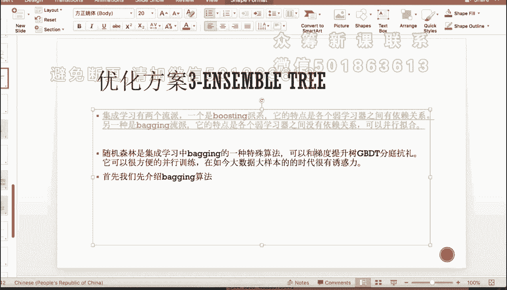

首先呢对于begging来说，这个是begging学习器的一个流程图，那么首先我们有M个训练样本，那我们对这M个样本呢，通过booth strapping，随机采样成不同的这个learning的数据集。

那称为呢样本及一到样本及T，那对每一个样本集呢，我们用decision tree，最难if的decision tree进行训练，得到这TT个不存在相互关系的这个弱学习器。

那我们把它再进行take average啊，线性的组合得到了一个强而学习器，那我们强调了在这个随机采样过程中，是采用BOOSTRAPPING的方法得到这N个随机的数据集。

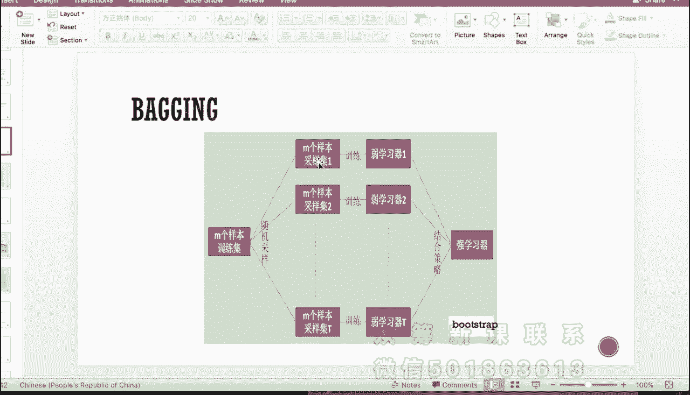

基于这些数据集我们进行训练，那这边呢是backing算法流程的一个文字表述，首先呢我们我们在得到这个最终的强分析之前，我们迭代呢大梯次，那对于每一次呢就第T次小梯次的随机采样，我们一共会采集M次。

那包含M个样本的这个采样集，我们称为大DT，那么我们利用这个大DT呢，训练DT个的这个弱学习器，称为GT，那么如果是分类算法，那么我们最终这个新的这个数据点，到底属于哪一类呢。

那我们就是由的T个弱学习器出的，Majority vote，比如说总共有十个这个弱学习器，那么我们这个新点放到这十个里面，它分别分类有两个是属于第一类的，那有八个是属于第二类的。

那通过我们jdity vote的这个理论呢，我们就认为它是属于第二类的，那如果是回归算法的话，我们就是把这T周弱学习器的回归结结，结果呢进行这个算术平均得到的平均值，我们就称为是最终的模型输出。

那么这是BEGGIN的一个表达式。

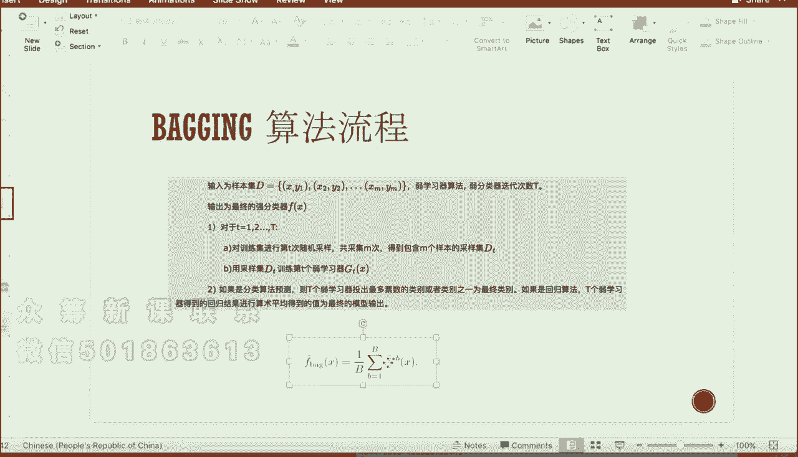

那对于random forest来说呃。

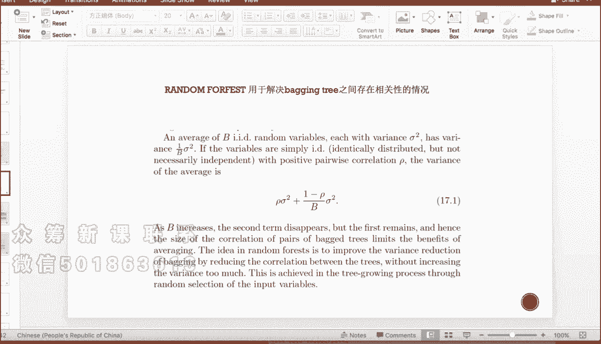

它对它比begging呢要好在哪里呢。

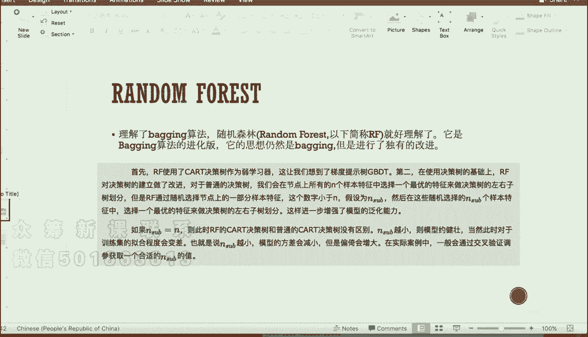

就是begging呢有一个问题是，当我的这些features，就是每一个tree之间是会存在相关性的，因为我这些XVARIABLE之间，可能相关性能会比较高，那我们假设他们的这个VRIVALS。

它们之间PAYWISEACCORRELATION，如果都是roll，因为便于计算，那么我们一整个的total的这个啊，variance呢就是这样子关于roll的一个线性组合。

那是roll西格玛方加上B是BING的次数，然后呢分分子呢是一减RO乘以西格玛方，那当我们发现，如果这个variable之间的相关度比较高，那跟线性回归的多重共线性是一样的。

那如果呢它的这个rival相关度比较高，我们会发现我们的这一整个variance的表达式，就趋于西格玛方，那这个就跟奶if的decision tree是一样的，variance了。

就说明我们的这个begging呢是失效的，那这个时候，如果当这些VRIVAL之间的相关性比较高，begging失效，那我们可以采用random first的方法。

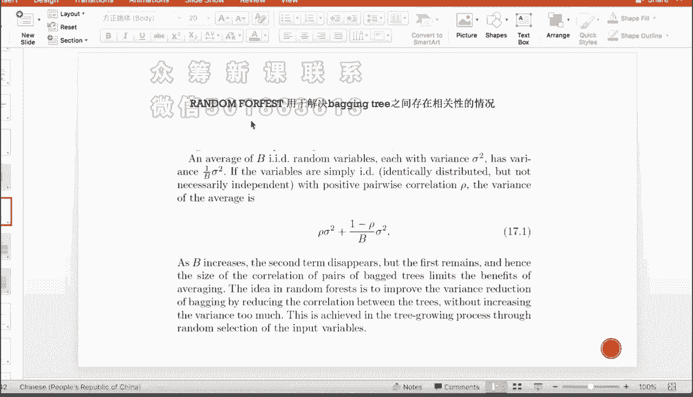

那random forest方法的思想呢，它依旧是begging的，但是呢他对begging有的改进在什么地方呢，就是在每一次的这个啊学习中。

我们呢我们在做这个naif的decision tree的时候，我们会把所有的x feature，都放在同一个层面上进行考虑，那random forest呢是在每一个节点，随机选择一部分的特征样本。

那这个数字呢比我们一整个feature，就x feature的维度要来的小，我们呢就称为是n sub feature，那这个feature是通过这个啊，等等概率的随机采样得到的。

那我们随机选择这n sub的样本特征中，我们再选出一个最优的特征，通过我们前面介绍过的这个in for game，就是maximum entropy的这个方法来选择。

决定这个决策树左右子指数划分的这个features，那so far and so forth，每个level都用一样的方式选取，直到我们达到了我们这个数的满足，比如说我们设定数的最最深深度为十。

或者我们设定了每一个note的分类，到的这个额点的个数呢要小于等于五等等，那如果当n sub刚好等于N的时候，它就是最正常的nave t，就跟正常的design train没有任何的区别。

那在实际的应用中呢，这个random forest的这个n sub到底取多大呢，是可以用这个cross validation嗯，配合网格搜索来选择一个最合适的n sub。

就是让我们这个比如说分类的均方物最小等等。

那这个loss function呢可以自己定义，那这里呢是我们上面讲到的这个呃，random forest的算法流程，那么它跟decision tree跟knife。

decision tree带begging呢是几乎一样的，唯一的区别，就是我们当得到这个DT的这个随机采样之后，我们啊考虑的这个样本特征是一部分的，那这一部分呢是通过随机选择，选择到的一个n sub啊。

来再来选择一个最优的特征，来做决策树的左右子指数的split，那第二步的这个就是分类或者是regression，如何做prediction呢，跟这个begging是一样的。

因为我们joyi vote或者是用算术平均。

那这个是我们对这个随机森林的总结，那么随机森林的主要优点呢，第一是它可以使它可以啊，跟begging有一样的好处，就是训练呢可以并行化，那么速度呢有一个很好的优势，第二是由于它这个节点划分特征。

但维度比较高的时候可以很高效的训练，因为他是选取一个subset来进行训练的，那么还有这一些就是比较好的特点，比如说由于随机采样，那么我们训练出的模型方差呢就会比较小，那原因呢我们在前面的这个表达式。

已经给大家展现了，那么所以呢它比相对于这个boosting来说，它的实现呢又更为简单，因为backing最后都是take average和majority vote，但是如果对于boosting的话。

那么对于不同的这个弱分类器结合起来，它们前面的这个weighted都是不一样的，那么还要通过计算，所以模型的复杂度就会比较高，那random forest同样有具有缺点。

比如说呢对于一些噪音比较大的样本的话，random forest比较容易呢过拟合，因为这个时候对于噪音大的情况下，这个random forest，它由于只考虑了一个比较小的样本subset。

那很容易陷入到某个局部最优的一个情况，那还有就是当这个取值划分比较多的这个呃，features的话，random forest会也会产生一个过拟合的情况。

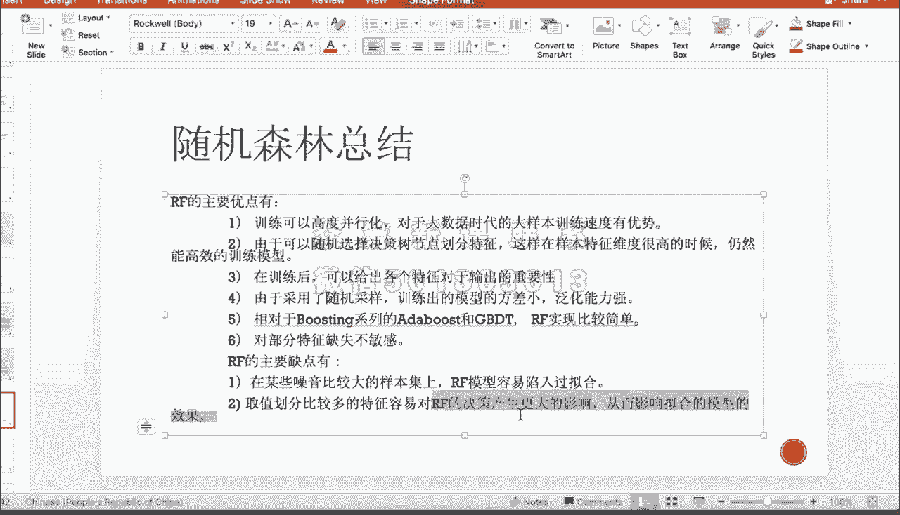

那么原因呢跟第一个啊比较类似，那接下来呢我们要引入这个boosting，那boosting的主要思路呢跟BING很类似，也是嗯得到一系列的这个弱学习器，那么它的主要区别呢是啊两个。

第一个是啊这个begging呢，它的每一个弱学习器，T1到TM之间都是不相关的，那么boosting的话嗯每一个T啊，这个嗯ix tx呢都是底片中ti减1X的。

那之后呢把这些如果分类器aggregate起来，那就不是简单的take一个average，和什么jity vote，那么他们前面呢都会有一个权重，就是阿尔法M的这个权重系数。

那呃对于这个boosting来说，由于我们每一个tree之间都是相关的，那么呢我们可以变为这个，但每一步的这个第一步，就是最正常的training sample。

那training到这个第一个呃model，那么由第一个model呢，我们可以对我们的这training sample进行prediction，那PREDATION之后呢，我们会计算我们的这个错分率。

那根据错分率呢，我们对每一个sample的weight就会进行进行调整，单比如说第一个数据点，它由这个T1X正确分类了，那么它的weighted就会变小，在第二步的时候，那如果是错分类了。

那么它的weighted就会变大，然后通过这些waited sample呢，再认领第二个的这个decision tree，那再进行这个错分率的这个weighted。

得到第三个so far and so forth，那之后的这个阿尔法M，也就是每一个弱分类器结合起来，这个阿尔法M呢跟什么是正相关的呢，跟这个total的这个错分率是正相关的，那么错分率越高呢。

那这个这它们对应的这个弱分类器的权重呢，也就会越小，那么boosting呢有主要两种啊，这个想法第一种呢是ada boost。

还有一种是这个gradient boost dance d decision，那他们俩的主要区别都是每一步迭代的时候，这个waited的计算就是额下降的，这个方向是有所区别的，那ada bot是定死的。

那gradient boosting的话，是根据这个梯度下降的方向来决定，我下一步的T就是这个弱分类器的一个变化的，slope应该是一个什么样的情况。

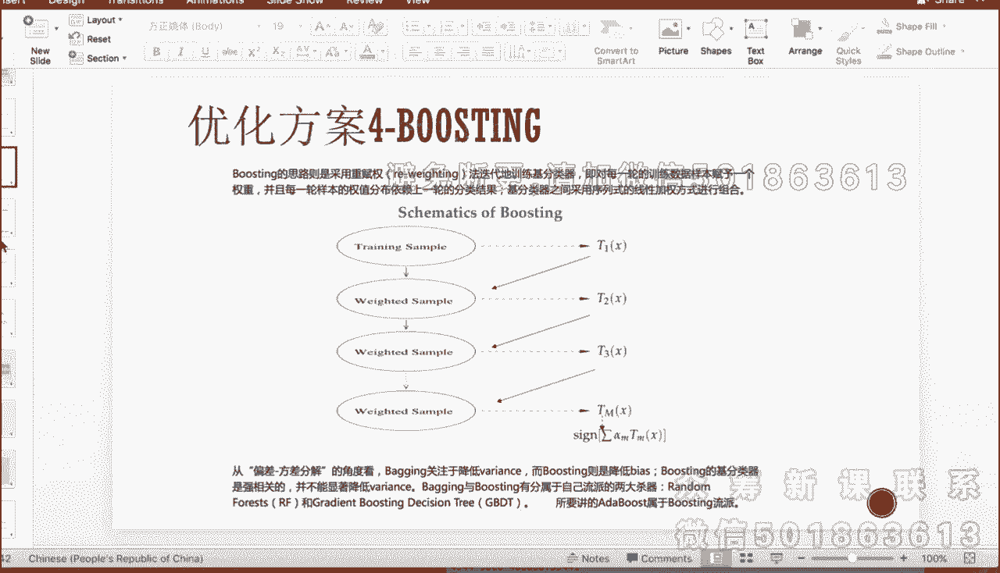

那这个的话是介绍的ada boost的一整个流程，那么嗯按照我们上面所说，每一步就我们这个FMX，也就是我们每一步的弱分类器，那是由上一步的弱分类器，加上呢这个阿尔法M乘以一个这个向前的这个。

step因子，那阿尔法M呢是跟这个我们的这个em相关的，那em呢就是我们上面提到的这个分类误差率，那我们可以看到呢，这个阿尔法M的分类误差率如果越高呢，那么我们新learning到的这个呃tree呢。

它的系数呢也就越高，那我们还要计算的是每一个因子，就训练因子呢，它在下一步还是会有一个相对的权重的，那么相对权重呢就是由啊这两个表达式给出，就是一个训练数据的这个全职分布，就是对于每一个数据点来说。

在DM加一步的时候，它前面应该乘以一个什么样的系数，那我们可以看到呢阿尔法M呃，阿尔法M呢就是上一步的这个错峰率，那我们可以看到这个错分率越高，那么他的这个权重呢就越小。

那么这个在intuition上也是很好理解的，因为如果你有本部就已经能够正确划分了，那么你这个数据点在下一步的时候，就不会被作为一个主要考虑因素，我们下一步主要考虑的是，被我们上一步错分的那些数据点。

那如果能在下一步的迭代中能够被优化，那么呢就是最好的。

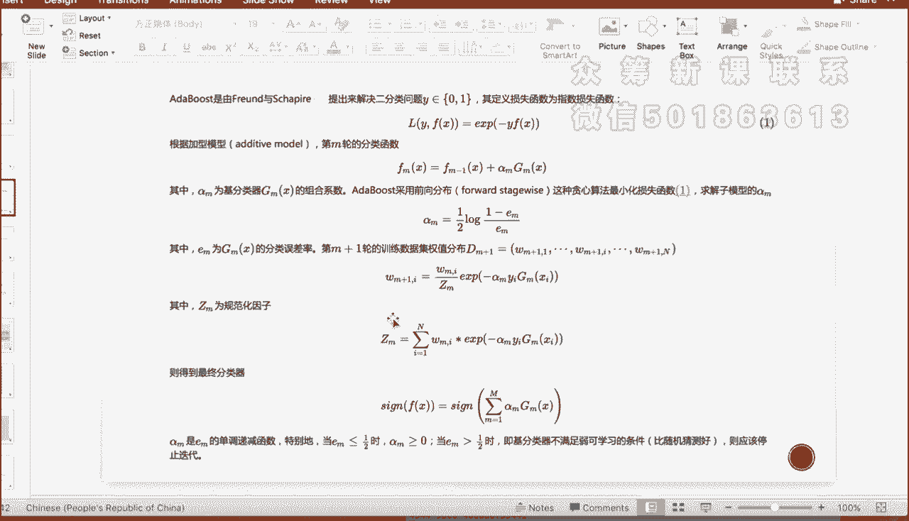

所以这是一个market intuition的一个想法，对于这个ada boost算法，那么这是ada boost的一个小结，也就是我们能够自适的调整样本的权值分布。

那么将错分的样本的权重呢呃设的比较高，那么对分队的样本呢设的权重比较低，所以呢称为adapted boosting，那么简称呢就是ada boost。

那下面呢我们会介绍这个梯度的boosting tree，那么梯度boosting tree跟它唯一的区别，就是我们这个下降和上升的这个权重呢，就不是由我们一个简单这个EXEXPONENTIAL的一个。

这样的一个方程决定的，那会由我们本身这个分类函数的一个梯度。

来进行决定，那ela boost呢其实有很多简称，像grading boosting啊，规定tree boosting啊等等等等，其实指的呢也都是同样的一种算法。

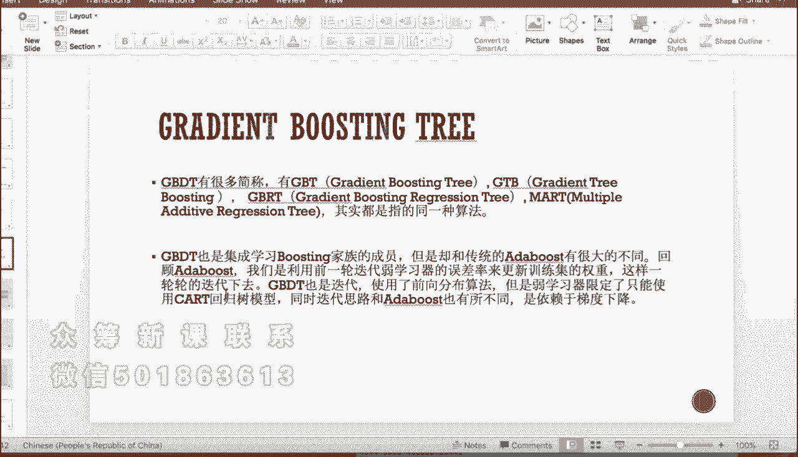

那这个呢是我们ada boost的一个呃，主要的思想的一个通俗的解释，因为艾拉PUTH的本身呢会比aggradient boost呢，会比ela boost稍微来的难理解一些，那么归根不浅的思想呢。

可以用最通俗的一个例子来解释，比如说我们假设一共有30岁，那我们要拟合他的这个年龄，让我们首先呢假设我不知道他多少岁，那我用我猜他一开始的时候是20岁，也就是我们X0第一个学习期是20。

那我们发现我们第一个学习心理学，得出来的结果跟真实值差了十岁，那这个时候呢我们的loss是ten years，那我们用剩下的，我们用六岁去拟合这个剩下的损失，那我们发现差距呢有四岁。

那么我们第二轮呢就用三岁去拟合剩下的差距，那么so far，So forth，直到这个差距等于零，那我们就结束呢我们的迭代，那每一步的这个比如说发现损失，lost ten years了。

那这个时候为什么是六呢，那发现差距是四，为什么，这个时候我们是用三岁来拟合剩下的差距呢，那这个六跟三其实都是每一步的这个loss的，这个GRA点，也就是梯度，那往梯度最陡的地方下降呢。

我就可以最快的达到我的最优化，所以这个是gradient boosting的一个想法，那这边呢是一个表达式，那这个RT i呢，其实也就是每一次它的这个loss function的这个，梯度方向。

那么我们确定了梯度方向之后，我们还要确定梯度的步长，就是我们有了一个方向，那我们要知道我们向这个方向走多远，那这个走多远呢，就由T就由这个CTI来决定，那走的远度呢是我这个范，我的这个上一步的学习器。

按照我这个梯度往下下降，那什么时候能让我的这个loss function最小，也就是我走的这个距离的长度，那每一次呢都learning到了这个呃CTI。

那我所有的这些ddecision tree function，aggregate起来之后呢，这个wait就是距离的累和，那我们就我们就使用这个CETI，那这个呢就是gradient。

boosting的一个一整个的流程，那我们在这里呢呃我们只是简单的介绍一下，那么对原理比较感兴趣的同学，可以具体的看这个slice，那如果不是特别关心的话，我们就主要看后面的应用过程。

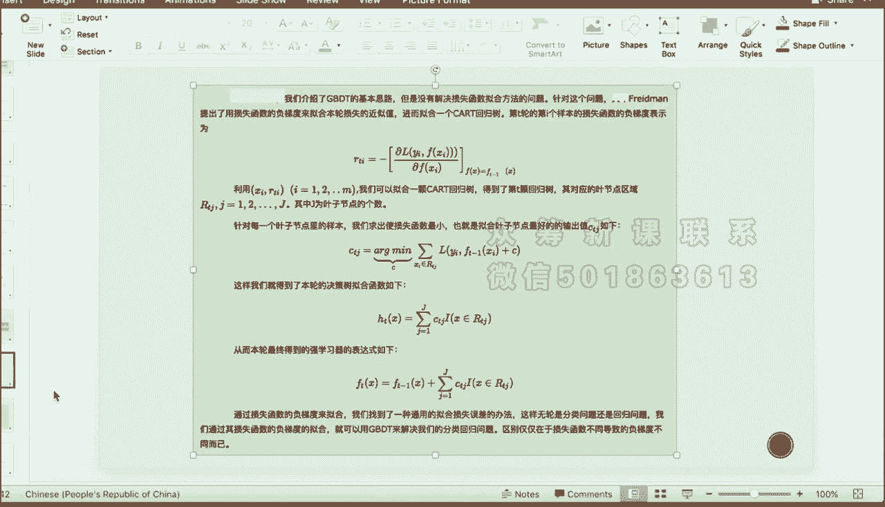

那这边呢我们要把这个规定boosting跟ela boost的，比较常用的损失函数放在这边。

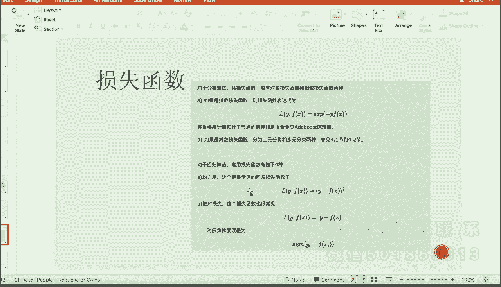

给大家做一个reference，那这个是VIDIANBOSTON的，这个主要的优缺点的小结，那么它的优点呢，是可以灵活的处理各种类型的数据，也不需要进行调仓，因为它都是它每一步的这个呃boosting。

也就是下降的，这个方向呢都是由理论计算得到的，那么呢它对这个损失函数呢也是比较robust的，对异常值也是比较robust的，那这个呢就是比random forest要来的好的。

因为random forest对噪音它是很不robust很敏感的，那么它的主要缺点呢，其实也是一整个boosting的主要缺点，也就是难以进行并行训练，因为我们提过它。

每一个tree之间呢都存在着依赖关系，那我们接下来简单的过一遍这个decision tree的代码。

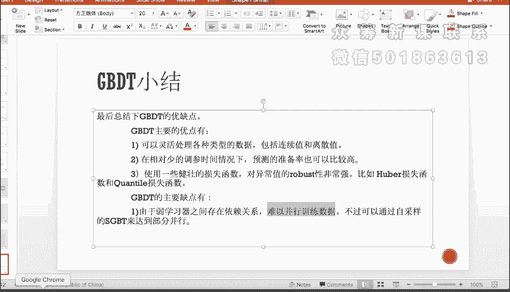

那呃我们这边做的呢是呃这个嗯我们有一条。

比如说stock的symbol，那这个symbol呢大家爱用什么，比如说用SMP啊，用apple apple啊，都是可以的，那么我们的features呢，我们就取他自己的本身的lg。

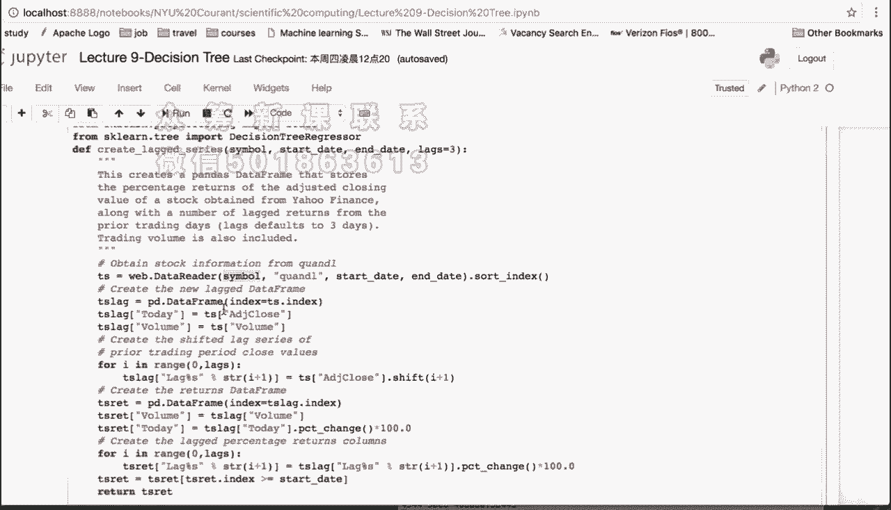

所以我们调用之前有提过这个create，lag series的这个函数。

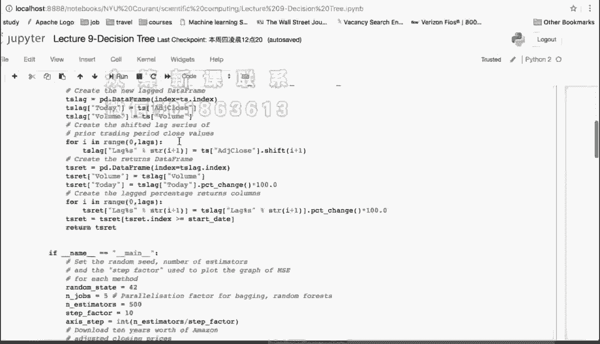

来得到我们本身的这个滞后项，那么得到之后项之后呢。

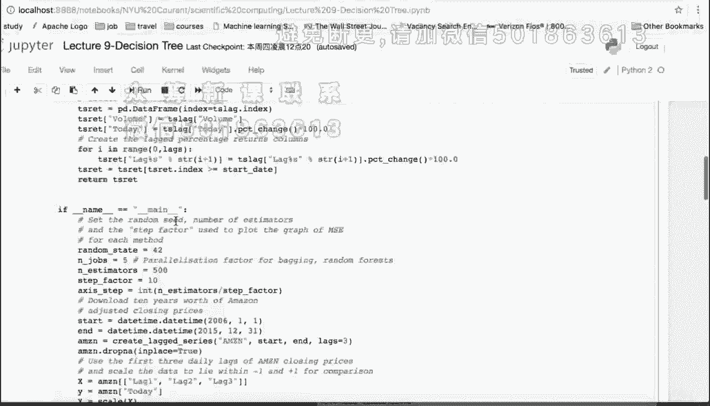

我们用我们用我们之前介绍的一些，这个像begging啊，random first啊，ada boost gradient boosting的方法了。

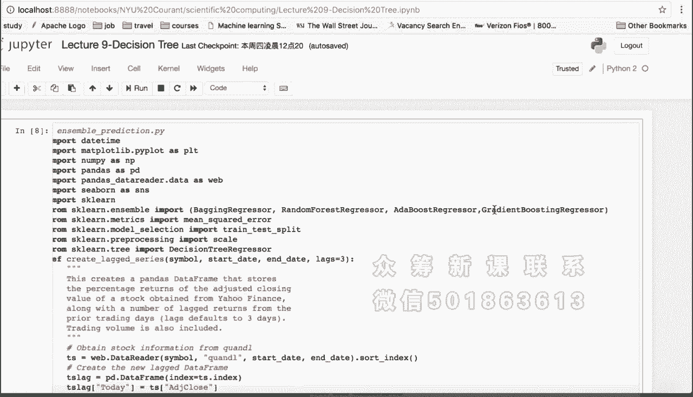

对他呢进行啊分类，那这边呢是这个begging regression的调用嗯，random forest的调用，然后ada boost调用更gradient boost的调用。

那我们我们采用的是这个tradeath and speed。

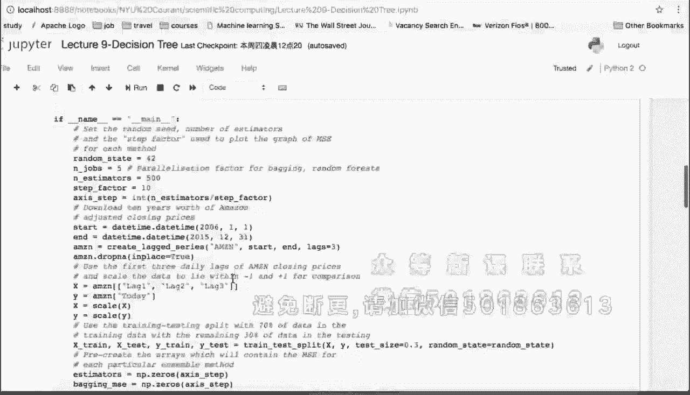

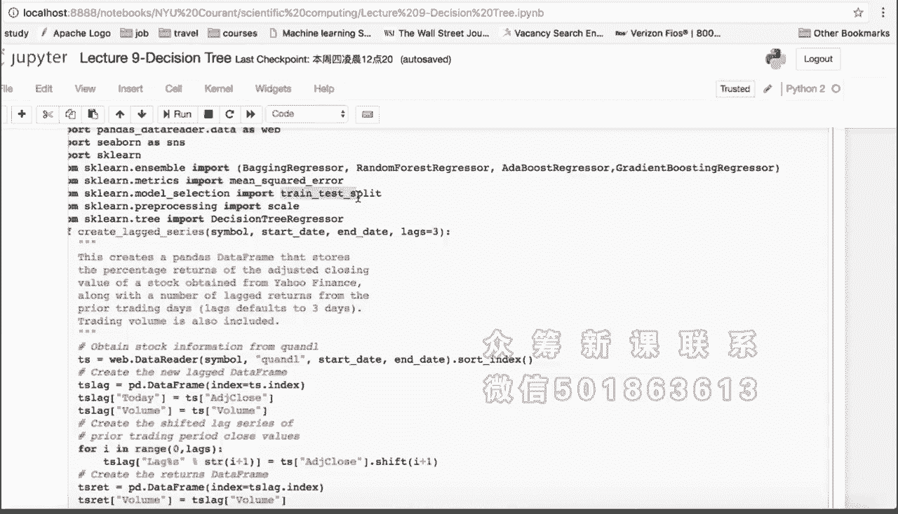

就是我们拿百分之比如说70%来train，那30%呢来test test之后呢。

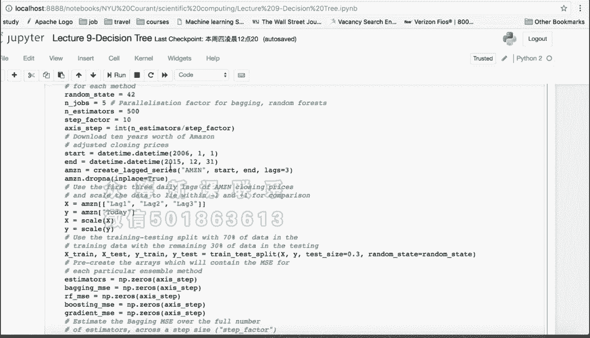

我们计算我们的test的MS。

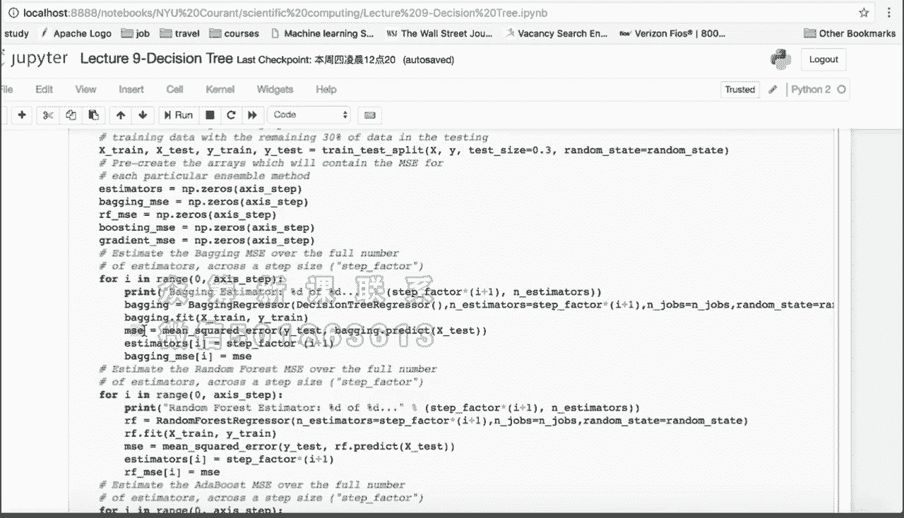

也就是total的均方误差，那么我们把我们的这个均方误差破出来。

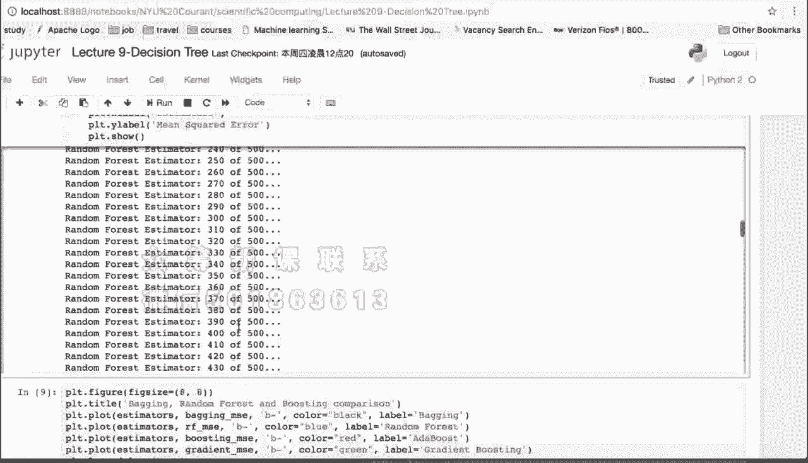

进行比较，那么呢这个是我们啊多少次的estimate之后的，我们的这个军方物的走势图，我们会发现，在这边呢gradient boosting的效果是最好的。

那么其次呢是这个beggin the random first，那这个ada boost的效果呢就不如他们来的好，那我们这边用的呢是这个啊amazon的这个例子，那么大家可以自己回去试一试。

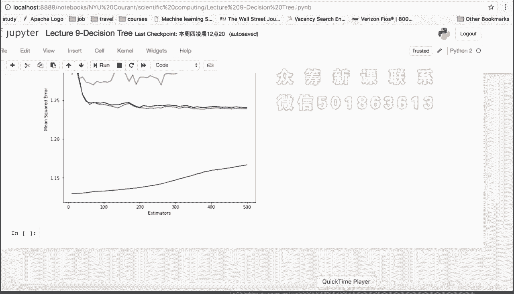