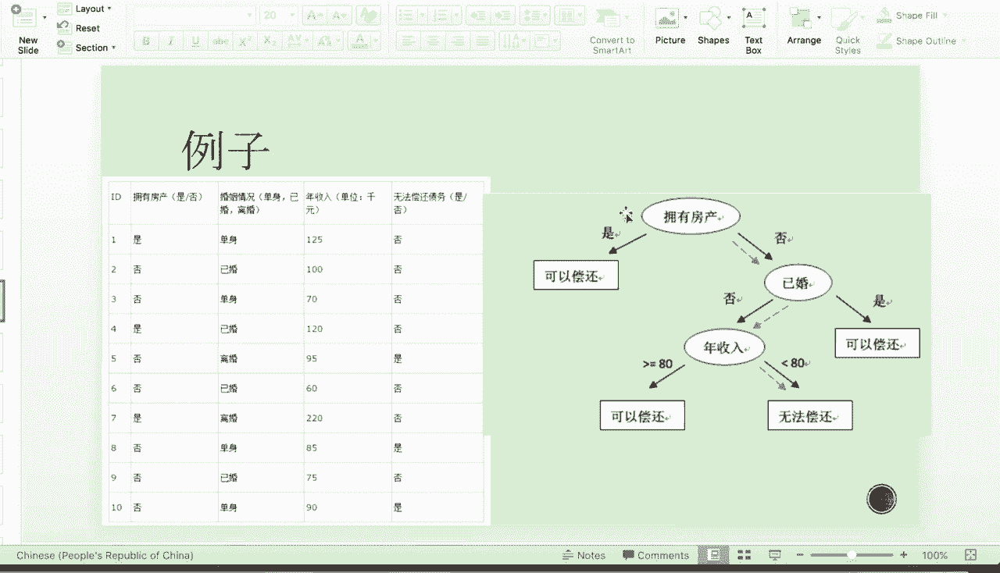
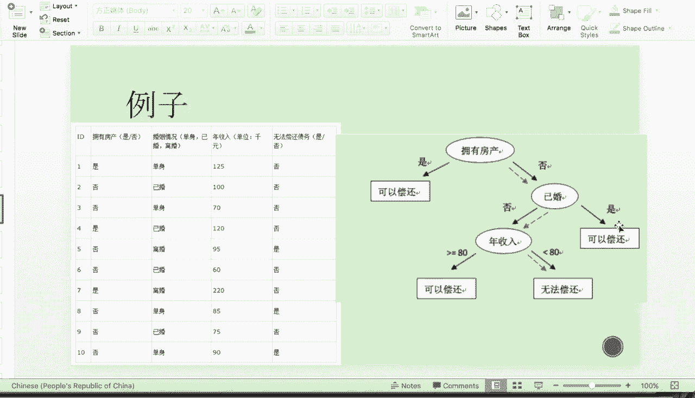
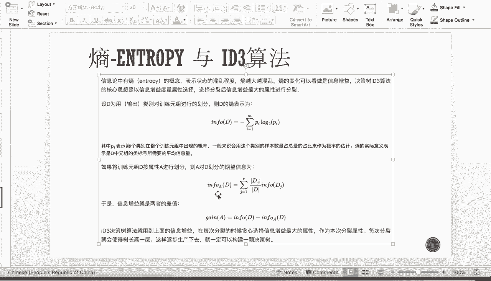
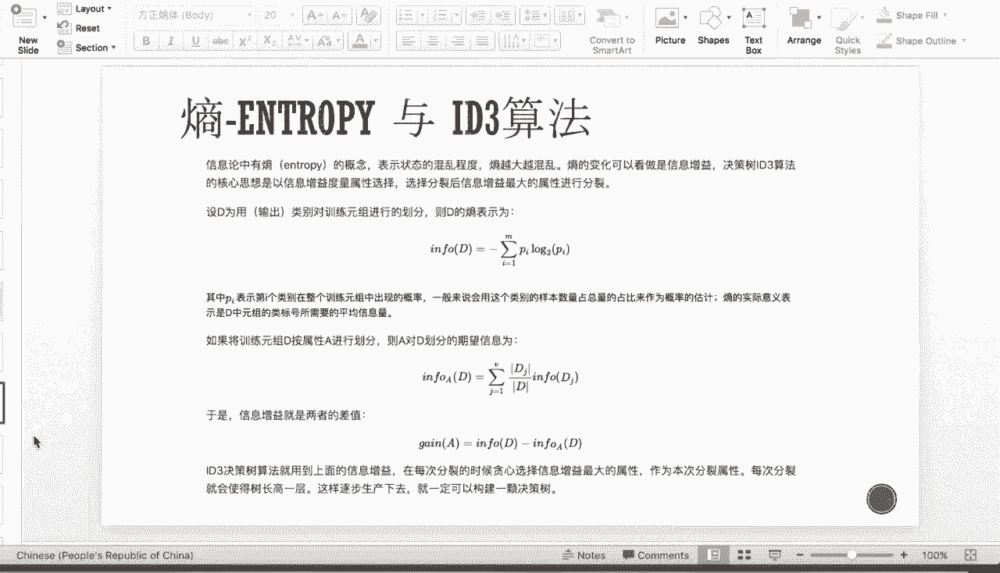
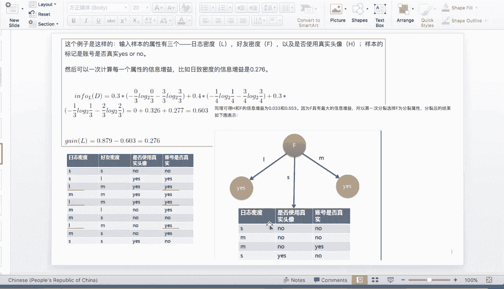
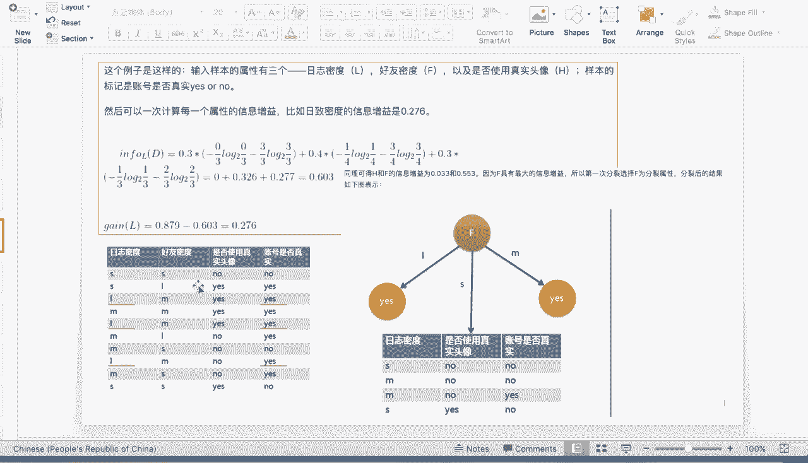
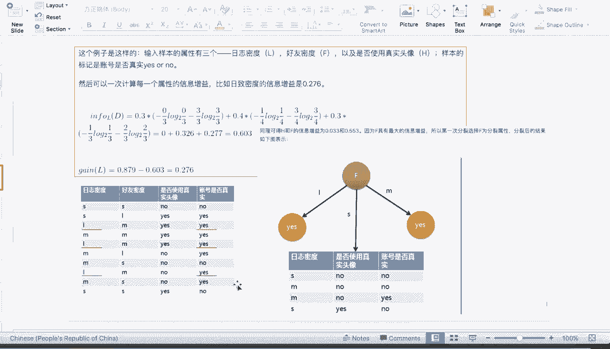
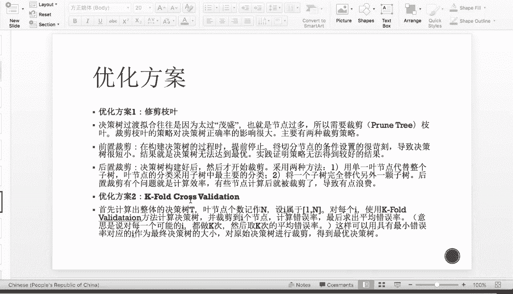

# 吹爆！这可能是B站最完整的（Python＋机器学习＋量化交易）实战教程了，花3小时就能从入门到精通，看完不信你还学不到东西！ - P18：第18节-决策树 - 凡人修AI - BV1Yx4y1E7LG

接下来介绍一下，在分类模型里面非常重要的一种啊，分类方法叫决策树，迪decision tree，那么迪decision tree顾名思义呢，它是一种树形结构，那么可以是二叉的，也可以是二叉以上的。

也就是以一个features spe出来的，可以有两个方向或者是两个方向以上，那么每个呢非叶节点呢就表示一个特征属性，那么特征属性，特征属性的每个分支呢，就代表这个特征属性在某个值域上的输出。

所以呢每个叶节点呢要存放着一种类别，或者叫一种属性，那么通过决策树呢，我们我们的决策就从我们的根节点开始，一步一步一步一步的往下，那么到每一个feature上的时候呢。

我们再通过这个feature的分类属性，进行进一步的split，直到我们的底端，这也就是我们的分类达到我们某一个阀值之后，我们将分类停止，那么决策树呢可以做回归，也可以做分类。

但是主要的呢是做分类数比较多，那么由于它能产生一个很直观的树形分支结构，所以呢，决策树比别的模型更具有直观性和解释性。

那让我们先来看一下一个决策树的例子，比如说这个时候我们想要通过啊婚姻状况，年收入和是否嗯拥有房产，来判断这个每一个人，哪一个对应的人是否有能力偿还债务。

那么这个在银行做credit嗯prediction的时候呢，是非常常用到的一种模模型，那么如果用树形图进行构造的话，那我们可以首先呢用利用是否拥有房产，作为第一个feature，那么是拥有房产呢。

他就可以偿还credit card，那么不是拥有房产的话呢，我们再看他是否已婚，那么已婚如果是已婚，那我们就默认这个人可能relatively比较有钱，那么他就可以这样还，那么如果是未婚的。

那将根据年收入是否超过8万块钱来划分，它是否可以偿还，那么构造出额如这个右图所示的决策树。

那我们来看一下决策树构造的一个理论，理论基础，首先呢决策树的每一层应该放什么feature。

比如说为什么第一层不放，是否已婚或者是年收入是否啊，跟这个8万块钱之间的关系，要犯拥有房产的。

也就是说我们如何决定啊，这个树形树形结构，每一层应该以什么feature来split，也就是这个分裂属性应该选为什么，那么分裂属性的定义呢，就是在某个节点处，按照某一个特征属性的不同划分。

来构造不同的分支，那我们的目标是什么呢，就像我们线性回归，我们有一个目标函数，那么目标函数呢就是我们的均方误差，那么对于决策树来说，我们的目标就是使每一个分裂子集尽可能的纯，就是purity。

所以我们希望我们分裂之后的节点，是成为一个pure point，或者叫做一个pure note，那呃尽可能存的意思呢，就是尽可能的让每一个分裂的子集中。

带分类的项目是属于同一类别的，比如说嗯，我们我们这一个点以拥有房产作为split，那split之后呢，我们希望我们拥有房产四，那我们剩下的这边是我全部都是可以偿还的，那么剩下这边呢再通过是否已婚。

能够非常完美的。

对我们的这个是否可以偿还债务，进行一个很好的分类，那么我们分类属性有三种不同的情况，第一种是前两种都是属性是离散值的，那是根据是否要求生成二叉树来进行划分，那还有一种是属性，如果是连续值的，像。

那我们就确定一个值作为一个分裂点，叫做sb point，那么按照大于SPPOINT。

也还是小于等于生成两个分支，比如说像上面的这个房产跟已婚，都是这个离散的，并且是binary的，那么这个年收入呢我们就是一个连续的，那我们就得根据找到一个speed point，称为80。

那么大于等于80，分为一类，小于80呢分为另外一类。

也就是没有任何回溯的，比如说我按照拥有房产分，分裂了之后呢。

之后就不会再用到这个属性了，所以它称为是一个greedy algorithm。

那我们要介绍这个决策树呢，就需要引入一个熵的概念，那么什么叫做熵呢，就是在信息论和这个物理学的一个热力学中，有这个entropy的概念，它表示的是我这个状态的混乱程度，那么我这个entropy越大呢。

就说明我这个信息越为混乱，那么熵的变化可以看作是一个信息争议，叫做in for game，那么我的信息增益越多，就说明我这个点的SP的效果呢越好，那么决策树的这个id注意算法的核心思想。

就是以信息增益度量作为一个属性抉择的，那我们先定义商，那商呢我们称为info，对于每一个那个训练的训练组，我们都可以算出他的inform呃，这个entropy。

那么entropy的表示呢是这个哪一个点的，这个probability，乘以它这个log的probability的这个呃负数，那么呢pi是表示第I个类别，在整个组训练组员中出现的概率。

那么一般呢都是用它占一整个训练组的这个，样本比率ratio来作为概率的估计，那么熵的实际意义呢，是这个第一元组中的类别标号，所需要的平均信息量，因为它是一个呃概率乘以一个log。

一个方选的一个一整个累和，所以呢称为概率也是很好理解的，那这个时候我们把不同的属性都拿来算这个，INFORGET来判断，我们这个时候这个level应该以谁进行划分，那么首先呢我们先计算这个A。

对于这个D的训练集作为划分的期望信息呢，就是这个info dj，也就是套用上面这个公式的DJ除以D，那么DE呢是这个我这一整个信息set有多大，那DJ呢是DJ属性，属于DJ的属性有多少个样本点。

那么这个时候我们来算信息增益，那信息增益呢就是两个熵的差值，那么对于每一个属性来说，信息争议越大，说明这个属性能够解释越多，我的这个善终的混乱就是解释了越多的信息。

那说明呢它分裂之后的这个point的pure也就是purity。

我们上面提到的，我们这个目的就是要让每一个分裂自己，尽可能的存，那么信息增益越大，说明我得到的分裂之后的点的纯度呢就会越高，那么我们的这个id three决算数算法呢，就用到了上面的信息增益。

也就是在每次分裂的时候，我们非常的贪心的选择啊，信息增益量最大的属性，那作为本次分裂的属性，那每次分裂之后呢，我们逐步的啊step iteration下去，那就构造了一棵决策树，直到我们的这个算法停止。

那我们这边来看一个我们这个信息增益的例子，信息增益计算的例子，那么我们呢想要检测我们的这个账号，就是比如说INSTAGRAM或者FACEBOOK或者是这个朋友圈，我们的这个嗯样本是否是真实的。

就是这个账号是否是一个机器账号，那这个时候有三个属性，一个是日志密度，一个是好友密度，还有个是否使用真实头像，而不是阿猫阿狗这样的，那么我们的Y需要分类的，就是我们的账号是否是真实的。

那比如说我们来计算每一个属性的信息增益，比如说现在我们来算这个认证密度的信息增益，那是怎么算的呢，首先第一个0。3就是嗯第一种feature，第一种feature呢是L也就是low日志的密度很低。

那么很低，因我们发现呢总共有十个点，那嗯d load呢占三个，所以是0。3乘以里面的是这个low的这个山，那漏的山就是对应的信息是否真实，那我们可以看到信息呢它全部对应的是真，那么假呢就是零。

那真就是33乘以log2的33，那么medium呢总共有四个，那么有四个，所以是0。4，那在这四个medium下面呢，我们可以看到对应的是一个NO跟三个yes，所以是这样的一个呃entropy的计算。

那么对于那个S来说，severe来说呢也是一样的算法，那最后把这三个加在一起就是0。603，那对于这个信息密度的信息增益量呢，就是我这个D的entropy是固定的，这个0。879。

那减去我们上面算到的这个日志密度的呃，这个info那得到的它的info game是0。276，那我们同理，我们可以得到是否使用真实头像更好，有密度的信息增益，那我们会发现这个F也就是好友密度的信息。

增益是最大的，所以我们的第一层的feature呢，我们选用啊这个F好友密度，那我们按照好友密度分成额，厚度密度也是三类FLM，那分成三类之后呢，is split之后的是三个级。

分别再算in forget，来看这个时候到底是认证密度，还是这个是否使用真实头像作为第二层level，直到我们的集合达到顶端。

不可以再划分为止，那么我们接下来要介绍的是。

我们这个呃决策树的停止条件和他的一些问题，那么停止条件呢，就是这个构造决策树的这个过程，我们到什么时候不再往下继续了，那我们上面提到的是。

像这只有三个feature，那我们不再继续，就是直到把三个feature都用完。

那么有时候当费选很多的时候，我们并不要全部用上，因为全部用上说的节点就会过多，我们就会导致过拟合的问题，这个linear regression feature选择太多是异曲同工的。

那这个时候另外一种可行的方法呢，是我们可以设置一个比较小的阀值，就停止分割。

比如说嗯，比如说，当我们认为在每一个这个数的底端的时候，那么我们的样本数大额比五，大于小于等于的时候呢，就说明不要再划分了，当有五个点在一个样本里，我们就认为我们的这个划分，就已经过于够充足了。

那这个时候呢我们就设阀值为五，那么到五之后我们的树就不再往下生长了。

那还有不同的别的阀值的设置的方法，那我们之后呢会介绍，然后现在介绍一下上面提到的这个，OVERFITTING的问题，那么其实是跟linear regression一样的，对于卷参数来说。

当全色素的高度越高，那么你这个决策树的古迹一定是越准确的，但这个时候由于你利用了太多的feature，就会导致我们这个数over fitting了不太准确，这个时候当我引入一个新的feature来说。

很有可能我的这个一整个树的结构，就会受此导致很大的干扰，嗯那么这是过渡拟合三个主要方面的问题，第一个就是这个噪音数据是我刚才提到的，如果训练数据中存在的噪音，那么以这些噪音作为分割。

那本身这个数呢就没有办法代表真实数据，而且也很脆弱，那缺少代表性的数据呢，也跟上面的这个噪音数据其实比较的像，那第三条呢是数更特有的，也就是这个多重比较问题，那么对于多重比较问题来说。

我就需要有很多的数来进行prediction，那这个时候呢当比如说只有十个预测分析师，我要预测这个股票涨还是跌，那么我预测它正确的概率呢是很低的，那么如果当有50个分析师的时候。

正确的概率就比较无限接近一比较高，但这个时候我不可能说建立这么多个的数，那么呃来得到一个这么大的一个，就是正确分分类的概率，所以我们要寻求别的方式来避免这个多重比较。

那么接下来我们会引入我们这个，树形图的优化方案，包括最简单的啊punching啊减脂，然后cross validation还包括advanced tree method。

