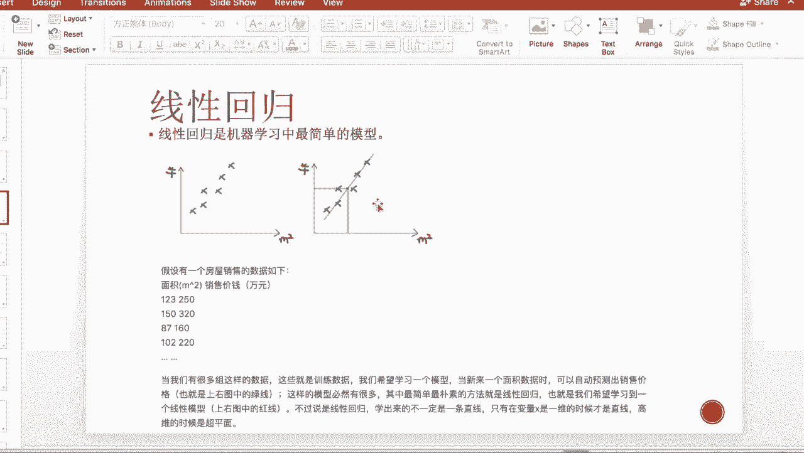

# 吹爆！这可能是B站最完整的（Python＋机器学习＋量化交易）实战教程了，花3小时就能从入门到精通，看完不信你还学不到东西！ - P19：第19节-线性回归 - 凡人修AI - BV1Yx4y1E7LG

那我们之前的关于时间序列，金融模型的介绍已经告一段落了，那么从啊第九节课，也就是从今天开始呢，让我们来进入另一块很重要的内容，也就是机器学习，那么我们今天介绍的是机器学习的第一块内容。

那首先呢本节课的大纲，第一我们会简要的介绍一下什么是机器学习嗯，第二块呢我们会介绍嗯，就是machine learning或者叫studisco learning，最简单的最那if的一种方法。

也就是线性回归，那么我们会根据啊by variance trade off和OVERFITTING，多重共线性等一些线性回归带来的问题，我们引入呢解决方法。

那么有一种就是shrinkage regression叫收缩回归，那么第三块内容呢我们介绍决策树，那么决策树在classification和regression上，都有非常重要的应用。

那么首先呢我们介绍这个信息论，也就是决策树构建的理论基础，是ENTROPHY和info game的方法，那么第二块呢我们介绍算法的优化，也就是当一颗角色处出现了某些问题的时候，我们应该如何优化这棵树。

那么第一种方法呢是这个减脂，让决策树变得更简单一些，那么防止over fitting，那么第二种方法呢是啊，一些advance的一些method，比如说begging啊，圭一，然后呢。

boosting就是嗯一些把一些弱的分类器合成强的，那么在begging里面呢，有一种特殊的或者也是非常重要的一种方法呢，就是啊random forest叫随机数模型。

那第四款呢我们会用Python对decision，tree和这些这几个advanced trade的这个method呢，进行一个implement，让大家体会一下呃，决策树在金融时间序列上的应用。

那么首先呢我们来介绍一下机器学习，那么机器学习呢主要是learning from data，也就是通过算法和input数据来学习，我们应该如何执行任务，比如说预测，比如说分类等等。

那么在过去的10年左右呢，这个机器学习在量化金融方面取得了很呃，一个big progress，那么像一些嗯，纽约贝斯的很有名的对冲基金公司，比如说TOC嘛，比如说低售。

那么他们呢已经建立了很完善的machine learning，甚至是deep learning和NLP的这个team，那么专门做algo trading的那嗯，经济学习算法可以适用于多种的量化问题。

那么我们举一个最简单的例子，比如说我们要预测未来资产价格的走势啊，或者是我们要预测这个基金就放着的，LIQUALITY性啊，或者是嗯比如说我们如果只看kindle graph的话。

那么比如说在5分钟之内，以每30秒作为一个candle，那总共就是有啊十个kindle，那么形成了一个一个一个曲线图，一个plot，那我们通过learning这个图像，就是kindle的这个图像。

我们来predict，那在未来5分钟之内，我们的图像会是一个什么样的情况，那么是up啊，还是flat啊，还是down啊，那我们来决定是否应该啊。

in the market或者s s in the market等等，那首先我们介绍一下线性回归，我们就拿最简单的一元线性回归，我们来举一个例子，首先呢如果我们要学习一个房屋销售。

就是说我们想predict，这房屋销售的面积跟这个售价之间的关系，那么就是一个最简单的一元信息回归，那么我们以面积作为我们的回归因子X，那售价呢就作为被回归因子。

我们叫啊dependent arrival，那么我们build的一个这个一元线性回归，也就是这些点穿过它们的一根线，那当我们有很多组这样的数据的时候，把这个称为训练数据，也是learning rate。

然而learning data，那我们通过这个learning data呢，当来了这个新的data point，就是一个新的数据面积的时候，我们可以自动预测出这个销售价格，有这个Y的值在什么位置。

那么最朴素的方法也是最直观的，那么就是线性回归我们就得到了，我们就通过这个learning啊，Training data，我们得到了这根红线，那么这个呢称为一元线性回归。

那么线性的意思其实并不一定是一根直线，那么在这个一维的就只有一个x input的时候，它确实是一根直线，那么如果是二维呢，它就是一个在三维空间内的一个平面，那我们把Y这个是一些数据点的三维的点。

我们投影到我们learning出来的这个线性平面上，嗯所以这个是线性的一个意思嗯，那么在高维的话，我们称我们learning出来的这个平面的。

是一个线性的超平面，那我们来定义一下这个线普通的这个线性回归，那么应该是一个什么样的理论表达式，那么呢它输出的是一个FXI，那它满足xi的线性组合，再加上一个截距项，如果我们把xi的第一个位置。

把截距项的一放入其中的话，那么我们直接可以简化成W的转置，也就是啊coefficient乘以呢，我们的input variable x嗯，那我们得到我们假设了这根回归线之后呢，我们应该如何学习呢。

我们得有一个target function，叫做学习的一个function，我们得有一个做回归的目的，那么我们在线性回归内，我们的目的是最小化我们的这个二次误差。

就是我们的这个拟合点跟这个真实点的平方差，的累和，那么取一个均值，所以我们把它称为是lisquare regression，或者称为一个二范数的，也就是norm two的loss function。

就是损失函数，那么大家在后面的做classification，包括呃很多，比如说decision tree，那么他们的loss function就不一定长这样了，比如说有时候是绝对值的。

有时候是SIGMOID的，就是带这个指数的，那么主要看的是，你这个是关注于是一个什么样的问题，那么对于线性回归来说呢，我们关注的问题，就是这些点投影到我这个分割平面的，和那个距离。

那么把这些和呃累合起来，也就是我们要最小化，我们的这个分到点到分割面的距离和，就是我做普通线性回归的一个目的，那么也非常的直观嗯，那么还有一个取二范数的平方范数的原因呢，是因为平方范数嗯。

求导跟求值呢都是有非常好的解析解的，那么如果是绝对值，就没有法求导了，对不对，而且如果是三次方等等的话，他就不但会考虑到举例，他还会把方向考虑进去，那么两个对家之后可能就会抵消掉。

那么也不是我们愿意看到的情况，那这个是一个一元线性回归，也就是只有一个input x就一个W是一维的，B是结局呃，结局项的这样的一个推导过程，那么对于高维的来说呢，其实也就是一个矩阵跟向量的计算。

那么我们不在我们不在啊，放我们的推导公式，那么最后的理论结果呢，就是这个我们得到的这个slope项呢，是这个X转置乘以X这个矩阵逆，然后乘以X转置Y，那么Y呢就是我的dependent。

arrival是一个列向量，那么X呢是M乘N的一个，我们把它叫做input啊，input向量，那么它每一行呢其实都是每一个数据点，那每一列呢其实是每一个features，就是每一个特征。

那么我们把X转置X乘以X这一整个矩阵，我们把它称为是design matrix，叫设计矩阵，那么我们在后面讲多重共线性的时候，还会提到这个矩阵，所以大家先记住我们的这个表达式，是这个设计矩阵的逆。

然后乘以X转置的Y，那我们在linear regression里面呢，有几个重要的假设，也就重要的assumption，当这些assumption不成立的时候，我们的线性回归本身是无效的。

所以当我们做一个线性回归模型之后，我们做完不是说regression好了，我们就把MOMODEL丢掉，丢在一边啊，我们必须对它进行检测，那么我们如何检测呢，也就是基于我们这五条假设。

我们得让我们的假设都pass了，才说明我的这个model是值得信赖的，那好我们看第一条，第一条的假设其实是其实是很难应付的，也就是我我必须满足一个这个线性的假设。

那么如果比如说这时候X跟Y的关系不是线性，是打平方的，那么你这个regression本身就不存，没有意义了，那么第二条假设是呢，我的这些sample，这些数据点必须是一个随机的在空间中分布的。

而且分布的越稀疏，越散射越好，那是为什么呢，就大家想一个想象一个极端的情况，也就这些点它都不动，嗯就是说noise是为零，那么这不是所有的数据点都集在一个点上了，那这个样子的话，你只有一个点。

你能够扔你一条线吗，不可能对不对，那如果当维度更高，就是input x的维度就有更多的features的话，那么你就希望我的这个点在空间中，尽可能的能够弥漫在一整个空间。

那你这样learning出来的超平面才具有代表性，那么第三个的话是这个mu的话，是我们后面的这个noise项，也就是一个满足高零一标准正态呃，零西格玛方一个正态分布的一个扰动向。

那这么这个劳动下的均值得是零，这个也非常好理解，就是我build出来了一个regression的线，那么啊Y的点呢应该均匀的在这个Y呃，在这根regression线的上下进行分布。

像我们上面这样子体现的，那么我希望其实噪音呢，就是每一个点到我这个超平面的这个距离，那么我希望的这些噪音呢，它的均值就是take expectation是零啊，那还有一条呢是我的这个噪音呢。

它本身的VANCE得是一个常数，就如果不是一个常数的话，那我这个regression的话是E方差的，那么如果它的方差是有E的的话，那我这个learning出来的这个Y。

我就没有办法对它做一个confidence level了，也就是说当如果方差不一定的时候，比如说这一块的X，而这一块的X我的这些点如果方差很小，就离我这个平面很近，那很远的时候呢，那呃在这个位置的时候。

比如说那方差特别大，那就离它很高，但是我expect我的这个confidence level，得是在我这个平面的上下平行的两个等距平面，因为我们linuaggression estimate出来的。

这个西格玛是一个常数，那这样的平面，我说诶我有95%的信心，我我的这些点真实分布的点，在我以我这个超真正的超平面为中心，上下两个这个管内啊，这样子分布，那如果你的这个方差是异方差的话。

那这个管的形状你就没有办法界定了，你就没有办法estimate，我的这个置信区间就confidence level就失效了，所以说我们也得满足这个第五条的假设，那当我们满足这些假设的时候呢。

我们就有如下的结论，第一项是当我们做这个呃，最小二乘线性回归的时候，我们的这个我们的这个OLSSIMATION，是无偏估计，那么为什么是无偏的呢，其实是通过推导，也就是expectation呃。

括号这个贝塔以hat他的take一个期望，它刚刚好是等于贝塔，那么推导的时候呢，需要用到这几个结论，就比如说条件均值是零和条件，还有它跟X之间是不相关的，那么还有一个呃结论是呢。

就是说这个啊在这个假设下呀，这个variance是可以被estimate出来的，于是我上面提到过的，能estimate一个固定的variance，我才能够得到上下的这个固定的平，行的置信区间。

那么还有一条还有两条结论呢，是第一个是这个us square，就是应该叫做拟合优度，就是拟合优度是什么呢，拟合优度是一减去SSR除以SST，SST是一个total variance，是与生俱来。

它不会改变的是一个定值，那SSR呢是residual sum，也就是上面的这个啊，这个的和也就是这个东西越大，说明我的误差也就越大，那么反过来呢也就是这个东西越越小，那么就越靠近于一。

所以你和优度越近近于一，说明我的这个线性回归本身啊，回归效果是越好的，那么下面还有一个这个结论，那么这个推导呢是用到这个统计，T分布的一个知识，它的它隐含的意思就是，他你我们的这个贝塔的古迹啊。

减去真实值除以这个样本误差呢，它是满足一个T分布，那么这个结论呢是用在做假设检验的情况下，就是检验我的这个贝塔是否显著，什么叫是否显著呢，就它是否会显著等于零，如果它显著等于零了。

说明我的这个因子贝塔一对应的因子，比如说刚刚好是s m p five hundred，说明s m p five hundred着，这个X因子没有什么意义，那么在之后的regression。

你就可以考虑把它给去掉，所以我们会做一个这样的significant test，那么在Python包括R里面的regression里面，就会有一个很重要的一个包，就是每一个我们之前的课期也看到过。

就是每一个因子啊，它的对应的口EFFICI是多少，那么它的confidence是level对应的是多少，那么P值对应的是多少，那我们当我们看到P值越小就越近于零的时候，说明它越显著的不等于零。

那这个时候就说明我的这个因子是有效的，那它如果比比如说比如说比较大，比如说0。3啊等等等等，或者甚至0。8这样的，说明我这个因子几乎接近于零了，那么之后就可以考虑把它给remove掉。

那还有一点比较重要的结果是，为了引入后面的多重共线性，包括bias and variance trade off，就是我estimate出来每一个值，每一个coefficient的值。

我不但需要关注它是否是无偏，也就是它的均值是否是真实值，我还要我还要注意考虑它的方差，那么方差大呢说明什么情况呢，说明比如说今天我用，今天包括之前的这500个点，就两年内的点。

我estimate出来一个regression线是呃SMP，关于黄金的，我想要预测黄金，那这个时候呢比如说贝塔15S没出来是二，那如果他的variance特别大，那意味着什么呢。

意味着可能明天我再run一次regression，我我新加了一个数据点进去，那这个时候我的贝塔head variance是巨高，那这个时候可能它就从二变成了比如说50，那这个时候就有一个很大的危害。

因为我的这个贝塔的变化特别的大，就导致我每天都得进仓或者是出仓，就得要要一直有很大的换手率，那我们不希望有很高的换手率，所以希望我的这个模型它比较稳定，不要受太多的这个外界干扰。

它的violence要小一些，所以这个时候我们还要考虑我们estimate出来的，这些coefficient的放差，或者我们称为通俗的说叫误差，到底是一个什么样的情况，那它的表达式呢是西格玛方。

那西格玛方是我们噪声项的误差，这个误差是不可改变的，那么除以的是STJ乘以一个1-2G方，那SSTJ是什么意思呢，是我这个贝塔这对应的那个input x，他自己的方差是total的，方差是多少。

也就是我这一维度，它本身这些X点的离散程度，它的离散程度越高，就是就能使我的这个方差越小，那这个如何理解呢，也就是比如说我在s m p five hundred data是X1。

那这些X1如果都坨在一个点内，那是不是我的这个input，X本身不是太具有代表性，那这个时候当我出现了一个新的点，这些点离你这些原来的特别集中的，都打在八环九环里的点特别偏，比如说达到一环了。

那等到一环了，你本身没有学过，没有learning过这个数据，那把它放进来，你的模型就很难handle它，所以你就导致了我的模型会会受这些input，新的input点的影响，所以这个是这个理解。

那么这个RJ方呢是什么呢，是你这个维的variable x j呃，Based on，别的剩余的这些X做一个regression，也就是说如果你这个regression的效果越好。

说明你这个维度越能被别的维度解释，那就说明你这个维度越脆弱，越meaningless，那你一减去这个J的平方，就是你能被别人解释的越好，你这个维度自己本身的口语，FESSION的方差也就越大了。

所以这个是一个方差这个解释，那么后面我们会用到。

