# 吹爆！这可能是B站最完整的（Python＋机器学习＋量化交易）实战教程了，花3小时就能从入门到精通，看完不信你还学不到东西！ - P20：第20节-SVM 和交叉验证的模型选择 - 凡人修AI - BV1Yx4y1E7LG

接下来让我们来介绍这个非常重要的知识，向量机，那么SVM呢一开始只是一个二元的分类算法，那么对于线性分类和非线性分类都支持，那么非线性分类呢是由线性分类，那么我们经过呢后续的演进。

现在也可以支持多元分类，那同时呢经过进一步的扩展，也可以用于回归问题，所以支持向量机呢，可以用于我们machine learning的任何问题，经过呢这一系列的扩展算法。

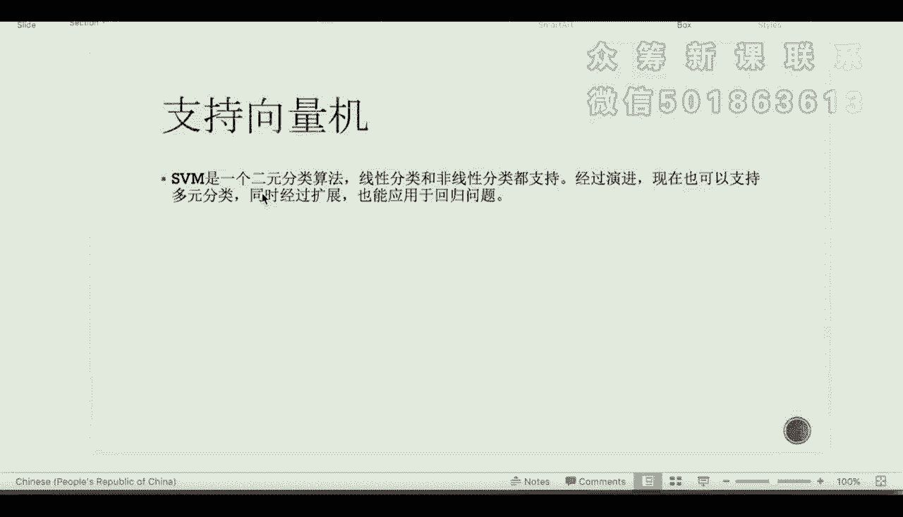

那么首先呢先让我们来简单地感受一下，这个啊分类超平面，那么这个线性的感知机模型呢，其实是找到一条直线，能够如果我们做的是二分类的话，那就是能够把这个二元数据隔离开，那么放到三维或者是更高的维度下呢。

那感知基因就是找到一个超平面，然后把所有的这些二元的点进行分开，那么对于线性感增肌来说，我们把这个超平面定为这个W转置，乘以X加B等于零，那如果X2维的，那就是一个平面，一维的就是一根线。

那三维的甚至以上的就称为是一个超平面，那么如这个下图所示呢，在这个超平面的上方，我们就定义Y等于一，在这个超平面的下方呢，我们就定义Y等于一，所以这是一个二元分类，那啊通过这个定义呢。

我们找到了这样的一根线，那么在这根线的上方就是Y等于一类，在这个下方呢等于Y等于一类，大家可以看到，其实能满足这样条件的这根线其实非常多，就是嗯比如说它然后平移下来一点，或者是绕着这个点进行一点。

适当的旋转都是可以的，那这样的话我们没有办法得到一个唯一解，那我们可以尝试思考这么多的分类，超平面哪一个是最好的呢，或者说哪一个的robust的能力是最强的呢，那我们引入我们先引入这个最大化。

margin的这个思想。

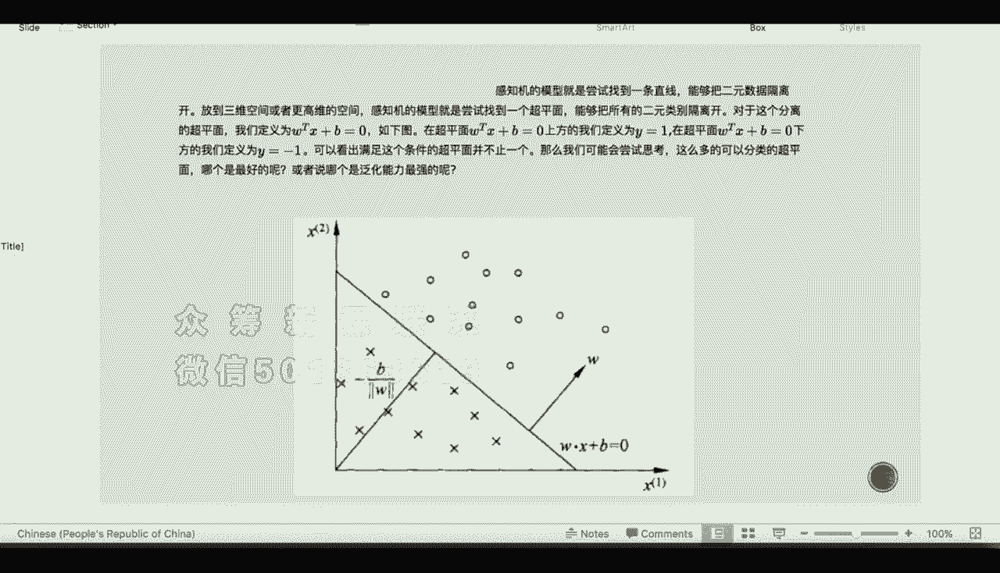

那么首先呢在介绍这个SVM跟损失函数之前，我们来介绍什么叫做margin，或什么说叫做几何距离，那么我们在固定这个超平面，我们假设我们已经得到了这个长平面，W转置乘以X加B等于零。

那这个时候呢我们有一个在它外置位的一个点，那我们要计算这个点到这个超平面的距离，如何计算呢，那也就是这个点乘以，这个把X带入的这个表达式，那么这个呢其实是我们在呃，做归一化之前的一个距离。

那真正的这个几何距离呢，还要除以我们这个线前面的这个，方向的这个模长，那也就是Y乘以W转置，X加B除以W的这个二范数，那么这个公式呢，在任何的一本解析几何里面都会介绍，也就是计算点到直线的距离。

而这个距离呢是带方向的，也就是说如果Y跟这个同号的话，那么这个距离是正的，那Y跟里面这是异号的话呢，那方向呢就是负的，那么这个呃几何间隔呢就是点到超平面的，带方向的，或者我们叫做带符号的真正的距离。

那么在我们的这个SBM利用到的这个距离呢。

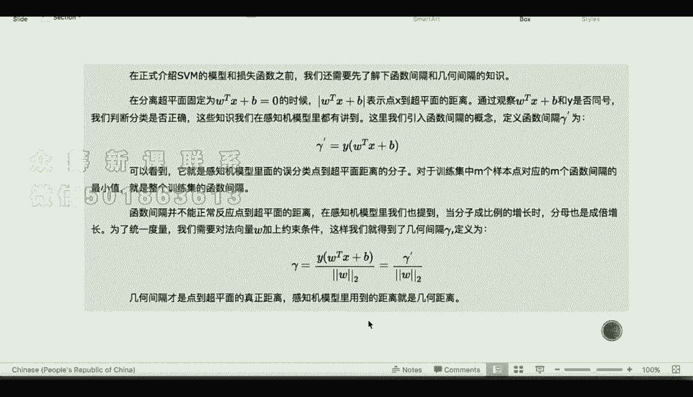

就是几何距离，在我们的这个支持向量机中，我们一开始引入最大化margin这样的一个想法，那最大化margin的意思就是我们要最大化这些点，到我们最后定义出来的这个超平面。

或者叫做decision boundary分割线的距离啊，使得它们是最大化的，那么这有一个什么好处呢，就是我们在优化的同时呢，希望所有的点都离超平面的远，那这样的话离得很远，说明不但被正确分类。

而且我有一定的信心，但这些点存在着一些扰动的时候，仍然不会跨过我的这个分类的帮助，那么这个时候呢真正离超频片比较远的点，我们是不care的，我们就可以离超平面最近的点，那么最近的点到它的距离。

把它最远化，那么这个就是我们求得的这个maximum margin，算出来的这个分类超平面，那这个时候我们可以看到，比如说在这两根虚线上呢，都是离我这个超平面最近的点了，那刚刚好落在我的这个虚线上。

也就是margin是最小的，这个点呢我们把它称为是支持向量。

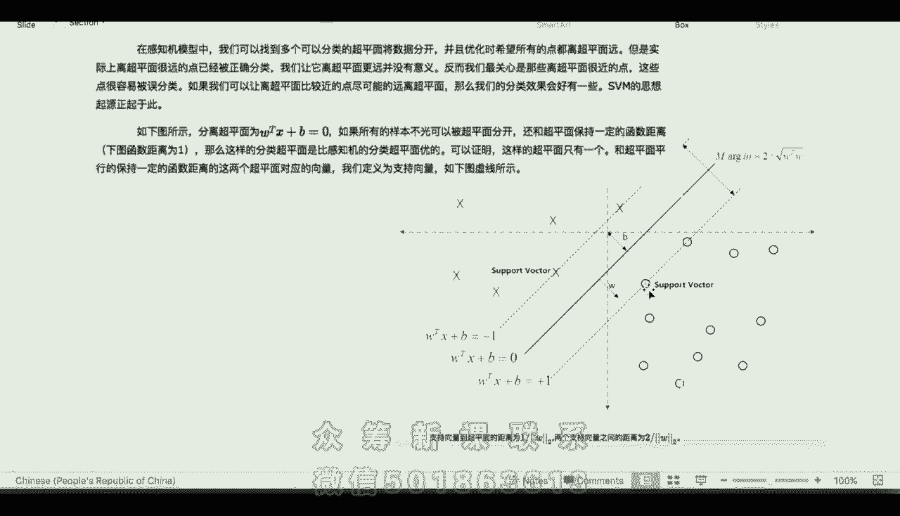

那这个时候我们有了我们的几何距离，那我们就得定义我们的损失函数了，我们的损失函数呢的思想呢是，让所有被误分类的点啊，到超平面的距离最小化，那么呃通过我们上面介绍过的这个mar呃，距就是几何距离。

也叫做geographic啊，Margin，那么是如下的一个表达式，那么这些的累和呢，我们希望它最小化，那么我们如果假设了，这个我们的这个距离是已经被归一化的，也就是说分母如果等于一的话。

那我们的损失函数呢就是如下式所表示。

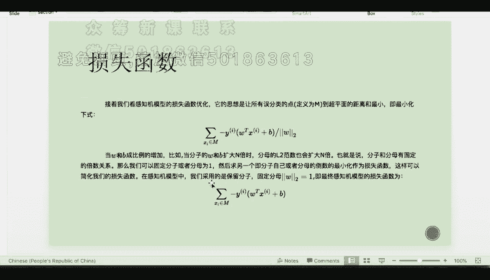

那我们把这个SBM写成一个带constrain的，最优化表达式，也就是我们要maximize mart最小化的margin，那这个margin呢定义为就是这样的一个表达式。

那么我们还要满足所有的这些点呢，它们的距离都要大于等于我们上面的这个margin，也就是最小化的margin，把它最大化这样的一个呃说法，把它转换成数学公式，那如果我们要呃。

简化我们上面的这个的表达式的话，我们可以我们可以认为啊，如果说这些函数间隔都取一，那我们的优化函数就是如下如下式所示，那这个时候呢如果把这个呃导数的最优化，其实也最大化，其实也就等于它本身自己的最小化。

所以SBEM的优化函数呢就写成如下所示，那么这个表达式呢其实非常像带这个不等式，constrain的一个啊线性linear regression，因为linear regression的时候。

其实也是最小化这个均方物的二范数，那么在这边呢，最小化的是这个被归一化的这个几何距离，这个的具体每一步的推导呢，我们这边不细说，那么同学们在课下的时候，可以具体的看这边的这个slice。

只要大家记住SBM的想法，就是我们要求最大化最小的只有match的距离，所以是一个due的一个optimization的一个过程，那么我们来解上市的这个最优化的算式。

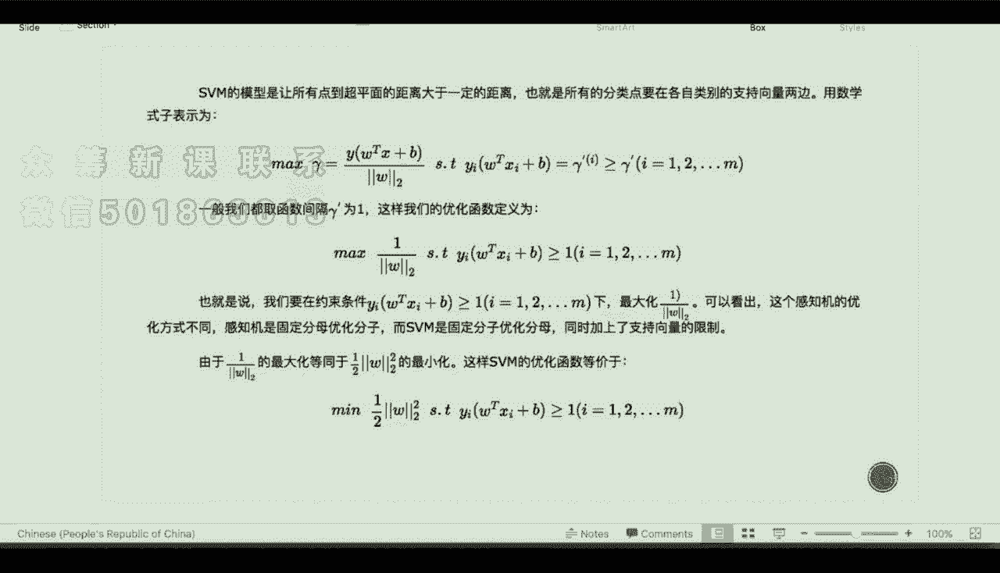

那使用的是这个拉格朗日乘积法。

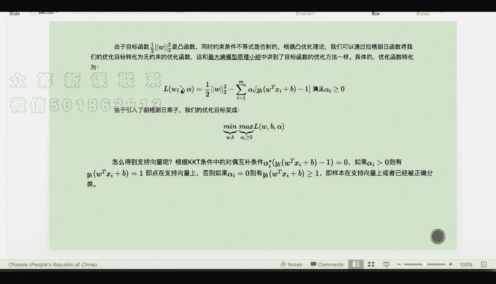

也就是我们的目标函数减去我们的这个CONSTRA。

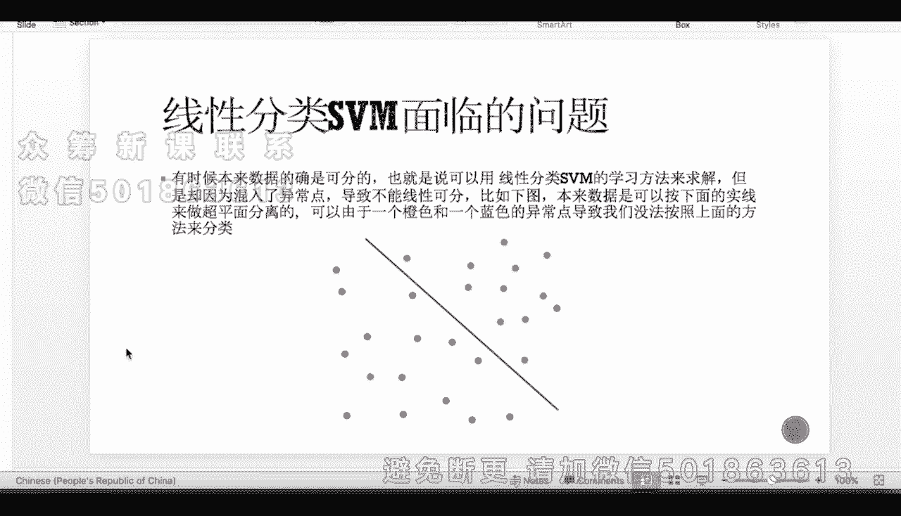

Constru，阿尔法乘以这个CONSTR。

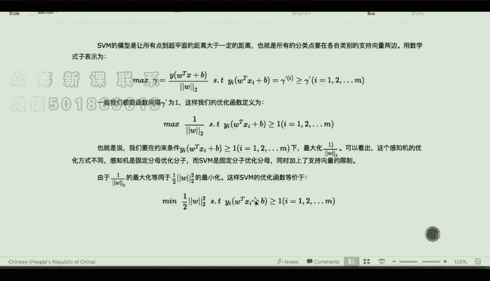

那把一移过去，那就得到如下的表达式，那我们的优化目标呢就变成优化如下，这个拉格朗日乘积，那我们通过上面的算式可以看到，我们如何得到支持向量呢，其实根据KKT条件中的这个对偶互补。

我们可以得到一个阿尔法乘以，上面这个表达式必须等于零的结果，那我们来分析我们这个式子，如果阿尔法大于零的话，那说明要使这个式子等于零，里面的这些式子就必须等于零，那里面这个YI乘以W转置X加B等于一。

表示的是什么呢，其实表示的就是X，这个点，刚刚好就在我们的这个图片上的这两根虚线上。

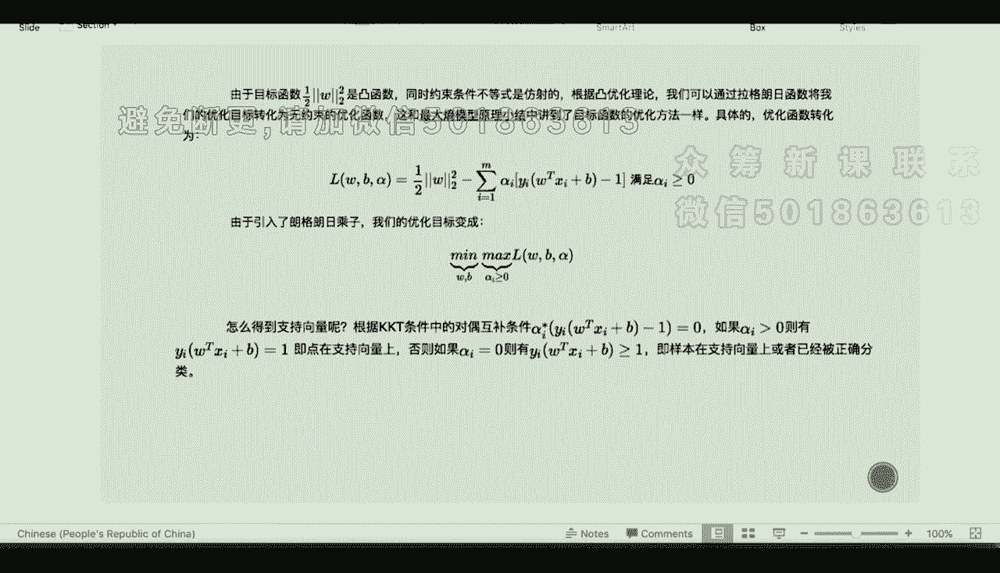

因为这边是W转置加B的绝对值。

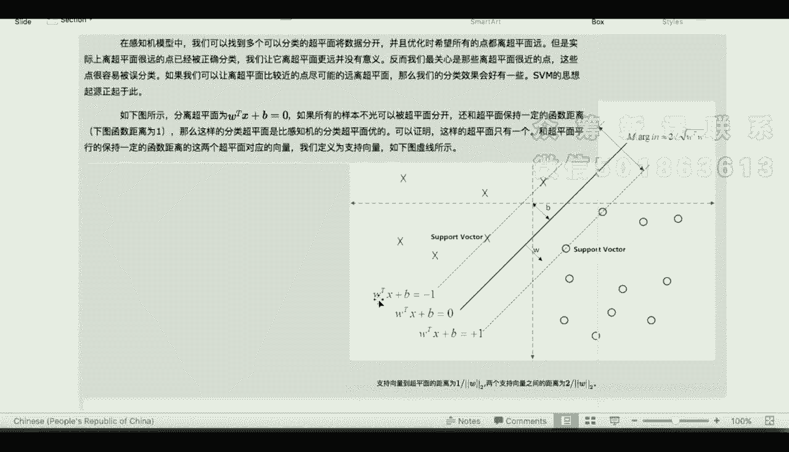

其实是等于正一的，所以如果阿尔法大于零，那就说明我的这个点在支持向量上，那这是什么意思呢，阿尔法大于零，说明我这个点是真正参与了，我们最后回归出来的这个W的计算的，那如果说里面的这个式子大于等于一。

也就说明这些点其实不是支持向量。

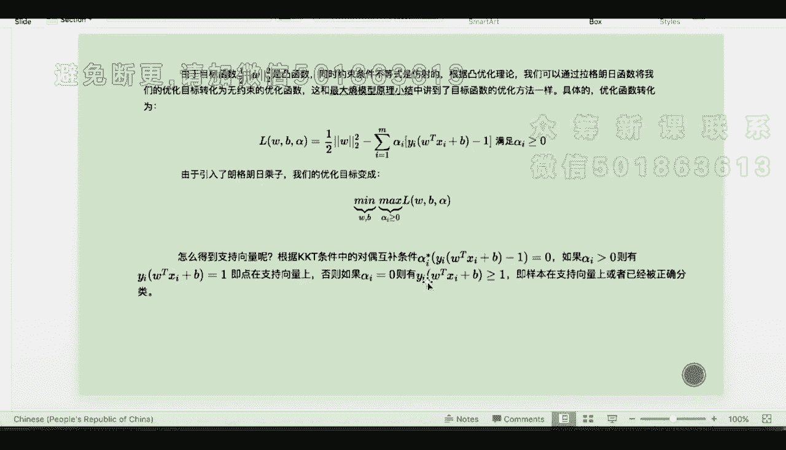

就说明它在这两个虚线围成的，伊普斯龙管以外的。

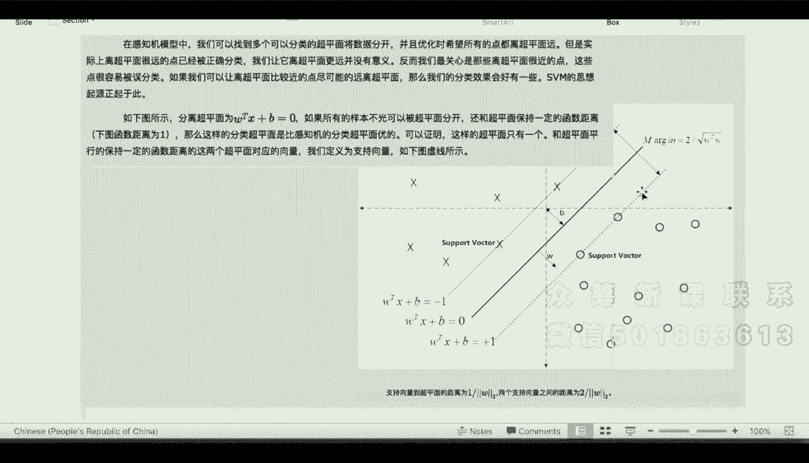

那么这些点呢是被完美的划分了，但是他们的点并不参与WW转置本身，这个coefficient的计算，也就是说，支持向量机其实是一个很有趣的计算过程。

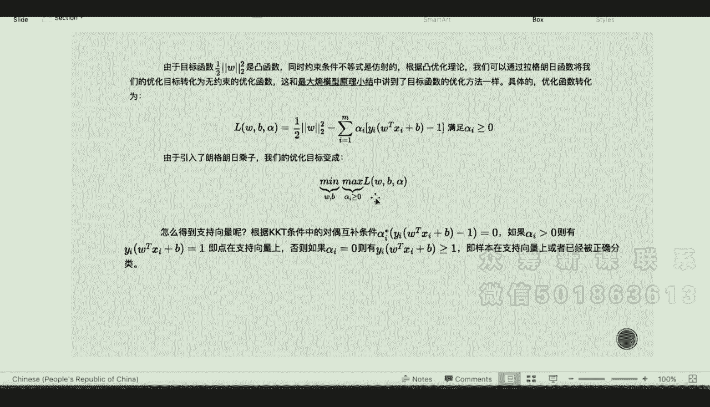

他那些被正确分类的点呢虽然是很优秀的点，但是他们本身不参与支持向量，支持向量机这些参数的拟合，真正参与参数拟合的点是刚刚好落在这个ins，农管很容易被错分的这些点，那我们把这些点呢称为支持向量。

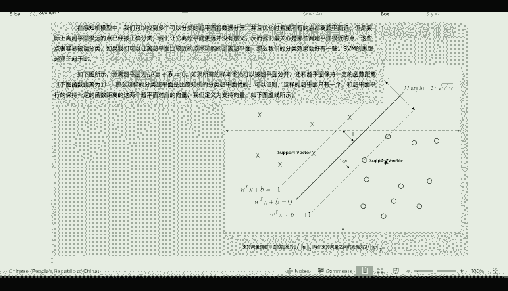

所以这个是支持向量的向量积的这个名字由来。

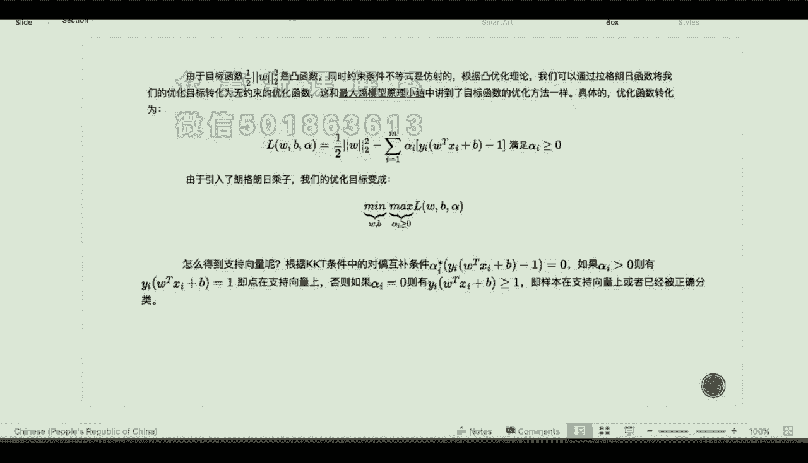

那么我们现在介绍一下嗯，线性SVM会面临着哪些问题，呃第一个问题呢是最直观的，嗯有一些数据呢是非常完美的，它线性可分，比如说我们上面看到的这样的一个例子。

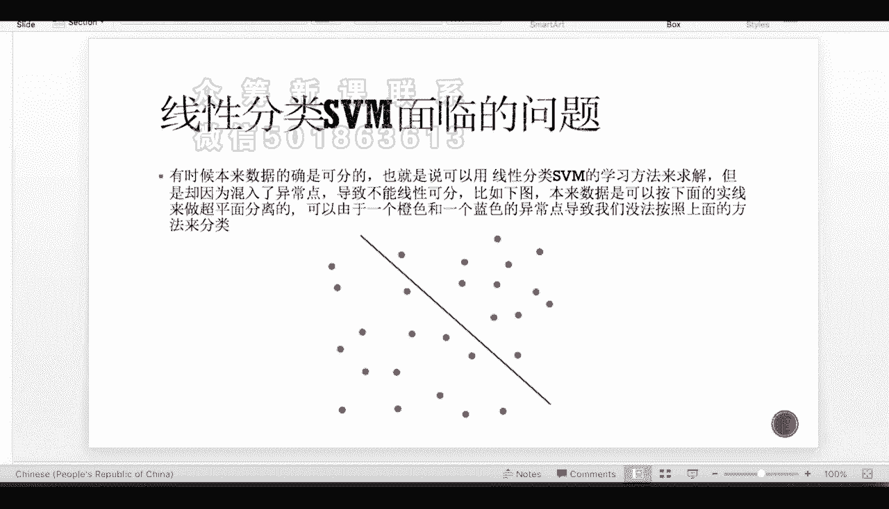

那么它就可以很完美的被进行划分。

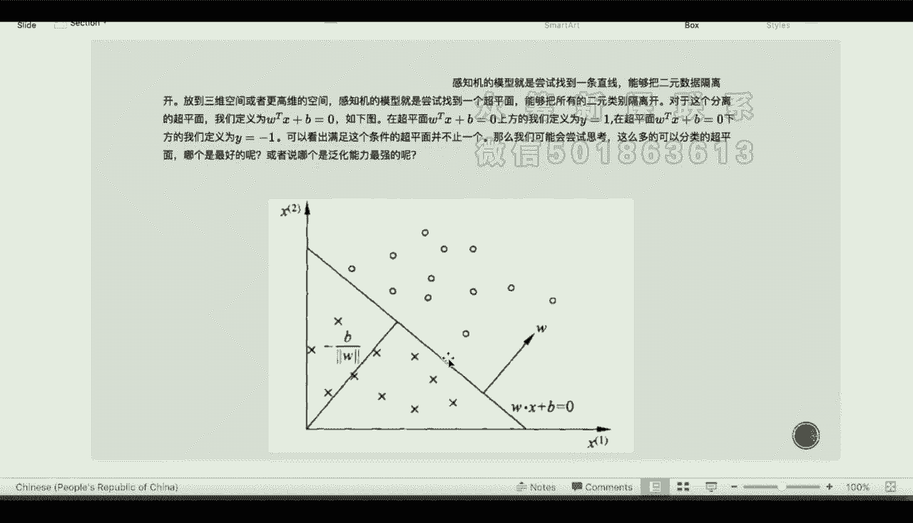

那么有一些啊这些分类呢，比如说我们下图，我们下图可以看到这个橘色的一个outline2点，跟那个蓝色的outline点呢产生了一个这样的形状，那我们是没有办法找到一根直线。

能够完美的把这两组点separate起来的，那这个时候我们依旧想要做一个分类，因为毕竟只是很少的一些outlier。

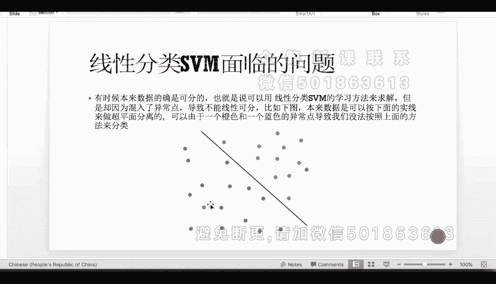

那我们应该如何解决这样的问题呢，嗯还有一种情况呢，它并不是很糟糕的不可分，比如说如下的这个红色点跟这个蓝色点，我们可以看到我们通过run线性的全面，最基本的支持向量机，我们可以让出这样的一个结果。

就是这根虚线的结果，但是如果我把这根蓝色的点啊去掉，或者是加上我们把这件蓝色点去掉的话，那我们会发现我们的知识相机，会变成这个样子的一个形状，那也就是说由于一个点的一个小小的扰动。

会导致我们的这个分类平面有一个很大的改变，那我们之前一直在提到的，我们不希望我们的模型是这样子，很不robust的情况，那我们怎么样能够啊加强我们这个支持向量机，使得呢不要一些outlier的点。

严重影严重影响了我们的这个分类模型的。

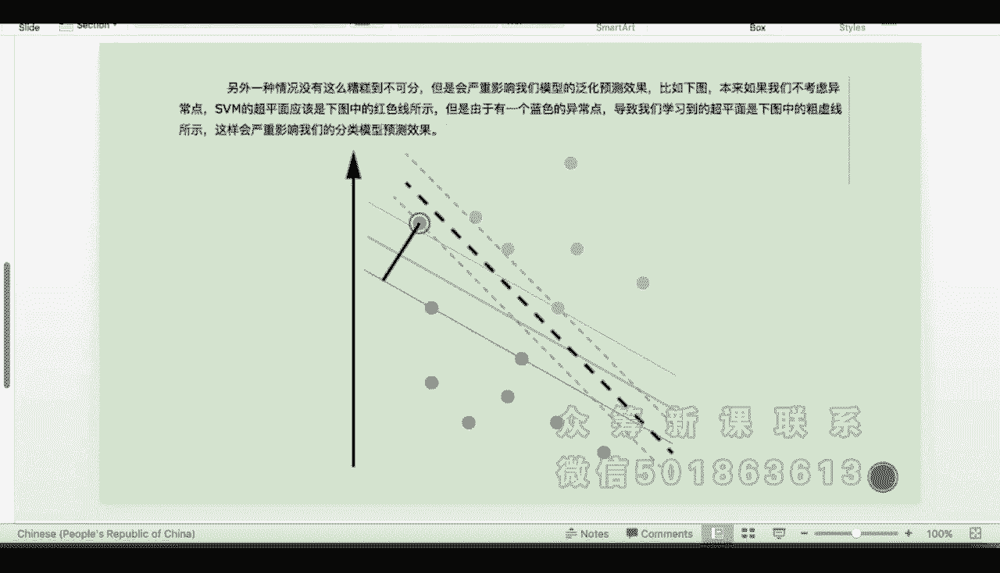

那我们就引入一个叫做软件格，就是soft margin最大化的这样的一个想法，那我们回顾一下我们上面最基础的SVM，我们是呃回我们是呢最优化这个硬硬间隔，那也就是说我们的YI乘以W转置。

xi加B是必须完美的，大于等于一的，那什么叫做软间隔呢，其实跟我们做最优化的一个叫做松弛变量，也就sellack variable的想法非常的相似，也就是说我们这个时候的这个几何距离。

不一定要大于等于一，可以大于等于一，减去一个大于零，但是一个非常小的一个这个扰动。

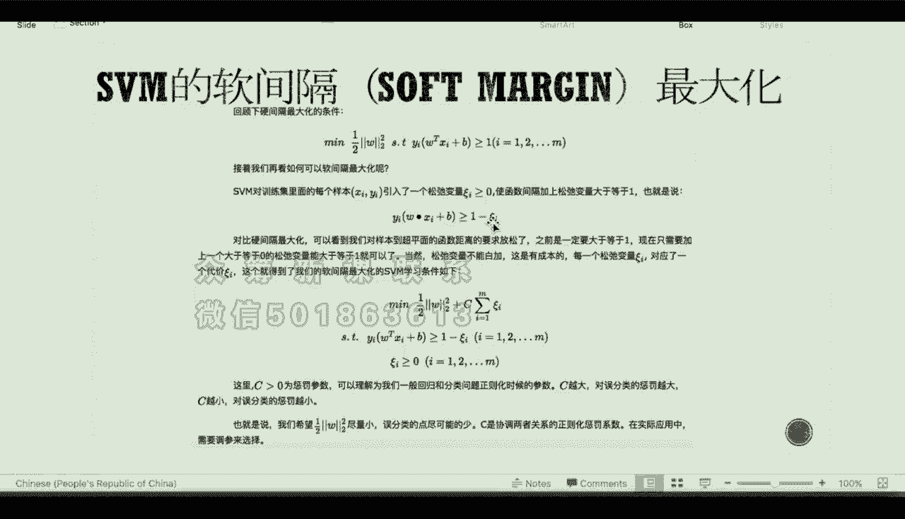

那减去一个非常小的扰动呢，其实是说明了什么呢，说明我可以允许可以允许一些点进入。

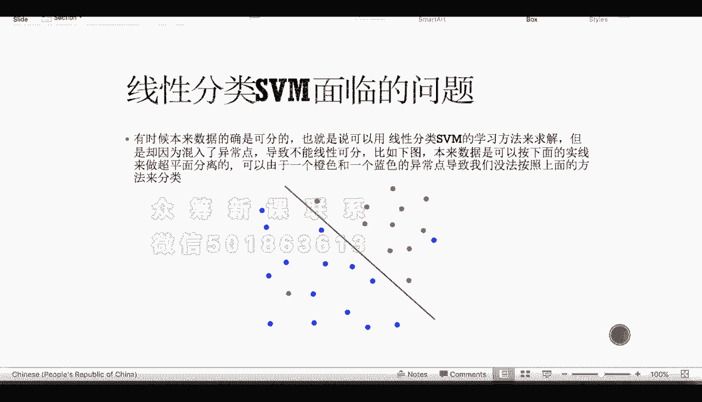

我们的这个IMSNO管，就不一定要在IMSNO管上或者IMSANT之外，我可以进入这个点，甚至呢这个红点也可以越过这个虚线，到达这个位置。

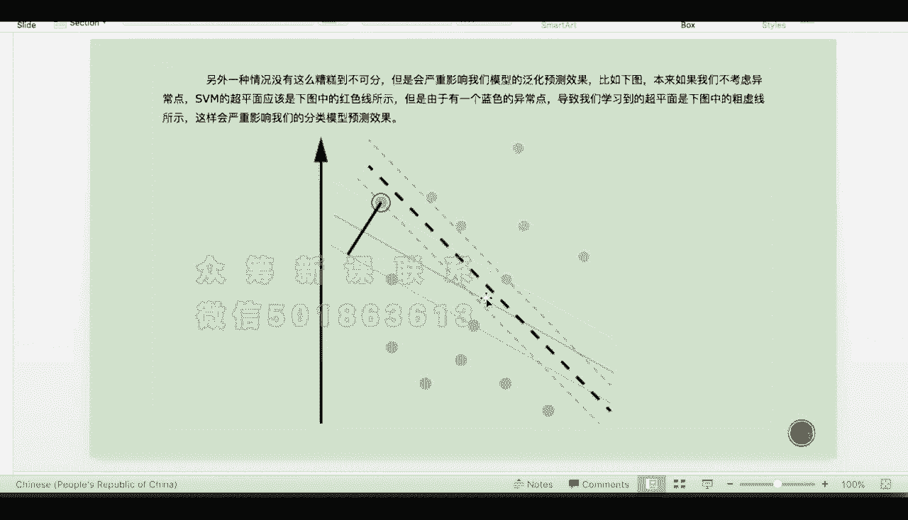

到达里面的这个位置，那就允许了一定程度上的错分率，那么这个时候呢，我们对这个错分率必须有一个要求，要不然如果都错分了，那我们的这个学习机就没有任何意义了，所以这个时候我们把上面的这个硬间隔。

改成如下网间隔的一个表达式，就变成minimize啊，这个跟我们之前的in margin是一样的，那我们加上了一个C，也就是惩罚项，加上呢每一个这个松弛变量的累和。

那下面呢是我们带松弛变量的这个啊constrain，也就是限制变成了几何距离，可以大于等于一，减去一个小小的这个松弛变量，那么一个松弛变量呢都得大于等于零，那在这里呢C大于零，我们把它称为一个惩罚参数。

那这个时候C越大呢，我们对分类的这个惩罚也就越大，那就说明我们只能允许非常非常少的错分类。

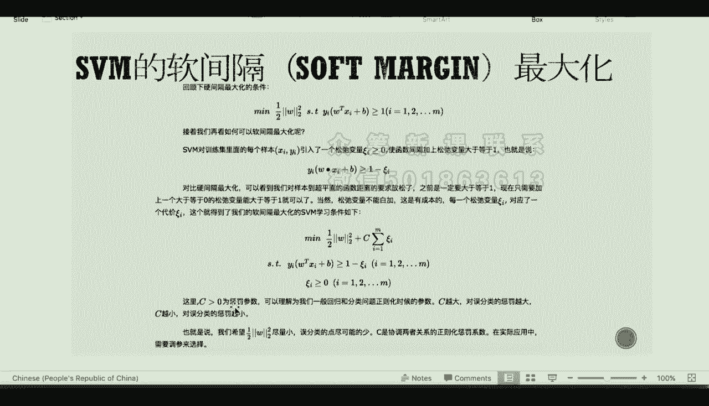

所以C越大，我们的这个margin也就是我们上下的这个虚线嗯。

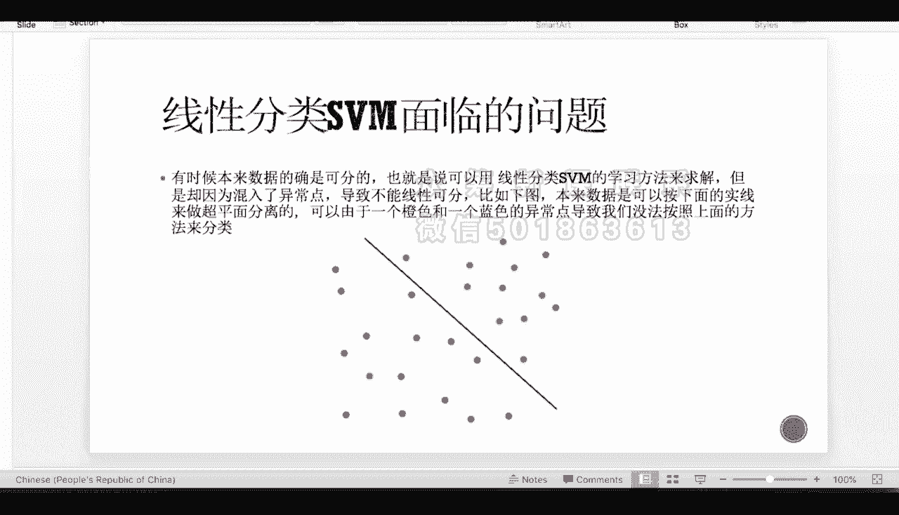

上下的这根线呢。

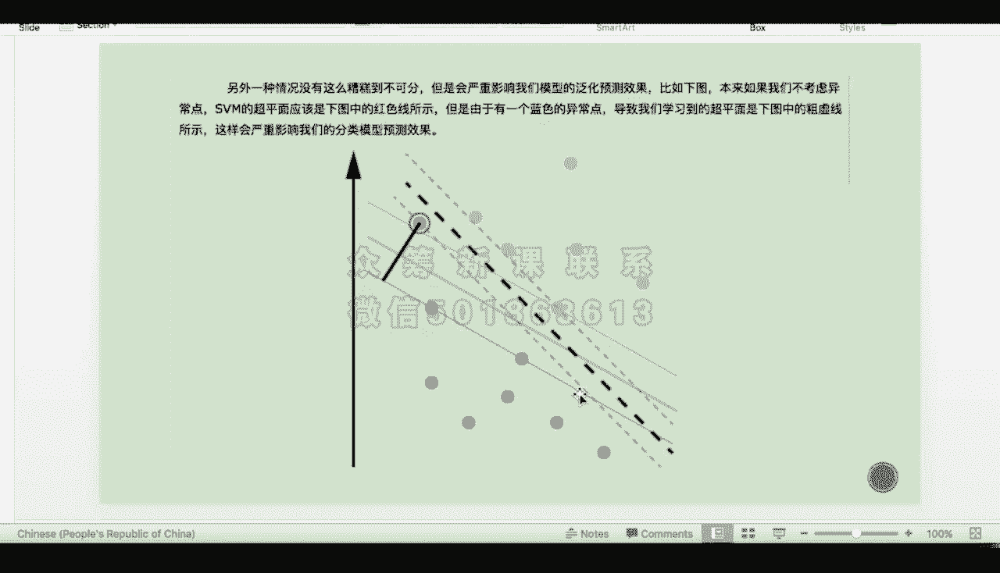

就得离我们这个分类边界越靠近额，那么C越小呢，也就是对错误的分类乘法越小，我们的这个soft marin，我们的这个margin呢就可以越宽，也就是说呢我们引入了这个软件隔。

我们依旧是希望我们的这个嗯距离的导，距离的导数呢尽量的小，也就是我们的呃margin尽量大，那被误分类的点呢就尽可能少，但是C呢还要协调，就是物分类跟我们的这个soft之间的。

一个嗯trade off的关系，所以在实际应用中，这个C的调整呢是很重要的，所以我们得需要通过调参来选择，那我们可可以使用我们前面的课提到过的，这个cross validation和网格搜索。

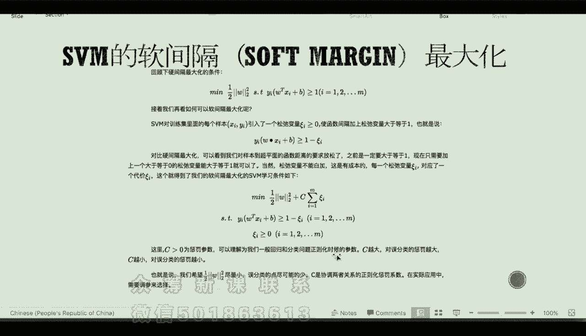

来进行这个C参数的最优化，那这边呢是我们对刚才我们上述提到的这个，south margin的一个啊，举例，就让大家更直观的了解一下什么叫做soft margin，那么大家记得在硬间隔最优化的时候呢。

我们的支持向量会比较简单，也就是支持向量呢是满足YI乘以W爪子，XI加B减一，刚刚好等于零，那元音呢我们在上面已经介绍过了，是由这个KKT条件的阿尔法乘以，这个表达式必须等于零来得到的。

所以呢在这个in间隔的时候嗯，支持向量就刚刚好是落在上下，这两个虚线上的点，那么在软间隔最优化的时候，情况会稍微复杂一些，因为我们引入了这个松弛变量，那么我们依旧呢通过这个软间隔最大化的。

KKT条件的互补对偶条件呢，我们得到了下面这样的一个式子，那我们依旧可以通过分析阿尔法跟括号里面的，式子跟零之间的关系，来看出谁是知识向量，那么首先如果阿尔法等于零的时候。

那因为里面这个条件必须满足大于等于零，那也就是说里面的这个东西呢必须减一，必须大于等于零，那这个时候也就意味着我们的样本呢，在知识向量上已经比已经是正确分类了，那这些点呢就是远离了我们的这个上下。

因此总管的点，比如说这些上面的这些圆点，跟下面的这些差点是被完美分类的，那因为他们的阿尔法呢是等于零的，也就是说他们虽然被完美分类了，那么依旧跟硬间隔一样，他们并不参与这个参数的估计。

那如果阿尔法呢是在零到C之间的，那么说明这个E塔呢必须等于零，那也就说明了这个YI乘以里面，这个表达式必须等于一，那就意味着这些点是刚刚好落在上下这两根，这个margin bar上的点，比如说这个啊。

可惜一，比如说嗯下面的这一根叉叉线的这个点，那如果如果阿尔法呢刚刚好等于C，那就说明这些呢是一个异常的点，那么异常的点呢也就是在这个虚线内部的，比如说比如说这个肯C3，比如说cc4。

比如说这个cc2的这些点，那么这些点依旧被称为支持向量，因为它们的阿尔法是比零大的，那么他们呢是会参与这个soft margin的这个计算的，那么对于阿尔法等于C有三个情况的具体划分。

那么大家呢可以自己啊，下课的时候自己去看一下，那么对R啊，对肯C的话应该是以一为界限进行分类讨论，因为我们上面的这个限制呢。

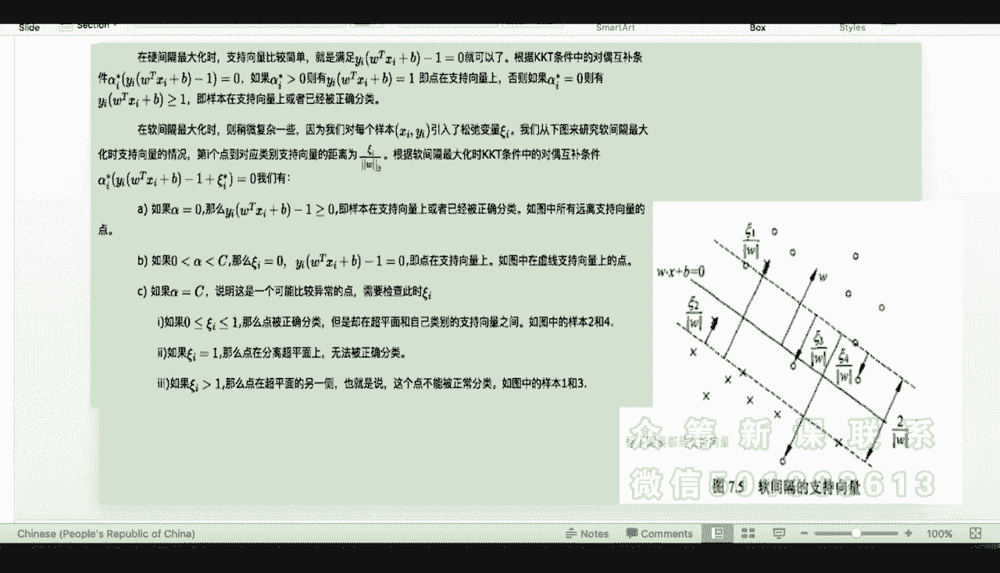

是嗯必须大于等于一减去CCI的，那么如果cc是在0~1之间，说明这个YI乘以这个表达式还是大于等于零的。

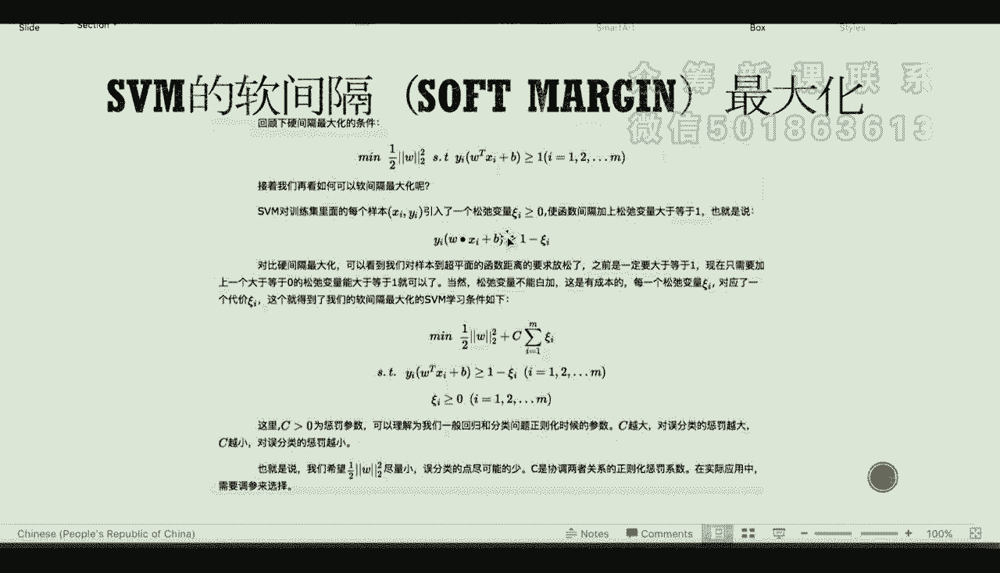

那就说明它是它并没有被错误的划分，比如说只是上面这些圆点，进入了这个实线跟这个虚线之间，那也就是肯C4这种情况，那如果肯C刚刚好等于一呢，那就说明了这个YI乘以，里面的东西已经等于零了。

那就说明他们刚刚好在这一根实线的分类线上，是很危险的点，那么如果cc大于一，那就更为糟糕了，那就像这个cc3这样的点，它不但是进入了我们这个危险区间，并且已经跨过我们的分类分类线。

说明它已经被错误的分类了，比如说这个cc3，那具体的这个划分开的分类讨论，由于我讲的比较快，那么同学课后呢要好好的复习一下。

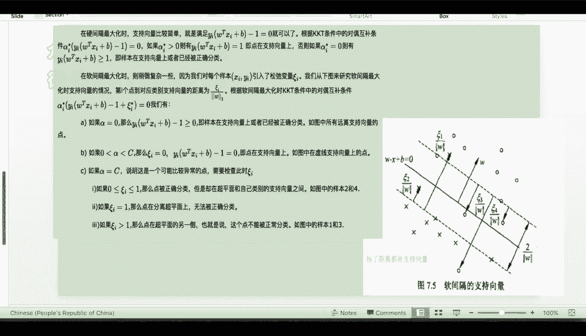

那么接下来我们来看一下我们对这个嗯，我们为什么要讨论非线性的情况，那么如果对于线性情况来说，比如说下图这样的表达式，那如果是线性的线性的情况的话，那我们对于这样的点，我们最多只能做到诸如此类的分类。

但是如果是非线性，大家可以看到，如果是以这个中心画一个圆，那么这个红色跟蓝色的点呢，就能被更为完美的划分，而且这种划分呢也更为make sense，所以这个时候我们需要引入这个非线性的。

SVM的分类器来完善我们的模型。

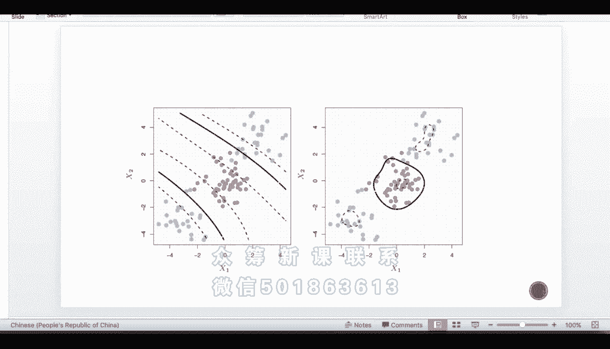

那么对于非线性来说呢，我们先回归回顾一下这个多项式，首先如果是这个最高次数为二次的多项式呢，那就如下这样的表达式所示，那如果我们引入新的变量，我们进行变量替换，我们把每一个位置都替换成一个新的X为X。

零到X5，那我们发现进行变量替换之后，我们又重新得到了一个线性方程式，所以一个最简单的想法，把线性的SBM扩展到非线性的情况，我们假设我们真实的非线性的model是如下的，一个二次型。

那我们可以通过把这个啊本来是二元的二次型，map到一维空间，五元的二次型，那又变成了一个五维的SVM的一个，线性可分的一个情况了，但是对于这样的一个问题，我们存在一个什么样的担忧呢。

也就是说当把二维map到这个线性空间，我们需要map成五维，那如果这边的交叉项特别多的话，那我们的这个mapping的维度呢就是指数爆炸了，那这样我们就我们会带来很多，很高的算法复杂度。

所以这个时候我们要另辟蹊径。

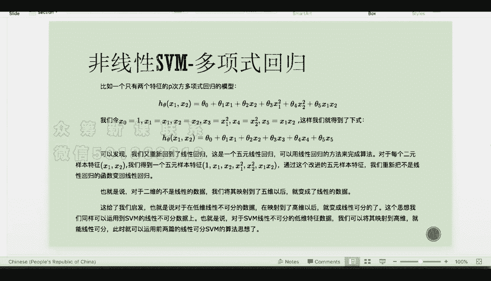

引入一个叫核函数的一个想法，那么这边呢是一个就是非线性SM的一个，SBM的一个内积替换，也就是我们核函数是如何操作的，我们可以看到我们对于SPM的最优化的时候，最后推出来的表达式是如下这样的一个情况。

也就是YI乘以YJ，这里面乘的其实是X的一个呃，一个自己的一个表达式，那么对于线性情况，也就是xi本身乘以XJ。

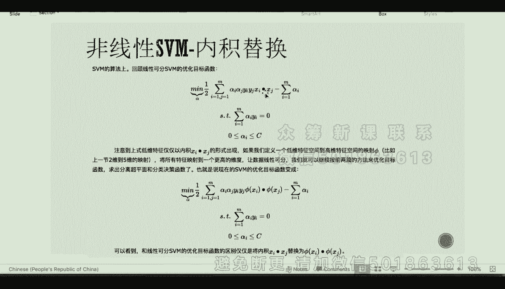

那如果是非线性的，那像刚才的这个二元的，那么这个位置呢其实是一加上X1。

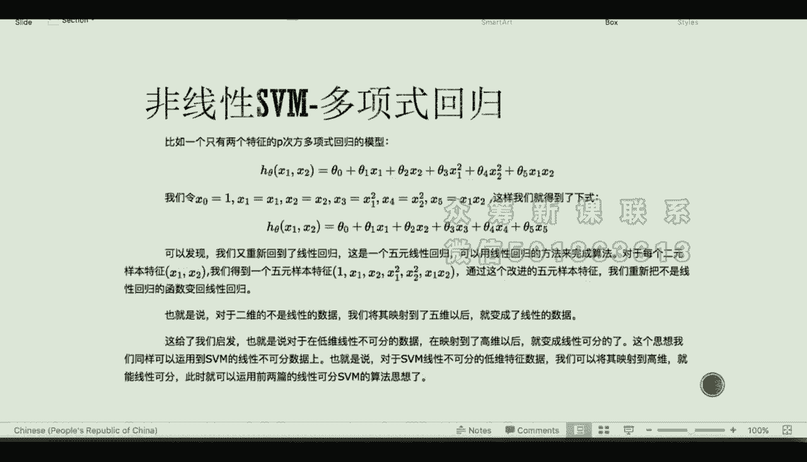

然后加上X2，这个位置呢也是一加X1X2，那么交叉对称呢，那最高的次数呢也就是啊二次，所以这是一个X本身的一个叫做奇函数的一个。

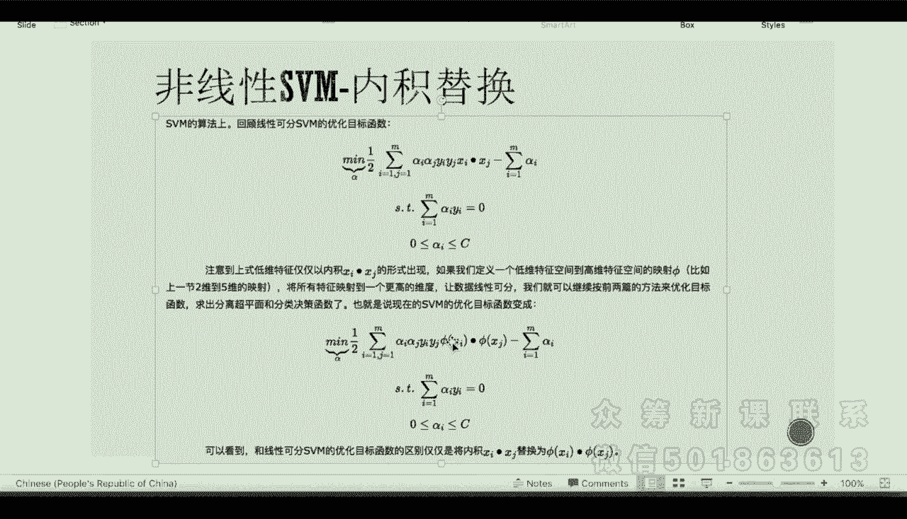

内积替换，所以由这个内积替换呢，我们就有一个想法，就是假设翻呢是一个从低维的输入空间的X的，一个转换式的一个这样的映射，那我们可以假设一个核函数为K，那么K呢是这X通过G函数的变化的内积，所得到的。

那我们就称这个呢为一个奇函数，那么这个G函数是如何帮我们解决啊，线性不可分的问题呢，我们通过观察上式可以发现，这个K的这个行函数的计算呢，其实是通过低维特征空间进行这个内积计算啊，来完成的。

所以它避免了像我们刚才提到的，互相这个变量命名的这个恐怖的计算量，所以我们可以获得我们这样的一个高维特征，空间线性可分的收益，积计算的一个这个恐怖的计算量。

那么对于具体核函数是一个怎么样mapping的话，中间的数学原理会比较复杂。

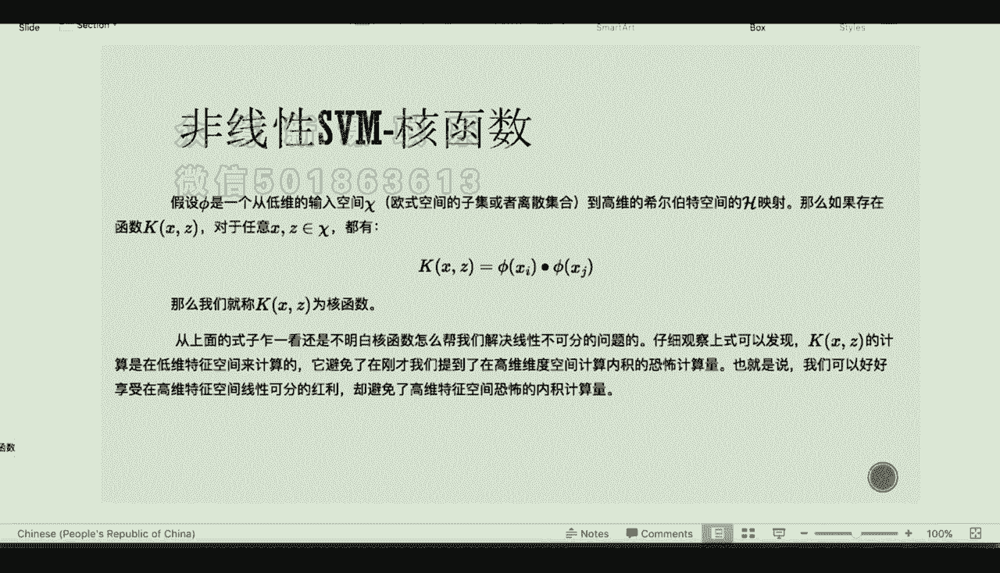

就大家如果感兴趣了解的，可以上网进一步的搜索，那么在这里呢我们只是简单介绍一下。

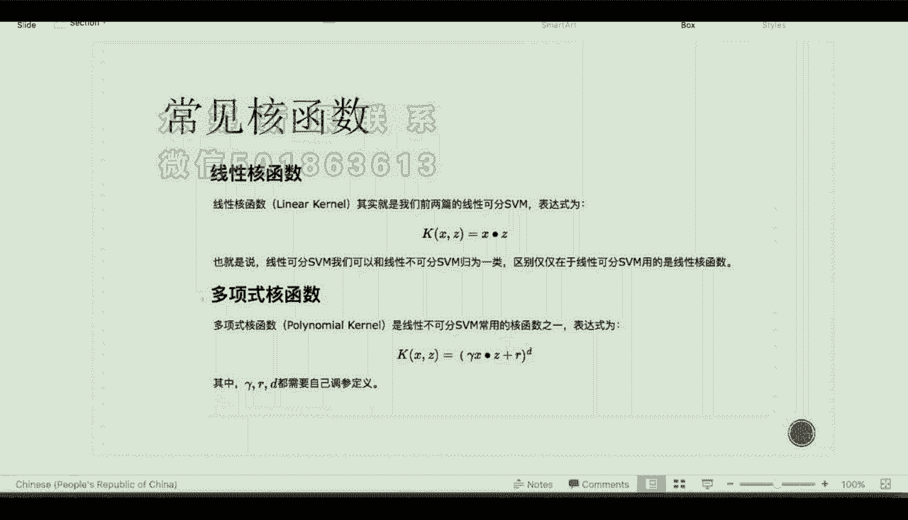

这个从呃，线性如何引申到一个非线性的这样的一个过程。

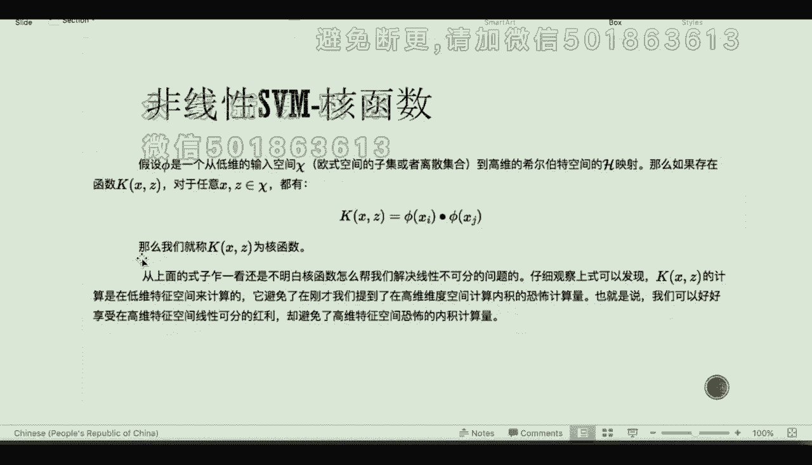

那我们有常见的一些核函数，比如说线性核函数呢其实就是一个内积，那就是X内积乘Z嗯，那如果是多项式的核函数的话，那也就是啊X加Z加上一个常数的这个D次方，那么进行多项式展开，那么最高次数呢就是D。

那接下来有一个高斯核跟这个signal1和，那高斯和跟signal y核呢，都是由线性引申到无穷维空间上的，也就是它可以表示任何维度的分类，那么呃高斯核呢就是像一个正态分布这样的。

一个explanation的表达式，那这个干嘛呢，其实是正态分布的啊，方差的一个导数，那么由这个呢，是来控制我们这个核空间数据集的啊，胖还是瘦，那如果干嘛呢比较高，也就说明了我这个正态分布的方差比较小。

centralized比较密集的，那反之干嘛比较小呢，就说明我的这些数据点是比较分散的，那这个sigma核函数是这个tan的逆函数的，这样的一个核函数，那么它的性质呢其实跟高斯核非常类似。

也是有一个这个干嘛嗯来控制的，那么这个阿尔法呢是控制它的偏度的，那最常用的对于这个克诺方向来说呢，还是这个高斯和，那我们只需要调整一个这个伽马，还有我们最之前的那个惩罚项啊，penalty c就可以了。

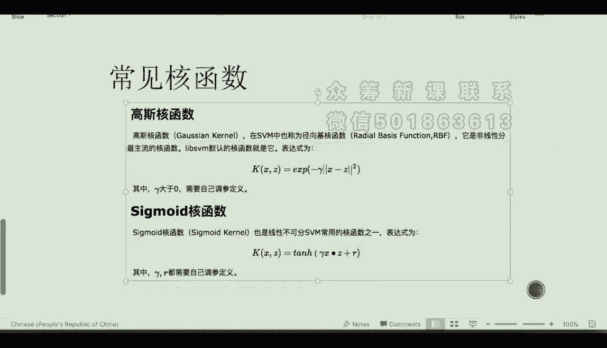

那这个呢是一整个这个高斯和最终的这个，超平面的推导过程，那同学感兴趣的话，我把它放在这里，大家回去可以自己细看，那如果对于数学基础比较薄弱的同学，可以把这一张slice直接跳过。

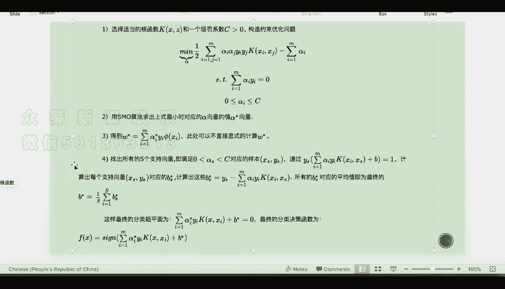

那我们在这里看一下，这个直观的感受一下参数C嗯。

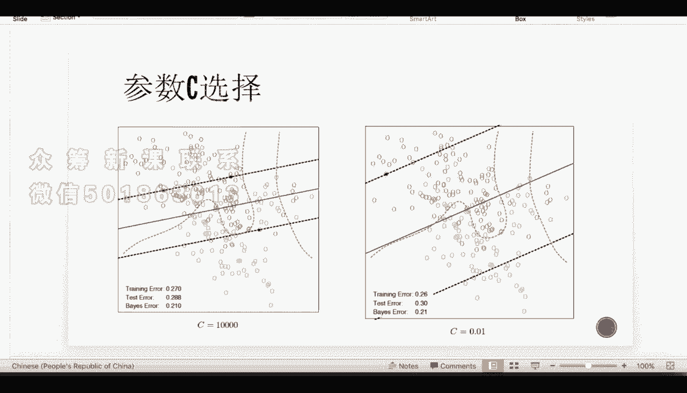

参数C呢就是我们上面提到过的这个。

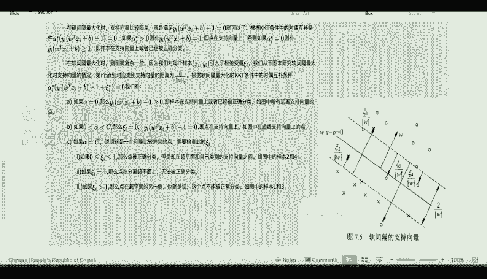

constraint c啊，存在这个位置的，对我们这个处分率进行一个惩罚项的。

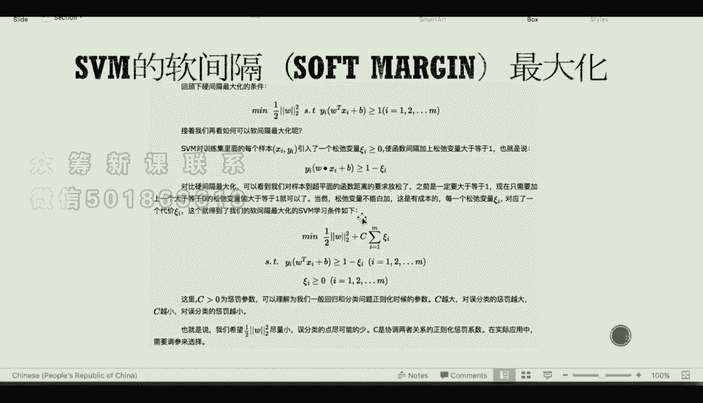

这个参数系呢的一个啊实例，当我们这个C比较大的时候，说明我们对错分的乘法比较高，那么我们的这个这两根虚线叫做support margin，就会relatively来的小。

因为我们里面可以容许的错分的点就比较少，那么如果C比较小的，那就反之我们的这个in snow管呢就会比较宽，我们可以可以容许更多的点，进入我们的危险区域。

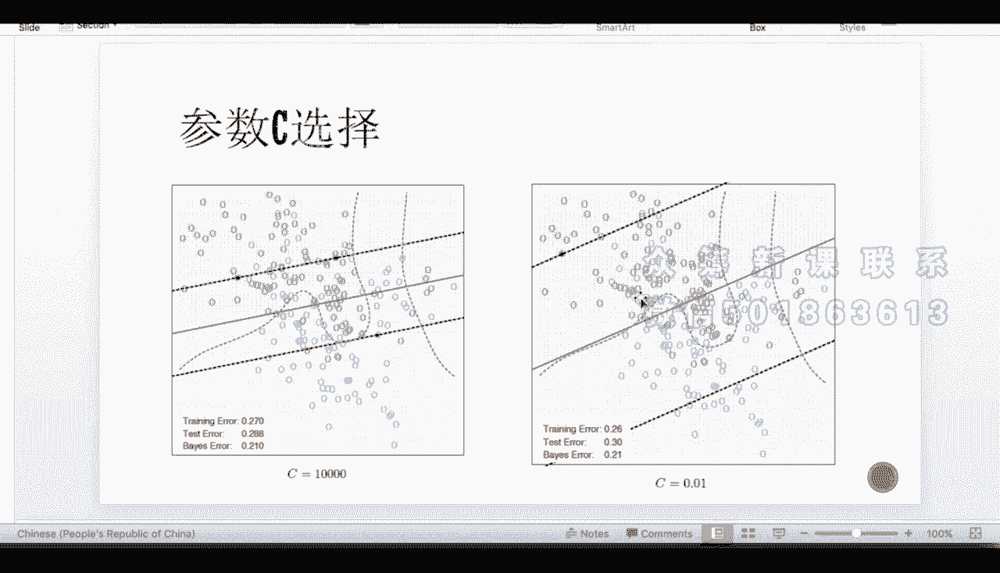

甚至是错分区域，那这个时候呢是一个这个模型选择的一个例子，那么首先呢假设我的这些点是长这样的情况，如果我选择的是这个维度为四的这个啊，多项式合的话呢，那么可以做到如下这样的一个分类情况。

那如果我选择radio kernel，那radio kernel其实就是高斯核，那么如果我选择高斯盒，因为钢丝盒可以map到更高的空间，就是说我们这些曲线呢投影到二维空间中的，形状可以越各异和扭曲。

所以呢大家可以看到那个钢丝核，对于这个data来说的分类效果，比这个四维的核呢要来得好，那我但由于这个我们之前介绍的，都仅仅是二分类，那么如何把它推广到多分类呢，其实是有两种啊，想法其实想法非常简单。

第一种是叫做one v one，那第二种呢叫one v o，那one v one呢是比如说假设我有啊三种数据，那我们要进行SVM，那我们首先我们得做三个分类器，那第一个呢是一跟二的，第二个呢是二跟三。

第三个呢是一和三，那我们对每一个新的data，都放到这三个分类器中啊，进行判别，那假设呢第一个分类器判别它是属于第一类的，那我们就在第一类中vote一次，那它翻到第二个分类器中，又认为它是属于一的。

那我们就对1vote一次，那第二次呢是二个第二类和第三类的分类器的，那比如说vote是三，那我们算这个偷偷vote，那说明一呢vote了两次，三，2vote0次，3vote了一次。

那我们选一个最大的vote，那也是第一次，所以第一类，所以我们就认为X这个点属于第一类，那么对于K个class的分类呢，那就总共得做CK2个分类器，那我们最后进行vote统计，vote在哪一个里面最高。

那就属于第几类，那one v on呢其实想法跟one v one是一样的，只是唯一的不同是啊，它不是两两之间互相vote，而是一对剩下的，比如说他的第一个分类器就是第一个。

那剩下的第二类到第四类呢都是另外一类，那第二次的第二个分类型就是二单独为一类，134再为一类，那想法呢跟上面是一样的，最后是通过这个majority vote。

就是看每一个类型被vote了多少次来决定啊，最大的vote就是我这个X应该属于哪一类的，这就是由嗯二分类上升到多分类，SVM的内部的实现方法。

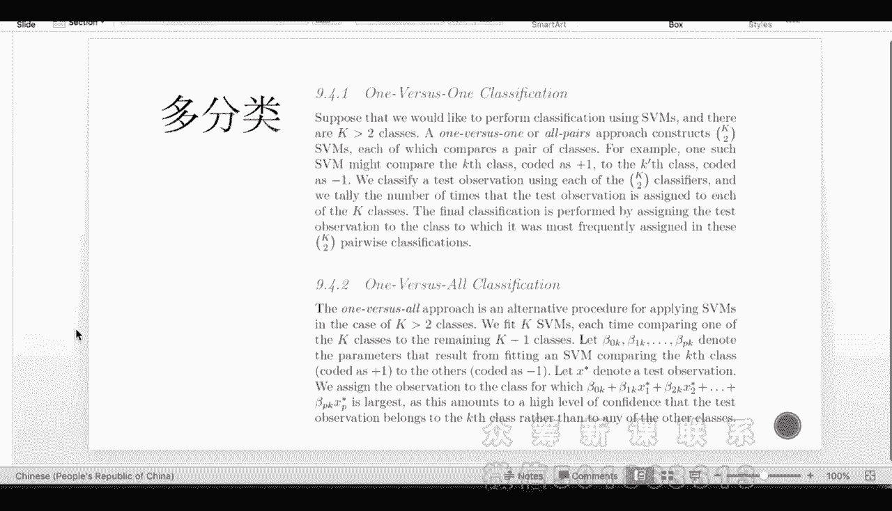

讲cross validay之前呢，让我们先回顾一下啊，Bias and bance trade off，那对上面的这个式子呢，我们在之前的课上也有提到过，也就是我们在建一个模型的时候。

我们的目的一定是最小化我们的均方物，那么有时候会是平方呢，有时候是绝对值，那这边为了表述方便，我们使用的是绝对值，那我们通过这个模型的展开，可以化成三个部分，第一个部分呢是bias，也就是偏见的平方。

那第二部分呢是variance，那第三部分呢是这个系统的variance，那这个系统VARI是不可改变的，那我们只能通过最优最小化前面两项来最小化，我们的军方物，那呃第一项呢。

这个bias呢是度量了我们算法本身的拟合能力，那么这个模型刻画model呢是否准确，那variance呢，适度让我们这个数据扰动所产生的影响，也就是我们这个模型robust的能力。

那为了取得比较好的一整个模型的overall，的一个综合实力呢，我们希望的是我们数据的bias要来的小，但是同时呢数据能受扰动的能力也要比较小，也就是这个variance要小。

但是呢这个bias enviance，在这个实际操作中往往是不可兼得的，也就是说当我们的bias as变小的时候，VANCE都会relatively变大啊，所以呢我们需要找到一个最优的点。

就是来使得我们的MISE啊，这个军方物呢找到的一个找到一个最优的一个，bottom line的地方，那我们使用的方法呢就是得尽量简化我们的model，那对于这个cross validate来说呢。

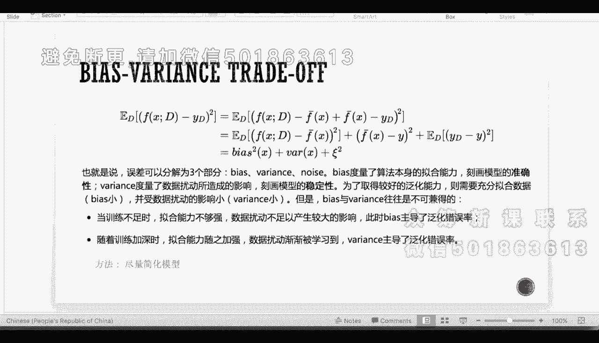

是选择model的一种啊，这个使用方法，那么在对于我们做参数选择，比如说我们前面提到的SDM的乘法系数，还有上一节课的拉索回归和这个领回归的，penalty term这个C呃。

那这cos position主要想法呢是我们想要estimate，我们这个数据是否有过拟合，那我们不能仅仅通过这个train data的MSE，我们得通过这个test data的MC。

那么拿到一组数据之后，到底哪一组作为train，哪一组作为test，我们是不知道的，那这个时候呢，我们可以把我们一整个test data，人为地划分成训练集和检验集。

那对于cosplay day来说有两种方法，第一种是leave one out，也就是啊比如说我们有100个数据点，那么第一次呢以第一个点作为啊这个啊测试，那后面99个点作为训练集，我们算出一个MC。

那第二次呢以第二个点作为这个test，那sofa sofa总共做100次，那么得到了100个这个误差，那我们把这个误差取平均，然后就得到了我们这个total的leave。

one out的cross validation ms，那k fold呢跟leaf one out其实是很像的，只是dif out是每次只拿一个作为测试集。

那k four的呢就是每次拿k four的个作为训呃，作为测试集，比如说如果是five fold的话，那也就是数据每一次都取20%，拿来作为测试集，那剩下的80%作为训练集。

那这边呢就是一个FIREFOLD的一个例子，那这个黄色的点呢都是每一次的测试集，那蓝色的部分呢就是每一次的训练集，那我们算出了五个均方物，那对五个均方物呢取平均。

就是我们这个k four cross balidate的ME。

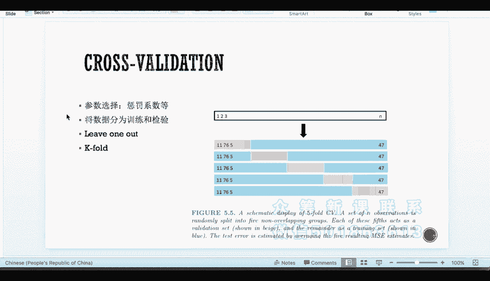

那我们这一节课的代码呢，其实在之前大家已经见到过。

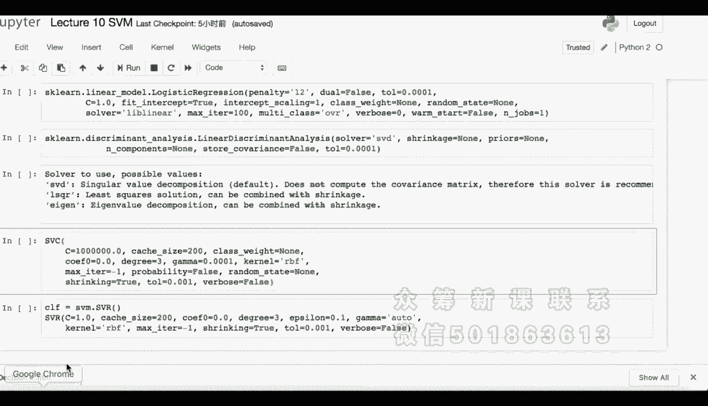

就是在啊第三节第四节课的时候。

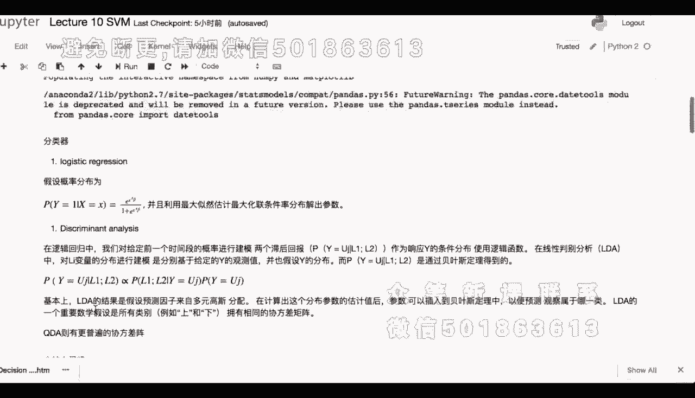

我们有简单介绍过我们的这几个分类器，像啊logic gression。

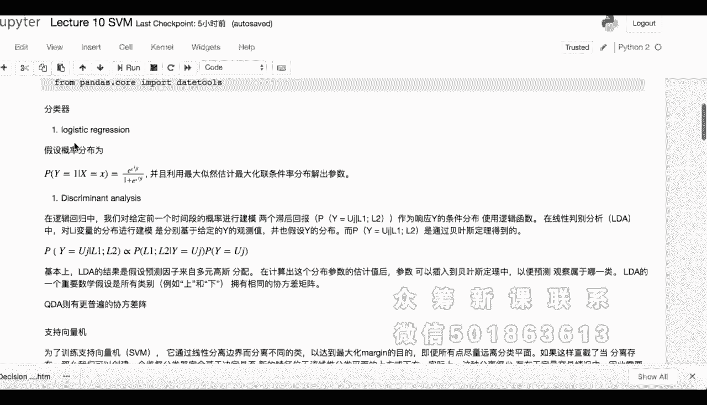

discriminate nurses和支持向量机，那我们利用呢这我们上面提到的这三种方法，对SMP第二天的走势，也就第二天到底是up或者是down来进行predict。

那我们利用的X呢就是他们自身的lag。

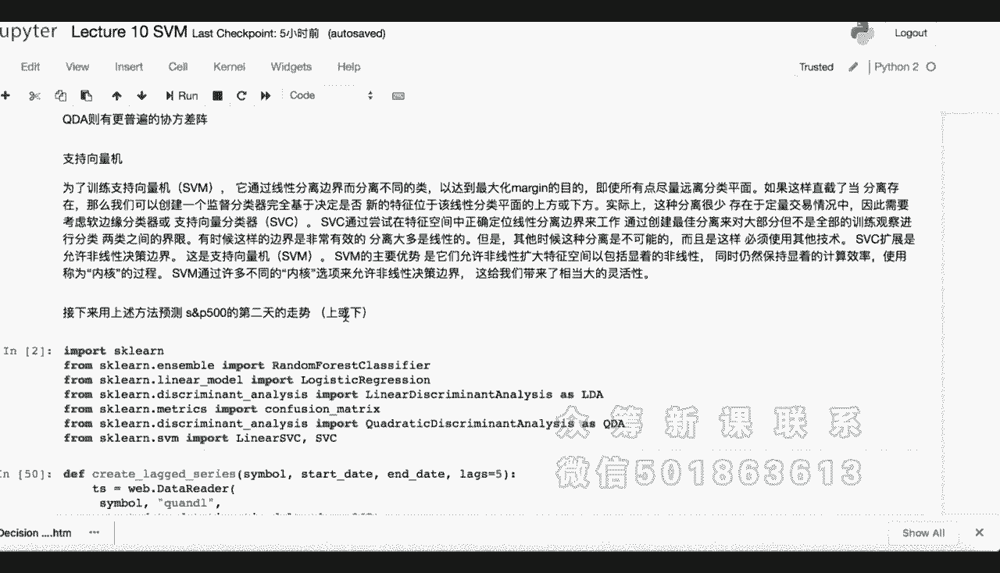

我们可以取five flag或者是flag。

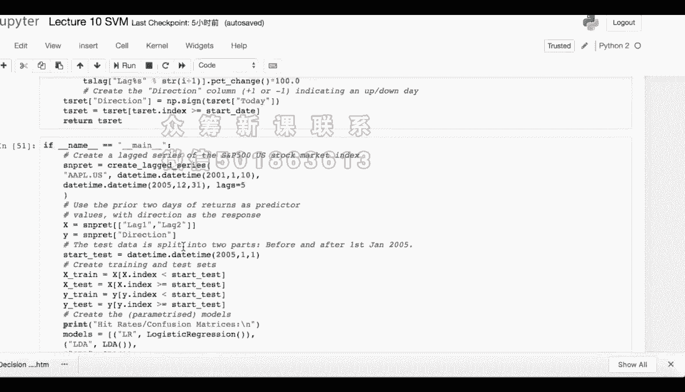

那我们这边呢是只利用了两阶的lag，来做这个prediction。

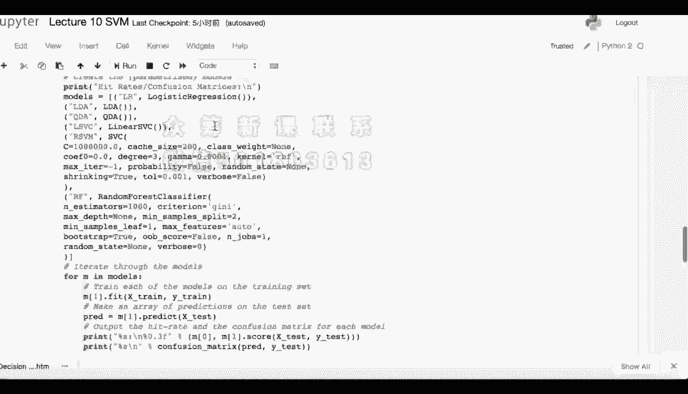

那prediction之后我们这里的评估呢，因为比较想用一个比较直观的，也是用的hit rate跟这个confusion matrix。

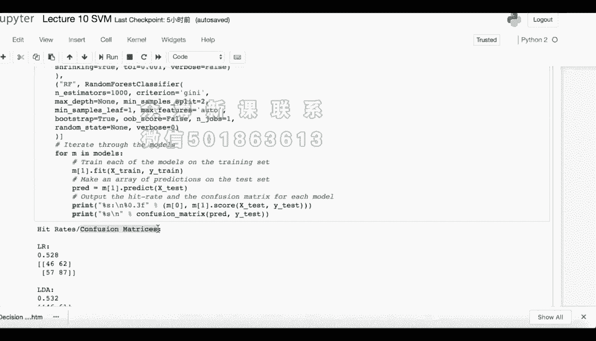

那hit rate越接近一，就说明我的这个模型的效果越好，那在这边呢包括像嗯SBM啊。

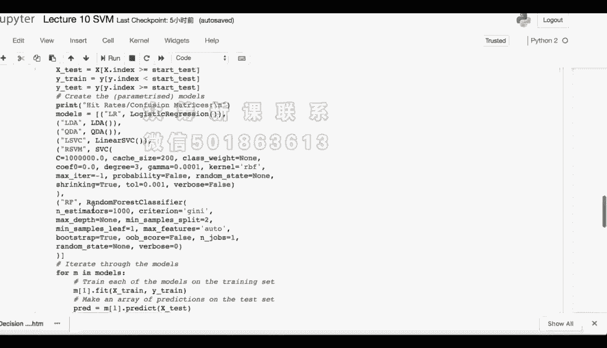

LDAQDA啊，参数啊都可以自己调整，比如说我们举个例子，像SBMSVM的话，作为classification是SVC，那这个C呢这个位置就是我们的PENANALT，Penalty tern。

那这边penalty取得非常大，就说明几乎不允许错分，那这个伽马呢，嗯当kernel全是r b f r BF的意思就是radio，也就是高斯河，那高斯河的话，这边的伽马，也就是我们前面见到过的伽马。

Y减去R方的这个方差的导数，那么这个干嘛呢，取得越小说明呢我的这个kl和的离散化越大，说明我可以take in越多的比较有扰动性的data等等，那别的嗯这些参数呢就没有说非常的重要。

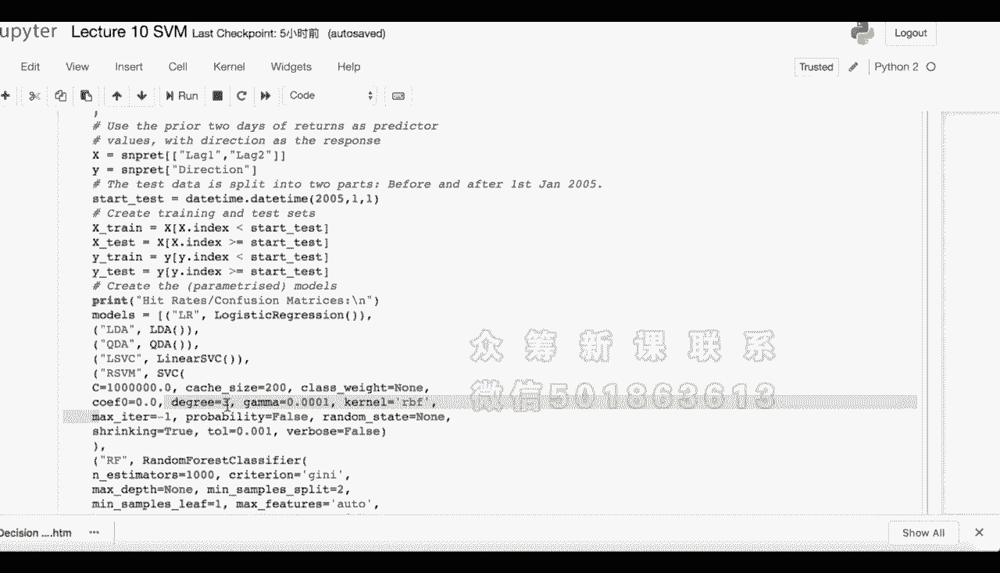

那对于LDA跟QDA呢其实也是类似的，那么主要的这个调用跟参数呢。

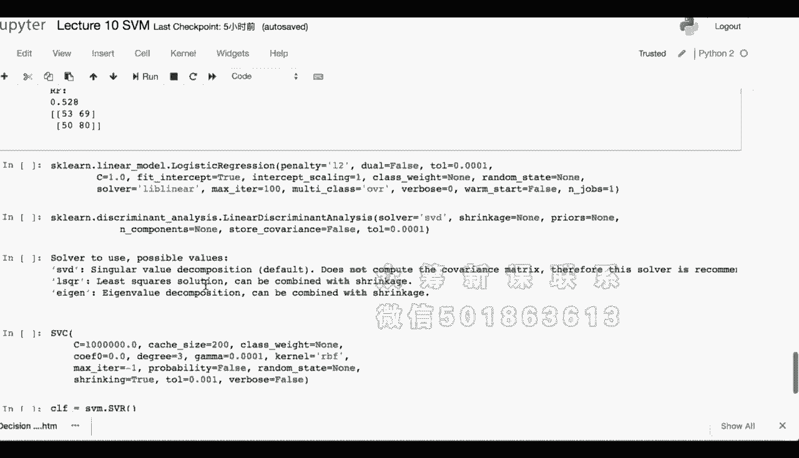

我都写在这个下面了，那么大家可以回去自己看一下。

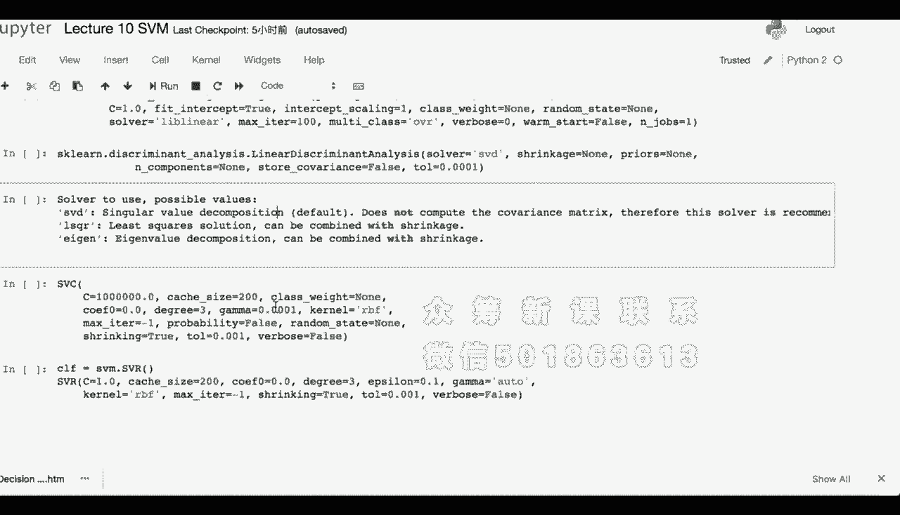

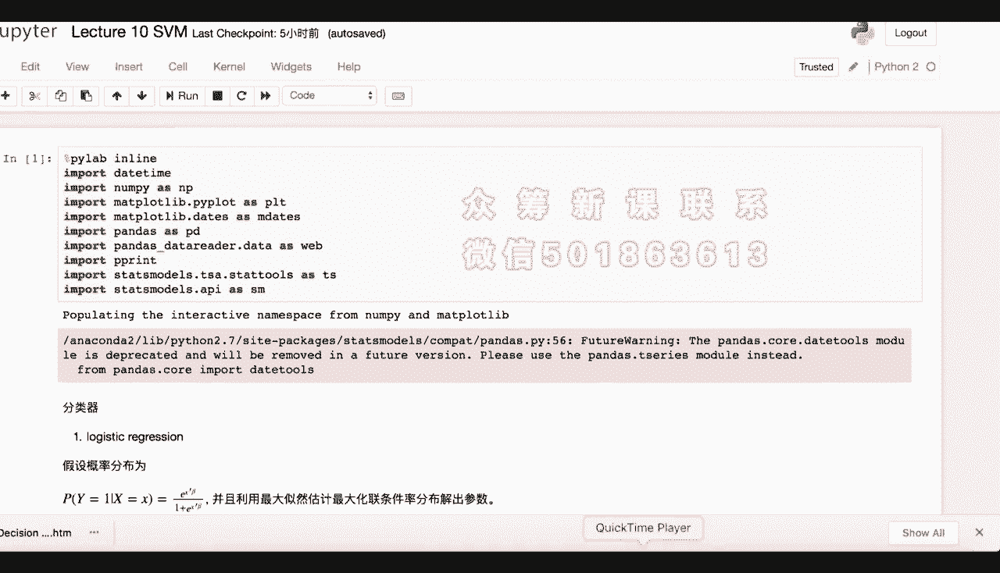