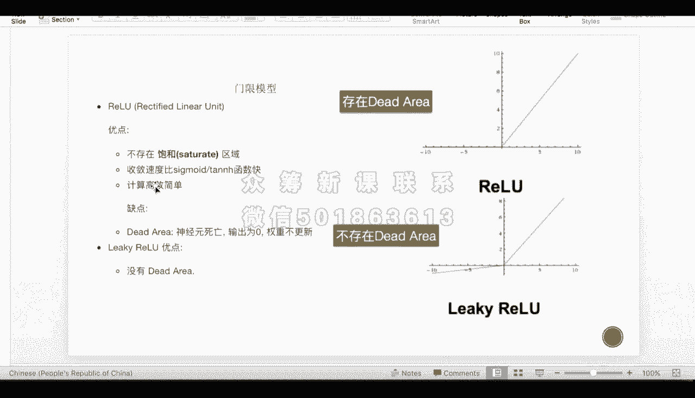
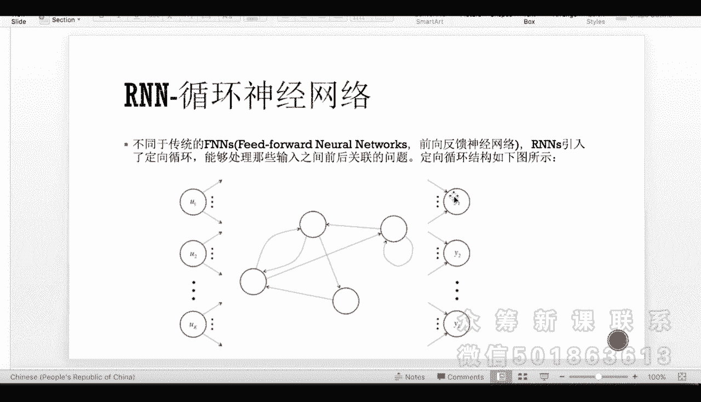
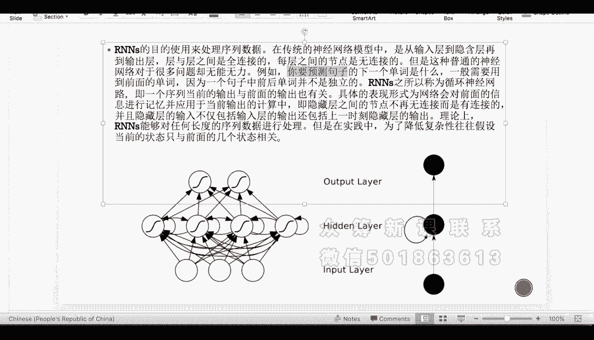
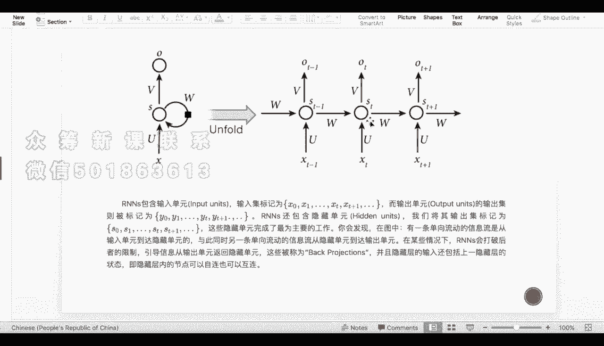

# 吹爆！这可能是B站最完整的（Python＋机器学习＋量化交易）实战教程了，花3小时就能从入门到精通，看完不信你还学不到东西！ - P23：第23节- Neural network - 凡人修AI - BV1Yx4y1E7LG

我们接下来来简单介绍一下神经网络，我们之前说过神经网络的理论基础，包括那个隐藏层极值的最优化的选取等等，理论是比较复杂的，那么在这里呢我们介绍完神经网络之后。

可以至少让同学们对一整个neural network，有一个比较直观的认识，那么具体的隐藏层的函数的实现啊，理论基础等等，那么其实大家没有必要了解的那么详细，如果仅仅只是啊想到达应用层面的话。

那么神经网络顾名思义呢，它是一种模拟人大脑啊，神经信息传递的一种学习技术，那么人脑中的神经网络呢，是一个非常复杂的一个组织层面，那么有成千上万的神经元组成，那么我们神经网络呢也是诸如此类的。

我们首先呢有要很多的输入层，那么输入层呢也就对应着我们，比如说人眼看到的图像，比如说耳朵听到的声音，比如说鼻子闻到的气息等等，那么这些输入层呢也就是我们的感官。

那我们的感官呢通过收集这些information，让他们量化到达隐藏层，那么隐藏层呢就是我们的那个中间的，可以叫神经递质，那么通过隐藏层呢，我们把这些信息传呃，那个转化成啊神经递质递质的因子。

那么由下一个神经元啊接收，那么最后呢是到到达我们的大脑，我们的大脑接收指令之后呢，对我们的比如说手，比如说脚，比如说嘴巴说话等等进行控制，那么有一个特定的output，那称为输出层。

所以呢我们神经网络主要分输入，隐藏跟输出三个层面，那么隐藏层呢因为人的大脑处理是非常复杂的，所以我们的隐藏层往往呢有非常多的layers，那么最简单的是只有一层隐藏层的神经网络。

那么我们看一下右图边这边我们有三个隐藏层，那么对于每呃三个输出层，输入层跟四个隐藏层，那么对于每一个隐藏层来说呢，它都会由三个输入源，那么啊指向我们自己，指向每一个隐藏层自己，那么进行这个数据的处理。

那每一个建号的指的呢就是waiting，也就是权重，那么呢根据这个输出层也是一样的，每一个输出层呢都是加权这些隐藏成的information，那对我们的输出呢就是进行一个information的传递。

那设计一个神经网络的流程呢是如下的，也就是说，输入层跟输入层的节点数往往是固定的，那么这个也符合我们对人脑，一整个人身体构建的一个啊想法，那么中间层也就是隐藏层可以自由指定。

那么指的呢就是第一是隐藏层的layer数，就可以有一层两层甚至是100层以上，那么看我们这个神经网络得处理的东西，的复杂度，那么第二个呢是每一层到底有多少个圆，那么这也是可以自由指定的，那么源越多呢。

我们能够处理的expand的，我们的数据的range也就越大，那神经网络的这个结构图呢，是由这个箭头来代表预测过程的数据流向，那比如说像上面的这个从输入层指向隐藏层呢，也就是我们数据有输入引呃。

流向这个隐藏，那我们正一般的神经网络呢，都是当向的这个箭头方式，那么对于recurrent来说呢，嗯它是可以有循环箭头的，那每一个连线呢我们说过并呃，不仅仅是代表数据的流向，我们到后面介绍的时候。

每一个箭头上面都会有一个数字，那么这个数字代表的是我这个information，传递的时候的一个权重，那么权重越接近于一，说明我从比如说从D输入层一到达隐藏层一，那么第一个waiting是0。9。

那这两个箭头waiting的都是0。05，那就说明第一个输入层，对于第一个隐藏层的action来说呢，嗯你的这个information占的权重也就越重，那接下来让我们来看一下一个这个神经元的啊。

information传递的模拟，首先呢我们依旧假设我们有三个输入，那我们求我们有两层的这个隐藏层，那么第一层呢是对我们的这个全职进行处理，那么在这里呢我们是一个简单的求值嗯。

我们我们根据赋值进行一个waiting sum之后呢，我们会有一个非线性函数，那经过非线性函数的filtering，或者我们称为processing之后呢，我们会有一个输出。

那么这个非线性函数就是我们经常称的啊，Transition function，或者呢叫做啊激活函数HZ，那么这个激活激活函数呢，直接影响了我们的这个和呃，求求到的这个求和值。

到这个输出之间的这个mapping关系，那额这边左右两边呢是一个具体的例子，比如说啊我们这边从X一一直到XN，那我们赋值呢就从W一一直到WN，那我们第在第一个圆处理的时候，我们得到一个数量B。

那么得到的一个呃输出量B呢，是他们他们的这个加权平均，那我们之后呢经过这个红色的方框也是隐藏层，是一个这个非线性函数，那我们要求容易求导，为什么呢，因为经常这个激活函数。

是作为我们损失函数的一个元素来说，那么对我们的loss function我们经常是对它求导啊，导数等于零来求极值的，所以我们经常希望它可以求导，那么HZ的output呢，也就是第一层激活成输出的A。

那么如果只有一层output layer的话，那这个A就是我们的输出，那我们如果有很多的这个隐藏层，那么A呢就是隐藏层一到隐藏层二的一个输入，那么之后呢如果有多个隐藏层，那A嗯放在第一个位置。

那么一样的也是有这个waiting，那么waiting到达了下一层隐含层的元素，那么我们把它累合之后呢，再进入第二个H我们称为h two z，那也是下一个的激活函数。

So far and so forth，直到我们有output为止，那我们来看简单介绍一下，我们比较常见的几个激活函数，那么第一个呢是SIGMOID函数，那么对之前的课程呃，依旧有印象的同学呢。

应该记得，这个SIGMOID函数是我们logistic function里面，非常重要的一个啊logistic函数啊，我们logic function里面我们假设了我们的后验分布。

也就是depends on x，我们probability我们属于啊某一个类，比如说DK类的这个后验概率呢，就是我们的这个sigma function是一加上E的负，那这个位置呢是一个啊minus嗯。

x feature的线性组合，然后上面是一，那么这个SIGMOID函数的好啊，好处呢其实在我们logistic function里面有有介绍过，也就是它的分布刚刚好是在零一之间。

然后呢头尾都是比较平坦的，所以他的这个函数图像，非常像我们的这个概率密啊，概率的这个CDF就是cumulated probability function。

所以他作为logistic regression，因为logistic regression，我们最后预测的其实是一个啊概率，就是后验概率，所以他来跟这个概率进行。

corresponding的话是最合适的，所以对于我们的这个神经网络来说，如果我们最后的输出层，output是我们希望输出的是一个概率的话，那我们的激活函数就非常有理由，使用这个SIGMOID函数。

所以说这个SIGMOIDSIGMOID的函数，在这个输出层是这个比较常用的，然后在中间层非常的少使用，为什么呢，因为我们中间层希望我们的这个每一层之间的，这个information的传递。

希望它能够映射到一个比较宽泛的空间，那么对于这个计划，这个signal函数它只能映射到0~1之间，就过于窄了，所以中间层非常的少使用，只是在输出层的时候。

因为它可以把负无穷到正无穷mapping到零一之间，所以如果我们的输出层，希望我们输出的是一个概率的话，那我们大概率都是使用这个sigma的函数，那么也希望大家能把这个sigma函数。

跟我们的这个logistic regression联系起来，那还有一个这个tan函数，那么tan函数呢曾经是最常用的激活函数啊，中也是中间层使用的比较少，那么它的一个好处呢。

就是在于他现在的输出的值域不是0~1，而是-1~1之间了，所以呢它比sigma也好的原因是它可以表示负数，那么嗯对于这个tan函数的一些线性变化啊，包括这个乘积跟加这个截距项，那么它就可以由-1~1。

扩展到从负无穷到正无穷，所以探展函数能比sigma in函数表示啊，更宽泛的值域，那么它的缺点呢依旧跟SIGMIN函数，它一样的地方是它的两头过于的平坦了，那么对于一些就是在这个比如说-10~10。

是一个分布比较均匀的情况下，那么tan函数作为这个激活函数呢，就会存在着比较大的误差，那我们来看一下我们对于一些普通模型来说，我们比较常用的计划函数是这个REOU，跟这个LICYOU这两个函数。

那么对于第一个函数来说，其实我们在做很多model的时候，这个函数很常见，它是在这个嗯就是零以外或者是一以外，就是这个that area可以自己随便设置，那么都是零，那么从一个点之后呢。

它就是一个单调的函数，那么写斜率是多少，其实是不确定的，你也是可以自己定义的，那么这个函数的好处是它存在一个dead area，所以它对于门线模型是非常常用的，也就是当我的这个X值陷入某个区间的时候。

不存在响应，也就是我的神经元就不刺激它了，就到达了某一个是隐藏层，或者是某一个输入层都可以，那么只要我的X落入了某个区域，我我的这一条神经线路就已经死亡了，就是我不对，我不做任何的响应，那么别的点呢。

也就是我的刺激越强，然后呢那我给出的information也就越强，所以它跟这个门线模型是可以hi利啊，correlated的，那对于这个LIKILIKI这个R2U的话呢，它是不存在带area的。

它只是超过某个点之后啊，他的这个刺激就非常的微弱，呃，所以呢当呃你不是特别想，就是说directly kill这个神经元，而是让他放射出来的，这个神经递质非常的微弱的时候呢，你就可以用这个比较。

就是比较我们可以叫一个比较保守的函数，也就是这个LIKIREOU，那么它呢跟这个有带带area的这个RYL有区别，就是他的权重是可以更新的，也就是神经元不死亡，但是神经元的反应减弱。

那么输出呢变得很小啊，权重呢是有更新的，所以这个是这两个REOU的优缺点，包括它们应用的啊一些领域。

那呃我们来简单介绍一下这个训练过程，这个训练过程呢其实是非常冗杂的，而且也很复杂，就是为什么使用这些函数呢，我在前面用intuition给大家解释了，那么对于这个我们先来看一个比较简单，就单层神经网络。

那么对于单层神经网络来说呢，我们使用比较多的这个计划函数，是一个sin函数，也就是这个SIGMOID的，那么SIGMOID函数呃，经常使用的原因是，因为一般的单纯神经网络的training。

我们的output一般都是probability，所以说用这个01mapping是最好的。

那么到了两层神经网络呢，我们的output用SIGMOID，那中间的这个嗯中间的layer呢。

我们一般会使用这个LIKYREOU函数，因为它能够保证我的这个每一层的权重，其实是依旧能够受得到update的，不会死亡，然后也不会映射到奇怪的区间去，那么对于多层的神经网络来说呢。

这个IELU的训练包括LIKI呃，R e l u，作为这个呃每一个layer之间的这个激活函数呢，是最好的，你就不要使用讲这个SIGMMOID，或者是这个sin函数，因为就是啊。

它不但能够进行这个非线性的这个映射，并且呢它能够满足我在每一个区间上，就是都能够有值比较均匀的分布，那有的值呢可能落入了一些，我不是很喜欢的区间，那么我可以减弱它的神经传递。

所以它是一个就是最折中的这样的一个办法，那么嗯对于我们的这个神经网络的训练呢，我们我们需要考虑的一些问题是，对于神经网络的training，它虽然能够处理非常复杂的model。

但是呢他的问题呢还是这个泛化问题，也是我们前面一直提到的a variants and by trade off，就是你的模型越复杂，它确实能够减小它的bias，因为它能够表示越多的model。

但是由于你的模型过于复杂了，所以很容易OVERFITTING，并且你的这个模型的variance也非常的大，那么这个时候呢，我们会呃引入一些一些解决方法，那一种呢是你让你的模型尽可能的简单。

但是对于神经网络来说，它本身就是一个很复杂的模型，那没有办法让它简单，那我们做一个什么样的事情呢，就是我们提高它的计算速度，就是那你模型不够精确，我就多训练几次嘛，那多训练几次要花时间，那怎么办呢。

就提到了一个这个GPU编程，就我们平常的这个编程，我们是在CPU上run的，那GPU作为显卡的话，显卡的running的速度是比CPU要快非常多的，那么current里这个神经网络呢。

如果存在在这个GPU上，那就能得到一个非常好的，就是算法速度的这个提升，那么在深度学习中的话，那这边有很多这个深度学习会会得到的，一些问题，那比如说像这个周报技术啊，还有这个数据扩容技术啊等等。

这些正则化，也就是REGALIZATION的这些问题呢，我们不做深入的介绍，但是当大家提到政治化技术的时候，处理这个OVERFITTING，那大家要记住，我们提过两个。

那么一个是visual regression，还有一个是lasore regression，是对于linear regression的正则化，那么他们呢就是把很多这个regression前面的。

coefficient shrink到zero，那么对于神经网络的这个是这个正则化技术呢，我们不多做介绍，那么主要他的想法呢就是砍掉我们，一个是砍掉我们的layer的层数。

还有一个是砍掉我们每一个layer的点数，让它尽可能的少。

并且有代表性，那么我们前面介绍过了，我们的神经元，现在来看一下我们的这个神经网络，每一层之间的构造，那么一样的我们存在的这个啊输出啊，输入项以及这个输出项，那么输入跟输入下的这个点的个数呢。

是已经固定的，那我们可以操作的也就是中间的这个hidden layer，我们叫做每一个隐藏隐藏层或者叫做激活层，那么呃隐藏每一个隐藏层之间，第一层有一个激活函数，中间的这些都是隐藏成自己内部的激活函数。

那么外面最外面的这一层，到uo layer之间的transformation呢，也就是叫做输出激活函数，那么输出激活函数的挑选呢，主要是根据我的这个output layer的要求。

比如说我output layer希望是一个概率，就是属于哪一类的概率的话，那么跳SIGMOID，如果是一个门线模型，那我们挑这个RELU等等等等，那如果是一个continues的话。

那我们比较希望它是我们之前提到的，这个tan函数，那我们现在就先简单的介绍一下，我们的这个基础神经网络的这个计算粒子，那么嗯最简单的是这个forward的计算，就非常的直观。

首先我们来看这个Z1这一点的这个隐藏层，那么呢它是有要收集这个color x1跟X2，这两个input点的啊，值，那么呢我定义他的权重分别是0。1和0。2，那截距项呢是0。01，所以Z1这个点的数值呢。

就是0。1乘以这个X1的值是0。5，那么0。2呢乘以X2的值，也就是负的0。3，那在截距项那算出Z1的值之后呢，我们要到达我们的第一层隐藏层，那我们看我们的这个激活函数，那我们选择了SIGMOID函数。

所以是11加上E的负的Z1次方，算出我们的A1，那么到了第一层隐藏层之后，那么第一个隐藏层呢，要gather这两个隐藏层额的值，所以我们得算出这个A10A2，那么得到A1跟A2之后呢，我们到达这个红点。

依旧要gather这两个的权重，所以是0。5乘以A1，加上这个一乘以这个A2，再加上这个点，我们每个点都是可以有截距项的，那得到这个项之后，如果我们只有一层隐藏层Z1，那这个红点就是我们的output。

那如果这个我们有223层隐藏层的话，那这个红点就是第二个隐藏层的第一个值，那sofand soft往后推倒，那直到呢我们到达最后的输出层位置，所以这个是一个向前反馈神经网络的例子，也是最简单的。

也是最直观的神经网络，那不同于这个forward，就是我们前面说的FEEDFORWARD，neural network也是向前反馈的神经网络呢，recurrent neural network叫RNN。

它引入了一个定向循环，那这个也是很符合我们的直观感受的，也就是说对于中间的这些隐藏层，我们之前的这个前馈，前馈神经网络呢，是每一层的那个流向都是一个单方向的，但是如果每一个层之间可不可以有相互关系呢。

那回答一定是肯定的，比如说像Z1和Z2之间，可能也存在着一些自我联系，跟一些数据的流向，那么前馈神经网络就没有办法表示，所以呢循环神经网络它可以定义，中间这些隐藏层之间可以有一个自循环。

或者是一个相互循环，那么一些信息的传递，那么最后呢再到达我们的output layers。

那么这个英文network的使用呢，主要是可以处理时间序列数据，因为当中间的hidden layer都是一些时间序列，那我们可以嗯依赖于上一步的，或者甚至是上上部的，或者说我自己之间也存在着一个自己的。

Auto regression，所以呢它可以表示更复杂的model，比如说我们举一个例子，我要预测这个句子，它有很多单词组成，那它下一个单词是什么呢，说我不但是。

所以我一般是需要要用到我前面的单词是什么，比如说this is，那后面如果呃再后面一个词是啊pig的话，那中间是不是有很很有可能得放一个量，定定冠词或者是一个不定冠词，比如说A或是the之类的。

所以在句子中的前后单词的出现，其实并不是独立的，还存在着一个相互依赖关系，那包括时间序列也是一样的情况，所以recurrent neural network呢，就是利用中间的这个自循环。

来达到每一个隐藏层之间的这个，依赖关系的这个描述，所以呢它能够对这个时间序列，和一些存在着序列相关性的数据进行处理，那么一般在这个时间实践中，因为我们不需要我们的模型太复杂。

所以往往呢只能假设与前面的某几个状态相关，比如说我们只截止到第五个，因为当lag太长的话，那么他的自循环的loop就太大了，那么一整个神经网络呢就过于的复杂。

现在让我们来简单看一下，一个循环神经网络的一个流程的例子，那么更有助于帮帮助大家理解，那我们看我们这个in todayer呢，依旧是我们的这个X1到这个嗯，比如说x t so far so force。

那这个时候他的区别就是，这些X之间是一个是一个序列关系，是一个时间，就一个时间序列的一个存在的依赖关系，那么他们input到我们这个神经网络中，那么呢S也是对应的，从s st到ST减1T加一这样子。

那S呢是我们的隐藏层，那我们的这个output层呢，我们可以设为Y或者是设为这个O，那么U呢是从这个观测，也就是输入到我们隐藏层的这个激活函数，那么输出的这个激活函数呢称为V。

那这个W呢也就是我们这个recurrenneal network，里面一个特特定的一个函数，那么是我们这些hidden layer之间的一个，相互依赖的一个啊，我们可以称为一个移动函数。

或者是一个信息流函数，那么呢这个W呢会完成我们这个隐藏层之间的。

信息的传递，那我们可以来啊，这个看一下我们的这个information是怎么传递的，那我们来看这个DT点的这个位置，那么呢我们是s st呢为隐藏层的第七步的状态，那么它是作为一个隐藏层的一个记忆单元。

那么呢它呢是根据我们上一步的s st减一，和我们的这个s st共同得到的这个数值，所以呢s st呢是等于U乘以这个ST，也就是输入啊plus它的这个激活，那么再加上呢我们上一课。

s st减一的这个状态呢，乘以这个w transformation的这个函数，U跟W可以是线性的，也可以是非线性的激活函数，那么通过这个下一步的这个激活函数呢，或者是一个自己本身带着这个自循环F。

那得到自己的值，那么有了s st之后呢，我可以选择通过这个v output到这个observation中，那么就已经出我们的DT步的观测值，那它也要通过再下一步的这个function关系。

把information传给我们的下一步的这个隐藏层，那我们需要注意的是，这个神经网络，我们这边画的图是一个full set，也就是说每一步都可以有一个observation的output。

那当然有时候我不，我不希望那个中间每一步都有一个output，我只想看一个最后的一个值，那么这个时候中间的这些V都可以省去，那么只看最后一步的这个observation即可。

当然但是中间的这些information的这个流向啊，还是得存在着，那这个recurrenneural network，能有一些很重要的应用，第一个就是我们上面提到的这个语言模型，跟文本生成。

我们可以叫那个牛牛说never啊，牛牛肉呃，这个language processing，那么呢这是跟给我们的一个单词序列，那我们要判断这个句子的生成，那么下一个单词有可能是什么。

那因为要运用到每一个单词之间的依赖关系，所以说呃我们得使用这个循环神经网络。

那么还有一个很重要的是这个图形的处理，就是图形的描述，那比如说我给你一个这个狗的照片，那么对于每一个点呢。

我们可以detect到，比如说这是黑色，然后呢石头，然后呢爪子，然后呢像这个detect这个区域呢是球，这样等等等等，那我们接下来呢。

