# 吹爆！这可能是B站最完整的（Python＋机器学习＋量化交易）实战教程了，花3小时就能从入门到精通，看完不信你还学不到东西！ - P25：第25节-主成分分析 - 凡人修AI - BV1Yx4y1E7LG

下来我们介绍一下主成分分析，那么主成分分析呢是最重要的降维方法之一，那么我们为什么要降维呢，就是有时候有的数据有很多的冗余，或者是很大的噪音。

那么这个时候呢我们需要reduce this dimension，或者呢是有时候比如说我们要啊predical price，那这个时候我们有很多跟他相关的stock，包括index。

那嗯比如说我们这时候有1000维度，那么我们真正的可能他真正有用的，只有十个维度，而且那么多的regression我们很难管理，那我们希望呢把这1000个features最好降到，比如说十个。

那就非常好了，那这个时候如何把维度从1000降到十，但是又尽量的保留原来的information呢，那么就是用主成分分析法，那么主成分分析它降维的这个thinking呢。

是把原来的feature做这个线性组合，Linear combination，那么构造出比如说一开始是M个，那我们线性组合嗯出来的结果也是M个，但是每一个新的feature呢都是旧的的啊。

Linear combination，那得到新的这M个之后，我们按照过呃重要程度从大排到小，那我们截取前K个最重要的，那么作为我们的前K的主成分，把它们保留下来，那别的就舍弃掉。

那么这K个呢我们称为K个PC，就是principal component，也就是主成分，那么虽然呢我们把维度下降，是有一些information的损失的，但是我们已经把损失控制的尽可能的小了。

那么我们具体是怎么操作的呢。

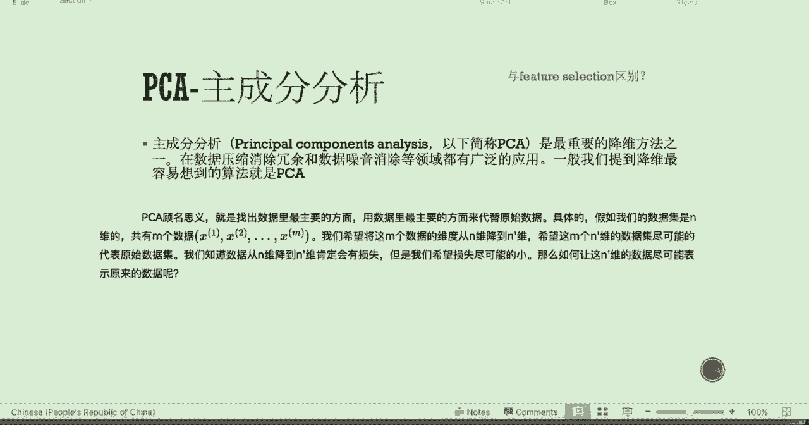

让我们来看一下下面的一个二维的一个，很简单的例子，那么也就是说一开始的时候是两个feature，那这个时候我们需要把它降到一个feature，也就是把数据从二维降降到一维，那么呢数据是如下图所示。

那我们希望找一个新的方向，那这个方向呢是旧的，这两个方向的一个线性组合，那么嗯它可以代表呢两个维度的数据，也就是列了一个这个方向之后，那把这些数据投影在新的方向上。

它可以最大程度地保留原来数据的information，那这个时候我们选取这个U1方向，那这个U1方向为什么好呢，我们有对于principal components，我们有两种解释方法，第一种解释是啊。

就是这些旧的样本点到这个就是新的主，第一个主成分U1的距离呢是最近的，就是距离的累和是最近的，那我们看到这个U1这根线呢，确实是贯穿了我们这一些点，就是最核心的这个方向，那么第二个解释呢是。

这些点在这个U1上的投影尽可能的分开，那么我们mathematical里解释呢，也就是说啊这些点在这个U1组成分上的投影，它的方差是最大的，那为什么呢，因为当然你看在这个U1方向。

把它们都投影在这些在这个U1这个位置上，那是不是它们在这个U1这个维度是最散色的，因为我们对于这些点来说，我们什么叫做啊他的损失解释损失尽可能小的，也就是说这些点它们本身存在一个方差，比如说是100。

那我们把它投影在这个U1方向的话，如果说在U1方向的方差是95，那是不是只有五这个方差没有被解释，那么这个方差呢，解释的越接近于原来的方差100，那就是说明我这个数据被压缩之后。

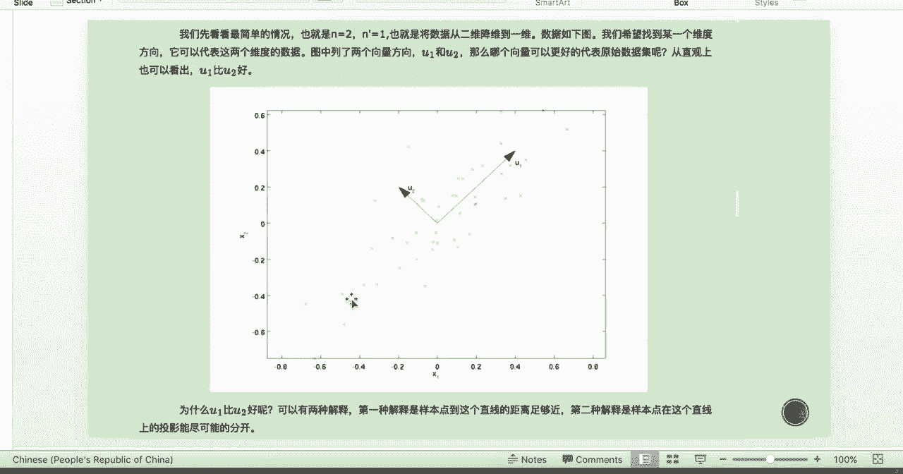

这个损失是越小的，那我们先看第一种解释的这个原理，也就是基于这个最小投影距离，那么嗯它的推导是这个样子的，就是说，假设呢一开始的这些数据都已经进行了中心化，也就是说均值是零，然后呢方它是一。

那么啊我们做好了之后呢，我们想要对他们进行一个我们之前说过的，Principal component analysis，就是他们原来的这些数据进行线性组合，得到新的这些基这些坐标系，那么这些坐标系呢。

他们保保证是它们两两之间要正交，也就是垂直，那么正交是如下两个条件，第一个是模为一，然后第二个是呢它两两之间的这个内积是零，那我们如何把数据从呃这个N维加上N撇为呢，那就是说我们一开始的这些满正交集。

如果全部投影下来，那么数据是没有任何损失的，但是你并没有达到降维的效果，所以呢我们就舍弃它的一些维度，把它降到从W1直到WN撇，那么这个原来的样本点xi呢，在上面的投影呢就是如下所示。

就是这个正交基方向乘以原来的这个数据点，那么就是构造出了一个新的数据点，那么新的数据点呃，我们把数据恢复之后，得到的这个值我们称为X8I，也就是说降维之后再投影回去，就把原来的数据点再表示出来。

那么我们考虑整个样本集，我们希望的是最小化样本到超平面的这个距离，那也就是呃我们的这些点。

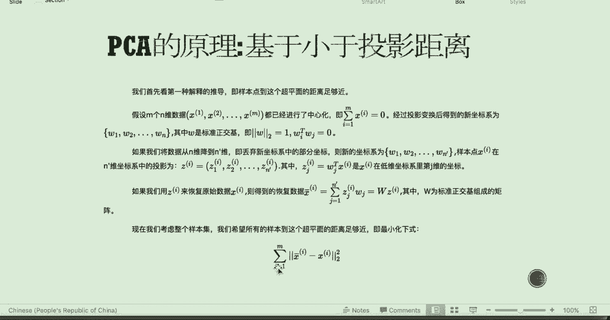

比如说这个绿点，那投影在这个上面呃的这个新的点，那就在这个位置，那么那就是X18I，那这个绿的点xi减去X8I的取一个模的平方。

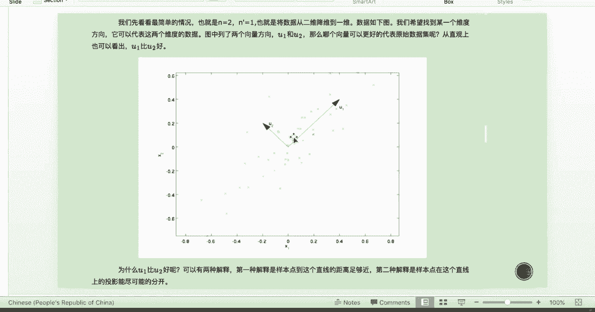

那就是它到投影的距离，也就是我们这边的这个表达式。

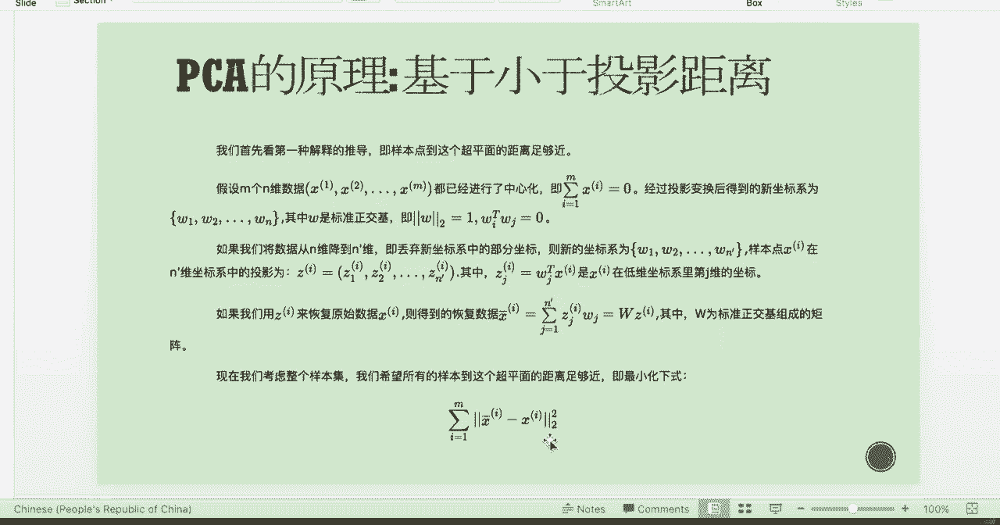

那把它们累合起来，也就是total的这个投影距离，那么我们要最小化上式呢，也就等价于最小化如下的这个表达式，为什么呢，因为这个W每一个这个WJ是标准的正交基，那我我们通过这个线性代数的推导。

我们可以得到如下这样的表达式，也就等于要最小化这个W转置乘以xx，转至W的这个t tr，就是它的G也就是这个对角对角圆的和，那我们最小化这个，并且呢它这些基底要正交，那我们用这个拉格朗日乘积法。

也就是要最小化如下这个表达式，那么最小化如下表达式呢，也就是他对这个W的，然后导数得是零，那我们对如下求导，我们就可以整理成如下这个形式，那我们可以看出这个浪姆达的值应该取多少呢。

如果把X乘以X转置看成是一个矩阵的话，那么这个其实就是特征向量跟特征值的，一开始的数学初始定义，所以拉姆达呢是这个斜方差，正因为X乘X转，这其实就是斜方差，正那是这个协方差阵的特征值。

那W呢就是它的特征向量，所以我们做主成分分析，其实就是对X就是原来这个数据矩阵，求它的converse matrix，也就是那个斜方差正，那求出写方差正之后呢，对它做啊特征跟分解。

Agon value decomposition，分解之后呢，我们把这个它的特征向量从呃和特征根，把特征根从大到小排列，那么每一个特征根对应的那个特征向量，就是主成分方向。

也就是每一个的WJ就是标准正交基的方向。

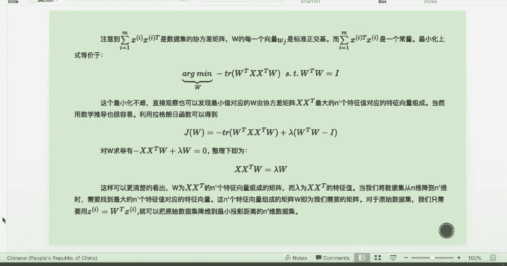

所以呢我们上图，这个we1对应的就是最大的那个特征根，它对应的这个特征向量的方向。

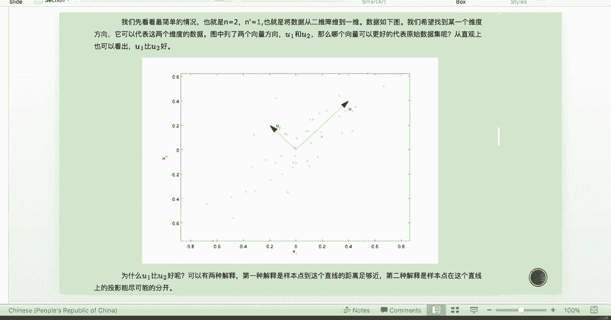

那第二种解释方法是基于这个最大投影方差，也就是呢在这个第一个主成分上的投影。

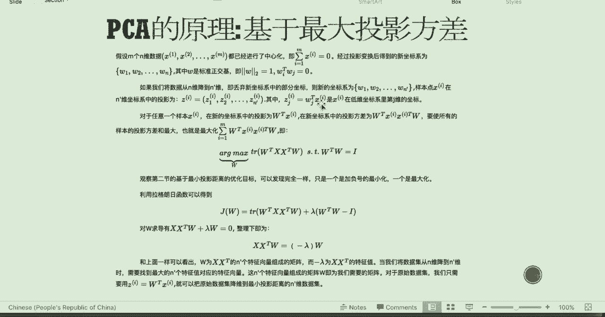

这些点的方差得是最大的。

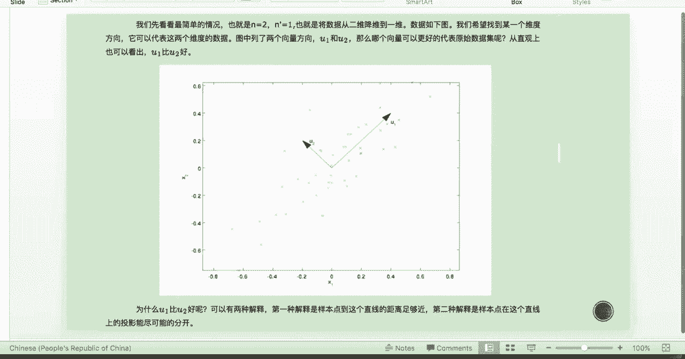

那么呃推理过程呢其实都跟上面一，就是跟上面的第一种原理是一模一样的，那么嗯唯一的区别呢就是，我们依旧是写成如下这个表达式，那么呃就是W转置乘以xi，是新的在坐标系中的投影。

那这个时候我们要最大化的是样本的投影方差，也就是最大化这个表达式，因为方差新的坐标是这个如下所示，那它的方差呢就是这个自己本身，再乘以它的转置，所以是如下的表达式，那我们最大化它的投影方差。

并且要满足这些正交基是这些基是正交的，那么依旧写成如下的拉格朗日表达式是这样的，记得那整理之后呢，依旧是我们的这个特征向量和特征根的形式，所以两种这个idea，最后推导出来的结果都是特征根。

就是协方差阵的特征根跟特征向量。

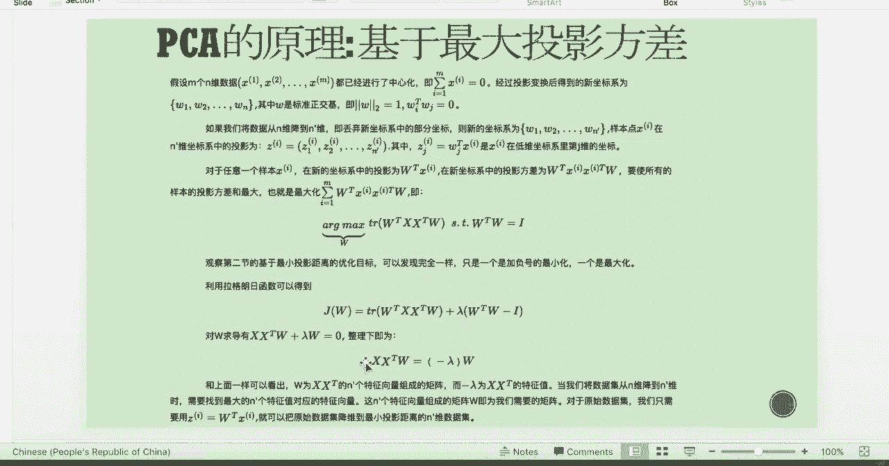

那么呢这个呢是aggon value decomposition，的一整个这个流程，也就是说嗯我们要对这些数据集进行降维，那一开始的时候是M为，那要降到N撇为，那我们怎么做呢。

一开始呢对所有的样本进行中心化，然后计算中心化后，样本的协方差矩阵X乘X转置，然后对这个协方差阵进行特征跟分解，然后我们取出N撇个特征值，对应的这些特征向量，那这个时候呢W1到WN撇其实是最大的特征。

根你说那么打一呃排一直从大到小，排列排到拉姆达N撇对应的特征向量，那么呢对初始的这个样本中，每一个样本xi这个点，那我们要转换成新的投影，那就是新投影称为ZI那它就是我们的基啊，乘以我们原始的这个点。

那这是算投影的，这个解析几何的一个最基本的原理，那我们就得到新的输出样本集Z1。

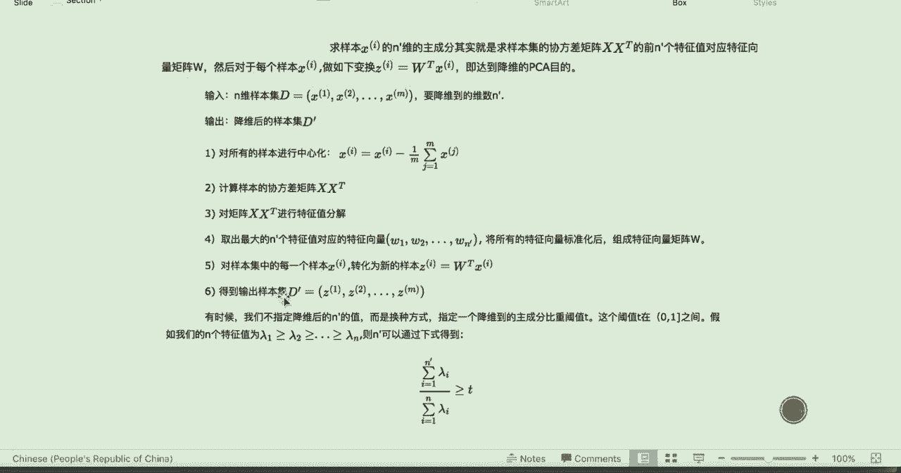

一直到ZM那这些新的输出样本集呢，其实也就是对应的这些点，在我们特这个特征方向上的投影。

那这个只是一维的，那如果是多维的这个特征基的话呢。

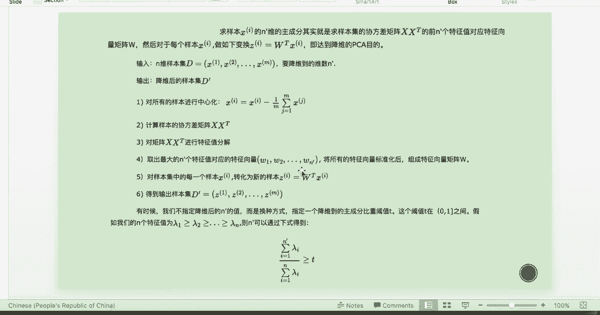

那就是W转置乘以XI了，那只是在上面这个图里面的W转置只是一个W。

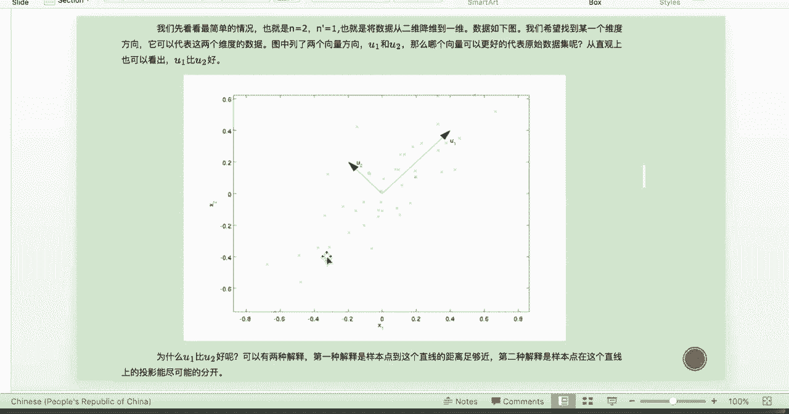

那啊我们得到这个之后，我们想知道，我们最终解释了百分之多少的方差呢，那也就是我们前N撇个的这个特征值，那除以呢total特征值的和，那我们一般会选取解释百在90%以上，就说明我们的这个数据呢。

能能够被我的这个PCA，就是这几个主成分非常的好的解释。

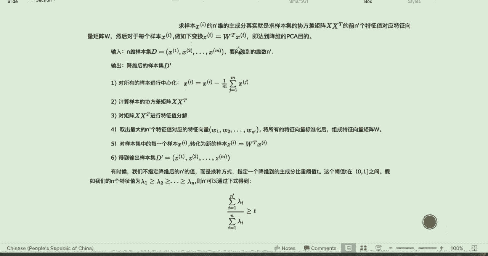

那么下面呢这一章的slides是一个二维的点，我们想用PCA降到一维特征特征方向的一个。

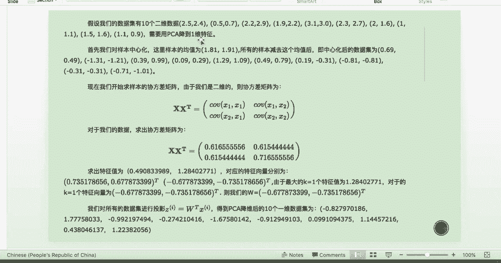

这个做法的流程，那也就是我们上面提到的这个流程的一个例子。

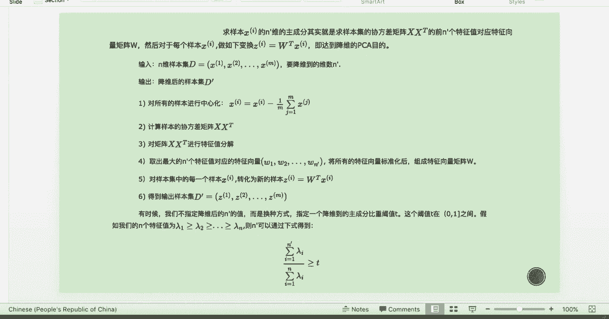

那么啊大家回去可以自己去看一下。

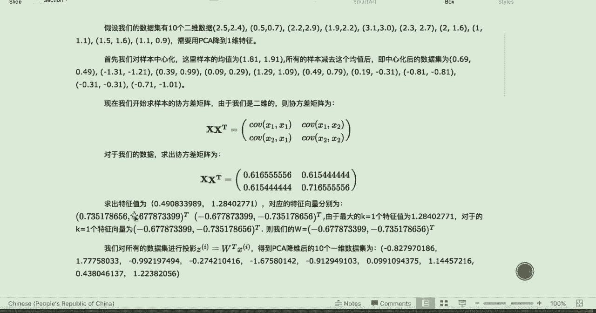

我们在这里就不多说了，那PCA算法的主要的优缺点呢是如下所示，就是它主要的优点是呢，它得需要用方差来衡量信息，不需要受别的因素影响，第二是各主成分之间正之间正交，这是我们最希望看到的。

也就是每一个新的feature，现在它们之间是不存在任何相关性的，那这样的话如果它们的相关性很高，我们就会出现我们之前提到过的多重共线性，那就会有很多很多的方差问题，那么我们的模型也不稳健。

那第三个呢是计算方法非常简单，主要就是应用特征特征值分解，那么它的缺额缺点呢其实很显而易见，因为这个时候我们的每一个新的方向，都是旧方向的线性组合了，所以说现在的这些方向本身就不存在任何意义，为什么呢。

就比如说一开始我们要解释gold，那X呢是比如说SNPFPGADOJONES啊，然后啊嗯比如说嗯oil啊gas，那现在呢你的第一个主成分反响就会变成，waited some of s p到chance。

然后go嗯跟这个gas，那么新的这个X1就是因为是它们线性组合，所以你没有办法解释，它到底代表的是一个什么东西，所以模型的这个解释性就会变弱，然后第二个是呢方差小的这个非非主成分啊。

很有可能它本身还是携带着一些information的，也就是说比如说你选取了前啊，五个principal components，那还解释了90%的方方差，那剩下的10%方差呢很有可能丢弃降维。

丢弃了之后就刚刚好是这10%，是这个压死骆驼的最后一根稻草，所以说呢也会存在着一定的这个呃，会影响模型的这个bias偏度，那么对PCA来说，它其实还是啊优点大过于缺点的，那么他对于金融上的一个用处呢。

就是在做我们之前提过的聚类分析，就在equity聚类之前，其实我们还是希望每一个聚类的feature之间，是要正交的，所以我们可以对这个就是聚类的feature x。

先做一个principal component analysis，那我们用前K的主成分，就新的主成分呢作为新的feature，然后再做CLUSTERY，那这样子cluster出来的这个这些云团之间。

可能他们云团自己本身很很那个centralized，然后云团之间的距离又会比较大，那么这样的划分呢就更为清晰。

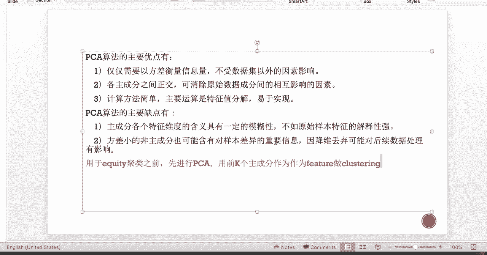