# 吹爆！这可能是B站最完整的（Python＋机器学习＋量化交易）实战教程了，花3小时就能从入门到精通，看完不信你还学不到东西！ - P2：第02节-Python for Finance 常用packages 学习I - 凡人修AI - BV1Yx4y1E7LG

今天让我们来上Python量化金融的第二节课，就是Python常见的library的应用的第一部分，那么今天主要介绍的有三块内容，第一块是单排库的应用，主要是关于如何创建一个初始数据组。

如何使用数据组呃，标量包括如何用index索引数据，包括数据组的一个常见的操作和函数的调用，那么第二块呢是高阶的library pandas，主要面向的是数据框，因为数据框在我们之后作为量化交易的一个。

数据存储上是至关重要的，那么第一部分内容是数据框和文件的阅读导入，其次呢是如何用index进行索引，并且索引的层次结构，那么接下来呢是包括选择删除插入添加的，第四块呢是数据如何对其如何排序。

包括对缺失数据的处理，那么再简单介绍一下，关于汇总统计量的一些常见的调用，第三块呢是关于画图，也就是数据的可视化，那么第一块是主要介绍一下，常见的画图的各种图形结构，包括如何加legend嗯。

Title，包括XY轴的scale，那么第二块呢是介绍如何绘制多个图，并且进行更为美观的排列，那么第三部分呢是高级的绘图，包括data frame，数据框的绘图，包括呃3D绘图等等。

那么接下来让我们来看一下具体的Python函数嗯。

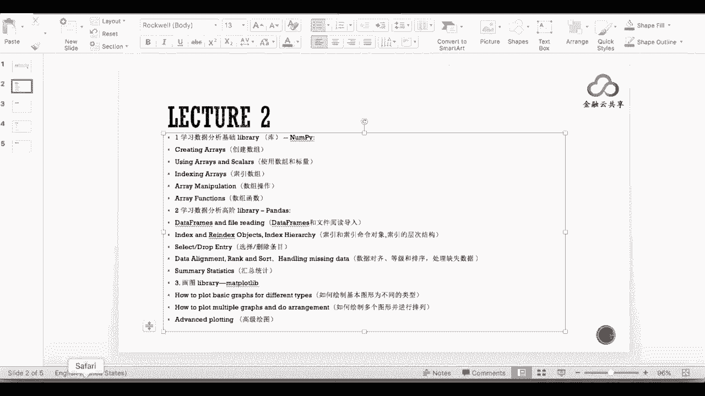

第一块呢是对于我们的这节课，要用的lab的一个导入，那么第一行呢主要是这个命令呢，是让我们画出来的图，是直接插入在我们的就比较NOBOOK上，而不是直接弹出，这样呢有助于更好的保存。

那么首先让我们来看array，也就是南派的这个数数据组的创建，那么这个是最简单的两种创建格式，第一个是当派点arrange10，那么它会创造0~9的整数，那么这个在画图的时候会经常用到。

那么第二块呢就是number派点array，那么array里面写的就是我们上一节课提到的list，那么可以随意的写你想要的数据，或者是string字符等等等等都可以。

那么data塔呢是啊南派点random，这个包里面有各种各样的嗯随机数的生成器，那么啊啊round n呢是产生一个零一标准正态，那么二三这个参数呢是它的size，也是我产生一个两行成三列的一个标准正态。

接下来呢是几个常用矩阵，那么首先呢第一个就是零矩阵，也就是那派点zero，那么list里面写的是我这个零矩阵的维度，嗯这个呢是一个简单的例子，那么第二个呢是进行一个创建一个空矩阵。

那么里面的list也是一样的，是我的维度，那么呢创建零矩阵跟空矩阵的区别是，零矩阵一开始的时候是开辟了一个零的内存，并且把零放到里面去的，但是空矩阵的话它只开辟一个空内存。

所以说空矩阵对于你先创建一个array之后，要往里面，比如说做一个for loop，往里面对于每一个entry都要都有一个命名的话，嗯如果建立空矩阵对内存的损耗是最低的，那么第三种呢是单位证。

也就是I那单位正的话里面只有一个参量，就一个数字代表的是嗯N乘N的，这个N2的话呢就是两行成两列，因为单位阵是方阵嘛，所以它的size只有一个变量，那接下来呢是简单的array的运算，首先我们先创。

随意地创造一个这个两行成三列的一个矩阵，那么R乘以二呢就乘一个常数，那也就这么一个元数乘二，那么要特别注意的是，这个array乘以array，其实这个并不是一个，我们我们常时见到的是一个矩阵的相乘。

这个其实是array的每一个元素，跟后面的这个你要乘的东西的，每一个元素都进行了对称，所以好这个跟矩阵乘法是不一样的，那么接下来呢，这个是每一个元素都求了一个反数嗯，这是一个常见的一个数值运算。

那么接下来矩阵之间的运算会待会提到，接下来呢要讲的是index，也就是如何索引，那么Python的索引呢都是从零开始的，也就是array1，其实取它的第二行，如果它是一个二维矩阵的话。

那那么array10呢也就是取它的第二行第一列，那么取它的一个元素，那么还可以是一个整体的选取，那这个零逗号0~2呢其实是选取它的第一行，那么多少列呢，这个0~2其实是第一页，第一列和第二列。

也就是比如说嗯a to b，那么它是取从DA列到dB减一列，接下来让我们来看一个，通过行名跟列名进行一个选取的，比如说我们创造一个人民的一个array，那么首先呢我们在首先呢。

我们再创建一个关于这个data的一个random number，前面提过的，那么它是七行乘以四列的，那么我想做一件什么事情呢，首先当这个names它的这个每一个元素怎样，它的元素等于bob了。

那么我就取满足以下条件的这个data，那么names等于bob的index几呢是零，那么意思就是取的是我这个data array的第一行，跟第三行，那么如果我想取相反呢，当names是不等于bob。

那么也就是上面data的这个补集嗯。

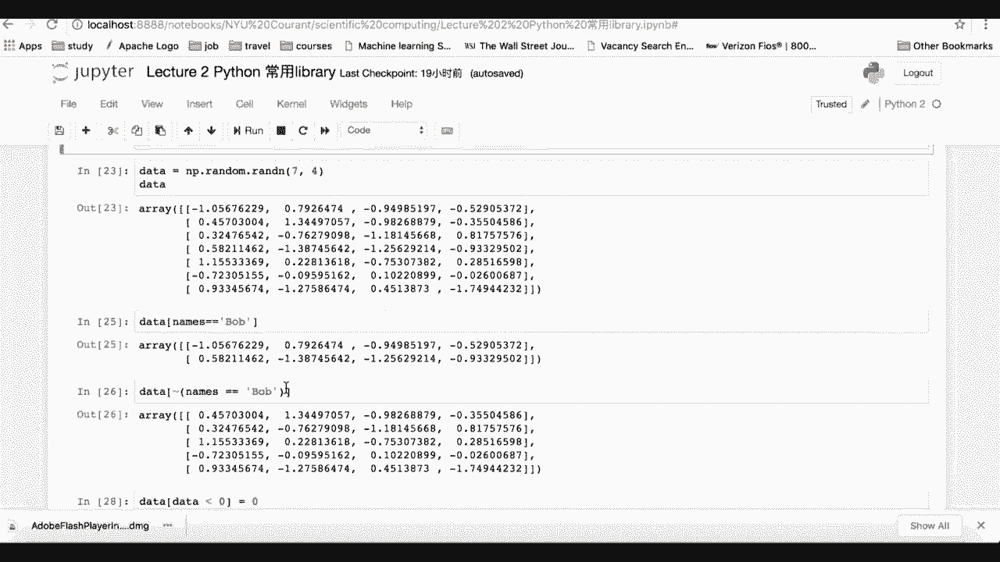

那接下来呢还有一个我们金融上比较常见的是，比如说我想要取所有的当贝塔，这些圆entry等于比零小的时候呢，我就强行让它等于零，那么比零大的和等于的，那就是原来的值，那么我的这个括号里面的条件就写。

data小于零的时候，那么它的元素等于零，那print data out，那也就是做了一个我们想要做的事情，那么接下来的还有一种的选取是，如果你要取列的话，也可以这样把它统一选取出来。

这个的话这些这些这些index是可以随意的，就不一定说要从小到大，那么也就是取一，其实最后一个位置，那么零是第一个位置，那么呢二呢是第三个位置，那么它就按照你列的这个嗯，最后一个位置。

第一个位置和第三个位置进行排列，嗯接下来还有一个是reshape，一个比较常见的，也就是一开始的时候我创建一个ray，那么我不知道它应该是几行乘以几列，或者说知道了，但是我现在他不满意。

那么我点reshape，八四的意思就是我把它重新重组成嗯，八行乘以四列的，那么要注意的就是之前的时候，你举证的这个每一个entry的总数，必须是你后面size的乘积，要不然会报错嗯。

接下来介绍一下矩阵运算，也就是跟前面的乘除，一个常见一个scale是要区分开来的，这个是矩阵跟矩阵之间的运算，那么我们首先先创建一个，首先是一样的一个初始的array，那么是三行乘以五列的。

那第一呢可能我想对它进行一个转制，这是我们经常要做的一件事情，那么呢就大T大写的T，那么就变成武汉乘以三列的，那么如果要矩阵相乘呢，大家要记住了，不是矩阵相乘的时候呢，就不要点成嗯A星号A。

因为呢如果是A星号A的话，它是每一个元素都要相乘，那么正常的矩阵相乘的法则应该用到的A，并且要注意的是A点的转置，要不然的话他不满足矩阵乘法，因为前面的矩阵的列，必须跟下一个你要乘的矩阵的行呃。

函数要相等，那么如果我要对矩阵求逆，首先得保证它是方阵，其次要保证这个矩阵可逆，那么假设我创造这个矩阵是可以求逆的，那么是调用这个NP点啊，LLAN这个下面这个SUBLIBRARY点INV。

就是对矩阵求逆嗯，如果想对矩阵进行开根号或者是指数，或者是求log的运算的话，前面都要注意的是要带一个N派点。

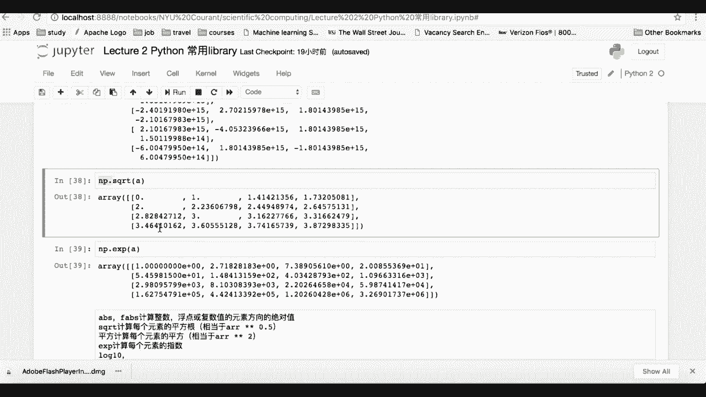

那下面这边是一个常见的南派的矩阵函数，的一个介绍，包括取每一个元素取绝对值，取平方，取指数，取log10对数或者二对数，或是自然对数，或者是计算符号啊，计算selling啊。

计算floor就是向上向下取整，或者是判断是不是NA或者判断是不是无穷，或者是三角函数求逆等等，一些常见的运算都简要的列在这里了，那接下来再介绍一下在三维画图中，我会常见的用到的一个南派的一个函数。

叫做mesh grade，那么首先你先建立一个一维的一个数组，那么从-5~5，那么我的步长是多少呢，是0。01，那也就是1000个点，那么我取了一个N派点，mesh grade之后呢。

他给我报出的其实是一个二维矩阵，那么二维矩阵中每一行的元素向下呢，也就是你这个步长的一个递减的一个过程，然后XS的话也就是换了一个方向，那比如说我现在要构造一个这个二维的一个圆。

所以说应该是X方Y方开根号。

那么我把它plot在图像上，这个plot待会会讲到，那么这个用的其实是一个密度的plot，所以说啊在中间密度越高的时候，它就越黑，那么你对Z就是X平方加Y平方开根号。

等一个plot的话，那么一个灰度矩阵嗯。

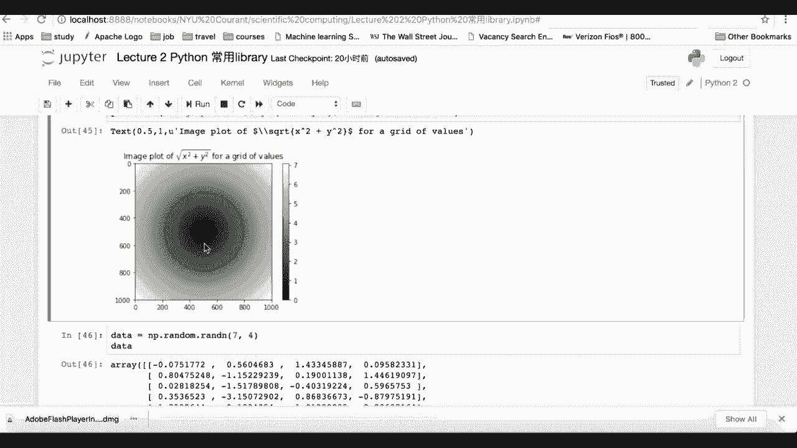

在可视化的情况下，就是以下这个样子的，那么接下来我们再介绍一个这个where函数的用法，也是一个非常非常常用，而且很方便的一个函数，那么首先一样的，我们在嗯构建一个标准正态是七行乘以四列的。

那么如果我们想当data塔，每一个元素比零大的时候，我们就把它赋值为一，反之就赋值为一的话，那就就用这个N派点where把data放在第一个元素中，那么第一个元素是true的时候要负的值。

那么第二个呢就是false的时候要负的值，那么就是以下这样的表达式，这个在我们后面做分类器classification的时候，我们把这些数字元素换算成以下的这个类型，类的变量的时候，会常用到的一个函数。

那么如果我是这么想的，想说如果他比零大，我就保持原值，如果比零小，我就把它全部命名为一，那么只要在第一个元素的位置写上data，就是表示是原值了，那么我们接下来再介绍一下常见的number派。

会用到一些统计量，那我先初始化一个向量A，那如果呢我要对它取命，首先essays等于零的，意思是我是每一列做一个mean，所以说是五个元素的一个array，那么如果反之，我要对每行求一个命呢。

那就是access等于一，也就是access等于一，是对行做前面的函数，那么S等于零呢，就是仿真是对列做，那同理有mean，我们就有some也有CONSUT，其实CONSU是非常常用的，也就是累和嗯。

因为南派的这个consume的效率比较高，比我们直接写for loop类和来的效率高，所以相当常用，那么还有再算，我们后面经常会提到一个volatility，也是一组数据的一个标准差。

那么就是点STD嗯，还有的话是有时候呢，比如说我想看一看我这个array中是否呢，这些元素呢是unique的，那如果不unique呢，我就保持保有它第一个量就好了。

那我们就安派点unique names，那就它把它唯一出现过的元素提取出来，其实其实这张派点用NEX跟set，这个函数是一样的，也可以把中间的这个list先转化成set，然后再取list。

其实是达到一样的效果，但是这个有内函数呢就可以一步到位，那么还有一个是嗯any跟all的一个用法，也就是any跟all的话得用于嗯波令，也就是零或者是1true or false的一个array。

那我在做一件什么事情呢，是我这个NAMS如果entry等于bob的话，我想看有没有entry等于bob呢，那点any就是给的是true，那么点or呢就是是否所有的都等于bob呢，那给的是false。

那么这个对于当我们实行一个大的数据矩阵，没有办法，一个一个元素看到的时候，这两个函数非常之常用，然后接下来再简要的介绍一下分解，那么分解呢比较常用的是一个qr分解，和一个特征根分解。

也就是egon value decomposition，对于qr分解的话，调用的是是嗯，依然是这个跟矩阵求逆是一样的一个包，就是LINALG那点QRAA，就是你要分解的一个矩阵。

那它会分解成一个Q矩阵跟二矩阵，那么Q矩阵呢是正交正，那二矩阵呢是一个上三角阵，那它一个常见的用法就是当我们解方程的时候，当X等于B，我们常见的做法可能是对A求一个逆，那么X就等于A逆乘以B。

但是呢这个计算量比较复杂，那么我们对A进行一个qr分解，那么大家要知道嗯，正交阵的逆呢跟正交阵的转置是一样的，那么求转置呢比取逆要来的容易非常多，那么我们就可以得到IX就等于Q的转置。

乘以B那这个时候呢大家要注意的是，R是一个sin3角阵，也就是他的最后一行其实是XN，直接等于B的最后一个位置，就等于BN那么XN就可以解到，那么它倒数第二个其实是啊B1，比如说乘以XN减一。

加上B2乘以XN等于BN减一，那么只剩一个二元二元的一个线性方程，那么你知道了，XN代入这个D导数N减一个方程，就可以直接解出XN减一，那么以此类推，所以这个上三角阵的解方程是迭代的，相对容易的。

不需要做高斯胶原法，那特征跟分解在主成分分析，包括呢多维正态模拟，包括多重共线性的判别上都是非常常用的，那么特征根分解用的是EIG这个函数，那么它分解成两个，一个是D1个是V，那么D呢是对角阵。

那么它的对角线其实就是特征根，那力呢是它对应的正交阵，也就是说特征根分解最后的表达式呢，其实是这个A矩阵，等于呢这个V也就是正交阵的转置，那么乘的呢是这个D也是一个对角阵，那么呢再乘以，这个正校正本身。

那么这是特征根分解的表达式，那这个LNG剩下的还有别的分解，包括嗯SVD，也就是奇异值分解，是当特征根分解不可食用的时候，那么用的是奇异值分解，包括别的，像CHOLESKY分解呀。

那我常用的我都列在这了。

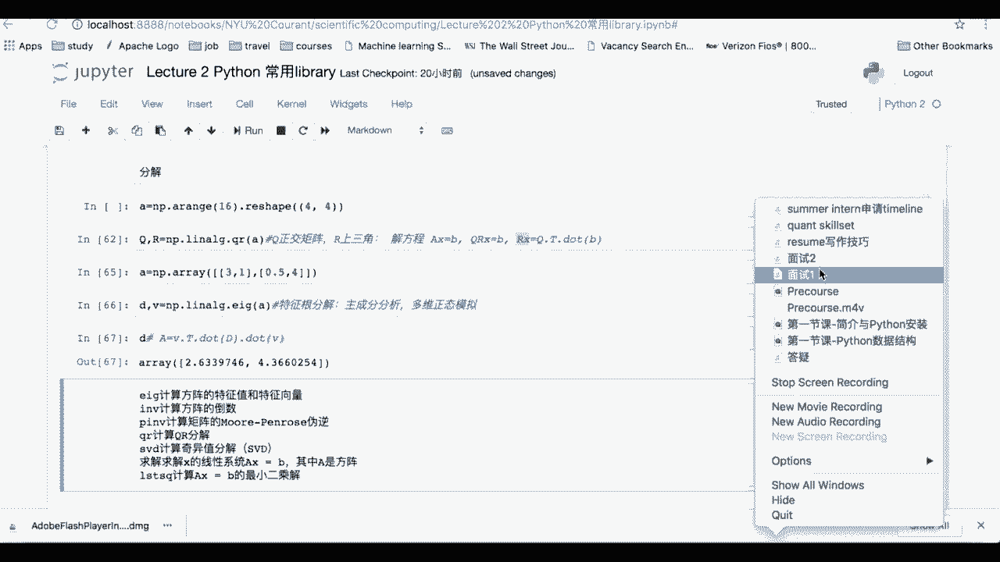

现在让我们简要的介绍一下pandas数据框，那pandas数据框所需要用到的很多知识点，比较零碎，所以让我们一个一个的来简单介绍一下，那么首先建立pandas数据框有很多种方法。

那么我们应用中其实比较常用的，都不是我们自己建立的，都是去读取text或者csv data，那么如果对于比较小的数据框的话，那么基本上的做法是先建立一个dictionary嗯，像我们第一节课说到的一样。

我们建立一个字典，那么对于每一个键值key，那么有它对应的value，那么键值key呢，之后就是作为pandas数据框的column name，也就是列名，那每一列呢都是你对应的建好的。

value的这个ARRELIST排成的一个克朗值，那么可以是数字，可以是string，也甚至可以是一个列表，那么这个frame就是基于data，这个dictionary里建立的一个数据框。

一个简单的数据框，那么比如说当我这个数据框比较长，但是呢我现在只想简略的看一下，他的title和他的好呃，列名啊，行名啊，包括每一个点是个什么格式的，怎么办呢，比如说当我们读的是一个非常大的CSV。

我们不可能直接扣一个frame，把它直接打印出来，那么这个时候呢我们就会call frame点head，那么它就会展示它的前五行，那会把所有的列都展示下来，那么噢我知道，那么它有包括三个feature。

Pop stay and yeah，那每一个人长的都是哎像数字，然后呢string中明，那么年份，接下来呢讲一下，它是以我们如何改变行名或者是列名，一些常见的操作，那么这个0~4呢是它的default。

就是系统的初始化设置，那么这时候如果我想把它改变成A到F的话，那直接call fm index等于一个列表，那么这个是你想让它成为一个数字啊，或者成为一个string啊，都可以的。

嗯那如果我想改变column name的话，那么也就是点data，data是我的dictionary，那么你在创建数据框的时候，columns等于里面写的string呢，就是你对应的每一个按顺序下来的。

column name的名字，那我取名为年份state，也就是钟鸣，还有一个这个pop，那如果我想知道我这个frame的，column的名字是什么，比如说我没有把这个frame打印出来。

那么就call点columns，那想知道它的index的名字现在是什么呢，那就点index嗯，当如果我想获取它的某一列信息，比如说我知道还有yday and pop，那有两种方法，一种呢是中括号。

然后这里面写的就是你的列名，那么我想索取pop，那他给我打印的，先是一个panda series的一个对应的啊，这个行名包括他这个pop每一行对应的数据，还有一种方法呢是直接点这个feature的名字。

比如说上面有一页，那么就点页出来的这个嗯series是一样的，接下来介绍还有index的选取，删除增加和替换，那么我们先看一下，这是我们的FRAP的，记住它是一个这样的格式，那我index呢有两种。

一种是i lock，一种是lock，那i lock跟lock的区别呢是i log是用数字，用index的number来索取的，比如说我想索取它的第二行啊，第页三列，那么那也就是B这个call了啊。

B这个肉那对应的是第三列耶，那就是2001，那或者是我可以成片的集成索取，比如说是从第二行到第三行的第一第三列，那么呢也就是BC这两行，那就是出一个这个series。

那lock呢是用我们index跟column的名字进行索取的，那么我call的是AC，也就是第这个行名为A的和行名为C的，那么出来的是一个这样的data frame。

那如果我只想取state这个column的话，那么逗号后面呢就放的是com的名字，那也可以整集成数据，比如说逗号color嗯，column是state，那就只取了一个，那么如果是state逗号一页的话。

那就是这两列其实都是会被索取出来的，那如果我想要嗯抛弃某一某一行的话，那么直接frame点drop呃，中括号里面写上的是你的index呃，index的名字，那就把A这一行整体删除了，那么如果想删除列呢。

用的是这个DEL那DL你frame也是一样的，跟我们获取列的信息是一模一样的，也就是frame中括号里面写上的是com的名字，那这个时候呢pop这一整列就删除了，那如果我想增加呢。

比如说现在我想把pop这一列增加回来，那么也就是FRAP一样的，跟delete是一模一样的，也就是frame中括号带上color名字，那么等于这个时候呢，是用一个list来存储这一整列的信息。

那这个时候你call frame，那pop这一列就回来了，那如果这时候我想想新增加一个行的，新增加一个行，其实会比增加量要稍微麻烦一些，也是要加入一整行的一个dictionary，就是字典。

那用的是append这个函数，也就是data frame，Append，append是什么呢，我们需要命名的是state，这个时候他这个key他对的是什么值，那Y呢对应的是什么，pop是对应的是什么。

Define，好之后呢，如果选的是ignore index，也就是说直接我不在乎这个时候把它放在哪，并且index叫什么名字，所以这个时候我新加了new jy这一行之后呢，所有的行名都恢复了初始设置。

也就是default，那def index如果是false呢，那就直接在F后面它新加了一行，并且这些index的名字是不会变的，那如果我想通过条件索取，而不是用的是lock和i lock的话。

那这个时候在FM中括号里面，比如说我想选取它，一页等于2001的这一些数据条，那就是frame点页等于2001，那这个时候呢，就把1月等于2001的行给取出来了，那如果是想让state不等于的话。

那就是感叹号等于原last stay不能用HILE，就是这样的一个索取格式，那就把state除OHIO之外全部present下来，那这个时候如果我想进行一个局部的命名。

比如说嗯我想让pop这一列啊都变成空值，那有两种方法，一种是呢点i lock pop等于NI，那么这个是一整列等于空的，或者我上面还想呢让叶等于2001都等于空，那么这个时候可以直接在后面写啊。

等于南派南派点NA嗯，那这个样子的话，这一列就是你选取出来的这一列，那么他们就会全部都等于空值嗯，下面来介绍一下一些简单的一些函数，如何应用到南派的每一个列中，首先我先创建一个frame。

那如果呢我想把每一个值，action的值都把它变成它的绝对值，那么直接这样用N派点f solute value是可以的，或者像EXP啊什么的，像我们刚才前半截讲到的N派。

还raid的一些常见的函数的调用，那如果想用一个自定义函数的话，就得使用apply这样的一个函数了，apply的第一个元素呢，写的是你自定义或者是系统自带的函数，那么第二个元素呢你可以写。

想把它应用到data frame的行，或者是data frame的列里面，也就是啊X等于零呢，也就是运用到哪一列种，所以它是B列，它做了一个最大值减最小值的D列跟E列。

所以present出来的结果是一个panda series，那么如果xx等于一呢，它就是每一行做，所以information就是行名带函数的结果，那我也可以专门的对某一列做，比如说我想对E这个列做一个。

每一个元素都把它打了一个平方，那么也就是fan点一，这个时候用的是map map，就是像一一对应一样的，那么map这个时候你你可以像前面一样，定义一个F函数，在这个函数比较简单，你就可以用拉姆达函数。

像我们上一节课有简单的介绍过，这个拉姆达函数，拉姆达函数呢就是在一个方框中，直接定义一个函数，第一是函数作用，圆叫X那么它是怎么一一对应的呢，X就对应的是X的取平方，所以这个效果也就是把E这一列。

每一个元素都打了一个平方，接下来介绍一下salt salt的几种方法，第一种呢是salt index，sun index x等于一，也就是说对每一个列对列名进行salt，那这个时候。

如果access等于零，也就是对航母进行salt，那么这个时候就根据字典O放在前面，然后是T然后是U对行ING进行一个重组，那还有一种我们更为常用的其实是sort values，比如说这个时候。

我想按照D这一列进行一个大小排序，我想把D小的就放在前面，大的呢放在后面，那这个时候sort values你要define by什么，by可以不仅仅by d，如果是by d逗号E的话。

也就是首先先看D这一列，那如果说比如说origin的这个位置是1。9，那嗯OHIO这边也是1。9了，他就再看E再进行比较，所以这个顺序，就现在这个data frame的顺序是基于D，从小到大进行排列的。

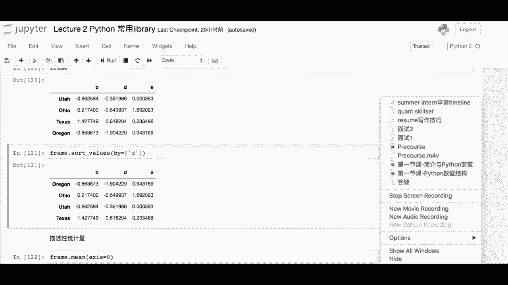

唉我们介绍一下描述性的统计量，那么其实是跟array是几乎一样的，但是要注意的是嗯关于不同的轴之间的，首先呢是取均值，那么xx等于零呢，也就是每一列，那么X等于一呢，也就是每一行。

那么还有一个index max，index max的意思是比如说xx等于零，那么它也就是看每一列，它每一个元素最大值的时候是在哪一行出现的，那么X等于一呢就是反制嗯，比较常见的爱用的是describe。

那describe呢就会把常见的统计量给出来，比如说有多少个数啊啊均值呀，还有这个stand deviation，就是放呃都很差，最小值还有二十五五十七十五个max，这五个分位数。

也就是最基本的常见的这八大类常见统计量，那么对于金融数据中，还有一个比较常用的是percentage change，也就是算这个return算收益率，那么它的default呢就是对于每一个列算。

那么这个时候D还是NA，那么我们常见的是后面再会带一个点drop n na，那么它就会自动把第一行给去掉了。

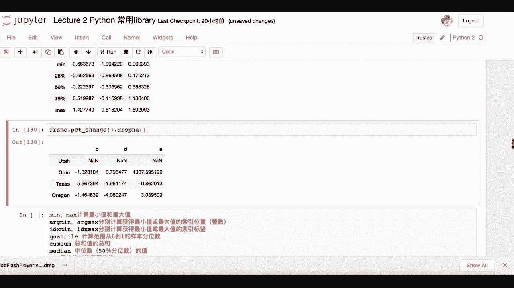

那下面这个列表列出来的，是我们比较常用的一些描述性统计量，包括最大最小值，还有框套，就是分位数，然后呢总和值中位数，然后包括方差，标准差啊，偏度啊和分度之类的。

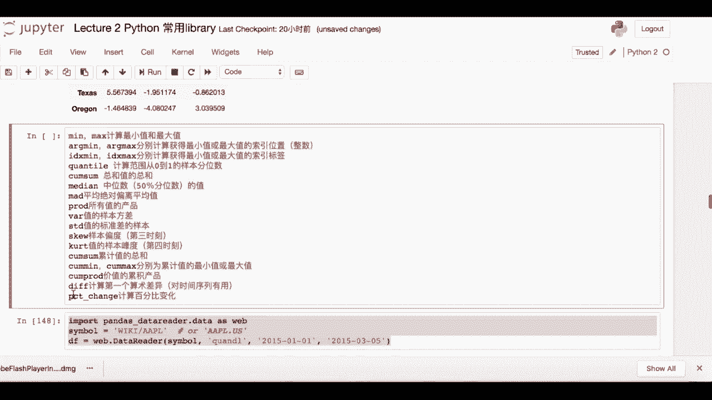

还有一个就是取这个difference，就是差值和百分比，那接下来一个很重要的一块内容呢是教如何读，从web上，从网络上读取data，那么我们要import的是panda，点data reader。

那da reader呢这function其实很容易用，第一个位置呢是我们的symbol的名字，比如说嗯苹果呢就是apple，谷歌的话呢就是嗯GOG，也就是他们的股票代码，那第二个位置呢写的是数据来源。

比如说有框do可能还有像雅虎啊，嗯亚虎finance，那就是雅虎或者呢还有像google都可以，那么这边呢是从宽度上获取数据，那么第二个第三个位置，也就是起始跟终止的时间。

那嗯为了保险起见，因为框斗其实它的时间顺序是从最近的，排到最后的，那么我们比较习惯看是从小到大。

包括算这个生育率也比较方便，所以我们会用salt index那打印出来的一个。

具体内容是这样的，包括啊open a higher roll啊，那我们比较常用的是clothes或者是adjust。

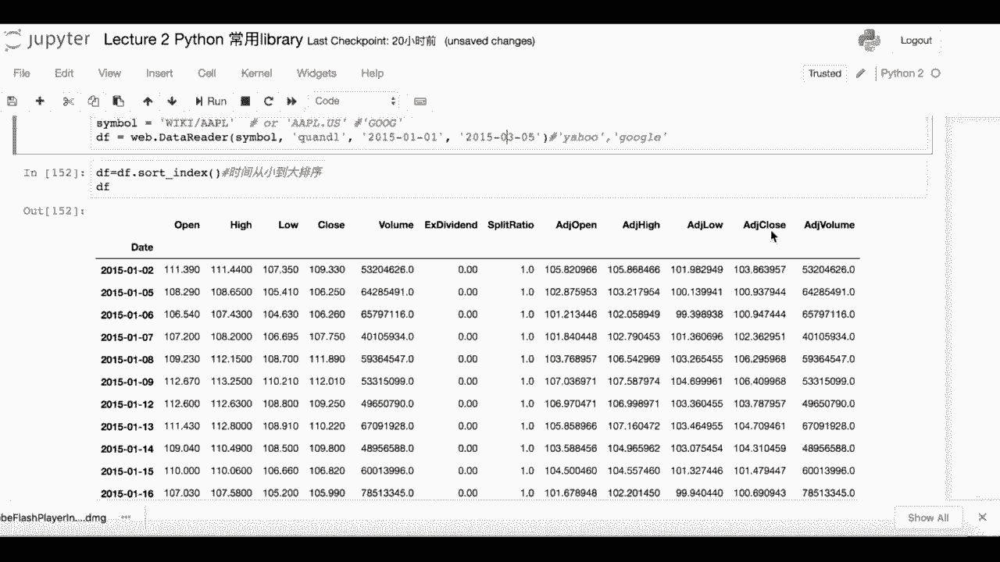

clothes和adjust volume这两列的数据，那当我们要做一个return分析，因为我们做后后续的包括一些金融的预测啊，包括一些股票交易的策略，我们基本上是不会使用close。

也就是说价格我们一般会使用收益率，因为收益率呢比close来的更加平稳。

所以我们call一个percentage change进行进一步的分析，那有时候可能会看不同变量之间的相关性，就假设这里是各种的股票代码的话，那么点CORR也就算correlation相关系数。

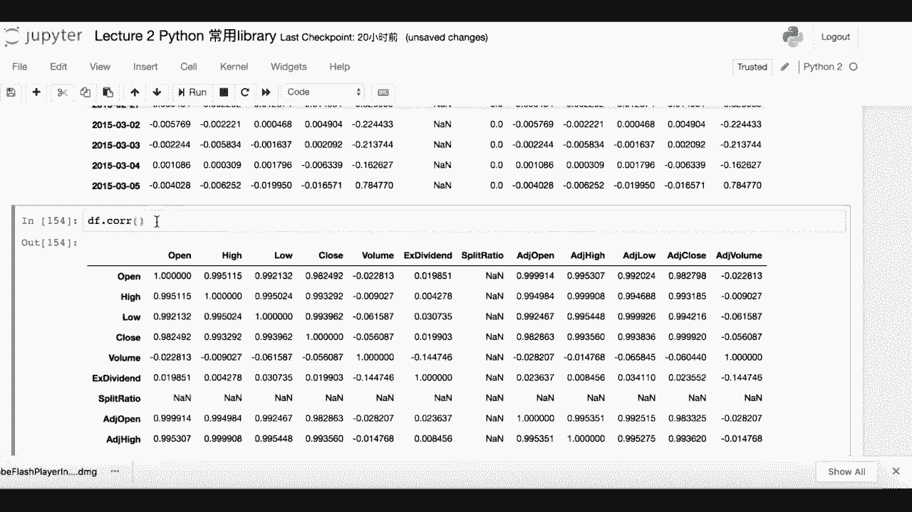

那接下来我们要讲的是。

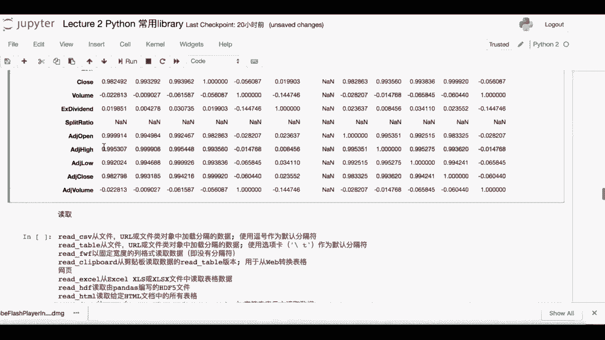

对于一些现有的我们的文件进行读取。

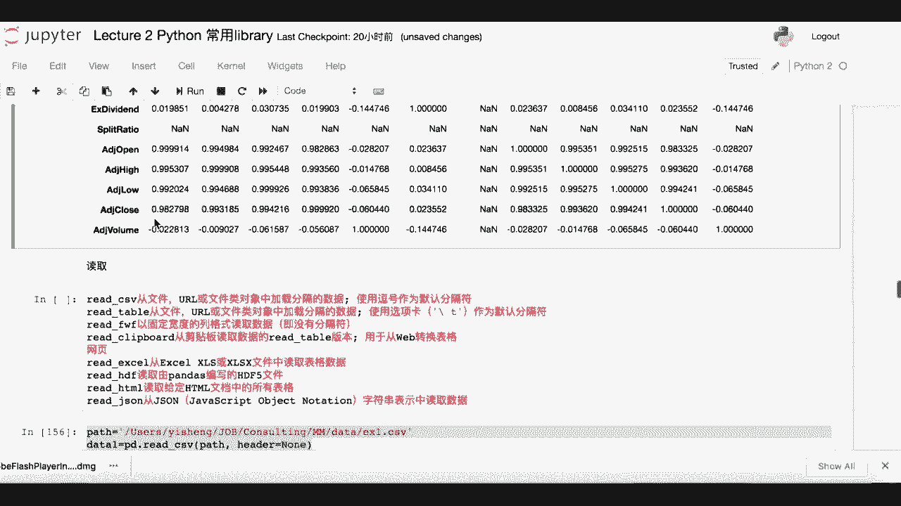

那么常用的是CSV嗯，table的话是基本上是都可以通用的，然后包括excel，还有包括JSON data。

因为现在很多是用JAVASCRIPT写的，那首先我们先看下读CSV，那么嗯用的是panda点RECSV这个函数，那么第一个位置呢是我的这个CSV储存的路径，包括CSV的名字。

那么当header等于none的意思呢，也就是我默认我读进来的嗯，嗯CSV是不带列明的，那么这个时候它就自动把我们第一个位置，当做是我们的第一行data开始了，那当然如果我们有我们的CSB是有列名的。

如果没有列名的话，我们heather等于now，那么我们自己取一个names，比如说我知道这个是state和google clothes，那么就是以下情况诶，当我读出来之后发现。

因为我的第一行这个数据格式是有有名字的话，那这时候header可以等于零，也就是告诉这个读取器，我的第一行就是作为我的head，那什么东西作为index x。

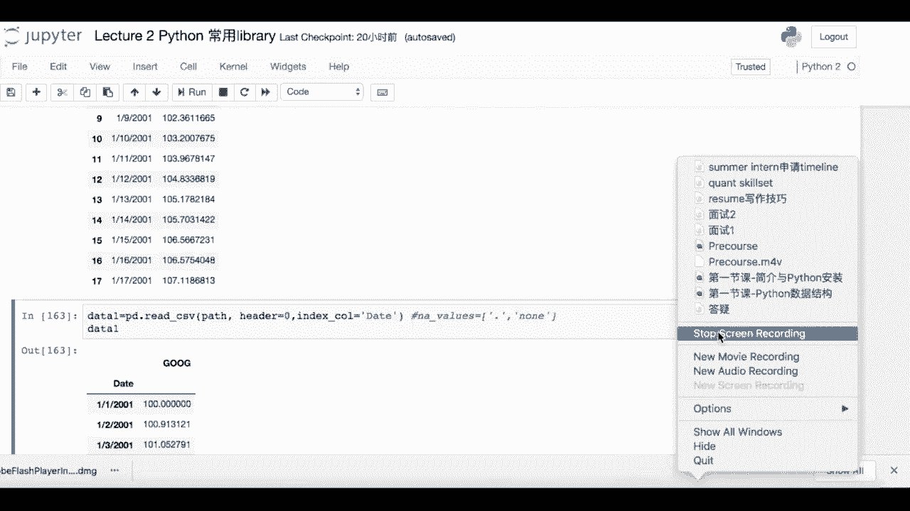

有时候呢我们还需要呃，定义我们的index叫什么名字，像上面我们比较希望我们的index，直接以我们文件的日期作为我们的index，那么我们这边就要specify一下index。

column等于date，那有的时候呢我们还遇到会遇到NA值，那我们可以在里面加入n a values等于点，或者是now或者是等等等等，就是你文件的NA值是什么，它就会把这些东西识别为NA。

那如果想对CSV写出的话，那就是data frame点to csv，那么里面写上你的路径，包括CSV，你要取名为什么文件就好了，那接下来是读excel。

那excel的话column name也是header和index，column是一样的，那唯一的区别就是因为excel可以有很多的 name，那么新name呢，比如说我有一个戏叫google。

有个系叫FACEBOOK等等等等，那你要读这个google，那就是新name等于这个google的，就在这个地方定义一下就好了，那当我数据读取进来之后，很重要的是对缺失数据的处理。

比如说我现在有个叫data这个data frame，它长这个样子，那首先我们可以选择把含NA的都drop掉，那么就点drop n a，那它的default的方法呢，其实是把所有行NA的行都删去。

那如果如果这个时候我想只删除一整行，全是NNA的，当有别的NA就不完全是NA的话，依旧保留，那么就要在里面定义SS等于零，那也就是对行来说，那如何呢，当一整行是ONA的时候才把它删除。

那么就是如下的这样的一个表现形式，那还有如果我这个时候不想删除，而是做一个填补缺失值的话，那非NA等于零，默认的就是只要一遇到NA我就把它替换成零，那这个时候还可以定义每一列的NNA，应该怎么处理。

那这个时候呢就是对于这个title为一这个列，那么只要升A我就替换成6。52的话呢，只要升A我就替换成三，那就是如下的这样的一个形式，呃有的时候呢我们更为智能的是，我们希望尤其是对于金融数据。

我们希望用每一列的均值来进行填补，那这个时候FUNA里面要放上的，那就是你每一列每一个column对应的均值，那就用到我们之前讲过的这个描述，统计量，就data frame点min。

那xx等于零内就算出每一列的均值，那这个下面展现的形式就是嗯，你看比如说第二列的均值是负的3。2，那么第二列呢，只要是NA就用负的3。2来填补这样子的，那有时候还会遇到一些重复项。

那么我们会进行删除或者是填补，那如果我们直接调用的是drop duplicates的话，那么系统默认的是，当只有我一整行跟别的行都重复的时候，我才会删除，像这个，比如说是。

第五行和第六行也h to和for才是完全重合的，那这个时候就会保留其中一行，那嗯还可以进行自主定义，比如说我只看K1这一列，只要K1这一列它有重嗯，有重复了，那我就把它给删除。

那我keep的是keep哪一个呢，keep是最后一个，所以单K1，你看这边是遇到one，那第二个也遇到了one，第四个呢也遇到了one，那我只会保留最后一条，像too。

我也是保留了two for的最后一条，那对于一些我们比如说有一列想进行一个替换，那之前有介绍过的，用的是取列名进行一个map，然后里面对做一个拉姆达函数的一个定义，像这个就是对以二开头的这个COLUM。

做一个啊平方，那还有更智能的方法是用的是filter，比如说这个时候我想选取出嗯，D这个title为零的这一列，如果它大于零的话，我就把这些条就这些肉给选出来，那么呢就是data frame一个中括号。

那里面呢是你想看的这个列是DF0，那大于零，那这个时候就把嗯就是第一列大于零的，这些肉都选取出来了，那接下来是一个随机抽样，就当我们获取一个data frame的时候，我想随机抽取几行。

是我们比较常遇到的一个问题，这个时候用data frame点take，那take的话里面选取的其实是那个roll的名字，那名字的话我我们用的是这个random啊。

computation也就是排列对这个index名字进行打散，打散了之后呢，再take就进对数据进行一个shuffle，就是重新的洗牌，那如果用的是sample啊，replace等于true。

那也就是说是一个可放回抽样，那么前面的N的这个BARBARO定义的呢，其实是我要取多少条，那这个其实就是取了三条嗯，还有一个比较重要的data fm操作，就是data frame的合并。

就merge和CONCTE这两个方法，首先我先定义两个data frame，那如果用了merge的话，嗯在没有任何嗯额外参数的情况下，它默认的是用公共的key来join，那也就是在这边就是这个key。

这个color，那么就是对含着B行A的项进行join，那C跟D呢就被啊drop掉了，那我还可以定义到底是based on，什么东西来join呢，像这个on key其实跟这个default是一样的效果。

那可以选择on不同的column的名字嗯，那接下来还可以定义这个join的形式，可以有这个inner join，还有啊outer join或者是left或者right，那这个跟SQL呢是一模一样的。

那这边是介绍了这个inner left，right和这个out joint的不同的这个定义，像inner的话是用只使用两个表中观察到的，共同观察到的组合键进行join。

所以inner join join出来的data frame是最小的，left的话是使用左边的表格嗯的组合键，那么right呢就是用右边的表格，那我个人比较喜欢用的，其实CONKATE这个函数。

因为它其实是更好定义的，首先CONCTE第一个是一个list，那么list里面放的呢是你要拿来joint的data frame，那access等于一呢，就是你对列进行joy。

像第一个单元分数是one two，然后第二单元分数是所以的four，那S等于一呢，就是直接在列后面append进去，那比如说像第二个条分没有B这一列，所以说在B这一没有B这一行，所以在B这一行的时候。

书页的phone后面呢就会自动的对应的是NA，所以他用的其实是一种out to join，那如果S等于零呢，也就是对行进行join，那就是直接你看data frame。

第二个是A跟C直接就a pen在后面了，因为它没有one and two这两个column，所以嗯one and two这两个下面对的就是NA，那如果使用的是ignore index。

那么join之后呢会把前面的index都换成是default，就是初始的，那还有一个比较重要的方法呢是goodbye，goodbye呢，对于进行一个嗯of overall的描述。

首先我们来定义一个sample data frame，那比如说我们想看嗯，以state进行PIVO的一个分类的时候，它的均值是多少呢，那也就是goodbye frame嗯，写的是state这个名字。

那点min，那这个时候他就会对state进行分类，像做这个纳内华达州，内华达州的话，在不同的时间里，像有这个02年的，然后有01年的，那它的均值是多少呢，那还有一个周是这个OHIO。

那OHIO它这个pop的均值是多少呢，就是这样的一个结果，那么goodbye呢还可以有不同层次的这个level，比如说嗯第一个层次是date state，第二个层次呢是一，然后呢在他们取名。

也就是内华达州，在不同的年份，那它的均值是多少，还有一个是这个data frame模拟的pivot table，跟excel的pivot table是一样的，首先我先定义一个这个data frame。

那我pivot on呃，后面的这个中括号里写的，也就是我配备的不同的level，那嗯level的这个列名，那index呢也就是我的行名，那结果呢是如下的，那么但state呢就是划分成不同的state。

向内化达和OHIO，那我的default初始设置，其实pivot是based on，是基于额均值的，那也就是对于pop这一列来说，它属于内华达州，它的均值是2。83，那么他的这个年这个嗯新征呢。

它的均值是2002，那么对于OHIO也是诸如此类的，那下面呢是这个pivot table，里面的一些一些参数设置，第一个value呢就是要汇总的列的名称，那么上面我说要汇总pop和Y。

那index呢就是生成数据的这个透视表，我的函也就是state now state有下面的两种类型，那column呢是增加分组，然后aggregation function。

像我后面说的默认的是mean，那可以改成比如说SU啊，也可以改成count，那feel value呢就是缺失值到底用什么替换的。

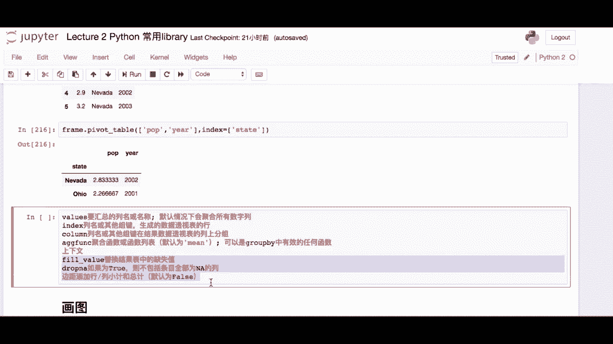

那drop n a就是我是否呢要嗯删除我的，就嗯缺失值。

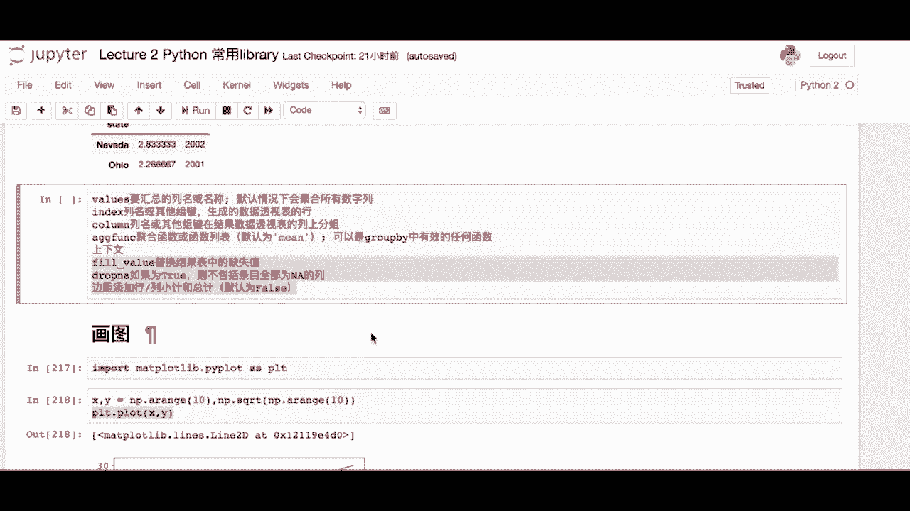

接下来要介绍的一块是第三块内容，也就是画图画图我们用的是这个MAPO这个library，我们首先呢把它import s p o t，是我们常见的一个命名规范，那低音呢我们先做一个简单的画图。

我们X也就是X轴，像后面说的这个之前说的NP点，arrange是也是我们很常用的，就是把这个轴分成0~9，那Y呢我就是一个简单的开根号，那plot第一个位置写的就是x NO，第二个Y字呢写的是Y啊。

这就是一个一个最基础的一个，没有任何别的啊信息的一个画图，那么其次呢如果我想画多个图进行并列，那么就要用到这个at support，那二逗号二呢也就是一个四张图的，那这个123呢。

就是你图排列的位置在第一个位置，第二个位置跟第三个位置，那第一个变量定义的呢，其实是我画出来的图的大小，所以这个fake tize到底是多少乘多少的，那接下来我们就要定义每一张图的内容了。

那第一个呢是画的是一个频数分布直方图，也就是hist这个函数，那么第一个位置呢，是你要画你的一个数据的样本，那我是一个100个数字的一个零一正态分布，那bans呢就是我要画多少条，那有20条。

那颜色和阿尔法是定义透明度的，那ketchup的话就是一个散点图，散点图呢其实是跟plus一样的，第一个位置放的是X，第二个位置呢放的是你对应的Y，那XY的长度得一样，那第三个呢是一个线性图。

用的是正常的这个plot，那我要画的是什么呢，我这个位置是这样的，plot可以指F你的响应变量Y，那它就默认X就是这是50嘛，所以说X就是0~40到49，那画的是50个的零一正态分布的一个累和。

其实也就是一个随机游走，一个random walk，那要画的呢是一个这个间断的折线图，所以这个下面就是一个展示的一个，基本的绘图过程，那么嗯像有时候我画的时候想要定义颜色，就是color。

那么这个颜色呢可以通过查表，R呢就是red，bean呢是blue，那G呢是green嗯，lifestyle呢是定义我这个呃线是一个虚线啊，还是实线啊，那dash就是虚线的意思。

那marker呢就是我每一个呃样本点是要显示圆啊，还显示三角形啊，还是不显示，那如果我想要画两张额，两个或者是三个线在一张图上，那要怎么做呢，那嗯我们是PLLT点plot，点plot就一直往下写的话。

它就会直接在这个图上覆盖，那么嗯像这个label label定义的呢是我的，就是在画legion的时候，这一条线要取一个什么样的名字，像第一根线叫default，第二根线呢叫step post。

那PLT点legend就是显示我这个图例的时候，要把它放在一个最好的位置，不会覆盖到我本身的这个啊折现嗯，下面要介绍是如何添加这个X轴Y轴的，包括轴的这个图例，包括轴的名称，包括呢包括像这种的指示图。

还有我图形的这个名称title，那首先好plot都是一样的，那如果我要设置X轴，不是初始的，像这个0~100嗯，那如果我想要画的是季度或者是一些年份，甚至呢是一些字符串，那这个时候就要手动自定义了。

用的是这个a as点set sticks，那XTX的呢就是X方轴的，那如果YTX呢就是Y轴的，那第一个呢set ticks的，这这个list是定义我下面的这个labels，要画在哪个位置。

也就是Q1就画在零点，Q2呢就画在数字是二百五的点，因为我们这边的data总共是1000嘛，所以的话就到了code five，那就是啊D对应的是第1000个就到完为止。

那rotation呢也就是它的这个旋转，那我就是一个30度的倾斜，那from size呢也就是我的这个大小，我选择小，然后如果要设置我的图形名字。

你就是这个set title的这个函数设置为my plot，那X呢我希望它的呃名称叫quarter，那Y轴呢喜欢叫price，那也就是set x label跟set y label这两个函数。

那如何出现一个，比如说我发现这个位置是一个低点，那我希望有一个指示叫tank，那就是一个叫做ax点annotation，第一的位置呢是我要上面要出现一个什么字。

那XY呢跟x text就是我的这一根线的长度，包括我这个text应该要画在什么的位置上，的一个坐标系的一个定义，然后呢error pos是我这个error应该要什么颜色，应该要多宽，应该要多长。

应该要放在什么位置，我的字应该放在L的边上啊，还是上面啊，还是下面的这样的一个定义，接下来我画好了我的图片之后，如果我想把它进行保存一个呢，其实就是有一个右键，有一个safe image。

那如果你想通过程序设置的话，就有一个叫做PLT点say fig这样的函数，那么里面呢是要放上你的fig的名字，然后前面呢最好要加上，你想要保存到一个什么路径中嗯，其次要介绍是一个数据框应该如何画图嗯。

像前面介绍这个pandas，它就是可以直接出图的，这样啊，我我定义了一个这个data frame，那我希望把这个color name呢叫成谷歌FACEBOOK跟苹果。

那我直接是data frame点plot，那就会画出，我以它其实是以这个列名进行分类的，一列一列的进行画的，那么就是一个这样的结果，那么下面的这个X轴，其实呢就是这个index的额数据，如果是0~5呢。

它下面就画0~5，如果你这边是年份呢，它下面是会自动显示是年份的，那最后呢简单介绍一下这个三维的画图，三维画图呢用到的一个是嗯。

在PROFIG这边的support projection这边定义的为是3D，然后XY的话跟呃，我之前其实有提到一个安排点，Mesh grade，math grade呢就是一个进行一个等举的一个细分。

然后ax这个时候就不是基本的plot，是点plot，Surface，也就是一个三维的，那也就是你的X坐标，Y坐标，还有你的对应的X和Z方向的值应该什么，那你要保证嗯，接的数据点投影在X跟Y上的维度。

是必须平齐的，要不然会报错，那么接下来有set x y跟Z3方向的这个label，应该叫什么名字，那点show呢，就这个就是我们看到一个图形，那么满足的表达式是Z呢，是等于根号X呃。

再等于正常的X方加上Y方，是一个这样抛物线对嗯，抛物曲面的一个数据格式。

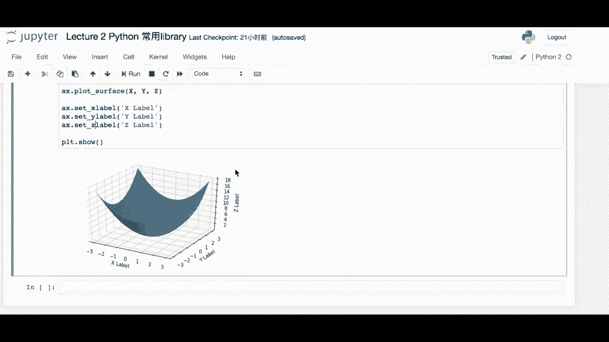

那么接下来我们介绍一下啊，这节课的一个作业，那我们这节课的作业比较简单，就是我们要求绘制一个三维的图像，那三维图像是什么呢，是一个二维正态的一个分布函数，你可以是做一个呃。

二维不相关或者是二维的相关系数，row等于0。3都可以的，那么呢要求附上每个坐标的坐标轴的角标，并且呢附上这个legend不，并且附上你这个图形的名字。

