# 吹爆！这可能是B站最完整的（Python＋机器学习＋量化交易）实战教程了，花3小时就能从入门到精通，看完不信你还学不到东西！ - P30：第30节 信用风险的IRC模型和高斯核 - 凡人修AI - BV1Yx4y1E7LG

那接下来我们来介绍一下，如何计算这个信用违约，比如说呢我们一个CDO我们有100个的issue，就是100个的发行者，那我们可以把这100个发行者呢，我们假想成是100个BD，也就是债券。

那么不一定是国债，比如说还有啊企业债啊，公司债啊，还有一些mi band，又是一些比如说省省的政府啊，这样子发行的债券，那么这个时候呢我们要计算他们总共合起来，我们预计的。

他们的带来的信用违约的损失会有多少，那这个时候呢我们的xi，我们把它认为是每I个的这个issue，那么它会这个default的一个视性的因子，那么它等于这个根号roll呢。

是每一个easy之间的相关系数，那我们在理论上它们的相关性肯定是不一样的，那么为为了计算方便我们的这个roll，对于不同的cross pair就是配对的话，我们都把它当成是一样的，那乘以这个MM。

我们把它称为是syntax synthetic part，也就是一致项，那么这个M呢对于呃每一个xi它都是，它都是这个对于每一条path来说，它都是一样的。

那么再加上一个根号一减RO乘以这个in snoi，那么EPSONALI呢是这个我们称为的是DIO，Syncredit part，那什么叫做idiosycredit part呢。

呃eduo and create part，就是每一个issue之间，是每一个issue之间呢，它们的这个呃相互区别的一个因子，比如说嗯xi呢是第一个用户，那么X2呢是X1第一个用户。

X2呢是第二个用户，那么它们对应的EO1，跟这个IMSNO2呢就完全不同，那么对于不同不同的path来说，他们这个INSAL都不都是不一样的，那这个时候xi跟XJ他们的这个相关性，相关性呢。

因为imp on i是不一样的，所以这个xi呢跟这个嗯X1跟X2在算的时候，是IMM等一，IMMS2之间的相关系数就不要了，所以呢就是这个ROCOVERANCE是M，所以呢就是roll。

所以说是这个由这个synthetic part来决定，他们之间就是相互default，或者是互相之间不抵不default不违约，那么他们之间的这个相关性啊到底有多大，那么当这个相关性越高的时候呢。

它这个bb twice呢就越极端，因为就是如果不default就是不违约，那么呢大家呢都一起不违约，那么如果违约呢，那么大家就就就一起违约，所以说他的expected loss呢就非常的极端。

就分布在特别靠近零，更特别靠近这个最大的loss，这个样子的一个情况。

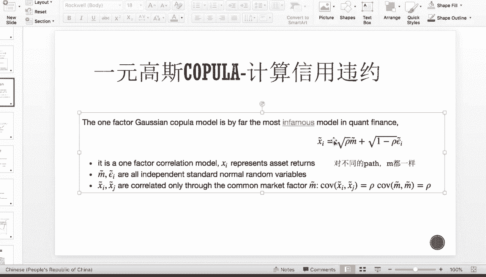

那这个我们来看这个correlated default，到底是怎么算的，那么首先呢我们是做这个normal normal market，发factor，这个M然后呢对于这个每一个easier来说呢。

我们都是这个公共的这个M，然后乘以这个互相之间的这个独立因子，因so i，所以对于这个不同的issue，我们的这个M是一样的，那么呢EI呢就是em m i呢是不同的，那我们算出来之后，这个xi。

其实它本身呢还是一个这样的一个正态分布，那我们对这个SI我们算它这个probability，就是这个FI，那么find的是这个正态分布的这个PDF，也就是概率密度函数。

那我们把这个概率密度函数算出来之后，如果它比这个pi pi就是我们的这个事情，Indicated factor，那我们就认为它是default，那反之呢我们就认为它是不default是小的嗯。

那么我这个是正常的这个caution，caution factor那么高，shan factor其实有一个什么问题呢，其实大家应该已经看到了。

就是如果说这个default probability比较的比较，就是这个default probability比较小的话呢，我们这个xi呢是很难落入我们这个正态分布，我们的这个区间里面去的，因为呢。

假设呢我们xi正态分布是这样的一个情况，那么呢它基本上都是在这个零这个附近，就是比较靠近的这个附近呢进行活动的，那么它很难hit到这个极值，也是我们算出来的大部分的这个xi。

每一个的那个issue呢是几乎不会default，那我们可以怎么样做呢，我们可以通过平移我们的这个嗯common factor。

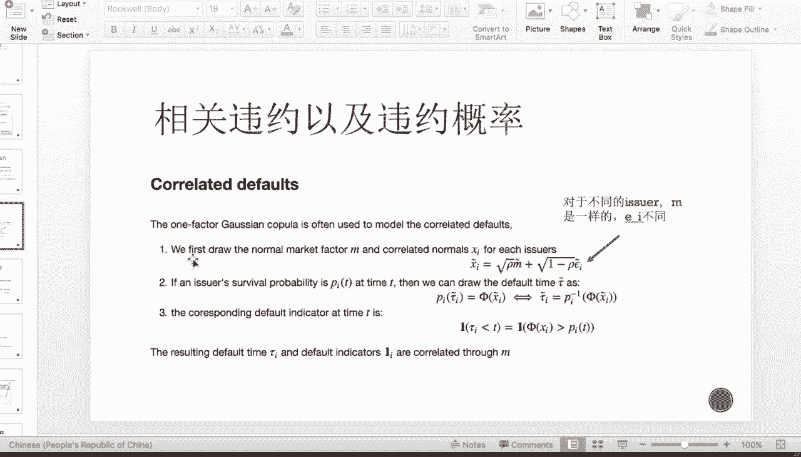

来做这个我们前面提到的importance sampling，那我们如何应用我们之前combine。

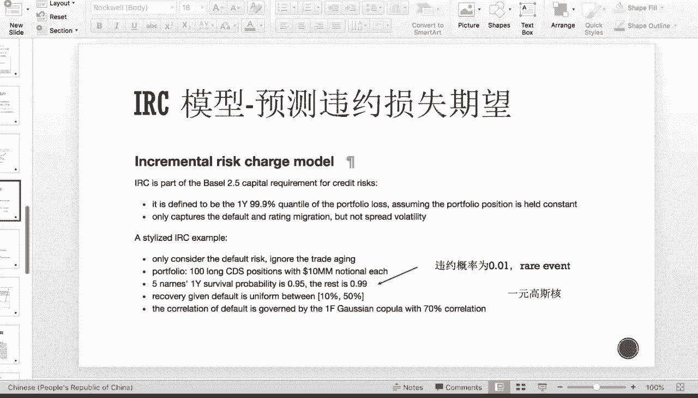

我们的这个违约的这个model，跟我们提到的important sampling。

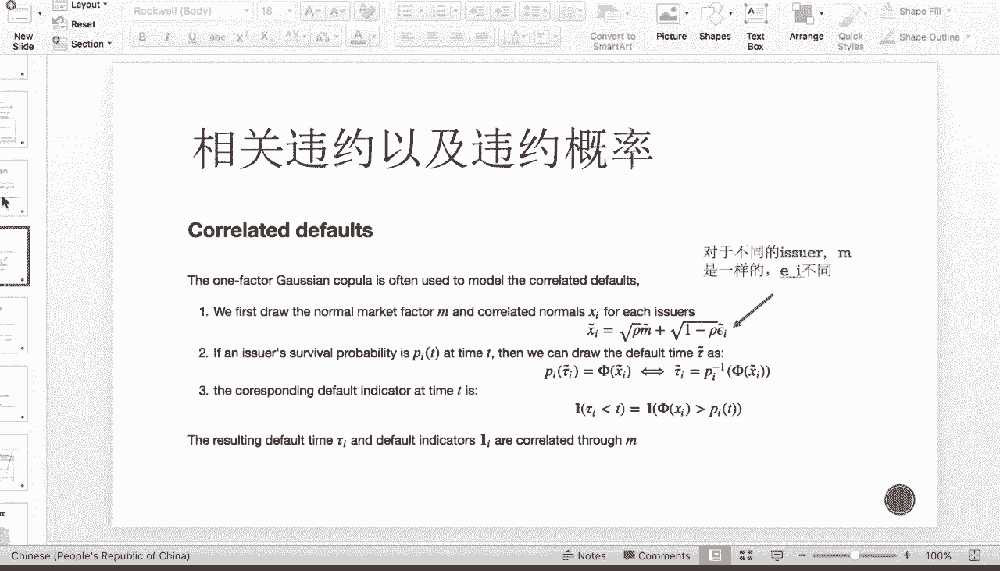

它主要用于的是我们的这个IRC模型，也是预测我们的这个违约损失的期望期望，这个capital plan里面对这个信用风险的这个定义，那么它定义的是一年内，99。9%的这个portfolio损失的分位数。

那我们是假设我们的这个portfolio不变，然后呃就是我们不会有换手，那么这个的assume呢，我们把它进行这个实例化，就是是时候让我们来考虑，我们来买100个的这个CDS。

那我们total的这个national就是我们的本金呢，是这个史密列，那么我们的这个一年的survival probability呢，我们就把它假设成就是前五个是0。95，那么剩下的是这个0。99。

那么这是survival probability，就是生存风险，那么违约概率呢是一减去这个survival probability，也就是0。01，那么是一个real event。

那么recovery呢我们是认为是一个均匀分布，是这10%到50%之间，那么recovery是什么意思呢，也就是他如果违约了，那么违约之后呢，假设我又recover了。

那这个时候乘以我的这个recover的概率，比如说我现在违约了，我的损失是100万，那这个时候我我recovery similar差还是30%，也就是说我虽然损失了100万，但我后面还可以混得到这个。

比如说30万的保险赔偿，所以我的净损失呢只有70%，是这样的一个概念，那么我们在这里的我们的模型，我们假设是一个一元高斯和模型，就是我们上面的这个高选copular model。

那我们的这个呃它们之间的correlation也是roll，我们设为是这个70%。

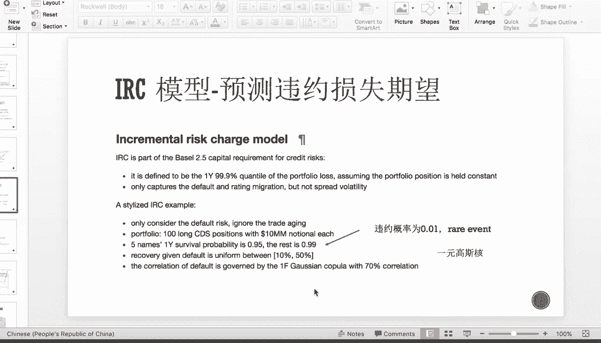

那我们可以通过平移我们的这个common factor啊，也就是M来做这个important samply，那么一整个想法呢，跟我们上面举的这个例子是一模一样的，我们上面举的这个例子的第一呢。

就是我们的这个平移的位移的这个方向，那么D在我们这边是三，那么在这个我们的这个Python例子里面，我们取一个grade，也就是啊从这个负的2。5取到零，那么每0。25我们取一个grade。

通过网格搜索来找到我们最佳的这个，VARIREDUCTION的这个shift，那我会发现它在这个负的1。5附近的时候，我的这个方差reduction ratio是最高的，我们提高了52倍。

那么这是一个非常优秀的一个这个结果，那我们在这里同时也给出我们这个IRC，也是我们嗯expected，我们的违约的总共的损失是这么多，那我们用saving了多少的时间等等。

那么呃因为呢为什么这个saving time是这样的，因为我们在寻找这些点做这个网格搜索的时候，我们需要付出一定的时间，来寻找我们最优的这个D，就是我们上面提到的这边这个D，那这边这个D呢是我们给的。

那这这里呢是我们通过这个网格搜索，来画出一个这样的一个U型的曲线，来找到我们的bottom line，那为什么可以降低我们的variance呢，其实跟嗯我们上面正态分布举的例子，也是一样的。

那么在这个CDCDS的这个default里面，如果我们是正常的MONTECARO的话，那我们这个credit default，这个我们的这个probability呢，就是这样的一个表达式。

那么现在呢我们把我们的这个default，几乎都抬到了上面这样那样的一个位置，也就是我们有更多的这个pass，我们会hit到area of interest里面，也就是在我们的这个违约风险。

比我们这个违约风险还要来得重，那如果是straight monticolor，也是没有做任何变化的，Monticolor，就我们simulate了200个sample，那就是没有一个hit到我们的这个。

area of interest里面，那对于刚才我们实现的这些东西呢。

那么代码呢后续呢我会把它放在这个IPAD上，notebook里面，那像IRC这个零呢，就是对我们这个高深COPULAR进行一个实现，那没有做呢，Important sampling。

那i arc one呢，这边呢我们就做了一个important sampling，做了一个parallel shift，那这边的这个D呢我们是不确定的，所以D呢我们取了一个这样如下的一个步长。

那我们把它这一整个呢给plot出来，所以是如下的这样的一个形式，然后这边展现的是我们刚才那幅图体现啊，这个体现的一个原理，就是，为什么这个CDF可以hit到我们这个。

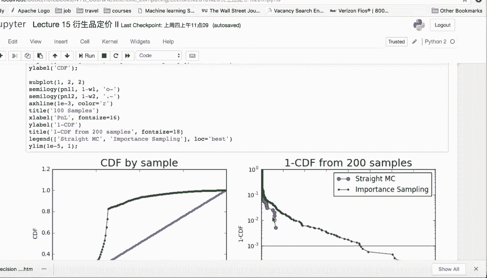

area of interest里面，那接下来让我们来看一下。

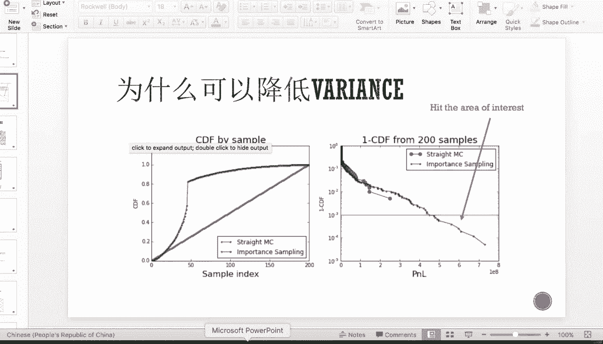

另外的一个比较独立的方法，我们称为叫做low discancy的序列，那么我们其实真正的蒙特卡洛模拟，之所以不准确的原因，其实呢是因为我们这个随机数的产生呃。

随机数呢比如说我们产生这个200个sample，那我们是如下，在这个零一的这个空间中，来进行这样的一个散射，那我们如果sim了2000个sample呢，我们可以发现我们这些sample其实并不是一个。

非常均匀的一个分布，在有的地方还是有一些空白，然后有的地方呢有的点的聚类的就是很明显。

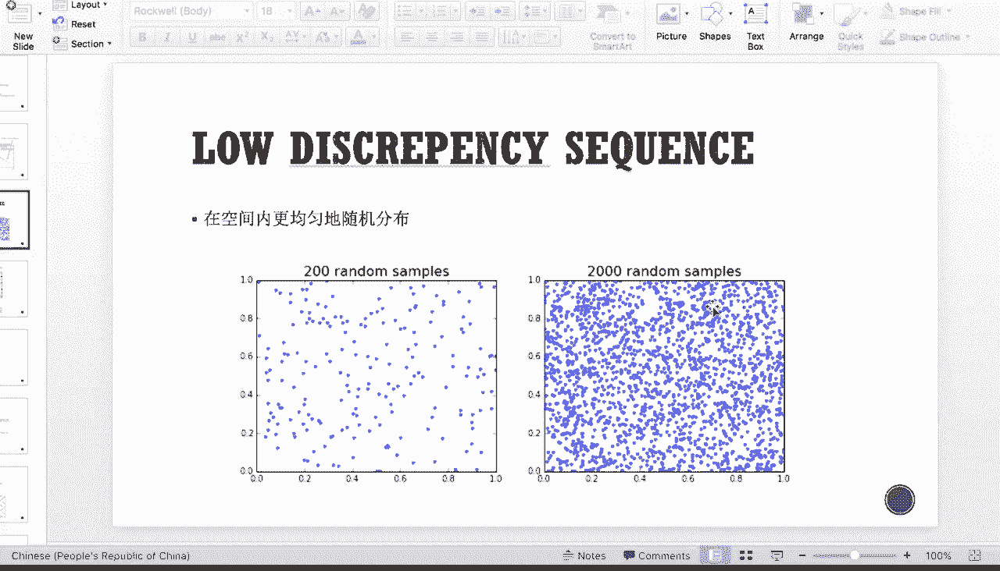

他们还是过于密集了一些，那这个时候我们希望降低我们这个一整个。

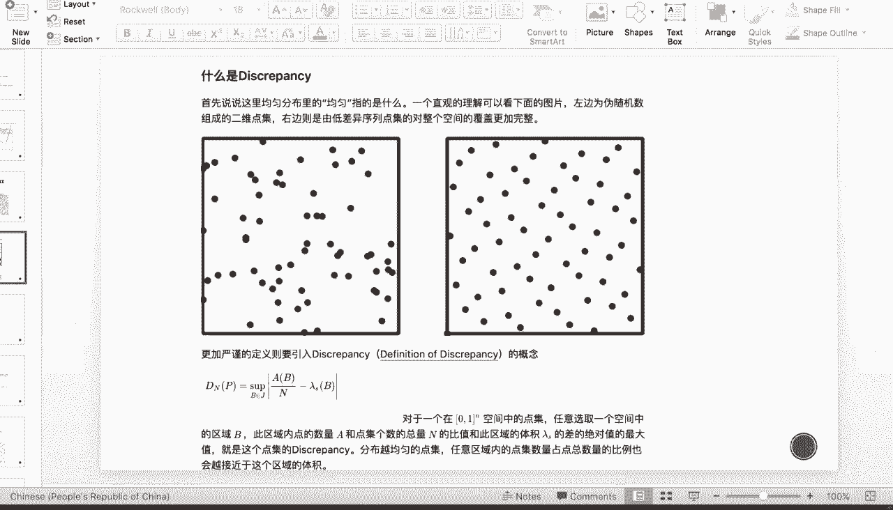

我们分布的这个discrepancy，也就是粘连跟这个发散，就希望他们尽量的平均。

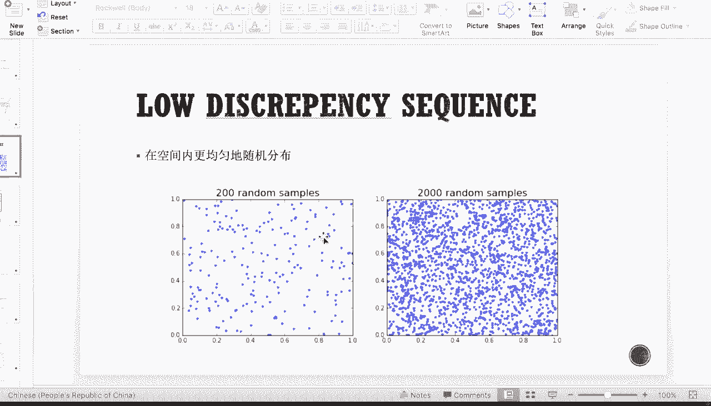

那我们首先要定义一下，我们什么叫做这个discrepancy，那么discrepancy呢是如下这样的一个表达式，那么A括弧B呢，就是在我们取一个固定的一个方框，就是固定面积的一个方框。

到底有这个多少个点，然后呢除以这个N，也就是呃总共的点的那个数量减去呢，这个朗姆达这个拉姆达B，那么这个浪姆达B呢是一是一个这个我们值域，就是我们这个一整个值域的面积，占这个总面积的百分比。

那么如果是最理想的情况下的话，那我们的discrepancy一样要是零，比如说我们切四块，那么第一块呢比如说是啊，那面积肯定是25%，那如果我simulate了100个点。

如果有25个点在这个空间内的话，那么就说明我这一块的discrepancy是零，那么我不管切什么样的方块，都要满足这样的一个表达式，所以DISCENCY呢是取overall的，Discency。

是取刚才我们上述这样表述里面最大的，那么这个称为我这一整个空间中的DISCENCY，那么我们希望这个DISCANCY呢一定是越小越好。

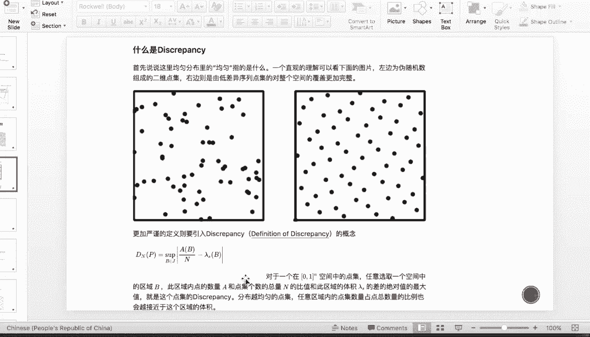

那么这个时候有一些啊，研究机构呢制造的一些呃random sequence，那么是通过来降低我们这个D啊DISCANCY啊，创造的一些序列，那比较有名的就是这个soo sequence。

so有STANFORD的library create的，那么它呢比较易于实现，只需要呢统一的更换，我们的这个随身随机数发生器，也就是我们一开始的这个嗯normal distribution。

就是正态分布，其实是比如说我们要SIMILATE5个，其实是把零一区间均等分成五份，但每一份中再随机的取一个点，通过求这个正态分布的反函数，把它们对应的这个X到底是多少点解出来的。

所以这呃所以呢我们只需要更换这个uniform distribution，是零一之间这个随机数发生发生器即可，那这个呢是一个Sol sequence，它的一个呃原理，那么它的原理呢会相对复杂一些。

他的想法呢就是把零一区间呃先进行这样子，通过呃二项式来进行的一个划分，首先是0。5，然后是0。25，然后是0。75，然后再分这个1/8的，然后再分这个1/16为倍数的，这样SOF连SOF是晚下。

那么直到把这个零一区间给越盖越密为止，那么盖完之后呢，如我们所我们那个之前所说，我们把这个零一区间，比如说我们要sample这个四个点啊，我们均等分成四个等分，在每一个区间内再随机的取一个点。

那对我们一开始的这个cumulative probability function，取一个逆，我们找到我们X是多少值，那我们对应的这些箭头呢，就是我们通过这个low discancy sequence。

Simully，出来的，这个X，现在一个比较均匀分布的一个这样的一个结，那接下来我们看一下这个low discancy，在做这个brownian motion的这个例子，比如说来price啊。

比如说用通过这个bin motion来对我们的这个嗯，asian option进行pricing，那我们可以比较一下我们这个pricing，需要用到的time和我们的这个error。

那我们可以发现我们这个error呢，几乎是降低了十倍的关系，通过这low description sequence，那我们这个例子呢使用的是这个索波尔序列，那我们来看一下我们这个例子啊。

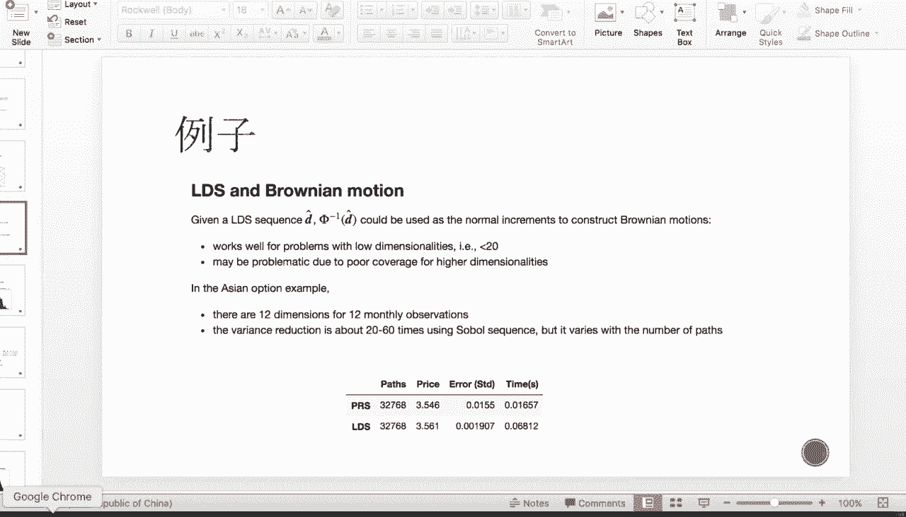

具体是一个怎么样子调用的一个情况，就是我们通过这个网上，我们要下载这个SOBLIP，那我们在这个STANFORD的官网上下载，那么我们在google上输入这个sob lib就好。

那么我们import之后呢，我们通过调用这个SYL，SOO是这个二维空间的。

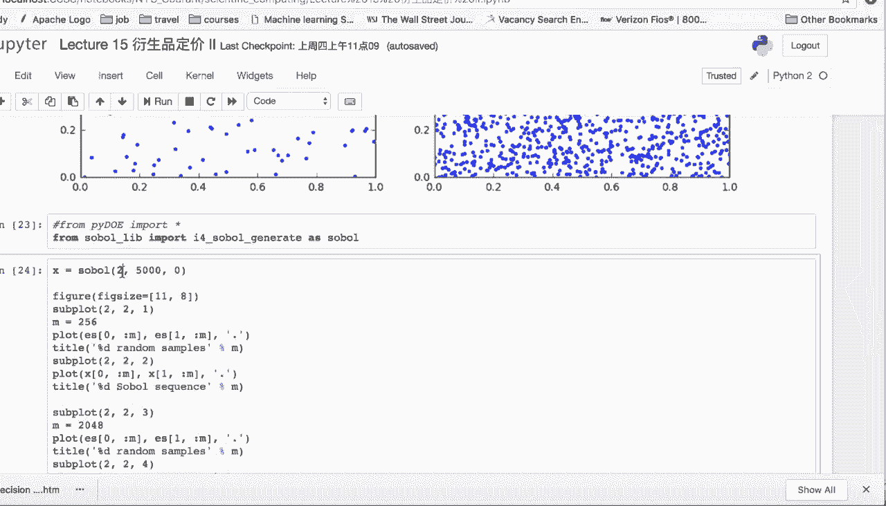

那么呢是500个sample，那么500个sample呢就是如下这个样子的点。

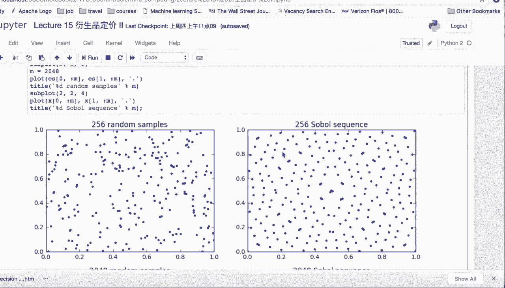

那么大家可以看到这个左边呢，就是一个正常的MONTECARO的调用，那右边呢是用过这个soo sequence的，大家可以发现右边呢就更为的这个均匀分布。

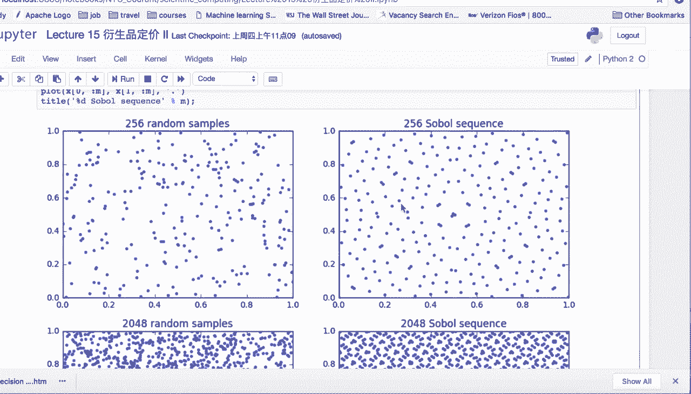

那我们把这个做好之后呢，我们把它带入我们之前就是导入的这个MC，MC呢是price这个asian option的，那把它放到上面一个表达式中，我们可以得出我们的这个low discancy。

跟这个正常的sudo monte caro sequence，算出来的这个asian option的价格。

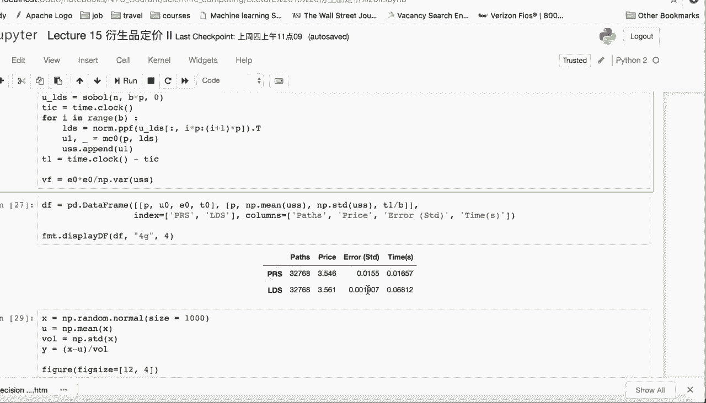

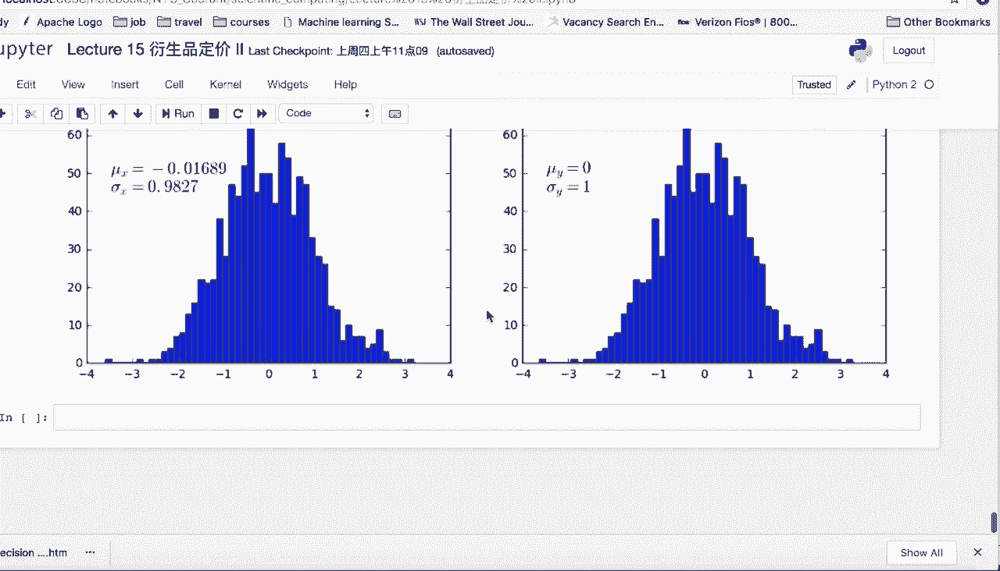

那我们接下来再介绍两种方法，那么是比较简单也比较好实现的，那么第一条呢是这个moon matching，猫咪matching的想法，非常的straight forward。

也就是说我本来想simulate一个均值为零，方差为一的这样的一个正态分布，但是因为我们只生成了比如说200个点，那么它们的均值和方差就不是，那么刚好刚刚好是零和一。

那我们可以通过猫猫matching的调整，我们可以计算我们的这些一开始的时候，他的命跟方差，那我们对初始点呢减去这个min除以呢，这个表差进行相当于是一个归一化的情况。

那么得到一个更像正态分布这样的一个表达式。

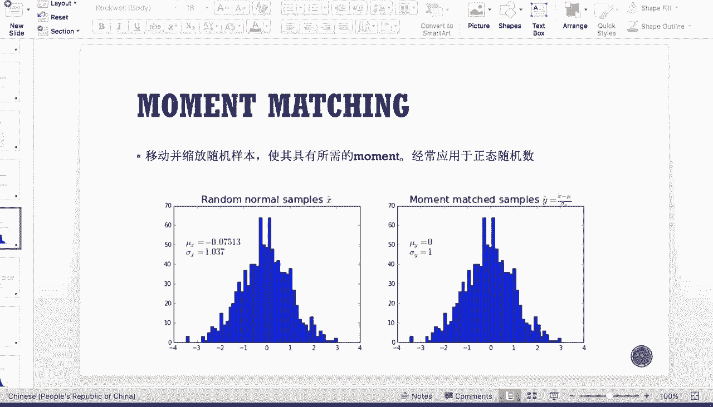

那么接下来还有一种方法呢，是称为这个分层抽样，那分层抽样呢跟上面的这个low discrepancy，的这个想法呢是几乎一样的，也是我们在这个我们要取N个sample，就把零一区间等分成N个。

那在每一个中间呢我们再取一个随机的点，那取了随机的点之后，我们通过取这个函呃，CDF方选的逆，我们得到这个X就是真正的sample。

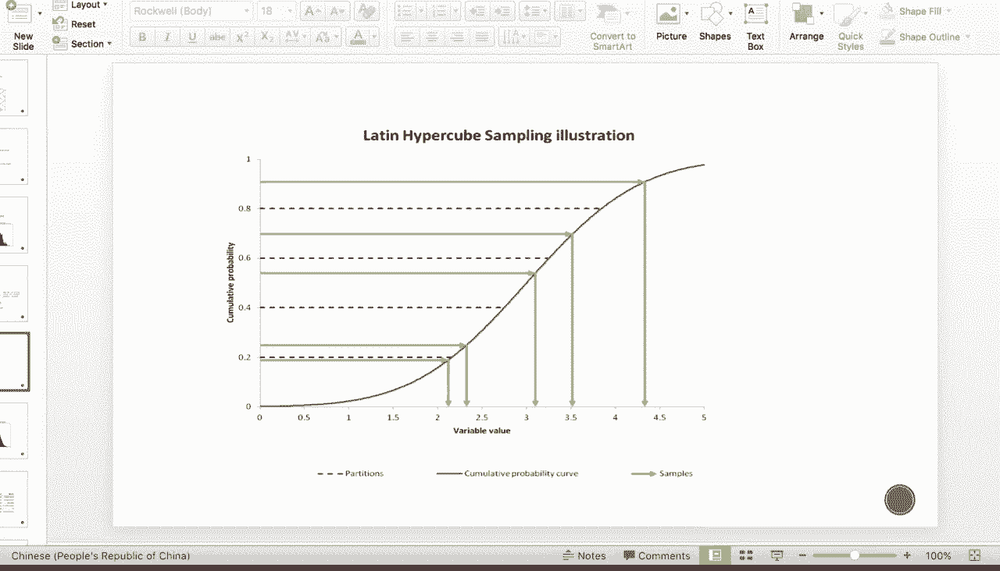

那么得到真正的sample呢，我们再把PLL出来，看我们表达，看我们的情况，那我们可以发现，比如说我们要取2000个啊，零一的正态分布，那没有做任何的那个变动的话，是一个如下这样的一个分布。

那可以发现它跟正太呢还是稍微有一点点区别。

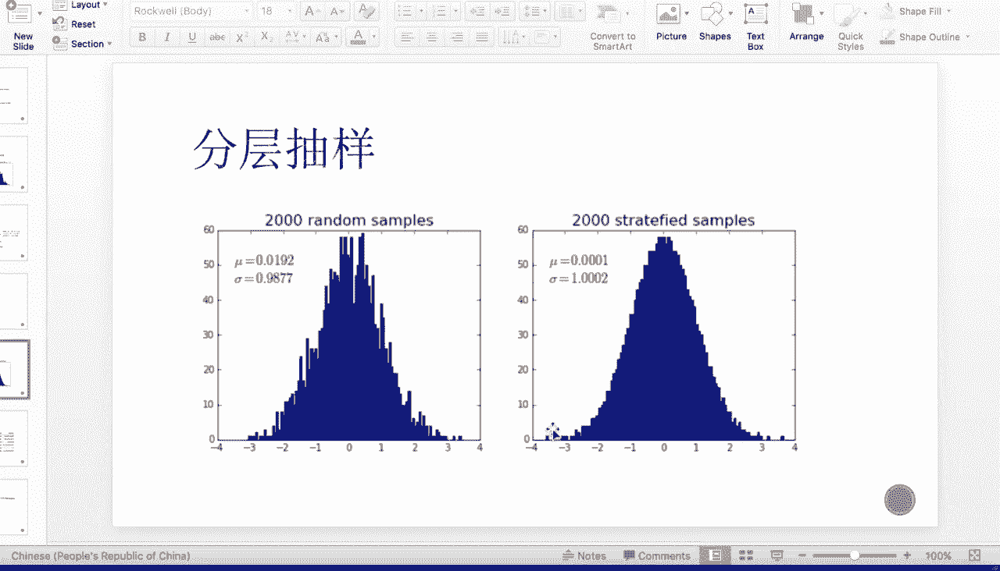

那这个时候我们使用这个stratification，就是上面这个方式提到过的这个分层抽样。

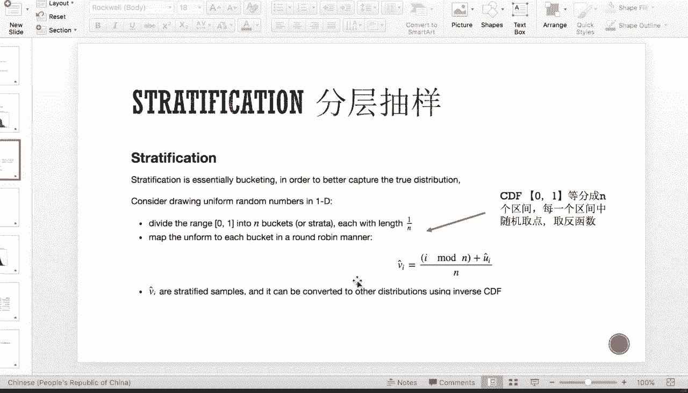

那么我们通过这个skill down之后呢，那么这个分布呢就光滑了非常多。

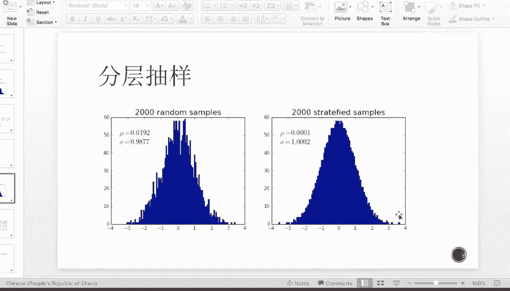

那么这边是我们之前提到过的，所有方法的一个总结，包括它的效率，包括他是否是比较通用，然后是否要用batching，来计算这个蒙特卡罗的误差，还有这个implement，也就是实现起来呢是否简单还是方便。

然后呢best for呢也就是对于什么样的呃情况下呢，是比较适用，像比如说最明显的就是important sampling，那么做做做这个奇特事件就real event比较擅长。

然后像这个control variant的话，最好是这个option，像EUROPEAN啊这样子，asian option等等，就是有这种proxy的，就是媒介的会比较好，那么我们本节课的作业呢。

是希望大家通过这个普通的蒙特卡洛，和我们上面提到过的stratification，就是分层抽样，我们来simulate2000个标准侦探的sample。

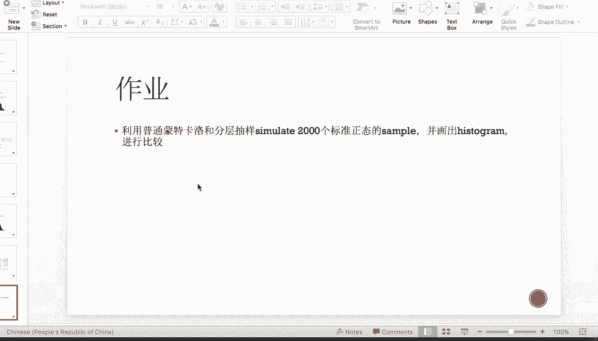

并且能画出我们的histogram，也就是让同学自己实现这个分层抽样的这幅图，这幅图的展现。

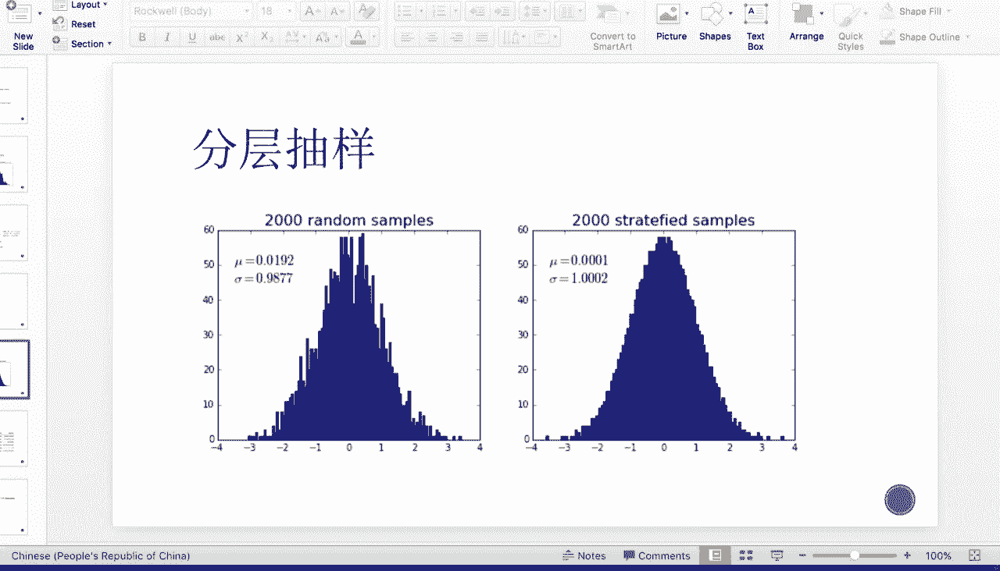

那么原理呢是基于我们这一页，第30一页的stratification的这一页的slice，那么来进行实现。

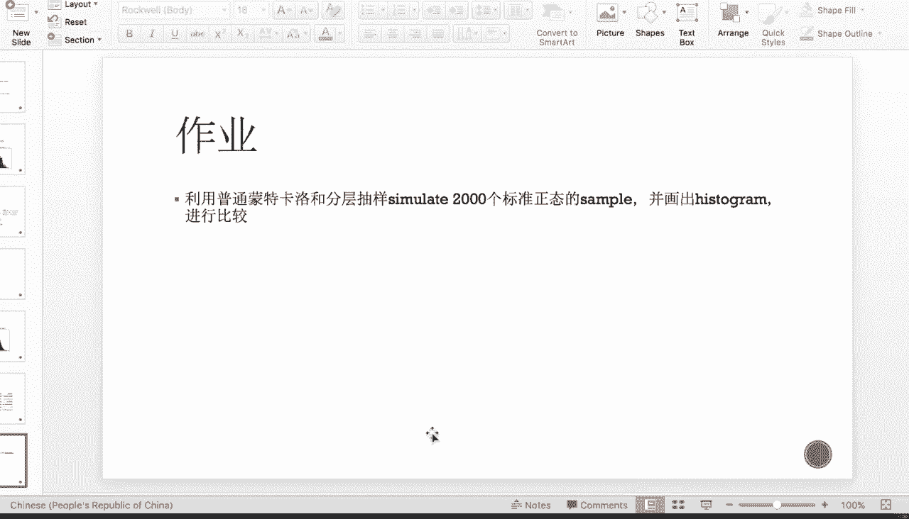