# 吹爆！这可能是B站最完整的（Python＋机器学习＋量化交易）实战教程了，花3小时就能从入门到精通，看完不信你还学不到东西！ - P31：第31节 重点抽样级数和测度变化 - 凡人修AI - BV1Yx4y1E7LG

那么接下来让我们来介绍一下important sampling，也就是重点采样，那么重点采样呢最经常用在的地方呢，就是来模拟少数事件嗯，其实模拟少数事件呢，是我们经常发生的一件事情。

比如说我们要模拟这个彩票的中奖，比如说呢我们要模拟这个一些信用比较高的，一些客户，那么他违约的概率等等，那么这个呢都属于少数事件，那么在这个金融上面呢。

我们来simulate real和extreme event，的情况呢是最多见的，因为我们一般呢都是在一个很common的，一个word里面运行的，那我们要估计风险，其实风险就是呃少数事件。

所以我们一般来这个做scenario的时候，我们做的都是rare和extreme event，那么几如下的是一些比较常见的这个呃real event，我们需要SIMILATE的一些情况。

比如说第一个是这个cds pricing，那么CDS呢叫做credit default swap，也就是信用违约互换，那么信用委员互换呢说的是这么一件事情，呃，比如说一家银行A。

那么要跟一个客户进行这个额贷款，那么呢其实对这个客户的还款能力，他自己本人其实是不是特别确定的，所以说他害怕这个客户会违约，那么客户违约的话，那么这个银行就要承担这个信用风险。

所以呢他就想找到另外一家银行叫银行B，那么呢它跟银行B之间签订了这个CDS，也就是credit default swap，那么credit dual swap这个互换呢，说的是这样的一件事情。

就是说银行A跟银行B之间，他们规定，如果在这个一年之后，我这个银行A的这个客户，我们称为这个小C，那么客户这个小C呢，能够如期的还我这个银行A钱，那么这个时候呢我就给这个银行B，我就给你1万刀。

那如果呢这个小C他很不幸，他违约了，他default了，那么你银行B就要给我100万美金，那么作为我的这个补偿，那么这样的一个呃合约到底是公平还是不公平，主要是看这个小C它的违约概率。

那么这个小C如果他的违约概率是0。01，那么这个银行币他在他这个带这个快递，default swap呃，结束的时候呢，那么它的期望的收入，其实就是0。01乘以这个100万，那么呢再减去1万块钱。

那么刚刚好是刚刚好是零，所以这个时候双方的这个期收益的期望都是零，就说明这个合约是公平的，那么如果这个小C的这个呃违约的这个probability，比这个数据报表上给的要来得高的话。

那么银行B其实就不合算，那么反之呢就是银行A不合算，那么这个是CDSS的这个pricing，那么CD s pricing的时候，我们需要来拟模拟来simulate是什么呢。

就是这些issue就是小C这些人的这个default，就是违约的事件，我们称为这个我们通过违约概率来，我们来simulate，它有多少调pass或者叫多少种情况下，那么他违约了，我们通过这个违约。

我们来计算这个CDSS的价格，那么CD o change ch的话呢，跟CDS非常类似，只是他跟CDS的区别是呢，他把这个违约的级别呢分成更多的这个级别，每一个trench它的这个违约概率都不一样。

然后recovery也就是违约之后呢，还会存在一定的这个回复恢复，那么这个恢复的概率呢，对于每一个trench，就是每一个层次来说都是不一样的，所以这个CDO的这个pricing，比CDS来的更难一些。

但是因为他们都是要模拟少数事件，所以他们用的蒙特卡罗法呢，都是这个important samply，那剩下的呢他我们我举的这三个例子呃，它其实本身并不是一个少数事件，只是他最后要计算的东西。

它是一个extreme的这个呃框太哦，那么第一个就是我们之前提到过的这个V，这个万呢要算这个，比如说这个99%的这个分位数，然后像IRC啊，CIM这个模型是，那是99。9%的分位数，那PFE呢是98%。

也就是都是一些很末尾很极端的这些值，那这个时候呢我呃不管是这个extreme框架，还是我们上面的少数事件，是不是我们模拟出来的这个pass，很少会落入我们需要的这个区间，像比如说这个CDSPRIZY。

那我这个人他的违约概率是0。01，那我模拟了100条100条path，那么只有一条path真正的呃落入了0。01中间，那只有这里，这一条他能算出他的这个违约的，这个期望值是多少。

别的pass都是不会被用上的，所以我们这个样子来simulate这些这么多的pass，只有非常非常少的冰山一角，能够真正的投入使用，所以我们的模拟效率就会比较低。

所以the importance sampling会用在我们的similar path呢，很难hit我们的这个叫做area of interest上面。

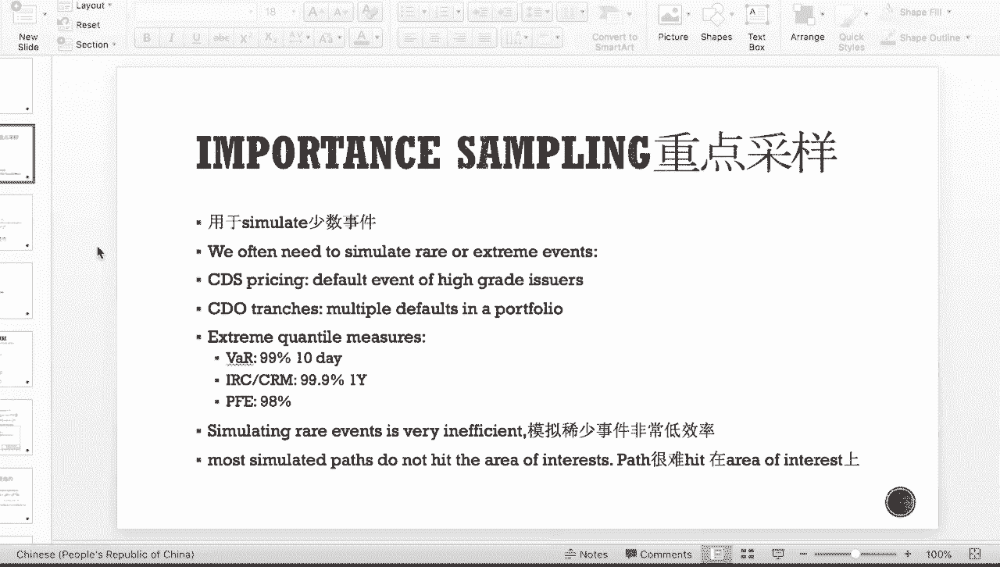

那这个时候呢嗯我们举一个更为简单的例子，然后我们用这个程序来模拟来告诉大家，他就是说当我们这个probability，或者是我们这个事件呃，就是是real event的话，那么它的影响会有多大。

首先呢我们来看一个berni trail，就是说我们如果办一个lottery tickets啊，就是我们的这个彩票，那么我们会得到什么呢，得到1B脸，也就是100万的钱，那么我们winning。

这个lottery的概率肯定是非常低的，因为很高，大家人人都中奖，那么首先我们先计算我们这个variance of payoff，那么对于这个二伯努利二项分布。

那我们的这个variance呢就是这个G平方，就是这个前配的平方呢乘以呢概率，再乘以呢一减去概率，所以是P1减P方，那我们蒙特卡罗模拟的这个方差呃，我们之前提过是我们的这个pay off乘以的根号。

这个方差除以呢我们有多少个simulation，我们SIMUL了N次，那我们希望我们的这个方差呢，得这个小于0。01的均值，那么均值就是我们这个lottery乘以，我们这个probability。

所以我们最后推导出来的公式是，我们要simulate path，pass的条数呢得大于十的四次方，乘以一减P除以P，所以我们有这个表达式，我们可以看下面这个概率表，P就是我们这个中奖的概率，那么从0。

999我们就只需要一条path，然后到这个0。0，我们就需要这个9。9，也就是其实是十的六次方，十的六次方其实就是100万条的pass，那我们真正的在这个信用上的话，那么这个问题会有多严重呢。

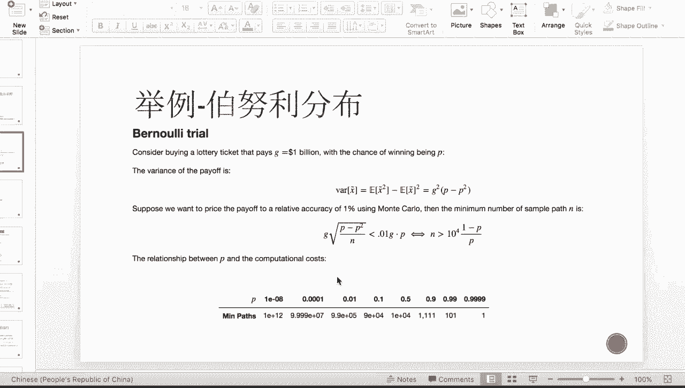

比如说看我们的这个真正的这个BD，就是我们不同的这个rating bd，它的这个default概率，那么对于这个一个A的，那么就是0。0002，也就三个零，那么对于double a的话。

那就是6×10的五次方，那就是非常小，对AAA来说，三个A来说呢。

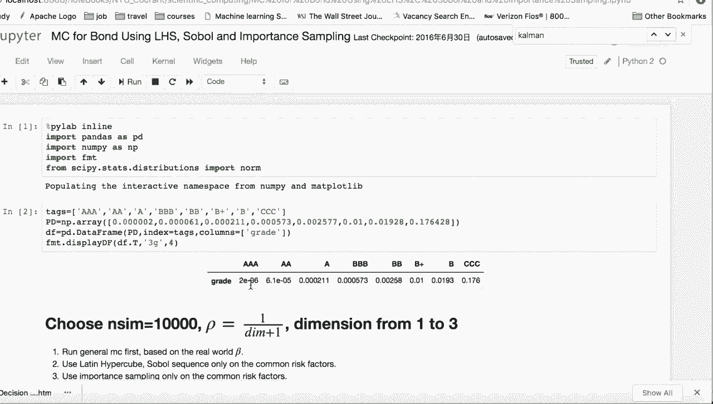

也就是差不多是十的六次方这个样子的量级，那么在我们这边的话，其实你看这是呃0。01的时候，就需要10万条了，那么这个是这个probability，就是0。0001，其实也就是double a。

就是双A级别的这样子的一个概率，我们就需要十的八次方，也就是1亿条，所以说我们的这个效率是非常低的，所以我们希望通过这个重点采样嗯，来提高我们这个算法效率。

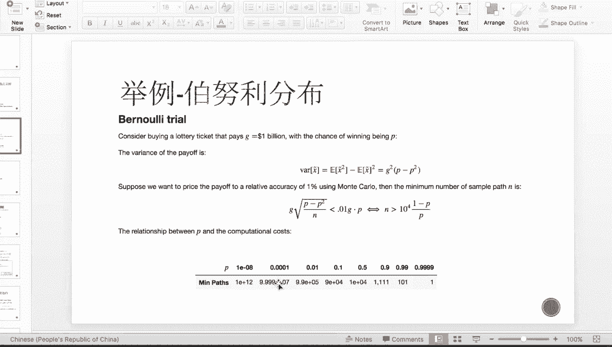

那么重点采样的这个直观原理呢其实非常简单，就是我们是通过如下这两种情况的这个pay off，也是我们的收益是一样的，那么第一个呢是我们有十的八次方的，这个概率啊，我们会赢得这个100万的奖金。

那么第二种呢是呢我们有0。99的这个概率，我们获得呢就是十块一毛的奖金，那么这两个的expected就是pay off呢都是这个一，所以说我们所以说呢这个是呃两个等价的。

一个expect of这样的两种情况，所以说我们其实不管是simulate，第一条还是第二条，我们最后算出来的价格都是一样的，所以我们可以用第二种方法来simulate点。

那么我们第二种方法SIMILATE出来的点呢，就跟第一种天差地别，我们是几乎所有的点都落入了，我们感兴趣的区间，也就是落入我们的area of interest，所以我们这个我们拟合出来的pass。

就更多是更有效的点。

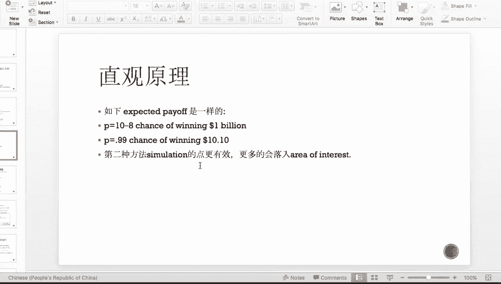

所以能够提高我们的算法效率，那么这是一个直观的原理，那么具体流程的话呢会比较的偏数学一些，如果对此不是非常感兴趣的同学的话呢，可以直接跳过这一块，那么具体流程呢是这样的，也就是说当我们这个G已知。

就是我们需要算的是这个GX的期望，那么呢G呢是X的一个函数。

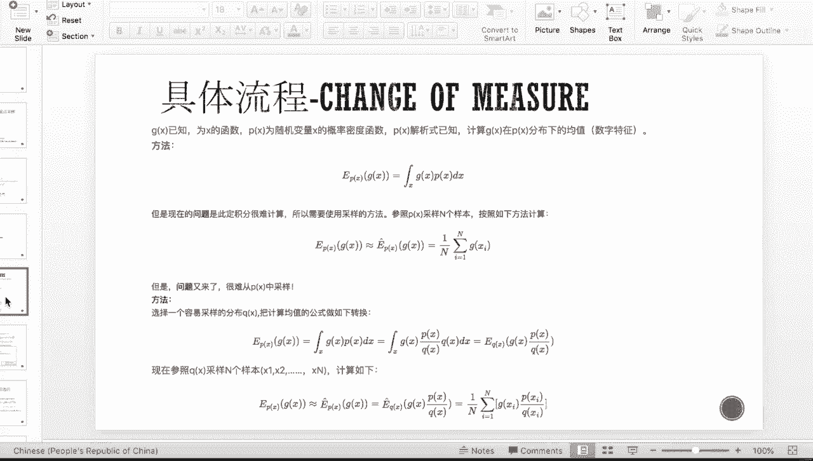

那X是一个随机变量，就像像我们这样子的这个伯努利分布。

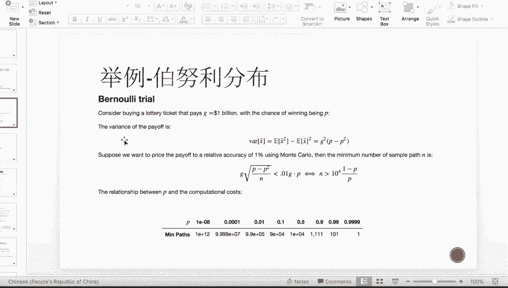

那就是每一次的实验，就是我们的这边的这个X随机变量，那么PX的解析式呢，PX就是X在这个P测度下的概率分布，那一般解析式呢是知道的，那么在这我们假设我们要计算这个GX的，在P测度下的均值。

那么就是如下一个非常直观的一个积分，那么如下积分呢在这个P热度下，我们可以把它写成这个样子的一个情况，也就是对g xi做一个这样的平均，在这个P测度下，那么这个时候呢PX的测度是非常难采样的。

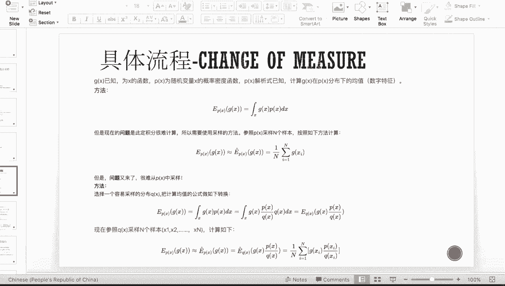

就比如说PS在我们这个上面是这样之十的，八次方的概率，可以winning。

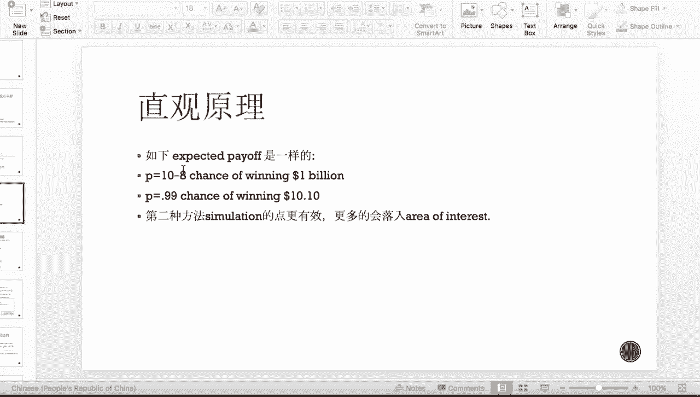

那剩下的1-10的八次方都是这个彩票失效，这样的一种分布，那么PX就非常难采样，因为几乎都踩不到我需要的点。

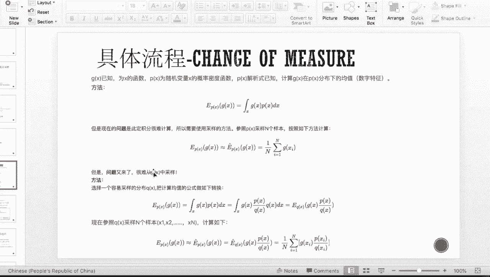

那这个时候我可以考虑在另外一个测度下，就是在Q测度下对GX做积分，那么如果是直接是Q测度下做积分的话，那么这两个积分出来的东西一定不相等，所以这个时候我可以用一个这个积分的，这个测度的这个改变。

就是呢嗯在接在这个P测度下，对GX积分是这样的一个表达式，那我可以等价写成GX乘以，就是相当于是分子分母同时都放一个几呃QX，那QX呢是X在这个Q测度下的分布，那这个时候呢你把呃QX放到DX里面。

其实也是GX乘以PX除以QX，在这个Q测度上的一个这样的积分，那么写成一个离散式呢，就是如下的一个表达式，那么跟上面的区别，就是它每一个GXI，后面一项都拖了一个这个小尾巴，这个小尾巴呢在这个数学上。

我们称为尼可丁导数，也就是这个P测度跟Q测度，概率，密度函数，在每一个样本点上的取值的一个相除形式，那么这样的话我们xi的这个时候呢，就是来自于我们的这个啊Q分布。

那这个时候xi呢就更多的落入了我们的这个，area of interest中，所以呢效率呢就有所提高。

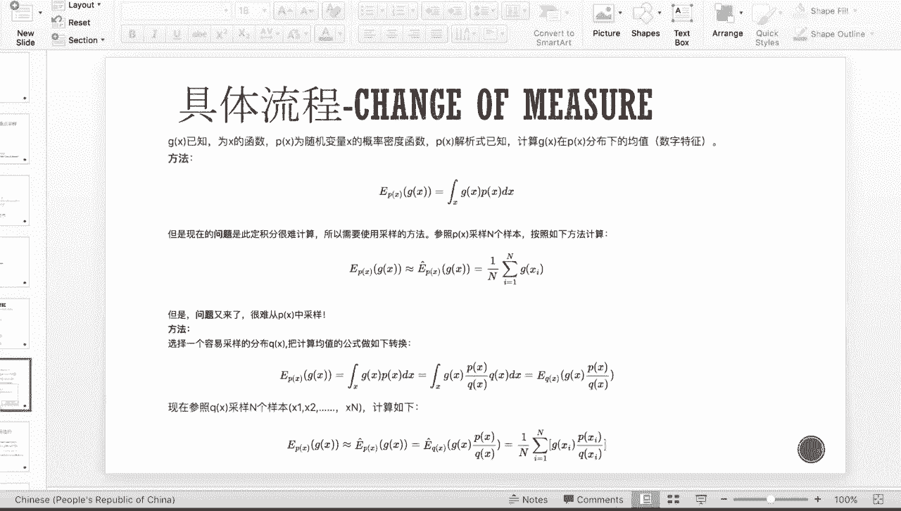

那么这边让我们来看一下，当这个P特度跟Q测度，都刚刚好是一个正态分布，这样的情况，比如说我的area of interest呢，是这个大概在这样的一个区间，也就是三左右的区间。

但是这个时候我X呢是来自于这个蓝色的分布，中心是为零的，那这个时候X就很难落入我感兴趣的区间，也就是我的Q测度呢是啧是一个这样子，蓝色的一个这个样子的情况。

那这个时候我可以通过这个change of for major，把它改成在这个皮特度下的，所以呢这边的尼克顶导数就是FX原先的除以呢，FX减dd就是这个平移的这个步长。

那最后把这个fix除以XFX减D呢，我们通过正态分布进行化简，那么化简成如下这个样子的一个表达式，那么化成如下这个表达式之后呢，我们把它代入上面的这个形式，就可以算出我们这个在新的这个测度下呢。

这个X是一个什么样的表达式，那么我们可以通过这个这边这两幅图呢，来直观的感受一下，那么右边这边是我们similar出来的，这个100个的这个discrete samples。

我们可以看到我们一开始的这个原先的这个点，那么大家嗯就是sample的时候的waiting呢。

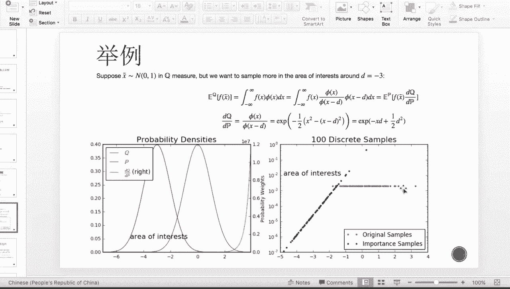

都是一样的对吧，都是这个一除以N啊。

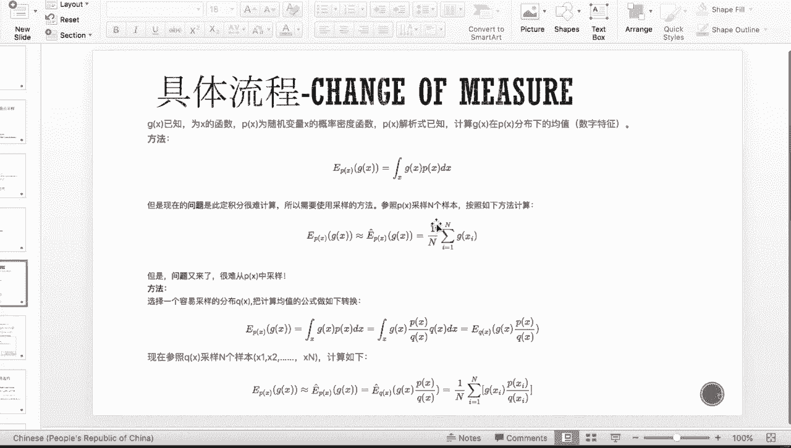

所以就是这个十的二次方，那这个时候呢，大家基本上都堆积在这个零的附近，那这时候如果我用这个CHANIMAJOR的话，那大家有很多都落入我的area of interest。

那这个时候每一个点都waited就不一样了。

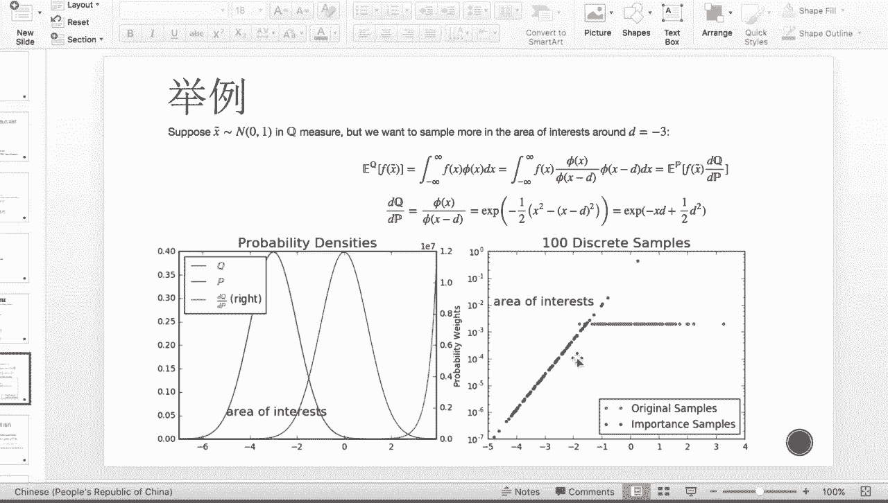

这个时候每一个点waited就不再是N分之一，而是N分之一乘以啊。

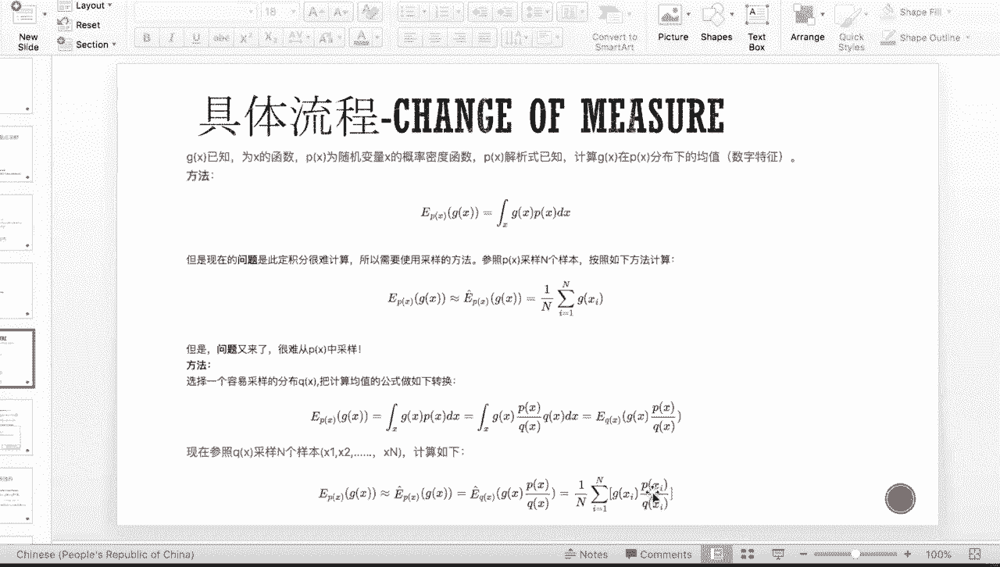

后面的这样的一个尼可定导数嗯，那接下来我们介绍这个一元高斯的这个COUPLER，加上我们这个important sampling。

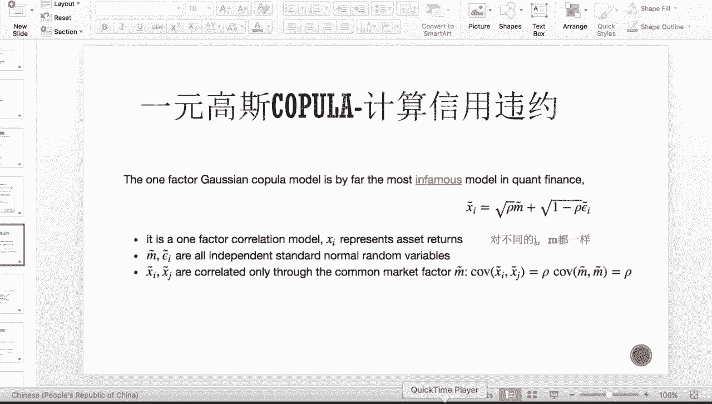

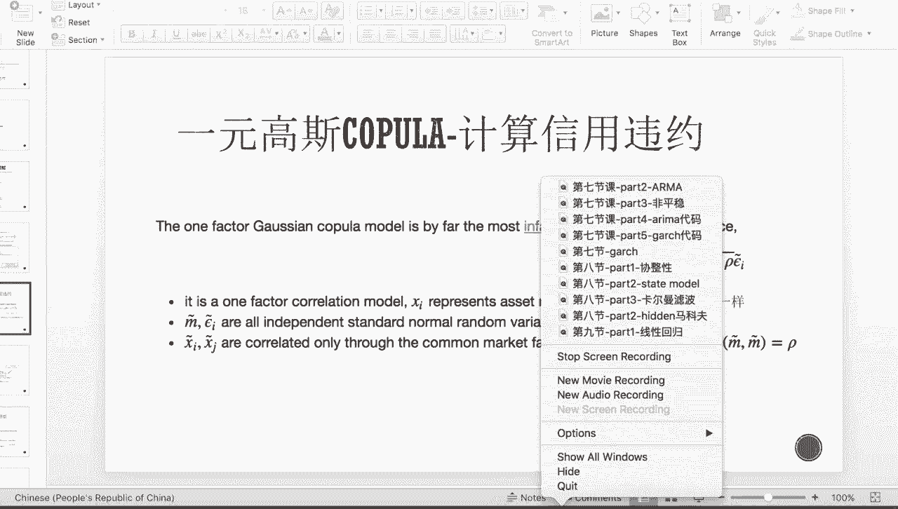