# 吹爆！这可能是B站最完整的（Python＋机器学习＋量化交易）实战教程了，花3小时就能从入门到精通，看完不信你还学不到东西！ - P6：第06节-Parameter optimization（参数优化） - 凡人修AI - BV1Yx4y1E7LG

那么接下来让我们来具体实施，我们的统计交易策略嗯，也就是我们上面一直在强调的，复写strategy的这个object，那么第一个呢是滑动平均交易，那么我们重写strategy object。

我们把它呢改为moving average，cost strategy的这个object，那么滑动平均的想法非常的简单，我们呢要找一个啊两个look back period。

分别是短window呢跟长window，那我们这边设的短window呢是100，那么长window呢是400，那么我们这里先提醒一下大家，就是这里的两个window的长度的设置。

是我们第三节要讲的就是啊参数最优化，其中的一一对儿参数，那么我们后面要根据这个最优化的结果嗯，来来讨论我们这个长window跟短window应该如何选举，以达到我们收益的最大化。

那么滑动平均核心是这个calculate signal啊，这个啊函数，那么呢它的主要功能呢是要对这个market里，van就是在我们data data handler中的这个event q中啊。

读取信息，并且对其呢作出反应，那么对于每一个symbol，也就是每一个ticker，我们要获得他对最后N天的这个closing price，那么这个N呢就跟我们上面的show window。

跟long window的长度是一样的，那么我们对长和短window计算这个滑动平均，就moving average，那么交易的原则是什么呢，嗯是当呢这个嗯short moving average。

超过long moving average的时候，我们就进入市场，反之我们就退出，那么原理呢其实很好理解，也就是当我们的短期均值已经超过了长期均值，那么说明我们在近期，我们期望就是我们的这个股票。

应该是有上涨趋势的，那么我们就进入市场，那反之呢说明目前的市场比较疲软，那我们就退出市场，那么当我们通过这个条件判断之后呢，我们就来update我们的这个bot fefeature，就是我们是否要购买。

并且呢我们啊构造一个signal event，就是来告诉我们接下来这个portfolio，我们对这个market event的啊，动作到底是应该买还是应该卖，还是应该不take action。

那我们把这个signal event放到Q中，等着后面的portfolio来读取，那么这就是我们呃复写我们的这个strategy object，的具体代码。

那么我们把它命名为moving average，Cross strategy。

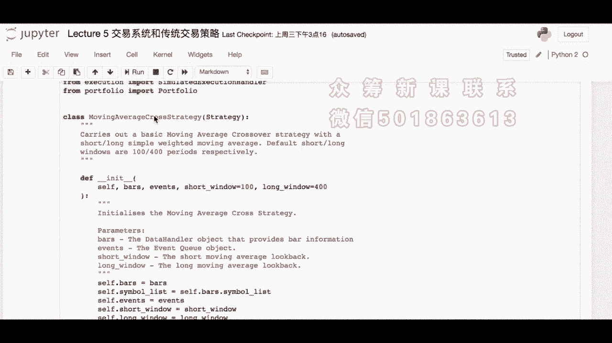

那么先初始化，那么最重要的是这个calculate event这个方法。

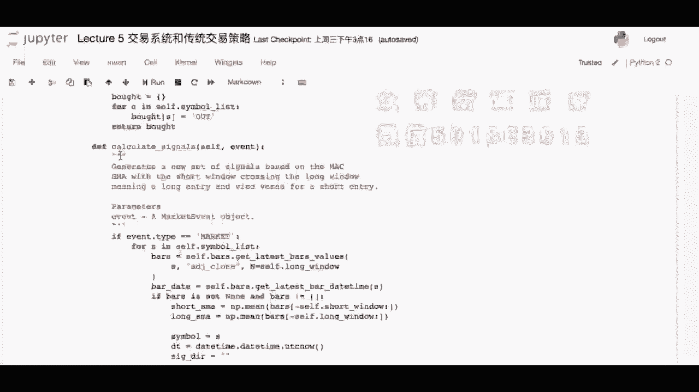

那嗯在中间这一边呃，就是具体实施我们上面说的这个交易的rules，到我们的short movie average啊，大于long，并且呢是并没有持有头寸的时候。

我们就构造一个这个signal event是long的，那么反之呢我们就构造一个out的signal event，那这个if main函数呢是对我们一整个啊strategy。

包括我们上面提到一整个event driven，一整个动态系统合起来的一个调用，那么csv dictionary就是我们说过，我们用的data handler是用的是historical data。

存在我们本地的，那么这个就改成你们file存的位置就好了，那我们symbol呢做的是苹果，那这个是我们初始的资本嗯，和我们的这个开始的时间，那么通过调用这个back test。

这个嗯object呢来进行交易的这个模拟，那么嗯这个就是我们接下来啊，我们通过这个调用来得到我们的具体的这个嗯，报表，我们提供的performance class可以告诉我们return。

告诉我们这个sharp ratio，告诉我们最大的作down的比率和捉down的时间，包括我们有我们有多少的order，就生生成订单了，那么我们在一整个交易过程中做take10次action。

那么啊我们这里虽然sharp ratio不是很高，return没有很高，但是呢大家可以看到，就是我们的MASMUDRAWDOWN嗯相对比较低，也就是说明我们的风险是比较小。

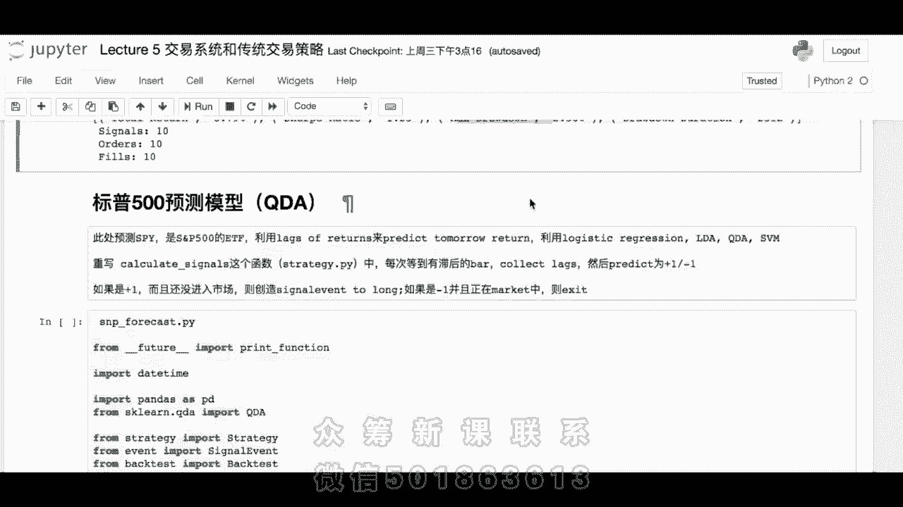

损失风险是比较小的，那么接下来让我们来看下嗯，另外一个呃strategy模型，也就是标普500的本身的预测模型，那么我们这边的例子呢是使用的是CONTROID，Discriminal analysis。

我们上一节课初步的提到过的，就是一个二次的这个嗯discriminate分析，那么我们依旧可以通过sk learn，我们可以使用啊，LDA可以使用QDA，也可以使用嗯，支持向量机。

也可以使用这个罗切斯特回归，那么我们这里的例子呢是用QDA，但是这些也是非常好修改的，那我们来，我们依旧呢是重写这个cockay signal的这个函数，那我们的嗯，想法呢是通过这个QDA模型进行预测。

但每次呢等到这个滞后的这个bar嗯，我们来得到我们的LEX，比如说我们用十阶或者是五阶的LE来进来，作为响应变量啊，X那这个时候我们来predict，我们的Y也就是我们的SMP的价价格。

它到底是涨还是跌，那如果是涨的话，并且我们这个时候还没有进入市场，那我们就创造一个signal event，告诉他我们这个时候要long，那如果反之呢，我们呢就嗯T嗯X嗯。

就告诉我们的execution handler，我们要exit，同理我们来看我们的这个create signal这个函数，那么具体的执行呢在这个地方。

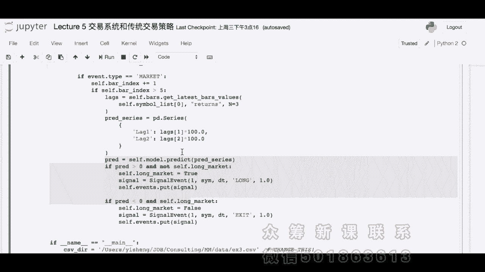

那一额与上面的第一次的均值回复一样，也是利用我们的historical data，就是把SMP500啊，从那个比如说矿洞，比如说雅虎finance上破下来，存在CSV上，并且对这个本地的数据进行调用。

那么我们的开始时间是啊06年，那么那我们来看一下用QDA的结果，那么return是9。8%，那么明显比均值回复来的高嗯shop return是1。83，但是我们可以看到啊，maximum dei啊。

maximum jordan有显著的提高，说明风险也相应的增加了，那么在这这种方法的话，我们可以看到这个signal跟order是270，也就是说我们的换手率嗯明显的提高了。

那么如果单考虑我们的交易费用的话，嗯那么这种方法会产生更高的教育费用，那么接下来我们来看一下这个用均值回复的嗯，Pair trading，也就是配对交易，那么配对交易呢与上面两个策略不同。

我们会使用intro day的price，而不是每日的，也就是说我们现在的频率frequency比较高了，已经可以称为high frequency trading，那么在框do跟yo finance上。

我们只能得到每日数据，所以我们这边用的是这个DTNIQFIED，来得到这个intro day的数据，那么就要在相应的我们上面提过的execution。

handler中有一个t w s connection，那么要在connection那边啊，放上我们的用户名和我们的id的信息，那么我们这边用到的是啊，美国的艾瑞克跟will。

就是我们上一节课讨啊讨论过的这个pair，来做pair trading，那我们具体的流程呢是利用这个啊rolling，就是滚动的最小二乘回归，比如说一个月，比如说一周来得到这个残差。

那么呢是对于一个固定的这个window的时间，那么这个window呢跟上面最开始提过的均值回复，交易一样，也是我们要最优化的一个参数，那我们根据上一步得到的RECEDU，来算这个长差的z score。

这分数呢其实是就是一个归一化的，归一化的一个嗯return，那么呢被我们的啊风险啊，就是被我们的风险skill down了，来决定我们这个时候到底是进入还是退出市场，那么顾名思义，当这个Z越高。

说明我们这一段的这个收益率就越大，所以我们有一个上限跟一个下限，当当我们的这个ZSGO超过上限呢，并且我们这个时候并没有持有任何的market头寸，那我们这个时候呢就可以long就可以买。

当我们低于这个嗯JESGO的bar的时候，说明这个时候市场很疲软，风险很高或者是收益率很低，那么我们应用在market中呢，我们就要退出强行的hit out退出市场。

那么我们这里需要最优化的有三个层面量，一个是这个rolling window，就是算做最小二乘回归的时候，我们的我们的input data到底有多少，还有就是我们的嗯JESGO的上限跟下限。

那么这里让我们来依旧来看一下这个calculate，signal嗯的这个方法。

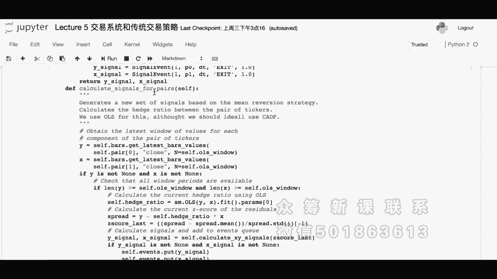

那么我们的具体的实施步骤是啊，这一段。

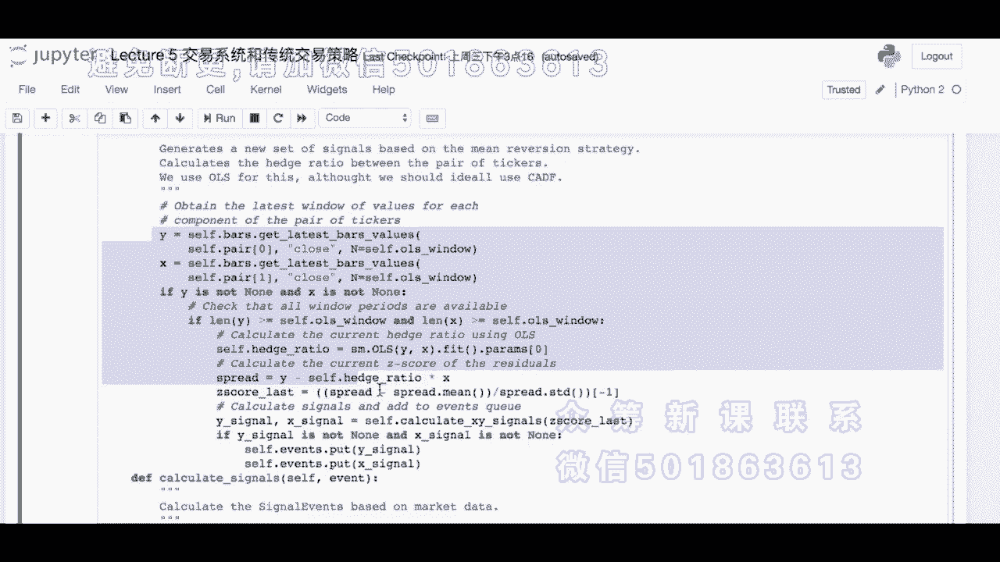

那么哦嗯具体的实现的做法呢，就是我们上面提到过的，先做一个啊滚动的回归，然后我们得到长差算just go。

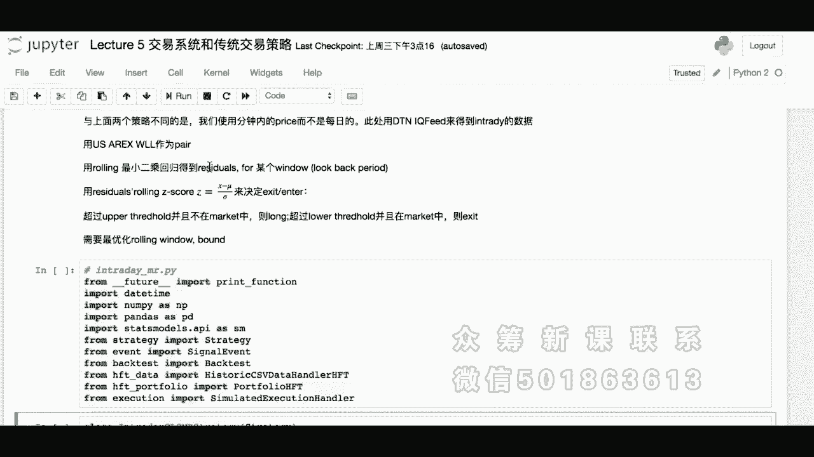

然后根据呢JSGO呢进行判断，我们是否需要进入或者是退出市场，那么根据这个我们生成我们的signal event，然后呢把它放在我们的队列中，那么变把它变成signal，放在我们的队列中。

那么由后面的portfolio来读取，并且S给交易所，那这个依旧是我们调用我们上面的这个，strategy的一个啊面函数，那么我们这里因为不再使用的是CSV，data handle了。

我们是直接与交易所进行连接，所以这个时候我们要对我们上面的一些别的class。

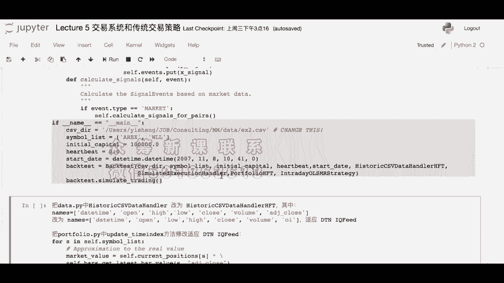

进行修改，首先我们要修改的是data py中的这个historical，Csv data handler，我们这时候要把它改成那个high frequency的，那么names为什么要进行修改呢。

也就是之前的AD j clothes，是从yo finance啊破下来的data，那么呢price呢它的column name叫AD j clothes，那这个时候如果从DTN这个data feed中。

pull下来的话，那么它的这一列呢叫OI，那么相应的在portfolio中，我们的这个update time index的方法里，我们依旧使用到了这个column name。

那我们得把column name进行修改，那么嗯在PERFORMAL里面还有别的方法，像update holding啊，嗯像performance点PY啊等等等等。

都要根据这个column name进行修改，那么与此同时呢，在performance中还要注意的一点是，我们在之前计算的sharp ratio，都是啊根据每日计算的，那么现在呢10分钟。

也就是说一天有6。5个这个交易时长，那么6。5小时，那么一小时是60分钟，那所以呢我们现在的sup ratio的参变量，要进行啊相应的修改，那么这个呢是我们的这个表现，那么total return呢。

比第二个方法就是QDA有明显的提高啊，separation呢从1。8提到了2。3，那那需要注意的是，这个时候我们的MEIM捉down嗯，比上一个方法来的还要降低了。

说明这种方法我们不但可以提高更高的收益率，我们还可以降低我们的风险，但是要注意的是，就是在这里呢，可以看到我们的换手率从原来的270，上升到7000多，也就是说我们的呃换手频率大大的提高了。

所以我这个时候的交易费用嗯，需要嗯需要非常着重的考虑一下，当交易费用比较高的时候，可能我们的return会因此受到影响，那么下面再简单看一下我们这个P啊，plot performance的这个函数。

那么它的主要功能呢是把我们上面提到过的嗯，像equity curve啊，然后我们的return收益率，包括我们的这个回撤啊，进行了画图，那么会有一个更好的一个动态的监控。

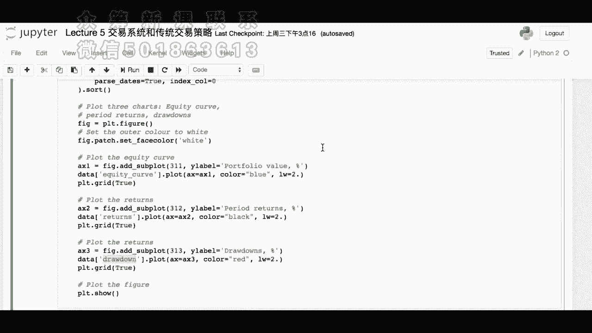

那么因为这个run的时间比较长，所以呢嗯就直接问完之后把它截图放在这了，这个是我们的第一种方法，也就是滑动平均得到的结果，大家可以看到滑动平均，我们第一幅图呢是我们的婆婆的价值，那么第二幅图是额收益率。

那么第三幅图呢是我们的这个捉到，也就是回撤，我们可以看到我们的这个婆婆有，在很长的一段时间内，我们的价值呢都是下降的，那么在嗯98年这个金融亚洲金融危机之后呢，有一个大幅度的上升。

但是后面又很快的回到了这个啊，历史的一个平均值，那么收益率呢也是一样，在这个嗯98年金融危机之后的一个嗯，回暖期呢，虽然是有曾经有过得到比较高的收益率，但是呢我们这个时候的风险，包括波动率也是很大的。

那么下面的中央档呢也啊类似，就是越到后面，尤其是这个恢复期内，那么我们的这个嗯回测回撤率都比较高，说明这个滑动平均并不是一个，非常理想的一种啊策略，那么对于QDA。

也就是用自身滞后项进行回归的模型预测呢，就比前面有个很好的提升，我们的你整个的portfolio的价值呢，是几乎是震动啊上升的，那么我们的收益率呢，嗯也几乎就是虽然是正当的。

那么几乎是就是正的比负的来的少，但是比较比较值得注意的一点就是，当我们的能达到比较高的收益率的时候呢，我们相应的最大的嗯回撤率也提高了很多，说明我们在我们得到比较高收益率的时候，我们会面临着很高的风险。

那么对于最后一种，对于最后一种啊，这个交易策略就是均值回复，我们能看到这个时候在经历08年，一个非常短暂的，一个不是很好的市场的情况下呢，几乎我们的这个嗯。

我们portfolio的价值都是嗯有一个很高的提升的，那么我们的收益率就是我们的return呢，也是相当高的，那么我们这个时候的中二档，可以看到我们最高的左右荡，其实也都只到了3%。

那么说明均时回复呢明显的优于上面两种的啊，这个交易策略。

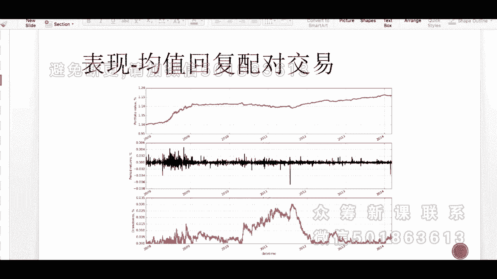

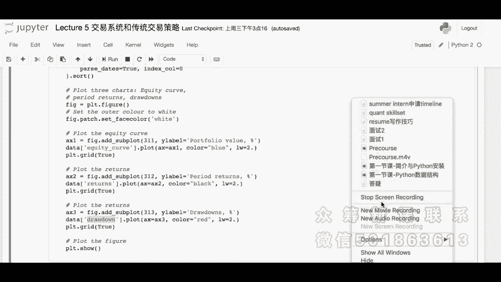

那么最后让我们介绍一下模型参数的最优化，像我们之前提过的，像第二种方法中用的QDA，如果我们换成SVM的话，那SBM中关于我们的EPONTI的惩罚项，还有第一个策略。

moving average和第二呃，第三个策略PETRADING中，我们都有一个look back window，那么对于第一种，moving average是一个short和long的window。

那么pair trading呢是在我们做啊，rolling最小二乘回归的时候，我们的这个windows的长度，都是需要我们进行参数选择的，所以我们需要最优化，以你最大我们的收益率，那么嗯方法是第一种。

我们可以啊考虑cross validation。

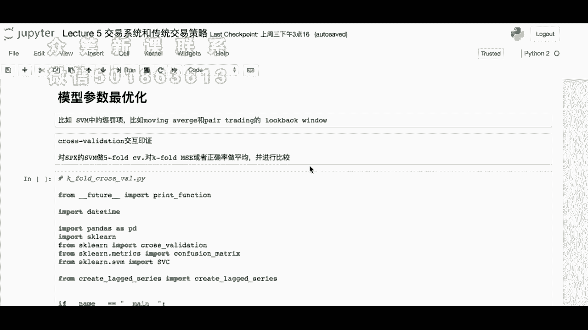

也就是交互印证，那么交复印证呢，顾名思义，当我们有一个data set啊，假设长度为N，那么我们希望把它分成啊training，就是训练集和testing，也就是测试集来进行一个自身的测试。

那么如果说是发啊KK等于五，也就是5fold的cross validation的话，也就是如下图所示，我们一开始以第以第五分，前15部分作为啊test，那么后面的蓝色区域的长度作为建模，建模之后呢。

我们用后面前面的这个橙色区域的点，来对它呢进行啊测试，我们是我们用这些点来算出，我们的testing的MSE，也就是嗯平均的呃平方误差，那么接下来呢是第1/5到第2/5段，作为test，以此类类推。

我们就有五组啊，测试的MSE，那么把它们做一个平均，也就是我们这一整个数据集的一个，out of sample的啊MSE，那么啊对于不同的参量，我们算一个平均的MSE。

那么我们比如说拉姆达从1~10取十个，那么我们选出哪一个MC是最小的，比如说拉姆达等于六的时候，MC是最小的，那么我们就认为啊这个拉姆达等于六呢。

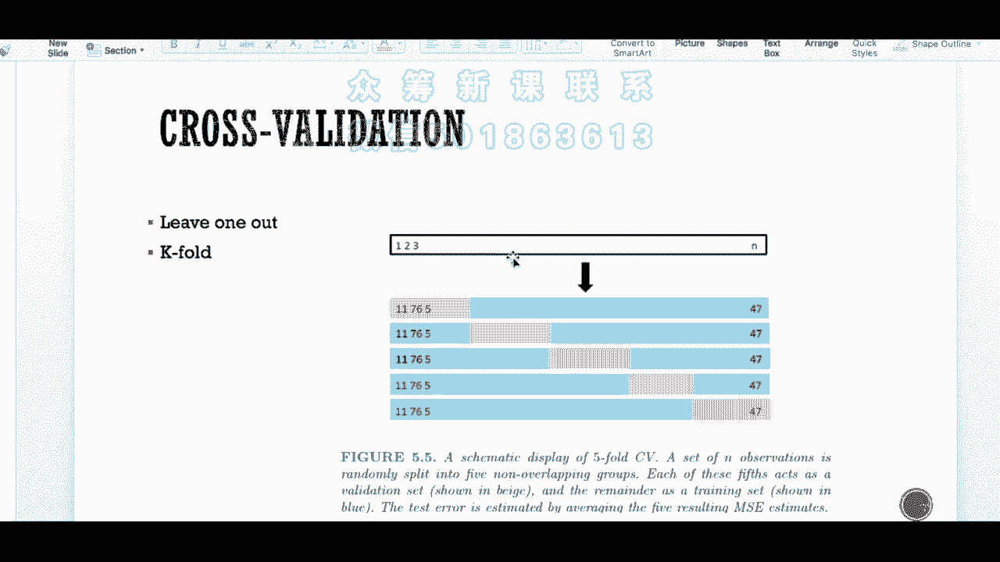

是最优的一个参量，那下面的是我们对第二种方法，就是嗯SSPX的这个SVM做一个啊，5fold的cross validation，那我们对这个正确率取平均进行比较，那我们这里调用的是这个SBC。

也就是这是向量机对于分类的这个函数的package，那这个呢下面呢我们就打印出我们的呃，通过交互印证，我们是five fold，也就是有五个的结果，我们可以看到不同的fold。

以不同的fold作为train跟test，我们的这个击中率都是不一样的，也就是当我们这个呃，SVM支持向量及C取这个数值的时候，我们我们能够得到的一个结果，那我们改变上面的C会得到不同的。

这个his read的平均，我们选一个啊，hit能那能让hit rate达到最高的啊，这个惩罚C呢，作为我们最后交易的strategy的时候，选所选用的最优的啊这个C变量。

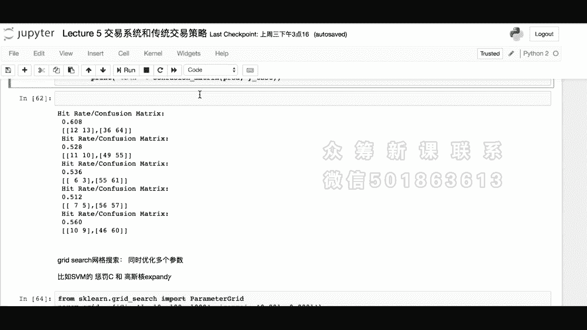

那么下面还有一种方法是用research就是网格搜索，那么网格搜索呢比啊cross validation来的缓慢。

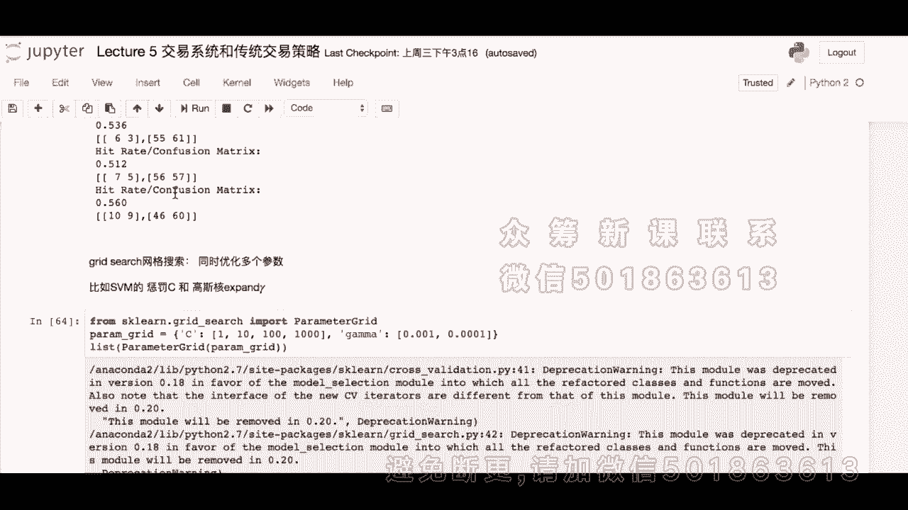

同时优化多个参数。

那么比如说对啊，Svc，我们上面呢只能对于一个特定的C做crossfit day，但这边呢我们可以同时最优化成法向C和。

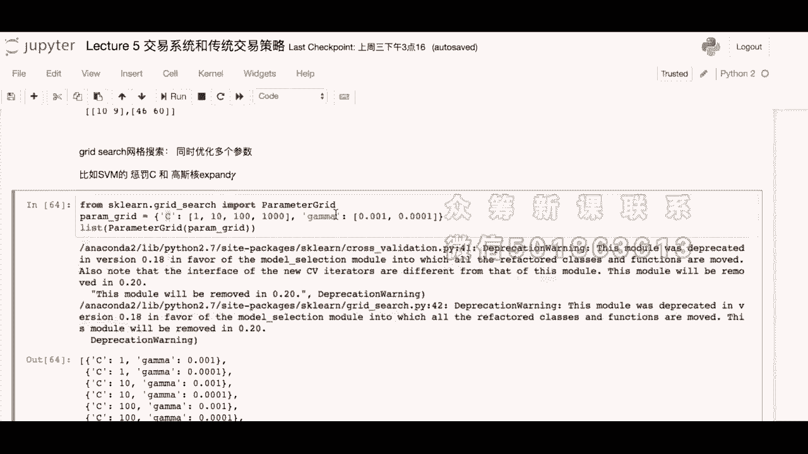

这个嗯高斯和伽马的这个参数，那么我们可以取固定的这个步长。

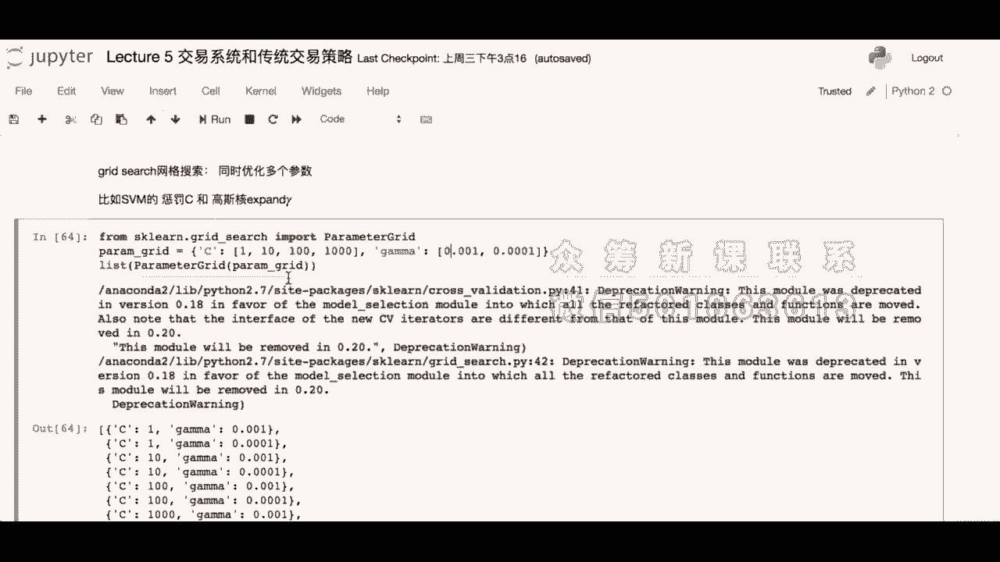

那么就是C呢取一是一百零一千。

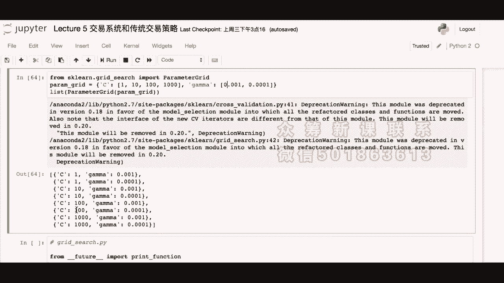

那么干嘛呢，是啊1‰或者是万分之一。

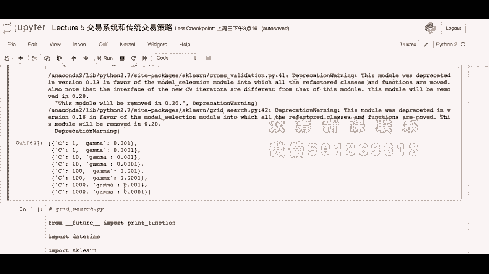

那么呢他们就构造了一个这个网格，那么我们调用这个research网格搜索的这个包，那嗯接下来呢会给我们一个用网格搜索得到的，最优化parameters的结果，那我们可以看到对。

不同的就对高斯和不同的这个C和不同的干嘛，我们能够获得的这个正确率就hit hit rate，那我们可以看到呢，最高的hit raid是以下的几组参数，那我们选取hit最高的参数。

作为我们交易策略的这个input就好了。

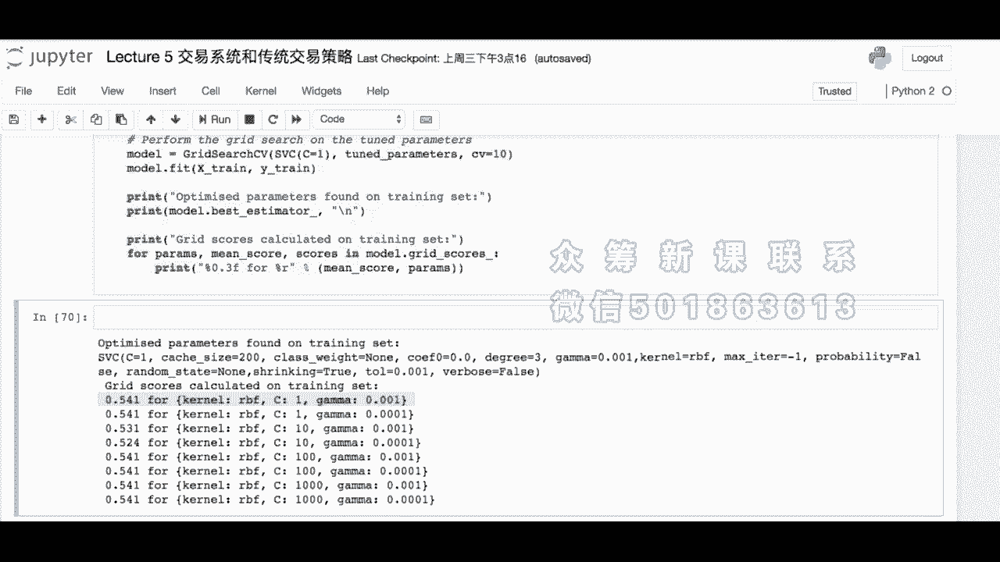

那我们最后讲一下这节课的作业，我们这节课的作业是如下，就是我们要复嗯，同学们可以复习，并且整理呢，我们这堂课上所讲的交易框架，就事件驱动的交易框架，并且根据我所说的。

理清他们每一个class之间的依赖关系，那么呢因为为普外的代码，但是大家先不要看，先尝试着自己用伪代码写出框架，包括每一个class，每一个class的。

如何引领手初始化和每一个class包含多少种方法，那这些方法每一个方法的input和output，那应该是什么样的，那么然后最后每一个class之间的联系关系，请大家写出。

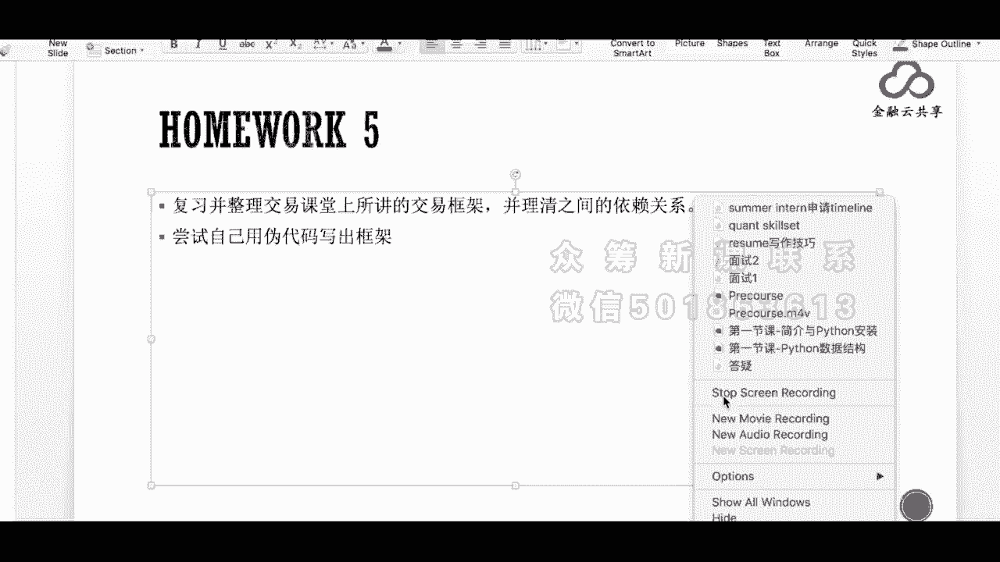