# 吹爆！这可能是B站最完整的（Python＋机器学习＋量化交易）实战教程了，花3小时就能从入门到精通，看完不信你还学不到东西！ - P9：第09节-贝叶斯例子和线性模型 - 凡人修AI - BV1Yx4y1E7LG

那在我们来看我们的Python例子之前，让我们先回顾一下我们要做一件什么事情，首先呢我们要基于这个嗯抛硬币投掷50次，那么我们目前得到的是十次的have，来对我们的参数theta，也就是我们抛硬币。

我们硬币的公平性进行一个贝叶斯估计，那么我们假设呢，我们C塔的先验分布是贝塔分布，那么嗯阿尔法呢跟贝塔这两个参量都是12，那么正如我们所说，如果阿尔法跟贝塔都是12，那我们根据贝塔分布的均值和方差。

我们会得出我们的均值是0。5，也就是我们的公平性，硬币的公平就是0。5，那么他的VANCE也就是方差了是0。1，那么我们通过这个可以得到我们的理论表达式，也就是贝塔的后验分布呢是一个贝塔分布。

那么阿尔法跟贝塔分别是22和52，那让我们通过我们的拟合，来验证我们这样的一个事情，那么我们运用的呢是MCMC，也就是Mark of chain monte carlo进行一个验证。

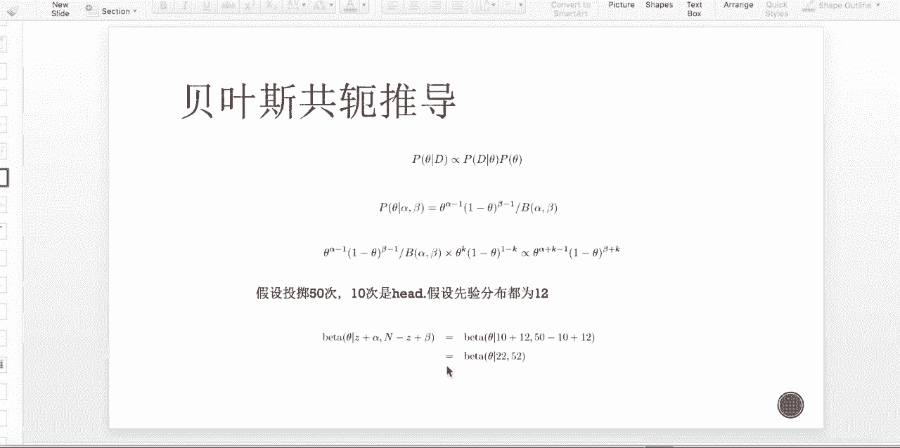

那我们要导入的是一个画图工具，number派工具，还有我们的呃p y m c three three，也就是做mk of chain monte carlo的这个Python package。

那么我们还要导入我们赛派的stats，那么这三个的module。

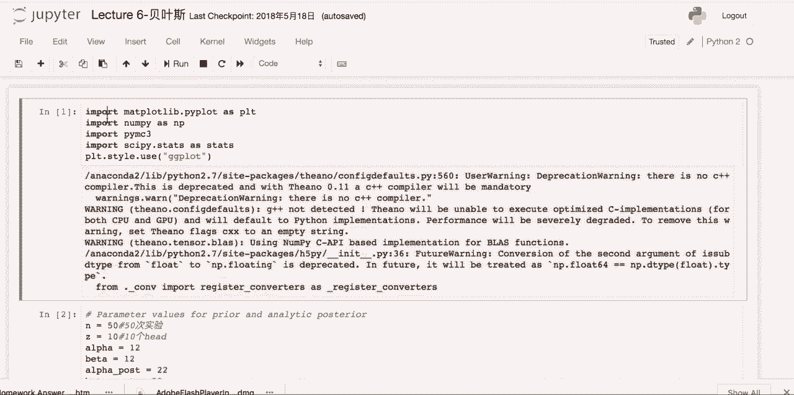

我们在之前的课上已经简要的介绍过了。

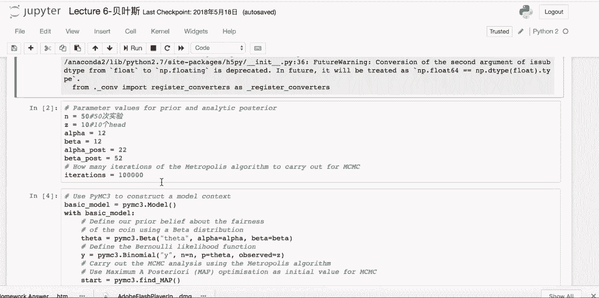

那么我们一开始要设置我们的参变量，我们是进行50次实验，那我们得到了十个的head，那么我们的鲜艳，也就是阿尔法呢跟贝塔都是我们的12，那我们通过我们的共轭贝呃，贝叶斯的先验分布。

我们会得到我们的后验也是一个贝塔分布，那么阿尔法跟贝塔呢是22和52。

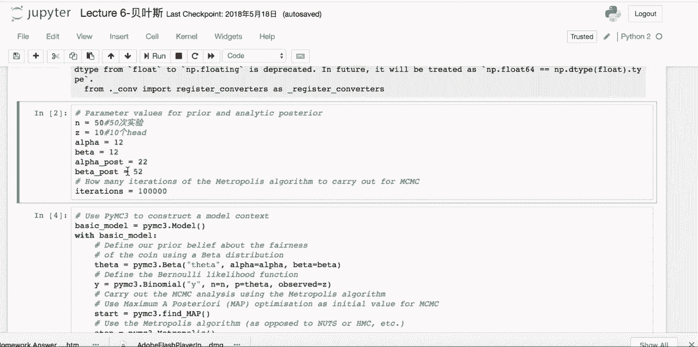

那么我们之前提过我们这个嗯MCMC呢，需要定义我们要做多少次的iteration，那我们此处利用的是这个metro police算法，那我们定义我们要做10万次的迭代。

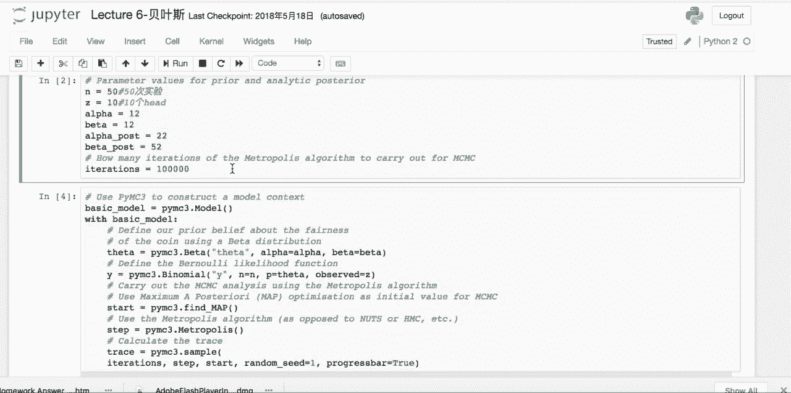

那这一块呢是主要的函数来定义这个嗯，P y m c，所以每一个参变量，那它的新tag with某一种mc mc sweet model，那我们先定义我们的theta的先验，我们定义它是一个贝塔函数嗯。

那阿尔法跟贝塔就是我们的鲜艳。

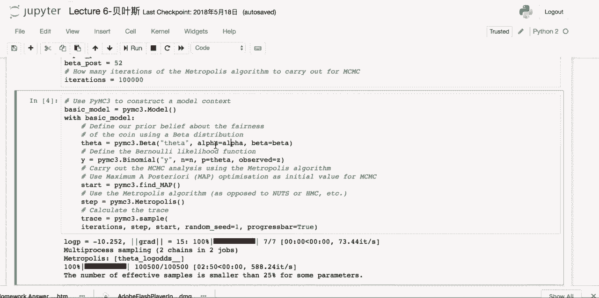

分别是前面说过的12，那么我们要定义我们的Y，也就是我们的伯努利likelihood，那么我们知道我们抛硬币是一个伯努利啊分布，那C塔呢是我们要估计的，那么N跟Z呢都是我们的观测值。

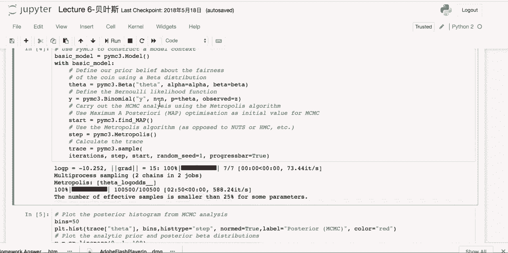

跟我们的实验次数，那这个时候我们的start point。

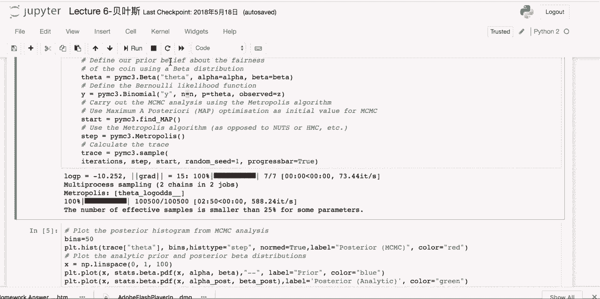

也就是这个metro police算法的初始点，initial点呢我们用我们的嗯map estimation，也就是最大后验分布作为我们的初始点。

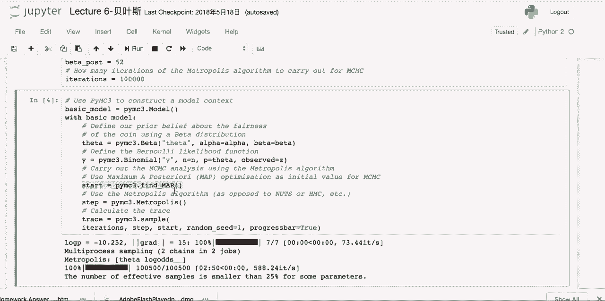

那么我们就进行这个step的迭代，那trace呢是我们最后的这个output module，也就是我们的trace，那可以通过trace得到我们的估计的分布，以及呢画图。

那么running的时间呢它比较久。

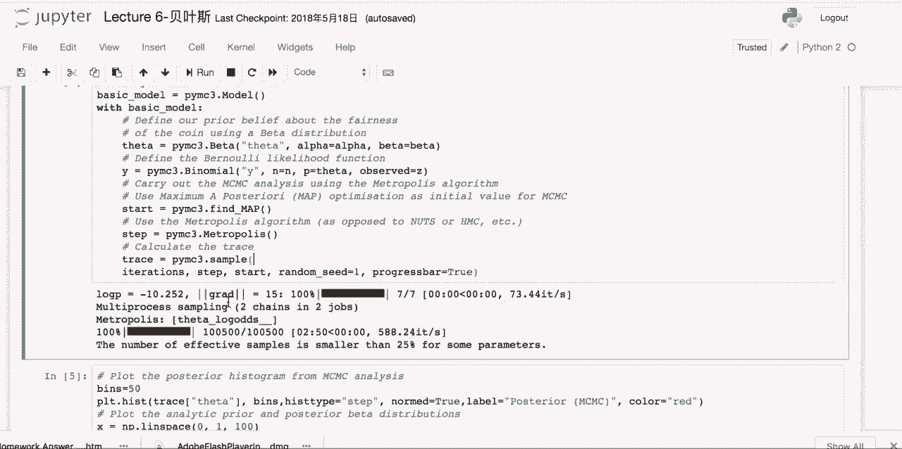

因为要做10万次的estimation，那让我们直接来看结果。

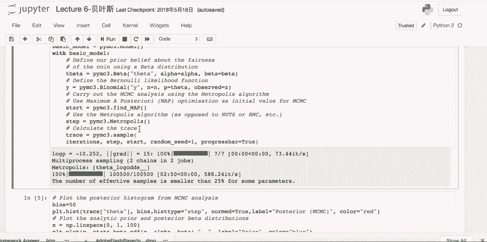

我们在这里呢会画出我们trace的结果，就是用metro polimc mc，对我们C塔的后院分布进行一个画图。

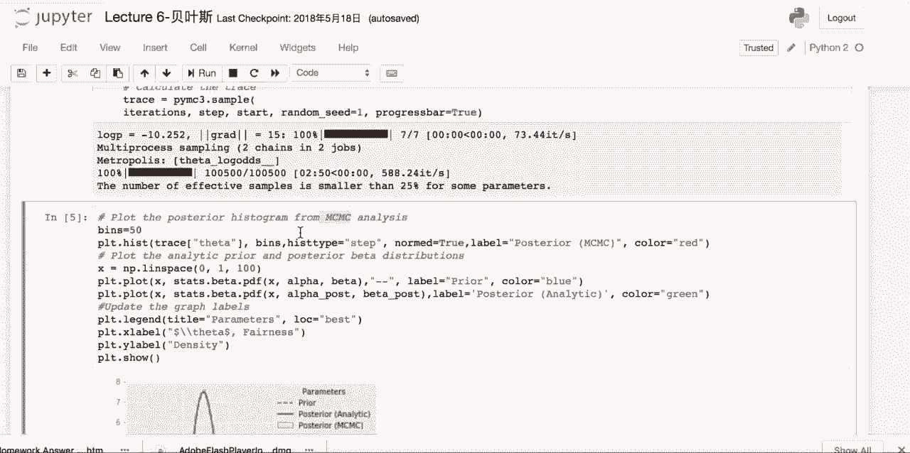

那么这里我们可以清晰的看到，理论值是这个绿的，绿色的值，也就是我们前面通过数学推导出的贝塔22，逗号五十五十二，那么我们可以看到MCMC的结果呢跟ANALYTICS，也就是理论只能是几乎完全重合的。

那我们的prior呢就是我们的对theta的先验，就是我们以0。5为均值，那么0。1呢为方差的一个这样的贝塔分布，那我们可以看到通过我们有了新的observation，也就是50次实验。

只有十次得到head，那么我们正如我们intuition所知，我们这个prior呢，会晚我们的这个零零点进行一个偏移，因为这个时候毕竟我们只得到了十次的head，那就说明我们这个硬币有可能是有存在的。

一些BISS的不是完全公平的，那么这通过这个我们的这个Python实验呢，告诉我们就是MCMC呢，在做最爱做我们的POSTERIOUS的分析的时候呢，依旧是有效的，那么这个地方。

因为我们知道它的analysis理论值，那么有的时候呢应该说大部分的情况下，因为我们的先验和后验分布都会比较复杂，所以我们并没有办法通过理论推导，推导出这根绿线的ANALYTICS值。

那么我们只能完全相信我们MCMC的啊，influence的结果。

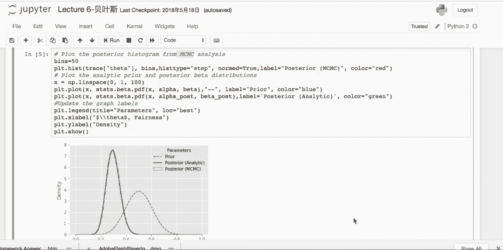

那么接下来呢让我们来讲贝叶斯线性回归。

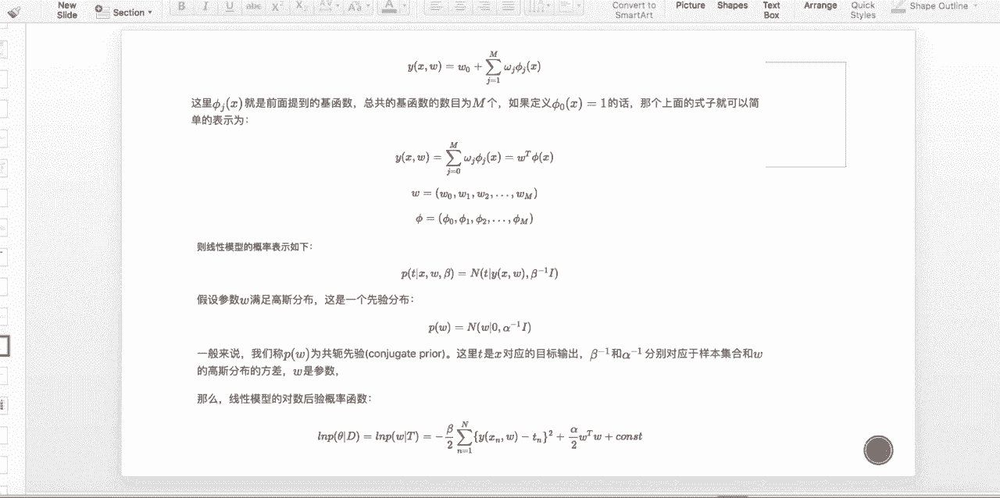

那么我们前面的是对贝叶斯的理论进行介绍，那么我们这里要对贝叶斯进行一些使用，那么很重要的一个应用的应用的块儿呢，就是线性回归，我们之前提过的线性回归呢，是一个简单的基于我们的。

我们得到了一些training dataset，那我们通过那个线性拟合把它拟合成一根直线，那么我们之后呢只要有新的input data，就带到我们这个拟合的直线上，我们算出我们对Y的估计值。

比如说SMP的return，比如说是黄金，黄金期货，gold return啊等等等等，那么这种最flat的线性回归有什么坏处呢，就是它跟最大思想古迹一样，因为我们没有我们一个鲜艳的一个主观的idea。

那么这个时候完全信赖于我们的，后面得到的观测值，就会使得模型过于复杂，有时候呢还会产生过拟合的现象，因为我们不存在先验分布，对我们的后验进行一个稀释了，那这个时候对于flat的线性回归。

我们会使用一个叫做交叉验证法，Cross validation，但是呢交叉验证法我们之前提过，他的主要思想是把数据分为训练集和测试集，那么这个时候呢，就会有一部分的数据不会成为嗯训练集。

那么这样就会对数据样本产生浪费，而且比如说做ten fold，Cross cross validation，那也就是说我们得做十次的拟合，那么当fold比较多的情况下呢，我们的运算速度也是很慢的。

那么基于上面这样讨论，我们就可以引出一个，另外的一种线性回归的想法，也就是贝叶斯线性回归，那么贝叶斯线性回归的好处是，它不但可以解决最大自然古迹的过拟合的问题，而且它对数据样本的利用率是百分百的。

它不需要把数据分割成训练跟测试集，那么这样呢就可以通过仅仅训练样本，就能有效并且准确地得到我们的模型，而且能够达到我们心中想要的复杂度。

那么让我们来看一下，简单的看一下我们的这个BS线性回归的理论，那么具体的推导呢过于复杂，那么我们这里只做一个简单的结果的介绍，和流程的介绍，我们首先一样的，我们有一个，我们有一个我们这个模型的一个假设。

比如说是有M维的，那么加上一个截距，也就是M加一维，那我假设我的这个训练集的响应，满足一个这样的线性表达式，那么呢我们对我们的estimation，有一个概率的一个idea，也就是T其实是y hat。

也就是Y基于线性模型的一个古迹，那满足什么呢，那满足一个比如说是这样的正态分布，那么我们需要假设呢，因为是贝叶斯，我们需要假设一个先验分布，我们参量W也就是我们的线性回归的截距项呃。

呃斜率下有一个先验分布的一个认知，那我们依旧因为想要得到一个比较好的，理论的表达式，那我们先假设它是一个正态分布，那我们要利用正态分布和正态分布的卷积，依旧是正态分布这样一个共轭先验。

我们之前提过的共轭先验有很多数学的优势，那所以我们假设两者都是正态，那我们得到了这个后验分布，也就是呢p w depends on我们的大T，那大T呢就是所有的观测值。

包括我们的y hat嗯和X和正和真实的Y值，那我们得到一个后验概率分布的一个log的函数，那么通过上面这两个正态，正态分布的卷积的化解，让我们得到如下这样的一个表达式。

那么我们可以简单的看一下这个表达式的，第一项，我们去掉这个贝塔，那么这一项呢其实是最基础的，OLSS普通线性回归的一个均方误差，就是Y减去Y1，hat平方的12的一个表达式，那么后面多挂了一项什么呢。

也就是2/2法欧米伽转置乘以欧米伽，那么欧米伽就是我们这个参数，那么这个其实是一个类似于领回归的，一个带penalty的最小号成回归，所以这个贝叶斯在我们假设嗯，两个分布都是正态分布的情况下呢。

跟领回归呢有相似之处，那我们的这个贝叶斯线性回归的学习呢，是一个依旧是使用贝叶斯公式进行一个update，比如说在前一个训练集合，我们称为D的N减一，那这个D里面包含的就是X跟Y这样的一个。

训练的pair，那么我们下一步的后验的update等于什么呢，它就正比于啊新的样本点的一个这个四兰，其实也就是联合概率分布乘以，上一步我们得到的后验，因为我们这个时候已经把上一步得到的后验。

作为我们此次的先验，那么so far and so forth，以此类推，直到我们前面，我们后面得到的这一个后验概率分布收敛，也就是不再有任何的不再有一个扰动，那么这个脑洞我们定义为多少呢。

我们可以通过参数设置，比如说tolerance是啊千份一等等等等，那么这个就是贝叶斯先呃。

贝叶斯的线性回归模型的一个理论基础，那么我们来看一个最简单的模型，就是一个啊这个只有一个圆的一个线性回归，那我们需要update呢是W0跟W1，那么我们W的这个先验信息呢，依旧假设为是一个正态。

那么Y呢因为是线性回归，所以他依旧也是一个正态分布，那么我们第一行呢就是我们的初始状态，那这个时候因为只有W的行业信息，所以这个时候呢W的形式如下图所示，那么第二行我们就有我们得到了一个样本点。

称为呢X1，那我们根据X1呢，就可以得到第二行中间关于X1的自然估计，那就是如下图所示，那么呢我们由Y的这个线性表达式，我们可以得到它的对偶，那么根据对偶的optimization，我们可以解出。

就是第二行最右边关于W的估计，的一个线性方程，那我们由这个方程进行卷积，那我们就得到第二步，由我们X1Y1的这个样本点，对上面的这个鲜艳进行了update，也就是第二幅中间的这幅图。

是由我们由一个样本点而得到的，第一步后验，那么以此类推，由第三部的第二个样本点，那么我们跟上一步的这个后验，也就是作为我们第三步的先验，那么进行卷积又得到了新的第二步，对于W1跟W0的后验分布。

那么so funnand，So forth，以此类推，直到我们的这个啊参数呢，converge到了一个比较中心的值，就不再具有一个非常大的方差了，那么比如说这个时候，我们就有理由相信。

W0呢是接近于大概0。2的位置，那W1呢也就是接近于0。5的位置。

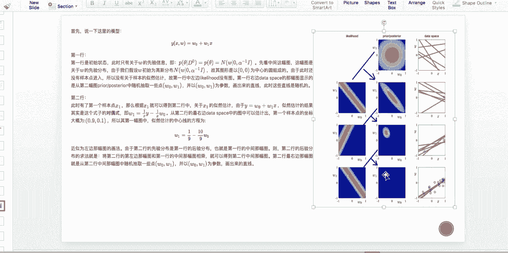

那我们接下来呢再讲我们的呃，贝叶斯随机波动率模型之前。

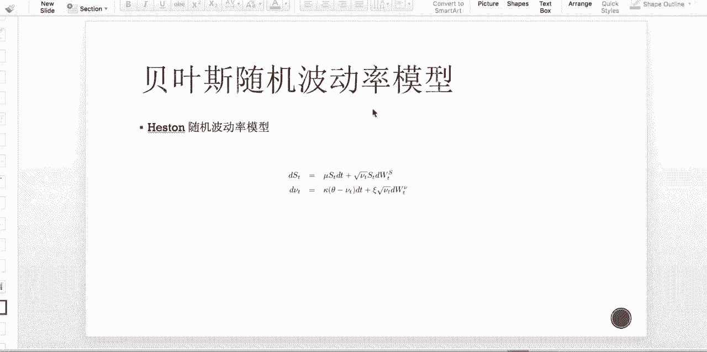

让我们来看一下，我们之前所述的这个贝叶斯线性回归。

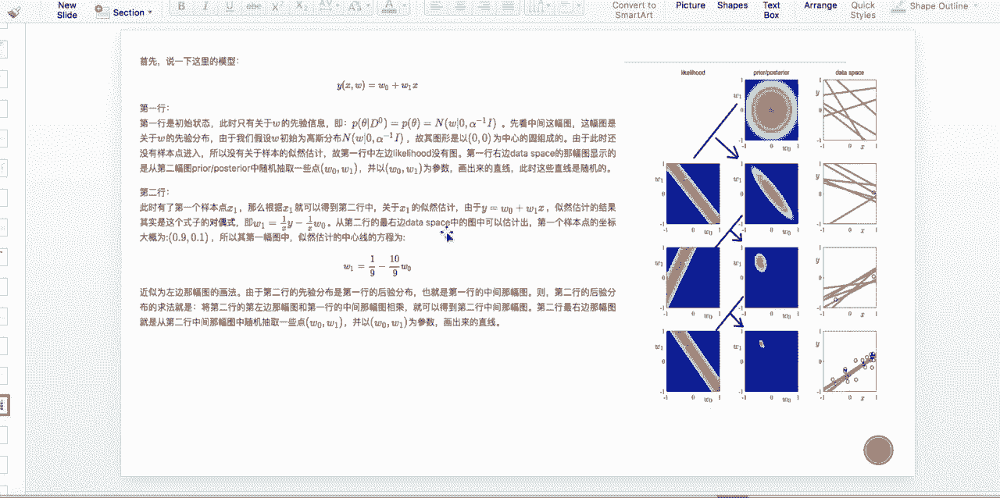

对于参数update的这个啊Python的式子。

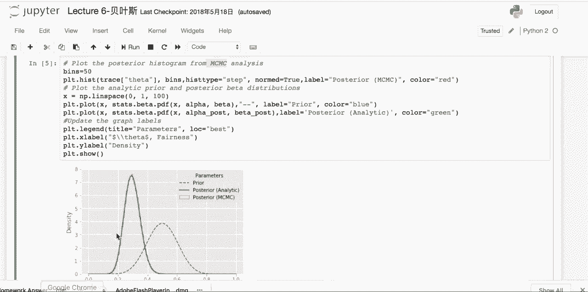

也就是呃besilinear regression with啊，P y m c three，跟我们下面用MCMC一样的一个module package。

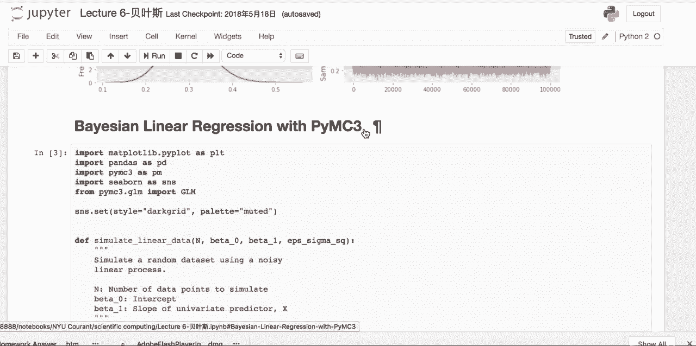

那这个地方我们要导入的是啊mc three，一点GLM也就是做这个generalized linear model。

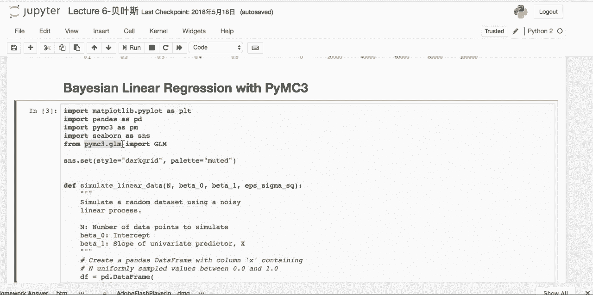

那在此处呢也是一样的，我们要定义就是核心的步骤。

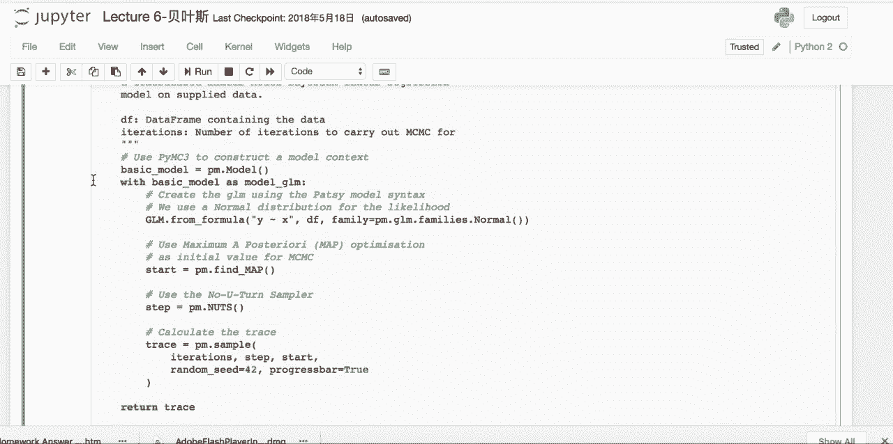

做这个PYMCSWE的就是我们的这个with model。

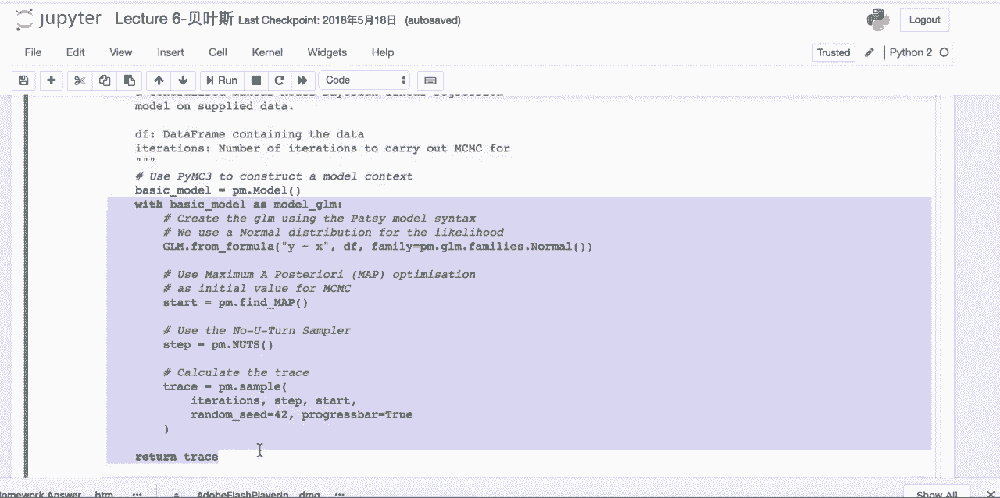

那with model不一样的地方是我们调用这个gm model，那from formula是什么样的，formula呢是Y关于X的一个线性方程，那我们的family family的意思是我们的这个Y。

也就是我们的instant劳动项，应该是一个什么样的分布，那么假设它是高斯，是一个正态分布，那这样Y本身呢就也是一个正态分布，是我们最正常的linear regression。

那我们start point依旧定义为map estimation，那这个时候我们用的是嗯，这个NO u turn的一个sampler，那用上面的这个METROPOLICY也是可以的。

那这个时候依旧定义我们的这个trace，有多少次iteration啊等等等等，那定义了trace之后，我们就可以plot出我们最后的这个额趋势图。

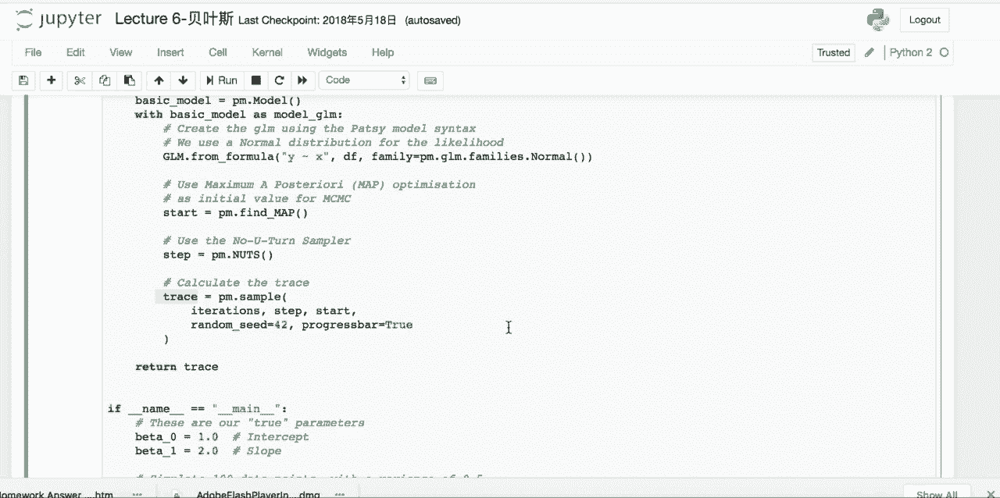

那此处呢都是定义我们的一些参变量。

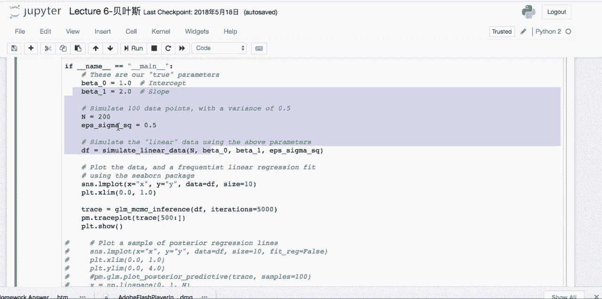

包括鲜艳丰富的参变量，包括我们有多少次sample等等等等。

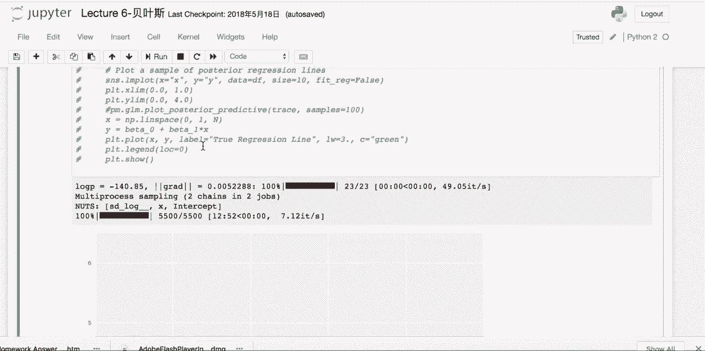

那么这个呢是我们的线性回归的这个plot，那我们可以看到呢，我们这边有一个阴影线，其实阴影线就是我们估计出来的W本身的方差，那么它因因为存在的一些方差。

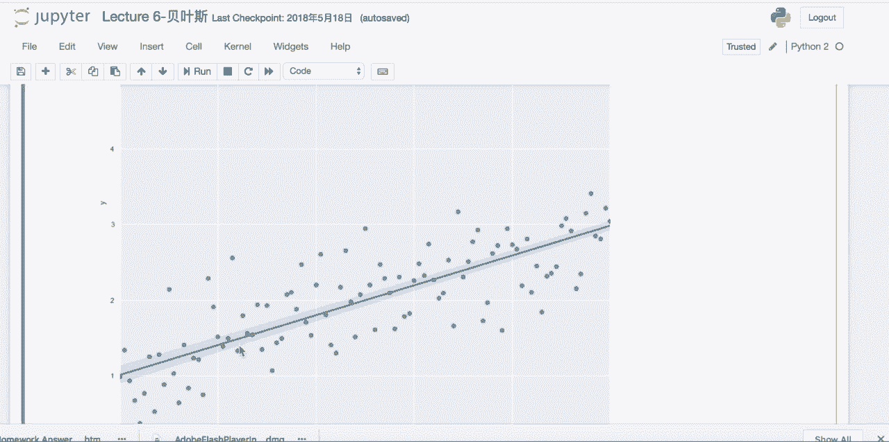

所以我们这个县有一个上下的这样的一个，Boundary，那这个呢是我们截距项，W0和一次项的这个后验分，后验分布的一个plot，那大家可以看到这个截距项呢。

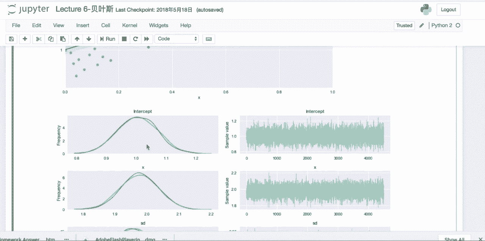

就是中心值差不多是一。

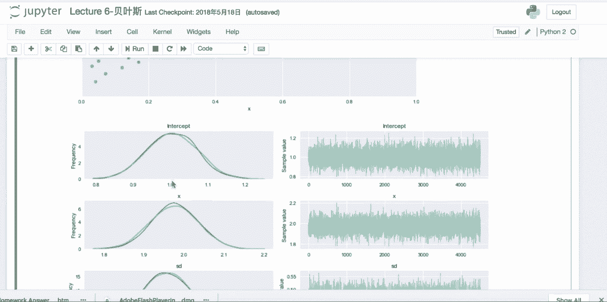

那这个嗯X项呢差不多呢是2。0，那SD呢就是它们就是我们线性分布，有一个西格玛方，也就是我们扰动向的嗯，SD这个地方应该是standard deviation，也是我们扰动向的啊。

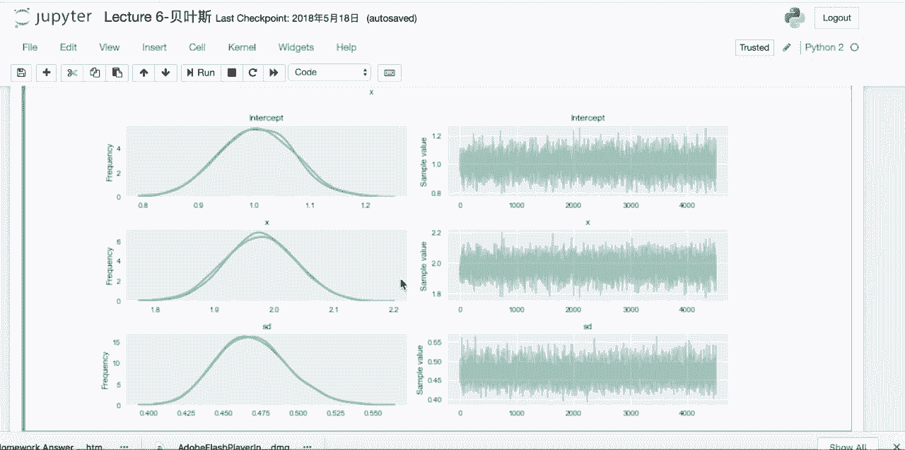

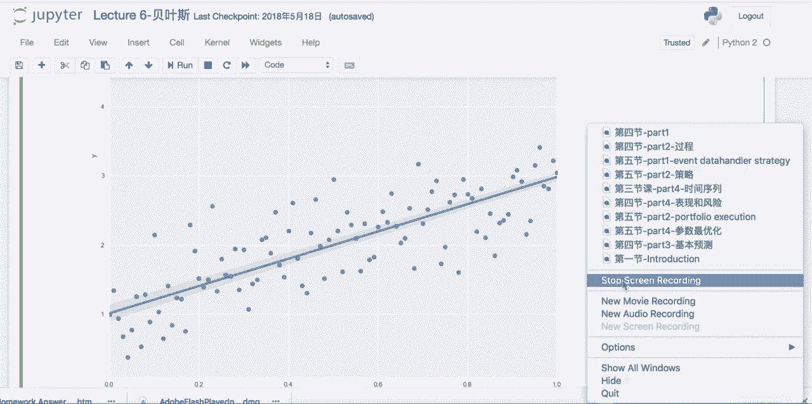