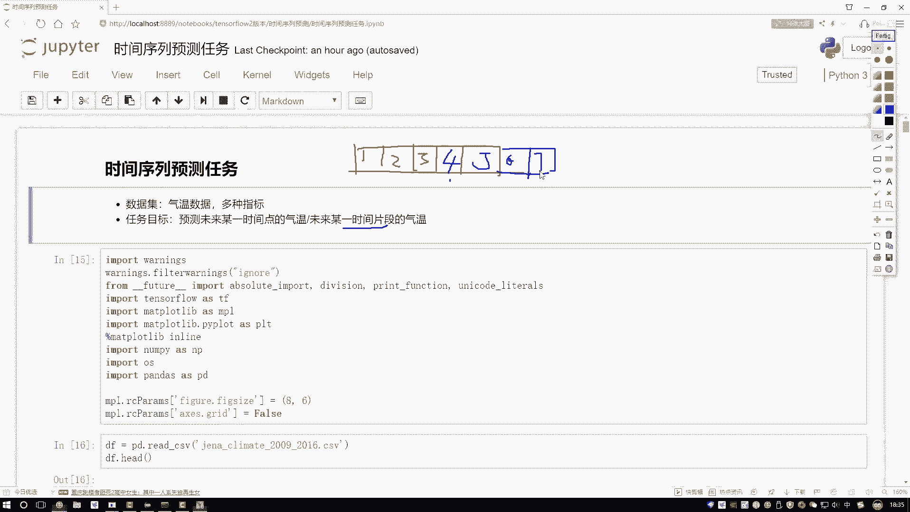
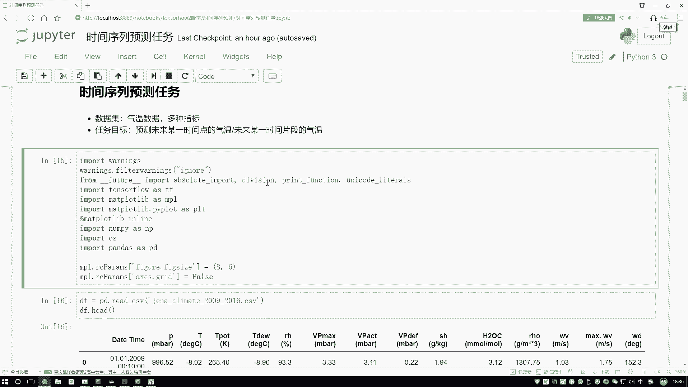
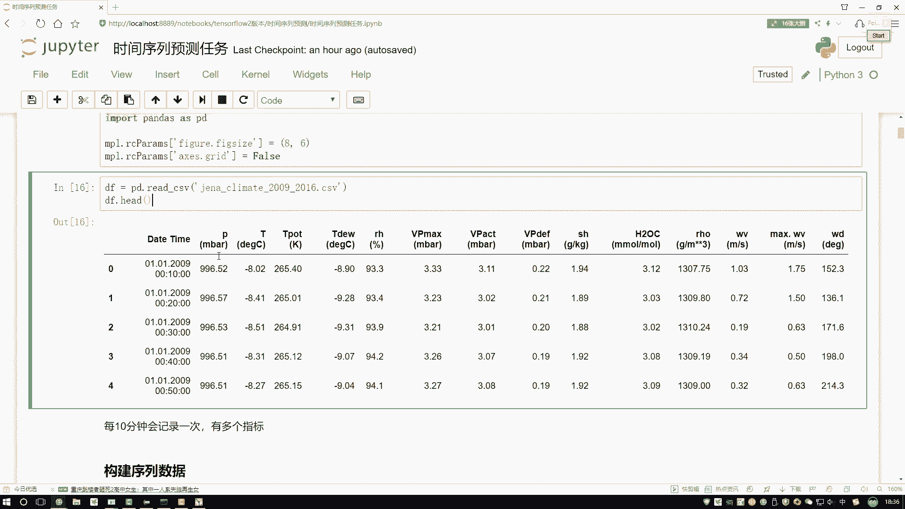
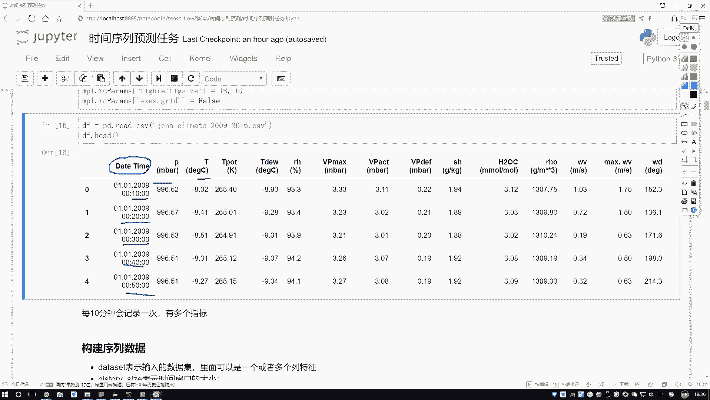
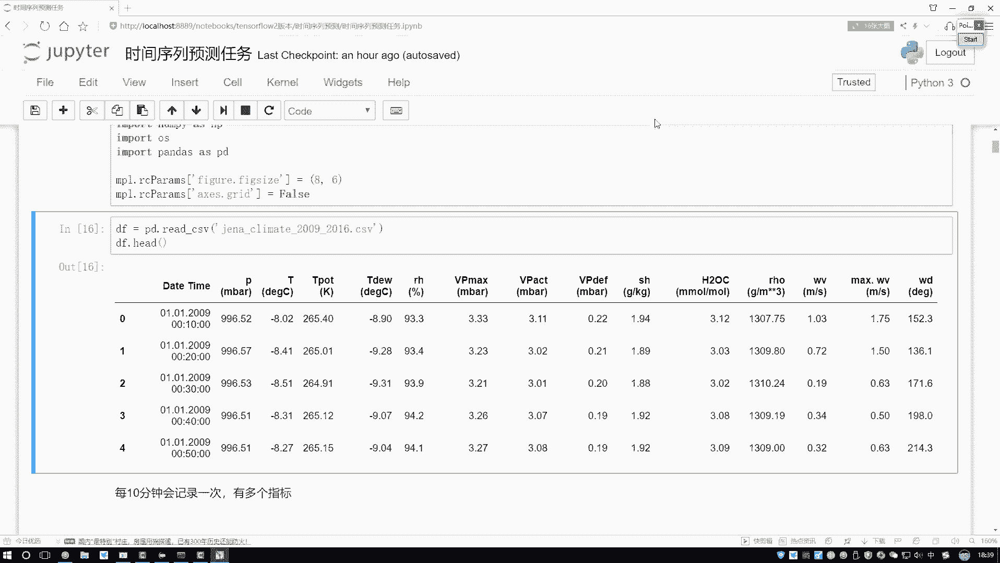
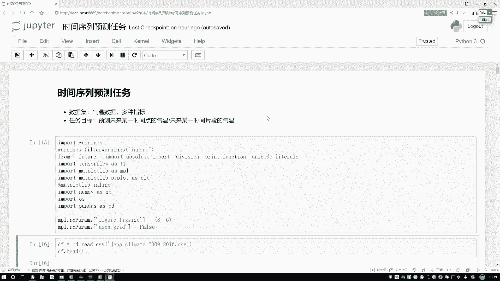

# 吹爆！这绝对2025年讲的最好的Python金融分析与量化交易实战教程！从金融时间序列分析到因子选股实战，全程干货讲解，零基础小白可学！（人工智能丨机器学习） - P57：01-1-任务目标与数据源 - 迪哥的深度学习课堂 - BV1YFcbe8E8X

这节课咱们的任务目标是基于TENSORFLOW，进行一个时间序列任务的预测，先给大家解释一下吧，咱们的时间序列啊说的是一件什么事，这里啊就是咱们的数据啊，跟之前是不太一样了。

在以前任务当中好像是我们的输入哎，对应一个输出，一个输入，再来一个输出，再来输入，再来输出，数据之间可能没有什么太大关系，比如一些图像数据，还有呢传统一些数值数据，当然啊就是文本数据当中啊。

可能是跟实验数据啊比较相关的一句话，我们也可以把它当做是一个时间序列，因为一句话当中啊，咱们有第一个词哎，第一次说完之后再说，第二次，第二次说完之后再说第三个词，有这样一个顺序的关系啊。

我们把这个任务啊就叫做一个时间序列了，其实在这块当中啊，咱的时间序列还是比较常见的，比如说一些气温数据，气温啊随着时间的变化，然后得到各种各样的指标，那我说我想接下来去预测，在未来的某一段时间当中。

我们这个气温的一个走势，那这个就是时间序列，我们会基于啊历史的一个数据，当然这个历史数据啊并不是某一天的，而是一个序列，比如现在我有这个这一个月的吧，一个月当中有一号它的一个气温，然后还有2号的气温。

然后呢还有3号四号一直到5号的气温吧，我说接下来我想预测第6号的一个气温数据，我拿蓝色化，这个是我要预测的，那这回啊大家可以想一想，那既然咱们这些时间序列任务，前面的一个输入。

是不是都会对最终结果产生影响，一会对六产生影响，234562345也会吧，所以说啊咱一会儿要大家用的模型，肯定咱不是一个传统神经网络，也不一，般情况下也不用卷积神经网络应该用什么，应该用一个RN网络吧。

好了一会儿啊，咱们的核心架构就是用RN来去构建一个，时间序列预测的一个任务，然后接下来呢给大家说一下吧，就是诶咱们这个任务给大家举了一个例子，数据集啊，给大家选的是一个气温的数据啊，像我刚说的。

咱们真拿到一个气温数据，然后呢在这个切车数据当中啊，我们有很多指标啊，比如说实际清醒点多少，然后当天的一个压强，当天的各种各样指标，降水啊，降雨诶，好多指标咱都有啊，这些我们可以当做一些辅助的特征。

然后呢咱们任务就是去预测未来哎，比如说某一个时间点，或者说某一个时间片段，那时间点和片段有什么有什么区别啊，给大家再画一下，时间点是这样，时间点就像咱们该画的，我就拿小化几个吧。

我说知道这个1233天数据，然后呢我说就去预测这个第四天的第四天什么，它是个时间点吧，好了预测出来第四天它结果值，那给我们感觉是预测一个值吧，那我们能不能接下来去预测一个时间片段呢。

或者说预测一下接下来的一个序列呢，比如这里这是第四天，这是第五天，然后呢下面还有第六，第七天，哎我说我预测一下后面这几个值行不行啊，肯定也可以的，方法比较多啊，呃咱这里给大家举一个比较直接的。

就是一个多输出的问题，比如这里我说呃输入是前三天的那输出，如果说你想要未来四天的，那我说啊咱输出结果值哎，咱就得到四个结果是就可以了，比如说咱们现在之前我说做第四天的，那就是回归任务。

那我做第4567呢，我们预测出来四个结果，再去做回归是不是也可以啊，这个就是咱们当前要做的一件事，一会呢会分成两个阶段，第一阶段跟大家说一下呃，一个时间点，比如说预测第四天咱们该怎么做。

然后第二呢跟大家再说一下，比如说想预测一个片段吧，4567或者是更长的一个序列，咱们该怎么去做啊。

然后第一步还是先把咱们工具包导进来，这个没有什么特别的。

到时候大家直接折现就行，然后呢看下我们数据吧，这个数据啊。

它是从这个2009年到2016年的一个，天气数据，数据里边，它的就是数据样本量是挺多的，然后大家可以看一下它这个第一列，第一列啊是数据的一个时间呃，第一条数据啊是09年的1月1号。

然后十点的第二条数据呢，它是09年1月1号啊，不是不是不是十点啊，他是那个0。10分，第二个它是0。20，第三个是0。30，0。40，0。50，所以说啊当前我们这个数据啊，它是按照一定时间间隔进行一个。

就是自动记录的，每隔10分钟会记录一下当前的一些环境指标，比如说有压强啊，温度啊，还有后面哎各种各样的指标，降水风速哎等等的，这些是咱们当前拿到的一个数据诶，隔10分钟就有一条记录数据了，然后呢。

接下来啊咱们会得说一下。

基于我们当前这个呃数据吧，咱们怎么样去构建这个RN模型，其实方法还是比较简单的，只需我们看什么，咱们来想，现在我说要预测哎未来的一个值，那我的输入应该是什么呀，这回咱们想一想，我说我们的输入啊。

咱们不可能是某一天的，那是几天呢，三天还是五天还是十天啊，这个需要大家自己来选择，比如说我说现在设置个窗口吧，好了，我说这个窗口它是十天的，这里有十天数据，我然后呢我说预测第11天的可以吧。

那接下来呢我说前十个窗口我做完了，预测第11天的好了，那这是我构造出来了一个X和一个Y吧，X是我当前诶一个序列吧，或者说一个时间窗口里边能有十天的第一天，第二天，第三天，因为它是个序列。

所以说咱们一会用RN，这没问题吧，好了，Y值它是第11天具体的一个值，那一个值就是咱输出结果，这个X和Y看起来没问题，那现在好像说我只构建了一个X和一个Y啊，那我们接下来训练的时候，我得有很多组数据吧。

那接下来再怎么构建数据呢，咱们来看啊，这里我说是前十天的，那好，那我说下一个我再画，我拿红色画吧，我说我再取个片段可以吧，再取个片段，第一个片段是1~10天，第二片段我取2~11天行吧，我说当做X。

然后呢把第12天的我说给它当做Y，是不是也可以啊，给我们的感觉就是这个数据反正给范儿了，我可以不断怎么样在数据当中啊，去截取我的一个时间片段，在时间片段当中呢，比如下一个时间点，我当做标签，再截片段。

再当标签，是不是可以啊，这个啊就是咱们的一个一会儿啊，咱们基本做法或者数据集当中，我会选择出来很多个时间片段，当做咱们的训练数据行了，先给大家解释了一下。

就是诶咱们当前时间序列预测任务。

