# 吹爆！这绝对2025年讲的最好的Python金融分析与量化交易实战教程！从金融时间序列分析到因子选股实战，全程干货讲解，零基础小白可学！（人工智能丨机器学习） - P61：05-5-序列结果预测 - 迪哥的深度学习课堂 - BV1YFcbe8E8X

接下来啊咱们再来看一下啊，这回我就不预测一个时间点了，我说未来啊一个序列的一个结果，预测出来多个结果，这个咱们怎么去做，其实方法也是呃很简单的，在这里我们只需要哎你看这个参数当中啊。

他没有写什么true false是吧，咱们来看一下默认的这个函数。

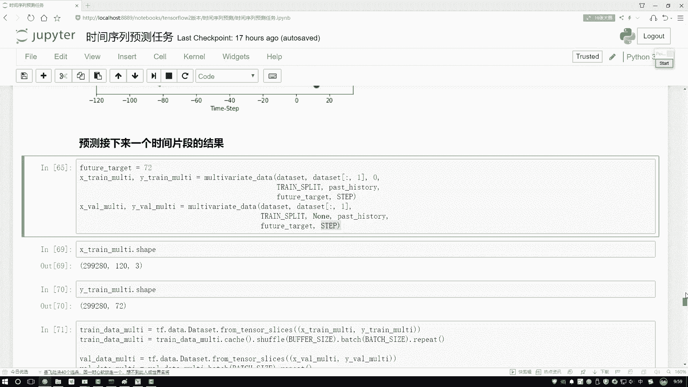

这个函数当中啊，它默认情况下是什么，哎在这里默认它这个SINGSTEP是一个false。

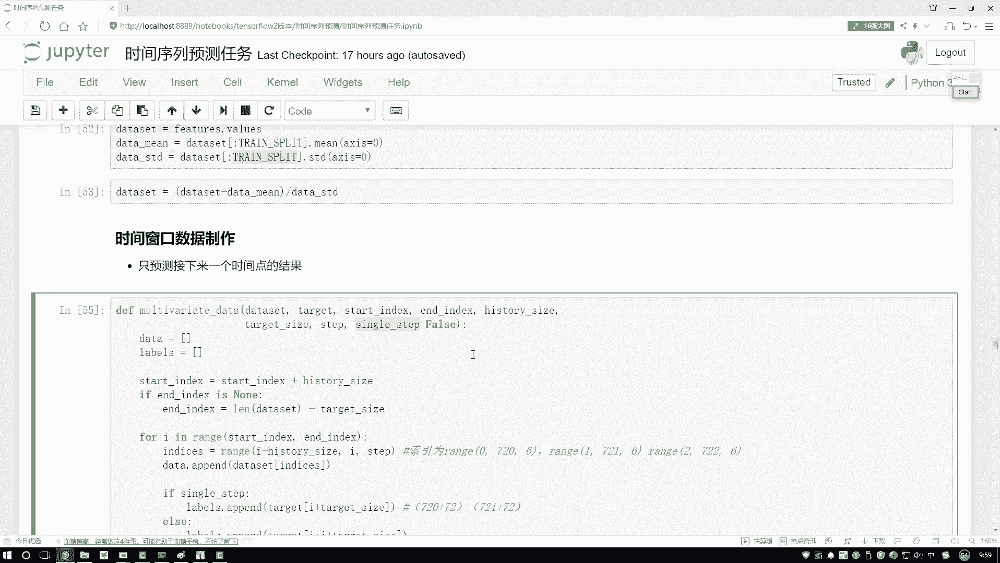

也就是默认走什么，默认咱是一个多标签的预测的。

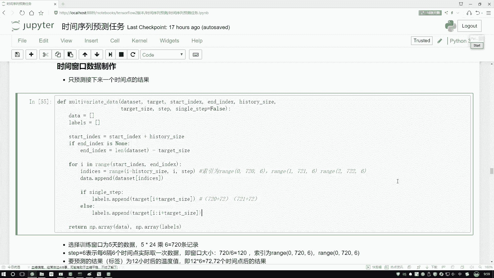

所以说咱们来看一下吧，这里我们没有指定成一个数值，那它会怎么样，他会把咱当前要预测的这个序列。

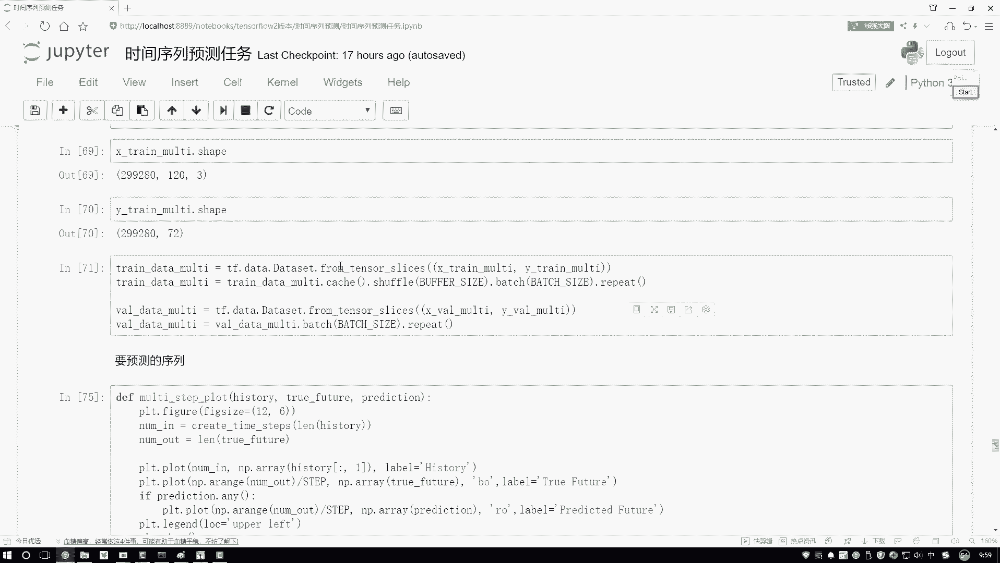

也给它做出来啊，呃训练数据跟之前的做法是一样的，没有什么太大的区别，然后呢咱们主要看这个标签啊，打印一下标签这个维度，咱们来看你说这个标二当中啊，他第一个纬度跟之前是一样的，这个咱不说了。

第二纬度少72吧，也就是说标签当中啊，我们预测的不是一个值了，而是未来多少啊，72值未来的一个区间了吧，好啦这个是唯一的一点不同啊，只是我们的标签不同了，那标签既然不一样了。

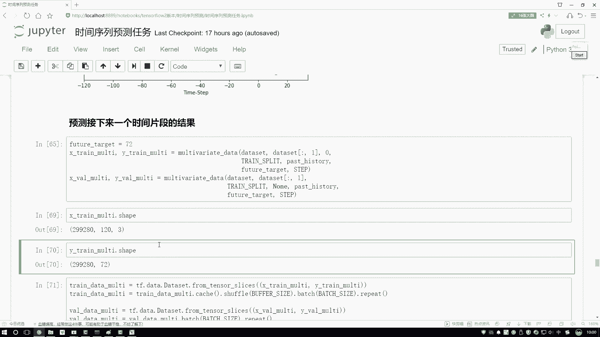

咱得到的一个结果也会不同吧，在这里哎这些去做拜日数据。

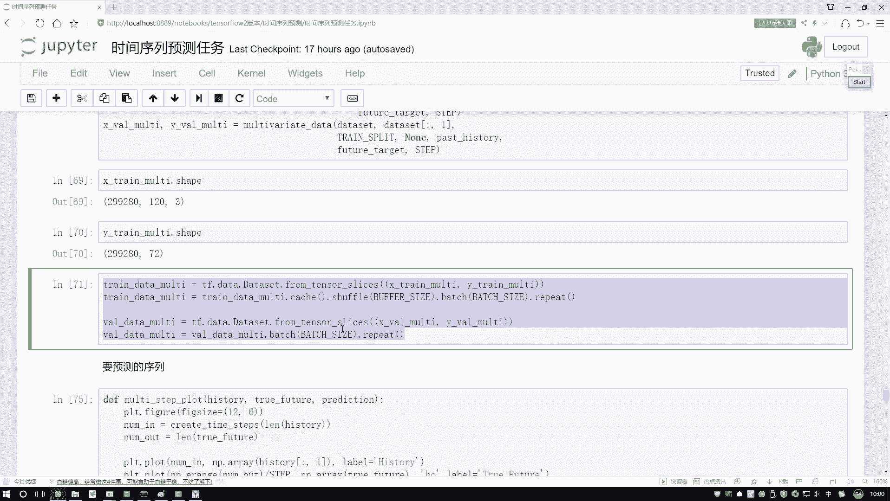

这个咱们不用去看了啊，然后再来看这个训练的时候，训练的时候这块有点不同啊，你看这点咱是用几个序列去做的呀，我说把这个任务也做的更复杂一点了。

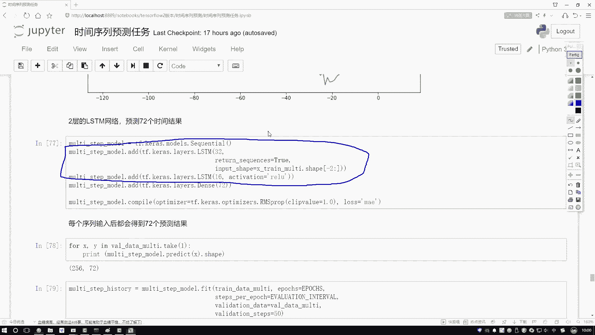

咱不用一个LTM，咱用两层的，第一层LTM得到了32个隐藏执行元，然后大家注意点啊，就是当我们堆叠这个LTM当中的时候，你需要把它返回的一个序列设置成一个数值，因为呢就是我们再往上去堆叠一个LTM。

相当于诶我第一个LTM走完之后，我得到的还是一个输入吧，要输入到另外一个RTL，当中了，所以啊不能给我返回的是一个结果值，我还要这个序列全部的一个结果，一定注意啊，这个值必须是个处值，要不然没法训练。

然后呢，接下来我说我按顺序吧，再加一层LTM，可以吧，好啦，最后我说我连了一个全员阶层，全员阶层啊，大家注意啊，我们的输出一定是多少啊，还是一个值了吗，不是了吧，跟咱的标签得对应起来吧，标签当中啊。

我设置了咱有72支，那这回呢我用这个神经网络做预测的时候，咱要得到结果，它必须怎么样，也是72个值吧，好了，这个是唯一点不同啊，咱们得到了72个结果。

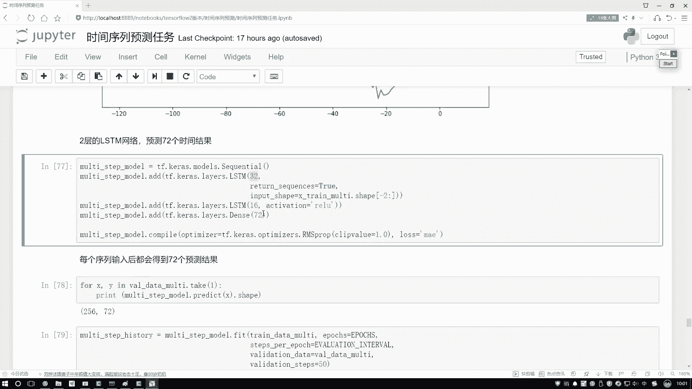

然后呢可以看一下吧，这一块是打印出来了，确实它是72的结果。

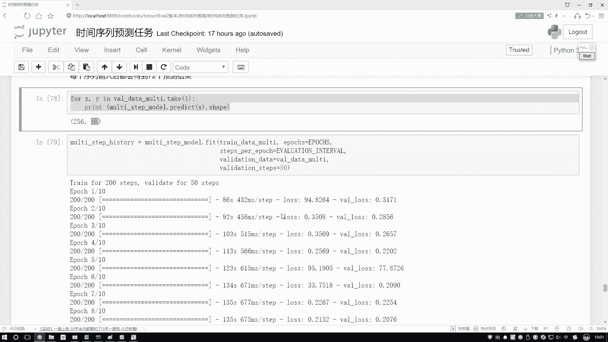

下面模型做训练，这大也不看了，来看一下损失的变化，哎不用看损失变化，直接看最终预测结果吧。

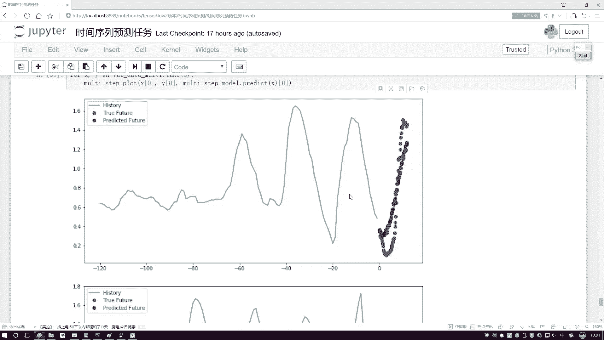

在这预测结果当中啊，这个呃蓝色的是实际的值，然后这个红色的是我们预测的值，你看这里这个趋势它是不是预测出来了，有一个先下降再上升的趋势，然后呢咱们在这个神经网络当中。

你看他是不是也是先下降在上升的一个趋势啊，这个趋势哎预测的还算可以啊，可能不是特别。

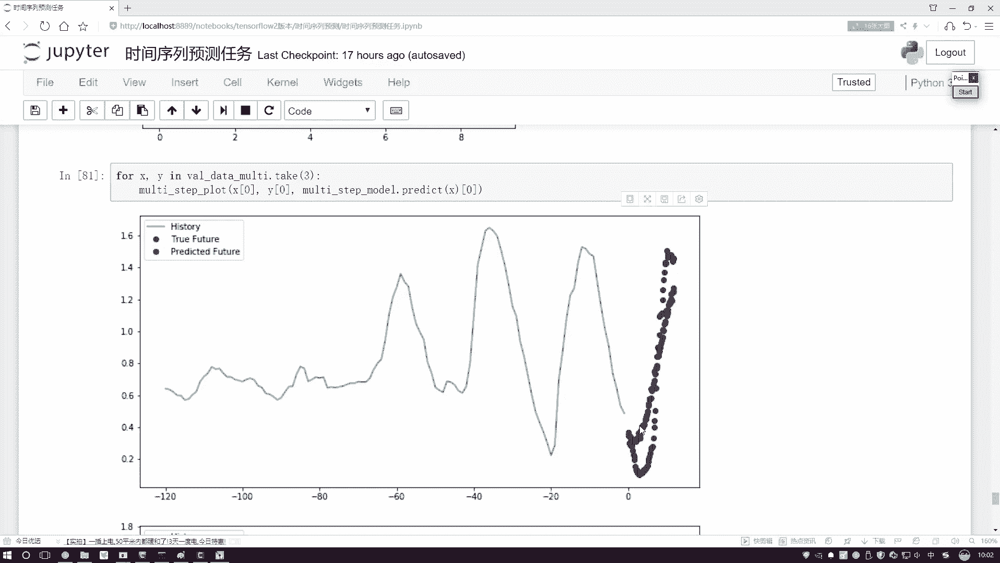

但不是算是那么特别准，这个时也是啊有一个下降，在上升的神经网络预测完之后。

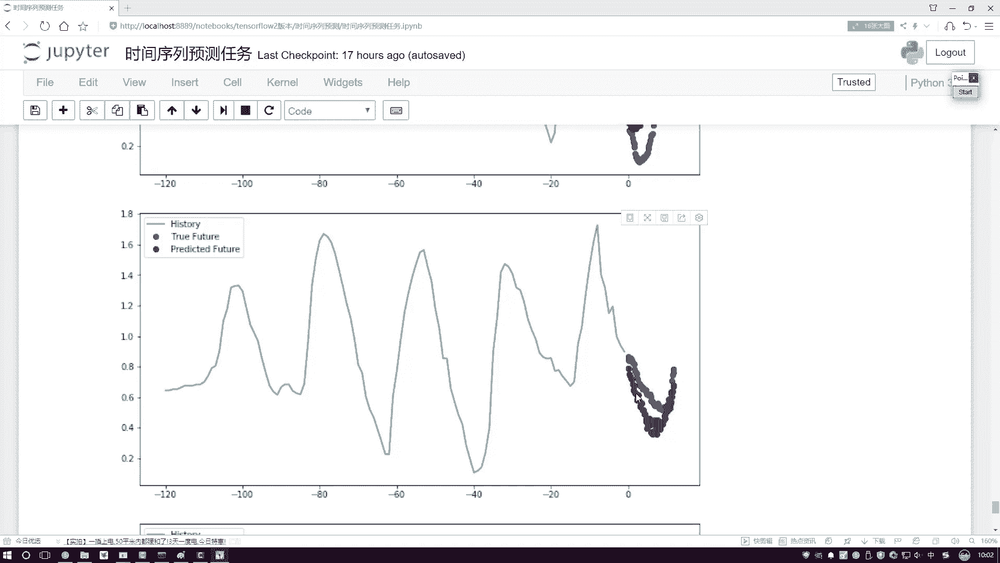

它是不是也是类似的一个趋势啊，这里要给大家看了一下，就是咱们当前啊怎么在这个TENSF当中吧，去做一个时间序列预测任务。

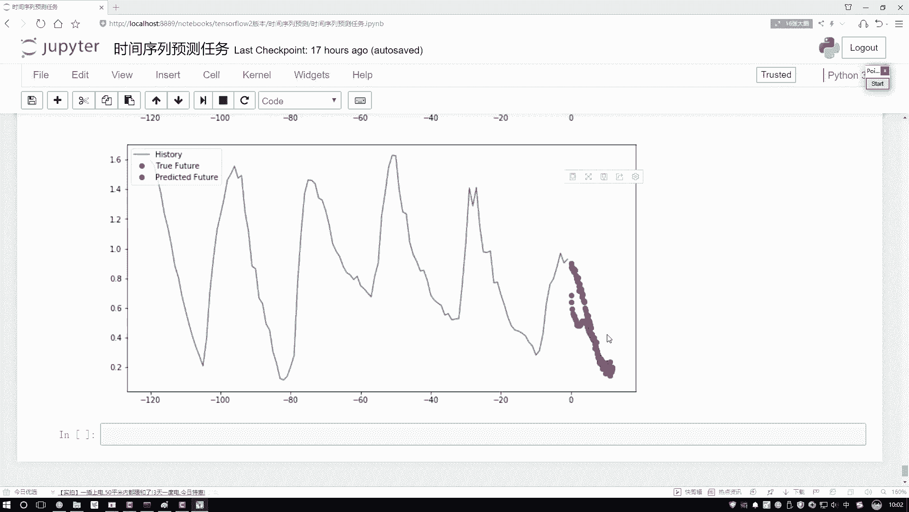

其实说白了咱这个demo还是比较简单的，主要是基于哎咱们的实验窗口。

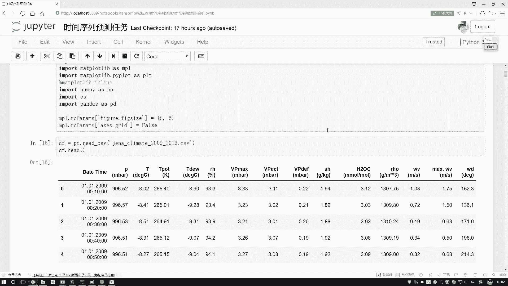

指定实验窗口，指定一个标签，咱们去做预测就行了，关键就是怎么样把咱的数据取到手，做成一个batch，一个by ch的，然后呢输入到咱们的LTL网络当中啊。

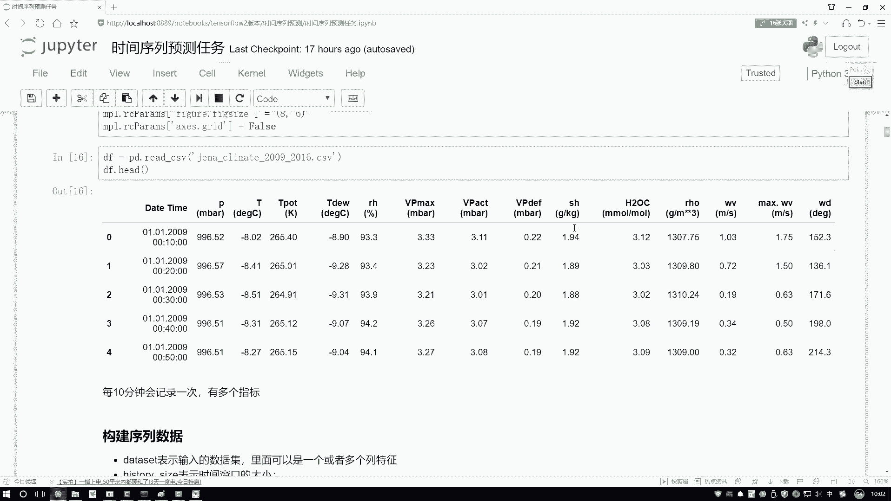

就可以完成咱当前哎一个时间序列了，不光能预测未来的某一个时间点，其中啊还有未来时间片段数也行啊，只需要你把标签稍微改一改，你标签二为一个值，那我要预测一个点呗，标签为72值。

能预测未来72点是不就可以了，大家可能会问一个问题，就是你说你现在在全世界当中，预测出来72点，那这72点它是怎么跟你标签当中，未来72时间就是未来72个时间当中，真实值它是对应起来的呀。

其实啊这个不用大家操心了，神经网络要预测什么结果，完全是由谁来规定的，就是有损失函数来规定的，一开始呢，神经网络它也不知道这72值到底是什么，但是他通过损失函数可以看出来，我这72个值啊。

如果说跟原来的诶，72个时间点一一对应起来，第一个点对应第一个值，第二点对应第二值，如果它们对应起来，会使得损失损失值啊越来越小，它就会朝着这个方向去做的，所以说啊当我们有神经神经网络的时候。

最核心的一点就是你的损失函数该怎么样进行，设计了你的任务的需求，咱们的任务目标完全都是由这些损失函数啊，帮我们来做这样一个约定的行了，这里给大家说了一下咱们时间序列啊。

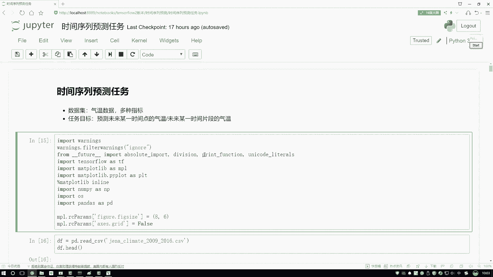