# 跟着大佬11个小时啃透【机器学习与量化交易】项目实战，保姆级教程！！！（Python／可视化／金融／股票／算法／聚类／人工智能） - P53：53-完成策略交易展示结果 - 迪哥AI知识课堂 - BV1xM4m127hV

接下来啊咱们来继续完成我们的REBEON函数啊，第一步我们现在选出来了，当前呃我要去的就是当前我们排名的一个股票，然后呢，接下来啊咱们只是把这股票拿到手了，那接下来我们是不是得看一下哎。

呦现在我这个排名可能做了一些变化吧。

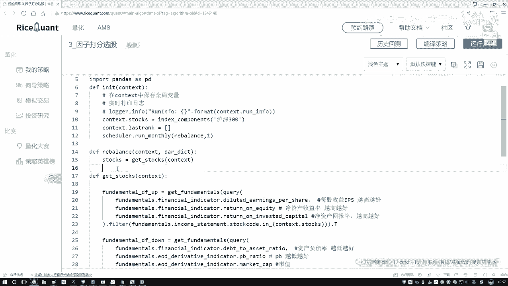

那我们现在要再写个函数，就是呃我们手里有的和现在新的一个排名当中，哎有什么样的一个差异，一会儿呢咱们是不是要基于这个差异，哎实际的咱们要去选一些股票，或者说实际的我们要去购买一些股票了，好了。

咱们来把这个函数完成，这个函数，其实说白了就是呃去看一下，当前你手里有的股票有哪些，然后呢我们做一个差异好，我们先写第一个就是现在咱们手里有的啊，咱先把手里有的股票给拿过来。

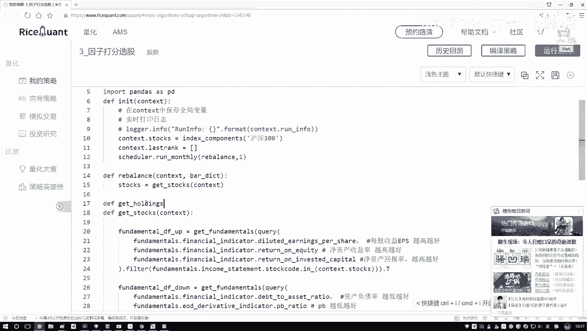

把这个context得给我传进去好了，在这个函数当中啊，咱们想一想做什么。

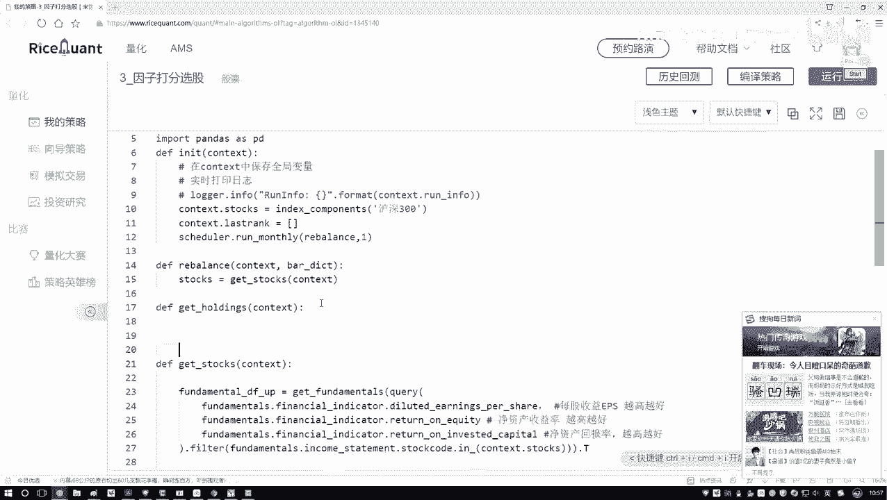

首先第一步哎，我说现在这个股票当中，我是不是说看一下我这个position它是等于多少啊。

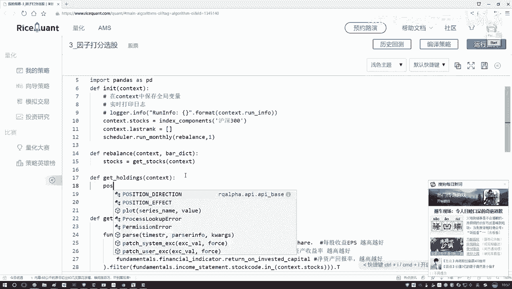

PYSATON好了，拿到我们context当中找吧，context里边咱找一下咱们的用户信息里边哦。

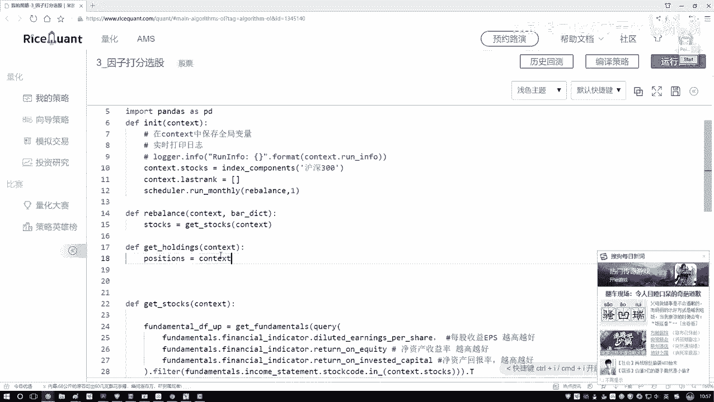

这些个指标在这个指标当中，我们是不是哎把第一个position拿过来啊，跟咱之前方法是一样的好了，然后我说现在我呃写个名字吧，在这个holding当中汇总当中，现现在它是一个JS吧。

现在它是一个list。

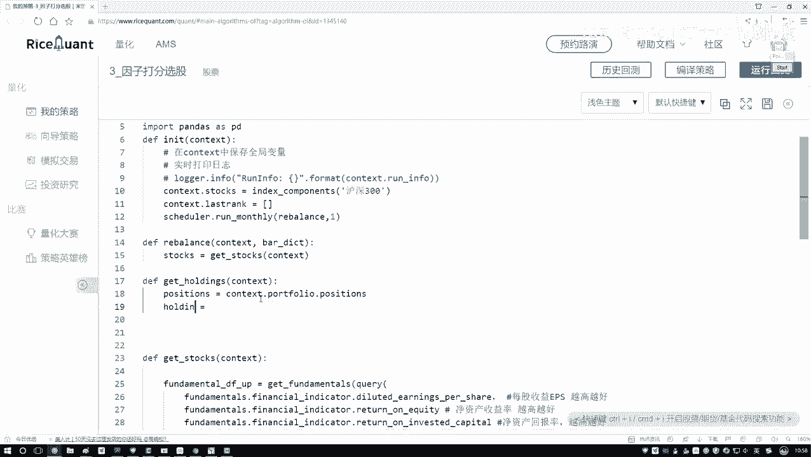

然后呢一会儿我说我把这个list做一个填充，然后做一个判断吧，for咱们的一个position嘶，呃在这一块for我们的position in这些POSONS当中好了，看一看咱们现在这些持有的吧。

如果说哎我持有的数量只要怎么样，它大于零是不是就行啊，好了，把我这个POLIANCE拿过来呃，然后看一下，如果看一下这里，哎，我说先找到吧啊找到把produce传进去看看什么。

看一看咱们拥有的一个质量等于多少吧，QUNTI这个TY然后去判断一下，如果说啊大于零二，那是不是说咱们现持有啊，持有的时候给它加进来就行了哦，这块这块应该是个判断，如果说哎他是大于零的，大于零的情况下。

咱就是持有的持有的，然后在这里我说做一个判断操作，额pad操作，把咱当前的这个股票给他传进来，是不就可以了好了，现在啊把咱们股票拿到手之后，那我说最后我return一下吧。

return就是咱们当前你持有这些东西好就完事了。

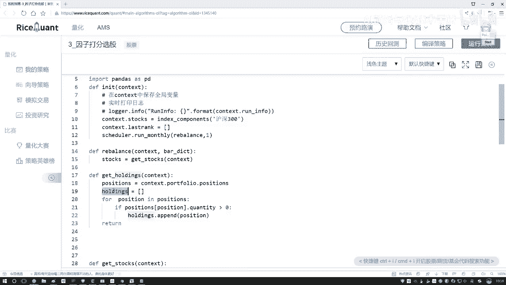

好了，咱们来再写啊，现在我得到了就是新的一轮stars，是排名收尾结果，然后呢，接下来我说现在把我这个holdings先拿到手，它等于去get一下啊，这就完事了，get一下咱当前结果。

然后把这个context再传进去，那现在我是要算什么，哎，我说我得去算一下我要买什么了，那我写一个to by吧，我要接下来去买的，买的就是当前什么哎，你手里有的这些东西。

跟你现在新的域名之间肯定有差异吧，重复的你就不用去管了，你要管的什么差异的吧，所以说啊在这个DOS当中我们要做呃，在这个DOS当中我们去算减掉谁呢，减掉咱现在手里有的，这不就是我现在要去买的吗。

然后不光我要去买，然后我可能还要去卖，去卖，什么意思，现在这个holding当中啊，不在哪了，不在styles当中了，那holding里边不在style当中的。

是不是用这个holding减去一个DOS当中啊，好了，我们把一个买的和卖的都指定完了，那先卖吧，应该是先卖后买吧，好了，然后我一个first stock in在咱们现在要去MAD当中。

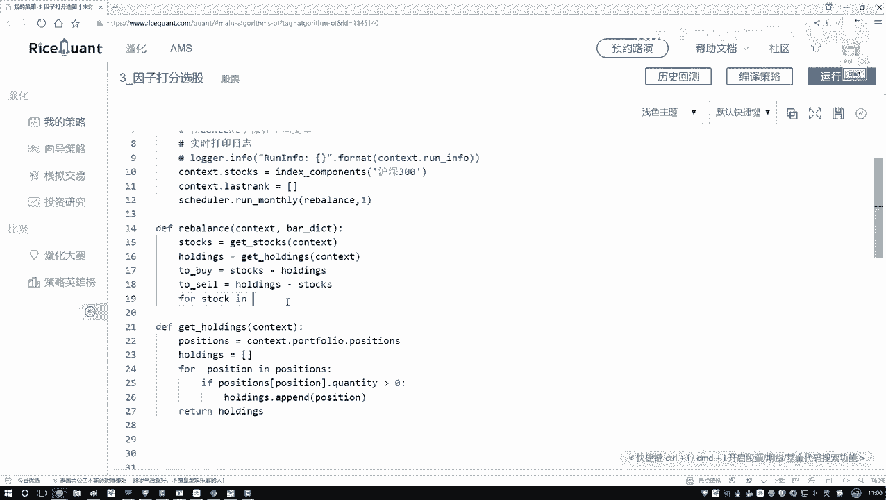

然后咱再去执行这样一个Mac操作就行成了吧，然后一个order order target value哦。

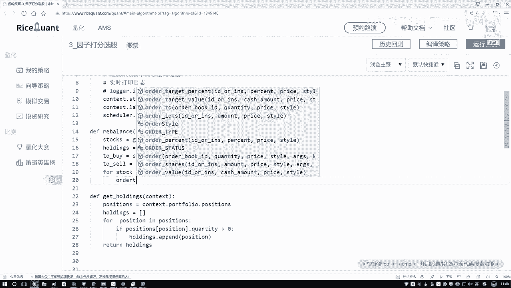

Order target percent，然后全卖掉，那percent就是给它变成0stock，给它复制过来，然后全卖掉，占有的量变成0%就完事了。

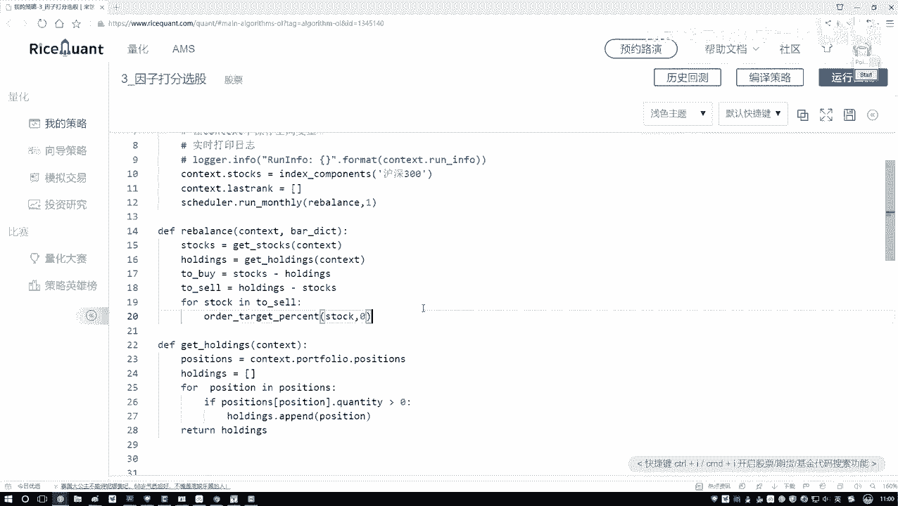

这就是一个mt操作，然后呢接下来咱直接买啊，最后得先判断一下，如果说啊咱们现在没有买的，直接return行，如果这个东西to bad浪值，如果它等于等于零二，一只股票都没有去买。

那return回去相当于咱做完了哎就完事了，然后如果说咱要有买的，要我买的时候啊，咱得看一看呃，我现在手里有多少钱，然后呢咱平均去买是不就行了，哎比如说给大家算一下吧，咱可以咱现在指定个指标。

就是在这个context当中啊，你所有的信息都能调出来，你的一些用户的信息，在这里把咱们信息当中好看一下呃，找一个value值，咱们来我把这个直接复制过来吧，这里边它叫做一个value值哦。

应该是它的一个全称，然后点一下它的全称，然后杠一个value就行了好了，看下咱们现在额有多少的一个资产，然后呢有多少资产之后，然后我们要指定哦，对于我当前这个资产要判断什么，判断一下呃。

当前我买股票的时候，我每一个股，然后咱买多少吧好了，然后咱一共是有这么多股票啊，图片当中一共是有这么股票，让他俩比一下，那就是实际一个股票当中，我们应该去买多少吧，好了这块我指定个参数叫做一个平均的。

咱一会咱就平均去买啊，average找一个value值就行了，接下来呢我们还是执行这个函数，只不过说哦还是把这个复制过来吧，还是要去遍历一下，遍地在我们接下来啊这块不是to sell了。

就是一个too bad，在我们要去买的这些个股票当中哦，这就不是一个percent了，我们之前不是算了，你要买多少吗，那就是一个value rostole当中在指定出来了，然后每一个买多少。

哎咱也指定出来是不是就行了，这样我们就指定了，咱们去买的一个操作吧，那好了，现在就是基本上我们已经把所有操作。

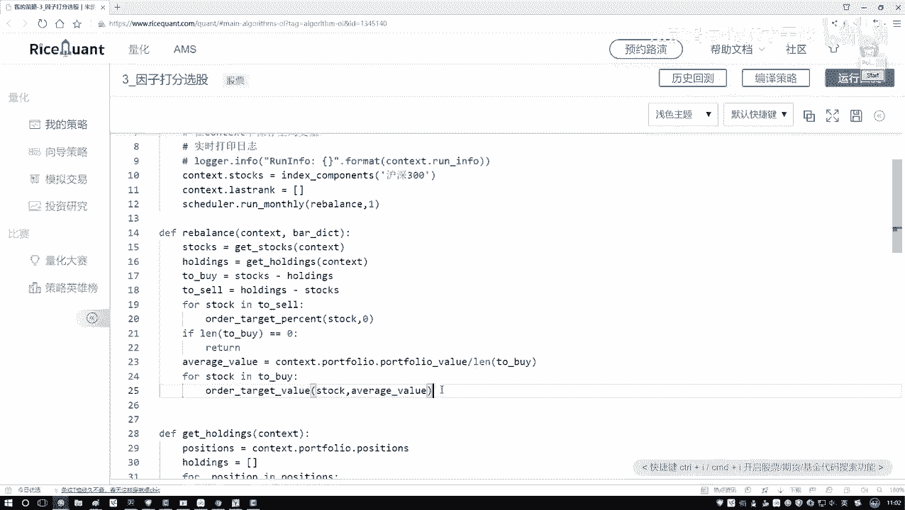

咱都列完了吧，呃回顾一下吧，看一看我们还没有什么light的，一开始在context当中，哎我说我指定股票池子或者下载当中，然后这里呢哎有一个last rank，就是我们上一期咱们的一个排名嗯。

咱们现在暂时还没用上这个结果是吧，一会咱看看会不会用啊，不用给它注释掉吧，然后说每月咱要做一个调仓的操作。

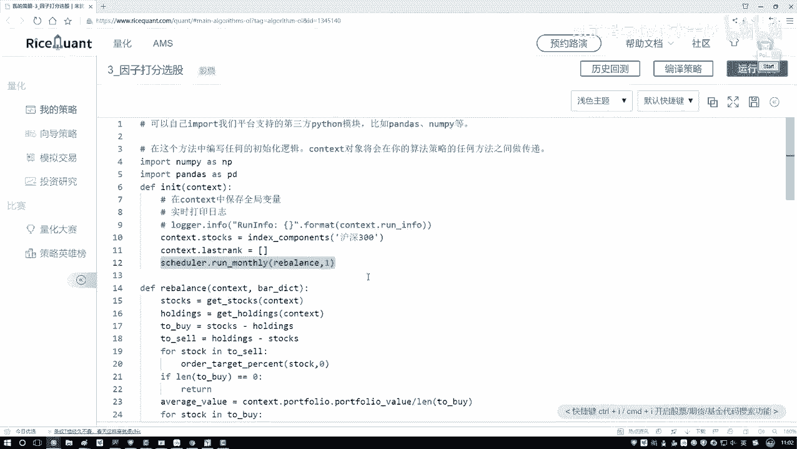

然后每月呢在做这个调仓操作过程当中，我说我先去算算几个值，哎，先算买什么和卖什么，不是就现在我算一个新的排名的值。

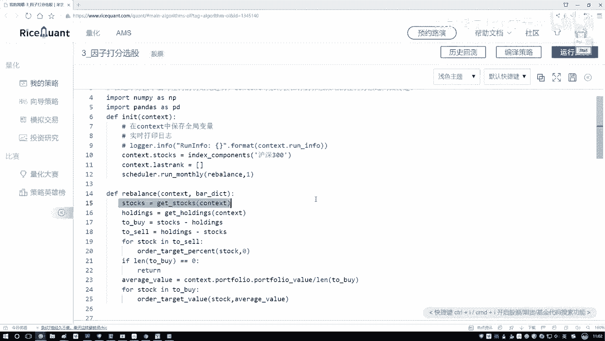

然后呢再算我手里有什么，然后接下来我说基于他们的一个差异，然后去买还是去卖。

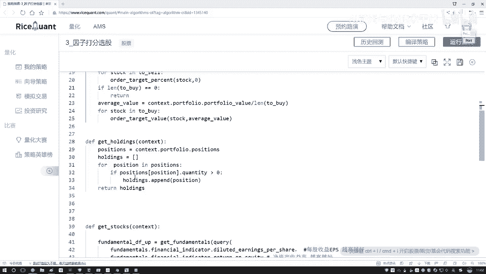

哎这些操作都没什么问题，然后呢主要函数啊，就是我们这个get source当中，咱去查这些指标，然后把这些做一些筛选是吧行了，基本上没什么问题啊。

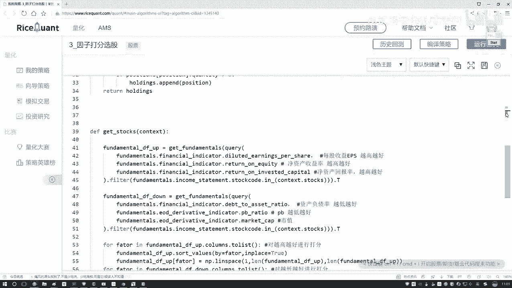

咱写完了，这样咱运行一下，看一看有没有什么问题，我估计可能会报错。

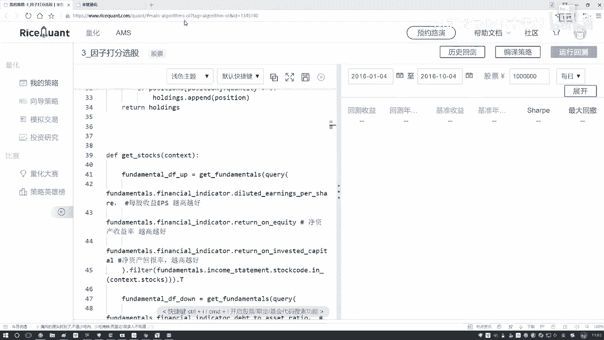

遇到报错没关系啊，咱们来改一改，我现在这pass没用上的，咱就全都给他pass掉。

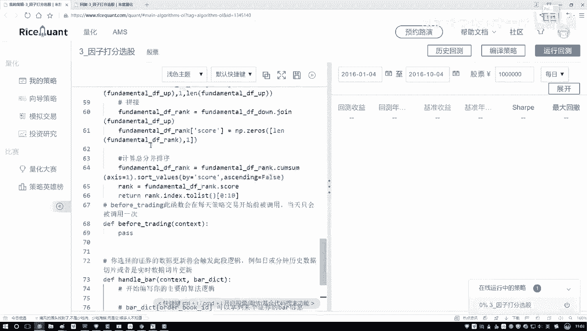

然后看下结果吧，这会可能会报错，来看一看看输入日结果行知道报错了，他说啊现在这块有一个无效的字符呃。

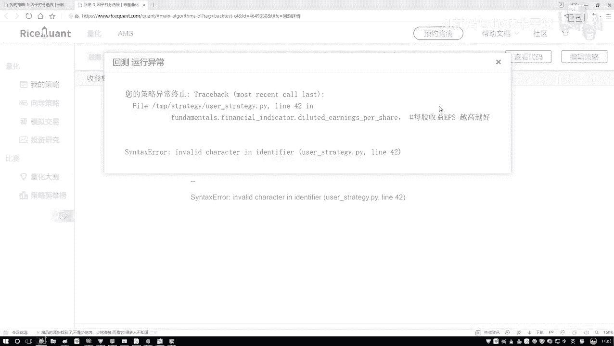

找一找，他说每股收1PS，那看一下，在咱们当前的给他还是放放右边每股收益EPS。

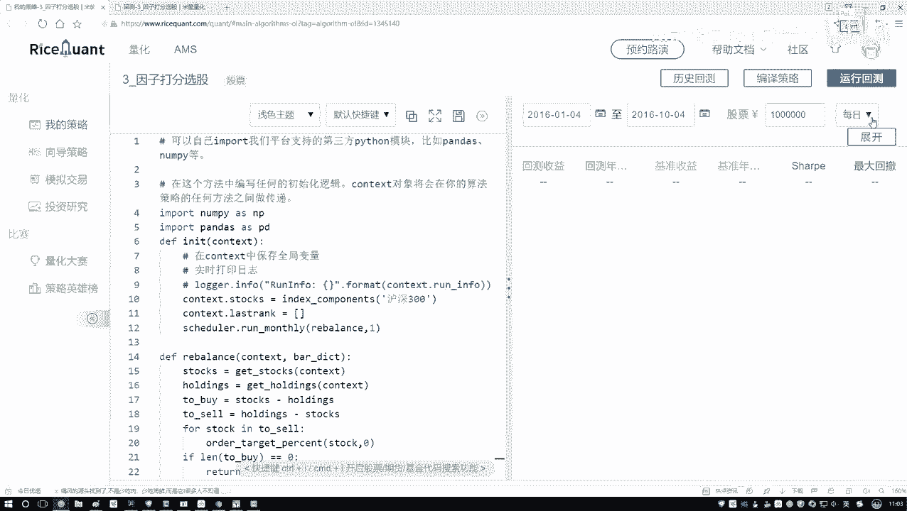

这来找一找，在当前这块，他说有一个特殊字符呃，PHONAMENTALS点，然后去查找哦，这个写错了，这是什么，写成了一个中文逗号是吧，好再执行一下哦，我顺便哎呀算了，这块先给他扣掉吧，我发现几个毛病。

这块它也是一个中文逗号是吧，咱都没注意，然后这一块，然后这里这块又少写了一个逗号，我们再给它加上这一块，它也少写了，逗号也得加上，这里也是一样的，咱有点小毛病，给它稍微改一改好了。

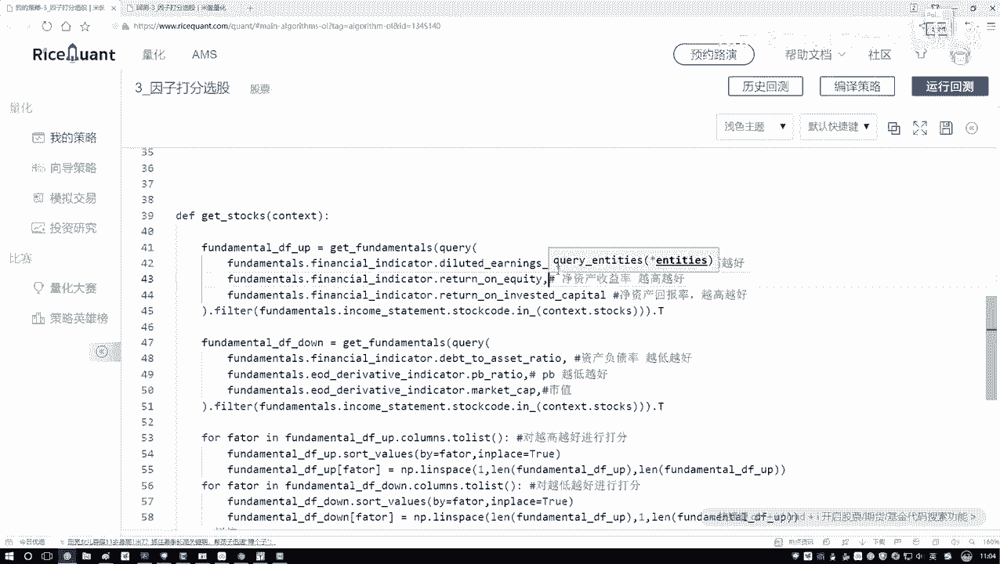

这块都有些逗号，然后再往下看看，这都是在执行吧。

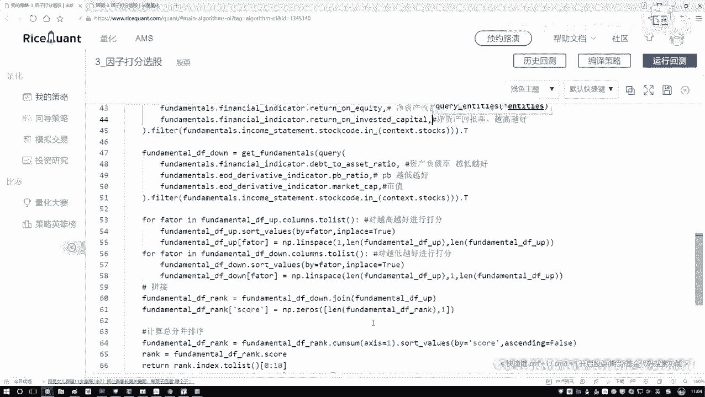

看看有没有什么问题嘶，呃他只想让我顺便先过一下。

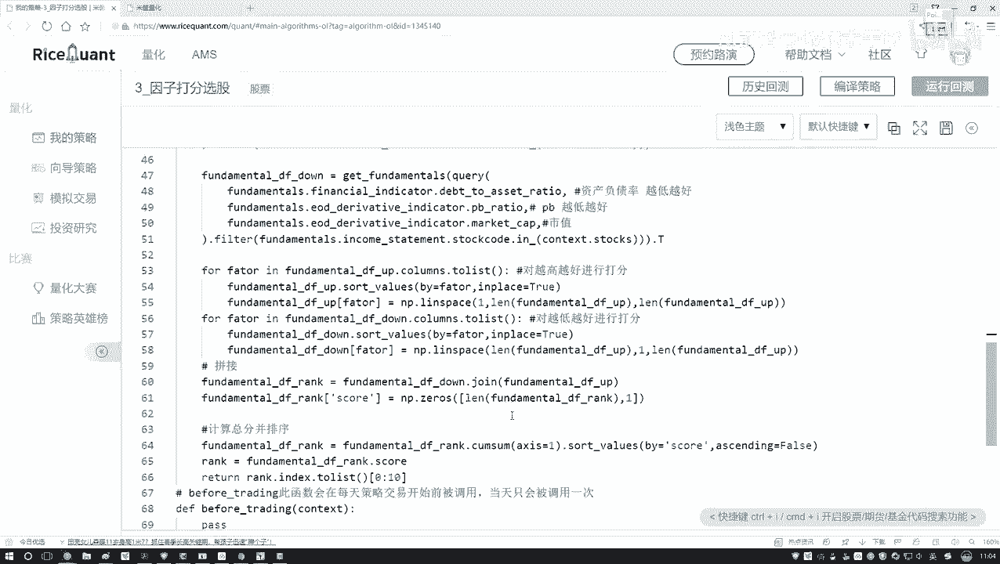

简单找一找有没有什么太大问题，然后这里啊看起来都没什么问题行。

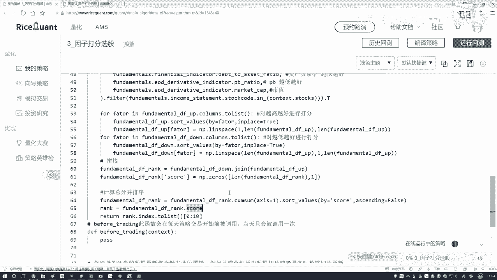

看结果吧，看报不报错吧，看报错咱们来改嘶，呃他说不支持类型，然后list我看在哪啊，在这个to by当中啊。

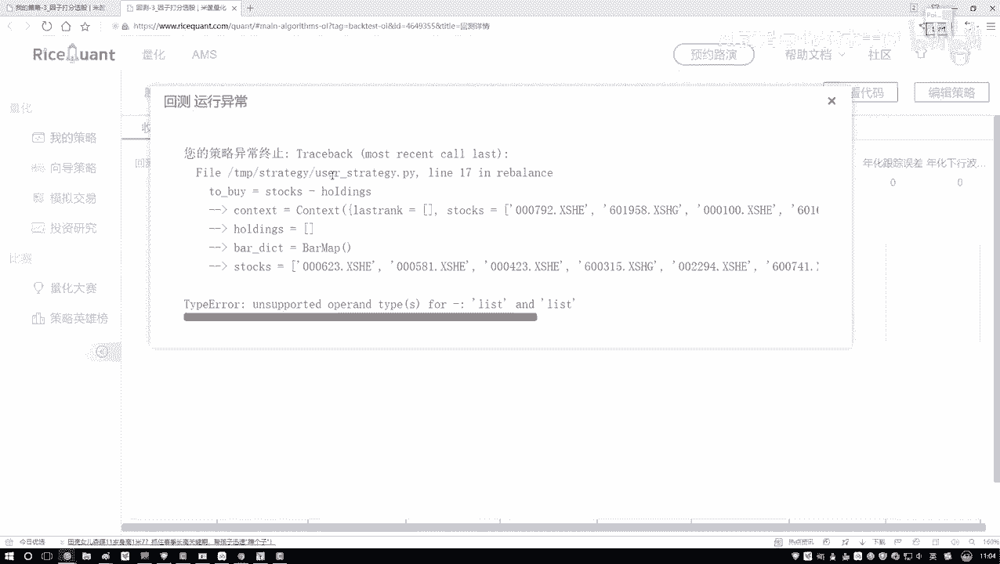

等于这样一个减法来看一下，我们现在啊设计了一个to by。

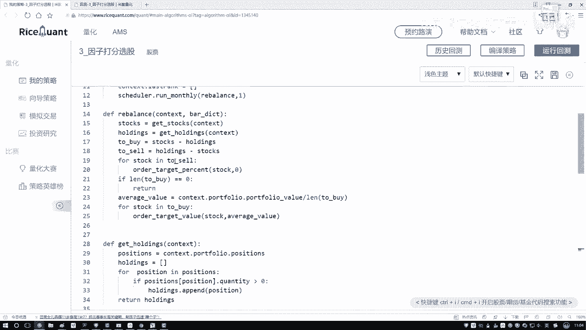

我说现在我要去买什么，等于我的一个STOS减去我当前的一个holding啊，这块不行，那我们得做这样一件事，我得给它做成一个set集合，这样吧，咱把它全部处理成一个set集合。

这一块我说也除以乘三的集合，除以成SD没问题吧，好了这样咱来看一下，应该就能执行我们的一个差异的一个操作了，这个关掉看一看。

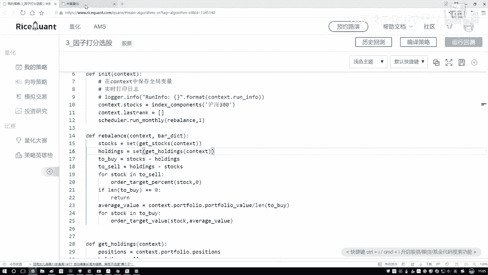

哎呀咱这块还有个东西忘设了，就是咱们的一个时间呃，时间先不管了，就是从2016年1月4号吧，到2016年1月10号，这无所谓了，反正就是这些时间吧。

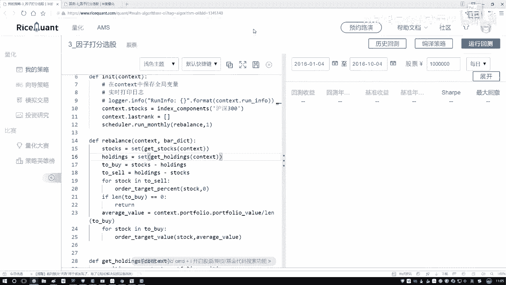

咱不改了，然后一会儿我再改个时间。