# 回撤直接降低50%的小市值策略优化方法【策略实验室】 - P1 - BigQuant量化投资 - BV1iN48eKEP6

大家好。

我是万向宇，那简单先介绍一下今天我们会去讲什么东西啊，其实就五点，第一个呢是去讲不是小市值策略，那其实小市值策略其实是量化金融，AI这种金融投资领域中最基础的一类策略之一，那这个策略是什么。

我待会去讲一下，第二个会就是，其实更重要的是去了解一下，这个策略的收益来源，第三个就是当然了，就是和大家带大家过一下代码，去看一下这种传统的小市值策略怎么去做的，然后呢以及小市值策略的如何去避免过拟合。

最后呢会去介绍一下小市值高级的做法，以及我推荐的一些做法。

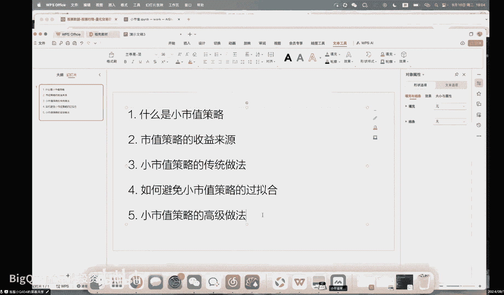

就是小市值策略呢其实在所有的量化平台中，应该说是一个最基础的一个策略，应该说是最基础的一个策略，包括你去看呃，巴菲特的回忆录的话，你也会看到，其实在巴菲特早年的时候。

他也是靠买买这个美国公司的这个垃圾股啊，去赚的第一桶金，这个在巴菲特就是你去看他的回忆录中，都写的很清楚的，所以小市值策略呢，其实你可以理解为，就是买一个垃圾股的一个策略。

那为什么这个策略可以呃有这样的一个收益呢，首先从因子的角度上来说，也就是说从这种啊专业投研的角度上来说呢，市值是一个很强的一个风格，那在量化这个领域中呢，有很经典的一篇论文叫法码分因子啊。

其中的一个因子就是市值，这个因子，就说其实市值啊，是一个A股市场中最强的一个风格，或者说在近10年内，你如果去看这个风格受益的话，他是最强的一个风格，那什么叫风格呢，其实就是这个市场。

他现在的一个表现是怎么样的，那A股目前来说，整体来说在过去的一段时间之内的表现，都是小市值的公司表达这个区间的增长率，或者说增长的这个幅度会比大市值公司要好，那这个其实就是这样的一个市值风格。

那小市值这个策略，或者说市值这个风格其实不仅仅今天，虽然我们讲的是小市值策略，这个策略呢对于普通的爱好者，或者说啊做量化的这种就是小白来说，可能是个非常简单的一个策略，但其实这个风格在很多专业的机构中。

都是经常会去使用的啊，如果你今天打开这种私募排排网，去看很多产品介绍的时候，都可以看到啊啊，他们会对产品的一些市值进行暴露，风风险暴露进行一些控制，其实就是恰恰的证明了。

他们使用了版多的这种市值风格之类的因子，那市值风格的这个因子，其实在今天的投资市场中，也算是一个不能算是一个长期稳定的一个策略，但他更多的算是一个非常强有力的，一个风格因子，那我们其实就来讨论一下。

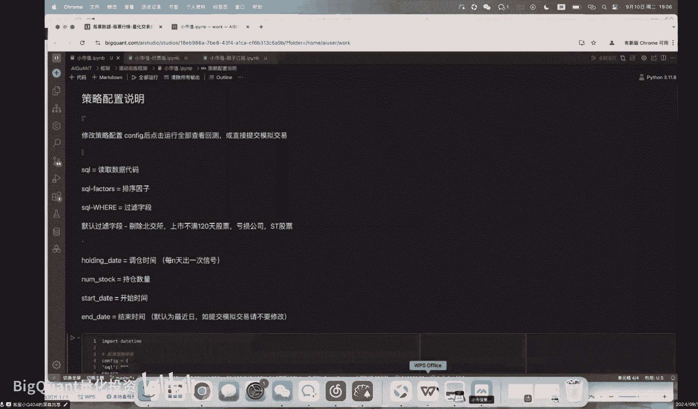

这个市值策略的收益来源，那大多数的市值策略其实不用太讲，就是很多呃，如果你了解的量化，那第二个呢，就是去讲一下这个市值策略的收益来源，其实市值策略的收益来源呢。

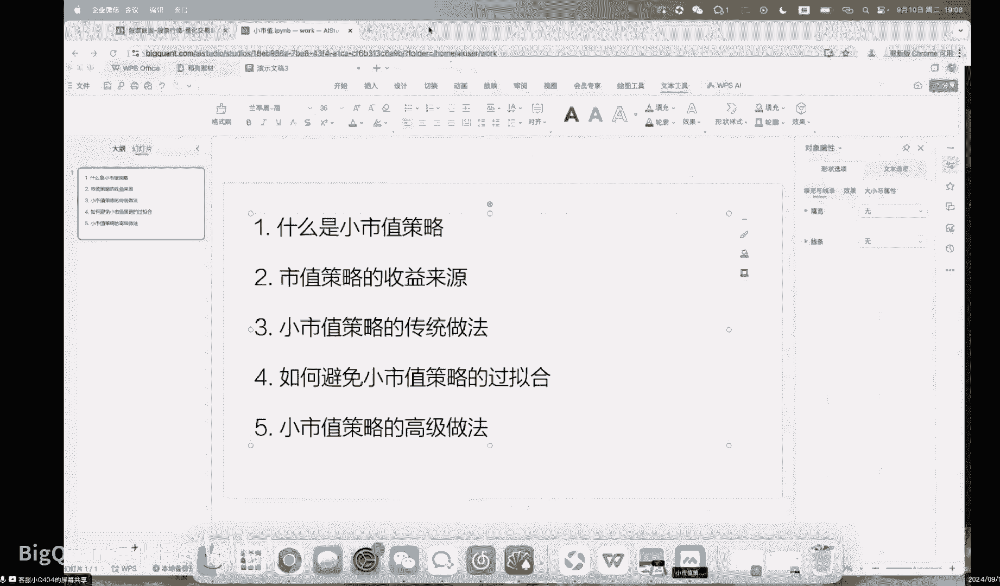

这个也就只能在腾讯会议去讲一讲，就是稍微公开的一些平台，像B站啊，抖音估计都讲不了，那市值风格是什么，首先就是在A股市场中，它其实是一个散户为主导的一个市场，那在A股市场中的大多数我们的收益来源。

并不是，这家公司变得多么多么多多么多么厉害啊，就是很多那种涨停的公司，你去看它的过后可能也就是一地鸡毛，举个最简单的例子吧，啊像过去的一段时间的这个大众交通啊，可能几个吧。

大家买大众交通这家板块或者这个公司的时候，都会觉得啊这个公司牛，这个公司厉害，这个公司可能跟那个自动驾驶，跟那个萝卜叫什么啊，萝卜打车吧，还是叫叫什么，就是那个AI驾驶。

那个自动驾驶在武汉的那家公司有些关系，然后大家就冲进去了啊，然后这个小市值公司呢就连续涨了几个板，改了几个版之后呢，他就会发一个公告，这个公告就是说他这家公司，就是这个是大众电商自己发的。

大家可以去大众交通的那个股票，随便一个打开软件，就可以看到他们自己发的这个公告，他们自己说，他们其实跟这个智能驾驶其实半毛钱关系没有，这些其实只是大众，就是就是这个散户意淫的一个的一个东西。

就他们其实压根就跟自动驾驶半毛钱关系没有，那其实类似的事情在A股，尤其是这种小市值类型的公司中，其实是非常非常非常多的，而不仅仅只有大这个大众交通这一支票之前，那什么吸烟饮食安利股份大多数都是这种情况。

但其实小市值策略是什么呢，其实赚的就是一个公允价值变动的钱，就是你在A股中，你有两种赚，就是你这个在A股就你去做股票，你有两种收益，第一种收益就这个公司真的很牛，这公司真的很厉害，好比说那个天齐锂业啊。

很多年之前，在这个电电动车发展没有很好的时候，这公司在这个公司的实体它就是不赚钱，没有人买他的电池，买来干什么对吧，没有那么多需求啊，都是一些什么旅游景点的电瓶车，买他们的电池，后来中国大力发展电动车。

他们成为了很多这种一线汽车厂商的，这种电池供应商啊，导致什么啊，宁德时代啊，天津经理也乱，这就这种公司就他的收入就暴增，这个是真真正正的这个公司变得厉害了，变得牛了。

这个时候如果你很久之前你看好这个行业，你买了天齐锂业，你买了宁德时代哎，你能赚很多一笔钱，这是第一个，那第二个呢，就是说这个公司压根就不没有任何变化啊，或者说他压根就没有任何的就没有什么希望。

但是一股民如果觉得啊这个公司牛，就会让，因为人，这个其实这个市场就是一个人性的一个状态，你觉得他强啊，所有人都觉得他行，他不行，它也行了啊，因为在量价上就能表现出来，所以说呢就会产生这种公允价值的变动。

所以公允价值的变动，其实跟这个公司实体经营状况，这个是没有任何挂钩的关系，公司披露财报是哪个季度是按季度披露的，但是公允价值变动呢却是按分钟去按天的，那你怎么你那个所谓的一个涨停板。

怎么可能这个公司在一天之内，它真真正正的就变扭10%，那这个其实就往往是公允价值的变动，那在小市值的这些公司中，公允价值的变动呢，其实是往往超过大市值这些公司的呃，非常简单去啊去解释啊。

因为大市值的公司呢，第一日成交额及他的整整体这个流通股太大了，你想去拉动一个1%的点，你随便去算一算，都是很高的一个成本，但是小市值对于这种20亿，30亿，40亿的这种公司，那其实说说难听点。

你可能有个1000万，你都可以在很快的时间内拉动你一个涨停板，因为他一天的成交额只有1000万啊，你1000万基本上就可以稳稳的去拉一个涨停板，只我这个只随便举个例子嗯，那小市值公司最后说到底是什么。

其实就是装票，那今天在A股市场融合了很多的游资，是吧，那就是在我们当然其他很多线下课，也跟很多的这个学员沟通过，然后他们就说啊，怎么与庄共舞，其实在A股市场中，你是永远不知道庄的动向的。

就他们的运作方式更多的就是买未支票，然后等待一些啊可能比较好的一些机会，一般他们都会去买一些有炒作题材的票，就小市值的公司很多，不仅仅只有像你这种大众交通啊，西安影视，安妮股份啊，雪人这些票。

其实还有一些那种就没什么炒作空间的票，就没什么题材，所以他们一般的这种游资的做法呢，其实就是很简单去买，就是无论通过正盘这种方式去吸收一些方式，去在一支票里面有他的持仓。

然后这支票一旦会跟近期的一个热点，有任何关系啊，就他们就会去进行一波炒作，好比如说拆GPT出来了，那个中工高科就涨停了，这其实是很离谱的一个事情，就中工高科其实就是一个单纯的一个做这个啊。

啊高速公路维修的一家公司啊，他跟那个人工智能没什么关系，但很多人就说啊，他以后要用什么人工智能维修这个中工高科，那老板自己都不知道自己还能干这个事，然后股民就开始疑，其实这个就叫做点火。

这就是很多游资的一些操作手段，那小市值策略是什么，就今天，你要么你就如果你想去赚这种大波动的钱，在这种小实力的公司，去赚这种公允价值变动的钱，你有两个选择，第一要么你去当装，二，要么你去组织当庄，三。

要么你就去埋伏，去坐他们的车，就你只有这三种方式可以赚钱，那第一种方式呢，这个对吧啊，徐翔已经被抓了好吧，第二种方式呢，其实就是今天很多抖音的一些直播间干，他们美其名曰啊就是说叫什叫什么，找基金合理的。

实际上就是大家一起炒一只小票，拉起来，让别人开箱子，大概干这种事，那小市值策略的就是第三种收益方式，就是我不管我就我也不干你这违违法的事情，但是我大概知道你会在什么样的票中，去干这样的事情。

OK我买我就直接买一堆这种票上，等你什么时候拉，唉我大概涨起来我就卖了，这个其实就是最简单的小时的策，那小值的策略呢，最开始呢其实并没有很高的收益，在18年之后就是这个白马风格。

尤其是这种绩优股的这种风格，走疲软了之后，因为他们没有法炒，那个时候其实就是葛兰跟张坤最火的一个时候，那个时候火了之后呢，其实那种风格就完全没有办法以策略的形式，这个市场能获取更多的超额收益。

那这个风格的收益已经到顶点了，这公司的估值已经就是太高了，那当时那些白马股，大家可以看一看18年那时候的什么啊，就那些啊各种毛骨啊，什么隆基啊，啊宁德啊，这些基本上都是处于他们的巅峰时期。

还有那个药明康德对吧，这些都是属于那种毛股的，他们一个巅峰时期，所以这个风格是没有办法继续去持续的时候，这个时候就是就开始进行小这个小盘股的，一个一个的一个风格了啊，也是从那个时候开始，大多数的这些啊。

那个时候不，大家说那些基金经理是是是去抱团买什么，茅台这些股票，那从这个风格之后呢，其实变成了很多的私募，去抱团去买小盘股啊的一个风格，所以小盘股呢其实是一个嗯，本身具备一定的这个收益逻辑。

然后呢很多人呢不知道买什么，很多私募不知道干什么时候，他们去买这类型的风格，那越买，因为他的风格这个容量本身就是在这里啊，导它它的这个流通时就在这里，所以你越买它越涨，越买越它越涨。

你的这个随着你的整体的这个量化，资管规模的增长啊，这个小时的策略风格也明显走强，就是如果有人愿意去统计的话，也可以去看一下，就整体的这个量化，整体的中国整体量化的规模，它的这个跟这个小市值的这个呃因子。

这个收益率其实是成正比的，OK那我们就来说一下这个啊小时这个策略好吧，讲到这里，大家有什么样的问题吗。

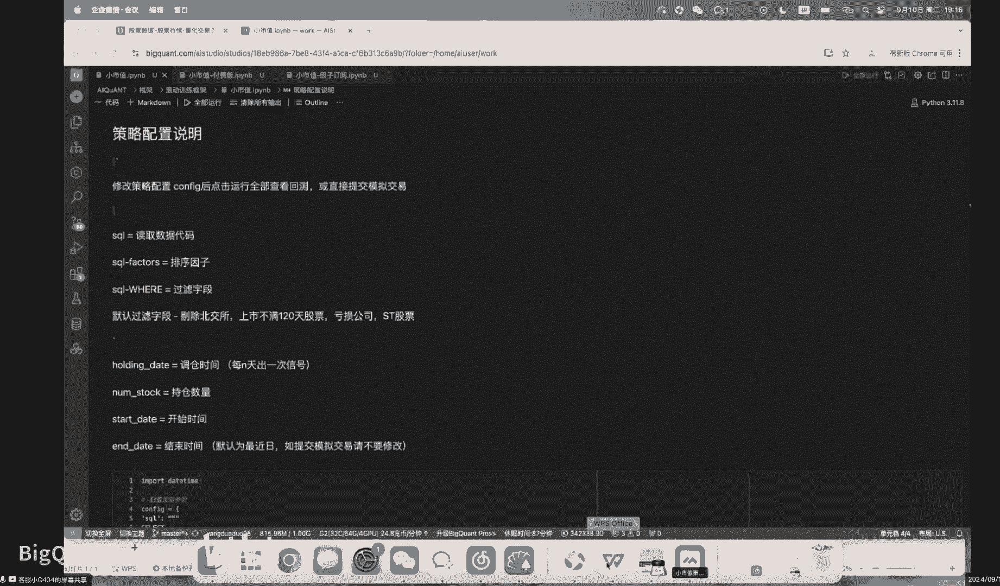

哦没问题，我继续啊，今天我们课程会快一些哦，又有一个问题，美股里面没有涨停机制，但是小市值同样有效，是一样的底层逻辑吗，其实是的，就美股其实相较于中国的A股会更乱一些啊，为什么呢。

因为第一它是一个多空市场，第二呢它的这个呃上市之，这个这个机制会比中国A股啊要宽松很多，这个想必我不用介绍，大家都知道，那美股的小市值呢其实跟A股呢也不太一样，就是美股的它可能确实涉及到一些。

就你需要很了解美股的上市这些公司，但是整体的逻辑其实差不多的啊，就今天在美股也有很多人啊，说难听点就是搞这种操纵市场的事情，但其实操纵市场，第一本身确实是很难具备识别的啊。

第二如果是以找像这种现在就很多直播间啊，这这这前前前段时间先是去找什么，他们交通，最后搞得啊急忘了看直播的人一起去买，那这种东西其实你是没有办法去去说他操作操，他操操纵市场的好啊。

那小时时策略其实就是这样的一个策略啊，那最后说一下小14的传统做法。

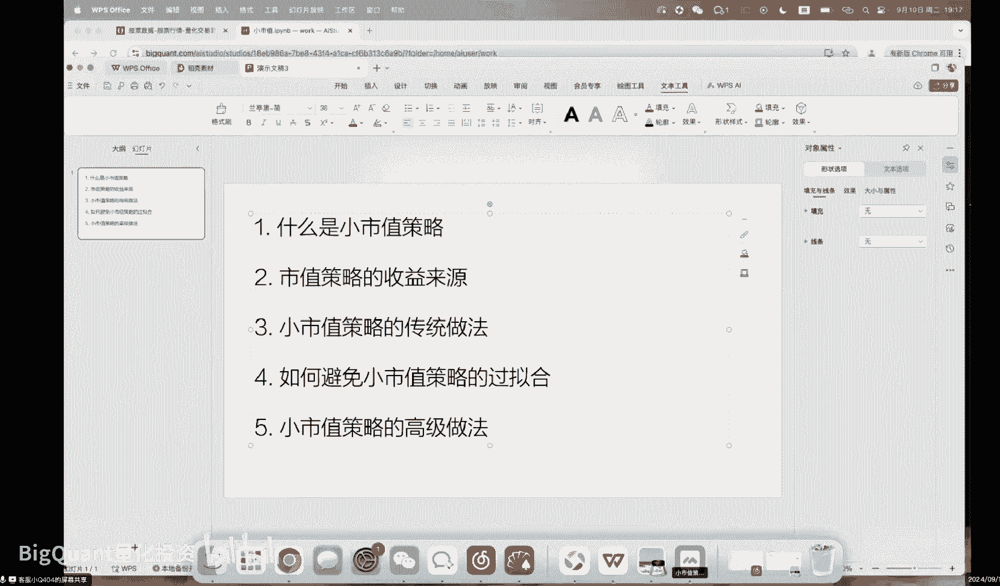

那最后呢我们呢会给大家这两几个策略，第一个策略就是小市值策略，那小小值值策略呢，其实就是就是我这边给的第一个策略，其实是去读这个市值的这个风格，这个字段，这个因子乘一个一对吧。

小值值策略嘛就要么是降序排序，要么就传一个一，这个都比较好理解哦，对对我稍微说一下，因为我们现在这边用的代码都是C口啊，就是SQL去读数据，然后Python这边去用纯码代码的方式去呈现。

所以全部的你的调整，都只需要在这个configuration里面，去进行一个调整就可以了，无论是啊你的持仓的时间还是持仓的票，都是可以在这个configuration里面去调整的。

所以这个是可以直接提交模拟的一个代码，但是你你你你如果想去调的话，你就简单去调一下就可以了，那这个from是从哪个表去读，这个select是啊，SQL中去选择什么样的字段。

这个where下面都是些顾虑的条件，像这个this sector就是这个呃这个上市这个板块，或者these days就是上市的时间啊，这些就大家可以自己去看一下，那最后说一下小时值策略啊，最简单。

小时值策略，其实就是按照市值的进行一个降序排序啊，然后去啊，不是啊，对是按照市值的一个升序排序，去选择前N只股票，然后等仓买入，但这样的方式去构建了一个策略，大概的收益的结果就是这样，其实是年化时期啊。

累计135，然后如果你在这个策略中，如果你去选择很多支票，其实就相当于快让你的策略容量的话，你其实扩到10亿20亿，它其实也是这样一个差不多的年化收益率，但是他的最大的回撤和它的这个波动会比较大。

那这个东西呢大家可以也可以去跟很多，目前私募排排网的中证多少多少啊，中证500，中证1000的指增产品去进行一些对比，因为其实今天的所谓的中增指增啊，都是这种空气指增，他们并不是说在指数内宣布。

他们可能只是有一个指数权重的一个限制，那哪怕在这样的前程线下，你都可以去拿这个，就这个曲线去跟私动排排网站上面的，很多的曲线去进行对比，那今天其实对看来是呃差不太多的。

在我们之前的直播中会进行这样的对比，那今天就就不对比了吧，好吧，大家就如果有时间去登录一下私募排排网啊，都是可以看得到的，所以今天在私募排版上看到，好比说像这种比较头部的一些私募，像这个九坤啊，幻方啊。

明红啊啊这些的，他们都在今年的这个年初吧，有这样的一个很大的一个回撤，这个其实就是市值风格的一个，极大的一个回车啊，今天他们你在这，就包括巨宽这些的私募的产品中，都是可以看得到的啊。

这个这个这个想必大家应该都知道，那之后呢市值风格呢它进行了一段的修复，那到现在来说呢，目前的市值风格其实还是比较最，起码，因为今天的今，就现在的A股的状态确实非常差的，所以说目前的市值风格呢。

还是一个比较好的一个风格，就相较来说你要在矮子中拔一个将军的话，其实我觉得事事风格还是不错的，那这个传统的市值风格去做的一个策略，就是这样，这个之后会给到大家。

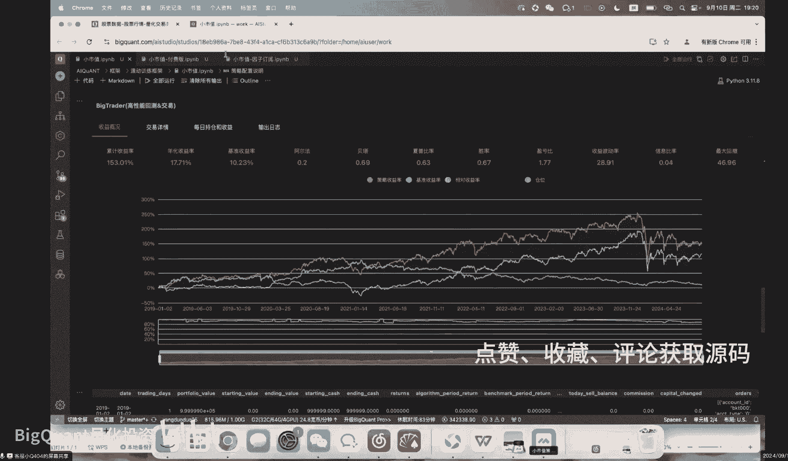

那后面我们呢我们就会去讲一讲，第二个就是如何避免市值风格的策略过拟合。

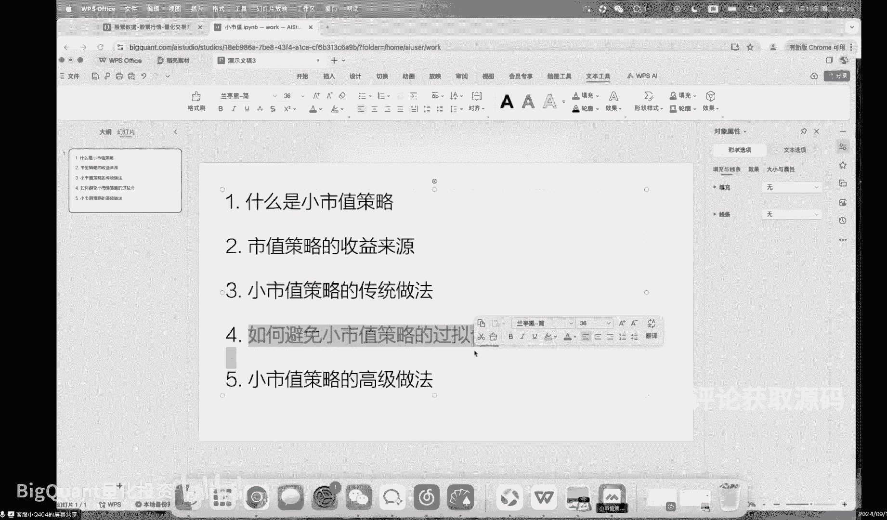

以及市值策略的高级做法，那第一个先说一下市值风格，过拟合，就在我看到目前市面上有很多的这种量化策略，是去做这种实时风格的，但是事实风格的，大多数的量化策略都会有一个问题，就是过拟合，什么叫过拟合。

简单点说，就直接简单的说就是加了一堆过滤条件啊，什么我我我我我加了一个什么择食啊，什么时候不开仓啊，或者说我这个票买入之前，必须要什么连涨几天啊，卖或者连跌了几天呀，或者说他怎么样怎么样。

这种过度的过滤，其实在统计学中就是一个样本空间的筛选，但是呢我们今天去做的这个量化这个回测，大家一定要记住，这个回测其实只是在历史中的一个回测，那在我们去做的这个事儿。

或者说我们去做这个数据分析的事情呢，实际上是叫做金融时间序列分析，那金融时间序列分析呢，如果你想说，我今天给你去在回测中做一个很好的一个策略，看这曲线，这个太容易了，为什么。

因为全部的历史数据都是在我们今天获得的，也说其实金融时间序列分析的这个任务，最重要的一点就是你要去考虑时间的事情，我们站在今天去回看历史，但相较于历史的每一天，我们都是未来人。

也就是说我今天跑出一个回测，这什么年化时期，然后我突然去加了一堆莫名其妙的一些，这个这个这个这个这个过滤，那这些过滤可能从这个年化时期变到了，年化30，我是随便拍脑门一说，那这多出来的这13点的收益。

是你来自未来的事，所以说就好比说我们这个层啊，我这是随便给大家跑一个这个回测，这个策略，实际上你在实盘中你是跑不出来的，为什么它的开始时间是2019年，你他的年化收益呢是17，他的巅峰。

他的巅峰净值是多少呢，我们看一下，大概是244，就是两倍半，大概是用了两年的时间，3年的时间翻了两倍半，哼这两倍半的收益你是完全挣不到的，为什么，就我说如果是加了很多的过滤啊。

因为你需要想挣到这段时间的收益，你需要在2019年的1月1号，开始跑这个策略，那这个策略你有可能在二零这个19年开始跑，我可以明确跟大家说，大家不可能，为什么呢。

因为小实施策略在19年之前表现是很差的啊，尤其是在一七，他18年还好，在1718年，尤其是17年是很烂的，因为那个时候大多数的时候，这些资金啊都去抱团这些白马股，就抱去抱团这些绩优股。

没有什么资金愿意去炒作小市值，那个时候呢市场直接装上去，对于炒作小市值策略呢也没有什么兴趣，因为他们买了一支票，散户都去跟那什么张坤葛兰去买什么医药了，去买白酒了，没有人给他们抬轿，他们拉了之后。

这个票的公允价值的变动都是自己拉出来的，他们希望的是自己拉点，自己拉横就很多，自己拉五个点，别人谈十个点，让他他卖了，然后这个可能有些磨损，他去挣钱，他愿意干这个事，他自己拉十个点，他自己再去砸。

再再去卖，他去砸十个点，他是不赚钱还会亏钱，所以呢就没有什么人愿意去干这些事情，所以这种策略呢你都要去想一想，这个策略是从19年开始的，你什么时候不能跑对吧，你要你就要看这东西。

你要看到什么时候你才敢跑，你怎么着也要看到这个这个这个22年吧对吧，或者21年这段时间还有一段小回撤对吧，你要在什么时候去介入，你是不可能从头去介入，所以这个其实就是策略的过底。

那今天呢在很多什么其他的这些量化网站上，包括这种问财啊啊巨宽啊，果仁啊啊好像不这么说啊，应该说某财某坤和某啊行吧，就这样，你去这些平台上，经常会看到很多的这种生小时策略，年化三四十。

我只想跟大家说的这些其实都是过年合的唱，就是你要相信，这个世界上任何东西都遵循一个常理，但凡一个策略，一个量化策略，用标准的数据投影的方式，他去做出来的这个策略的收益，其实是一个边界的。

那么超出这个边界的时候，他就说20个点，30个点的时候就要去考虑，为什么有没有可能出问题，他他他他他他怎么可能是这样，或者我们换一种思维方式，你如果做出一个稳定年化30的策略，你会不会把他放出来。

那那我觉得答案应该是不会的，或者说你有一个稳定年化30%的策略，你还需要放出来吗，你肯定不需要，今天这个银行贷款，你你你如果把房子抵押了，找个什么借口，做个什么假收入证明，你把房子贷出钱来，就3。

5个点，投银行就很轻松的抵押贷款就可以了，你拿这个贷出点钱，配个杠杆去买这个年化稳定三四十的策略，它不香吗，对吧，他还需要拿出来跟别人分享，他不需，所以，那，那那，那，那那到底为什么。

这个东西会在市面上给你看到呢，其中因为这东西是假的，那今天呢其实小诗词就市值风格，你如果单纯拿这个因子去做一个筛选排序，去买这个策略是没问题的，这个不是过拟合的好吧，就年化17个点，它的确不是过拟合的。

为什么，因为第一他有足够长的时间，他有足够长的时间去证明，第二他的回撤很大，就他的伴随的风险很多，就如果这个策略，你看你27还不错诶，他最大回撤有46，你如果带一倍杠杆，你可能中间爆爆仓就没了。

就如果你在这个就是2024年介入啊，带个一倍杠杆就直接被啊清盘，所以说他也是有一些风险，那但是这个就是一个真实的世界，你去做市值风格这些策略的一个风险，这也是跟大家说清楚的，那你去买这类策略。

你看好的是什么，就是我们都说其实做量化的话有两种策略，第一种就是那种无脑跑的，第二种就是这种需要主观判断的，那这类策略，单一市场风格的策略什么时候可以跑，你一定要是知道它的收益来源。

第二知道他什么时候可以跑，那大多数的小数策略的，我建议大家就是在市场没有主线的时候，可以去跑，就市场如果有明确主线，或者明确去压制小市值的时候，或者去压制这种啊炒作行为的时候。

或者这种过度的这种大波动的时候，就小值策往往表现不好，这个在历史数据中大家都可以看得出来，这就不用我去说了，好吧，在1718的策略，大家跑出来也可以看到，其实在17年的回撤也是蛮大的，大概是30几个点。

这个其实也是因为一线的时候，大多数的这个资金啊跑去做一些大势的，就是中大势这种干马股的一个炒作，那这个就是简单的一小时的策略，我就不用太多的去细讲了啊，那今天你去100个这种量化平台。

或者去看这种策略的，基本上99个可能都都冤枉，你应该看100个，就是100个策略都是这么做的啊，这个也不是我们今天的课程的重点，就他给到的一个是单一应用试纸。

这个我当然这边我用的还是偷偷market cap，实际上用这个flow market cap，可能也也就会更好一些，但但但这个不重要啊，就是你去做市值的一个因子，这个是最low的方式啊。

就是用这个这个字段，那第二个呢我们直播间要给到这个代码，这个代码大家就是看一下就可以了，不建议大家去跑跑，因为这个这个东西大概需要一个，大概需要一个，我也不知道大概也需要一个16G吧。

至少得16G的一个的一个线上的一个内存，就是线线上一个线程数，因为它确实是一个需要多线程去跑的，一个分钟数据啊，这个这个这个这个这个这个，这这一堆代码是什么，它其实就是一个C口的一个因子。

去做了一个市值音，但是大家可以看到，我并没有用很多的市值的这些字段，那今天呢在这种量价投研的研究之中，去构建一个市值风格的因子，并不需要市值这个字段，仅靠高开低收，其实就可以构建出市值的这个因子。

那举个例子啊，为什么啊，因为只要涉及到市场均值的计算，其实都会演变为一个市值风格，因为这个市场大多数的股票的公司都是这种啊，100亿可能就是你就你如果算A股市场中，他的这个视。

它其实是一个极度的一个有偏的一个啊，一个肥美的一个状态的一个分布，那也就是大多数的公司其实还是小公司啊，少数公司是那个大公司的，大概就是这样，所以说呢你只要涉及到市场均值。

市场均值代表它本身就是小市值公司，你去算一个市场均值的一个距离的时候，本身它就会带有一个市值风格，所以任何的一个量价因子都可以通过改造，在高频数据下的改造，去变成一个这个这个带有实质风格的因子。

那高频数据，高频音子这类的相关的东西，大家如果感兴趣的话，可以关注我们后续的一些嗯的一些内容啊，包括没有这种课程，但是这边就不在这边讲了，今天只讲一下这个高频怎么去做这个高频子。

首先会去用到这种分钟的数据啊，去计算当下的每一个分钟的每个bar，它的一个这个这个这个成交量的一个差，成交量一个差，现在在成交量做一个差分，这样的差分呢实际上就可以呃，包括去计算这个差分的均值和标准差。

去用均值加标准差的就可以去做出一个这个额，用这个概念就可以去找到当下这个这支票日内，分钟最多成交量最多的几个bar，那这个bar之后，用这个伴儿之后的几分钟的收益率的，均值和标准差就可以获得两个因子。

那这两个因子呢再去做一些，在时间序列上面的一些平滑啊，进行一些标准差化的一些合成，然后再跟这个市场均值去做一些这个计算啊，就可以得到了这个一个高频的一个啊市值因子，它其实是一个高频时值因子。

那这个高频时值因子，大家是可以通过直接订阅啊，啊这个这个表啊去完整的，就是说如果你拿到这个策略，你直接去跑，它就会提示你去定那个表，你去定就可以了，这就是一个高频的，就是如果你有很大的算力。

你买了个第四的资源，你是可以直接跑这个东西的，但是我不建议大家去跑，确实很慢，很耗费资源啊，大家也可以直接去订阅这个音频，去咳获得这个因子的权限，就可以直接去跑这个策略，那最后高频的这个因子的权限呢。

首先他的回撤，他的收益都会受到一些影响啊，累计收益没有裸奔的市值要高，年化收益也没有裸奔市值高，但是它恰恰是一个更好的一个策略。

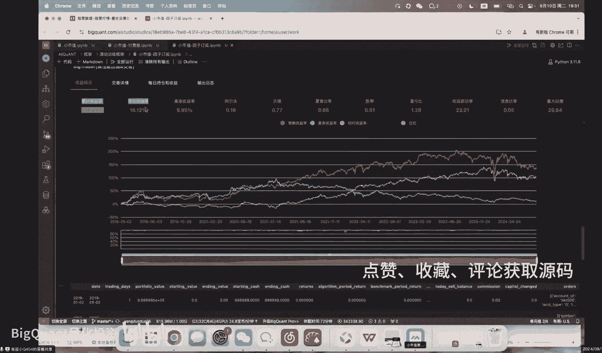

为什么，因为他回撤只有29，而这边的回车呢。

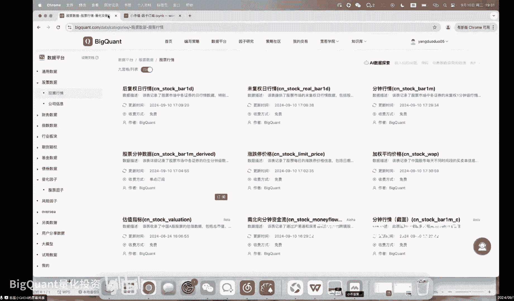

哎而这个是什么，这个传统这个市值这个策略回撤46，29和46是一个天壤之别对吧，就29这种类型的策略，其实在这个之前其实是可以稳稳做杠杆，那46做杠杆你基本就爆了。

而且你很多的策略你不太可能是买在最初始，你可能是半路进去，那这种这种回撤较小，收益波动率较小，这个收益波动率23，这个这个传统的这个是28，就这种波动态板策略呢，你在实际上持仓的过程中。

也会也会就是持仓体验会比较好，那这三个策略呢之后都会给大家。

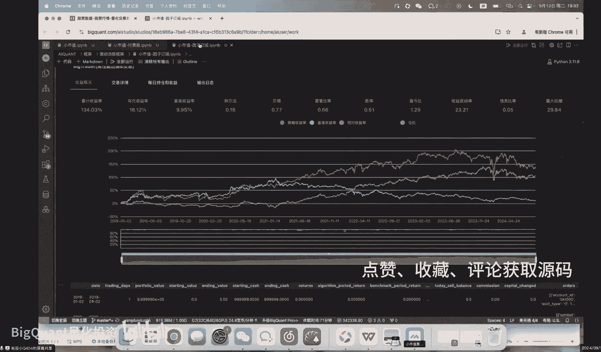

那这个其实就是今天我们的课程内容，就去讲一讲什么是策略，小时策略以及实测的数据来源，然后传统做法如何去避免过拟合。

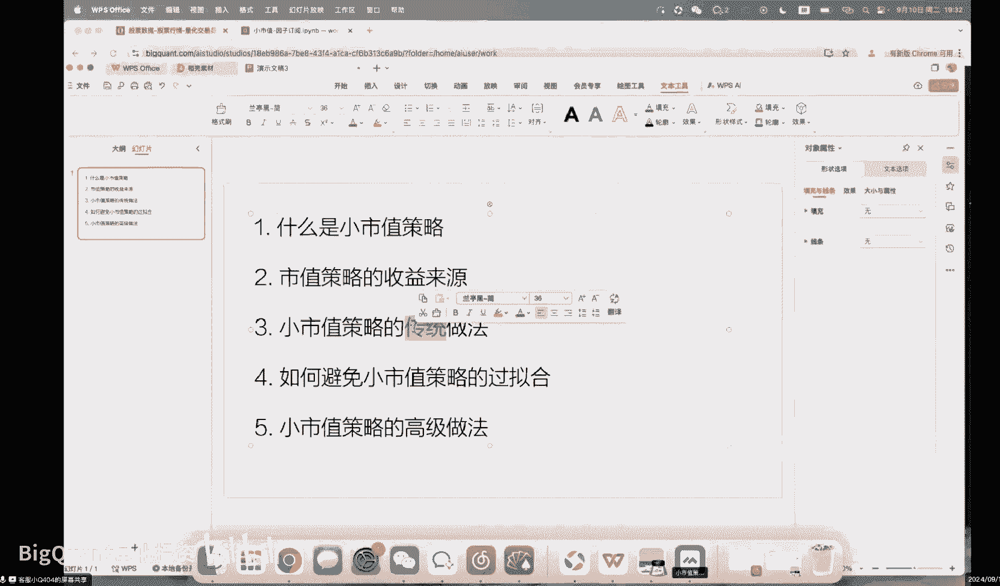

还有就是在一些高级做法，那最后可能多说一下这个避免过拟合，就我知道今天所谓的很多这种筛选策略很多啊，包括你去什么问财上，现在也可以这么这AI随便问几个字，来做个策略，但这些东西。

其实你如果要是在历史数据上去做任何的，这种筛选策略，他都有个问题，就他会过拟合，当然我明天会去探讨如何用机器学习，滚动的去避免这种过拟合，那在这之前呢，只想跟大家说一下，就是你去做任何一个策略。

你一定要思考一点，就是时间，就是这个策略，好比如年化啊，30区间收益100没问题没问题，你看一下它的开始时间是2018年，举个例子是2018年1月一月号啊，你要问自己一个问题。

你有没有可能在2018年的时候，知道这个策略并且跑的，如果2018年之前，这个策略稳的因子都是一坨屎，或者说这个策略在2018年比较就很烂，是没可能，你从2018年开始跑这个策略是没可能对吧。

没有人会去在历史数据中找了一个亏钱的策略，然后去跑去赌它未来好，这个这个从场上从常理上来说不太现实，所以说做任何时间序列，就是这种金融时间序列分析的任务的时候，我们最重要需要考虑的就是时间。

那在明天我就讲滚动训的时候，也会带入到时间的这个观念。

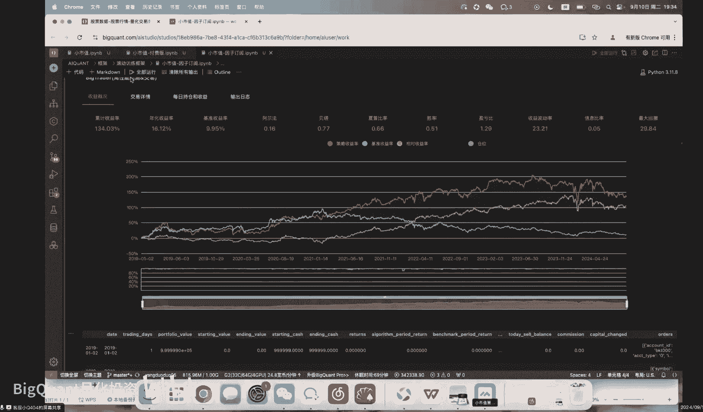