# 完全可自学！人工智能金融领域知识图谱+Python金融分析与量化交易实战全套课程！入门真的超级简单！——机器学习／深度学习／NLP自然语言处理 - P7：4-金融领域图编码实例 - AI算法-漆漆 - BV1Wgz3YVEx1

行了，让我给大家举个例子，先举一个风控当中的啊，这也是graphy bending啊，咱们这些应用你后续啊在很多其他的任务当中，无论是机器学习还是深度学习，还是各种数据挖掘任务里边。

你都会看到graph embedding的方法，因为是这样，但凡你用到了图模型，咱别的不用说了，肯定要做特征，图模型做特征，那肯定要基于图去做embedding吧。

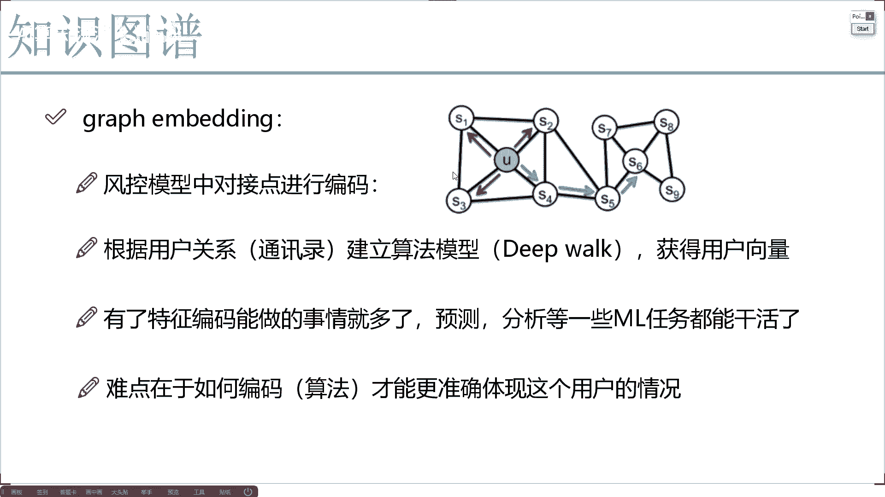

比如举个例子在这里啊，有些关键点啊，你就当做是那个咱们现在有贷款app app当中呢。

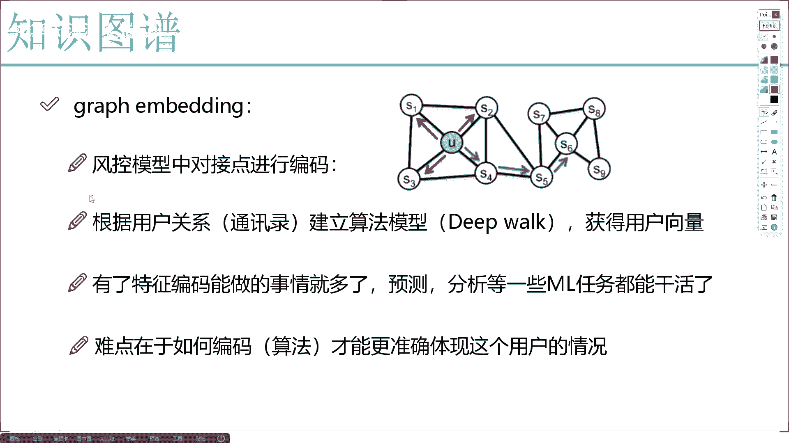

嗯咱们有一些用户有这个S1到S9啊，我们有这样用户啊，你就当假假装先当做这样一件事就行了，这些用户之间啊，他是不是有一些交互啊，那我说现在这样。

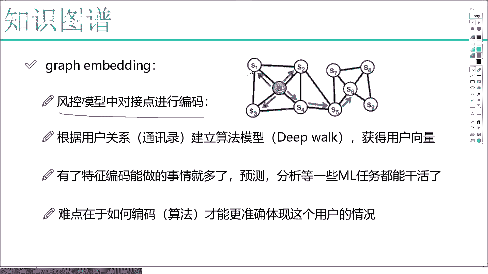

我说我想把这个S1啊编码成一个向量，那怎么办呢，我说这样啊。

我一开始啊可以先做一个随机初始化啊，比如说随机初始成一个十维的向量，然后接下来接下来我一看啊，就是这个S1啊跟谁做交互了，或者说当他在走的过程当中诶，走走跟谁走了。

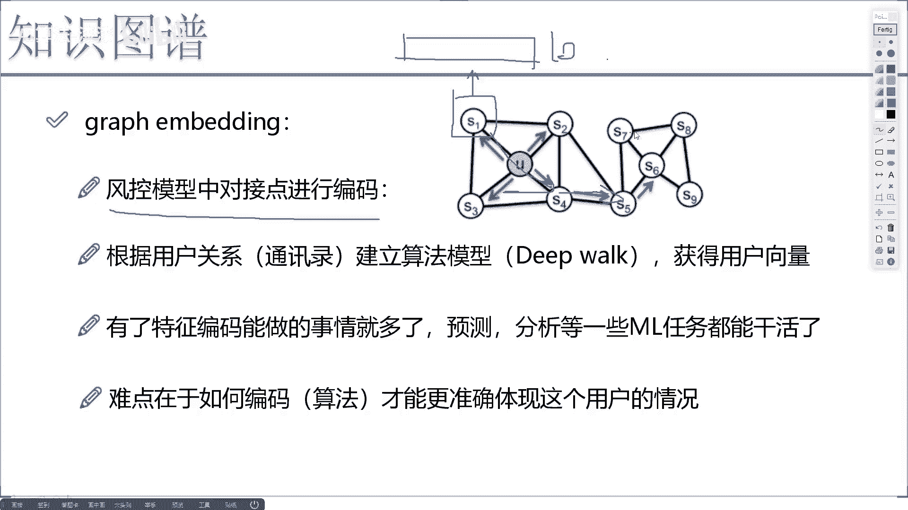

比如说举个例子吧，这里就是S1，然后S4，然后S5S6，哎这样S1S4S5S6哎，这是S1的走法吧，然后呢我还可以再写一些啊，比如说这个S7吧。

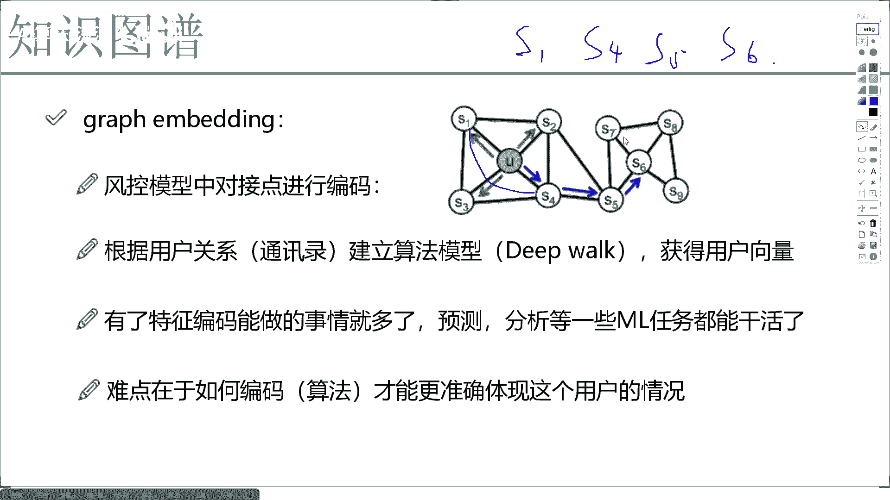

我就随便举例子了，S7他就这么走的啊，这个S7，然后这个S6，然后这个S9，然后这个S8，哎大家可能说哎，你列出来这样一个路线有什么用啊，咱们来想一想，我们说啊，现在啊如果说我拿到一个文本数据。

我们怎么编码的文本数据当中啊，比如这样，我说风控模型中啊，对对啊，这这这这这这你就当做这个对对这个节点啊，对这个节点这个写错了，对节点进行编码。

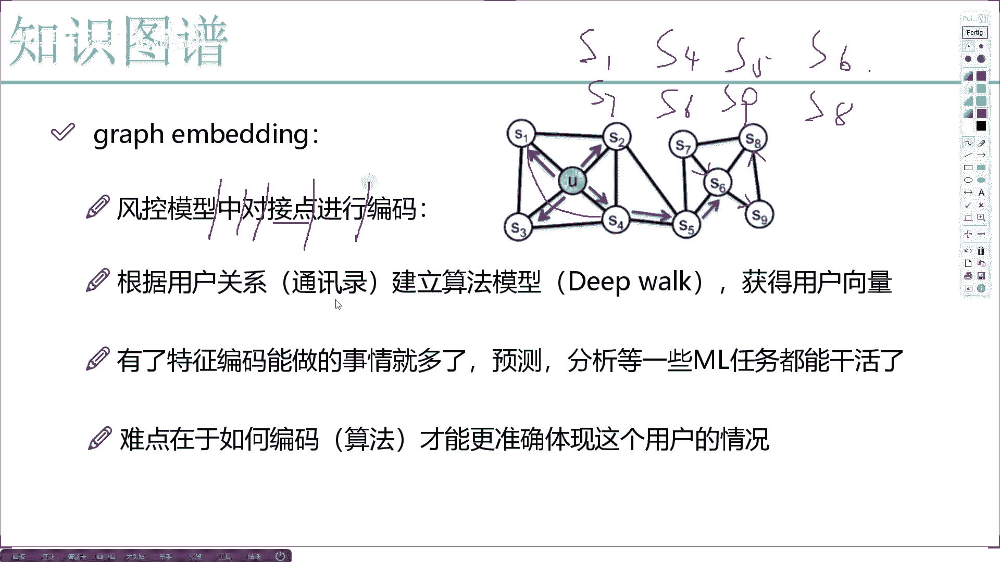

那你看这里是有什么第一个词，完后第二个词完事儿，第三个词我就这么写吧，然后第四个词，然后第五个词我们在说一句话的时候啊，是不是按照顺序去说的啊，先是第一个词是什么，第二个词是什么，第三个，第四个。

第五个词是什么，诶那我问你件事儿，如果说咱们现在要对一些文本做编码，比如说你说对这个呃进行这个词对它，我说给它编码成一个向量，咱们怎么编码，诶是不是得看一下我的上下文当中。

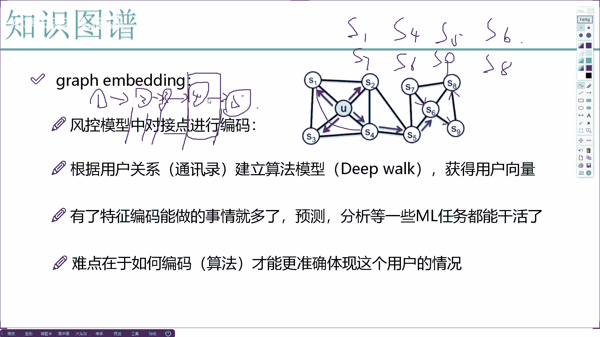

诶这个词在的一个位置以及上下文都是什么词。

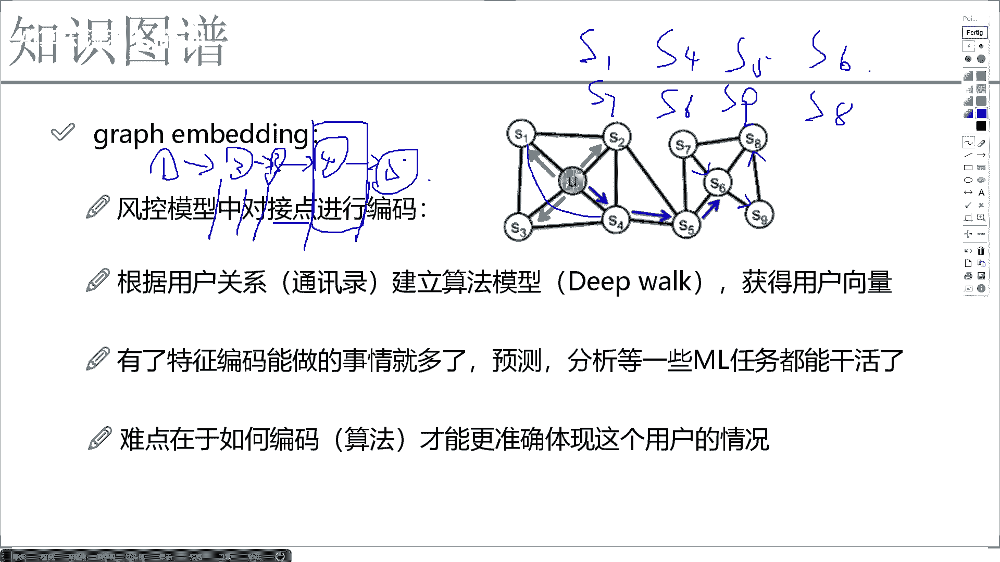

然后呢咱们可以用一些比较传统的，像是word twitter或者现在比较流行的一些bot模型。

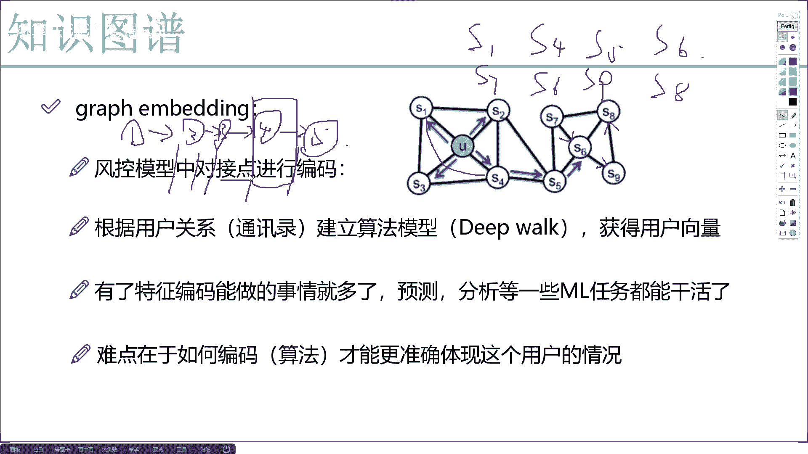

我们来去做编码是不是都可以啊，再基于一些注意力机制啊，再基于我的上下文是什么，给它编码成一个向量，可以吧，文本数据咱们就这么玩的吗，怎么样去把一个词诶编码成一个我想要的特征，那现在我们来看一看这里边儿。

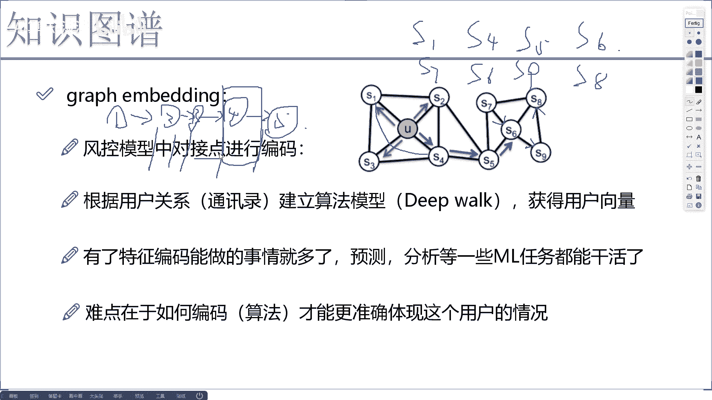

虽然说我现在不是一个文本，但是他们之间通过这个关系形成了一个路径，在这个路径当中，如果说我想对这个S4做编码。

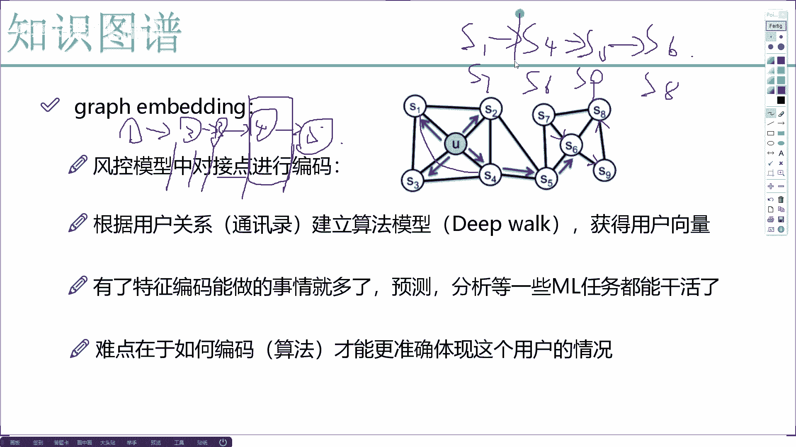

咱们来感觉一下S1是不是它的一个上文。

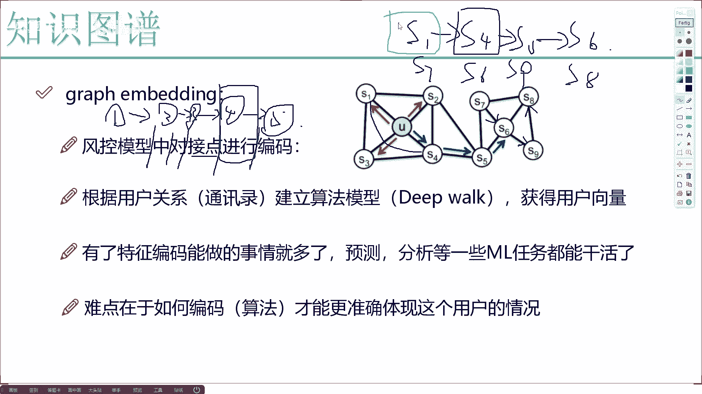

你可以当做前一个词S5，是不是它的后文，S6是不是也是他的后文，跟我们这个NLP当中的上下文结构诶，你说像不像啊，是不是非常像，既然非常像，我们可不可以用一些类似的方法来去做呀，是不是也可以啊。

等后续咱们讲一些实战项目的时候，我也会给大家去说啊，比如说好像是比较经典的这个DEVOE方法，我们该怎么去建立，怎么样对每一个节点我们实际做一个编码，给它编码成一个向量，因为有了一个向量之后。

我们能做的事就多了，有了向量诶，有了特征，我想预测什么。

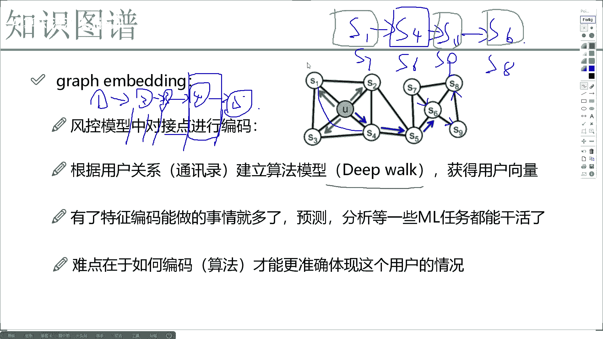

预测什么，想干什么，咱们是不是就干省什么了，预测分析所有机器学习，生物学习任务我全能网上去做了吧，所以说此时啊。

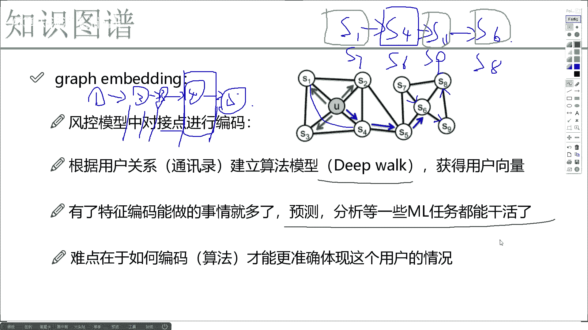

咱最大的问题就是在于编码这件事儿，我该怎么去做，怎么设计这个编码，能让我当前啊这个每个向量做得更好呢，其实现在我可以这么说啊，graphin bedding这个东西啊，已经成为研究非常热门的领域。

并且它是持续在迭代更新的，现在来说啊，就不同领域都会有不同领域的方法。

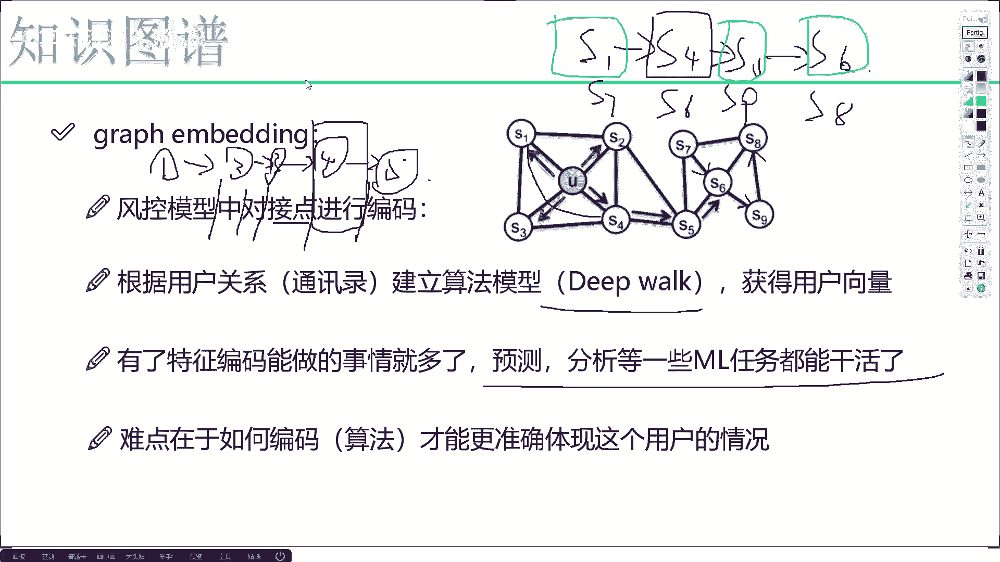

因为业务来说啊，就是差太多了，金融领域的业务和你医疗领域当中，业务是完全不一样的吧，所以说啊到时候大家我们做这个GRAMBEDDING，我会到时候会在例子当中，给大家举一些实际的例子。

我们得看一看不同的领域。

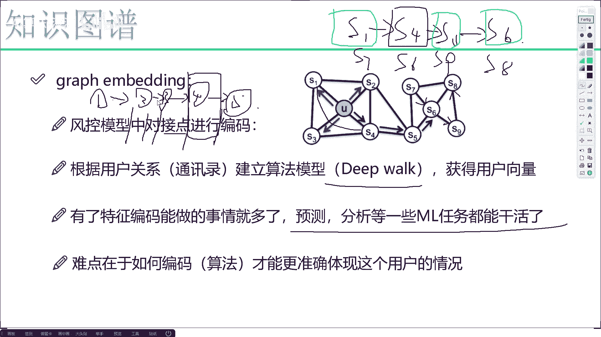

不同业务当中，哎我们实际啊咱们是怎么去做的，这里呢先给大家举了一个啊。

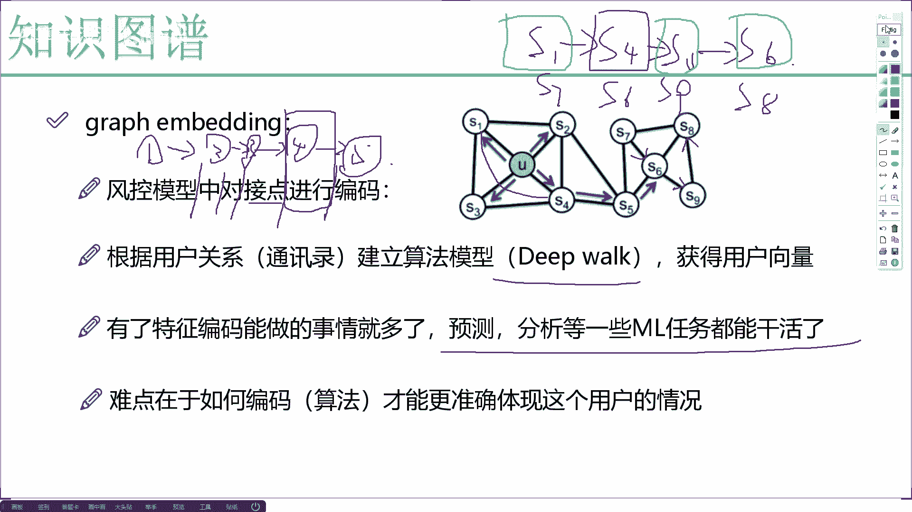

就是金融当中啊，基于我们的一些关系。

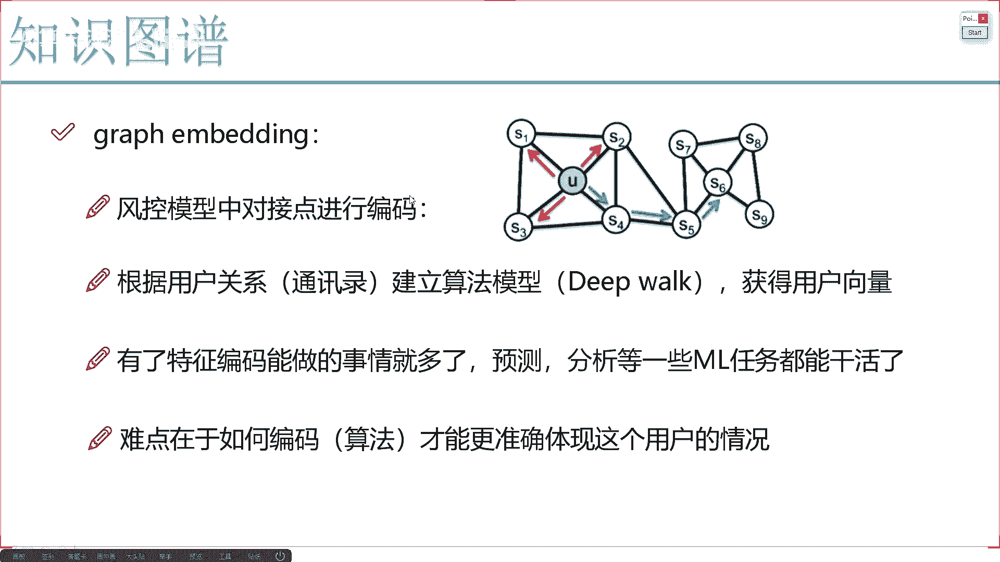