# 在mlrun和qlib基础上的量化交易机器学习数据导入篇 - P1 - 弯曲的时间 - BV1Uz421z7pk

嗨各位大家好，今天咱们继续聊一下在m l run的基础上，如何呃用live的一个方法，另外呢在我们的群里面有人问啊，QD5怎么使用啊等等这些问题啊，所以今天也稍微做一下这个介绍。

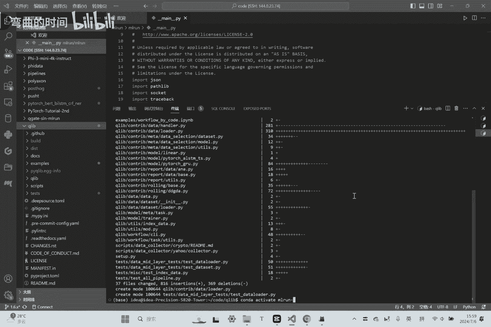

个人的理解啊，额我们打开GITHUB上的额live的一个开源的代码，我也发现他最近也有在更新啊，我其实哦好久没有看到了，昨天有一个更新嗯，更新了一个叫nasty beat ler，看一下啊。

昨天提交了八个commit奇来自于他，我看一下，总结合内容啊，在test这里面哈做了一些更新，看一下啊，增加了，Bl bl，这些都删了，加了一些什么呢，部队的DL看一，然后这个loader。

我们看一下它的安装要求啊，他是其实最近他没有没有太多的更新了，23年5月16号，它的安装要求是额3。73。8，3。9的话呃，用屁股是安装失败的，然后画图不能画额。

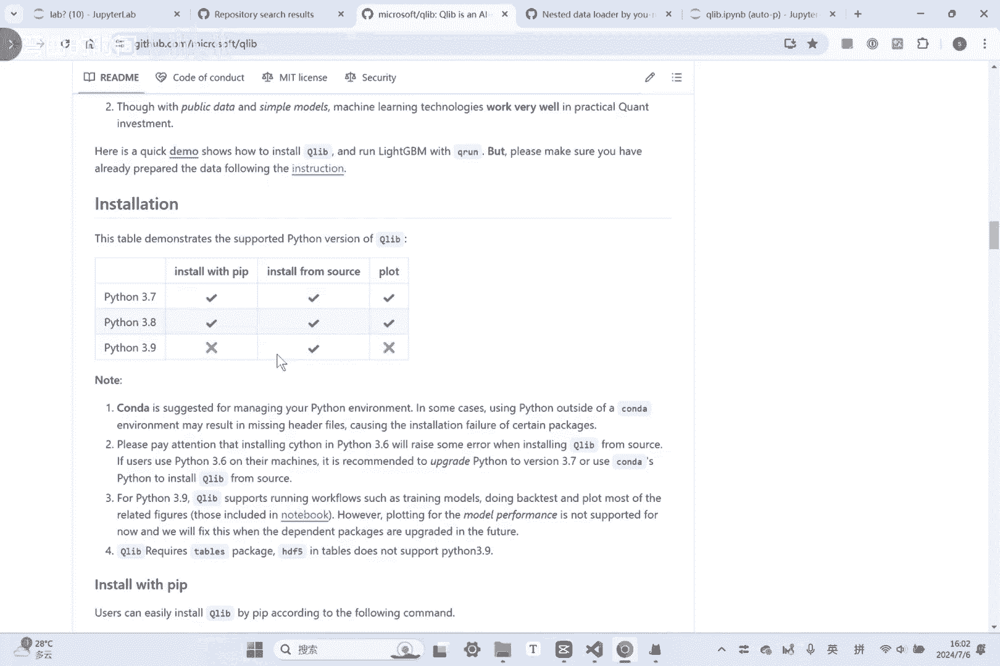

因为我们的m wrong是3。9，所以想要使用的话，必须按源码安装，那么我们切到这个咱们run这个环境里面去，源码安装，怎么安装，安装不了，没有下成功吗，我看有啊，这有个提示，就是要装一下C本C但是。

哦这个版本不能获得啊，哎不对，写错了，然后再装一下，时间用的还挺长啊啊大家看。

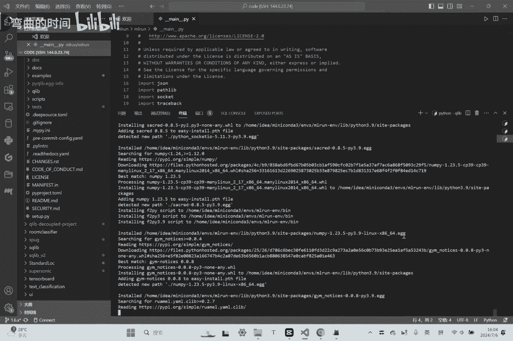

先装着吧，然后我们看一下我们这个使用这一套的方法，OK安装好了啊，报了一个错，我看pandas是没有装，Pandas is install，but pandas要求是ml fu小于二，理论上。

啊这我不管了，因为我们我们这一次不用ml flow，可装好了之后呢，啊他这里面也有介绍啊，他是这么装的，INSTSTORE点哈，我们是用那个setup。

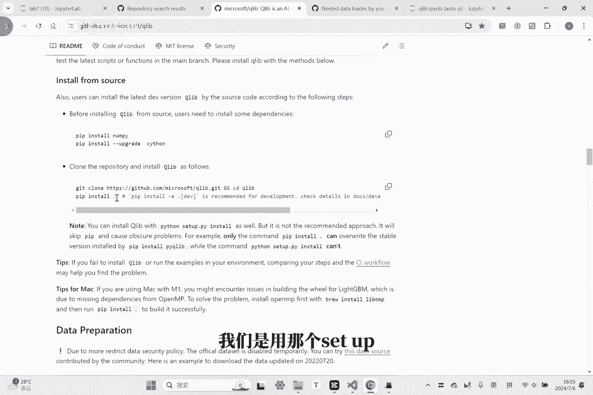

我理解应该是一样的，我们用这个装下来看，那是这样。

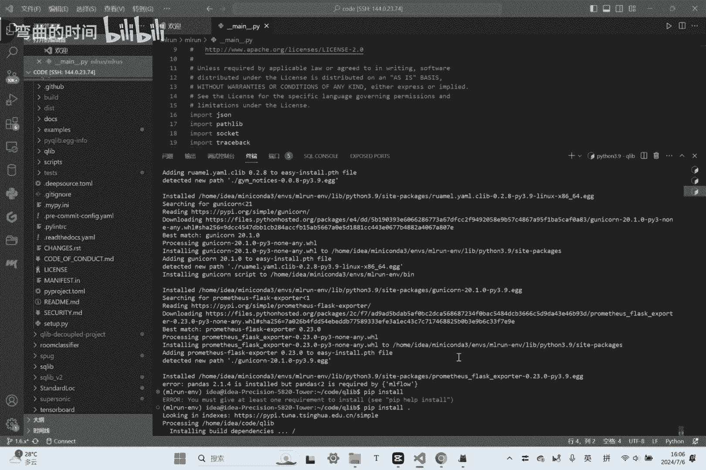

Uh oh，我这个方法还不对呀，你看人家说你可以用这样安装，但是呢它是不推荐的，它将会跳过P谱，而且还会引起冲突呃，只推荐用这个他能够重写稳定的版本啊，哦就是用这个方法，它是间隔，可那么听要听话啊。

我们听话听话完了之后呢，他这里面有介绍数据的准备，哎看到了没嗯，看到了没，看到了，我们就很高兴了啊，优吏部的开发的同学们呀也非常呃知趣，真的是也用investment data对吧。

我们看一下这个数据源，要知道自己的数据源很差，我们也用它的对吧，那这样的话我们把这个时间改一下就好了嘛，然后就这个样子咯，这个样子的话我们看一下啊。

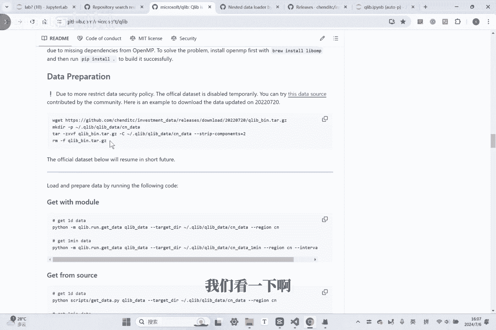

先安装完，OK安装完了啊，报了一些错误，什么主配件要求是嗯0。2。5，但是你装了一个0。2。4，就是把它更新一下对吧，然后，dory要求等于五，但是你装了个1。5。3，2。1。141要求是大于22。

但是女的是20匹配，问题不大。

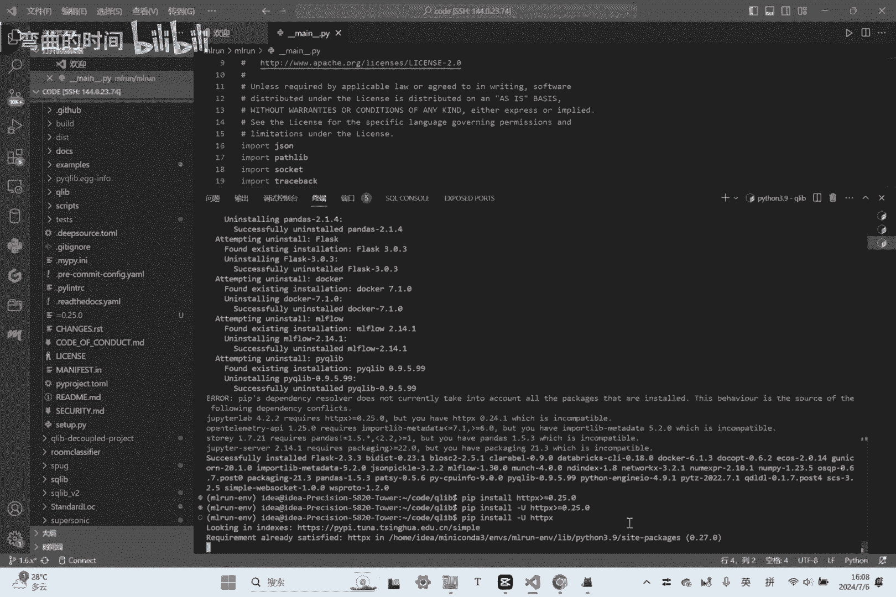

要求22，但是你是24，把这个ml flow也装一下吧，这是哪个版本2。14。2了啊，OK嗯让我们安装完了，然后我们执行一下这行代码，这个数据质量还是蛮高的对吧，我们呃我们知道这个数据质量是特别高。

特别高的，嗯看一下这样了呃，我们把它放到这里面来吧，时间改一下，时间过得好快啊，OK大家稍等一下，我把这个这个替换一下，我把B站的这一个替换一下啊，稍等一下呀，最近这个粉丝自从换了这一个视频之后啊。

更换通话视频，更换视频，因为那一个视频那个，这个叫什么啊，这个白字额，0705，对不对，OK不行，报错呀，怎么会报错呢，没找到，快点啊，要了吗，哦我把这个格式改了，加了一个杠杠，咱们先下载一下子。

下载完了之后呢，咱们，执行一下子，对不对，400多兆，然后这个可能需要一点点时间啊，没关系，稍等一下，下载完了之后呢，然后是load and prepare data by running。

The follow co，呃需要一天的就用一天，需要一分钟的就用一分钟，这个无所谓的哈，然后看一下这个代码的差异，用哪种方法都行，先用一天的吧，也没什么特别的，对不对，好吧，我就不带那个命令行。

有点直观啊，我们就用这这种，然后嘞这就没啥了嘛对吧，然后这个我们就不用了，雅虎的数据质量很差，嗯其实你用那个呃investment，这个其实你就做一个脚本命令就好了，这个是一个workflow。

就是工作流，就我们这个工作流其实就就蛮简单，就直接执行一下，其实就好了，可以啦，然后我们等等等一下啊。

等一下清一下屏幕。

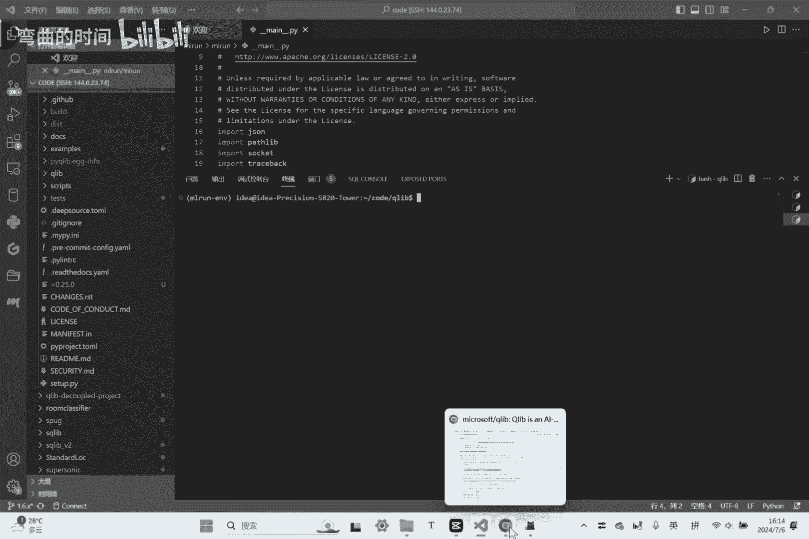

然后这边41稍等一下，下载速度还是有一丢丢慢啊，还有一分钟稍等一下啊，我们应该原生的就有这个，这个我不知道他会不会重写啊，也有可能会报错唉，这速度快了，每秒钟差不多有六兆左右吧，OK我先把这一个删掉。

注释掉哈，先用这个，好，oh y啊，里边有很多数据，我看对吧，都打印出来了，大家也能看到哈，也就是说它的数据质量还是蛮高的，不用往下看了啊，大概就是这样，我们跑完吧，考完之后呢，呃我们就可以。

唉跑完了对吧，跑完了我们清一下，都给清一下，然后执行一下，这个执行是什么意思，我我觉得理论上它我看一下啊，我觉得他已经把这个数据放进来了，为什么还要走这个动作，我们看一下脚本啊。

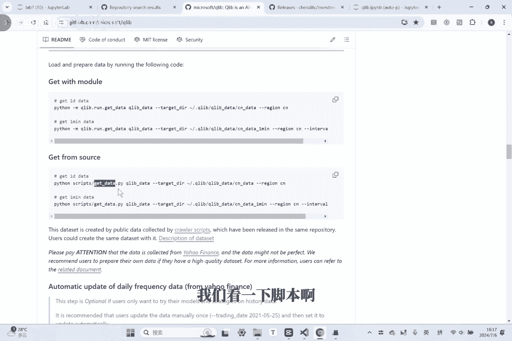

secrets对吧，我看一下，呃然后用了这个，这个是在test，里面没有cheat，没chat，23345，赵阳是为了测试一下数据吗。

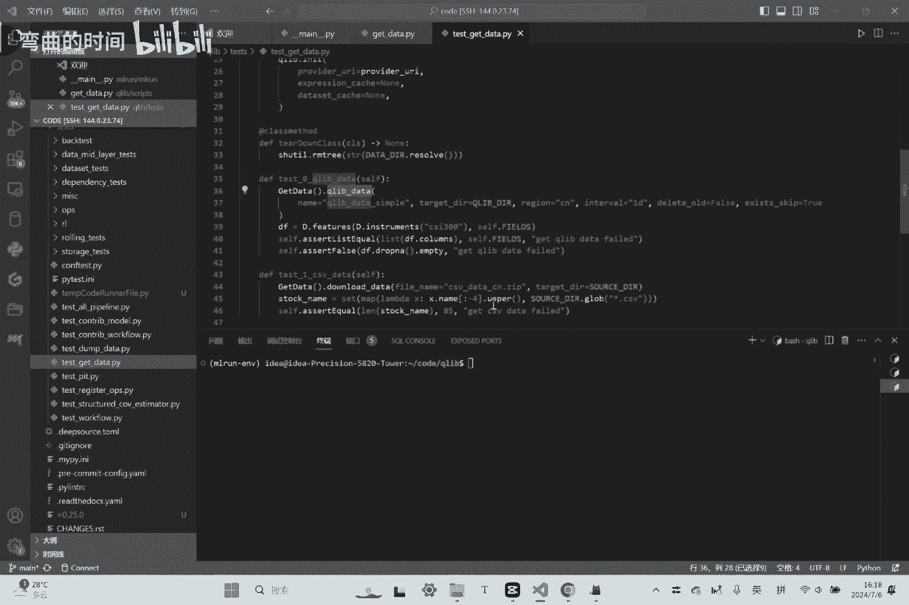

干啥啊，来来来，那你带你翻一半好吧，你爸爸我就告诉你，你这么玩玩，一会儿你就放你妈啊，好嘞，我可以执行一下，Cd，啊这个是在这个里面跑，是执行了它对吧，打开一下吧，打开一下是，example对吧。

然后在这个里面有一个，执行这个命令，执行这个命令，我们打开一个什么呢，打开一个cancer，然后我们我们继续啊，这个就是跑这个脚本，就其实就简单一下。

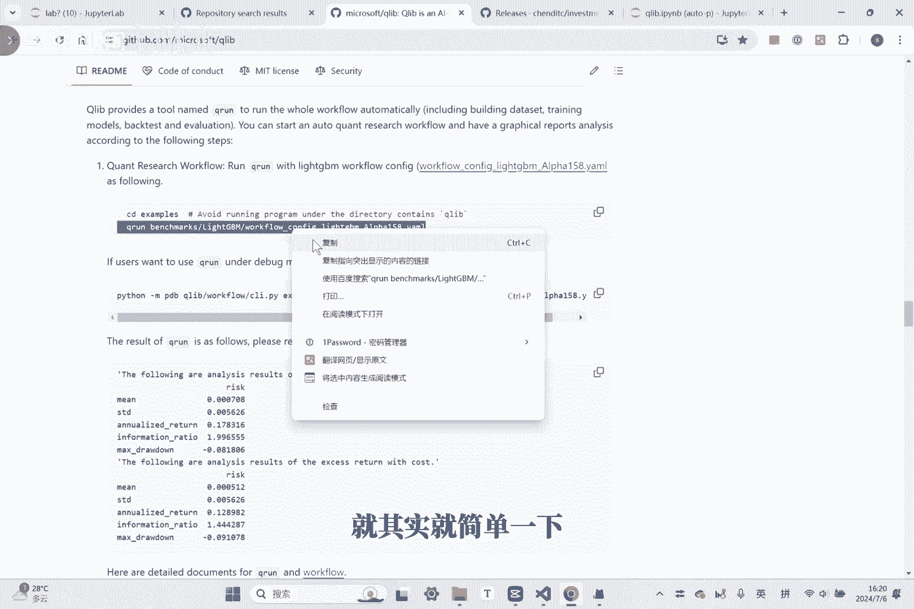

就是验证一下，咱们也也验证一下，在这里面去验证一下，否则切目录不是很方便，啊验证一下，燃烧的工具啊，那都没装，说是嗯，然后这个跳过没装这个呢，按一下啊，Sample，然后是workflow。

Wenchmarks，Light g b m，Load data down，咱得装一下这个，那个是装上了对吧，不支持，在这个单位不支持，这个不存在，用了它，楼盘价有这个这个这种数据，nor有空值。

factory day不存在，OK跑完了对吧，我完了，完了这只是一个前期的脚本，其实没什么用，我们只是说看一下这个效果是什么。

然后呢我们去看一下，我们要在QB部下的使用方法，那个是跑所有的模型。

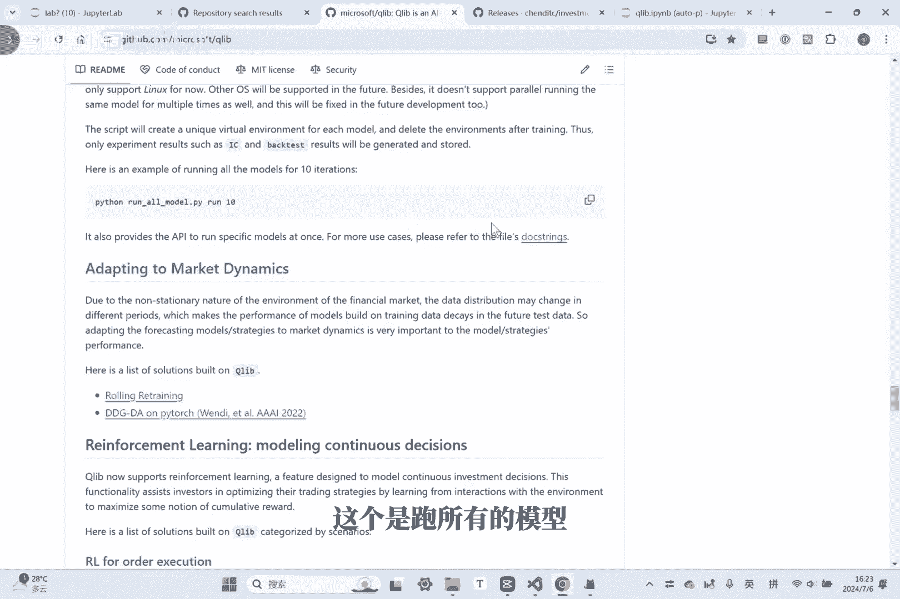

其实你就跑一遍就行了，其实没什么，那我们核心的是什么呢，核心的是，他在这个。

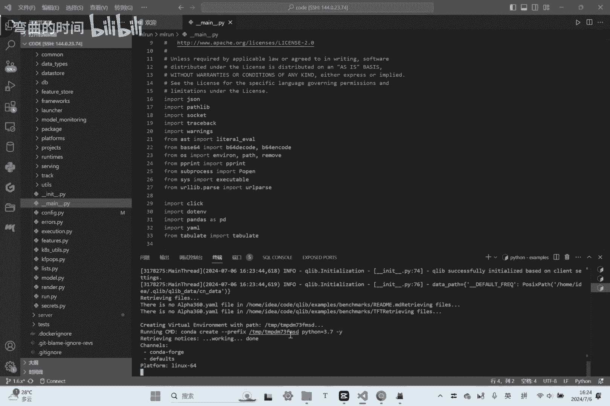

m l run的基础上，他应该怎么怎么去使用，那我们在这个里面呢也能够看到他的这个，这一个对吧，workflow我们可以用这个workflow，然后这里面会有一个，DADA这个CAO这个就是数据吧。

数据，然后看一下这强化学习的，我们先不管了，我就打开这个好了，这是workflow code，这里面大家熟悉克clip的，其实这一些大家都耳熟能详对吧，让我们看啊。

这个是workflow by code，Workflow by code，这个东西我理解啊，就是跟哪个特别像，跟这个m l wrong一起探讨一下吧，这个里面这个里面他不是有一个，吗这个。

咱们一个个看一下，首先呢我们先不关注这些内容啊，我们先把它清一下，要么第一步就很简单，就是先，减除二一下对吧，哎呀这下不管了，A然后嘞，我要，这两个嘛对吧，我们import一下，导入了。

然后我们跟着这一个这个节奏啊，另一个呢是要建一个工程，对不对，咱们要一步一步来，其实我这些我这些也没有多啊，然后这里面我们新建一个工程叫quick culip，没问题吧，之前是没有的，我们新建一个。

咋说呢，呃这个版本啊你需要知道有1。9。0，bal idea呢不等于清嗯，然后呢，你确定是成功啊，换成这个了，啥意思呢，可能是我没有重启那个什么呀，重启一下，这个可能是没有重启。

以前的环境变量都还在再执行一下，然后再执行一下方，OK这样就可以了，然后我们继续往下走哈，这样的话我们在这一个他在这个里面呢，它是我们也看到了他在这个脚本里面呢，唯一增加的是一个这个。

我们尝试一下把这个数据呢在前端做一下展示，看一下8060对吧，哎工程建好了对吧，Quick culib，这就是我们建的quick q lip，然后我们现在需要把这个按照他这个模式呢，呃把这个数据引进来。

那在在这个里面我们看一下啊，这是一个刚才介绍的那个数据嘛，数据完了之后，然后是执行我们呢嗯这个这是个初始化数据，这是个get it，get it完了之后呢，用默认的数据初始化，初始化完了之后没了是吧。

就没了这个啊，这个就是初始化数据的过程啊，跳到了get data这个数据里面，其实在我们这边呢，额我们也没有什么可更新的，我们在这个里面呢就是把，这一个这个放进来，然后我们一模一样的啊，我跟着人家学。

这个里面，他是要把这个外行的目的，就是写一个本地的Python代码，这个我们把它叫做data pre，也叫data pre，没问题吧，我们也叫给他普瑞，然后他这个里面呢加了一行句柄，我们也加一行距离。

这个它是在一个函数里面啊，函数里面对吧，我们也加一个函数，这样的话我们嗯尽量的保证相应的东西的不变，没有发生任何变化，然后加一个函数，然后怎么样呢，tab1tab一下这个名字，函数名字我们调一下。

我们叫做，You lib cn，贝塔后写，OKOK呀，然后我们看一下还有没有其他的变化哈，它这个里面有一个返回呀，返回是返回了数据，返回了一个label，我们呢，我们把它，看下get data。

Get data，get data是在哪里面哦，它还引入了一堆东西，at date on在哪里，这，正在看看电视玩不了了，函数它它是在第二这里弄的，Get data，From get data。

然后啊就是在secret secret，我看一下。

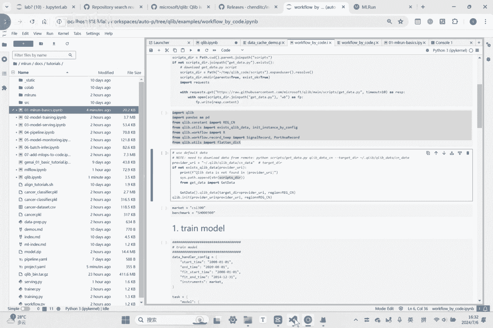

这个吧这个然后走了一个这个，但是这个好像没有了呀，Pleap tests，哎这一场这不也没有了呀，You leave texts，看一下哈，这个是这个，哦他是。

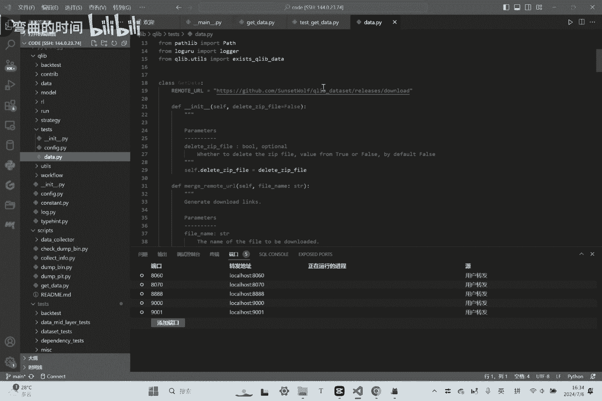

这是个啥，我又搞了一遍这个，哦这个已经废了。

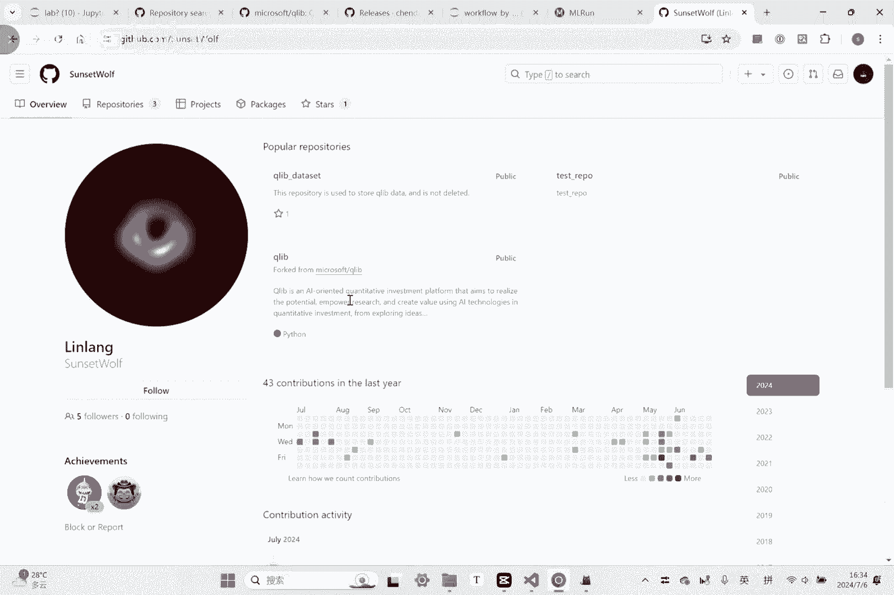

他没加糖吗，我看看，这些哎呀这些他都没有用了哈。

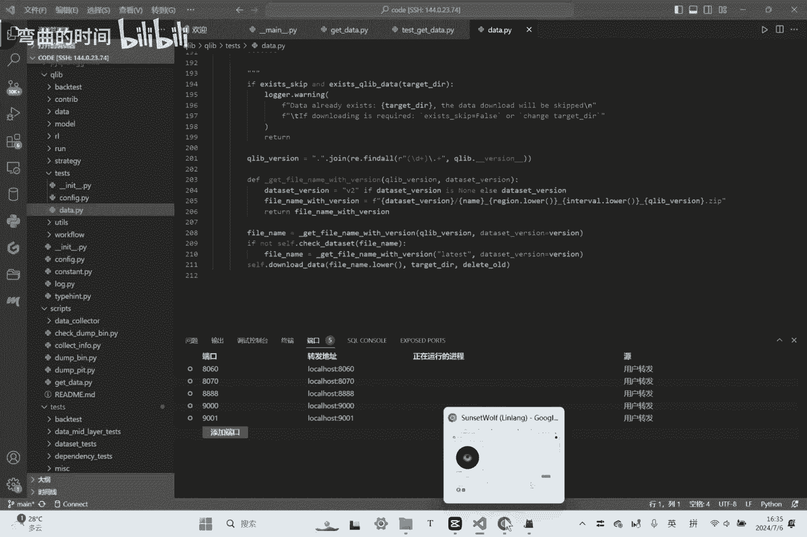

然后是q live date对吧。

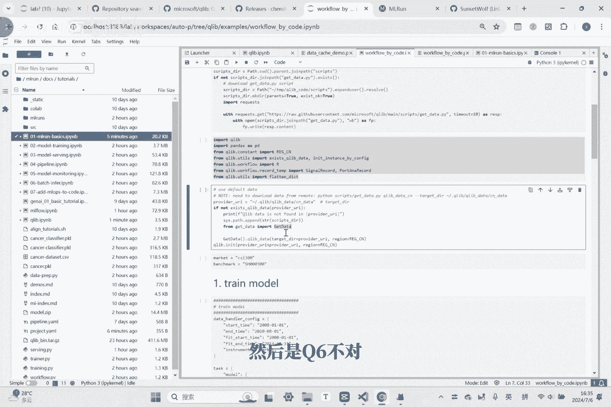

他用了q live date，就用这个函数呗，上面没有用下载呗。

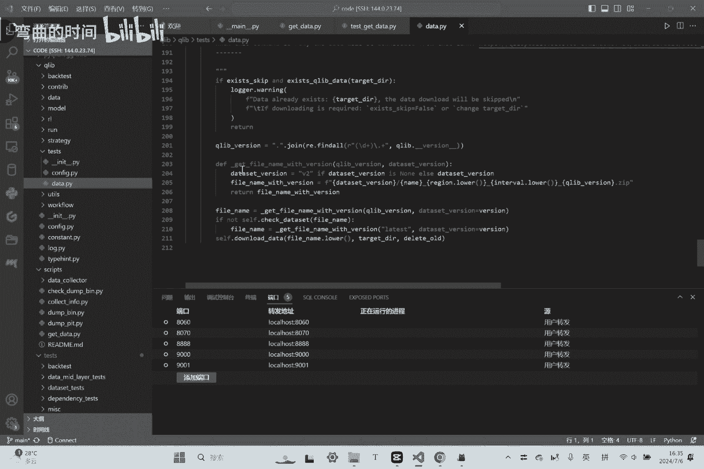

下载呃，其实我们也不需要下载它，只需要这有这一句就行了，上面都不需要，默认吗，就是它目标函数，然后初始化，Can live in u，You lied finish。

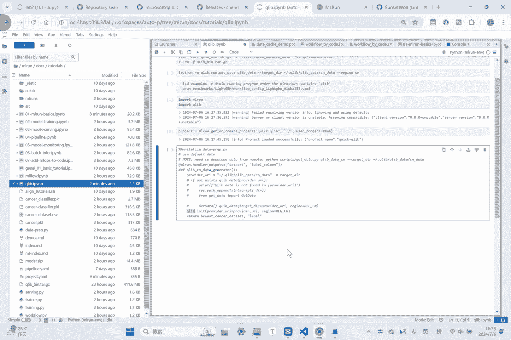

按下啊，这里边对吧，这一个用q lip init实际让他走到走到这一步，这一步的话其实就是一个初始化嘛，初始化上面没得说，然后这是挂挂挂上面的那个挂个盘，这边有一个c register没了，上就走。

这个，没了，又是一个简单的初始化，呃我们继续啊继续，我们看一下他这个它这里边不是有一个example，example里边不是有一个，那得有一个什么来着，是这个吧，我记得不像这个，看。

Detail workflow，嗯这个只是一个下载吗，如果我们选一下啊，看下镜像，只是下载，如果已经下载完了，那么我们就跳过，大概是这样，然后这个就是做了个初始化，用来in it，它把数据放上去。

其实初始化的时候他并没有进行啊数据化，真正数据化的时候，他是到了这个D是的数额，到了D之后他才额进行这个实际的数据的转化，是这逻辑吧，如果是这个逻辑的话，我们得实际上到了这一步，哎我还找不到这个镜像。

到了INIT之后，我们可能还需要把这一个给搂进来，周静蕾，基本的数据是不是转成DF了，Df，DF之后才能画图，也就是说这才能到DF才能实用化，这样。

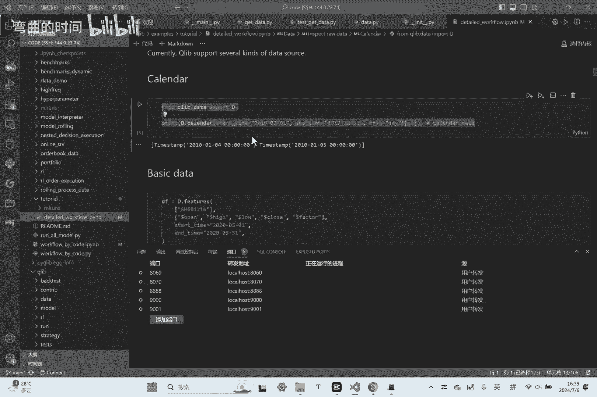

不换了对吧，初始化完了之后，这个就是calendar的数据，我们把这个print，删除，这样我们的E就过来了。

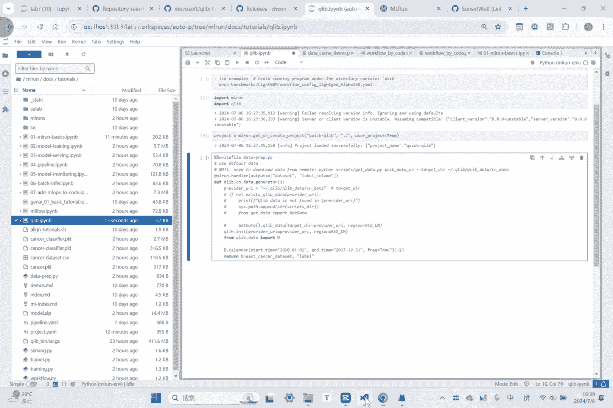

D过来了，完了之后呢，而选了他的特征。

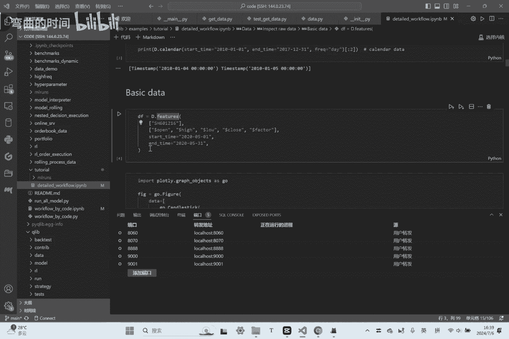

开始时间，结束时间就是DF，这个我们先不管，我们先把这个D过来，这个D过来呢，我们就叫它什么呢，就叫cn data，没毛病吧，然后把这个CNDA放到这里，然后我们把这个名儿呢我看一下啊。

改成叫lip sing data，执行一下子吧，看下是不是写好了啊，U live cn da，就这个呗，打开看一下对吧对，这就没问题，没问题，那我们就执行下一步执行这个工程保存，不能保存呢，我们是这样。

这个我们就改成什么呢，改成，叫you leave，我们直接CTRLC吧，这样这个名字我们也改成把ANDER改一下，Ok，啥意思啊，哦好吧，人家还不让你整，为什么不让你整，不让用就不让用吧，我没有中间线。

这是很有意思啊，不用下划线再走一遍对吧，执行完，啊这个，刚刚从此男性没感觉他，也行，这，OK执行完了，我们走下一步，下一步就是run了对吧，run一下啊，这个就是最关键的了对吧，这个就是最关键。

斗路能wrong，说明咱们前面做的都没问题，忘不了，我们就要一点点去排查，OK哎呀，保了个错，不错没关系啊，呃看一下，名字叫culib data colib d啊，然后说是m l run没有定义。

m l run没有定义啊，这里import一下，嗯Q65CNDA没有找到，哦这个数据叫q live sin data，因为我们要跟人家上面这个对齐，那不行。

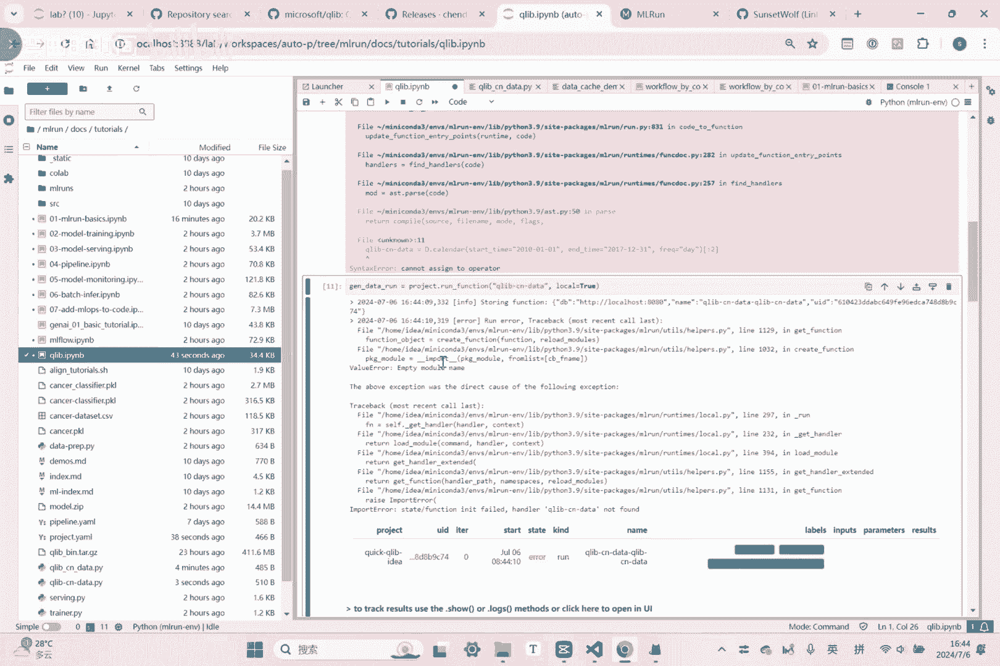

哦这个这个DCANADA它没有返回，我们回来看一看啊，它没有返回的意思是他没有实例化，这个才是实例化，把它放到放到这里面。

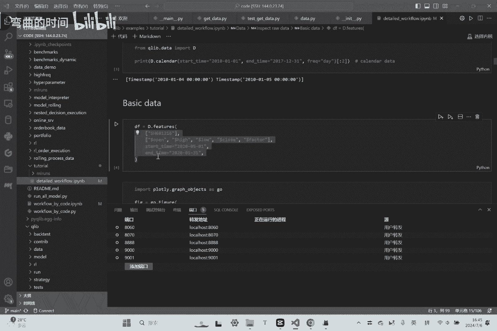

它才能使化，那我们继续加，对不对，继续加在这里，然后上面没有实例化，咱们就让它实例化，这不就完了吗，A，这个这个没有了呀，不错啊，操操，公的还是用这个地方，没有找不到，我看起来没有问题啊，我觉得。

格式啊，咱这样咱想跑一下，单独跑一下看，哦这个好像，是因为什么原因，搞不懂，我没有必要，操作符不对，什么叫操作符，然后DF呢，EF也可以啊，好吧，那我们简单一点吧，就叫DIF，哎呦我天哪。

真够费劲的对吧，under哎这个的话我看一下，改成DF数据应该是叫什，这个是他吗对吧，名字这个好像这个好像得改一下，看一下行不行，这个没找到对，这个应该就叫DF连起来，这，这个句柄是个什么东西啊。

句柄应该是这个吧，DF是谁哦，是DF，零是DF，呃DF没找到，EF没有找到，这个地方改成点，这都是数据里，有报错啊，还有这个句柄，句柄是啥意思，那这个是执行完了吗，执行完了，这是DNF，然后聚丙。

这不就是句柄吗，我来看一下它里边咱再介绍一下啊，他这个叫贝塔rap，这个就表叫它啊，这就是那个函数嘛，这表我们应该叫它呀，改一下啊，这顶改成八，然后这个句表咱们看一下这一个他run的时候。

他的这个叫DA杠pr，就是用了这个名字，用这个name来代替，咱们也用这个name来代替，注入live没有定义，REGCN没有定义，我看一下啊。

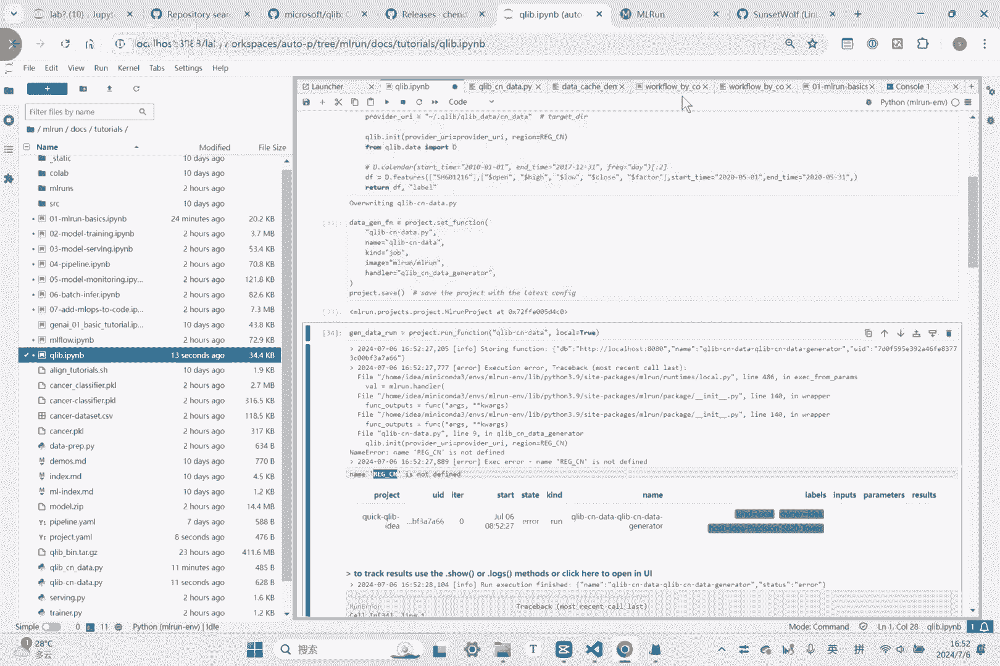

REC真定。

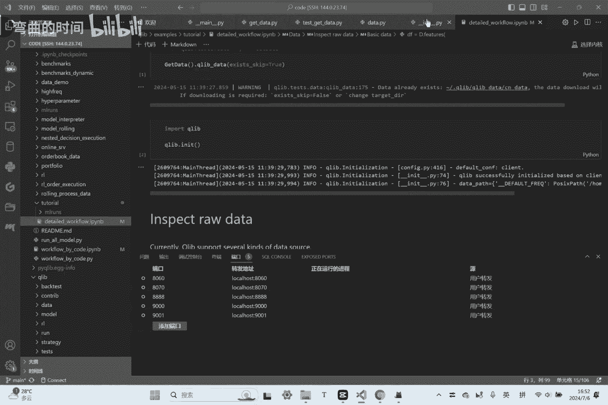

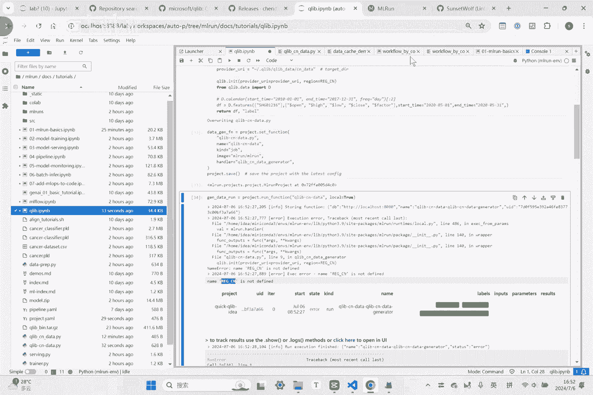

是在哪里定义的，我们看一眼就知道咯，嗯那个吧，帮着说说话呀，我想找个人，哦他在这里过的数。

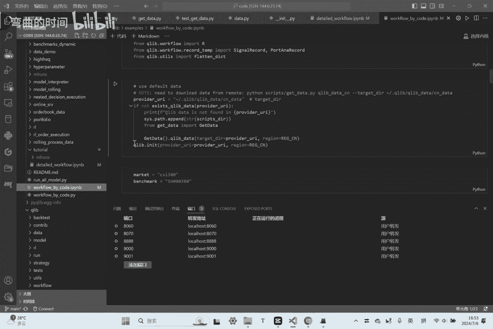

定义这个我们给它定义一下，有点太短过了，啊这个这个没有定义额。

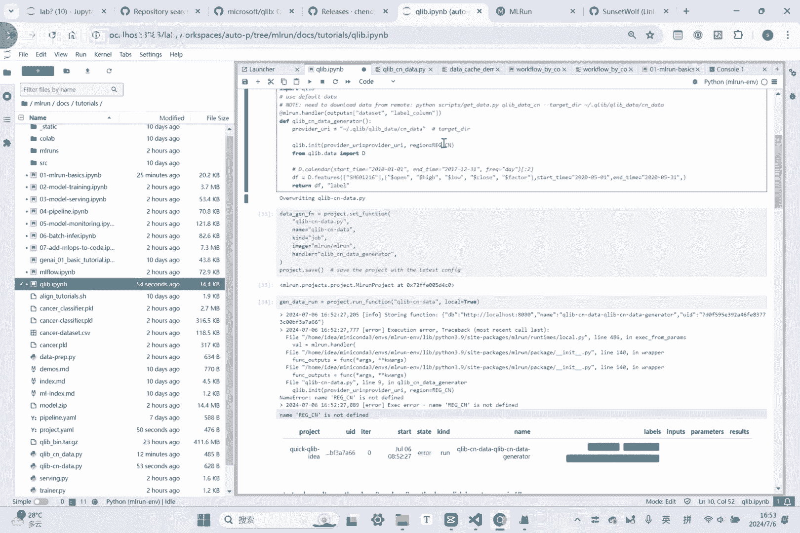

为什么这个热。

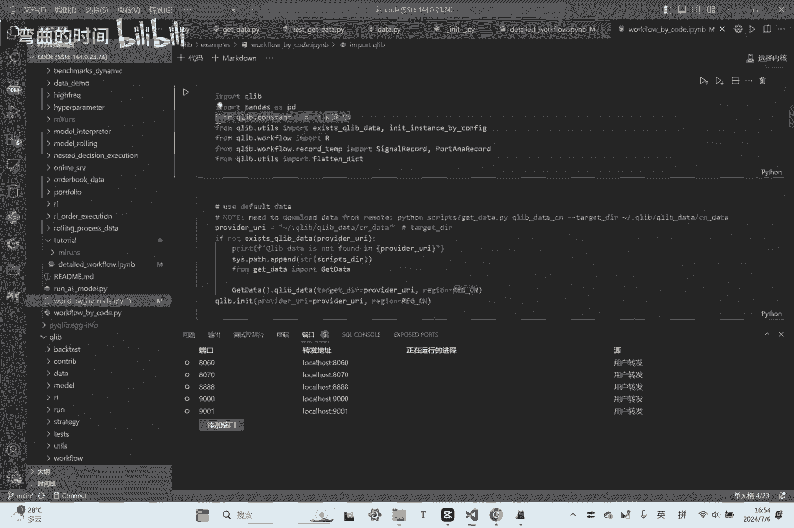

处处是坑啊，对不对，处处是坑，行二，考完啦我们看一下，这个里面，三条数据，每一项数据成功的是吧，function local owner是吧，都一样，输入没有，这个有，看到了吗，这是我们的数据啊。

结果box ok，今天我们就介绍到这里，我们先把数据搞定，下一步，然后我们把这个呃这个训练的这一部分才搞定。

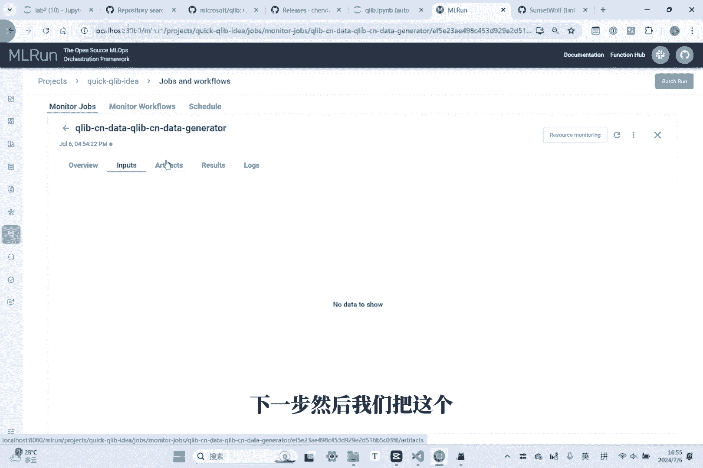