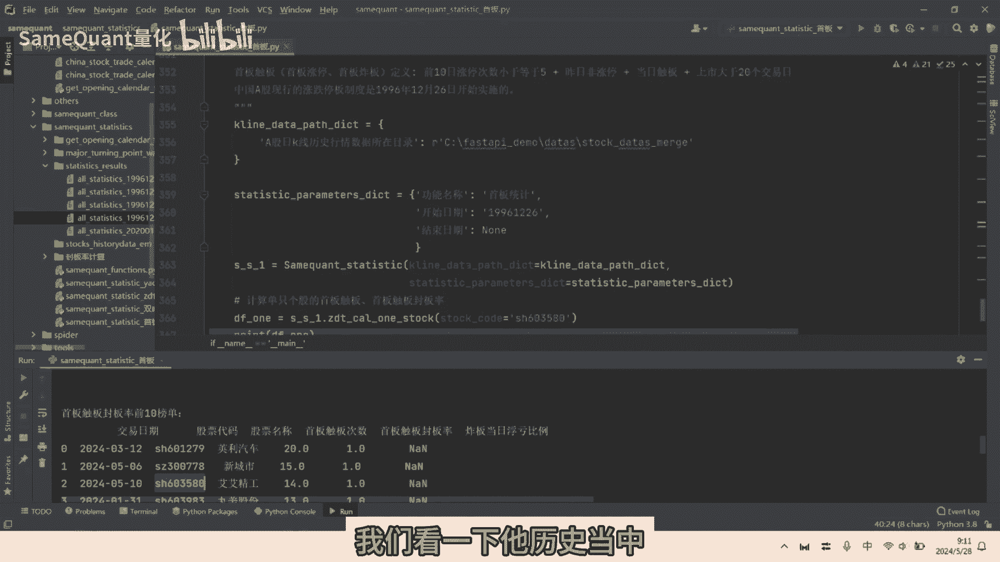
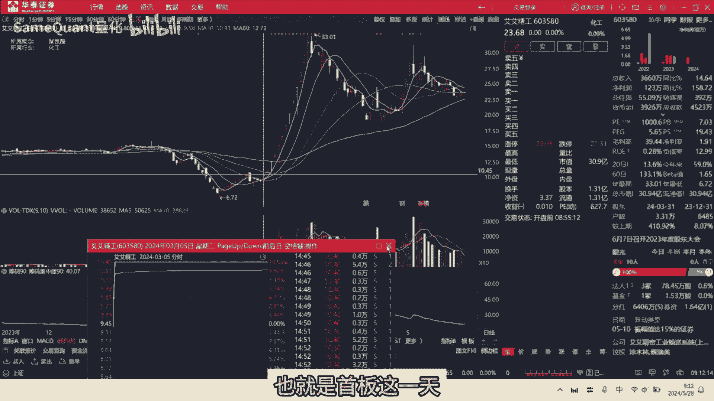
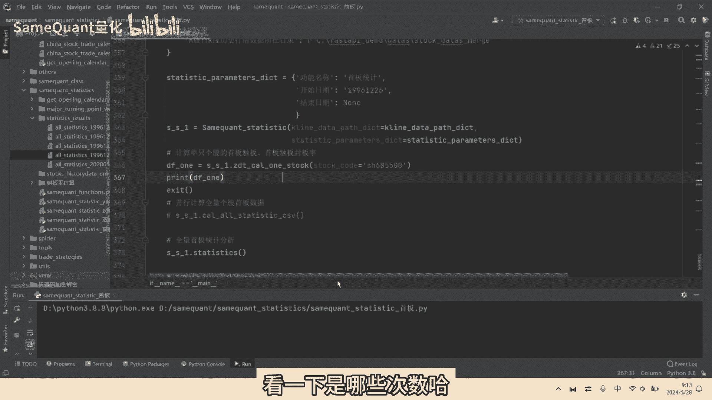
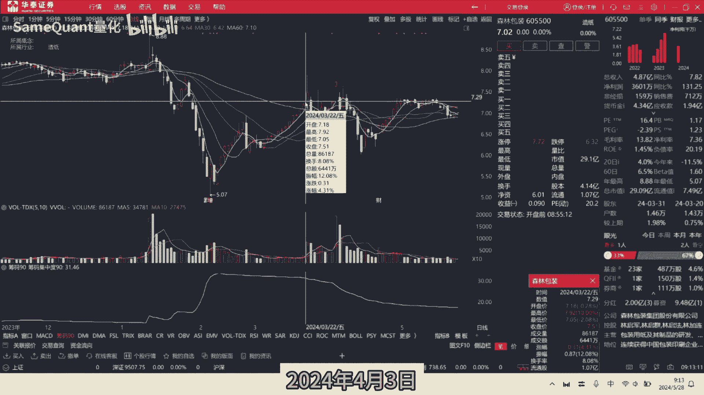
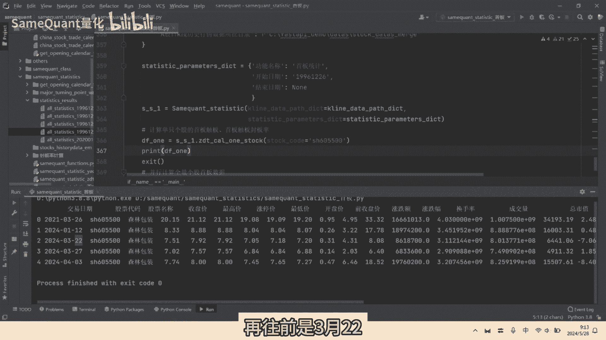
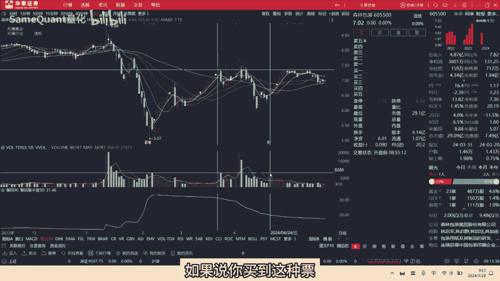
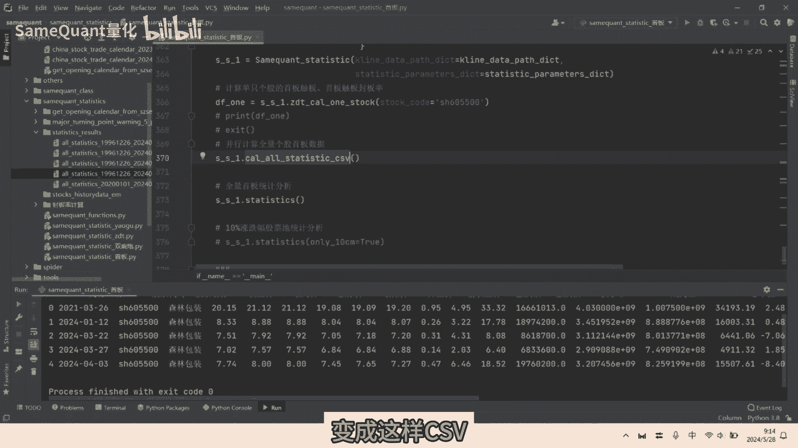
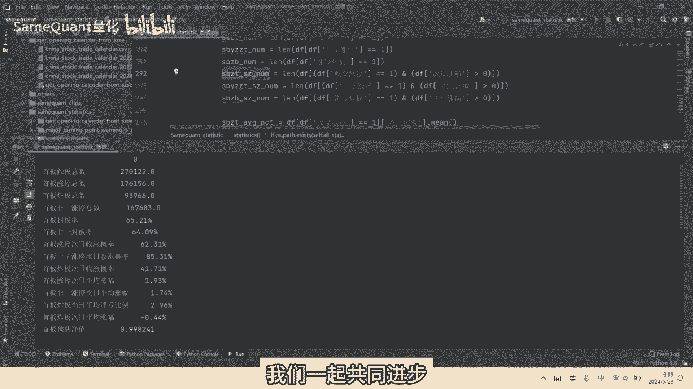

# 地球最强首板统计，值得看完！ - P1 - SameQuant量化 - BV1iw4m1i7GP

无脑打手板长期如北京吵架还是直接归零呢，每期量化统计一个特征，本期我们分析手板，各位学员好，这里是sim框架量化，只讲干货，那统计结果包括呢首版的封板率，首封板次日收涨概率，封板次日平均涨幅，炸板率。

炸板次日平均涨幅，炸板次日收涨概率，排除一字板后的手板封板率，手板封板率top排行榜等等，我们呢先运行程序看一下统计结果，再详细介绍好，我们可以看到啊，主板的一个统计的，历史的一个总次数。

是27万122次啊，涨停总数是17万6156次，也就是出版收盘，出版后收盘涨停的十一千是17万6000，156次，炸板总数是9万3966次啊，首板非一字板，涨停总数是16万7683次啊。

首板封板率整体的是65。21%，首板，排除掉一字板之后的一个封板率是6%，14。09，首板涨停，次日它的一个周涨概率是62。31%，那首板如果是一字板的话，他次日的一个收涨概率是85。31%。

那首板如果是炸板呢，他的次日的收涨概率只有41。71%，那首板的一个涨停，它次日的平均涨跌幅是多少呢，是1。93%，那首板如果是不输掉一字板之后，他持日的平均涨幅是1。74%，那首板如果说他炸板呢。

他当日的一个浮亏比例啊，它相比涨停价，收盘价相比涨停价，它浮亏比例是平均是负2。96%，那首板大板他次日的平均涨幅是多少，来是百分之负啊，0。44好，这个是统计数据。

我们再来看一下我们对于首板的一个定义啊，这个手板呢包含触版的，也就是包含涨停和炸板的，因为我们既需要统计这个涨停，又需要统计炸板的哈，是前十涨停次数小于等于五次，这是第一个条件，第二个是昨天它不是涨停。

当天出版，我们是取得上市呃，大约20个交易日之后的一个数据上市，因为历史上上市之后有很多一字板呢，这些要要扣除掉，因为这个会影响数据的准确性，好我们另外再要了解一下啊，中国A股现行的一个涨跌停板制度。

所以说我们的统计数据呢，96年的开始计算的啊，之前的就忽略掉，好我们来看一下啊，这个首版预估净值是什么意思呢，这个意思是假设你初始的是一块钱，你按照这个手板的一个封板率。

和次日的一个平均涨幅与这个炸板的一个概率，与这个炸板当日的浮亏比例，加上它这个炸板次的平均涨幅之后，那我们出的一个结果是0。998，也就是小于一的啊，这里是没有扣除交易的买卖手续费的。

也就是说如果说你无脑买这个手板，假设你一字板那个炸板的啊，这个非一字板的涨停的你都能买到的话，那就是所有的人都能买的话，那么长期下来你就是亏损的啊，是不可能赚钱的，当然北京炒家，你说他业绩那么优秀。

这个东西肯定跟他的主观经验，有很大的一个关系啊，这个是无法复制的啊，好我们再来看一下这个top10的出版封板率，top10的一个榜单，这个是什么意思呢，比如说这个阴历的它走板符合收板条件。

它出版次数有20次，然后他封板率呢是一，也就是百分之百，也就是说他20次出现了手百二十次，取么样全部都封满成功了，今层次也是的啊，15次全部封板成功，爱爱精功14次全部封满成功，我们来看一下AI啊。

这是前期的一个勾股啊，就就这个我们接下来呢就用这个II啊，我们看一下他历史当中详细的主板的日期好。

我们看一下，这是咱历史首版的啊，符合手腕条件的一个列表啊，总共有14行，那第一个呢最近的是5月10日，我们看一下，也就是这一天啊，5月10日你看他是封板成功了哈，我们再往前看，4月30日和4月18。

4月30日是这一天啊，这一天是4月30日，出版丰满成功了，4月18这一天也是出版丰满成功了，我们再往前3月5日这一天啊，也就是首版这一天啊。

你看到没，首版这一天也是出版封板成功了，那就是我们这统计数据还包含所有个股的，他的一个出版封板率啊，所以数据是非常强大的哈，另外我们再来看一下倒数的啊，出版丰满率倒数的是哪些，你看这个倒数的前十的榜单。

这个叫森林森林什么的啊，他有五五次手版出版，没有一次封板成功，那我们来也看一下他的明细记录，核对一下啊，看下是哪些次数哈。

4月3日四月三日，我们看一下2024年4月3日。

这是不是这一天呢，你看他早盘出版之后炸板了啊，我们再往前是3月27，就这一天呢，你看他早盘冲一下出版了，直接炸板了啊，再往前是3月22。

应该是这一天啊，你看这一天也是他称下出版之后直接炸板了，如果说你买到这种票。

那那你就倒了大霉了哈，他的一个结果哈，好，我们接下来就详细讲一下，我们的具体的一个代码，首先呢关于主板的一个条件啊，前10日涨停次数小于等于五次啊，昨日非涨停，当日出版上市大约20个交易日。

这个就比较简单了啊，因为我们之前的视频里面有分享，我们就不再细讲了，那么我们接下来重点讲一下，这个手板统计的一个数据，首先呢说你单只个股的计算出来之后啊，它的历史上的首版数据自然之后。

那这个方法的意思是，把所有的个股全部计算一遍，然形成这样的一个表存在本地啊，就这样手办所有的总共有20多万行啊，这里只是因为数据显示不全啊，所以只显示这么多啊，你如果这样看的话，你就能显示20多行了啊。

这个非常大的啊，变成这样，CSV接下来统计读取。

这是CSV的统计，那你比如说然后我们再再运行一下哈，好我们来看一下这个出版总数，出版出版总数，其实这个我们这个CSV文件的一个总行数，主板涨停总数就是这个额，我们他除了是首版出版以外。

另外他是收盘是涨停的，这个就是收盘涨停总数啊，首板的那一字板的呢，他除了是主板出板，另外呢是一字板一直涨停的行数给他统计出来，涨停炸板也是一样啊，它同时是涨停炸板，计算它的一个市值的一个收涨概率。

那首先呢它是一个是涨停的，另外呢它次日涨幅大于零的的，先把数量给计算出来，函数给计算出来了，用这个函数除以它什么首板涨停那一个总数，就是首板涨停次日的一个收涨概率啊，同理的一字板的炸板呢都是一样。

那首板次日的一个平均涨幅呢，就是将这个首板涨停的所有行的一个数据，取一个平均值，就就得到了这个数据啊，也是1。93%，同年非一日涨停的这个炸板呢也是一模一样，这个首板炸板当日的一个浮亏比例呢。

说首先它是一个当天是炸板的，取它当炸板当天的一个收盘价，那除以当天的一个涨停价，再减去一，那就是这样当日的一个浮亏比例，这个也计算起来比也比较简单的，霍布时的一个榜单呢，出版封板率榜单。

那就是属取这个出版封板率做一个降序，取前十就行了啊，然后同样的一个倒数的话也是一样，用出版封板率跟出版次数，出版封板率取升序，出版出版次数取降序，就得到这样一个表好了，本期的分享啊接近尾声。

这个我想咱们这主板统计，应该是整个全网最强大的啊，没有之一啊，最全的最强大的，那如果对量化统计感兴趣的朋友们啊，欢迎留言评论，我们一起共同进步好了。

本期的分享就到这里。