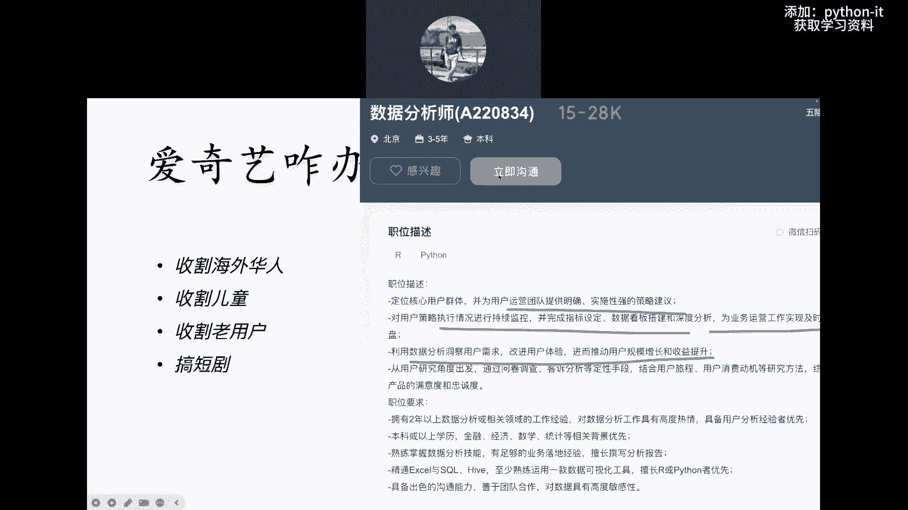

# 基于Python捕捉股市热点股票的量化分析实战！！！！ - P2：02 数字化转型怎么转.mp4 - 菠萝头python - BV17oStYGEv5

这个方向啊肯定它本质上还是属于啊，还是属于i it的啊，属于i it的一个范畴吧，那但是所以我我一讲i it，别人说哎我靠，你这个你这个又在忽悠大家学i it是吧，IP已经他妈49年进国军了是吧。

你现在还在这割韭菜啊，嘿你们有没有嘿嘿嘿嘿，你们有没有这样的质疑的哈，有的话也给我打个一好吗，有的话打个一咳，快点快点啊，跟老师交互起来啊好吗，嗯我先讲一个点，确实啊我操都打了一呃。

首先第一个确实在现在IT啊，非常非常多的方向已经很难就业啊，其实啊尤其是从去年开始啊，你像那些啊去年开始那些叫什么呀，干java的啊，干java的，然后干呃前端的对吧啊，大量的都啊大量的失业啊。

非常的多对吧，包括嗯不光java前端，还有很多其他岗位啊，做测试的对吧，就是呃从去年是不好找工作，到今年就直接有些岗位彻底崩盘掉，比如说像前端在座的同学，你们能不能这样把你们现在的工作打出来啊。

把你们现在工作打出来好吧，我了解一下大家的一个岗位，好吧嗯对今年前端直接崩盘掉，java呀，专科几乎是不可能就业，到现在这个情况，即使你是个二本，你是一个一本啊，二本一本，然后你去找java啊。

那你是本科，你能勉强找到一个工作，但基本上都是外包，工资极低，基本上就是六七千七八千，即便你在一线城市六七千七八千，一个一一个一本的这个啥，你就想想啊，大量干了大量干了好几年java的人。

失业找不到工作，你看这就是天天找我的啊，这是你看之前干了多少钱，之前干到2万8，然后呢他是一个自考的专科啊，对吧啊，专科都是自考的，然后现在现在失业好几个月，找不到工作对吧，有面试啊，这个要工资。

人家都都不给他现在尝试降薪啊，我说你降到20应该能找到，他说他还想22，很难的够呛对吧，来再来看这个，我之前做功能测试啊，功能测试现在失业了好几个月了啊，一直没有找到合适的工作啊，对吧啊。

另外这个你看我是嗯90年的统招专科，上一份工作，前端是20K啊，现在整个失业一整年，你看10月份跟我聊的嘛，整个失业一整年了啊，失业证年了对吧，然后另外再看这个28岁啊，这个学历也不好对吧。

就是呃事业找了四个月的工作，现在做两年java，现在去工厂打螺丝了，全都是这种情况，非常的惨对吧，还有这个失业第七个月啊，这个是做做什么的，做做做做这个应该也是做测试的啊，我记得好吧。

所以所以我我拿出来这些，不是给大家贩卖焦虑啊，我我只是想说明一个现象呃，就是呃i it非常多的岗位，出来一个这样的一个情况，甚至有一些你你你你干了几年的对吧，找失业，然后你降薪降个三四十%。

都都之前2万，你现在降到1万多都不一定能找到，那我们就来讲一个点本质的原因到底是什么，有没有同学知道就是为什么大家都失业了，到底本质的原因是什么啊，嗯我这么讲，其实原因大家都知道。

但又不知道知道的是什么呢，知道的就是说呃跟掌握性有关系，知道的就是说i it互联网饱和了对吧，所以饱和了嘛就不需要那么多岗位，但是不知道的是什么呢，它不是技术不够牛逼，也不是真正的啊叫彻底饱和了。

而是说它进入了一个新的阶段，它进入了一个什么新的阶段，就是IT互联网整个科技方向，从之前的大基建时期，大基建走向了存量市场的运营阶段呃，运营竞争阶段，什么叫大基建，就之前大家想一想，你看抖音对吧。

这个微信到现在已经十二十三年了，微信微信应该十三四年了，然后抖音到现在已经有快8年了，都7年了，抖音7年了啊，然后就是就是就是呃，现在最新包括拼多多都已经89年了。

就现在这两三年你看到过什么新的APP吗，没有新的APP，没有新的爆火的app，所有你能想到的领域全都有人在做了，全都有公司在做对吧，所以那个也就是说那个基础建设，你想做社交，你想看短视频。

你想玩游戏全都有了对吧，就那个我管它叫基础建设的阶段，就全部完成了啊，所以整个你也看到的一个数据是什么啊，数据就是嗯，整个移动互联网的用户增长已经停滞了，这个是23年的啊，这个这个这个这个这个嗯就是啊。

月度活跃用户嘛，就是每个月啊，上就就就移用移动互联网的这个用户量，你看全年下来整个23年全年增长了2%，什么概念，兄弟对吧，就横在这个12亿这里就结12个亿，这里就结束了，就没有增长了对吧。

就就就就就全中国14亿人，12亿都已经用用了，还想怎么着是吧，剩下的都是老花眼的和小孩了，特别小的小孩了对吧，所以就是彻底饱和啊，所以在这种情况下量化刚才讲完了嗯啊，所以在这种情况下进入一个相当于额。

就是就是这就导致一些超级APP，像美团呀，像抖音啊，像微信呀，像字节，而不是像像类似这种，他们没有新用户增长了，那所以大家就都进入了一个叫什么存量的，精细化精细化运营，你像前几年的时候对吧。

那个抖音还在高速发展的时候，他获取新用户，就是因为我是21年就开始做抖音，21年的时候做抖音的时候还非常好做对吧，我从抖音上获客其实是很容易的啊，其实很容易的对，但是现在对吧。

因为那个时候抖音获客也很容易，因为抖音处在爆发期，抖音直播是吧啊，那个时候你在直播间想卖个几千块钱的课，很容易卖得懂，这非常容易卖得多是吧，这这直播俩小时我能卖几10万啊，真的是这样对吧呵。

当时我就指望那一波我就财富自由了啊对吧，但是呢你看你现在你现在你24年，你在想抖音上啊，想大量的获取用户啊，想买想想卖个几千块钱的课，第一卖几千块的课，块钱的课非常难，第二你要付出高昂高昂的投流成本。

就你要投非常多的广告费才有可能拿到用户啊，因为抖音对吧，他他他他他他他他他他用户不增长了，那他他他他怎么想挣钱，他想收入增长对吧，你想他想收入增长，你想在上面做广告，你得多出钱，就是这样好吧。

所以整个全都进入了一个存量竞争的一个时代，所以我们再来看一个例子啊，在这对我就问他一个问题啊，当在这种存量竞争的状况下，谁能解决公司，解决公司的业务增长问题啊对吧，举个例子就是就是就是呃。

每年反正你就那天用户量对吧，那用户量，那你用户买了你的产品，你还重复收割它，你怎么重复收割呀，是吧啊，好的产品就是一次性的，没法重复收割，但是但是公司必须增长，你不增长不行啊，你不增长。

大家指望着涨工资呢对吧，你不增长，你你你说你还想上市，你投资人的要求你怎么完成，就是这样啊，但是又没有新用户，所以你怎么办，我们举个例子，拿一个典型的产品，大家谁有爱奇艺的会员，有的话打个一没有打个零。

拿个简单例子，快点come on，有的打个一没有的打个零好吗啊，有有你看啊，大部分同学都没有啊，有个别同学有啊哈来我问大家一个问题来看，咱们就拿爱奇艺这个举例啊，大家看爱奇艺算是国内啊，它和腾讯对吧。

它是国内呃，呃怎么讲，就是就是这个叫叫叫叫叫用户量最多的，它比腾讯还多一点，那它的月活是3。94亿啊，月活3。94，这是它的用户啊，大家知道月活吧，月活就是你每个月，至少有这个用户登录过一次啊。

这就叫月活好吧，那3。94亿已经非常高了，但是这不是它的会员数啊，他的会员数是多少呢，爱奇艺指望什么挣钱，爱奇艺主要挣钱就两块，一个靠会员，一个靠广告，是不是啊啊一个客户会员靠广告，OK来大家看一下啊。

爱奇艺的会员呢在23年的时候，最高峰的时候是1。29个亿啊，1。29个亿的会员相当于嗯四个亿，我看一下四个亿的日活啊，二十五百%分啊，百sorry不知道百分之auto呃，这个这个这个这个30%多对吧。

30%多都是他的会员，已经做得非常牛逼了啊，所以一旦他就见顶了好吧，那但是呢由于这个之前那个狂飙电视对吧，呃火过之后，后来那个热度下来对吧，他的会员数又降到一个亿啊。

就狂飙一个电视剧给他带来2000多万是吧，会员啊，他现在降到一个亿，那降到一个亿啧，降到一个亿之后，那但那那影响的就是它营收啊，营收不行，他妈股票大大跌跌对吧，投资人不满意，所以它必须增长对吧。

那怎么办，那怎么办啊，你现在是爱奇艺的老板，你怎么解决这个问题，你告诉我啊，你们说对吧，你怎么把这个，你怎么把这个用户量再给他搞上去，有人知道吗，嗯想一想好，给大家看一下啊，他的就这么几个问题是吧。

现在有四个亿的用户啊，会员只有一个亿，那你就要思考对吧，用户为什么不定义啊，用户为什么不增长啊，用户怎么才能增长啊，如何让会员接受广告是吧，更多的广告让会员也接受广告，因为你还挣广告费呢，对吧啊。

你高价会员有没有可能什么样啊，降低画质，嘿哎我这个我这个鼻子有点什么，稍等一下啊，哎嘿你们净出这损招了，还有别的吗，嘿嘿，嗯吸引好看的电视剧入驻平台是这样，好看的电视剧他肯定是想赶的，呃，想想做的。

但是好看的电视剧这种内容呃的生产啊，不是他能决定的对吧，他只能到市场上去买，并且好的内容大家都抢，腾讯也抢，价格非常昂贵是吧啊，这个还用别的招嗯，反一波爬虫，嘿反一波爬虫啊。

这个用算法看用户平均看什么是广告啊，对对对，非常好，版权开放给用户，那直接倒闭了，嘿嘿好吧，我觉得哎我觉得有非常多的方法吧，但是呢呃但是其中有一个方法啊，因为你你要提高整体营收嘛。

但是你的会员量如果又上不去啊，可能但是所以呢爱奇艺用了一个最蠢的方法，这个最蠢的方法是什么，涨价对吧啊，涨价就给这个会员把价格涨上去啊，你知道吗，这个他之前的他他他一呃，我不知道你们买的价格是多少。

它最高峰的时候价格涨到好像快200块钱，就一年200多啊，一年200多呃，所以他短暂他的营收上去了，但是导致一个问题啊，他的订阅会员急速下降啊，因为你太贵了嘛对吧，你快太贵了，所以这叫杀鸡取卵嘛。

是不是对吧，那所以呢这个呃导致过了一段时间，它又降下来了啊，你现在这个会员又降成了148，是不是啊，哦还得连续包年对吧，你看次年续费238，是不是，你还得连续包年，你看那非非非非非常蠢。

来给大家看一下啊，他嗯呃呃这个这个这个这个呃，尽管它不断的调高会员费，但是订阅会员数大幅下滑是吧啊，然后最终导致它的营收对吧，一收入下跌啊，下跌十百%分之什么，这10%就是五个亿是吧啊。

10%就五个亿啊，就这么个情况好吧啊，所以呢这个只是一个从大面上来讲，他们爱奇艺现在遇到一个困境，所以呢我们因为时间有限，只能在简单讨论啊，啊但是总之呢就这个事情到底谁能解决，到底谁来解决啊。

公司里是谁来负责解决这些事情，你们觉得是谁啊，是老板在那里唉，想招吗，天天的，嗯有人知道吗，对这个事情的解决，我告诉你啊，就是呃呃策划呃也是吧，就是靠公司各种负责，就各种的运营啊，和啊产品经理啊。

和什么人员呢，和数据分析与挖掘人员，所以大家来看到一个点啊，就使了各种招，爱奇艺没招了是吧，所以他解决的方法是什么，来嘿嘿在在网上招数据分析的师，这是真的啊，这个如果你监控他的数据的话。

之前他们没有招那么多，他们很多的啊，这个操作真的就是拍脑袋，你们不要觉得一个那么大的公司啊，他的决策就多么的专业，不是的对吧，那他如果决策那么多那么大，那么专业他为什么把会员涨上去又降下来。

就是因为他觉得他把会员涨上去，用户能承受是吧，营收就增长了对吧啊，反正这个用户量不太涨，好涨了嘛，就会员数量对吧，已经到顶了，那我就涨价嘛是吧，结果大家都不陪他玩了，是不是啊，那我就去进去腾讯视频。

去优酷，对不对啊，所以他最后没办法，他看到他用户流失了又降下来，所以本质上这个策略肯定是失败的，是不是啊，那一定是呃他们内部所谓的运营团队，或者是策划，或者是产品经理，或者是对吧，运营总监啊。

这个老板啊没有深入的去分析啊，去挖掘对吧，直接就讨论讨论对吧，拍脑袋就决定了，就是这样，我是开公司的是吧，那我非常知道，你比表面上很多高大上的公司背后，他的决策逻辑很多时候就是拍脑袋，对不对啊。

所以你看现在就是他们开始追求啊科学决策，然后呢啊这个这个这个爱奇艺招人对吧，这是这是干嘛的，监测海外渠道看到没广告效果啊，并且呢这个呃这个这个啊，就是就是对数据做分析，做各种报表的输出啊。

然后接下来再来看海外运营是吧啊，海外运营嘿对招，海外运营人员啊。

对数据敏感啊，要有基础的分析能力，因为这个是个运营岗啊，刚才那是一个数据分析岗啊，然后接下来再来看这个，他还在招国内的啊，叫什么呀，负责动漫儿童产品线的数据分析和策略，决策动漫儿童啊。

所以呢还要再招这个啊对吧，叫叫叫叫什么啊，我为用户运营团队提供明确，实施性强的策略建议对吧，对用户策略进行持续的监控，完成指标设定啊，数据看板搭建深度分析啊，然后呢从而这个啊利用数据分析洞察用户需求。

改进用户体验对吧，推动用户规模的增长和收益提升啊，需要你会啊，circle have excel对吧，当然你看你要是会Python或R的话，会优先Python都变成那个高级语言，你很多做数据分析的呃。

运营的都不会编程的啊，你会这个东西都都都都都都算非常高的加分项，虽然Python对我们程序员来讲很简单，但对数据运营人员来讲嗯，不是的，所以兄弟们我们通过这几个点啊，包括还有他还很多岗位。

我觉得他至少在干三件事，第一个呢嗯收割海外华人对吧啊，他们在收割海外华人啊，去因为国内不增长了嘛，所以他就搞国外，第二收割儿童啊，我觉得这个招很好对吧，第呃我我我先说一个啊，收割海外华人，这个招也很好。

为什么海外华人都有钱，大部分都有钱是吧啊，你要去看那个那美剧NETFX的话很贵啊，NETFX那个会员很贵对吧，看那个爱奇艺就可以很便宜是吧，哎那好多人100来块钱就不是事儿是吧，换成美元。

那么20美元对吧，无所谓，这是一个点，另外一个点是收割儿童，兄弟们，如果你们家有孩子，你就要知道小孩在电视上或哪里，去看这种儿童的什么呃，这个叫叫小猪佩奇呀，呃类似这种呃这种这种儿童电视剧。

父母非常舍得给孩子花钱，就你自己看个电视，你可能舍不得对吧，但是你要是给孩子，那就是非常舍得啊，对收割儿童，这是一大批啊，这个是啥，然后收割老用户啊，老用户就是什么呢，你自己看吧对吧。

就是嘿怎么去怎么去推动，怎么去，怎么去这个这个这个这个这个洞察用户需求嘛，就得想办法把这个老用户让老用户再续费，是吧啊，甚至它进行老用户的这个分层对吧，他现在这个会员都是大概率。

不是大部分都只是什么月卡季卡，他有没有能搞出来什么黄金卡对吧，黄金卡有什么特殊权益对吧，可能分成那么几百块钱的，上千的这种卡是真的，我告诉你要思考一件事情，中国有非常多的有钱人，非常多的有钱人。

富二代啊或者什么的，他们嗯就是他们明明能掏出来1000块，你收他100是吧，你收他100这个事儿你就浪费对吧啊，所以这个这个也可以，嘿嘿然后另外一点呢就是搞短句是吧，大家知道啊。

这个爱奇艺现在也开始搞短剧，因为他买去外面买这种电视，买这个，你像现在前段时间火的那个边水往事对吧啊，狂飙他们都他们他要买一个版权，要花很多很多钱啊，但是没有好的内容又吸引不了用户，所以他就咬着牙买。

但是现在他他开始搞短剧，因为学抖音对吧啊，所以短句这块也是啊，这个这个这个啥，那如果要搞短句，就更用到数据分析了，因为短句很多都是这样的，我拍一些啊，如果呢用户喜欢我就持续拍，用户不喜欢我他妈就停了啊。

所以你要对数据的运营和分析啊，就更加的而不只是一更加的呃敏感和实时，而不只是一个普通的嗯，普通的运营人员能搞得定的，他必须借助技术啊，并借助技术，因为呃我们说的爱奇艺或什么，它都是大平台。

它不它它的用户量很大，它不是它不是只有个几10万用户，他又他妈上亿几千万的用户，这种用户的行为，这种用户的啥你不能当，只是统计个结果，用excel统计个结果说啊我我有多少用户买了会员，这个太low了。

不是不是不能叫low，它解决不了问题，你要拿到他使用你们APP，或者使用你们呃网站的每一步的细节，那必须借助编程，必须懂数据挖掘，必须懂统计对吧啊这个这个这个嘿对，这就像你你算加减乘除。

小学生可以干对吧，你算微积分，那必须是大学生，那不一样，好吧好吧啊，所以呢这个对哦哦哦刚才已经呃算了。

对这个对吧，现在这个大家看到看过这个短句吗，嘿嘿这个段你老牛逼了，我在长征路上开超市，一部短剧十个亿牛逼吧，但他是抖音上的，可惜是吧，不是爱奇艺的，哼所以爱奇艺现在眼红了对吧，人家抖音上一个小短剧。

一个小短句顶你爱奇艺对吧，呃这个这个这个一个季度的营收，一个季度的营收，这是一个短句，你想想疯狂吧。

嗯可以啊，OK反正这个这就是一个典型的。

我给大家讲了一个数据挖掘的一个例子啊，还有这种啊，大家有人看过吗，好了，然后除了爱奇艺之外，各种美团，大家知道现在美团的呃数据挖掘的人有多少吗，数据挖掘人有多少吧，就数据中台，他有个数据中台。

有人知道有多少员工吗，美团的光程序员就已经过万了，光程序员就已经过万了啊，来大家知道他的数据分析团队现在有多少人吗，有没有人知道快点猜一下嘛，因为我一个朋友是在美团干这个啊，他能拿的这外面都不知道的。

他他他他们知道，有没有人知道，快点猜一个，随便猜一个嗯，Come on come on，疯了吧，桑尼嘿嘿嘿，比程序员还多是吧啊嗯啊什么意思，我这里写了这条数据，那应该现在比800人少啊。

他25年才规划到800人，对他们现在整个数据中台的团队就一般人，一个一个，我告诉你，我都很惊讶，所以美团对我就感觉，美团好像真的是不重视对吧，就是就是他才100个人，Oh my god，你想啊。

美团光起手就有几百万，他有几百万的骑手，你知道吧，就是这些路径规划也好，这种策略这个对吧，给给给给各种行为，各种的行，不光过就是反正从每从这个外卖送货，送吃的到商家打折就卧槽太多。

细节地方竟然就只有100个人啊，但是他现在也开始规划了啊，需要到25年，整个规划到要招到800人的一个规模啊，800人规模，然后呢，但是国内其实做的比较好的，大家知道做数据比较好的有两家公司啊。

知道哪两家公司吗，哪哪两家公司吗，做数据运营的有人知道吗，随便猜，come on啊，非常好啊，一个是字节，一个是京东OK吗，字节呃啊字节非常好，我不知道他有多少人，因为字节的数据保密很严格。

但是你就看字节真的是在直播做在什么上，我靠我们看他的后台数据特别牛逼，那真的是实时大数据非常牛逼啊，所以他那个数据团队已经很强大啊，另外一个京东京东华为100度都不行啊，那都很垃圾好吧。

他们的数据团队都很差啊，这个呃京东京东光这个啊，京东光这个数据运营人员有2000多个，2000多个数据数据分析师，2000多个比他们美团高两二十倍，所以你就想想啊，所以你你看现在美团大量的在招。

数据分析师对吧，这个工资啊基本上都给的啊，不算低啊，基本上初级经验的，对不对啊，高级经验的啊，嗯都给的很高啊，给的很高，本科学历就可以看啊，这个啊另外呃你你你你点进去看一个，随便看一个啊，嗯这个是什么。

大家看一下这个基地啊，我讲就讲讲的非常好，叫以增长黑客的理念，什么叫增长黑客对吧，就是通过通过技术手段对吧，暴利增长，就是你举例举个例子，裂变之前那个疯狂的裂变，你就可以叫黑客增长好吧。

那他让你基于黑客增长的理念，然后对业务增长，运营场景进行分析拆解，结合业务增长的运营需求啊，这个大家看着字好像绕啊，但但其实你思考结合业务增长的运营需求，建立增长的分析模型及站内外数据的能力。

OK通过场景分析数据能力，赋能支持业务解决经营难题，看到没有解决经营难题，以数据驱动增长，连美团呀这么巨大的公司都说这样的话了对吧，数据驱动增长对吧，推动公司站内注意了，推动公司站内用户数据能力的建设。

他为什么要推动啊，就是因为现在公司没有呗，一个美团那么偌大的公司对吧，没有完整的用户数据体系对吧啊，实现跨业务的数据融合是吧，美团的外卖啊，和这个呃就可能不同的业务线，是这个数据是没打通的对吧啊。

然后呃这个这个嗯通过从公司整体层面，更加全面地理解用户啊，这估计王兴啊都不知道他的用户是干嘛的了哈，然后然后然后然后帮助业务，更好的进行用户分层，看到没，他都他开始做用户分层是吧啊，你针对我跟你讲。

你针对那种有钱的用户和和没钱的用户，他妈订外卖给他大，给他推的这个外卖，比如说每天中午我点餐，我就跟你讲，你你给那些穷，你给那些你给那些办公室的白领，一个月挣1万的，你推的可能都是对吧。

十几20块钱的快餐，你给那些卧槽在国贸的对吧啊，或者他的消费能力强的，那你打开全都是高价呀，是不是啊，人家就是这样，这些都是数据，对不对，总之呢以数据赋能业务增长啊，这个就是建立公司的内外的。

内外占的这个数据呃，数据资产目录啊对吧，这个呃就是这样，OK那接下来再来看啊，有人还知道AER海盗模型呢啊接下来看啊。

这是京东的啊，京东的岗位2000多个啊，OK这是美团，然后我们接下来讲，不光是公司在做这个事情啊，不光是公司在推说呃，这个他们基于自己的业务增长需求，这要要要要搞数据分析和挖掘呃。

另外国家成立数据集这个事有人知道吗，知道打个一不知道打个零，国家成立数据集，啊听过的打个一没听过，打个零啊，嗯嗯快点啊，呃我看啊，有一小部分同学听过啊，word还挺多的，我就这么讲，好多人不看新闻啊。

不看什么呀，他可能没太关注啊，OK吗，23年10月25号刚到现在，正好正好一整年是吧，正好一整年，那这个数据集他干的事情是干什么，就是负责啊，负责推进数据基础制度的建设，统筹数据资源整合共享开发利用。

推进数字中国，数字经济，数字社会规划，好多同学觉得太虚了，你给我讲这些虚词对吧，拿一些大词来吓唬我，我告诉你，你知道数据局，数据局的地位，数据局的地位跟国家粮食。

国家土地局是一个级别的。

是一个级别的，然后对吧，这个是这个是新闻，那时候新闻的报道是吧，来给大家看，给大家看啊，20年的时候啊，20年的时候，首次，国家首次把，就是就是把数据作为一种新型生产要素，写入中央文件与土地。

劳动力资本技术，看见没有，五个并列为数额，这个生产要素操他都变成了生产要素，你就想想他妈房地产为什么火卖土地嘛是吧，中国为什么能经历20年的蓬勃发展，劳动力的红利嘛，是不是对吧，加上资本与技术嘛。

对不对，数字经济的规划又写了什么啊，十四五数字经济规划就写的，从顶层上明确了数字经济及其重点领域，好那个重点领域到底是什么，发展什么啊，写了什么一条主线这个东西啊，我们来呃，太太太太什么了。

大概往下看啊，首先第一个，中国的这个数据量占全球10%啊，这个数据价值，数据的价值在于流通和利用对吧，你光放在那没有用啊，我们讲数据是黄金，数据里面有黄金是吧，他是在里面有，不代表你能直接看到对吧。

你去挖掘是不是啊，所以呢这个呃现在啊就是从国家层面上，现在开始做数据流通啊，交易等方面对吧，有一些基本试点，什么叫数据交易所啊，交易怎么数据，交易规模是什么啊，但是这怎么理解这个数据交易，我就举个例子。

你看那个比如说成都机场，成都双流机场啊，这个呃怎么讲呢，就是他每年就那个机场里的这个呃，这个这个航班数据本身就很有价值啊，因为他在成都呃，然后呢呃就是如果啊你能拿到他这个整个全部，全年的所有的航班数据。

细节数据，你其实是比如说一些国外的啊，这个这个这个这个飞机直航，比如说泰国成都是有能到泰国直航的，但是有些地方比如说能不能到到呃，到这个什么呀，美国呀，支行啊对吧，我我我我我如果是一个美国的航空公司。

我要不要在成都建直行啊，那我见不见的逻辑是根据什么对吧，我得拿着数据来看，是不是那这个东西就可以卖对吧，这个东西就可以卖，但是这个东西成都机场啊，双流机车是国家的，由于国家没有在这个方面之前。

有这种交易的逻辑是吧，你是不能卖的，你这种数据一卖，他们把用户数涉及到国家机密对吧，所以什么数据可以被定价，什么可以数据可以交易是吧，啊，这就是数据局把从整体统筹规划的这个事情啊，做数据交易所好吧。

嗯OK好，那接下来呢嗯这个再来看啊，这个是呃今年1月份啊，这个数据要素啊，这个这个数据要素是什么，包括这两天股市火对吧，有一个数据要素概念啊，啊这个睡觉时有一个3年行动计划是什么呢。

就是国家搞了一个202426年的啊，3年数据规划，就是从选取了12个行业啊，推动数据要素的程序乘数效应，那都什么玩意，你那政府发的文都非常需要对吧，但是本质上呢你看啊。

其实就是呢在这十几个领域里做试点对吧，怎么能通过数字化啊，促进这个行业的发展来来比，举个例子，这个乘数要素啊啊就是就是就是来，比如说这12个行业，我随便看了一个啊，比如说工业制造对吧。

它就支持工业制造类的企业融合设计，仿真实验数据的验证啊，这个这个这个这个干嘛呢，支持这些东西干嘛呢，支持这些东西进行整，就是支持它整合设计生产运行数据啊，这个提升干嘛呢，提升它的可提升它的预测性。

维护和增值服务等能力，实现价值链的延伸，大家理解这句话吗，理解打个一不理解，打个零，这个太虚了，听着都睡觉是吧，这个本质上就跟我刚才说的，成都双流机场一个逻辑，就是你的非常多的生产数据对吧。

你在你公司内部，在你企业内部，它只是沉淀下来，他可能就啊就就放在那了，他不会产生价值，但是这些东西是可以交易的，可以卖出去的对吧，你只要把数据脱敏啊，比如说你们公司是做一个做一个做一个制。

做一做一个啊生产型的企业对吧，生产这个呃生产一个呃小型家电的或什么的，那你这个过程中的各种数据对吧，你把它提炼出来，把它脱敏，有其他工厂就可有可能去买，有可能卖，你就放到交易所去卖。

你就可以价值链的延伸啊，这个东西就就就就表达这个意思，包括农业数据对吧啊，包括什么物流数据，包括全都是OK好，这个都是呃从国家层面来干的事啊，然后再来看哦，那这里已经有了对吧，所以呃因为因为我跟你讲。

大家一定要明白一个事，就是中国在非常多的领域都是政策驱动呢啊，什么叫政策驱动，就是就是很多领域的发展都是政策驱动，比如说我们这几年比较火的网络安全是吧，是因为国家重视安全，国家觉得要打仗了是吧。

国际形势不好，所以重视安全对吧，包括那个神啥，大家知道贵州有一个大数据吧，贵州大数据，贵州为什么有大数据对吧，因为国家国家支持大数据啊对吧，国家在搞什么东数西算呀对吧，这是国家政策。

那搞国家政策对搞搞这个什么东数西算，是不是啊，哎那你贵州啊，青海啊，呃呃一些地方就会受益对吧，他的他的他的那个啥啊，包括包括这个哼，还有这个节前的这个股市，大家也知道的对吧，支付宝对账3709元。

就是国家一发文，股市就暴涨，国家不发文了就完了，你看啊，所以呢呃由于由于国家现在开始重视数据资产，当然国家也不是也不是，也不是无厘头的这种重重视啊，而是而是肯定有高人在上面看到了这些大趋势，对吧啊。

所以呢就就就就开始呃开始这个对吧，这就后面衍生的那动作就出来了啊，大家看这个是呃就就就各个平台分析嘛，说现在呃这个数字中国嘛啊，不只是不只是存储数据存储啊，这个呃搞的这些数据，而是把数据用起来对吧。

你光把光把数据存下来了，你没有用啊，你肯定是你肯定是要分析出来东西，释放数据产生生产力，也就是说你要把数据里的黄金找出来是吧啊，这个呃对，然后我国的数据分析人才缺口非常大。

整个十四五期间缺2000万左右啊，但是呢这个2000万我我不知道他怎么算的啊，反正是北京大学的呵，然后但是实际上我国的人才培养能力非常少，因为国内也就是大家都打出来你们的专业行吗。

打出你们专业就是整个国内呃能直接毕业，做数据分析的，能直接毕业的学员就就只有统计学的，只有统计学的人，就没有其他专业对吧啊，所以统计学，全国搞统计学的专业的只有100多个学校，高校啊。

全国2000多所高校加上专科3000所对吧，这个这个这个这个这个呃，就是就是就是就是只有统计学啊，数据科学这个方向，数据方科学这个专业还是这几年刚有的，好吧啊，反正整个缺口很大，然后另外一点。

你看这个是呃，数字中国发布的就是呃有三类人才啊，有三类人才是企业数字化转型必备的资源，第一个呢就是啊，第一个呢就是利用数据做决策的中高层是吧，这个CTO啊，这个跟你们没关系啊。

第二个呢就是这个利用数据搭建啊，利用数据搭建数据网的专业人才，比如说数据工程师，数据经理，数据挖掘，大数据工程师，好吧啊，然后另外第三个呢就是啊，利用数据解决业务问题的应用人才，比如说财务hr运营。

那其实你们大部分同学如果是从业，更多的是从第二类对吧啊，借助技术，借助技术解决公司的业务问题，好吧啊，解决公司业务问题好，那整个2025年，人才的缺口高达220万啊，整个数据人才的收入高达220万。

这个就是整个数据人才啊，所以呃那我们就再来讲一个事，其实你就想呃现在大把的java啊，程序员啊，各种失业，但是数据分析其实是非常好找工作，你要是本科百分百都能找着工作啊，你要是专科可能工资低一点啊。

你找你做数据运营和基础的也能找着工作啊，就是就是我们的学员做数据分析，卧槽他妈一周能面试十多家，恨不得真的一周面试十多家，你要是学我们也有编程课，编程课一周能练一两家就算不错了。

真的就是就这么个情况好吧，所以所以我们再来讲，就是你你看这种大趋势，那到现在我我天天在抖音上直播，还天天问我说老师我能不能学java，我能不能学，就是就是就是说白了，嘿嘿你你你就就那个阶段已经过去了。

那个阶段过去了对吧，你学行不行呢对吧，你一个本科学JVA肯定能就业呗，但是就是就是不值钱了吗，啊不值钱了，对好吧，所以嗯包括现在你看还有人好多想想转鸿蒙，是吧啊，想转鸿蒙就是我我我这么讲鸿蒙。

我告诉你只是一个短期的机会啊，为什么呢，因为鸿蒙再火，它也不能解决，整个IT的大盘已经进入新阶段的问题是吧啊，他他他这这这这个这个鸿蒙只不过是说来吧，我我所有的呃，我我我我所有的主流app都要适配鸿蒙。

那这个东西它还是存量市场的竞争，没有新玩法，所以兄弟们，你们感觉如果你们之前呃这里面做技术的，你会感觉啊你会觉得今年做java非常难，做前端找不着工作，我告诉你，明年你会觉得更难啊。

明年java程序员测试程序员类似这种就业更难啊，就是这样，好吧嗯好了。

