# 基于Python捕捉股市热点股票的量化分析实战！！！！ - P3：03 数据分析师的职业前景 .mp4 - 菠萝头python - BV17oStYGEv5

大数据分析呀，它不光是一个叫缺人的问题啊，不光是一个缺人的问题，因为有人说你就忽悠吧对吧，你肯定是为了卖我课，你说缺人，你卖哪个说哪个缺，嘿这说的也没错，因为路飞确实是嘿这个搞的都是一些哼嗯。

对那些个那个那个那个我们认为前沿的方向，对来我接下来讲一个点啊，为什么说我我我说数据分析它不只是缺人，另外一个呢它叫管理层前哨啊，数据分析岗位是一个叫哼，管理层的管理者的前哨岗啊，并且没有中年危机啊。

并且没有中年危机，在座的同学，大家打出来你们的年龄行吗，让我看你们都多大了，我充个电手机嗯，你们都多大了，哎呀二十一二十三啊，你们如果20来岁，你可能不会有中年危机，但是只要过了30。

肯定好多人都很焦虑对吧，因为你会担心啊自己对吧，过了35岁被被裁掉，找不着工作啊，很多担心这个问题啊，那我们就来思考啊，我先讲一个点，先说管理层前哨，再说中年危机啊，就是我为什么说呃。

数据分析师管理层前端，你一定要想明白公司的领导，你公司的老板高层他们到底在领导什么，领导在领导什么，他他他他他他就是管管人吗，不是的，领导是要解决核心业务问题的，你解决不了核心业务问题是吧。

你不能带公司，你不不能带着你这个团队呃，实现公司的业绩增长，早晚把你开掉是吧啊，就像刚才那个爱奇艺增长的困境是吧，他不能再拍脑袋了，拍脑袋随便就说往营营收下降了就涨价，这不扯淡吗对吧。

所以因为因为你现在都是线上化运营啊，你的数据量这么大对吧，你这个领导又不会技术对吧，所以呢他就必须依赖数据分析师去给他，对数据做分析和运营和挖掘，那数据分析师对数据做运营做挖掘，根据各种策略对吧。

并且不同行业不同的策略是吧，你是炒股的，有量化各种策略，刚才那位荣老师讲了一大堆哈对吧啊，那那那那那你这个做医疗的呢，是不是啊，你做保险的呢对吧，保险行业给谁给谁给就是车车贷呃。

这个这个这个医疗保险是吧，呃就就就就就各种保险物流保险，那就那就都有不同的模模型的，是不是啊，所以不同行业有不同的模型，那好那你假设你就是爱奇艺的数据分析师是吧，所以你一开始作为数据分支。

那你要给你的老板提供数据啊，分析我跟我们这个用户量怎么就不增长了呢，怎么才能增长呢，有什么方法呢，用户用户在决定购买这个会员的时候对吧，他他他就是他都是因为什么买的呢，哎一开始你大数据分析完之后。

把这个数据报表给到老板，是不是啊，老板来拍板，但你不是傻子啊，因为中间过程这个事儿是你干的，一开始你可能对业务不懂是吧，你可能刚干这个活对吧，你说白了你对整个互联网的运营深度的东西，业务不太了解。

老板让你干嘛，你就干嘛是吧，你不懂技业务，你懂技术啊，老板告诉你，你就可以去删除的数据，但是当你筛的一次次就干的这个事儿，一次次多了，你就知道老板想要什么，你就知道老板为什么要这个东西。

你就知道你给了数据之后，老板根据你的数据又做了什么样的决策，你就能看到整个闭环，等你看的多了，做的多了，你就能摸出来这个规律，规律就是商业的运作逻辑，就是你们公司，你们整个爱奇艺如何获得业务增长的。

核心业务逻辑，OK吧，我说的再直白一点，甚至你足够聪明，你的领导就会变成你的嘴，替你明白吗，因为因为因为因为只要我们认可数据决策，只要你的领导数据认可数据决策，是不是啊，那你分析出来的数据。

你分析出来的数据逻辑就是客观的真理对吧，是这样的吧，啊至少在业务决策层面上，那你的领导就得听你的，所以这样的事干多了对吧啊，就是对吧，你你这个这个这个并且你必须懂业务等，并且懂得多了，不断的深入。

更懂了，你慢慢的就会被优先被提拔，就这个逻辑啊，所以我们认为我们说他为什么更啊，叫管理层钱少，在座的同学有没有做管理的，有做管理的，打个一没做的，打个零行吗，嗯我这么讲，所有的同学。

如果你们是作为程序员，你们做技术的，你想成为管理层，前几年行情好的时候对吧，前几年行情好，各个我他都没做过管理啊，前几年行情好，各个公司在在在在在在在大量的起项目是吧啊，开发各种app。

所以在那种情况下算是程序员最好晋升的，最容易晋升的它的机会，但是即便在那种前景好呃，前几年行情好的时候，你想从一个基础的一线开发成为一个技术主管，你至少差不多也得5年的时间，至少5年，这是行情好的时候。

当现在没有任何新项目了，新的大项目了，全都一步一个萝卜一个坑了，你现在作为一个程序员想晋升一点点，你就熬，你想爬到一个技术主管岗，你可能要花个78年的时间，78年呀，兄弟嘿对吧。

78年从一个到位到到到带几个人的小主管，对吧，那没办法啊，因为对吧，就就就这个守护过去了，但是如果你做数据分析啊，你快的话，两三年真的快的话，两三年慢的话，45年就是你慢，都相当于前几年程序员行情好的。

那个时候的晋升速度，你想想这个不是我危言耸，这这这这东西啊对吧，我的学生那个荣老师的，荣老师的表弟，龙老师的表弟就做数据分析，就一个专科在滴滴一个月30多K带俩人，带俩实习生，实习生211，牛逼吧。

这很神奇，你不相信真的，这这他还是特聘进，就是他特批进去的，因为他专科嘛，他进去滴滴是不要的，特批进去的，因为他业务能力还挺强的，嗯好吧，所以第一容易成为管理层，第二呢我们讲数据。

一会那个让荣老师给你讲讲他的表弟，第二呢数据分析没有中年危机啊，你说啊就别扯淡了，怎么可能没有中年危机，我跟你真没有哈，你说有，我说没有好吧，咱们一定要分析为什么为什么人会有中年危机。

你们说为什么人会有中年危机，有人知道吗，打出来为什么人会有中年危机，你们说嗯对吧，什么人会产生会会有中年危机，什么人兄弟有人知道吗，有人知道吗，嗯我告诉你，不进步不是不进步不是不进步。

我给你不是学习能力下降，不是体力下降，你看你看你们这个事理解上就不够，我告诉你本质是工具人才会有中年危机，什么叫工具人，刚才有个同学说我不进步啊，我告诉你，那如果是这样。

那为什么干了一个月工资已经30K，40K的java程序员或者什么什么程序员吧，失业了找不着工作，为啥他一个月挣3万，他还不进步啊，啊他的技术还差吗，他肯定不差，那为什么还还还还被淘汰呢。

兄弟因为他是个工具人，他只是个工具人，OK工具人你就要接受工具人的命运对吧，你用久了就被就被就太贵了，就把你换掉，程序员大部分做的都是通用技术，通用技术明白吗，标准化的，你做java。

你只要是写的java，你写的你就玩出花来，你就算是玩出花来，也就那些东西对吧，你写个呃项目，你就必须得用面向对象，你就必须得调数据库，你调数据库就必须用那些框架。

o r m hibernate my BIS对吧，你或者是spring boot，Spring cloud，就这些框架都非常标准，非常通用好吧，所以你现在如果已经是呃呃年龄大了35岁，然后工资又很高。

可能3万54万啊，所以呢对吧，你可能觉得哎哟我为了防止被裁员，我再学点新技术，再学个分布式，再学个微服务，哼没有用，你越这样越危险，对你相信我越这样越危险，你们不理解老板的思维，我可知道对吧。

哼哼哼哼老板尤其是在这几年的环境下，老板们都很难是吧，创业不容易，你像我他妈炒股还亏了钱，现在看谁都不爽啊，嘿嘿我们公司的同事都见着我低头，除了荣老师对吧，他他他他他他硬气啊。

这个是就是就是你你你你你技术越牛逼，越危险啊，你这个时候你的老板就会想着说，天天想着说啊，我招一个2万的程序员是吧，他能不能把你干的活干个七成八成，能不能啊是吧，你一个月挣4万，你干的活漂亮一点。

是不是啊，写的代码性能高一点，效率提升一点，没关系，我招一个2万的，能不能达到你70%的水平呢，不能的话，给他三个月的时间让他学，让他看你的代码学，我告诉你百分百能真的啊，百分百能，所以你看把你换掉。

工资直接省2万是不是啊啊，然后你自己到外面啊，你你折腾几个月，你不降薪不降薪，找不到，是不是啊啊这个这个现在就是整个行情，所有的资就是什么呀，资本方叫集体逼你降薪，因为你离开这个公司市场上。

你也得降降才能找到对吧，降个20降到2万多再找工作，就是这样是吧啊，所以所以这些人通用技术的工具人，通用技能的工具人都逃不过中年危机，都逃不过啊，所以呢这个这就是我我我我我我讲，我们我跟我们老学员讲。

我说你们做技术的，学Python的，学go的，你要想办法跟公司的业务结合啊，你们尽量比如说有有没有机会看，去做金融it医疗i it啊，金融it医疗IT呢，为什么他虽然还是呃工具人。

但是他至少跟业务结合的紧密了啊，因为金融行业的业务和医疗行业的业务，比较复杂啊，比较复杂，所以呢这个这个这个它能让它呃，生命周期长一点，但其实本质上也是治标不治本啊，治标不治本。

OK那但是数据分析师可不用数据分析师，他是完全没有中年危机，为什么你们说数据分析师为什么没有中年危机，是因为我想卖客忽悠，你说没有，还是他就真没有对吧，那为什么没有呢，你们想想想想，有人知道吗。

嗯啊经验积累非，这是程序员也经验积累吗，数据分析是因为这样，他是一个高度跟业务结合的岗位，OK吗，就是你们公司业务越复杂，它就越值钱，他就越老越有经验OK吗，并且他对业务的认知是不断深入的。

不是现在人少跟人少没关系，什么意思，兄弟就举个例子，你看啊啧什么东西吃经验是吧，就是就是就是你你这个这个，这个就是你在一个公司干的越久啊，你你你你呃，你比如说我们说在线做在线教育的，我们是做教育的。

兄弟们，我在这个行业干了差不多10年了，快10年了啊，我干了快10年，我中间踩过N多的坑，这种坑都是非标准化的，非常标准化的，这些坑都是花了好多好多钱才学的教训，OK吗，比如说这个。

你你就是像像在今年这么难的情况下，路飞还在增长，我们很多同行都倒闭了，他挺不过这一段，那为什么我能挺过去，就是因为我经历了好几轮的亏损嗯，这好几年都亏好几轮的亏损，增加了我对业务的深入理解能力。

所以我就能根据一些细节对吧，一些趋势判断，哎我他接下来要怎么样怎么样怎么样，所以这就是因为我对业务深刻的认知，我作为公司老板，这得花钱砸出来的对吧，在数据分析师也是一样，你在一家公，你家公司干得越久。

包括你在这个行业干的越久，你就会积累起对这个行业的深刻认知，这个认知它是不可言状的，什么叫不可它，它不是说哎我直接给你对吧，输出成一个文档啊，或者是呃就像写代码一样，它标准的，它不是的。

因为每个公司有每个公司不同的情况，每个行业对吧，你在一个行业干一年和干5年，卧槽，那你对这个行业的理解差着差点差点一个，差着一个太平洋啊，差点一个太平洋啊，所以就是所以就是那你作为数据分析师。

你在一个公司干的越久，你的杠杆能力就越就越强，什么叫杠杆能力，就是你能你你你你能影响的是面，你一开始进入一个公司，可能只干基础的数据分析挖掘，领导只让你能那么统计一下，你比如说你们来我们公司干啊。

你你一开始你进来，你就让你干杂活，这个杂活让你统计说学员的各种对吧，学习数据对吧，这个每天的学习时长，但这些东西不能直接转换成钱，只能适当的优化学习体验而已，但是当你干的越久，越久越久。

你会接触深度的业务，深度业务就是说卧槽公司前方的投放，从前面各个平台的投放到客户进到你们的呃，呃这个这个这个这个啊自己的流量池里，公司的私域里各种转化路径，各种投放广告的消耗对吧，不同的投放的素材。

视频也好，图文也好，影响转化率各种深入的东西，当你慢慢接触这些生的东西之后，卧槽那你就牛逼了，那你就牛逼了，因为很多这种东西的，我跟你讲，你比如说你兄弟们，你们想去在抖音上获客，他不是说来兄弟们。

咱们今天说今这抖音获客，明天夸就可以投广告了，他要建立起你的账户搞素材，然后呢这个去搞账号，或者是找这个其他的主播，不是其他的这个叫什么呃，网红帮你带货，这些东西都一个就整个周期完成，可能一两个月。

这中间很多环节，那你作为数据分析师就可以见证这整个过程，这整个过程完成这个环节，可能已经几10万砸进去了，明白吗，不是每个人都有机会能见证这些过程的，当你建立了见证了这些过程。

看到的每一个环节的数据的流转，一个从外面的大漏斗，一个网红在那直播卖东西是吧，最后客户买了你们东西，引到你们的呃流量池里，然后你们的销售去联系再转化在什么什么什么，卧槽，这整个流程的流转损耗你全搞定了。

你告诉我这种岗位不值钱吗，对吧，这种岗位不值钱吗，所以你当你达到这种程度，你干的久了，你接触这样这种事情之后，你会发现全公司核心的高层都会依赖你对业务，数据的理解和洞察做决策呢对吧，你又懂技术。

你又懂业务，你又懂数据分析方法论，所以他就变成了非常吃经验，所以慢慢你可能就变成了，他们公司的运营副总裁啊，COO对吧啊，首席数据科学家，对吧，所以你所以你就哼就很值钱啊。

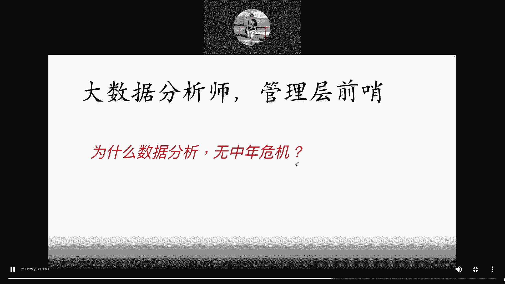

给大家随便看一下啊，嗯你看，这个是一个公司在招数据科学家，资深数据科学家，你不要一听科学家觉得很对吧，很那个啥啊，不是的啊，他是嗯他他他他他他他来，你看这是电商团队的，看到没有，面向电商，电商团队统筹。

负责商家商品用户增长等数据科学方向啊，用数据分析和建模手段推动。

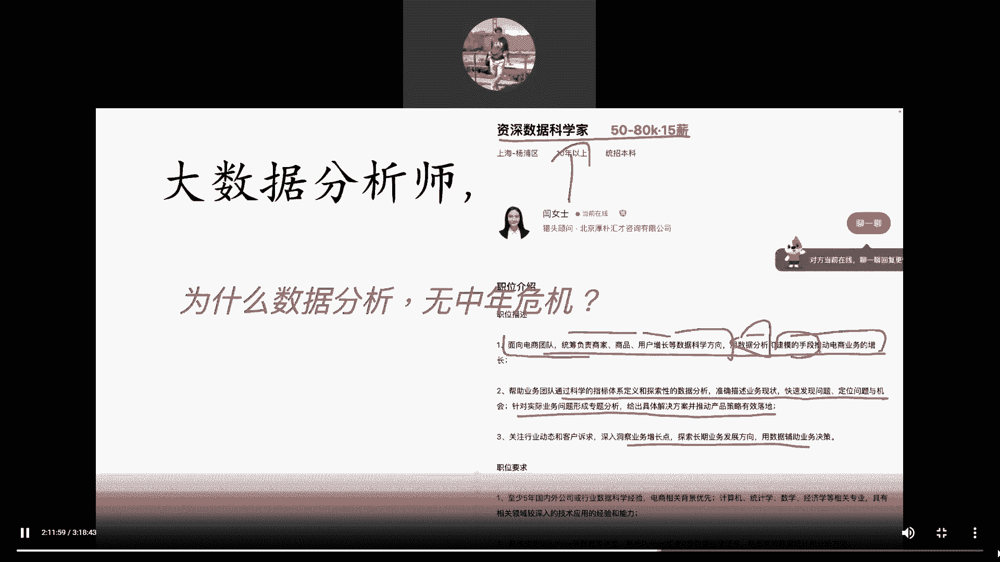

看到没，用数据分析和建模的手段推动电商业务的增长。

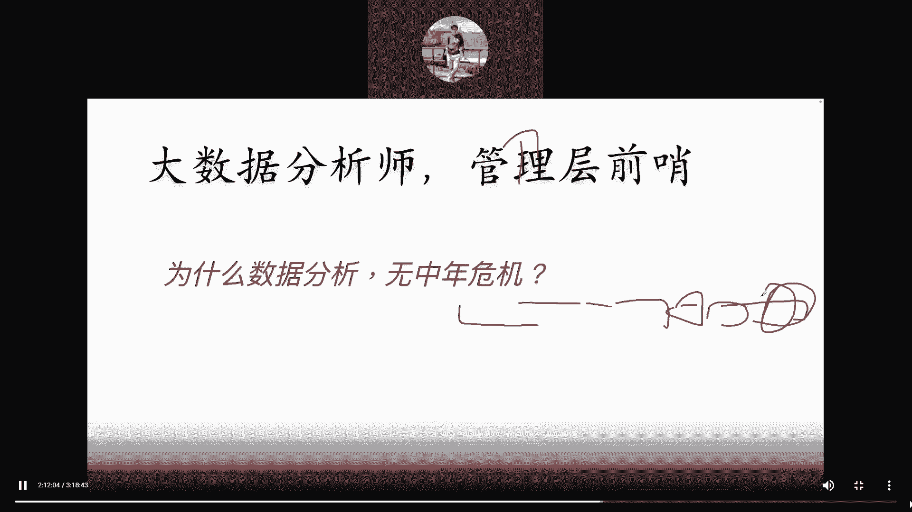

卧槽就让你推动电商业务的增长，这个公司电商业务一年卖十个亿，现在让你推动给他涨两个亿来吧，你给我干吧，兄弟你给我干吧，我就告诉你兄弟，Everybody，你如果能搞定这个事情，你如果能搞定这个事情啊。

你真的是通过你的各种啊调研也好，搞模型也好，我不管你用编程还是用，Whatever，只要是真的是你的策略，让公司营收增长了两个亿，你告诉我你这个岗位应该值多少钱，你告诉我，你告诉我啊，你们说，你们说。

有哪个程序员能干到这种事情，有哪个程序员说卧槽，因为我开发了一个功能，这不是扯淡吗，是不是啊，功能又不是你设计的是吧，你只是你只是你只是把它实现了而已嘛，是不是啊啊你要是能帮公司搞两个亿，我跟你讲。

你的年薪可不止50对吧，你肯定100万以上。

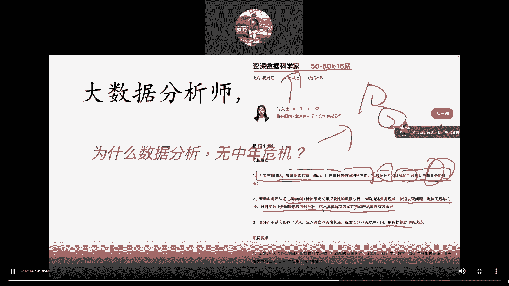

真的100万以上是的，所以兄弟们啊。

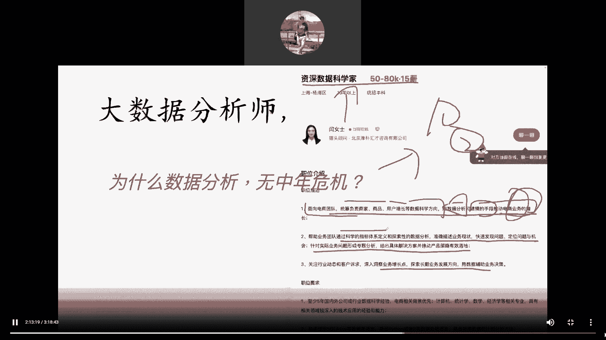

你看帮助公司的，帮助业务团队通过科学的指标体系，科学的指标体系定义和探索数据分析啊，快速发现问题啊，定位问题和对吧，机会啊，这个这个这个这个呃再给出具体的解决方案，听着虚，其实是不是不虚的是吧。

深入洞察业务增长点，看到没有啊。

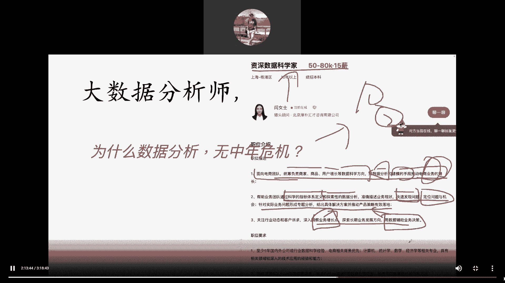

用数据辅助业务决策，哼是不是啊啊来再来看这个，这是字节的负责国际化短视频项目的分析工作。

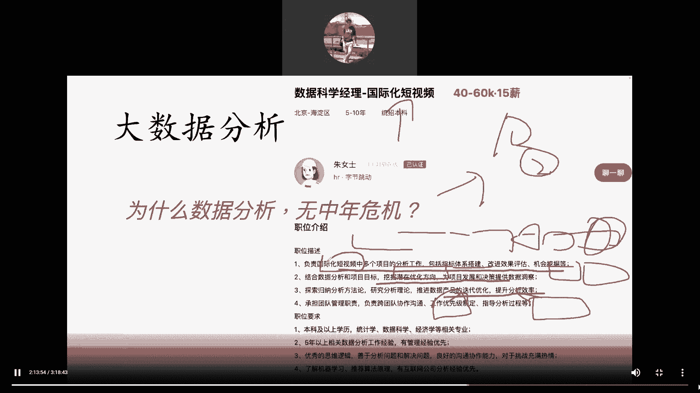

指标体系的搭建是吧啊机会挖掘啊。

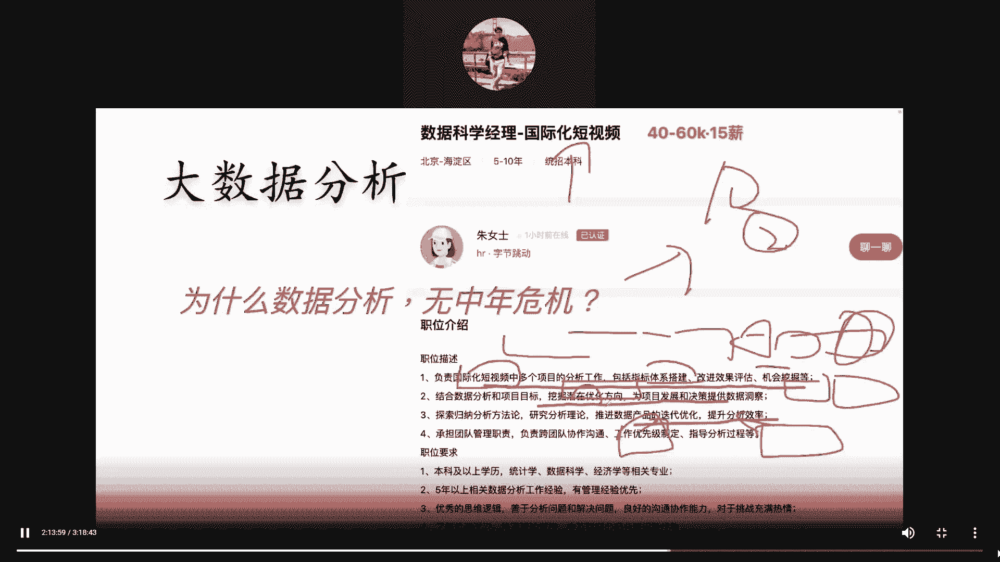

挖掘优化方向对吧。

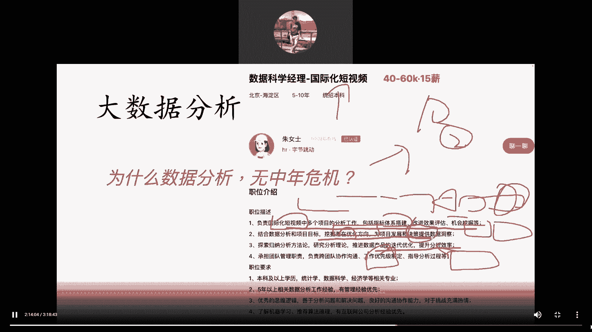

提供数据的洞察对，为决策提供数据洞察是吧。

提升分析效率啊，这这都是啊，你看这个是也是40~60K。

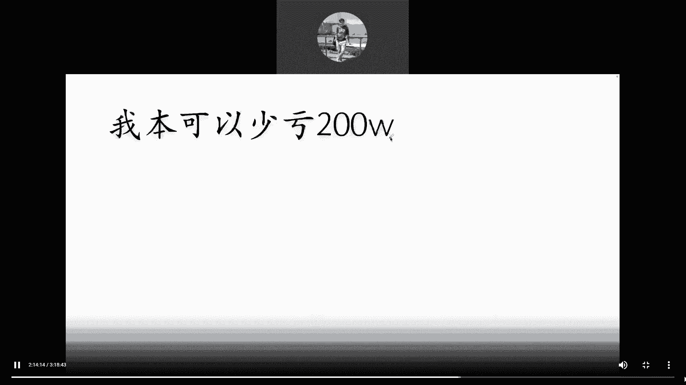

再来看大家看这才多少啊。

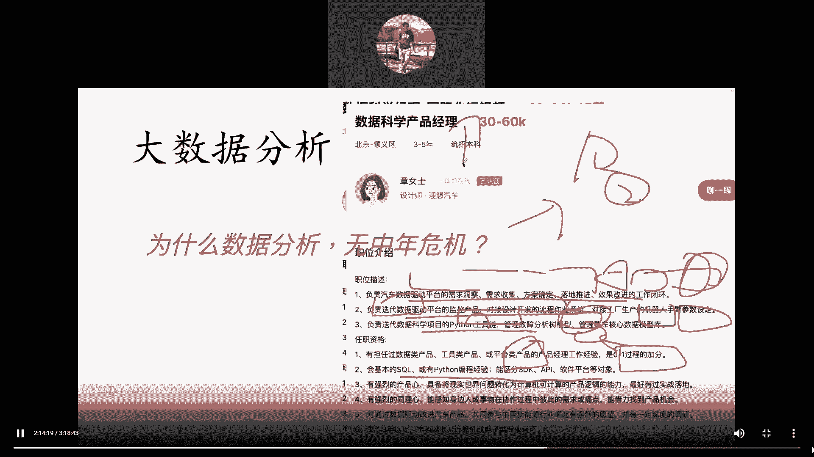

兄弟这才三，你看这个啊，五到10年，这个是不是啊，这才三到5年给你3万到6万。

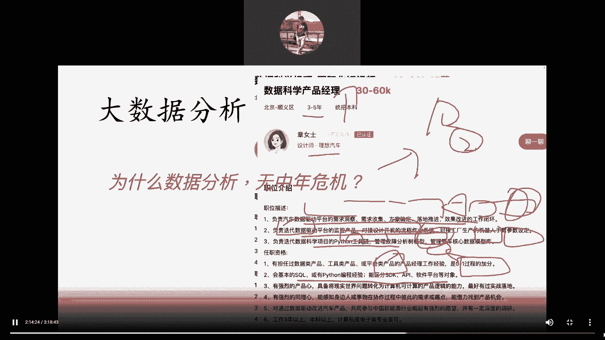

理想汽车是吧，来大家看一下理想汽车啊，在招人，想不想去理想汽车啊。

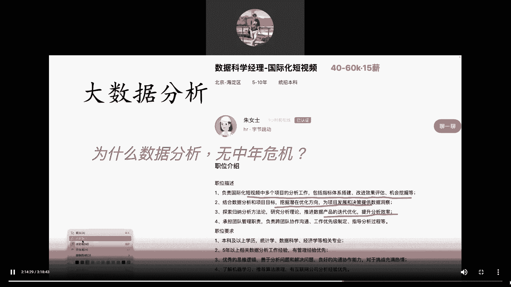

联想汽车很牛逼的，现在理想汽车是我的前老板，知道吗。

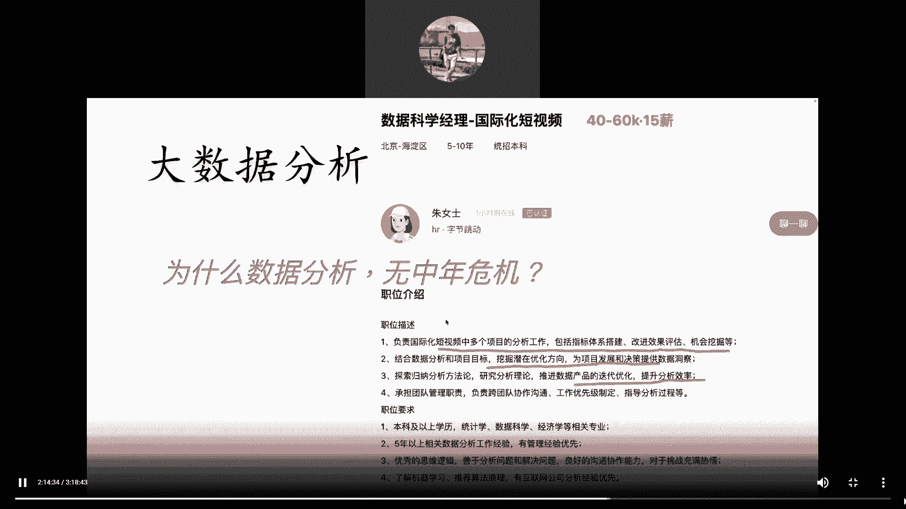

理想是我前老板对钱老板啊，来给大家看嗯，看这个啊，哎稍等理想汽车的，负责汽车数据驱动平台的需求洞察，需求收集方案落地哈，负责迭代数据驱动平台的监控产品啊，数据驱动平台人家都有对吧啊。

这个这个这个什么Python工具店什么的对吧，要求你会Python，会circle，是不是啊，啊呵呵，你看这个要求真那么低，对技术的要求真低，能区分SDKAPI软件平台等对象，oh my god的。

嘿兄弟们，嘿，你要是做程序员去，嘿嘿嘿嘿哼，你要去做程序员这种需求，那么你要只会这些东西，他妈的不可能有面试机会，但是你看啊，所以我们讲数据分析是一个啊，数据分析师是一个技术和业务结合岗。

他要求你会技术，但是你对技术不需要跟程序员一样，那么牛逼对吧，你就用那些工具，Python什么工具库就行了啊，但重点其实是借助技术实现撬动业务增长。

明白我意思吧，好吧。