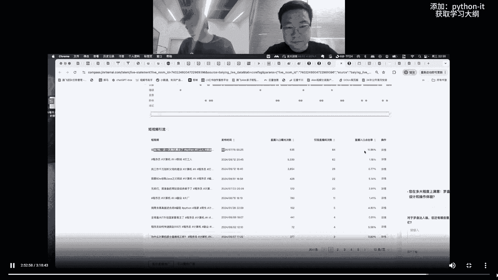
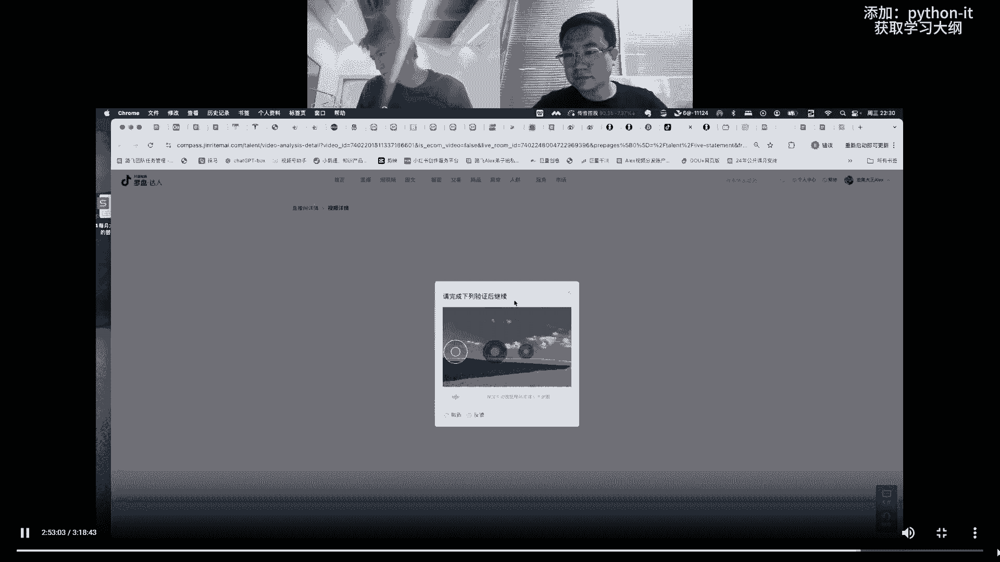
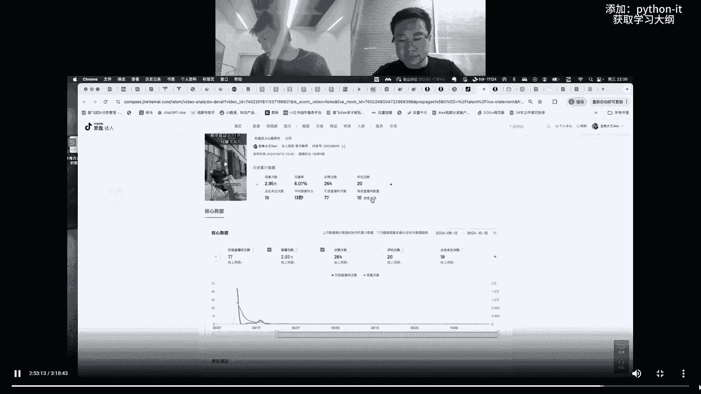
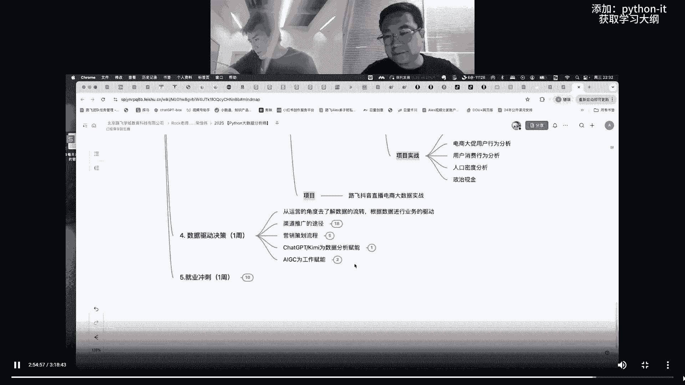

# 基于Python捕捉股市热点股票的量化分析实战！！！！ - P4：04 大数据分析学习大纲.mp4 - 菠萝头python - BV17oStYGEv5

给大家展示啊，这个大纲你看每个展开都有很多内容，看到没有，每个展开对吧，嗯什么阿里的营销模型啊，对不对，就各种各种这个只是基础的理论知识对吧，指标体系是不是啊，就是你点进去都很多啊，包括这个大纲还不够。

还不够细节啊，因为我们还有些东西没往里面填呢，啊没往里面填呢，对啊，另外你看大数据分析实战对吧，这里面会教你数据库教你，当然excel也会教power bi，quick bi对吧。

这些东西都是呃现在常用的一些工具，哎那个翻软胶吗，我们教翻软吗，有人都问，帆软这个里面没有，但是可以叫都一样，他和这个quick bi基本是一致的，对就是发软，他是自己搭建服务器，然后用这一套。

然后quick边是阿里云，把这一套打好明白，你看这里有一个实盘项目，就是路飞多平台获客运营数据实战啊，然后接下来再来看啊，大数据分析啊，用Python做大数据分析啊。

这个呢你看Python的基础就不说了，Python的这些东西不说了啊，Python对吧，数据挖掘的数据分析的三剑客number派对吧，然后我们pandas今天讲课不就用的，应该用的pandas吧。

还my clab这个saber，对不对，然后呢这些东西项目实战对吧，这些常规的，你看这些好多，这都是市场上常规的项目对吧，常规的项目OK电商大促啊，美妆啊，用户消费行为啊。

但是来来看这种叫路飞实盘项目好吗，我们单独列出来了，OK路飞实盘电商大数据实战，我给大家看实盘项目，你就理解什么概念了，兄弟们，好吧嗯来你看啊，这里直播数据好吧，因为我这个账号没有带货，今天没有。

这几天没带货，但是我给您看啊，这啊这是这是之前带货的啊，这是之前带货，找一个吧，之前带货的啊，来兄弟们，比如说我拿一个数据啊，兄弟们，兄弟们，你自己看看到没有，这叫实盘数据。

看到没有，这种数据是是其他培训机构能有的吗，他们连直播能力都没有看到没有，我们有多少人看了，有多少人观看了，有多少人曝光了，有多少人买了对吧，成交了，然后看用户画像，你看这些数据都可以导出来的。

呃你的流量从哪里进来的对吧。

呃这个这个都可以点进去看。

还有所以这些数据我们拿出来，我们到时候会导出来，看到没有，包括短视频的数据，短视频的数据啊，还能看详情对吧啊。

这个就是你看你看你看你看我，所以说我说字节很牛逼嘛对吧。

字节很牛逼嘛啊就这些数据导啊，然后那个包括来看各种渠道，不同渠道来的流量分析分析分析分析这些东西，兄弟们啊，你告诉我市面上哪家机构，包括我们投了多少广告啊，不同广告的素材的转化率，兄弟们。

你拿着这些东西去，去去去找工作，兄弟们啊，那值不值钱呀对吧，你拿这种对好吧，所以这个东西是啊，是这样好吧，OK然后接下来继续嗯这个呃再来看大纲啊，呃来还有数据决策驱动啊，这个数据决策驱动是什么。

你给解释一下数据决策驱动是什么，张老师就是我们数分之后，然后我们从数据中发现了这些秘密，或者说挖掘到了很多的特征啊，比如用户的特征，或者说我们这个商品的特征，资源的特征。

然后呢给他去做一些企业的运营决策啊，或者说一些如果我们是直接负责运营，那就是我我我们直接制定决策去执行，然后如果要说我们是给这个实际运营的人，去提供决策建议，那就是我们去给他把这些内容整理好。

然后建议给他有哪些方案可以做好，来兄弟们，然后接下来呢啊下面有很多东西，我们还会给你讲ChatGPT啊，怎么跟数据分析结合对吧，你你你这个能给你提效就提效对吧。

