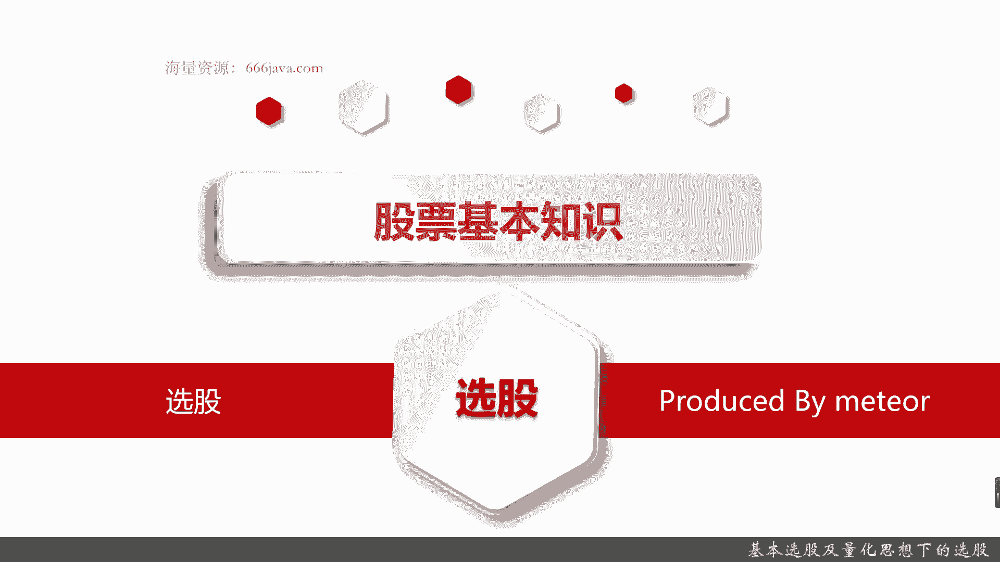
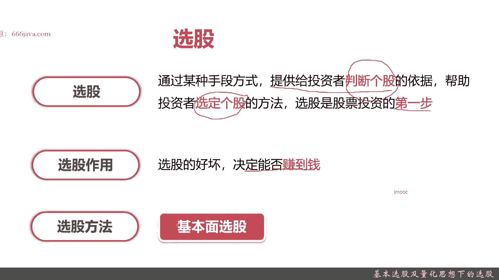
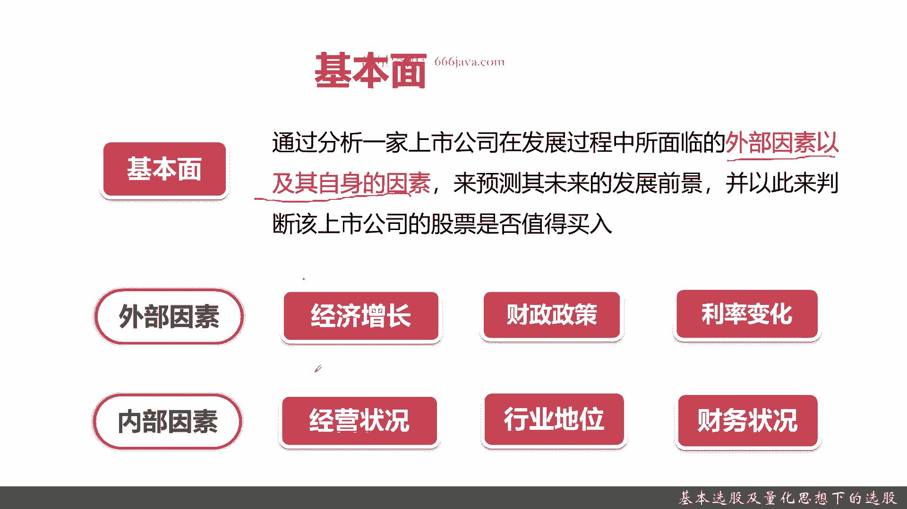
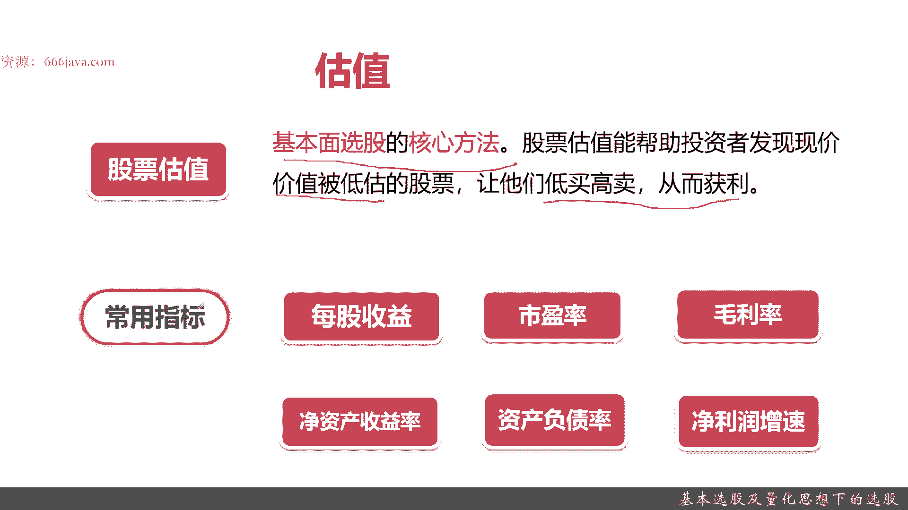
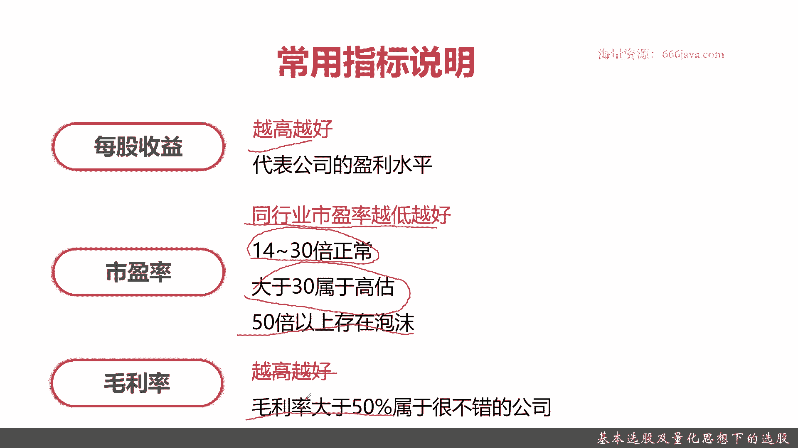
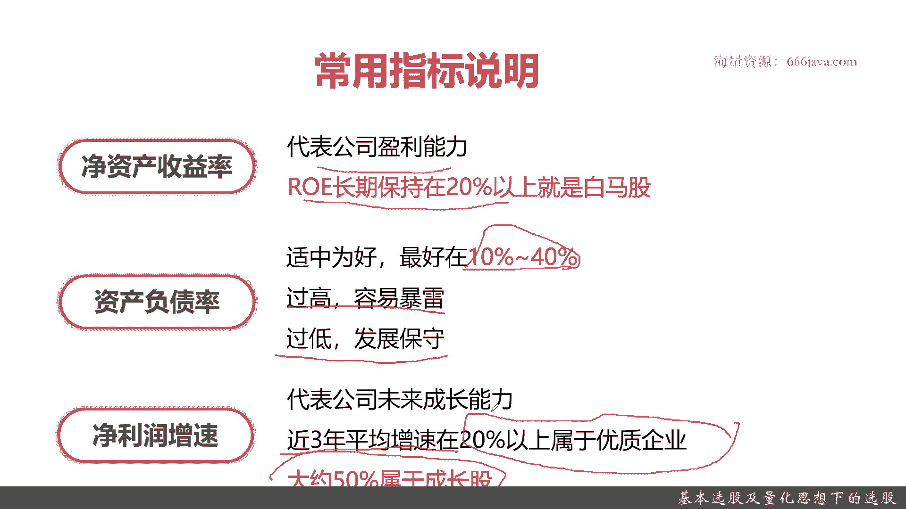
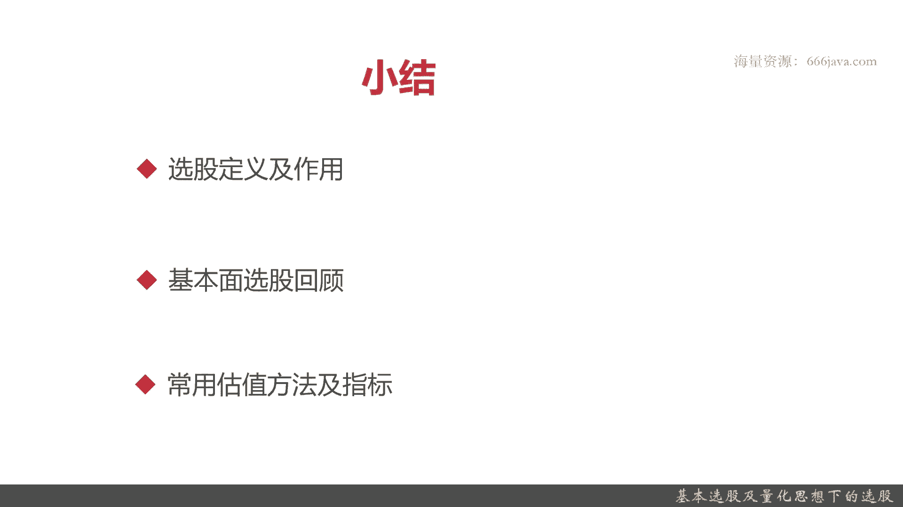

# 基于Python的股票分析与量化交易入门到实践 - P13：3.6 进军量化交易开发第一课-基本的股票交易维度和概念_基本选股及量化思想下的选股 - 纸飞机旅行家 - BV1rESFYeEuA

大家好，我是米TIA，在上一节呢，我给大家介绍了股票交易的基本知识，那么从本节开始呢，我们就开始给大家介绍，量化交易在股票交易这里相关的一些应用。

那首先呢我们先给大家介绍一下选股，介绍选股呢先给大家介绍选股的一些定义，还有它的一些基本作用，接着呢给大家介绍一下常见的选股的方法，就是基本面选股，再接着呢给大家介绍一下。

基本本选股里面最重要的估值的方法，和相关常见运用的一些指标，那本节呢其实就会涉及到一些量化交易的，基本的概念和应用，这样呢就可以让大家了解，量化交易到底是怎么一个量化，量化思想怎么体现在选股里面好。

接下来呢先给大家介绍一下选股的定义，选股呢其实就是通过某种手段方式，其实是一种量化或者指标的技术手段，提供给投资者判断个股，注意是个股，A股一共4000多只，这里主要要细化到个股的一个依据。

帮助投资者选定个股的方法，选股是股票投资，也就是量化投资的第一步，非常非常重要的一步选股，然后选股的作用呢，选股的好坏直接决定你是否能赚到钱，如果你选的这个股票，这一支股票或者和这几只股票一直在亏钱。

那你无论怎么操作，你都赚不到钱，所以选股的好坏直接决定你是否能赚到钱，那么选股常用的哪些方法呢，好就是我们之前刚才给大家提到的基本面选股。

那么接下来呢我将向大家介绍一下基本面选股，首先呢给大家介绍一下基本面的定义，基本面其实就是要分析上市公司在发展过程中，面临的重要外部因素和它的自身的因素，然后呢。

目标是可以预测到这家公司的未来的发展前景，从而可以判断这家公司的股票是否值得购买，那好，那么接下来呢我们给大家分析一下，什么是外部因素，以及什么是自身因素，外部因素包括经济增长，大家应该还记得。

之前给大家说到的六个影响股价的因素，这里面很重要的一个就是经济因素，其实经济增长，那它就能影响这家股票的基本面，接着是财政因素，整体的宏观的财政政策，财政政策，其实是很影响到一家公司的股票是否值得买。

接着是利率变化，还包括整个这个行业里面，就是这家上市公司所在行业，它整体的平均的贷款利率等等等等等等，这些就是整体的外部因素，记住啊，经济增长，财政政策，利率变化等。

这里接下来呢我们给大家看一下内部因素，内部因素，首先第一点就是这家公司它自己的经营状况，它的业绩好不好，它是不是长期高速发展，这就是它的内部因素的最重要一点，接着是这家公司的行业地位。

他在行业里面是龙头老大还是第二第三名，这些都决定了这家公司的股票是否值得购入，当然了呃，但是呢他短时间内从一年一下，从行业前20一下升到前五，那这种呢其实属于黄金地位快速发展，它属于一个成长股。

也是值得关注，接着呢是这一家公司的自己的财务状况，那比如说他的利润率呀，比如说它的净利润啊，比如说增成长性等等等等等等，好这些通通是构成基本面判断的，外部因素和内部因素的具体的因素。

那么接下来呢我们给大家看看，怎么运用一个科学的分析方法，把一只股票的基本面宏观地分析起来。

分析一支股票的基本面，其实最重要的方法就是估值，那么什么是估值呢，股票估值是基本面选股的核心方法，它能够帮助投资者发现，现在这支股票的价值是否被低估，然后从而可以让投资者低买高卖获利，OK记住。

股票估值就是基本面选股最核心的方法，每一家每一个人对于股票估值都不尽相同，但是呢，我们可以给大家举一些常用的一些指标和例子，让大家了解一下什么是股票估值，接下来给大家看一下股票估值的常用指标。

第一个是每股收益，那这个比较好理解这个每股的收益的情况，第二个是市盈率，之前给大家介绍一下，就是PEE嘛，第三个是毛利利率，第四个净资产收益率，第五个资产负债率，第六个净利润增速。

那么接下来呢我会给大家详细介绍这六个指标，它的价值和意义好。

首先给大家介绍一下每股收益，这个很好理解啊，就是越高越好啊，每股收益越高，说明这支股票的利润越高，那利润高公司就越能盈利，那你越能盈利，他就算你不立刻把它给卖掉，他的分红，股息拆分等等等等。

这些都是非常好的，所以每股收益越高越好，接着是市盈率，市盈率这个指标呢，它是一个反映这支股票估值的一个情况，但是它也并不是越高越好，他要跟同行业比较，他的在同行业内的市盈率。

在这个同行业内反而是越低越好，一般来说14~30倍属于正常，大于30开始可能是高估了，那50倍以上可能是存在泡沫，如果50以上，那就有点击鼓传花的效应，大家要考虑一下这支股票是否可能被值得买入。

如果你是短线还OK，但如果是长线50倍以上的，尽量不要买，因为很有可能在股市跌的时候，立刻就会被投资人抛售，那你就会造成损失，接着是毛利率，毛利率呢也是越高越好，如果这家公司的毛利率大于10%。

那是非常非常不错了，那它在这个参数里面。

对它的估值整体的评分会非常非常高，接着是净资产的收益率，这个呢也是代表公司的盈利，其实就是LOE，如果这家公司它的IOE长期盘，就是每年保持在20%以上，那就是白牛股，白马股其实就像我给大家之前介绍的。

有蓝筹股，有白马股，有成长股，有各种各样的其他股，白马股，其实就是一个非常适合大家通过基本面选股，选到的一种股票，接着是资产负债率，资产负债率呢这个指标也不是越低越好，它也是有个范围区间的，它是适中的。

一般维持在10%到40%，这是一个可量化的区间，如果是过高，它就比如说房地产的恒大，像那个恒大额融创碧桂园那种，他都是资产负利率在百分之百以上，就容易暴雷，一旦暴雷，那你这个股票就会跌的什么都没有。

但是过低呢证明这家公司它发展非常保守，他不愿意借贷，那可能5%甚至1%，那这家公司的增长性增速就不会特别好，所以资产负债率可量化的地方也是一个范围，是在10%到40%，好，再加一个是净利润增速。

净利增速呢，其实就是表征这家公司的成长性的一个指标，他呢一般来说是选取近3年平均增速，如果近3年平均增速在20%以上，那就属于优质企业，如果大于50%，那是需要成长股，大家还记得之前给大家分享的成长股。

里面有个例子吧，东方财富在高速增长的时候，那几只，他的情性质程度绝对是在50%以上，有的时候甚至还在百分之百以上，连续几年好以上呢，就是这用来估值的。

常用的六个指标给大家介绍了，那么接下来呢进行本章小结，首先是选股的定义和作用，选股通俗的说就通过一些技术手段，重点是能让投资人就是我们自己选定个股，这些个股呢都是前景非常好的，你买来可以赚钱的。

然后呢选股是投资的股票，投资的第一步，选股的好坏直接决定你是否可以赚到钱，接着呢选股它是有一个基本方法，就是通过基本面分析，那基本面分析它的定义是什么呢，主要是分析各个上市公司。

那分析上市公司的外部因素和内部因素，然后呢研判这家上市公司的发展前景，既然有好的发展前景，那自然投资人就可以赚到钱，然后基本面额选股呢，它的外部因素呢经济增长，然后那个财政政策。

还有利率的变化等等等内部因素，首先第一点就是这家公司自己的经营状态，就是经营业绩，然后呢它的行业地位，再接着呢是他的财务状况，他多少债务啊，然后他的利润多少等等等等，好，接下来呢我们要给大家介绍了。

基本门选股最重要的一个方法，技术方法或者叫技术工具，就是估值，什么是估值呢，就是通过一系列技术指标，然后呢把一只股票它的前景啊，和他的成长情况啊，用一些量化的手段，这个也是个通俗的解法。

然后如果大家想去实际看定义，可以回到我刚才的那页，然后常用的指标有每股收益，市盈率，毛利率，资产收益率，资产负债率和净利润增速，其中呢那个每股收益越高越好，呃，市盈率它不是越高越好。

相反如果是在同行业里的市盈率较低，那它反而是只好股票，如果市盈率超过50就会有泡沫，一般是14~30，那30~50呢就属于被高估了，然后呢是毛盈利率，毛利率就代表这家公司的一个初步的盈利情况。

那这些指标的计算方法，在本节我们都不进行详细的介绍了，将来后面在某章节里面我们要进行量化的呃，通过coding来进行实现的，这个时候我们给大家介绍一下指标的计算方法，毛利率一般来说额超过50%。

那就是非常非常好，这种股票大家不要放过啊，一般毛利率超过50%的都是一些白马股，然后净资产收益率就是ROOE，然后ROE如果大于20%的，也是非常好的，也就是大家可以买白马股，然后资产负债率。

资产负债率呢也不是越低越好，资产负债率也是一个适中的，像市盈利一样，他呢一般是在10%到40%，过高的话容易暴雷，大家可以想象恒大那就暴雷了，或者说是那现在的融创过激呢也不好。

他就证明这家公司没有什么发展的野心，那就是长期来说增速不太够，那你买了就是它只能长期持有，成为股东了，最后一个呢是净利润增速，这个呢是代表这家公司的成长性的指标，一般来说超过20%。

就是连续3年超过二三十%，那就是有一个非常好的成长性，如果它超过50%，那就是成长股，大家可以想到之前给大家介绍的东方财富好，以上就是给大家小结的本章内容，也就是我们本节课选股的全部内容，欢迎大家收看。

我是米奇亚。

