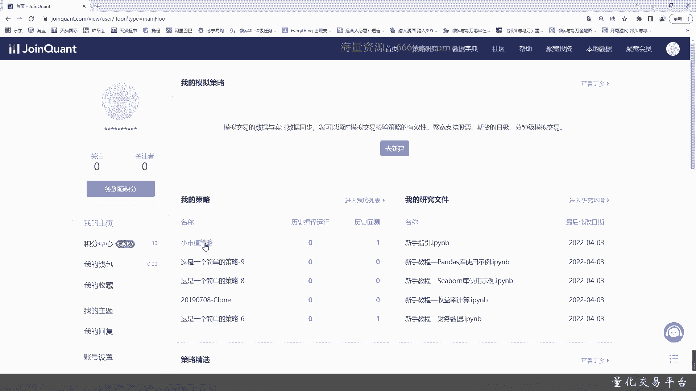
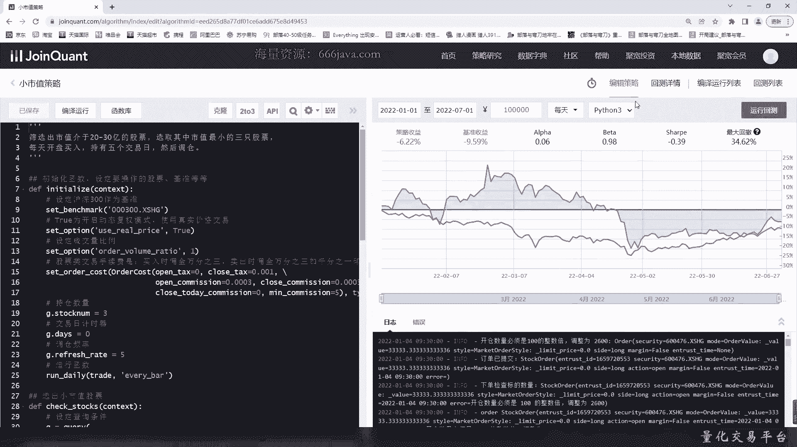
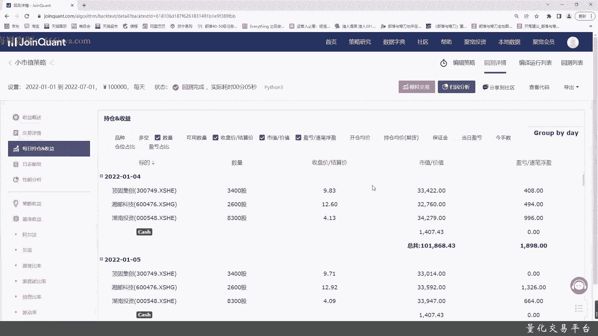
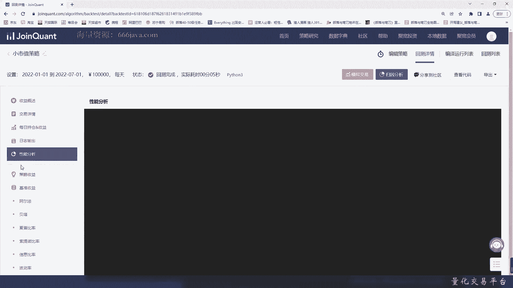
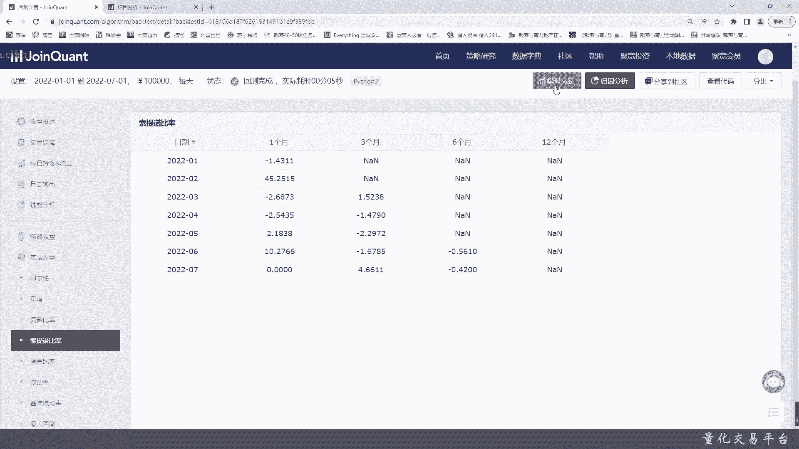
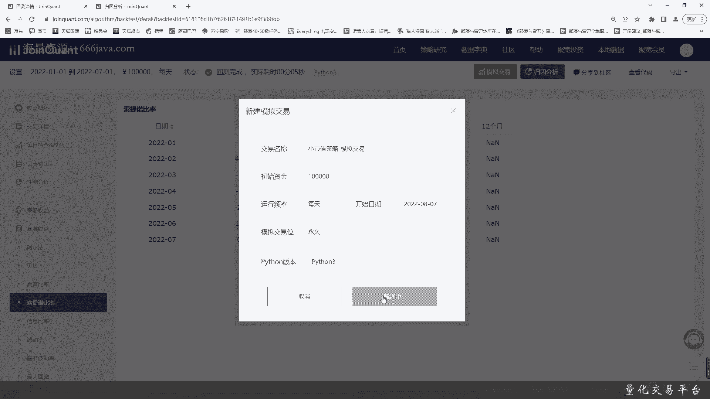
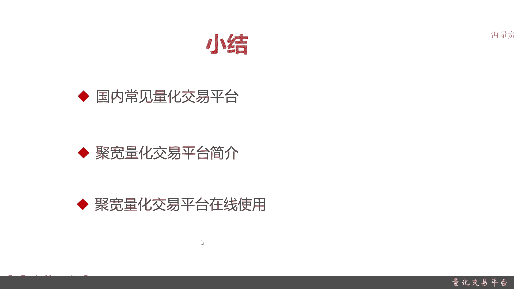

# 基于Python的股票分析与量化交易入门到实践 - P15：3.8 进军量化交易开发第一课-基本的股票交易维度和概念_量化交易平台 - 纸飞机旅行家 - BV1rESFYeEuA

大家好，我是米铁，在上一节呢，我们把股票交易的一些基础知识，都跟大家进行了讲解，那么这一节呢开始我们给大家进行一下，量化交易实际的一些工具的讲解，首先呢我们给大家介绍一下量化交易平台，额。

这一节呢我们可用以下三个地方，给大家进行讲解，量化交易平台，首先呢我们给大家介绍，国内常见的量化交易平台都有哪些，接着呢给大家介绍巨宽量化交易平台，因为国内量化交易平台很多啊。

那我们肯定不可能每一个都给大家介绍，我们只主要给大家选择一个，主流的量化交易平台来给大家进行简介，最后我们给大家介绍一下，区块链化交易平台的在线使用好，那么接下来呢我们给大家介绍一下。

国内常见的量化交易平台，古老规矩啊，首先给大家讲解一下什么是量化交易平台，很好理解啊，量化交易平台其实主要是给大家提供量化数据，策略框架回测以及交易接口，这些都是量化交易研发人员必需的一些功能，呃。

这些所有功能这些功能都自己从头写的，太花费时间了，所以有一些长红线的量化交易平台，那国内有哪些呢，首先第一个是距宽非常嗯早巨宽，然后掘金量化这个也是比较早，再有个big count，再加上一个米框。

这四个呢是国内最早，或者说是第一批做量化交易平台的，他们现在呢呃也转型了部分做商业化，那还有一个这个叫那个trade blazer，它是翻译过来，其实就是交易开拓者，他主要是做期货的。

这是国内常见的量化交易平台，当然了，可能不止这些，主要所常听见的也就这些，那么接下来呢给大家详细讲解一下距宽，这个是距宽自己的介绍，巨宽量化交易平台是为量化，主要还是爱好者，像我们这样初学者。

他们自己有个自己的一个粉丝叫宽客，主要是一个云平台，它有精准的回测功能，高速实盘交易接口，应用API文档以及由易入难的策略库，然后呢，便于我们快速便捷地使用自己的量化交易策略，它有哪些特点呢。

首先是时间久，这个时间久是什么意思呢，指的是它的量化交易数据的跨度九，从2005年到现在的量化交易平台，来交易数据，他们都可以进行查询，接着TK一起的数据啊，这个tick级的数据其实就是滴答。

翻译过来就是比秒更快，一般是毫秒，实际上一笔量化交易，买和卖任何一笔在同一时刻里面进行交易的，它都应该被记录，这个就是TGT，这是最全的交易数据了，一般来说最全的数据只有那个交易所有。

但是呢很多像第三方，比如说巨宽啊，比如说刚刚说的米矿啊，比如说是万德啊，比如说绝境，他们都有，只不过都要进行付费，数据的精准度，tick节的数据的精准度，决定了我们这个量化交易。

最后你自己实现了量化交易策略，究竟能不能满足自己的需求，OK这是TIK级的数据，还有多交易品品种，不仅仅A股，港股，然后那个美股，然后日股还有期货，债券嗯等等等等等等等，据宽这里都可以提供这些数据。

然后呢他们提供非常健全的Python API，兼容python2和python3，最后呢他们还提供实盘交易，当然了，以上这些，有一些是我们在那个我们这一系列讲解的课，里面会用到。

有一些比如说tick级的数据，可能在我们这一节这个比较高级，因为它可能还受到大数据，还有一般来说tick级的数据都不是免费的，呃，我们作为一些初学者呃，对于这些数据可能暂时还用不到。

但是他是一个很很有特色好，还有一个呢就是聚宽量化交易平衡社区，非常非常活跃嗯，他们自己不断在线上还线下，会经常举办一些活动，还有各种很详细的说明文档，他在论坛里面和社区里面呃，发帖回帖的人员比较多。

大家学习起来比较快，好使用区块教练平台，它嗯应该有哪些步骤呢，第一步很简单，肯定是注册账号啊，注册账号嘛，像我们一开始用来学习免费版就够了，然后呢进行试用申请，那你一开始注册完账号的。

只能在线上进行使用，你要在本地化把数据拷下来，你需要进行试用申请，接着呢你就可以在新建策略，从新建策略再到下一步策略回测，再到模拟交易，这些步骤呢，全部都可以在线上化的工具来进行使用。

呃我们待会呢就给大家进行一些讲解好，那么接下来呢我们给大家进行讲解一下，线上使用的情况，这个呢额就是我之前已经注册好的一个巨宽，量化交易平台的那个实际的情况，这是它的主界面，首先你登录好以后就是这样。

我的这个账号现在还没有注册新的那个策略，现在我们给大家进行那些什，这里区块链交易平台，这点非常的好，各种的研究环境，这里是研究环境，这里是已经写好一些策略，你可以用一些运行。

然后它下面呢是一些稍微复杂一点的策略，比如说多因子，然后比如说价值选股与I呃与ISS折时，然后股指期货等等等等等，还有呢他的社区的一些文档，还有推荐的他们自己的一些博主啊，博客之类的，这是他们的首页啊。

我们现在呢这一次主要是给大家看一下，那个量化交易，如果在平台里面怎么样快速的来进行使用，它究竟是个啥，然后怎么去用，那其实很简单，可以新建一些策略的本，我们就比如说拿这个小试试策略点进去。

可以看到这一块是它具体的代码，先是初始化，接着是选择小市值股票，再接着就是具体的交易环数了，这个策略非常非常简单，然后最后呢中间还有一部要过滤停牌的函数，我们在现在这个阶段呢。

并不会给大家进行直接去编写，只是给大家去看一下，然后从后续的课程课时，我们可以从零开始帮助大家去呃，写一些简单的量化交易策略好，然后呢这里面有编译运行啊，你可以点击一下编译运行。

好可以看到这里就已经有编译的一些结果了，现在还正在运行当中，好这些都是一些具体的，之前给大家分享的一些具体指标，比如说收益率，然后这是对比的基准收益率，那上图就是蓝色的，是我们的策略，这个策略的设率。

下图是基准，可以看到目前看从这里看，2020年1月1号到2021天，可以看到基本上明显是好于我们的那个基准，然后阿尔法超核，还有贝塔夏普，这是具体的指标，然后最大回撤也是一种指标。

这里面都是有各种指标的计算公式，感兴趣的同学可以自己来学，然后下面是它具体运行的log，大家可以看一下好吧，简单的这些策略的选手好，我们看一下策略详情。

这是策略的回测，详情可以看到是刚才点击了以后，这里可以详细看到这里的那个指标更全了，再就是本系列课程的策略回测这一章节里面，我们会给大家很详细的介绍各个指标的含义，以及它的基本算法，当然了。

后面大家如果就是呃在实际的代码中编写，我们自己也需要实现自己相关注的，一些核心的指标，那在后面节课我们会给大家详细介绍这些，大家也不用着急，然后这是一个收益的对比图，这里是一个柱状的。

然后呢每日盈亏时间线呢可以随意划，当然了，我们现在的这个免费版本，也就只能是回测到从1月1号到7月1号，然后这是交易详情，这里呢是每一个比单，按照我们现在的那个策略，他买的是啥，卖的是啥。

然后他的成交价会是什么，然后成交股数是具体的，当然你点了不同的选项，比如说你把手续费给减掉，都有不同的结果，然后在下面呢是每日的持仓收益。

大家看看也就好了啊，这些详情都有，然后这是具体的输出日志，当然我们最后完成本系列课程的学习，大家就可以从头到尾，自己从零开始搭建这样类似的情况。

性能分析上是没有啊，然后这是策略的收益，这有些地方是空值，因为他算不出来，因为你是从2020年1月开始算的嘛，近三个月近6月，近12月肯定为零，然后数据只到了2020年7月份，那所以近六个月是有数的。

但是近12个月还是有数，这是一些基准收益，阿尔法贝塔夏普比例，各种详细的指标，然后呢再给大家看一下归因分析，什么是归因分析啊，嗯归因分析，其实就是要理解我到底是怎么赚钱的，我赚钱都赚在什么地方。

那这是一些首先是概览以及一些指标，然后收益的一些详细的分析它究竟赚在哪里啊，然后基本的一些指标，当然有些人可能数据不全算不出来啊，然后他已经拿到了我们持仓，他可以知道我们究竟是买了哪些股。

涨了哪些股跌了，好吧，这个感兴趣的大家可以自己去看一看，但是呢嗯在后面我们还可以进行详细的brazen，归因啊，因此分析啊等等等等等等，这里暂时我就不给大家详细介绍了。

然后下一个给大家实际看一下模拟式交易了。

你这是回测完了以后就是模拟交易，我们就可以从现在开始，我们设计一下一个交易栏位就将开始，今天是8月7号，然后每天大家注册绑定好了以后，可以绑定微信，每天可以看到十分交易结果。

那从现在开始，这就开始进行进行交易了，过段时间大家可以看一下，好以上呢就是聚宽量化交易，通过在线的方式进行操作，非常简单嗯，统计啊，日志啊，然后代码也在这里，大家都可以看到。

现在因为现在这个做的越来越好了，我们现在再回到我们的首页嗯，现在就可以看到我们这里的那个小知识，模拟策略经进行中了以后，每天都可以来进行观察，大家感兴趣，其实很快，像这种新手的注册5分钟。

10分钟就可以完成第一步，这个是第一步，那从下一章节开始呢，我们就要开始通过coding来实现这些具体的量化，交易，策略啊，交易啊，模拟啊，回测啊，还有模拟交易啊，甚至实盘等等等等等，好。

那么接下来呢我们进入总结好，现在进入本章小结，本章首先给大家介绍了，国内的常见量化交易平台，量化交易，其实平台主要是可以理解为，辅助我们各个量化研究开发或者爱好者们，他能方便快捷进行量化交易。

他给大家提供量化的数据，然后呢还给大家提供回测框架，策略框架，还有交易接口等等等等，这是量化交易平台最核心的几个功能，那接着呢是巨宽量化交易平台的一些简介，聚宽量化还还比较早。

国内呢除了巨宽米框big quante，还有掘金都非常早，是非常常见的量化交易平衡，大家其实都差不多的，然后呢嗯这些呢也都支持免费用户和付费用户，我们一开始呢像我们这节课，大家初学者免费就可以付费用户。

它一般来说有什么区别呢，它的数据更加的维度更多，然后时间细腻度更低，比如说呃像我们免费用户，你只能拿到历史的一些数据，然后可能频度最多是天或者小时，就是收盘价，开盘价。

但是呢付费用户你就可以拿到tick级的数据，而且调用次数也都不一样，然后呢区块量化平台它的支持的一些特点，有七个G的数据，然后时间维度非常长，然后支持交易，然后策略回撤接口呢也比较那个更友好。

所以刚刚给大家演示看了，然后还有社区比较活跃好，接下来呢我们给大家演示了它在线使用，首先你得进行注册，注册完了以后试用申请，这几步我之前都已经做过了，所以接下来以后我们就可以通过机关交流平台。

直接在本地进行开发，各位同学呢，这些试用申请，自己直接到机关教育培训平台去申请就可以了，然后呢通过在线的方式呃，区块链会提供一些已经写好的简单的一些策略，当然了，我们自己未来要做那个量化交易的研发人员。

开发人员，这些肯定不可能用语言已经写好的，得自己有能力从头开始去写一下，然后策略有了有了，然后就是模拟运行回测，回测完以后就是模拟交易，模拟交易完以后，像这样的区块链可能就到这里了。

好以上就是本节的内容，感谢大家的收看。

我是一天。