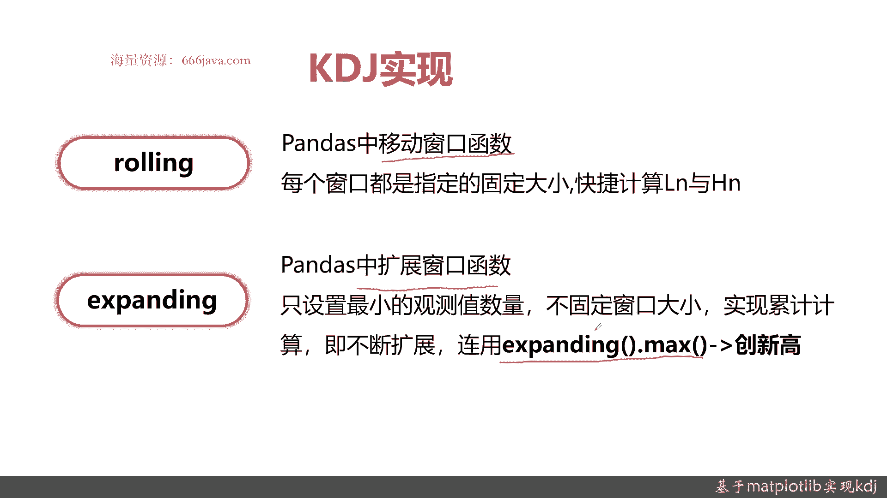
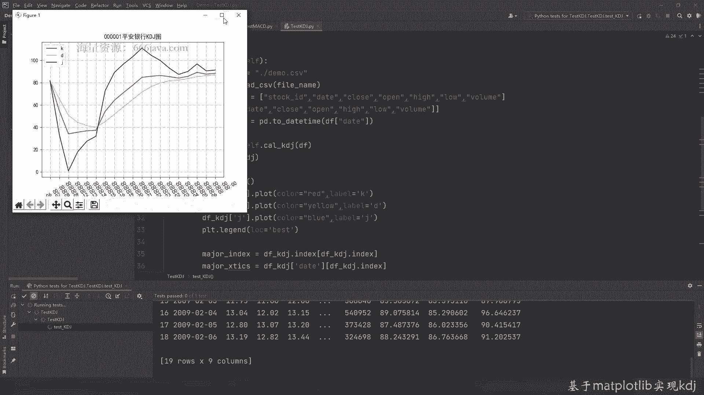

# 基于Python的股票分析与量化交易入门到实践 - P21：6.2 量化交易开发Matplotlib应用-股票技术分析实战_基于Matplotlib实现KDJ - 纸飞机旅行家 - BV1rESFYeEuA

大家好，我是米田，在上一节呢我给大家介绍了，通过matt plot lab如何去画出MACD，那么这一节呢我将给大家介绍，如何通过matlab lab画出KDJ，在这一节呢也是跟上一节类似。

我们从三个方面给大家介绍，如何通过matt pa pb把K1J给画出来，首先呢我们给大家还是介绍一下，KTZ的基本概念，它是个啥，然后有啥作用，接着呢我们会给大家详细的介绍KDJ的算法。

最后呢我们再给大家介绍KDJ，如何通过Python和MATTPROMAP来实现，当然还有还有老样子，还得给大家介绍代码，实战环节好，那么接下来呢我们给大家介绍一下，什么是KDJKD线。

中文名称就叫随机指数，它主要是通过价格波动，来反映这个股价的走势的强弱，和超买的超卖现象，其实它主要是给大家来分析，短期行情的一种技术分析指标，记住重点是超买超卖，然后呢我们来给大家举几个例子。

首先这幅图上面是K线图，K线图是有变化的，那在这个位置KDJ均超过了80，那这么说呢属于超买区，那可能后面就会跌了，尤其是这里发生分叉的时候，大家在这个点可能要着急进行抛了。

然后呢这个区域KDJ小于30，那是属于超卖区，那后面应该会涨，会有阳线了，可以看到是这样，然后呢，这个呢是判断KDJ一个买入和买出的，交易时机的情况，KDJ发生了交叉，那么就有可能去变化，实际情况里说。

其实从这个点开始，这支股票中国化学在这个时间里就会有个上扬，OK好吧，那么接下来呢我们给大家介绍KDJ的具体算法，KT界的具体算法呢主要有以下四个指标构成，ISVKD和J。

其实呢这些指标呢详细的那个业务意义，一般来说大家就不用那么去强记，主要是一些统计学意义，比如说ISV它是未成熟随机指标值，K是当前的K值，D就是当前地址解，就这样，这可能看得一头雾水啊，主要是些公式。

KTJ主要是通过一些统计的算法，找出我们可能的股价变化强弱的情况，比如首先ISV，I s v，其实是收盘价的NN天的均线，减去最低价的均线，然后再比上最高价的均线减去那个最低价进点。

其实就是一个有点类似于加权平均，这种算法其实就是一个等比例缩放的，然后呢这里再除以100，一般来说N取除以NN取九，接着呢是KK呢其实是两个系数，一个是2/3，一个是1/3，当然了。

2/3和1/3都是由约定俗成的，其实你把它改成4/5和1/5也是行，但是一般来说都是2/3和1/3，它是一个窗口偏移量，前一天的K值加上13当日的SV，所以首先必须算出来ISV。

接着呢有了K以外就要算D了，D其实也类似，由K可以算出D其实算法是代入一样的，也是13的K值，当日再加上2/3前一天的地址，最后呢K和D都算出来以后，就算J这也就是三倍的K值减去两倍的地址。

其实正呢完全就是一些统计学的意义了，大家们知道这个算法就好了，OK如果前一日的K值和D值没有，一般它是默认是用50来代替的，所以大家可以看看这些完全基本都是统计的一，而且默认参数也给大家固定好了。

可以理解为，这就是一个有些这些参数就是一个常量值，具体的公式推导呢我们就不在这里展开了，好，我们接下来给大家介绍一下，KDJ程序实现的几个常用的函数，我们现在呢给大家介绍一下KT界实现的。

Python相关的两个常用的函数，这两个函数呢都是pandas常用的，首先是rolling，之前我们给大家介绍指数移动平均均线的时候，用了ew m rolling呢其实也类似。

它也是pandas as里面一个常用的函数，它是pandas中的移动窗口函数，那为什么是要做那个rolling呢，其实刚才前面的公式里面，其实要算CNLN和HN其实就是用的是rolling。

它主要是按照固定窗口大小进行偏移，一般来说N取的是九，会很方便的就可以计算出移动这些均线，接下来呢是expanding，expanding这个函数呢也是pandas中常用的。

它是pandas as当中扩展的窗口函数，这个呢可能之前同学们用的不是特别多，这个在金融工程里面就是用的特别多，一般来说expanding以后它会连用，比如说expanding点max就是创新高的股价。

那expanding点命就是创新低的股价，它主要呢是只设置最小的观测数量不固定，想想他其实有点像累加CONSUM这种加法。

然后呢不断扩展好了，接下来呢我们进入代码实战环节，还是老样子啊，我已经把test case和基本的函数给写给大家了，这一次呢我们还是有两个核心的函数，一个是KDD的算法函数。

还有一个呢是整体的test case，然后我们把画图用到的那个代码的包呢，跟之前一样，一个是pandas，还有一个是MATTPLULAB，那unit test是公用的，我们首先把KDJ的算法给写出来。

我们要把LN和HN给求出来，这里就要用到之前说的loading了，默认参数是九，那learning肯定是选最小值，我们可以给大家简单介绍一下LIN这个参数，它是返回的是个group。

然后呢它其实是窗口移动，具体的感兴趣同学可以自己去查文档，它其实是pandas as，你返回一个GOOLE白的结果，然后我们要做一些容错处理，好这个LN就可以求出来了，现在可以求那个HN，而且要求最大。

也把填充给写出来了，好HN也求出来了，然后呢我们应该求ISV，然后应该是这样相除，再乘以100，好下面求K，这时候呢还要用到EWM，下面求D，D是K是跟那个ISV有关，那EAW其实就跟K有关了。

还是类似，最后求J这样KD解就都求出来了，好那么KDJ就算好了，我们接下来先test case4跑一下KDJ是怎么算的，还是老样子，DF已经把相关的一些数据结构，都把它给准备好了。

那么接下来呢我们直接把KDJ给大家看一下，是什么样子，好那我们接下来呢来算个KDJ，好可以看到这就算出来了，看到吗，这里明显是大于80的，那这里呢开始又变小了，这其实跟之前如果MACD大家还有印象的。

其实是在图里面看看，会有一个明显的变化，这呢就是一些统计值，好，那我们接下来再画图，画图其实还是老样子啊，大家压这块应该比较熟练了，我们就快速的给大家过一下，当然有一些需要注意的地方，我们给大家写。

首先要把KDJ这三根线给声明，首先声明K线，然后给他复颜色，我们K线就用red吧，然后定义K线的参考系的labor，然后我们再给他付D显，就给他黄色吧，然后是J，就blue吧，啊这里不好意思。

这里应该是有个拼错的地方，好j cola应该也拼错了，这里面一般来说没有自动提示，会容易拼错，把它给声明，然后再声明一个index和X负轴的，来XXROLABOR，我们是以日期作为呈现，这个也声明好了。

我们把X的步进值设置一下，好然后我们可以附一下网格线，Line in style，好平安银行的KD贴图，然后给他附文字的格式，这里有拼错的修正一下，Uniquo，点minus，好，中文好。

OK那这样的话代码这里呢应该就差不多了，我们来测试一下，好简单的这个KDJ的图就可以看了，大家可以自大放出。

看看结果可以看到这里有一个明显的交叉，然后慢慢慢慢是超买，一开始呢逐渐是在80呢，这里是有个超买的情况，然后慢慢慢慢慢都在下跌，那都到这里呢就已经到谷底了，到了谷底以后。

这两天一直在进行准备交叉再上演了，这个时候呢它有个交叉了，就是这里其实也是在卖的，然后这里一开始找从这里经叉这里，OK那我们这个KT接图就已经画好了，那接下来呢我们给大家进行一下本章的小结。

首先呢是KDJ的介绍，KDJ呢其实它主要是一些统计的学的意义，它主要是呢反映股价，短期行情的超买和超卖的情况，大家记住这个就可以了，具体还为什么去推导呢，我们在本节课程呢不向大家解这条。

因为有涉及到非常多的数学和金融知识，接下来呢我们给大家介绍KDJ的算法，KDJ算法核心四个指标，首先算ISV，算完阿斯代S以后算K然后呢算D算J，这是一个顺序，其实是按步骤就可以介绍了，当然了。

如果同学们对这个感兴趣，可以自己去参考相关的书籍和算法公式，具体是怎么推导的，ISV呢你就可以理解为当前的随机一个值，它其实主要它的算法，其实就是收盘价减去它的LN。

再除以high n减去它的LN是什么意思呢，它就是一个比例放大，然后呢再除以一个一百一百N呢取九，然后K值呢一般系数是23和13，前一天的K值它其实是一个窗口移动，减去当天的IS位置。

这里是简单给大家回顾一下，然后再记住这个D的算法呢，其实又跟K的算法类似，只有J的算法呢是不一样的，J的算法是三乘以当天的K值减去两倍的地址，O这是简单的公式，然后呢如果K和D它都当前一天没有值的话。

就是50好，接下来呢给大家进行K链接，实现算法其实很好记啊，但是实现起来就是如果不借助pandas as，如果自己完全去写，重新写一遍呢，其实是很复杂的，pandas as有两个很好的函数。

一个是rolling，一个是expanding，之前给大家介绍了EWM那个指数运营系中，均线的像rolling，它就是移动窗口，然后expanding expansion main其实就是最小值。

expanding max是创新高的股价高值，这里之前在直接在他们都给大家解释了，好的，那么现在呢我们就给了他回顾了本节的内容，以上呢就是本节的全部内容，我是米tea。

